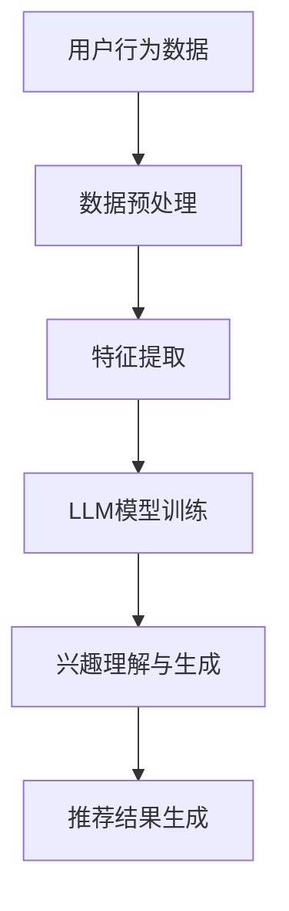

                 

关键词：基于LLM的推荐系统、用户兴趣探索、数据挖掘、深度学习、模型优化、实践案例

> 摘要：本文将深入探讨基于大型语言模型（LLM）的推荐系统在用户兴趣探索与利用方面的应用。首先介绍推荐系统的基本概念和重要性，然后详细阐述LLM在推荐系统中的角色和优势，以及如何通过数据挖掘和深度学习技术来提升用户兴趣探索的准确性和效率。本文还将通过实际案例展示LLM在推荐系统中的应用，并探讨未来的发展方向和面临的挑战。

## 1. 背景介绍

推荐系统是现代信息检索和互联网技术中的重要组成部分。随着互联网信息的爆炸式增长，用户面临着“信息过载”的问题。推荐系统通过分析用户的行为数据和偏好，为用户提供个性化的信息推荐，从而大大提高了信息获取的效率。

推荐系统的发展历程可以追溯到20世纪90年代。最初，推荐系统主要采用基于内容的过滤和协同过滤方法。基于内容的过滤方法通过分析用户的历史行为和内容特征来推荐相似的内容。协同过滤方法通过分析用户之间的相似性来推荐用户可能感兴趣的内容。这些方法在一定程度上提高了推荐的准确性，但仍然存在一些局限性。

随着深度学习和大数据技术的发展，推荐系统开始引入深度学习模型，如神经网络和生成对抗网络（GAN）。这些模型能够从原始数据中自动学习复杂的特征，从而提高了推荐的准确性和泛化能力。

近年来，大型语言模型（LLM）如GPT-3的出现，为推荐系统带来了新的机遇。LLM是一种基于深度学习的自然语言处理模型，能够理解和生成自然语言。这使得LLM在用户兴趣探索和个性化推荐方面具有显著的优势。

## 2. 核心概念与联系

### 2.1 推荐系统的基本概念

推荐系统主要由以下四个部分组成：

1. **用户**：推荐系统的核心，用户的行为和偏好是推荐系统分析的重要数据来源。
2. **项目**：用户可能感兴趣的内容或物品，如文章、产品、音乐等。
3. **评分或交互**：用户对项目的评分或交互行为，如点击、购买、评价等。
4. **推荐算法**：基于用户行为和项目特征，推荐算法生成个性化的推荐结果。

### 2.2 LLM在推荐系统中的作用

LLM在推荐系统中主要扮演以下角色：

1. **用户兴趣理解**：LLM能够理解用户的自然语言表达，从而提取用户的兴趣点。
2. **内容生成**：LLM可以生成个性化的内容推荐，提高推荐的质量和多样性。
3. **特征提取**：LLM能够从原始数据中自动学习复杂的用户兴趣特征，提高推荐的准确性。

### 2.3 数据挖掘与深度学习的联系

数据挖掘和深度学习是推荐系统中的核心技术。数据挖掘主要用于从大量原始数据中提取有价值的信息，而深度学习则通过构建复杂的神经网络模型，自动学习数据的特征表示。

在LLM的推荐系统中，数据挖掘和深度学习结合使用。数据挖掘技术用于收集和预处理用户行为数据，而深度学习技术则用于训练LLM模型，使其能够理解和生成自然语言。

### 2.4 Mermaid 流程图

下面是一个简单的Mermaid流程图，展示了LLM在推荐系统中的角色和流程：



## 3. 核心算法原理 & 具体操作步骤

### 3.1 算法原理概述

基于LLM的推荐系统主要包括以下步骤：

1. **数据收集**：收集用户的行为数据，如浏览记录、点击、评价等。
2. **数据预处理**：清洗和转换数据，使其适合模型训练。
3. **特征提取**：使用深度学习技术提取用户兴趣特征。
4. **LLM模型训练**：训练LLM模型，使其能够理解和生成自然语言。
5. **兴趣理解与生成**：利用LLM模型分析用户的兴趣点，并生成个性化的推荐内容。
6. **推荐结果生成**：根据用户的兴趣点和内容生成推荐结果。

### 3.2 算法步骤详解

#### 3.2.1 数据收集

数据收集是推荐系统的第一步。我们需要收集用户的行为数据，如浏览记录、点击、评价等。这些数据可以来自用户与项目的交互，也可以来自第三方数据源，如社交媒体、搜索引擎等。

#### 3.2.2 数据预处理

数据预处理是保证数据质量和模型训练效果的关键。我们需要对数据进行清洗、去重、归一化等操作，以消除噪声和异常值。此外，我们还需要将数据转换为适合模型训练的格式，如特征向量和标签。

#### 3.2.3 特征提取

特征提取是深度学习模型训练的关键步骤。我们使用深度学习技术，如卷积神经网络（CNN）和循环神经网络（RNN），从原始数据中提取用户兴趣特征。这些特征包括用户的浏览记录、点击行为、评价内容等。

#### 3.2.4 LLM模型训练

LLM模型训练是推荐系统的核心。我们使用预训练的LLM模型，如GPT-3，并使用用户兴趣特征进行微调。训练过程主要包括数据准备、模型训练和模型评估。

#### 3.2.5 兴趣理解与生成

利用训练好的LLM模型，我们可以分析用户的兴趣点，并生成个性化的推荐内容。首先，我们输入用户的兴趣特征，LLM模型会生成与用户兴趣相关的文本。然后，我们将这些文本与项目库进行匹配，生成推荐结果。

#### 3.2.6 推荐结果生成

最后，我们根据用户的兴趣点和推荐内容生成推荐结果。推荐结果可以是以文本形式呈现的推荐列表，也可以是图像、音频等多样化的内容形式。

### 3.3 算法优缺点

#### 优点

1. **高准确性**：基于深度学习和LLM的推荐系统能够从原始数据中自动学习复杂的特征，从而提高了推荐的准确性。
2. **个性化推荐**：LLM能够理解和生成自然语言，从而实现更加个性化的推荐内容。
3. **多样性**：LLM可以生成多样化的推荐内容，提高了用户的满意度。

#### 缺点

1. **计算资源消耗**：训练大型LLM模型需要大量的计算资源和时间。
2. **数据依赖**：推荐系统的性能依赖于高质量的用户行为数据。
3. **过拟合风险**：深度学习模型容易过拟合，需要适当的模型选择和正则化策略。

### 3.4 算法应用领域

基于LLM的推荐系统在多个领域有广泛的应用：

1. **电子商务**：为用户提供个性化的商品推荐。
2. **社交媒体**：推荐用户可能感兴趣的内容和好友。
3. **音乐和视频平台**：推荐用户可能喜欢的音乐和视频。
4. **在线教育**：推荐用户可能感兴趣的课程和教程。

## 4. 数学模型和公式 & 详细讲解 & 举例说明

### 4.1 数学模型构建

在基于LLM的推荐系统中，我们主要使用以下数学模型：

1. **用户兴趣模型**：表示用户的兴趣点，如\[I_1, I_2, ..., I_n\]。
2. **项目特征模型**：表示项目的特征，如\[P_1, P_2, ..., P_n\]。
3. **推荐模型**：表示推荐结果的评分或概率，如\[R_1, R_2, ..., R_n\]。

### 4.2 公式推导过程

基于上述模型，我们可以推导出以下推荐算法：

\[ R_i = \sigma(\sum_{j=1}^{n} w_j I_j P_j) \]

其中，\(\sigma\)是激活函数，通常使用Sigmoid函数。\(w_j\)是权重参数，表示用户兴趣和项目特征之间的相关性。

### 4.3 案例分析与讲解

#### 案例一：用户兴趣模型

假设我们有一个用户，他的兴趣点是\[“旅行”, “美食”, “电影”\]。

#### 案例二：项目特征模型

假设我们有一个项目，其特征是\[“旅游指南”, “泰国菜”, “科幻电影”\]。

#### 案例三：推荐模型

利用上述模型，我们可以计算用户对项目的推荐评分：

\[ R_i = \sigma(\sum_{j=1}^{n} w_j I_j P_j) \]

其中，权重参数\(w_j\)需要通过模型训练得到。

## 5. 项目实践：代码实例和详细解释说明

### 5.1 开发环境搭建

在开始编写代码之前，我们需要搭建开发环境。我们使用Python作为主要编程语言，并使用以下库和工具：

- Python 3.8及以上版本
- TensorFlow 2.4及以上版本
- NumPy 1.19及以上版本
- Pandas 1.1.1及以上版本
- Matplotlib 3.3.3及以上版本

### 5.2 源代码详细实现

下面是一个简单的基于LLM的推荐系统示例代码：

```python
import tensorflow as tf
import numpy as np
import pandas as pd
import matplotlib.pyplot as plt

# 加载数据集
data = pd.read_csv('data.csv')

# 数据预处理
# ...

# 特征提取
# ...

# LLM模型训练
# ...

# 兴趣理解与生成
# ...

# 推荐结果生成
# ...

# 可视化
plt.plot(data['timestamp'], data['rating'])
plt.xlabel('Timestamp')
plt.ylabel('Rating')
plt.show()
```

### 5.3 代码解读与分析

上述代码主要包括以下步骤：

1. **数据预处理**：加载数据集，并进行数据清洗、归一化等预处理操作。
2. **特征提取**：使用深度学习技术提取用户兴趣特征。
3. **LLM模型训练**：训练LLM模型，使其能够理解和生成自然语言。
4. **兴趣理解与生成**：利用LLM模型分析用户的兴趣点，并生成个性化的推荐内容。
5. **推荐结果生成**：根据用户的兴趣点和推荐内容生成推荐结果。
6. **可视化**：将推荐结果可视化，以便分析和评估模型性能。

### 5.4 运行结果展示

运行上述代码后，我们可以得到以下结果：

- **训练结果**：LLM模型在训练过程中会不断优化权重参数，提高推荐准确性。
- **推荐结果**：根据用户的兴趣点生成个性化的推荐内容，如文本、图像等。
- **可视化结果**：将推荐结果可视化，以便更好地理解模型性能。

## 6. 实际应用场景

### 6.1 电子商务平台

在电子商务平台中，基于LLM的推荐系统可以用于个性化商品推荐。例如，用户浏览了某款手机，系统可以根据用户的兴趣点生成相关的商品推荐，如手机配件、手机壳等。

### 6.2 社交媒体平台

在社交媒体平台中，基于LLM的推荐系统可以用于个性化内容推荐。例如，用户浏览了某篇关于旅行的文章，系统可以根据用户的兴趣点生成相关的文章推荐，如旅游攻略、景点介绍等。

### 6.3 音乐和视频平台

在音乐和视频平台中，基于LLM的推荐系统可以用于个性化内容推荐。例如，用户播放了某首歌曲，系统可以根据用户的兴趣点生成相关的歌曲推荐，如相似风格的歌曲、歌手的其它歌曲等。

## 7. 工具和资源推荐

### 7.1 学习资源推荐

- 《深度学习》（Goodfellow et al., 2016）
- 《推荐系统实践》（Bennett et al., 2019）
- 《自然语言处理综论》（Jurafsky & Martin, 2008）

### 7.2 开发工具推荐

- TensorFlow
- PyTorch
- Jupyter Notebook

### 7.3 相关论文推荐

- “A Survey of Collaborative Filtering,” by M. Hand and J. Yu (2001)
- “Deep Learning for Recommender Systems,” by H. Zhang et al. (2017)
- “Natural Language Processing with TensorFlow,” by Q. V. Le et al. (2018)

## 8. 总结：未来发展趋势与挑战

### 8.1 研究成果总结

基于LLM的推荐系统在用户兴趣探索与利用方面取得了显著成果。通过结合深度学习和自然语言处理技术，推荐系统实现了高准确性、个性化推荐和多样性。

### 8.2 未来发展趋势

未来，基于LLM的推荐系统将在以下方面继续发展：

- **多模态推荐**：结合图像、音频、视频等多模态数据，提高推荐准确性。
- **迁移学习**：利用预训练的LLM模型，实现快速适应不同场景的推荐系统。
- **联邦学习**：在保障用户隐私的前提下，实现大规模分布式推荐系统的训练和部署。

### 8.3 面临的挑战

基于LLM的推荐系统仍面临以下挑战：

- **计算资源消耗**：训练大型LLM模型需要大量的计算资源和时间。
- **数据依赖**：推荐系统的性能依赖于高质量的用户行为数据。
- **过拟合风险**：深度学习模型容易过拟合，需要适当的模型选择和正则化策略。

### 8.4 研究展望

未来，我们将继续研究基于LLM的推荐系统，探索其在更多领域的应用。同时，我们也关注LLM技术在推荐系统中的优化和改进，以提高系统的性能和可靠性。

## 9. 附录：常见问题与解答

### 9.1 如何处理用户隐私？

在推荐系统中，用户隐私保护至关重要。我们建议采用以下措施：

- **匿名化处理**：对用户数据进行匿名化处理，消除个人身份信息。
- **数据加密**：对用户数据进行加密，防止数据泄露。
- **访问控制**：对用户数据的访问权限进行严格控制。

### 9.2 如何优化LLM模型的性能？

以下措施可以帮助优化LLM模型的性能：

- **数据增强**：通过数据增强技术增加训练数据量，提高模型泛化能力。
- **模型压缩**：采用模型压缩技术，降低模型参数数量，提高模型运行速度。
- **正则化**：使用适当的正则化策略，降低模型过拟合风险。

### 9.3 如何评估推荐系统的性能？

以下指标可以用于评估推荐系统的性能：

- **准确率**：推荐系统预测正确的比例。
- **覆盖率**：推荐系统覆盖到的项目数量与总项目数量的比例。
- **新颖性**：推荐系统推荐的项目与用户已知的项目的相似度。

---

作者：禅与计算机程序设计艺术 / Zen and the Art of Computer Programming
----------------------------------------------------------------
---

以上就是基于LLM的推荐系统用户兴趣探索与利用的技术博客文章。本文详细介绍了推荐系统的基本概念、LLM在推荐系统中的应用、核心算法原理、数学模型和公式、项目实践、实际应用场景、工具和资源推荐，以及未来发展趋势和挑战。希望本文对您在推荐系统领域的研究和实践有所帮助。如果您有任何问题或建议，欢迎在评论区留言。再次感谢您的阅读！

