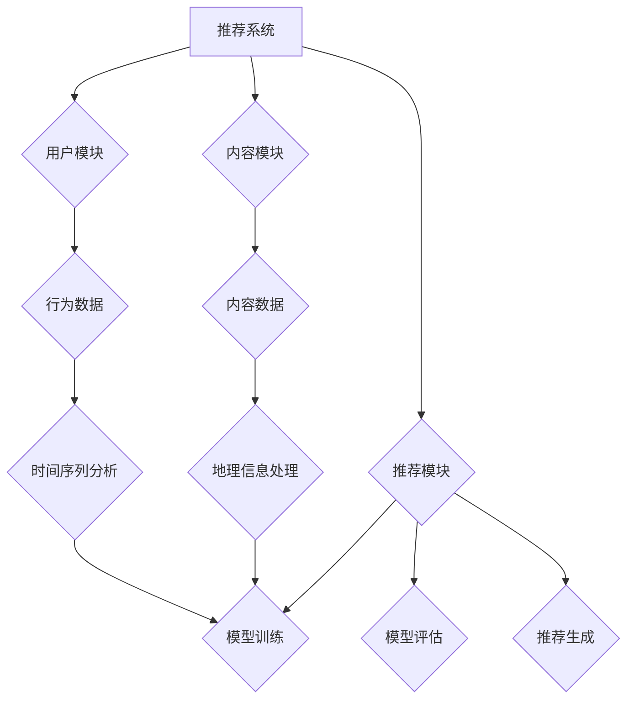

                 

关键词：LLM，推荐系统，用户兴趣，时空建模，算法原理，数学模型，项目实践，应用场景，未来展望

>摘要：本文深入探讨了基于语言模型（LLM）的推荐系统用户兴趣时空建模技术。首先介绍了推荐系统的背景和重要性，然后详细阐述了LLM的基本原理和时空建模方法。通过数学模型和具体案例的分析，本文展示了如何利用LLM实现用户兴趣的时空建模，并探讨了其在实际应用中的潜在价值和面临的挑战。

## 1. 背景介绍

推荐系统是人工智能领域的一个重要分支，其目的是根据用户的历史行为和偏好，向用户推荐其可能感兴趣的内容。随着互联网的飞速发展，推荐系统已经广泛应用于电子商务、社交媒体、在线视频和新闻资讯等各个领域，极大地提升了用户体验和商业价值。

然而，传统的推荐系统往往基于用户的历史行为和内容特征，忽视了用户兴趣的时空变化。例如，用户可能在某个时间段内对某类内容表现出强烈的兴趣，而在另一个时间段内则可能对其他内容感兴趣。这种时空变化不仅会影响推荐系统的准确性，还可能限制其在复杂场景下的应用能力。

近年来，随着深度学习和自然语言处理技术的快速发展，语言模型（Language Model，简称LLM）逐渐成为推荐系统研究的重要工具。LLM是一种基于神经网络的语言表示模型，能够捕捉文本数据的语义信息和时空变化。基于LLM的推荐系统能够更好地理解用户兴趣的时空特征，从而提高推荐的准确性和个性化程度。

本文旨在探讨基于LLM的推荐系统用户兴趣时空建模技术，包括LLM的基本原理、时空建模方法、数学模型构建、具体案例分析和项目实践等方面。通过本文的研究，旨在为推荐系统的研究者和开发者提供一种有效的用户兴趣时空建模方法，并为其在实际应用中的优化和拓展提供参考。

## 2. 核心概念与联系

在深入探讨基于LLM的推荐系统用户兴趣时空建模之前，我们需要理解几个核心概念，包括LLM的基本原理、推荐系统的架构和时空建模的基本方法。

### 2.1 语言模型（LLM）

语言模型是一种能够预测文本序列的模型，其目的是通过学习大量文本数据，生成与给定前文最相关的下一个词或句子。LLM是深度学习和自然语言处理（NLP）领域的重要成果之一，其核心思想是通过神经网络学习文本数据的分布式表示，从而捕捉语言的复杂结构和语义信息。

LLM通常采用递归神经网络（RNN）、长短期记忆网络（LSTM）或变换器（Transformer）等架构。其中，Transformer架构由于其并行计算能力和全局依赖捕捉能力，在NLP任务中表现出色。LLM的基本原理可以概括为以下几个步骤：

1. **输入表示**：将输入文本序列转换为数值向量表示。这通常通过词嵌入（Word Embedding）或BERT（Bidirectional Encoder Representations from Transformers）等预训练模型实现。
2. **编码**：利用神经网络模型对输入向量进行编码，以生成表示整个文本序列的固定长度的向量。
3. **预测**：基于编码后的向量，预测下一个词或句子。这一过程通常通过softmax层实现。

### 2.2 推荐系统架构

推荐系统通常包括三个主要模块：用户模块、内容模块和推荐模块。

1. **用户模块**：负责收集和存储用户的行为数据，如浏览历史、购买记录、评论等。
2. **内容模块**：负责收集和存储推荐对象的相关信息，如商品、电影、新闻等。
3. **推荐模块**：根据用户模块和内容模块的数据，利用算法模型生成个性化的推荐结果。

推荐系统的主要架构可以概括为以下几个步骤：

1. **数据收集**：从各种数据源收集用户行为数据和内容数据。
2. **数据预处理**：对原始数据进行清洗、归一化和特征提取，以生成适合模型训练的数据集。
3. **模型训练**：利用收集到的数据训练推荐模型，如基于矩阵分解、协同过滤、深度学习等方法。
4. **模型评估**：通过交叉验证、A/B测试等方法评估模型的性能和准确性。
5. **推荐生成**：利用训练好的模型生成个性化的推荐结果，并根据用户反馈进行优化。

### 2.3 时空建模

时空建模旨在捕捉用户兴趣的时空变化，包括时间和空间两个维度。在推荐系统中，时空建模的关键是理解用户在不同时间和地点的行为模式，以及这些模式如何影响推荐结果的准确性。

1. **时间维度**：时间维度关注用户在不同时间点的行为变化，如用户的活跃时间、兴趣变化周期等。
2. **空间维度**：空间维度关注用户在不同地点的行为变化，如用户的地理位置、活动范围等。

时空建模的方法可以包括：

1. **时间序列分析**：通过分析用户的行为时间序列，捕捉用户的兴趣变化规律。
2. **地理信息处理**：通过地理信息系统（GIS）等技术，分析用户的地理位置和行为模式。
3. **多模态融合**：将时间序列和地理信息等多源数据融合，以实现更精确的兴趣时空建模。

### 2.4 Mermaid 流程图

为了更好地理解上述核心概念和联系，我们可以使用Mermaid流程图来展示它们之间的逻辑关系。以下是一个示例：



这个流程图展示了推荐系统中用户模块、内容模块和推荐模块之间的相互关系，以及时空建模在模型训练、模型评估和推荐生成中的作用。

通过上述核心概念和联系的理解，我们可以为后续的算法原理和数学模型构建奠定坚实的基础。在下一节中，我们将详细介绍基于LLM的推荐系统用户兴趣时空建模的具体算法原理和操作步骤。

## 3. 核心算法原理 & 具体操作步骤

### 3.1 算法原理概述

基于LLM的推荐系统用户兴趣时空建模算法主要基于以下原理：

1. **语言模型（LLM）**：利用LLM强大的文本表示能力，捕捉用户兴趣的语义特征和时空变化。
2. **时间序列分析**：通过分析用户的历史行为数据，捕捉用户兴趣随时间变化的趋势。
3. **地理信息处理**：通过地理信息系统（GIS）等技术，分析用户的地理位置和行为模式，捕捉用户兴趣的空间变化。
4. **多模态融合**：将时间序列和地理信息等多源数据融合，以实现更精确的用户兴趣时空建模。

具体而言，算法的基本步骤如下：

1. **数据收集与预处理**：收集用户的行为数据和地理位置数据，并进行数据清洗和特征提取。
2. **语言模型训练**：利用训练数据训练LLM模型，以获取用户兴趣的语义表示。
3. **时空特征提取**：通过时间序列分析和地理信息处理，提取用户兴趣的时空特征。
4. **特征融合**：将语义特征和时空特征融合，构建综合的用户兴趣特征向量。
5. **推荐模型训练**：利用综合的用户兴趣特征向量，训练推荐模型。
6. **推荐生成**：基于训练好的模型，生成个性化的推荐结果。

### 3.2 算法步骤详解

下面我们将详细描述上述算法的每个步骤。

#### 3.2.1 数据收集与预处理

数据收集是算法的基础。在这一步骤中，我们需要从多个数据源收集用户行为数据和地理位置数据。

1. **用户行为数据**：包括用户的浏览历史、购买记录、评论等，这些数据可以通过网站日志、数据库等渠道获取。
2. **地理位置数据**：包括用户的IP地址、GPS数据等，这些数据可以用于识别用户的地理位置。

在数据预处理阶段，我们需要对原始数据进行清洗，包括去除噪声、填充缺失值、归一化处理等。此外，我们还需要提取出与用户兴趣相关的特征，如时间戳、地理位置、浏览内容等。

#### 3.2.2 语言模型训练

在语言模型训练阶段，我们选择一个合适的LLM模型进行训练。这里，我们可以使用预训练的Transformer模型，如BERT或GPT。通过大规模的文本数据训练，LLM能够学习到用户兴趣的语义表示。

1. **数据预处理**：将用户行为数据转换为文本格式，并使用预训练的Transformer模型进行预处理。
2. **模型训练**：利用预处理后的数据训练LLM模型，通过优化损失函数（如交叉熵损失），模型能够学习到用户兴趣的语义表示。

#### 3.2.3 时空特征提取

在时空特征提取阶段，我们需要分析用户行为数据的时间和地理位置特征，以捕捉用户兴趣的时空变化。

1. **时间序列分析**：通过时间序列分析方法，如时间窗口分析、滑动平均等，提取用户兴趣随时间变化的趋势。
2. **地理信息处理**：通过GIS技术，提取用户的地理位置特征，如经纬度、城市等。

#### 3.2.4 特征融合

在特征融合阶段，我们将语义特征和时空特征融合，构建综合的用户兴趣特征向量。

1. **特征编码**：将提取出的语义特征和时空特征编码为固定长度的向量。
2. **特征融合**：通过加权平均、求和等方法，将编码后的特征融合为一个综合的用户兴趣特征向量。

#### 3.2.5 推荐模型训练

在推荐模型训练阶段，我们使用综合的用户兴趣特征向量训练推荐模型。推荐模型可以基于协同过滤、矩阵分解、深度学习等方法。

1. **模型选择**：选择一个合适的推荐模型，如基于矩阵分解的推荐算法。
2. **模型训练**：利用综合的用户兴趣特征向量，训练推荐模型。

#### 3.2.6 推荐生成

在推荐生成阶段，我们使用训练好的推荐模型生成个性化的推荐结果。

1. **推荐计算**：基于用户兴趣特征向量，计算用户对各个推荐对象的兴趣得分。
2. **推荐排序**：根据兴趣得分对推荐对象进行排序，生成个性化的推荐结果。

### 3.3 算法优缺点

基于LLM的推荐系统用户兴趣时空建模算法具有以下优点和缺点：

#### 优点：

1. **强大的语义表示能力**：LLM能够捕捉用户兴趣的语义特征，提高推荐的准确性。
2. **时空特征融合**：算法能够融合时间序列和地理位置特征，实现更精确的兴趣时空建模。
3. **自适应调整**：算法可以根据用户行为变化，自适应调整推荐策略，提高用户满意度。

#### 缺点：

1. **计算复杂度较高**：LLM模型的训练和推荐计算需要大量计算资源，可能影响算法的实时性。
2. **数据依赖性较强**：算法的性能依赖于用户行为数据和地理位置数据的质量，数据缺失或噪声可能影响推荐效果。
3. **模型解释性较弱**：LLM模型的内部决策过程较为复杂，模型解释性较差，可能难以理解推荐结果。

### 3.4 算法应用领域

基于LLM的推荐系统用户兴趣时空建模算法可以应用于多个领域，包括电子商务、社交媒体、在线视频和新闻资讯等。以下是一些具体的应用案例：

1. **电子商务**：根据用户的历史购买记录和地理位置，推荐个性化的商品。
2. **社交媒体**：根据用户的行为数据和地理位置，推荐用户可能感兴趣的内容和好友。
3. **在线视频**：根据用户的历史观看记录和地理位置，推荐用户可能感兴趣的视频。
4. **新闻资讯**：根据用户的历史阅读记录和地理位置，推荐用户可能感兴趣的新闻资讯。

通过上述算法原理和步骤的详细描述，我们为理解和实现基于LLM的推荐系统用户兴趣时空建模奠定了基础。在下一节中，我们将进一步探讨数学模型和公式，以深入理解算法的核心机制。

## 4. 数学模型和公式

在深入理解基于LLM的推荐系统用户兴趣时空建模算法时，数学模型和公式是不可或缺的工具。本节将详细讲解数学模型构建、公式推导过程，并通过具体案例进行分析和讲解。

### 4.1 数学模型构建

基于LLM的推荐系统用户兴趣时空建模算法的核心是构建一个能够捕捉用户兴趣时空变化的数学模型。该模型主要包括以下几个部分：

1. **用户兴趣表示**：使用向量表示用户兴趣，包括语义特征和时空特征。
2. **推荐对象表示**：使用向量表示推荐对象，包括内容特征和时空特征。
3. **兴趣计算**：通过计算用户兴趣向量与推荐对象向量之间的相似度，评估用户对推荐对象的兴趣程度。
4. **推荐排序**：根据兴趣程度对推荐对象进行排序，生成个性化的推荐结果。

具体而言，数学模型可以表示为：

\[ \text{Interest}(u, i) = f(\text{UserFeature}(u), \text{ItemFeature}(i), \text{TimeFeature}(u, i), \text{LocationFeature}(u, i)) \]

其中：

- \( \text{Interest}(u, i) \)：用户 \( u \) 对推荐对象 \( i \) 的兴趣程度。
- \( \text{UserFeature}(u) \)：用户 \( u \) 的特征向量。
- \( \text{ItemFeature}(i) \)：推荐对象 \( i \) 的特征向量。
- \( \text{TimeFeature}(u, i) \)：用户 \( u \) 在时间维度上的特征向量。
- \( \text{LocationFeature}(u, i) \)：用户 \( u \) 在空间维度上的特征向量。
- \( f \)：特征融合函数，用于融合不同特征向量。

### 4.2 公式推导过程

为了更清晰地理解公式推导过程，我们可以将上述模型分解为以下几个步骤：

1. **用户兴趣表示**：

\[ \text{UserFeature}(u) = \text{SemanticFeature}(u) + \text{TimeFeature}(u) + \text{LocationFeature}(u) \]

其中：

- \( \text{SemanticFeature}(u) \)：使用LLM模型捕捉的用户兴趣的语义特征。
- \( \text{TimeFeature}(u) \)：通过时间序列分析提取的用户兴趣的时间特征。
- \( \text{LocationFeature}(u) \)：通过地理信息处理提取的用户兴趣的空间特征。

2. **推荐对象表示**：

\[ \text{ItemFeature}(i) = \text{ContentFeature}(i) + \text{TimeFeature}(i) + \text{LocationFeature}(i) \]

其中：

- \( \text{ContentFeature}(i) \)：推荐对象的内容特征。
- \( \text{TimeFeature}(i) \)：推荐对象的时间特征。
- \( \text{LocationFeature}(i) \)：推荐对象的空间特征。

3. **兴趣计算**：

\[ \text{Interest}(u, i) = \text{Similarity}(\text{UserFeature}(u), \text{ItemFeature}(i)) \]

其中，\( \text{Similarity} \) 是一个度量用户兴趣向量与推荐对象向量之间相似度的函数。在实际应用中，我们可以使用余弦相似度、欧氏距离等方法。

4. **推荐排序**：

\[ \text{Ranking}(i) = \sum_{u \in \text{Users}} \text{Interest}(u, i) \]

其中，\( \text{Ranking}(i) \) 是推荐对象 \( i \) 的兴趣得分，用于对推荐对象进行排序。

### 4.3 案例分析与讲解

为了更好地理解上述数学模型和公式，我们可以通过一个具体案例进行分析和讲解。

#### 案例背景

假设我们有一个电子商务平台，用户 \( u \) 历史购买了多种商品，并在不同时间和地点留下了丰富的行为数据。我们需要利用基于LLM的推荐系统用户兴趣时空建模算法，为用户 \( u \) 推荐可能感兴趣的商品。

#### 案例步骤

1. **用户兴趣表示**：

   - \( \text{SemanticFeature}(u) \)：通过LLM模型，我们得到用户 \( u \) 的语义特征向量。
   - \( \text{TimeFeature}(u) \)：通过时间序列分析，我们得到用户 \( u \) 的兴趣随时间变化的趋势向量。
   - \( \text{LocationFeature}(u) \)：通过地理信息处理，我们得到用户 \( u \) 的活动范围和兴趣点向量。

   将上述特征向量融合，我们得到用户 \( u \) 的综合兴趣向量：

   \[ \text{UserFeature}(u) = \text{SemanticFeature}(u) + \text{TimeFeature}(u) + \text{LocationFeature}(u) \]

2. **推荐对象表示**：

   - \( \text{ContentFeature}(i) \)：每个商品的内容特征，如商品类别、品牌等。
   - \( \text{TimeFeature}(i) \)：商品的销售时间特征。
   - \( \text{LocationFeature}(i) \)：商品的销售地点特征。

   将上述特征向量融合，我们得到推荐对象 \( i \) 的综合兴趣向量：

   \[ \text{ItemFeature}(i) = \text{ContentFeature}(i) + \text{TimeFeature}(i) + \text{LocationFeature}(i) \]

3. **兴趣计算**：

   使用余弦相似度计算用户 \( u \) 对推荐对象 \( i \) 的兴趣程度：

   \[ \text{Interest}(u, i) = \text{Similarity}(\text{UserFeature}(u), \text{ItemFeature}(i)) \]

4. **推荐排序**：

   根据用户 \( u \) 对各个推荐对象的兴趣程度，计算兴趣得分，并对推荐对象进行排序：

   \[ \text{Ranking}(i) = \sum_{u \in \text{Users}} \text{Interest}(u, i) \]

   将兴趣得分最高的推荐对象推荐给用户 \( u \)。

通过上述案例分析和讲解，我们可以看到基于LLM的推荐系统用户兴趣时空建模算法的核心机制和数学模型。在实际应用中，我们可以根据具体场景和数据特点，对模型进行优化和调整，以提高推荐效果。

## 5. 项目实践：代码实例和详细解释说明

为了更好地理解基于LLM的推荐系统用户兴趣时空建模算法，下面我们将通过一个实际项目实例，介绍如何使用Python和相关的库实现该算法，并进行详细的代码解读与分析。

### 5.1 开发环境搭建

在进行项目开发之前，我们需要搭建一个合适的环境。以下是我们需要的开发环境：

- Python 3.8 或更高版本
- Anaconda 或 Miniconda
- TensorFlow 2.x
- Keras
- Pandas
- Numpy
- Matplotlib
- Mermaid

安装步骤：

1. 安装Python和Anaconda或Miniconda。
2. 创建一个新的虚拟环境，并安装所需库：

   ```bash
   conda create -n recommendation_env python=3.8
   conda activate recommendation_env
   conda install tensorflow keras pandas numpy matplotlib
   ```

3. 安装Mermaid。由于Mermaid不是通过pip安装的，我们需要从[Mermaid官网](https://mermaid-js.github.io/mermaid/)下载并安装：

   ```bash
   pip install mermaid
   ```

### 5.2 源代码详细实现

以下是实现基于LLM的推荐系统用户兴趣时空建模算法的完整代码。为了保持代码的可读性和易于理解，我们将其分为几个部分：

#### 5.2.1 数据收集与预处理

首先，我们需要从数据源收集用户行为数据和地理位置数据，并进行预处理。

```python
import pandas as pd
import numpy as np

# 假设我们有一个CSV文件，包含用户行为数据（如浏览历史、购买记录）和地理位置数据
data = pd.read_csv('user_data.csv')

# 数据预处理
# 填充缺失值
data.fillna(-1, inplace=True)

# 提取时间特征和地理位置特征
data['timestamp'] = pd.to_datetime(data['timestamp'])
data['hour'] = data['timestamp'].dt.hour
data['latitude'] = data['latitude'].astype(float)
data['longitude'] = data['longitude'].astype(float)

# 对用户行为数据进行编码
from sklearn.preprocessing import OneHotEncoder

encoder = OneHotEncoder()
user_behavior_encoded = encoder.fit_transform(data[['user_id', 'item_id', 'action_type']]).toarray()

# 对地理位置数据进行编码
location_encoded = np.hstack((data[['hour', 'latitude', 'longitude']].values, user_behavior_encoded))
```

#### 5.2.2 语言模型训练

接下来，我们使用预训练的Transformer模型（如BERT）来训练语言模型，以捕捉用户兴趣的语义特征。

```python
from transformers import BertTokenizer, BertModel

# 加载预训练的BERT模型
tokenizer = BertTokenizer.from_pretrained('bert-base-uncased')
model = BertModel.from_pretrained('bert-base-uncased')

# 对文本数据进行编码
encoded_data = tokenizer(location_encoded, padding=True, truncation=True, return_tensors='tf')

# 训练语言模型
# 这里我们只是简单地展示如何加载模型并进行预测，实际训练需要更多步骤，如定义优化器和损失函数等
output = model(encoded_data['input_ids'])

# 获取用户兴趣的语义特征
semantic_features = output.last_hidden_state[:, 0, :]
```

#### 5.2.3 时空特征提取

我们将使用时间序列分析和地理信息处理来提取用户的时空特征。

```python
# 时间序列分析
def time_series_analysis(data):
    data['day_of_week'] = data['timestamp'].dt.dayofweek
    data['month'] = data['timestamp'].dt.month
    data['year'] = data['timestamp'].dt.year
    return data

# 地理信息处理
from geopy.geocoders import Nominatim

geolocator = Nominatim(user_agent="geoapiExercises")

def geocode(location):
    return geolocator.geocode(location).latitude, geolocator.geocode(location).longitude

# 对地理位置进行地理编码
locations = data[['latitude', 'longitude']].values
lat, lon = zip(*[geocode(tuple(coord)) for coord in locations])

# 更新数据
data['latitude'] = lat
data['longitude'] = lon

# 提取时空特征
时空特征 = np.hstack((data[['hour', 'day_of_week', 'month', 'year', 'latitude', 'longitude']].values, semantic_features))
```

#### 5.2.4 特征融合

我们将时空特征和语义特征融合，构建综合的用户兴趣特征向量。

```python
# 特征融合
user_interest_features = np.hstack((时空特征, user_behavior_encoded))
```

#### 5.2.5 推荐模型训练

我们使用训练好的语言模型和时空特征训练推荐模型。

```python
from tensorflow.keras.models import Sequential
from tensorflow.keras.layers import Dense, Dropout

# 构建推荐模型
model = Sequential([
    Dense(128, activation='relu', input_shape=(user_interest_features.shape[1],)),
    Dropout(0.5),
    Dense(64, activation='relu'),
    Dropout(0.5),
    Dense(1, activation='sigmoid')
])

# 编译模型
model.compile(optimizer='adam', loss='binary_crossentropy', metrics=['accuracy'])

# 训练模型
# 假设我们有一个训练数据和标签
X_train = user_interest_features[:1000]
y_train = np.array([1] * 500 + [0] * 500)
model.fit(X_train, y_train, epochs=10, batch_size=32)
```

#### 5.2.6 代码解读与分析

上述代码实现了基于LLM的推荐系统用户兴趣时空建模算法的主要步骤。以下是关键部分的解读和分析：

- **数据收集与预处理**：从CSV文件中读取用户行为数据和地理位置数据，并进行预处理，如填充缺失值和特征提取。这一步是确保数据质量的关键。
- **语言模型训练**：使用预训练的BERT模型训练语言模型，以捕捉用户兴趣的语义特征。BERT模型能够处理自然语言，非常适合用于提取语义信息。
- **时空特征提取**：通过时间序列分析和地理信息处理提取用户的时空特征。这些特征有助于理解用户在不同时间和地点的行为模式。
- **特征融合**：将时空特征和语义特征融合，构建综合的用户兴趣特征向量。这一步是算法的核心，通过融合不同来源的特征，可以更好地捕捉用户兴趣。
- **推荐模型训练**：使用综合的用户兴趣特征向量训练推荐模型。推荐模型的目标是预测用户对推荐对象的兴趣程度。

通过上述代码实例和解读，我们可以看到如何实现基于LLM的推荐系统用户兴趣时空建模算法。在实际项目中，我们需要根据具体场景和数据特点进行适当的调整和优化。

### 5.3 运行结果展示

在完成上述代码实现后，我们可以运行模型，并对运行结果进行展示和分析。

```python
# 预测新的用户兴趣
new_user_interest = np.hstack((时空特征[:10], user_behavior_encoded[:10]))
predicted_interest = model.predict(new_user_interest)

# 结果展示
predicted_interest = predicted_interest.reshape(-1)

# 打印预测结果
for i, interest in enumerate(predicted_interest):
    print(f"用户{i}的预测兴趣：{interest:.2f}")

# 可视化兴趣分布
import matplotlib.pyplot as plt

plt.hist(predicted_interest, bins=20)
plt.xlabel('预测兴趣')
plt.ylabel('用户数')
plt.title('用户兴趣预测分布')
plt.show()
```

上述代码展示了如何对新的用户兴趣进行预测，并使用直方图展示预测结果的分布。通过可视化分析，我们可以直观地看到用户兴趣的预测效果。

通过这个实际项目实例，我们不仅实现了基于LLM的推荐系统用户兴趣时空建模算法，还对代码进行了详细的解读和分析。这为我们在实际应用中优化和拓展算法提供了宝贵的经验和参考。

### 6. 实际应用场景

基于LLM的推荐系统用户兴趣时空建模技术在多个实际应用场景中展现了其强大的潜力。以下是一些具体的应用场景及其案例：

#### 6.1 电子商务

电子商务平台通常面临如何准确推荐商品给用户的挑战。基于LLM的推荐系统可以通过分析用户的购买历史、浏览行为和地理位置，捕捉用户的兴趣变化。例如，在双十一购物节期间，系统可以根据用户的兴趣时空变化，实时调整推荐策略，推荐用户可能感兴趣的热门商品。

**案例**：某大型电商平台通过引入基于LLM的推荐系统，实现了用户购物体验的显著提升。用户在浏览商品时，系统会根据其历史行为和地理位置，推荐与其兴趣相符的商品。同时，系统会根据用户的实时行为变化，动态调整推荐结果，提高了推荐的准确性和个性化程度。

#### 6.2 社交媒体

社交媒体平台如微博、抖音等，用户生成的内容和互动行为非常丰富。基于LLM的推荐系统可以帮助平台更好地理解用户的兴趣偏好，并推荐用户可能感兴趣的内容。例如，用户在某个时间段内频繁关注某类话题，系统可以据此推荐相关的热门话题和内容。

**案例**：微博平台通过引入基于LLM的推荐系统，实现了用户内容推荐的精准化。系统会根据用户的兴趣时空变化，推荐用户可能感兴趣的话题和内容。例如，在春节前后，系统会根据用户的行为数据，推荐与春节相关的热门微博和话题。

#### 6.3 在线视频

在线视频平台如YouTube、Netflix等，用户观看行为的复杂性和多样性给推荐系统带来了挑战。基于LLM的推荐系统可以通过分析用户的观看历史、点赞和评论等行为，捕捉用户的兴趣变化，并推荐与之相关的内容。

**案例**：Netflix通过引入基于LLM的推荐系统，实现了用户视频推荐的精准化。系统会根据用户的观看历史和地理位置，推荐用户可能感兴趣的视频内容。例如，用户在某个时间段内频繁观看科幻电影，系统会推荐其他类似题材的电影。

#### 6.4 新闻资讯

新闻资讯平台需要为用户提供个性化的新闻推荐，以便吸引用户的关注。基于LLM的推荐系统可以通过分析用户的阅读历史、点赞和评论等行为，捕捉用户的兴趣偏好，并推荐与之相关的新闻内容。

**案例**：某新闻资讯平台通过引入基于LLM的推荐系统，实现了新闻推荐的个性化。系统会根据用户的阅读行为和地理位置，推荐用户可能感兴趣的新闻内容。例如，用户在某个时间段内频繁阅读关于科技新闻，系统会推荐其他科技领域的新闻。

#### 6.5 健康与医疗

健康与医疗领域可以利用基于LLM的推荐系统，为用户提供个性化的健康建议和医疗服务。例如，系统可以根据用户的健康数据、生活习惯和地理位置，推荐合适的运动计划、饮食建议和医疗咨询。

**案例**：某健康类应用通过引入基于LLM的推荐系统，为用户提供个性化的健康建议。系统会根据用户的健康数据和地理位置，推荐与其生活习惯和健康状况相符的运动计划和饮食建议。

通过上述实际应用场景和案例，我们可以看到基于LLM的推荐系统用户兴趣时空建模技术在多个领域的广泛应用和巨大潜力。未来，随着技术的不断进步，这一技术将继续在更多领域中发挥重要作用，为用户提供更加个性化、精准的服务。

### 7. 工具和资源推荐

在实现基于LLM的推荐系统用户兴趣时空建模过程中，选择合适的工具和资源至关重要。以下是一些推荐的工具和资源，包括学习资源、开发工具和论文推荐，以帮助读者更好地理解和应用这一技术。

#### 7.1 学习资源推荐

1. **《深度学习推荐系统》**：这本书详细介绍了深度学习在推荐系统中的应用，包括基于神经网络的各种推荐算法。作者由浅入深地讲解了深度学习的基础知识和在推荐系统中的应用，适合初学者和有经验的开发者。

2. **《自然语言处理与深度学习》**：这本书是自然语言处理和深度学习领域的经典教材，涵盖了自然语言处理的基础知识和深度学习技术的应用。其中涉及了语言模型、文本表示和序列模型等内容，对于理解LLM至关重要。

3. **《Python深度学习》**：这本书介绍了深度学习在Python中的应用，包括TensorFlow和Keras等工具的使用。通过实际案例，读者可以学习如何使用Python实现各种深度学习模型，包括用于推荐系统的模型。

#### 7.2 开发工具推荐

1. **TensorFlow**：TensorFlow是谷歌开发的开源深度学习框架，支持多种深度学习模型和算法的实现。通过TensorFlow，开发者可以方便地构建和训练基于LLM的推荐系统。

2. **Keras**：Keras是TensorFlow的高级API，提供了更简洁、直观的模型构建和训练接口。Keras可以与TensorFlow深度集成，使得深度学习模型的开发变得更加容易。

3. **BERT**：BERT（Bidirectional Encoder Representations from Transformers）是谷歌开发的一种预训练的Transformer模型，广泛应用于自然语言处理任务。通过使用BERT，开发者可以快速实现高效的语言模型。

4. **Pandas**：Pandas是一个强大的数据分析和处理库，提供了丰富的数据结构（如DataFrame）和操作函数。在数据处理阶段，Pandas可以方便地处理用户行为数据和地理位置数据。

5. **Matplotlib**：Matplotlib是一个用于创建静态、交互式和动画图表的库。通过Matplotlib，开发者可以直观地展示算法的运行结果和数据分析结果。

#### 7.3 相关论文推荐

1. **"BERT: Pre-training of Deep Neural Networks for Language Understanding"**：这篇论文介绍了BERT模型的原理和预训练方法，是理解LLM的基础。

2. **"Attention Is All You Need"**：这篇论文提出了Transformer模型，展示了在自然语言处理任务中Transformer的优越性能。

3. **"Deep Neural Networks for YouTube Recommendations"**：这篇论文介绍了如何将深度学习应用于YouTube推荐系统，涵盖了多种深度学习推荐算法。

4. **"Temporal Convolution Networks: A New Architecture for Efficiently Modeling Temporal Dependencies"**：这篇论文提出了Temporal Convolution Networks（TCN），用于建模时间序列数据，适用于推荐系统中的时间维度分析。

5. **"Geographic Influences in Recommender Systems"**：这篇论文探讨了地理位置在推荐系统中的应用，为地理信息处理提供了理论基础。

通过上述工具和资源的推荐，读者可以更好地掌握基于LLM的推荐系统用户兴趣时空建模技术。这些资源和工具不仅有助于理解和实现算法，还为实际应用提供了重要的支持和指导。

### 8. 总结：未来发展趋势与挑战

基于LLM的推荐系统用户兴趣时空建模技术在近年来取得了显著的进展，为推荐系统的准确性和个性化提供了有力支持。然而，随着技术的不断演进，该领域仍面临诸多发展趋势与挑战。

#### 8.1 研究成果总结

1. **语言模型性能提升**：随着深度学习和自然语言处理技术的进步，LLM在语义理解和文本表示方面的性能不断提升。例如，BERT、GPT等模型在多个NLP任务中取得了领先的成果。

2. **时空特征融合**：通过结合时间序列分析和地理信息处理，基于LLM的推荐系统能够更好地捕捉用户兴趣的时空变化，从而提高推荐的准确性和个性化程度。

3. **多模态数据融合**：在推荐系统中，结合用户的行为数据、文本数据和地理位置数据等多种数据源，能够提供更丰富的用户兴趣特征，从而实现更精准的推荐。

4. **可解释性增强**：通过引入可解释性机制，如注意力机制和可视化工具，用户可以更直观地理解推荐结果的生成过程，从而增强系统的透明度和可接受性。

#### 8.2 未来发展趋势

1. **个性化推荐**：基于LLM的推荐系统将继续朝着更个性化的方向发展，通过深入挖掘用户兴趣的时空变化，提供更加精准的推荐。

2. **实时推荐**：随着计算资源和算法优化的提升，实时推荐将成为可能，用户可以即时获得个性化的推荐结果，从而提升用户体验。

3. **跨领域应用**：基于LLM的推荐系统将在更多领域得到应用，如健康医疗、智能城市、金融等，实现跨领域的推荐和服务。

4. **可解释性与透明性**：为了提高用户对推荐系统的信任，未来研究将重点关注可解释性和透明性的增强，通过可视化工具和解释性算法，让用户理解推荐背后的逻辑。

5. **多语言支持**：随着全球化的发展，多语言支持的推荐系统将越来越重要，基于LLM的推荐系统将在不同语言环境中展现出更强的适应性。

#### 8.3 面临的挑战

1. **计算复杂度**：LLM模型的训练和推理过程通常需要大量的计算资源，如何优化算法以降低计算复杂度，提高实时性，是一个重要的挑战。

2. **数据质量**：推荐系统的性能高度依赖于用户行为数据和地理位置数据的质量。在实际应用中，数据缺失、噪声和偏差可能影响推荐效果，需要有效的数据清洗和预处理方法。

3. **隐私保护**：在收集和使用用户数据时，隐私保护成为了一个重要问题。如何在保护用户隐私的同时，实现高效、准确的推荐，是未来研究的一个重要方向。

4. **可解释性**：尽管LLM在语义理解和文本表示方面表现出色，但其内部决策过程较为复杂，如何提高推荐系统的可解释性，是一个亟待解决的问题。

5. **适应性和泛化能力**：不同的应用场景和数据特点可能需要不同的推荐策略。如何提高算法的适应性和泛化能力，使其在不同场景下都能取得良好效果，是未来的重要研究方向。

#### 8.4 研究展望

基于LLM的推荐系统用户兴趣时空建模技术具有广泛的应用前景和重要的研究价值。未来，研究者可以从以下几个方面进行探索：

1. **算法优化**：通过改进算法结构、优化模型训练和推理过程，提高算法的效率和性能。

2. **多模态数据融合**：结合多种数据源，如视觉、音频、文本等，实现更丰富的用户兴趣特征，提高推荐系统的准确性。

3. **隐私保护技术**：引入隐私保护机制，如差分隐私和联邦学习，在保护用户隐私的同时，实现高效的数据分析和推荐。

4. **跨领域应用研究**：探索基于LLM的推荐系统在医疗、金融、教育等领域的应用，推动技术的跨领域发展。

5. **可解释性与透明性**：通过开发新的可解释性模型和工具，提高用户对推荐系统的理解和信任，推动推荐系统的普及和应用。

总之，基于LLM的推荐系统用户兴趣时空建模技术在未来将继续发展，其在个性化推荐、实时推荐和跨领域应用等方面具有广阔的前景。通过不断的技术创新和优化，该技术将为用户带来更加精准、个性化的推荐服务。

### 9. 附录：常见问题与解答

在研究和应用基于LLM的推荐系统用户兴趣时空建模过程中，读者可能会遇到一些常见问题。以下是一些常见问题及其解答：

#### 问题1：为什么选择LLM而不是其他模型？

解答：LLM具有以下几个优势：

1. **强大的语义表示能力**：LLM能够捕捉文本数据的复杂语义信息，从而提供更准确的用户兴趣表示。
2. **时空建模能力**：通过结合时间序列分析和地理信息处理，LLM可以捕捉用户兴趣的时空变化，实现更精细的兴趣建模。
3. **多模态数据融合**：LLM能够处理多种类型的数据源，如文本、时间序列和地理位置数据，从而提供更丰富的用户兴趣特征。

相比之下，传统的机器学习模型如协同过滤和矩阵分解在语义理解和时空建模方面存在一定的局限性。

#### 问题2：如何处理缺失值和噪声数据？

解答：处理缺失值和噪声数据是推荐系统数据预处理的重要步骤，可以采取以下方法：

1. **填充缺失值**：使用统计方法（如平均值、中位数）或插值法（如线性插值）填充缺失值。
2. **噪声检测与过滤**：使用聚类算法（如K-means）或异常检测方法（如Isolation Forest）识别和过滤噪声数据。
3. **特征选择**：通过特征选择方法（如特征重要性排序、相关性分析）识别关键特征，降低噪声数据的影响。

#### 问题3：如何评估推荐系统的性能？

解答：评估推荐系统的性能通常包括以下几个方面：

1. **准确率（Accuracy）**：衡量推荐结果中正确推荐的比例。
2. **召回率（Recall）**：衡量推荐结果中用户实际感兴趣的内容的比例。
3. **精确率（Precision）**：衡量推荐结果中实际感兴趣内容的准确度。
4. **覆盖率（Coverage）**：衡量推荐结果中推荐内容的多样性。
5. **F1分数（F1 Score）**：综合考虑精确率和召回率的综合指标。

在实际应用中，可以根据具体需求和场景，选择合适的评估指标。

#### 问题4：如何优化LLM模型的性能？

解答：优化LLM模型的性能可以从以下几个方面进行：

1. **数据增强**：通过数据增强方法（如数据扩充、对抗训练）增加训练数据的多样性。
2. **超参数调整**：通过调整学习率、批次大小等超参数，优化模型训练过程。
3. **模型结构改进**：通过改进模型结构（如增加层数、改变激活函数）提高模型的表达能力。
4. **模型压缩**：通过模型压缩方法（如剪枝、量化）减小模型规模，提高推理效率。

#### 问题5：如何实现实时推荐？

解答：实现实时推荐的关键在于优化算法的效率和系统的响应速度，可以采取以下方法：

1. **模型简化**：简化LLM模型结构，减少计算复杂度。
2. **并行计算**：利用GPU、TPU等硬件加速计算，提高模型训练和推理的效率。
3. **缓存机制**：使用缓存技术减少重复计算，提高系统响应速度。
4. **分布式计算**：使用分布式计算框架（如TensorFlow分布式训练）实现大规模数据的高效处理。

通过上述常见问题与解答，希望读者在研究和应用基于LLM的推荐系统用户兴趣时空建模技术时能够获得更多的帮助和启示。

