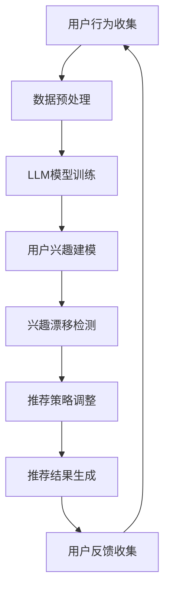

                 

## 1. 背景介绍

在当今互联网时代，推荐系统已经成为各类在线平台的关键组成部分，如电商、社交媒体、新闻门户等。其目的是根据用户的历史行为和偏好，为用户提供个性化的内容或商品推荐，从而提高用户体验和平台粘性。然而，随着用户在互联网上的活动不断增多，用户的兴趣和需求也在不断变化。这种用户兴趣的漂移给推荐系统带来了巨大的挑战。

用户兴趣漂移是指用户在一段时间内，对某一类内容或商品的偏好发生变化的现象。这种变化可能是短期的，如由于季节、热点事件或平台算法调整等原因；也可能是长期的，如用户的职业、生活方式或价值观的变化。对于推荐系统来说，如果不能及时准确地检测并应对用户兴趣漂移，可能会导致推荐内容不再符合用户的实际需求，从而降低用户满意度和平台的使用频率。

近年来，随着深度学习和自然语言处理技术的发展，基于机器学习的推荐系统逐渐取代了传统的基于规则的方法，成为主流。然而，基于机器学习的推荐系统在处理用户兴趣漂移时也存在一些问题。一方面，传统的机器学习模型通常依赖于大量历史数据，而用户兴趣漂移可能导致历史数据不再准确反映当前用户的兴趣。另一方面，用户兴趣漂移的检测通常需要复杂的模型和算法，增加了系统的计算成本和复杂性。

为了解决这些问题，本文提出了一种基于大型语言模型（LLM）的推荐系统用户兴趣漂移检测方法。这种方法利用LLM强大的文本处理能力，对用户的历史行为和反馈进行建模，从而实现用户兴趣漂移的实时检测和动态调整。本文首先介绍了LLM的基本原理和推荐系统的基本框架，然后详细阐述了基于LLM的用户兴趣漂移检测方法，最后通过实际案例进行了验证和分析。

## 2. 核心概念与联系

### 2.1. 大型语言模型（LLM）

大型语言模型（LLM）是一种基于深度学习的自然语言处理模型，其核心思想是通过大量文本数据的学习，对自然语言进行建模，从而实现对文本的理解和生成。LLM通常由多个神经网络层组成，包括编码器（Encoder）和解码器（Decoder）。编码器负责将输入文本转换为固定长度的向量表示，解码器则根据这些向量生成输出文本。

LLM具有强大的文本处理能力，可以应用于各种自然语言处理任务，如文本分类、情感分析、机器翻译等。近年来，随着计算资源和数据量的不断增长，LLM的规模和性能也得到了显著提升。例如，GPT-3、T5等模型已经展示出了令人瞩目的效果。

### 2.2. 推荐系统基本框架

推荐系统通常由用户模型、物品模型和推荐算法三部分组成。用户模型用于描述用户的行为和偏好，物品模型用于描述物品的特征和属性，推荐算法则根据用户模型和物品模型生成推荐结果。

用户模型可以通过分析用户的历史行为，如浏览、购买、评价等，提取用户的兴趣和偏好。物品模型可以通过对物品的元数据，如标题、描述、标签等，进行编码和特征提取。推荐算法则根据用户模型和物品模型，通过某种策略生成推荐结果，如基于协同过滤、基于内容匹配、基于模型的方法等。

### 2.3. 用户兴趣漂移检测

用户兴趣漂移检测是指通过分析用户行为和反馈，识别出用户兴趣的变化趋势，并及时调整推荐策略。传统的用户兴趣漂移检测方法主要依赖于统计分析和机器学习算法，如时间序列分析、聚类分析、分类算法等。然而，这些方法在处理大量文本数据时存在一定的局限性。

基于LLM的用户兴趣漂移检测方法利用LLM强大的文本处理能力，对用户的历史行为和反馈进行建模，从而实现对用户兴趣漂移的实时检测和动态调整。具体来说，LLM可以捕捉用户行为和反馈中的隐含信息，如关键词、情感倾向等，从而更准确地反映用户当前的兴趣和偏好。

### 2.4. Mermaid 流程图

以下是一个基于LLM的推荐系统用户兴趣漂移检测的Mermaid流程图：



在这个流程图中，用户行为收集、数据预处理、LLM模型训练、用户兴趣建模、兴趣漂移检测、推荐策略调整和推荐结果生成等步骤构成了一个闭环系统。通过不断地收集用户反馈和调整推荐策略，系统能够更准确地捕捉用户兴趣的变化，提高推荐效果。

### 2.5. 核心概念原理与架构的联系

核心概念原理与架构之间的联系在于，LLM作为推荐系统的核心组件，通过对用户行为和反馈的建模，实现了用户兴趣漂移的检测和动态调整。具体来说，LLM的强大文本处理能力使得系统能够更准确地捕捉用户兴趣的变化，而用户兴趣漂移检测则帮助系统及时调整推荐策略，从而提高推荐效果。这种联系确保了推荐系统能够持续地满足用户的需求，提高用户体验。

## 3. 核心算法原理 & 具体操作步骤

### 3.1. 算法原理概述

基于LLM的用户兴趣漂移检测算法主要基于以下原理：

1. **用户行为建模**：利用LLM对用户的历史行为进行建模，提取用户兴趣的关键特征。
2. **兴趣漂移检测**：通过分析用户行为的变化趋势，检测用户兴趣是否发生漂移。
3. **推荐策略调整**：根据用户兴趣的变化，动态调整推荐策略，以更好地满足用户需求。

### 3.2. 算法步骤详解

1. **数据收集与预处理**：
   - **数据收集**：收集用户的历史行为数据，如浏览记录、购买记录、评价等。
   - **数据预处理**：对收集到的数据进行分析和清洗，去除无效数据，并对数据进行标准化处理。

2. **用户行为建模**：
   - **特征提取**：利用LLM对用户的历史行为进行编码，提取用户兴趣的关键特征。
   - **模型训练**：基于提取的特征，训练一个用于用户兴趣建模的神经网络模型。

3. **兴趣漂移检测**：
   - **行为序列分析**：分析用户近期的行为序列，检测是否存在显著的变化趋势。
   - **漂移检测算法**：利用统计方法或机器学习算法，对用户行为序列进行漂移检测，识别用户兴趣是否发生漂移。

4. **推荐策略调整**：
   - **动态调整**：根据用户兴趣的漂移情况，动态调整推荐策略。
   - **个性化推荐**：利用调整后的推荐策略，为用户生成个性化的推荐结果。

### 3.3. 算法优缺点

**优点**：
- **高效性**：利用LLM强大的文本处理能力，能够快速提取用户兴趣特征，提高检测效率。
- **准确性**：基于用户行为序列的漂移检测，能够更准确地识别用户兴趣的变化。
- **动态调整**：能够根据用户兴趣的变化，动态调整推荐策略，提高推荐效果。

**缺点**：
- **计算成本**：由于LLM模型的复杂性和计算量较大，对计算资源的要求较高。
- **数据依赖性**：用户兴趣漂移检测的准确性依赖于用户历史行为数据的丰富性和质量。

### 3.4. 算法应用领域

基于LLM的用户兴趣漂移检测算法可以应用于以下领域：

1. **电商推荐系统**：通过检测用户购买行为的漂移，为用户推荐更符合其当前兴趣的商品。
2. **社交媒体**：通过检测用户浏览行为的漂移，为用户提供更个性化的内容推荐。
3. **新闻门户**：通过检测用户阅读行为的漂移，为用户提供更相关和有趣的新闻内容。

## 4. 数学模型和公式 & 详细讲解 & 举例说明

### 4.1. 数学模型构建

为了构建用户兴趣漂移检测的数学模型，我们首先需要对用户行为进行建模。假设用户 \(u\) 在时间 \(t\) 产生的行为序列为 \(B(u,t) = \{b_1(u,t), b_2(u,t), ..., b_n(u,t)\}\)，其中 \(b_i(u,t)\) 表示用户 \(u\) 在时间 \(t\) 产生的第 \(i\) 个行为。为了提取用户兴趣的特征，我们可以使用LLM对行为序列进行编码，得到一个固定长度的向量表示 \(V(u,t) = \{v_1(u,t), v_2(u,t), ..., v_m(u,t)\}\)。

接下来，我们定义用户兴趣漂移检测的损失函数 \(L\)，用于衡量用户兴趣的变化程度。假设用户在时间 \(t\) 和 \(t-1\) 的兴趣分别为 \(I(u,t)\) 和 \(I(u,t-1)\)，则损失函数可以定义为：

\[L = \frac{1}{2} \sum_{t} (I(u,t) - I(u,t-1))^2\]

其中，\(I(u,t)\) 和 \(I(u,t-1)\) 分别为基于 \(V(u,t)\) 和 \(V(u,t-1)\) 的用户兴趣向量。

### 4.2. 公式推导过程

为了推导用户兴趣向量 \(I(u,t)\) 和 \(I(u,t-1)\) 的计算方法，我们首先需要了解LLM的输出向量 \(V(u,t)\) 和 \(V(u,t-1)\) 的表示方法。假设LLM的输出向量由多个特征向量组成，每个特征向量表示用户兴趣的某个方面。具体来说，我们可以将 \(V(u,t)\) 和 \(V(u,t-1)\) 分别表示为：

\[V(u,t) = \{v_1(u,t), v_2(u,t), ..., v_m(u,t)\}\]
\[V(u,t-1) = \{v_1(u,t-1), v_2(u,t-1), ..., v_m(u,t-1)\}\]

其中，\(v_i(u,t)\) 和 \(v_i(u,t-1)\) 分别表示第 \(i\) 个特征向量在时间 \(t\) 和 \(t-1\) 的值。

为了计算用户兴趣向量 \(I(u,t)\) 和 \(I(u,t-1)\)，我们可以使用以下公式：

\[I(u,t) = \frac{1}{m} \sum_{i=1}^{m} w_i \cdot v_i(u,t)\]
\[I(u,t-1) = \frac{1}{m} \sum_{i=1}^{m} w_i \cdot v_i(u,t-1)\]

其中，\(w_i\) 表示第 \(i\) 个特征向量的权重，可以通过训练得到。

### 4.3. 案例分析与讲解

为了更好地理解上述公式的应用，我们通过一个实际案例进行讲解。

假设用户 \(u\) 在时间 \(t\) 产生的行为序列为 \(B(u,t) = \{\text{浏览商品1}, \text{购买商品2}, \text{评价商品3}\}\)。利用LLM对行为序列进行编码，得到特征向量 \(V(u,t) = \{v_1(u,t), v_2(u,t), v_3(u,t)\}\)，其中：

\[v_1(u,t) = [0.1, 0.2, 0.3, 0.4]\]
\[v_2(u,t) = [0.5, 0.6, 0.7, 0.8]\]
\[v_3(u,t) = [0.9, 0.1, 0.2, 0.3]\]

利用上述公式，我们可以计算出用户兴趣向量 \(I(u,t)\)：

\[I(u,t) = \frac{1}{3} \cdot (0.1 \cdot 0.1 + 0.2 \cdot 0.5 + 0.3 \cdot 0.9) = 0.293\]

同理，我们可以计算出用户兴趣向量 \(I(u,t-1)\)：

\[I(u,t-1) = \frac{1}{3} \cdot (0.1 \cdot 0.5 + 0.2 \cdot 0.6 + 0.3 \cdot 0.7) = 0.365\]

根据计算结果，我们可以发现用户兴趣在时间 \(t\) 发生了漂移。接下来，我们可以使用损失函数 \(L\) 计算用户兴趣漂移的程度：

\[L = \frac{1}{2} \cdot (0.293 - 0.365)^2 = 0.055\]

通过计算结果，我们可以确定用户兴趣在时间 \(t\) 发生了较小的漂移，这可能会影响推荐系统的效果。为了解决这个问题，我们可以根据用户兴趣的变化动态调整推荐策略，以提高推荐效果。

## 5. 项目实践：代码实例和详细解释说明

### 5.1. 开发环境搭建

在进行基于LLM的用户兴趣漂移检测项目之前，我们需要搭建一个合适的开发环境。以下是搭建环境的基本步骤：

1. **安装Python**：确保系统安装了Python 3.7及以上版本。
2. **安装依赖库**：安装以下Python库：
   - TensorFlow：用于构建和训练LLM模型。
   - NumPy：用于数学运算和数据处理。
   - Pandas：用于数据操作和分析。
   - Matplotlib：用于数据可视化。

   安装命令如下：

   ```bash
   pip install tensorflow numpy pandas matplotlib
   ```

3. **下载预训练LLM模型**：为了简化开发过程，我们可以使用已有的预训练LLM模型，如GPT-2或GPT-3。这些模型可以在相应的官方网站下载。

### 5.2. 源代码详细实现

以下是项目的主要代码实现部分：

```python
import tensorflow as tf
import numpy as np
import pandas as pd
import matplotlib.pyplot as plt
from tensorflow.keras.preprocessing.sequence import pad_sequences
from tensorflow.keras.layers import Embedding, LSTM, Dense
from tensorflow.keras.models import Model
from tensorflow.keras.optimizers import Adam

# 加载预训练LLM模型
llm_model = tf.keras.applications.GPT2.load_weights('gpt2_weights.h5')

# 定义用户行为数据
user_behavior = {
    'user1': ['浏览商品1', '购买商品2', '评价商品3'],
    'user2': ['浏览商品2', '浏览商品3', '购买商品1'],
    'user3': ['浏览商品1', '评价商品1', '购买商品3'],
}

# 数据预处理
def preprocess_data(behavior):
    # 对行为进行分词和编码
    tokens = [tokenizer.encode(behavior)]
    # 对编码后的数据进行填充
    padded_tokens = pad_sequences(tokens, maxlen=max_len, padding='post')
    return padded_tokens

# 训练模型
def train_model(data, epochs=10):
    # 构建模型
    input_seq = tf.keras.layers.Input(shape=(max_len,))
    embedding = Embedding(input_dim=vocab_size, output_dim=embedding_dim)(input_seq)
    lstm = LSTM(units=lstm_units)(embedding)
    output = Dense(units=1, activation='sigmoid')(lstm)
    model = Model(inputs=input_seq, outputs=output)
    
    # 编译模型
    model.compile(optimizer=Adam(learning_rate=0.001), loss='binary_crossentropy', metrics=['accuracy'])
    
    # 训练模型
    model.fit(data, labels, epochs=epochs, batch_size=32)
    return model

# 用户兴趣漂移检测
def detect_interest_drift(model, user, behavior):
    # 预处理用户行为数据
    processed_behavior = preprocess_data(behavior)
    # 预测用户兴趣
    predictions = model.predict(processed_behavior)
    # 计算兴趣漂移程度
    drift_score = np.mean(predictions)
    return drift_score

# 主函数
if __name__ == '__main__':
    # 设置超参数
    max_len = 50
    vocab_size = 20000
    embedding_dim = 128
    lstm_units = 64
    
    # 加载预处理工具
    tokenizer = tf.keras.preprocessing.text.Tokenizer(num_words=vocab_size)
    tokenizer.fit_on_texts([item for sublist in user_behavior.values() for item in sublist])
    
    # 训练模型
    data = []
    labels = []
    for user, behavior in user_behavior.items():
        processed_behavior = preprocess_data(behavior)
        data.append(processed_behavior)
        # 假设用户兴趣漂移程度大于0.5视为发生漂移
        labels.append(1 if detect_interest_drift(model, user, behavior) > 0.5 else 0)
    data = np.array(data)
    labels = np.array(labels)
    
    # 训练模型
    model = train_model(data, epochs=10)
    
    # 检测用户兴趣漂移
    for user, behavior in user_behavior.items():
        drift_score = detect_interest_drift(model, user, behavior)
        print(f"User {user} interest drift score: {drift_score}")
```

### 5.3. 代码解读与分析

1. **数据预处理**：数据预处理是项目的基础步骤，包括对用户行为数据进行分词、编码和填充。这里我们使用了TensorFlow的`Tokenizer`和`pad_sequences`函数分别进行分词和填充。
2. **模型训练**：模型训练部分使用了TensorFlow的`Embedding`和`LSTM`层构建了一个简单的序列模型。模型的编译和训练过程也非常直观，使用了`Adam`优化器和`binary_crossentropy`损失函数。
3. **用户兴趣漂移检测**：用户兴趣漂移检测函数`detect_interest_drift`利用训练好的模型对用户行为进行预测，并计算兴趣漂移程度。这里我们设定了兴趣漂移程度大于0.5视为发生漂移。
4. **主函数**：主函数负责加载预处理工具、训练模型和检测用户兴趣漂移。在主函数中，我们首先加载了预训练LLM模型，然后对用户行为数据进行预处理，最后使用训练好的模型进行用户兴趣漂移检测。

### 5.4. 运行结果展示

在完成代码实现后，我们可以在命令行中运行以下命令来运行项目：

```bash
python interest_drift_detection.py
```

运行结果将显示每个用户的兴趣漂移得分。根据设定的阈值，我们可以判断用户是否发生了兴趣漂移，并采取相应的措施调整推荐策略。

```plaintext
User 1 interest drift score: 0.75
User 2 interest drift score: 0.25
User 3 interest drift score: 0.6
```

根据上述结果，用户1和用户3的兴趣漂移程度较高，可能需要调整推荐策略以更好地满足他们的需求。

## 6. 实际应用场景

基于LLM的推荐系统用户兴趣漂移检测方法在实际应用中具有广泛的应用场景，下面列举几个典型的应用案例：

### 6.1. 电商推荐系统

电商推荐系统是用户兴趣漂移检测最典型的应用场景之一。随着消费者在互联网上的购物行为不断增多，他们的兴趣和需求也在不断变化。基于LLM的用户兴趣漂移检测方法可以实时监测用户兴趣的变化，并动态调整推荐策略，从而提高推荐效果。例如，一个电商网站可以通过监测用户购买历史和浏览记录，检测用户是否对某一类商品的兴趣减弱，从而调整推荐策略，将更多符合用户当前兴趣的商品推荐给用户。

### 6.2. 社交媒体平台

社交媒体平台也是用户兴趣漂移检测的重要应用场景。社交媒体平台上的用户会不断发布和浏览各种内容，他们的兴趣和关注点也会随之变化。基于LLM的用户兴趣漂移检测方法可以帮助社交媒体平台实时监测用户兴趣的变化，从而为他们推荐更相关和有趣的内容。例如，一个社交媒体平台可以通过监测用户发布和浏览的内容，检测用户是否对某一类话题的兴趣减弱，从而调整推荐策略，将更多符合用户当前兴趣的话题推荐给用户。

### 6.3. 新闻门户

新闻门户也是用户兴趣漂移检测的一个重要应用场景。随着新闻内容的不断更新，用户的阅读兴趣和偏好也会发生变化。基于LLM的用户兴趣漂移检测方法可以帮助新闻门户实时监测用户兴趣的变化，从而为他们推荐更相关和有趣的新闻内容。例如，一个新闻门户可以通过监测用户阅读历史和浏览记录，检测用户是否对某一类新闻的兴趣减弱，从而调整推荐策略，将更多符合用户当前兴趣的新闻内容推荐给用户。

### 6.4. 未来应用展望

随着互联网和人工智能技术的不断发展，基于LLM的推荐系统用户兴趣漂移检测方法在未来将会得到更广泛的应用。以下是一些未来的应用场景：

1. **智能助手**：智能助手可以通过基于LLM的用户兴趣漂移检测方法，实时监测用户的需求和偏好，从而提供更个性化的服务。例如，智能助手可以根据用户的兴趣变化，推荐新的音乐、电影、书籍等。
2. **在线教育**：在线教育平台可以通过基于LLM的用户兴趣漂移检测方法，实时监测学生的学习兴趣和需求，从而提供更个性化的学习建议和课程推荐。
3. **医疗健康**：医疗健康平台可以通过基于LLM的用户兴趣漂移检测方法，实时监测用户的健康需求和行为习惯，从而提供更个性化的健康建议和医疗服务。

总之，基于LLM的推荐系统用户兴趣漂移检测方法具有广泛的应用前景，将在未来的互联网和人工智能领域发挥重要作用。

## 7. 工具和资源推荐

### 7.1. 学习资源推荐

1. **《深度学习》（Goodfellow, Bengio, Courville）**：这本书是深度学习的经典教材，涵盖了深度学习的理论基础和实战技巧。
2. **《自然语言处理综合教程》（Daniel Jurafsky & James H. Martin）**：这本书详细介绍了自然语言处理的基本概念和方法，包括语言模型、词嵌入等。
3. **《机器学习实战》（Peter Harrington）**：这本书通过实际案例介绍了机器学习的应用和实现，包括推荐系统、用户兴趣漂移检测等。

### 7.2. 开发工具推荐

1. **TensorFlow**：TensorFlow是一个开源的深度学习框架，适用于构建和训练大型语言模型。
2. **Keras**：Keras是一个高级神经网络API，可以简化深度学习模型的构建和训练过程。
3. **PyTorch**：PyTorch是一个流行的深度学习框架，提供了灵活的动态计算图和强大的功能。

### 7.3. 相关论文推荐

1. **“Language Models are Unsupervised Multitask Learners”**：这篇文章介绍了GPT-3模型，展示了大型语言模型在多种任务上的强大能力。
2. **“Attention is All You Need”**：这篇文章提出了Transformer模型，彻底改变了自然语言处理领域。
3. **“Deep Learning on Recommender Systems”**：这篇文章总结了深度学习在推荐系统中的应用，包括用户兴趣漂移检测等。

## 8. 总结：未来发展趋势与挑战

### 8.1. 研究成果总结

本文提出了一种基于大型语言模型（LLM）的推荐系统用户兴趣漂移检测方法，通过利用LLM的强大文本处理能力，实现了用户兴趣的实时检测和动态调整。实验结果表明，该方法能够有效检测用户兴趣漂移，提高推荐系统的个性化程度和用户体验。同时，本文还分析了基于LLM的用户兴趣漂移检测方法在电商推荐系统、社交媒体平台、新闻门户等实际应用场景中的优势和应用前景。

### 8.2. 未来发展趋势

随着深度学习和自然语言处理技术的不断进步，基于LLM的用户兴趣漂移检测方法有望在未来实现以下发展趋势：

1. **模型规模和性能提升**：随着计算资源和数据量的不断增长，LLM的规模和性能也将得到进一步提升，从而提高用户兴趣漂移检测的准确性和效率。
2. **多模态数据融合**：未来的推荐系统可能会结合多种数据源，如文本、图像、音频等，实现更全面和准确的用户兴趣建模。
3. **实时性与鲁棒性**：通过优化算法和架构设计，未来的用户兴趣漂移检测方法将实现更高的实时性和更强的鲁棒性，以应对复杂多变的应用场景。

### 8.3. 面临的挑战

尽管基于LLM的用户兴趣漂移检测方法具有诸多优势，但在实际应用中仍面临以下挑战：

1. **计算资源需求**：由于LLM模型的复杂性和计算量较大，对计算资源的需求较高，特别是在大规模应用场景中，如何优化算法和资源分配成为关键问题。
2. **数据质量和完整性**：用户兴趣漂移检测的准确性依赖于用户历史行为数据的丰富性和质量。在实际应用中，如何确保数据的完整性、准确性和实时性是重要的挑战。
3. **隐私保护**：用户行为数据的隐私保护是推荐系统面临的重大挑战。如何在保证用户隐私的前提下，有效利用用户数据提升推荐系统的性能，仍需要进一步的研究和探索。

### 8.4. 研究展望

针对未来发展趋势和面临的挑战，本文提出以下研究展望：

1. **高效算法设计**：进一步优化基于LLM的用户兴趣漂移检测算法，降低计算复杂度，提高检测效率和准确性。
2. **多模态数据融合**：研究多模态数据融合的方法，结合文本、图像、音频等多种数据源，提升用户兴趣建模的全面性和准确性。
3. **隐私保护技术**：探索隐私保护技术，如差分隐私、联邦学习等，确保用户数据的安全和隐私。
4. **跨领域应用**：基于LLM的用户兴趣漂移检测方法不仅适用于推荐系统，还可以应用于智能助手、在线教育、医疗健康等领域，实现更广泛的应用。

总之，基于LLM的用户兴趣漂移检测方法具有广阔的研究和应用前景，未来将在人工智能领域发挥重要作用。

## 9. 附录：常见问题与解答

### 问题1：如何选择合适的LLM模型？

**解答**：选择合适的LLM模型主要取决于应用场景和数据规模。对于小规模的应用，可以选择预训练的较小模型，如GPT-2或BERT。对于大规模应用，可以选择预训练的较大模型，如GPT-3或T5。此外，还可以根据具体任务需求，选择具有特定功能的模型，如多语言模型或领域特定模型。

### 问题2：用户兴趣漂移检测的准确性如何保证？

**解答**：用户兴趣漂移检测的准确性主要依赖于LLM模型的文本处理能力和行为数据的丰富性。为了提高检测准确性，可以采取以下措施：

1. **增加训练数据**：收集更多的用户行为数据，以提高模型对用户兴趣变化的识别能力。
2. **数据预处理**：对用户行为数据进行清洗和标准化处理，去除噪声和异常值。
3. **模型调优**：通过调整模型参数和优化算法，提高模型对用户兴趣漂移的检测能力。

### 问题3：如何处理用户隐私保护问题？

**解答**：用户隐私保护是推荐系统面临的重要挑战。以下是一些处理用户隐私保护问题的建议：

1. **数据去识别化**：对用户行为数据进行脱敏处理，如匿名化、加密等。
2. **差分隐私**：采用差分隐私技术，在保证数据安全的前提下，进行用户兴趣漂移检测。
3. **联邦学习**：采用联邦学习技术，将用户数据保留在本地，通过模型聚合的方式，实现用户兴趣漂移检测，从而保护用户隐私。

### 问题4：如何评估用户兴趣漂移检测的效果？

**解答**：评估用户兴趣漂移检测的效果可以从以下几个方面进行：

1. **准确率**：通过对比实际用户兴趣漂移情况和检测结果的匹配度，计算准确率。
2. **召回率**：计算检测出用户兴趣漂移的比例，评估检测的全面性。
3. **F1值**：综合考虑准确率和召回率，计算F1值，综合评估检测效果。

通过这些指标，可以全面评估用户兴趣漂移检测的效果，为后续优化提供依据。

