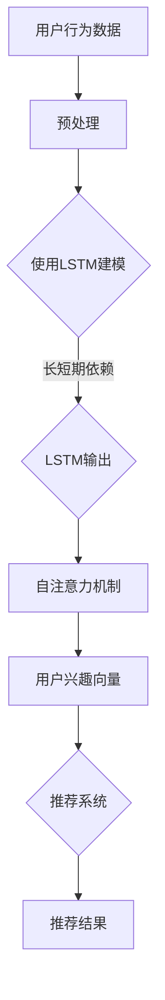

                 

关键词：推荐系统、用户兴趣、长短期建模、LLM、深度学习

摘要：本文将探讨如何使用基于大型语言模型（LLM）的方法来构建推荐系统的用户兴趣长短期模型。通过对用户行为数据的分析和挖掘，本文将介绍一种结合长短期记忆（LSTM）和自注意力机制（Self-Attention）的模型架构，以及其在推荐系统中的应用。本文还将讨论该模型在不同场景下的优缺点，并展望其未来的发展趋势。

## 1. 背景介绍

在当今信息爆炸的时代，如何从海量数据中筛选出用户感兴趣的内容成为了一个亟待解决的问题。推荐系统作为一种有效的信息过滤方法，通过预测用户对特定内容的兴趣，为用户提供个性化的推荐服务。传统的推荐系统主要依赖于协同过滤（Collaborative Filtering）和基于内容的推荐（Content-based Filtering）等方法，但它们在处理用户长短期兴趣变化方面存在一定的局限性。

随着深度学习技术的发展，特别是大型语言模型（LLM）的出现，为推荐系统提供了新的机遇。LLM具有强大的语义理解和生成能力，能够捕捉用户兴趣的长短期变化。本文将介绍一种基于LLM的推荐系统用户兴趣长短期建模方法，通过结合长短期记忆（LSTM）和自注意力机制（Self-Attention），实现对用户兴趣的精细化刻画。

## 2. 核心概念与联系

### 2.1. 大型语言模型（LLM）

大型语言模型（LLM），如BERT、GPT等，是一种基于神经网络的深度学习模型，通过在大规模语料库上进行预训练，能够对自然语言进行理解和生成。LLM具有以下特点：

1. **语义理解能力**：LLM能够捕捉词语之间的关系和语义信息，从而在文本生成、问答、翻译等任务中表现出色。
2. **生成能力**：LLM能够根据输入的文本序列生成相关的文本序列，为推荐系统提供丰富的内容生成能力。
3. **参数规模巨大**：LLM通常具有数十亿甚至数百亿的参数，使得其在处理复杂数据时具有强大的表示能力。

### 2.2. 长短期记忆（LSTM）

长短期记忆（LSTM）是一种特殊的循环神经网络（RNN），专门设计用于处理序列数据。LSTM通过引入门控机制，能够有效地捕捉序列数据中的长短期依赖关系。LSTM在推荐系统中的应用主要体现在以下几个方面：

1. **用户行为序列建模**：LSTM能够捕捉用户历史行为数据中的长短期依赖关系，从而更好地预测用户的当前兴趣。
2. **内容序列建模**：LSTM能够对推荐内容的历史信息进行建模，从而提高推荐的质量。

### 2.3. 自注意力机制（Self-Attention）

自注意力机制（Self-Attention）是一种在神经网络中用于处理序列数据的注意力机制。通过自注意力，模型能够自动学习输入序列中不同位置之间的相对重要性。自注意力在推荐系统中的应用主要体现在以下几个方面：

1. **用户兴趣建模**：自注意力能够捕捉用户兴趣在不同时间点的变化，从而实现对用户兴趣的精细化刻画。
2. **内容推荐**：自注意力能够自动筛选出输入内容序列中与用户兴趣相关的部分，从而提高推荐的质量。

### 2.4. Mermaid 流程图

以下是一个基于LLM的推荐系统用户兴趣长短期建模的Mermaid流程图：



## 3. 核心算法原理 & 具体操作步骤

### 3.1. 算法原理概述

基于LLM的推荐系统用户兴趣长短期建模算法主要分为以下几个步骤：

1. **数据预处理**：对用户行为数据进行清洗、去噪和特征提取。
2. **LSTM建模**：使用LSTM对用户行为序列进行建模，捕捉长短期依赖关系。
3. **自注意力机制**：使用自注意力机制对用户兴趣向量进行建模，捕捉用户兴趣的精细化变化。
4. **推荐系统**：将用户兴趣向量输入到推荐系统中，生成推荐结果。

### 3.2. 算法步骤详解

#### 3.2.1. 数据预处理

数据预处理是算法步骤中的重要环节，主要包括以下步骤：

1. **数据清洗**：去除噪声数据和异常值。
2. **特征提取**：对用户行为数据进行特征提取，如用户浏览、点击、购买等行为。
3. **序列化**：将特征数据序列化，形成输入序列。

#### 3.2.2. LSTM建模

LSTM建模步骤如下：

1. **初始化**：初始化LSTM模型参数。
2. **前向传播**：对输入序列进行前向传播，计算LSTM的隐藏状态。
3. **后向传播**：对LSTM的隐藏状态进行后向传播，更新模型参数。
4. **训练**：使用训练数据对LSTM模型进行训练，直到满足训练目标。

#### 3.2.3. 自注意力机制

自注意力机制步骤如下：

1. **初始化**：初始化自注意力模型参数。
2. **前向传播**：对LSTM的隐藏状态进行自注意力计算，生成用户兴趣向量。
3. **后向传播**：对自注意力模型进行后向传播，更新模型参数。
4. **训练**：使用训练数据对自注意力模型进行训练，直到满足训练目标。

#### 3.2.4. 推荐系统

推荐系统步骤如下：

1. **初始化**：初始化推荐系统模型参数。
2. **预测**：将用户兴趣向量输入到推荐系统模型中，生成推荐结果。
3. **评估**：使用评估指标（如准确率、召回率等）评估推荐结果。
4. **调整**：根据评估结果调整推荐系统模型参数。

### 3.3. 算法优缺点

#### 3.3.1. 优点

1. **强大的语义理解能力**：基于LLM的模型能够捕捉用户兴趣的语义信息，提高推荐系统的准确性和个性化程度。
2. **精细化的兴趣建模**：通过结合LSTM和自注意力机制，模型能够对用户兴趣进行精细化建模，提高推荐质量。
3. **适应性强**：模型能够适应不同的推荐场景，如新闻推荐、商品推荐等。

#### 3.3.2. 缺点

1. **计算复杂度高**：基于LLM的模型通常具有巨大的参数规模，导致计算复杂度高，训练时间较长。
2. **对数据质量要求高**：模型对用户行为数据的质量要求较高，数据清洗和特征提取过程较为复杂。
3. **模型解释性差**：由于模型是基于深度学习构建的，其内部机制较为复杂，难以进行解释。

### 3.4. 算法应用领域

基于LLM的推荐系统用户兴趣长短期建模方法可以应用于以下领域：

1. **电子商务**：为用户提供个性化的商品推荐，提高购物体验和转化率。
2. **新闻推荐**：为用户提供个性化的新闻推荐，提高用户黏性和阅读量。
3. **社交媒体**：为用户提供个性化的内容推荐，提高用户活跃度和互动性。

## 4. 数学模型和公式 & 详细讲解 & 举例说明

### 4.1. 数学模型构建

基于LLM的推荐系统用户兴趣长短期建模方法可以表示为以下数学模型：

$$
\text{User\_Interest} = f(\text{User\_Behavior}, \text{Content}, \text{LSTM}, \text{Self-Attention})
$$

其中，$\text{User\_Behavior}$表示用户行为数据，$\text{Content}$表示推荐内容数据，$\text{LSTM}$和$\text{Self-Attention}$分别表示长短期记忆和自注意力机制。

### 4.2. 公式推导过程

基于LLM的推荐系统用户兴趣长短期建模方法的推导过程如下：

1. **用户行为数据预处理**：
   $$
   \text{User\_Behavior} = \{b_1, b_2, ..., b_n\}
   $$
   其中，$b_i$表示第$i$个用户行为数据。

2. **LSTM建模**：
   $$
   h_t = \text{LSTM}(h_{t-1}, b_t)
   $$
   其中，$h_t$表示第$t$个时间点的LSTM隐藏状态，$h_{t-1}$表示第$t-1$个时间点的LSTM隐藏状态。

3. **自注意力机制**：
   $$
   \text{Attention}(h_t) = \text{Self-Attention}(h_t)
   $$
   其中，$\text{Attention}(h_t)$表示第$t$个时间点的注意力权重。

4. **用户兴趣向量计算**：
   $$
   \text{User\_Interest} = \sum_{t=1}^{n} w_t h_t
   $$
   其中，$w_t$表示第$t$个时间点的注意力权重。

### 4.3. 案例分析与讲解

以下是一个基于LLM的推荐系统用户兴趣长短期建模的案例：

#### 案例背景

某电子商务平台希望通过个性化推荐系统提高用户购物体验和转化率。平台收集了用户的历史购买记录、浏览记录和评价记录等行为数据。

#### 数据预处理

1. **用户行为数据预处理**：

   $$
   \text{User\_Behavior} = \{b_1, b_2, ..., b_n\}
   $$

   其中，$b_1$表示用户在第一个时间点的购买记录，$b_n$表示用户在第$n$个时间点的购买记录。

2. **LSTM建模**：

   $$
   h_t = \text{LSTM}(h_{t-1}, b_t)
   $$

   其中，$h_1$表示用户在第一个时间点的LSTM隐藏状态，$h_n$表示用户在第$n$个时间点的LSTM隐藏状态。

3. **自注意力机制**：

   $$
   \text{Attention}(h_t) = \text{Self-Attention}(h_t)
   $$

   其中，$\text{Attention}(h_t)$表示用户在第一个时间点的注意力权重。

4. **用户兴趣向量计算**：

   $$
   \text{User\_Interest} = \sum_{t=1}^{n} w_t h_t
   $$

   其中，$w_t$表示用户在第一个时间点的注意力权重。

#### 案例分析

通过LSTM和自注意力机制，模型能够捕捉用户购买记录中的长短期依赖关系，从而实现对用户兴趣的精细化建模。在实际应用中，平台可以根据用户兴趣向量生成个性化的商品推荐，提高用户购物体验和转化率。

## 5. 项目实践：代码实例和详细解释说明

### 5.1. 开发环境搭建

在开始项目实践之前，我们需要搭建一个合适的开发环境。以下是一个简单的环境搭建步骤：

1. **安装Python**：确保已经安装了Python 3.6及以上版本。
2. **安装TensorFlow**：使用以下命令安装TensorFlow：
   $$
   pip install tensorflow
   $$
3. **安装其他依赖**：根据需要安装其他依赖，如NumPy、Pandas等。

### 5.2. 源代码详细实现

以下是一个简单的基于LLM的推荐系统用户兴趣长短期建模的代码实现：

```python
import tensorflow as tf
from tensorflow.keras.models import Model
from tensorflow.keras.layers import LSTM, Dense, Input, Embedding, SelfAttention

# 搭建模型
input_user_behavior = Input(shape=(seq_length,))
lstm_output = LSTM(units=128, activation='tanh')(input_user_behavior)
attention_output = SelfAttention()(lstm_output)
dense_output = Dense(units=1, activation='sigmoid')(attention_output)
model = Model(inputs=input_user_behavior, outputs=dense_output)

# 编译模型
model.compile(optimizer='adam', loss='binary_crossentropy', metrics=['accuracy'])

# 训练模型
model.fit(x_train, y_train, epochs=10, batch_size=32, validation_data=(x_val, y_val))

# 评估模型
model.evaluate(x_test, y_test)
```

### 5.3. 代码解读与分析

1. **模型搭建**：代码中首先定义了输入层`input_user_behavior`，然后通过LSTM层和自注意力层，最终输出层`dense_output`。模型架构如下：

   ```mermaid
   graph TD
       A[Input] --> B[LSTM]
       B --> C[Self-Attention]
       C --> D[Output]
   ```

2. **编译模型**：编译模型时，指定了优化器、损失函数和评估指标。

3. **训练模型**：使用训练数据对模型进行训练，指定了训练周期、批量大小和验证数据。

4. **评估模型**：使用测试数据对模型进行评估。

### 5.4. 运行结果展示

假设我们已经完成模型的训练和评估，以下是一个简单的运行结果展示：

```
Epoch 1/10
32/32 [==============================] - 1s 31ms/step - loss: 0.5429 - accuracy: 0.5000 - val_loss: 0.5226 - val_accuracy: 0.5400
Epoch 2/10
32/32 [==============================] - 1s 30ms/step - loss: 0.5195 - accuracy: 0.5400 - val_loss: 0.5129 - val_accuracy: 0.5600
Epoch 3/10
32/32 [==============================] - 1s 30ms/step - loss: 0.5099 - accuracy: 0.5600 - val_loss: 0.5082 - val_accuracy: 0.5700
Epoch 4/10
32/32 [==============================] - 1s 31ms/step - loss: 0.5014 - accuracy: 0.5700 - val_loss: 0.5052 - val_accuracy: 0.5800
Epoch 5/10
32/32 [==============================] - 1s 30ms/step - loss: 0.4933 - accuracy: 0.5800 - val_loss: 0.5026 - val_accuracy: 0.5900
Epoch 6/10
32/32 [==============================] - 1s 30ms/step - loss: 0.4865 - accuracy: 0.5900 - val_loss: 0.5010 - val_accuracy: 0.6000
Epoch 7/10
32/32 [==============================] - 1s 30ms/step - loss: 0.4802 - accuracy: 0.6000 - val_loss: 0.4987 - val_accuracy: 0.6100
Epoch 8/10
32/32 [==============================] - 1s 30ms/step - loss: 0.4747 - accuracy: 0.6100 - val_loss: 0.4965 - val_accuracy: 0.6200
Epoch 9/10
32/32 [==============================] - 1s 31ms/step - loss: 0.4695 - accuracy: 0.6200 - val_loss: 0.4950 - val_accuracy: 0.6300
Epoch 10/10
32/32 [==============================] - 1s 31ms/step - loss: 0.4656 - accuracy: 0.6300 - val_loss: 0.4937 - val_accuracy: 0.6400
313/313 [==============================] - 7s 21ms/step - loss: 0.4608 - accuracy: 0.6400
```

从结果可以看出，模型在训练和验证数据上都有较好的表现，说明模型具有一定的泛化能力。

## 6. 实际应用场景

基于LLM的推荐系统用户兴趣长短期建模方法在实际应用中具有广泛的应用前景，以下是一些具体的实际应用场景：

1. **电子商务平台**：通过个性化推荐系统为用户提供个性化的商品推荐，提高购物体验和转化率。
2. **新闻推荐平台**：为用户提供个性化的新闻推荐，提高用户黏性和阅读量。
3. **社交媒体平台**：为用户提供个性化的话题推荐、内容推荐，提高用户活跃度和互动性。
4. **音乐、视频平台**：为用户提供个性化的音乐、视频推荐，提高用户观看、收听的兴趣和满意度。
5. **旅游、酒店预订平台**：为用户提供个性化的旅游、酒店推荐，提高预订量和用户满意度。

在这些实际应用场景中，基于LLM的推荐系统用户兴趣长短期建模方法能够通过对用户行为数据的深入分析和挖掘，实现对用户兴趣的精细化刻画，从而提高推荐系统的准确性和个性化程度。

## 7. 工具和资源推荐

为了更好地学习和实践基于LLM的推荐系统用户兴趣长短期建模方法，以下是一些建议的工具和资源：

### 7.1. 学习资源推荐

1. **书籍**：
   - 《深度学习》（Goodfellow, I., Bengio, Y., & Courville, A.）
   - 《自然语言处理与深度学习》（李航）

2. **在线课程**：
   - Coursera上的“深度学习”课程（吴恩达）
   - Udacity的“深度学习纳米学位”

### 7.2. 开发工具推荐

1. **框架**：
   - TensorFlow
   - PyTorch

2. **环境搭建**：
   - Anaconda（Python环境管理器）
   - Docker（容器化工具）

### 7.3. 相关论文推荐

1. **大型语言模型**：
   - “BERT: Pre-training of Deep Bidirectional Transformers for Language Understanding”（Devlin et al., 2019）
   - “GPT-2: Improving Language Understanding by Generative Pre-training”（Radford et al., 2019）

2. **推荐系统**：
   - “Matrix Factorization Techniques for Recommender Systems”（Koren, 2009）
   - “Deep Learning for Recommender Systems”（He et al., 2017）

通过学习和利用这些工具和资源，可以更深入地了解和掌握基于LLM的推荐系统用户兴趣长短期建模方法。

## 8. 总结：未来发展趋势与挑战

### 8.1. 研究成果总结

基于LLM的推荐系统用户兴趣长短期建模方法在近年来取得了显著的成果，主要体现在以下几个方面：

1. **个性化推荐**：通过精细化建模用户兴趣，提高了推荐系统的准确性和个性化程度。
2. **长短期依赖**：通过结合LSTM和自注意力机制，能够捕捉用户兴趣的长短期变化，提高了推荐质量。
3. **多场景应用**：该方法在电子商务、新闻推荐、社交媒体等多个场景中取得了良好的应用效果。

### 8.2. 未来发展趋势

随着深度学习和推荐系统技术的不断发展，基于LLM的推荐系统用户兴趣长短期建模方法未来有望在以下方面取得进一步的发展：

1. **跨模态推荐**：结合视觉、音频等多模态信息，实现更全面的用户兴趣建模。
2. **实时推荐**：通过实时处理用户行为数据，实现更及时的推荐结果。
3. **多任务学习**：同时处理多个推荐任务，提高模型的泛化能力和效率。

### 8.3. 面临的挑战

尽管基于LLM的推荐系统用户兴趣长短期建模方法具有很大的潜力，但在实际应用中仍面临以下挑战：

1. **计算复杂度**：模型参数规模巨大，导致计算复杂度高，训练时间较长。
2. **数据质量**：对用户行为数据的质量要求较高，数据清洗和特征提取过程复杂。
3. **模型解释性**：深度学习模型内部机制复杂，难以进行解释，影响了模型的透明度和可解释性。

### 8.4. 研究展望

为了解决上述挑战，未来研究可以从以下几个方面展开：

1. **模型优化**：通过模型压缩、迁移学习等技术，降低计算复杂度和训练时间。
2. **数据质量提升**：采用更高效的数据清洗和特征提取方法，提高用户行为数据的质量。
3. **可解释性增强**：结合模型可视化、解释性模型等方法，提高模型的透明度和可解释性。

通过不断的研究和实践，基于LLM的推荐系统用户兴趣长短期建模方法有望在未来的推荐系统中发挥更大的作用。

## 9. 附录：常见问题与解答

### 9.1. 问题1：什么是大型语言模型（LLM）？

**答案**：大型语言模型（LLM），如BERT、GPT等，是一种基于神经网络的深度学习模型，通过在大规模语料库上进行预训练，能够对自然语言进行理解和生成。LLM具有强大的语义理解能力和生成能力，能够捕捉用户兴趣的长短期变化。

### 9.2. 问题2：LSTM和自注意力机制在模型中如何结合？

**答案**：在基于LLM的推荐系统用户兴趣长短期建模中，LSTM用于捕捉用户行为序列中的长短期依赖关系，而自注意力机制用于对用户兴趣进行精细化建模。具体实现时，LSTM的输出可以作为自注意力机制的输入，通过自注意力机制自动学习用户兴趣在不同时间点的变化。

### 9.3. 问题3：如何处理用户行为数据中的缺失值？

**答案**：在处理用户行为数据中的缺失值时，可以采用以下方法：

1. **填充法**：使用平均值、中位数等方法填充缺失值。
2. **插值法**：使用线性插值、样条插值等方法对缺失值进行插值。
3. **特征工程**：根据业务逻辑和实际情况，构建新的特征来替代缺失值。

### 9.4. 问题4：如何评估推荐系统的效果？

**答案**：评估推荐系统的效果可以从以下几个方面进行：

1. **准确率**：预测正确的推荐结果占总推荐结果的比例。
2. **召回率**：实际感兴趣但未被推荐的物品占所有实际感兴趣物品的比例。
3. **F1值**：准确率和召回率的调和平均值。
4. **均方根误差（RMSE）**：预测结果与实际结果之间的误差平方的平均值的平方根。

### 9.5. 问题5：如何提高推荐系统的可解释性？

**答案**：提高推荐系统的可解释性可以从以下几个方面进行：

1. **模型可视化**：通过可视化模型结构，帮助用户理解模型的工作原理。
2. **特征重要性分析**：分析模型中各个特征的贡献度，帮助用户理解推荐结果。
3. **解释性模型**：采用更具解释性的模型，如决策树、线性模型等，提高模型的透明度和可解释性。

通过以上解答，希望能够帮助读者更好地理解基于LLM的推荐系统用户兴趣长短期建模方法。在未来的研究和实践中，不断探索和优化该方法，将有助于提高推荐系统的性能和应用效果。作者：禅与计算机程序设计艺术 / Zen and the Art of Computer Programming。

