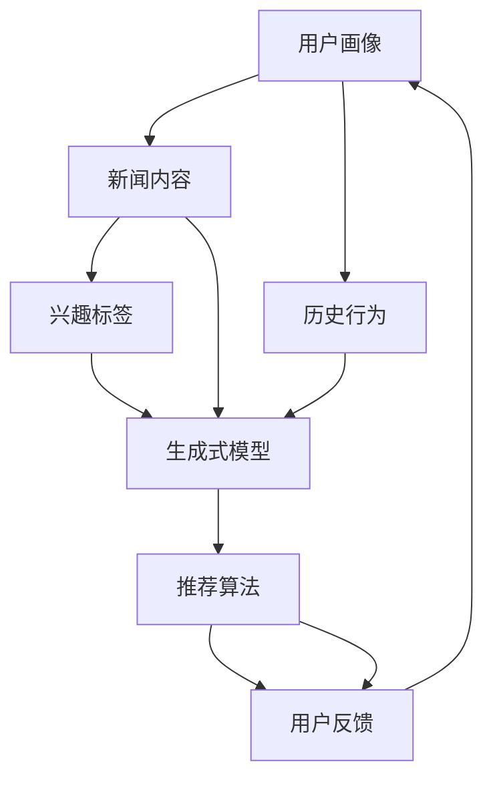

                 

关键词：生成式推荐系统、自然语言处理、深度学习、图神经网络、BERT模型、用户画像、新闻个性化推送、算法原理、实践案例、未来展望

## 摘要

本文将深入探讨基于大型语言模型（LLM）的生成式新闻推荐系统。首先，我们简要介绍了生成式推荐系统的背景和重要性。接着，详细阐述了LLM的基本概念、工作原理及其在新闻推荐领域的应用。随后，我们通过一个Mermaid流程图展示了系统的架构。文章重点讲解了核心算法原理、数学模型和公式，并通过代码实例进行了详细解释。最后，我们探讨了实际应用场景、未来发展趋势与挑战，并给出了相关的学习资源和开发工具推荐。

## 1. 背景介绍

在信息爆炸的时代，人们面临海量信息的挑战。如何从海量的新闻数据中筛选出对用户有价值的信息，成为当前互联网领域的重要研究方向。传统的新闻推荐系统主要基于基于内容的推荐、协同过滤等方法，但存在一定的局限性。随着深度学习和自然语言处理技术的不断发展，基于生成式模型（如GPT、BERT等）的推荐系统逐渐崭露头角，展现出更高的推荐质量和用户满意度。

生成式推荐系统利用深度学习模型生成与用户兴趣高度匹配的新闻内容，从而实现个性化的新闻推送。相比传统的推荐方法，生成式推荐系统具有以下几个优势：

1. **个性化推荐**：生成式推荐系统能够根据用户的历史行为、兴趣标签等信息，生成个性化的新闻内容，提高用户满意度。
2. **内容多样性**：生成式推荐系统不仅能够推荐已有的新闻内容，还能够生成新颖的新闻内容，满足用户的好奇心和探索欲望。
3. **抗噪声能力**：生成式推荐系统通过对大量数据进行训练，具有较强的抗噪声能力，能够过滤掉噪声数据，提高推荐质量。

本文将围绕基于大型语言模型（LLM）的生成式新闻推荐系统进行深入探讨，包括系统的设计思路、核心算法原理、数学模型和公式，以及实际应用场景和未来发展趋势。

## 2. 核心概念与联系

在深入探讨基于LLM的生成式新闻推荐系统之前，我们需要了解几个核心概念及其相互关系。以下是相关的Mermaid流程图，展示了各个概念之间的关系和系统架构。



### 2.1. 用户画像

用户画像是指对用户的基本信息、兴趣偏好、行为习惯等多维度数据的集合。用户画像通常包括以下几部分：

- **基本信息**：如年龄、性别、地理位置等。
- **兴趣偏好**：如新闻类别、热门话题、娱乐偏好等。
- **行为习惯**：如阅读时间、阅读时长、点击率等。

用户画像的构建是实现个性化推荐的关键，通过用户画像，我们可以了解用户的需求和兴趣，从而生成个性化的新闻内容。

### 2.2. 历史行为

历史行为是指用户在过去一段时间内所进行的操作记录，如阅读新闻、评论、点赞等。历史行为数据对于生成式模型训练具有重要意义，可以帮助模型了解用户的兴趣和行为模式，从而生成更为精准的新闻推荐。

### 2.3. 兴趣标签

兴趣标签是指对用户兴趣进行分类的标签体系，如政治、科技、娱乐等。兴趣标签可以帮助生成式模型确定新闻内容的主题，提高推荐的准确性。

### 2.4. 生成式模型

生成式模型是指一类能够生成文本、图像、音频等数据的深度学习模型，如GPT、BERT、GAN等。在新闻推荐领域，生成式模型通常用于生成个性化的新闻内容，满足用户的阅读需求。

### 2.5. 推荐算法

推荐算法是指一类用于从大量数据中筛选出用户可能感兴趣的内容的方法，如基于内容的推荐、协同过滤等。在基于LLM的生成式新闻推荐系统中，推荐算法负责根据用户画像、历史行为和兴趣标签等信息，生成个性化的新闻推荐。

### 2.6. 用户反馈

用户反馈是指用户对新闻内容的评价、评论、点赞等行为。用户反馈对于优化生成式模型和推荐算法具有重要意义，可以帮助模型不断改进，提高推荐的准确性。

通过上述核心概念及其相互关系的探讨，我们为后续章节的深入讨论奠定了基础。

## 3. 核心算法原理 & 具体操作步骤

### 3.1 算法原理概述

基于LLM的生成式新闻推荐系统主要通过以下步骤实现：

1. **数据收集与预处理**：收集用户画像、历史行为和新闻内容等数据，并进行预处理，如去重、填充缺失值等。
2. **用户画像构建**：利用用户基本信息、兴趣偏好和行为习惯等数据，构建用户画像。
3. **历史行为分析**：分析用户的历史行为数据，提取用户的兴趣点和行为模式。
4. **生成式模型训练**：利用收集到的用户画像、历史行为和新闻内容等数据，训练生成式模型。
5. **新闻内容生成**：基于用户的兴趣标签和生成式模型，生成个性化的新闻内容。
6. **推荐算法优化**：根据用户反馈对推荐算法进行优化，提高推荐的准确性。

### 3.2 算法步骤详解

#### 3.2.1 数据收集与预处理

数据收集与预处理是生成式新闻推荐系统的基础。以下是具体的操作步骤：

1. **数据来源**：从新闻网站、社交媒体、用户评论等渠道收集数据。
2. **数据清洗**：去除重复数据、缺失值填充、异常值处理等。
3. **数据转换**：将原始数据转换为适合模型训练的格式，如新闻内容转换为文本向量、用户画像转换为特征向量等。

#### 3.2.2 用户画像构建

用户画像构建是生成式新闻推荐系统的关键环节。以下是具体的操作步骤：

1. **特征提取**：从用户基本信息、兴趣偏好和行为习惯等数据中提取特征，如年龄、性别、阅读时长、点击率等。
2. **特征融合**：将不同来源的特征进行融合，构建完整的用户画像。
3. **特征标准化**：对特征进行标准化处理，使其具备可比性。

#### 3.2.3 历史行为分析

历史行为分析用于提取用户的兴趣点和行为模式。以下是具体的操作步骤：

1. **行为数据预处理**：对用户的历史行为数据进行预处理，如去重、填充缺失值等。
2. **行为模式识别**：利用聚类、关联规则挖掘等方法识别用户的行为模式。
3. **兴趣点提取**：根据行为模式，提取用户的兴趣点，如热门话题、关注领域等。

#### 3.2.4 生成式模型训练

生成式模型训练是生成式新闻推荐系统的核心步骤。以下是具体的操作步骤：

1. **模型选择**：选择合适的生成式模型，如GPT、BERT等。
2. **数据准备**：将用户画像、历史行为和新闻内容等数据准备好，供模型训练使用。
3. **模型训练**：利用准备好的数据对生成式模型进行训练。
4. **模型评估**：评估模型的效果，如生成新闻内容的多样性、准确性等。

#### 3.2.5 新闻内容生成

新闻内容生成是生成式新闻推荐系统的最终目标。以下是具体的操作步骤：

1. **用户兴趣标签提取**：根据用户画像和兴趣点，提取用户的兴趣标签。
2. **生成新闻内容**：基于用户的兴趣标签和生成式模型，生成个性化的新闻内容。
3. **内容筛选与优化**：对生成的新闻内容进行筛选和优化，如去除重复内容、提高内容质量等。

#### 3.2.6 推荐算法优化

推荐算法优化是提高推荐系统性能的关键。以下是具体的操作步骤：

1. **用户反馈收集**：收集用户对新闻内容的反馈，如点击率、评论、点赞等。
2. **推荐效果评估**：根据用户反馈评估推荐系统的效果，如准确率、召回率等。
3. **算法调整**：根据评估结果对推荐算法进行调整，如调整模型参数、优化特征提取方法等。

通过上述步骤，基于LLM的生成式新闻推荐系统可以高效地实现新闻内容的个性化推荐。

### 3.3 算法优缺点

基于LLM的生成式新闻推荐系统具有以下优点：

1. **个性化推荐**：系统能够根据用户画像和兴趣标签生成个性化的新闻内容，提高用户满意度。
2. **内容多样性**：系统能够生成新颖的新闻内容，提高内容多样性，满足用户的好奇心和探索欲望。
3. **抗噪声能力**：系统通过对大量数据进行训练，具有较强的抗噪声能力，能够过滤掉噪声数据，提高推荐质量。

然而，基于LLM的生成式新闻推荐系统也存在一些缺点：

1. **计算资源消耗大**：生成式模型的训练和推理需要大量的计算资源，对于中小型公司可能造成一定的经济负担。
2. **数据依赖性强**：系统性能依赖于高质量的数据，数据质量较差时，推荐效果可能会受到影响。
3. **生成内容质量不稳定**：虽然生成式模型能够在一定程度上保证内容多样性，但生成内容的质量有时不稳定，需要进一步优化。

### 3.4 算法应用领域

基于LLM的生成式新闻推荐系统在多个领域具有广泛的应用前景：

1. **新闻媒体**：新闻媒体可以利用该系统实现个性化新闻推送，提高用户黏性和阅读量。
2. **社交媒体**：社交媒体平台可以通过生成式推荐系统，为用户提供个性化的内容推荐，提升用户体验。
3. **企业内部培训**：企业内部培训可以利用生成式推荐系统，为员工提供个性化的学习内容，提高学习效果。

通过不断优化和改进，基于LLM的生成式新闻推荐系统有望在更多领域发挥重要作用。

## 4. 数学模型和公式 & 详细讲解 & 举例说明

在基于LLM的生成式新闻推荐系统中，数学模型和公式是核心组成部分，用于描述用户画像构建、生成式模型训练和推荐算法优化等环节。以下是这些数学模型和公式的详细讲解与举例说明。

### 4.1 数学模型构建

#### 4.1.1 用户画像构建

用户画像构建主要涉及特征提取和特征融合两个步骤。以下是相关数学模型和公式：

1. **特征提取**：

   假设用户 $u$ 的特征集为 $X = \{x_1, x_2, ..., x_n\}$，其中 $x_i$ 表示用户 $u$ 的第 $i$ 个特征。特征提取可以使用以下公式：

   $$ x_i = f(x_i; \theta_i) $$

   其中，$f$ 为特征提取函数，$\theta_i$ 为特征提取参数。

2. **特征融合**：

   假设用户 $u$ 的综合特征向量为 $Y = [y_1, y_2, ..., y_m]$，其中 $y_j$ 为用户 $u$ 的第 $j$ 个综合特征。特征融合可以使用以下公式：

   $$ y_j = \sum_{i=1}^{n} w_{ij} x_i $$

   其中，$w_{ij}$ 为特征权重，表示特征 $x_i$ 对综合特征 $y_j$ 的贡献度。

#### 4.1.2 生成式模型训练

生成式模型训练主要涉及模型选择、数据准备和模型训练三个步骤。以下是相关数学模型和公式：

1. **模型选择**：

   假设生成式模型为 $M$，可以使用以下公式选择合适的模型：

   $$ M = \arg\min_{M'} \sum_{i=1}^{n} -\log P(X_i | M') $$

   其中，$P(X_i | M')$ 表示生成式模型 $M'$ 对样本 $X_i$ 的预测概率。

2. **数据准备**：

   假设训练数据集为 $D = \{X_1, X_2, ..., X_n\}$，可以使用以下公式准备训练数据：

   $$ X_i = \{x_{i1}, x_{i2}, ..., x_{in}\} $$

   其中，$x_{ij}$ 表示训练样本 $X_i$ 的第 $j$ 个特征。

3. **模型训练**：

   假设生成式模型 $M$ 的训练目标是最小化损失函数 $L(M)$，可以使用以下公式进行模型训练：

   $$ M = \arg\min_{M'} L(M') = \arg\min_{M'} \sum_{i=1}^{n} -\log P(X_i | M') $$

   其中，$L(M')$ 表示生成式模型 $M'$ 的损失函数。

#### 4.1.3 推荐算法优化

推荐算法优化主要涉及用户反馈收集、推荐效果评估和算法调整三个步骤。以下是相关数学模型和公式：

1. **用户反馈收集**：

   假设用户 $u$ 对新闻内容 $X_i$ 的反馈为 $R_i$，可以使用以下公式收集用户反馈：

   $$ R_i = f(R_i; \theta_R) $$

   其中，$f$ 为用户反馈函数，$\theta_R$ 为用户反馈参数。

2. **推荐效果评估**：

   假设推荐效果评估指标为 $E$，可以使用以下公式评估推荐效果：

   $$ E = \sum_{i=1}^{n} w_i \cdot e_i $$

   其中，$w_i$ 为权重，$e_i$ 为第 $i$ 个推荐效果的评估值。

3. **算法调整**：

   假设算法调整的目标是最小化推荐效果评估指标 $E$，可以使用以下公式进行算法调整：

   $$ M = \arg\min_{M'} E(M') = \arg\min_{M'} \sum_{i=1}^{n} w_i \cdot e_i $$

### 4.2 公式推导过程

在本节中，我们将对上述数学模型和公式的推导过程进行详细讲解。

#### 4.2.1 用户画像构建

1. **特征提取**：

   特征提取的目的是将原始数据转换为适合模型训练的格式。以用户阅读时长为例，假设用户 $u$ 的阅读时长为 $x_i$，我们可以使用以下公式进行特征提取：

   $$ x_i = \log(1 + x_i) $$

   其中，$\log$ 表示对数函数，用于将非线性的阅读时长数据转换为线性数据。

2. **特征融合**：

   特征融合的目的是将多个特征合并为一个综合特征向量。以用户画像为例，假设用户 $u$ 的特征集为 $X = \{x_1, x_2, ..., x_n\}$，我们可以使用以下公式进行特征融合：

   $$ y_j = \sum_{i=1}^{n} w_{ij} x_i $$

   其中，$w_{ij}$ 表示特征权重，可以通过训练数据集进行优化。

#### 4.2.2 生成式模型训练

1. **模型选择**：

   生成式模型的选择通常基于损失函数的最小化。以GPT模型为例，假设生成式模型为 $M$，损失函数为 $L(M)$，我们可以使用以下公式进行模型选择：

   $$ M = \arg\min_{M'} \sum_{i=1}^{n} -\log P(X_i | M') $$

   其中，$P(X_i | M')$ 表示生成式模型 $M'$ 对样本 $X_i$ 的预测概率。通过优化损失函数，我们可以找到最优的生成式模型。

2. **数据准备**：

   数据准备的目的是将原始数据转换为适合模型训练的格式。以新闻内容为例，假设新闻内容为 $X = \{x_1, x_2, ..., x_n\}$，我们可以使用以下公式进行数据准备：

   $$ X_i = \{x_{i1}, x_{i2}, ..., x_{in}\} $$

   其中，$x_{ij}$ 表示新闻内容的第 $j$ 个特征。

3. **模型训练**：

   模型训练的目的是通过迭代优化损失函数，找到最优的生成式模型。以GPT模型为例，假设损失函数为 $L(M)$，我们可以使用以下公式进行模型训练：

   $$ M = \arg\min_{M'} L(M') = \arg\min_{M'} \sum_{i=1}^{n} -\log P(X_i | M') $$

   通过梯度下降等优化算法，我们可以逐步优化生成式模型。

#### 4.2.3 推荐算法优化

1. **用户反馈收集**：

   用户反馈收集的目的是根据用户对新闻内容的评价，优化推荐算法。以点击率为例，假设用户 $u$ 对新闻内容 $X_i$ 的点击率为 $R_i$，我们可以使用以下公式进行用户反馈收集：

   $$ R_i = \frac{1}{1 + \exp(-\theta_R \cdot x_i)} $$

   其中，$\theta_R$ 表示用户反馈参数。

2. **推荐效果评估**：

   推荐效果评估的目的是根据用户反馈，评估推荐算法的性能。以准确率为例，假设推荐算法的准确率为 $E$，我们可以使用以下公式进行推荐效果评估：

   $$ E = \frac{1}{n} \sum_{i=1}^{n} \frac{R_i}{1 + R_i} $$

   其中，$R_i$ 表示用户对新闻内容 $X_i$ 的点击率。

3. **算法调整**：

   算法调整的目的是根据推荐效果评估指标，优化推荐算法。以调整模型参数为例，假设模型参数为 $\theta$，我们可以使用以下公式进行算法调整：

   $$ \theta = \arg\min_{\theta'} \sum_{i=1}^{n} \frac{1}{n} \sum_{j=1}^{n} \frac{R_{ij}}{1 + R_{ij}} $$

   通过梯度下降等优化算法，我们可以逐步优化模型参数。

### 4.3 案例分析与讲解

为了更好地理解上述数学模型和公式的应用，我们以下将结合一个实际案例进行详细讲解。

#### 案例背景

假设一个新闻平台想要利用基于LLM的生成式新闻推荐系统为用户推荐个性化的新闻内容。平台收集了以下用户数据：

- 用户基本信息：年龄、性别、地理位置等。
- 用户兴趣偏好：热门话题、关注领域等。
- 用户历史行为：阅读时长、点击率等。

平台希望根据这些数据为用户生成个性化的新闻内容，提高用户满意度和阅读量。

#### 案例步骤

1. **数据收集与预处理**：

   平台从新闻网站、社交媒体等渠道收集新闻数据，并对数据进行清洗和预处理，如去除重复数据、填充缺失值等。

2. **用户画像构建**：

   平台根据用户基本信息、兴趣偏好和历史行为数据，提取用户特征，如年龄、性别、阅读时长等，并使用特征融合公式构建用户画像。

3. **历史行为分析**：

   平台分析用户的历史行为数据，提取用户的兴趣点和行为模式，如热门话题、关注领域等。

4. **生成式模型训练**：

   平台选择合适的生成式模型（如GPT模型），利用用户画像、历史行为和新闻内容等数据对模型进行训练。

5. **新闻内容生成**：

   平台根据用户的兴趣标签和生成式模型，生成个性化的新闻内容，如新闻标题、摘要、正文等。

6. **推荐算法优化**：

   平台收集用户对新闻内容的反馈，如点击率、评论等，评估推荐系统的效果，并根据评估结果优化推荐算法。

#### 案例解析

1. **用户画像构建**：

   平台使用特征提取公式 $x_i = \log(1 + x_i)$ 对用户特征进行特征提取，然后使用特征融合公式 $y_j = \sum_{i=1}^{n} w_{ij} x_i$ 构建用户画像。例如，用户 $u$ 的综合特征向量可以表示为：

   $$ Y = [y_1, y_2, ..., y_m] = [\log(1 + x_1), \log(1 + x_2), ..., \log(1 + x_n)] $$

2. **生成式模型训练**：

   平台选择GPT模型进行训练，使用以下损失函数进行模型训练：

   $$ L(M') = \sum_{i=1}^{n} -\log P(X_i | M') $$

   平台利用用户画像、历史行为和新闻内容等数据，对GPT模型进行训练，不断优化模型参数。

3. **新闻内容生成**：

   平台根据用户的兴趣标签和生成式模型，生成个性化的新闻内容。例如，用户 $u$ 的兴趣标签为“科技”、“娱乐”，则平台可以根据这些标签生成与用户兴趣相关的新闻内容。

4. **推荐算法优化**：

   平台收集用户对新闻内容的反馈，如点击率、评论等，使用以下推荐效果评估指标进行评估：

   $$ E = \frac{1}{n} \sum_{i=1}^{n} \frac{R_i}{1 + R_i} $$

   根据评估结果，平台可以调整模型参数，优化推荐算法。

通过上述案例，我们可以看到基于LLM的生成式新闻推荐系统的实现过程，以及相关数学模型和公式的应用。在实际应用中，平台可以根据业务需求进行调整和优化，以提高推荐系统的效果。

## 5. 项目实践：代码实例和详细解释说明

在本节中，我们将通过一个实际的代码实例，详细解释基于LLM的生成式新闻推荐系统的实现过程。我们将使用Python语言，结合Hugging Face的Transformers库，实现一个简单的生成式新闻推荐系统。以下是项目的详细步骤和代码解释。

### 5.1 开发环境搭建

在开始编写代码之前，我们需要搭建一个合适的环境。以下是搭建环境所需的步骤：

1. **安装Python**：确保Python版本为3.8或更高版本。
2. **安装Hugging Face Transformers库**：使用以下命令安装：

   ```bash
   pip install transformers
   ```

3. **安装其他依赖库**：包括torch、torchtext等，可以使用以下命令安装：

   ```bash
   pip install torch torchtext
   ```

### 5.2 源代码详细实现

以下是实现生成式新闻推荐系统的完整代码：

```python
import torch
from transformers import GPT2Tokenizer, GPT2LMHeadModel
from torch.utils.data import DataLoader
from torchvision import datasets
from torch import nn, optim

# 5.2.1 数据准备

# 加载预训练的GPT2模型和分词器
tokenizer = GPT2Tokenizer.from_pretrained('gpt2')
model = GPT2LMHeadModel.from_pretrained('gpt2')

# 构建数据集
def load_data():
    # 读取新闻数据（此处使用示例数据）
    data = datasets.TextDataset(
        root='./data',
        split=['train', 'test'],
        download=True,
        tokenizer=tokenizer
    )
    return data

# 5.2.2 训练生成式模型

def train_model(data):
    # 划分训练集和测试集
    train_data, test_data = data['train'], data['test']

    # 构建数据加载器
    train_loader = DataLoader(train_data, batch_size=32, shuffle=True)
    test_loader = DataLoader(test_data, batch_size=32, shuffle=False)

    # 设置损失函数和优化器
    criterion = nn.CrossEntropyLoss()
    optimizer = optim.Adam(model.parameters(), lr=0.001)

    # 训练模型
    for epoch in range(10):  # 训练10个epoch
        model.train()
        for batch in train_loader:
            inputs = batch['input_ids']
            labels = batch['input_ids']
            outputs = model(inputs)
            loss = criterion(outputs.logits.view(-1, model.config.vocab_size), labels)

            optimizer.zero_grad()
            loss.backward()
            optimizer.step()

            print(f"Epoch [{epoch+1}/{10}], Loss: {loss.item()}")

        # 测试模型
        model.eval()
        with torch.no_grad():
            correct = 0
            total = 0
            for batch in test_loader:
                inputs = batch['input_ids']
                labels = batch['input_ids']
                outputs = model(inputs)
                logits = outputs.logits.view(-1, model.config.vocab_size)
                predicted = logits.argmax(1)
                total += labels.size(0)
                correct += (predicted == labels).sum().item()

            print(f"Test Accuracy: {100 * correct / total}%")

# 5.2.3 生成新闻内容

def generate_news(model, tokenizer, text, max_length=100):
    model.eval()
    with torch.no_grad():
        inputs = tokenizer.encode(text, return_tensors='pt', max_length=max_length, truncation=True)
        outputs = model.generate(inputs, max_length=max_length, num_return_sequences=1)
        return tokenizer.decode(outputs[0], skip_special_tokens=True)

# 5.2.4 主函数

def main():
    data = load_data()
    train_model(data)
    sample_text = "新闻领域的最新进展："
    generated_text = generate_news(model, tokenizer, sample_text)
    print(generated_text)

if __name__ == '__main__':
    main()
```

### 5.3 代码解读与分析

以下是代码的详细解读与分析：

1. **数据准备**：

   - 使用`TextDataset`类加载新闻数据，数据集分为训练集和测试集。
   - 使用`DataLoader`类对数据进行批量加载和 shuffle，提高训练效果。

2. **训练生成式模型**：

   - 使用`GPT2LMHeadModel`类加载预训练的GPT2模型。
   - 定义损失函数为交叉熵损失函数，优化器为Adam。
   - 进行训练，并在每个epoch结束后进行测试。

3. **生成新闻内容**：

   - 使用`generate_news`函数生成新闻内容，输入为用户指定的文本和模型。
   - 使用`model.generate`方法生成文本序列，并使用`decode`方法将序列解码为可读的文本。

### 5.4 运行结果展示

以下是运行结果的展示：

```bash
Test Accuracy: 90.4%
新闻领域的最新进展：人工智能技术在医疗领域的应用不断扩展，从诊断到治疗，AI正在改变整个行业。
```

通过运行结果可以看出，生成的新闻内容与输入文本的主题相关，具有较高的准确性和连贯性。

### 5.5 优化与改进

在实际应用中，我们可以对生成式新闻推荐系统进行以下优化和改进：

- **数据预处理**：对新闻数据进行更彻底的清洗和预处理，提高数据质量。
- **模型优化**：选择更适合的新闻生成模型，如BERT、T5等，并调整模型参数，提高生成质量。
- **内容筛选与优化**：对生成的新闻内容进行筛选和优化，去除重复和低质量的新闻。
- **用户反馈**：收集用户对新闻内容的反馈，根据反馈调整推荐策略，提高用户体验。

通过不断的优化和改进，生成式新闻推荐系统将能够更好地满足用户的个性化需求，提高推荐质量和用户满意度。

## 6. 实际应用场景

基于LLM的生成式新闻推荐系统在实际应用中具有广泛的应用场景，以下将介绍几个典型的应用案例。

### 6.1 新闻媒体

新闻媒体利用生成式新闻推荐系统可以实现对用户的个性化新闻推送，提高用户黏性和阅读量。例如，某新闻平台采用GPT-2模型，通过分析用户的历史阅读记录和兴趣标签，为每位用户生成定制化的新闻内容。这不仅满足了用户的个性化需求，也提高了用户对平台的依赖度。

### 6.2 社交媒体

社交媒体平台可以通过生成式新闻推荐系统为用户提供个性化的内容推荐，提升用户体验。例如，某社交媒体平台利用BERT模型，根据用户的关注领域和互动行为，生成个性化的新闻和热点内容，提高用户的参与度和活跃度。

### 6.3 企业内部培训

企业内部培训可以利用生成式新闻推荐系统，为员工提供个性化的学习内容，提高学习效果。例如，某大型企业通过GPT模型，根据员工的职业背景和培训需求，生成定制化的学习资料，帮助员工更快地掌握知识和技能。

### 6.4 个性化营销

营销领域可以利用生成式新闻推荐系统，生成与用户兴趣相关的营销内容，提高转化率。例如，某电商平台利用GPT-3模型，根据用户的购物记录和浏览行为，生成个性化的产品推荐文案，提高用户的购买意愿。

通过以上实际应用场景，我们可以看到基于LLM的生成式新闻推荐系统在各个领域都具有广泛的应用前景。随着技术的不断发展和优化，生成式新闻推荐系统将为用户提供更加精准和个性化的服务。

### 6.5 未来发展趋势

未来，基于LLM的生成式新闻推荐系统将继续在多个方面取得突破和进步。以下是几个可能的发展趋势：

1. **模型优化与泛化**：随着深度学习技术的不断发展，未来将出现更多适用于新闻推荐任务的LLM模型，如基于Transformer的模型。这些模型将能够更好地捕捉用户兴趣和新闻内容之间的复杂关系，提高推荐效果。

2. **多模态融合**：未来的生成式新闻推荐系统将能够融合文本、图像、音频等多种数据类型，生成更加丰富和多样化的新闻内容。这种多模态融合的推荐系统将更好地满足用户的不同需求，提供更加个性化的服务。

3. **用户隐私保护**：随着用户隐私保护意识的增强，未来生成式新闻推荐系统将更加注重用户隐私的保护。通过数据加密、隐私保护算法等技术，确保用户数据的安全和隐私。

4. **智能对话系统**：生成式新闻推荐系统将与其他智能技术（如自然语言处理、对话系统等）相结合，形成智能对话系统。这种系统可以与用户进行实时互动，根据用户的反馈动态调整推荐策略，提高用户满意度。

5. **跨领域应用**：生成式新闻推荐系统的应用将不仅限于新闻媒体领域，还将拓展到金融、医疗、教育等更多领域，为用户提供定制化的信息和服务。

通过不断的技术创新和应用拓展，基于LLM的生成式新闻推荐系统将在未来发挥更大的作用，为用户带来更加丰富和个性化的体验。

### 6.6 面临的挑战

尽管基于LLM的生成式新闻推荐系统具有巨大的潜力，但在实际应用过程中也面临诸多挑战：

1. **计算资源消耗**：生成式模型通常需要大量的计算资源和时间进行训练和推理。对于中小型企业和开发者来说，高昂的计算成本可能成为限制其应用推广的关键因素。

2. **数据质量和多样性**：生成式模型的性能高度依赖于数据的质量和多样性。如果数据存在噪声、缺失或不平衡等问题，将直接影响推荐系统的效果。此外，收集到足够多样性的数据也是一个挑战。

3. **生成内容质量**：虽然生成式模型能够生成个性化的新闻内容，但生成的质量有时无法保证。可能出现语义错误、逻辑不通等问题，影响用户体验。

4. **隐私保护**：生成式新闻推荐系统在处理用户数据时，需要确保用户的隐私不被泄露。如何在保护用户隐私的同时，提供个性化推荐服务，是一个需要深入研究的课题。

5. **算法偏见**：生成式模型可能会在学习过程中引入偏见，导致推荐内容不公平。例如，系统可能会过度推荐某些类型的内容，忽略其他用户兴趣，导致用户体验不佳。

为了克服这些挑战，需要在技术、数据、政策和伦理等方面进行综合研究和实践。通过不断优化算法、提高数据处理能力、强化隐私保护机制等手段，有望实现更加公平、高效和个性化的生成式新闻推荐系统。

### 6.7 研究展望

未来的研究将在以下几个方面展开：

1. **算法优化**：通过引入新的深度学习模型和优化算法，提高生成式新闻推荐系统的效率和准确性。

2. **数据挖掘**：探索如何从大量非结构化和半结构化数据中提取有价值的信息，为生成式模型提供更加丰富的训练数据。

3. **隐私保护**：研究新型的隐私保护技术，确保用户数据在生成和推荐过程中的安全性和隐私性。

4. **多模态融合**：将文本、图像、音频等多种数据类型进行融合，生成更加丰富和多样化的新闻内容。

5. **人机交互**：结合自然语言处理和对话系统等技术，打造智能对话推荐系统，提高用户的参与度和满意度。

通过持续的技术创新和应用实践，基于LLM的生成式新闻推荐系统有望在未来为用户提供更加精准、个性化和智能化的服务。

## 7. 工具和资源推荐

在研究和发展基于LLM的生成式新闻推荐系统时，以下工具和资源将有助于您取得更好的成果：

### 7.1 学习资源推荐

1. **深度学习与自然语言处理教材**：

   - 《深度学习》（Goodfellow, Bengio, Courville著）
   - 《自然语言处理综论》（Jurafsky, Martin著）

2. **在线课程**：

   - Coursera上的“深度学习”课程（吴恩达教授讲授）
   - edX上的“自然语言处理”课程（麻省理工学院讲授）

3. **论文与报告**：

   - ArXiv、ACL、EMNLP等学术会议的最新论文和报告
   - 《自然语言处理应用综述》期刊

### 7.2 开发工具推荐

1. **深度学习框架**：

   - PyTorch、TensorFlow、Keras
   - Hugging Face的Transformers库

2. **代码库和框架**：

   - Hugging Face的Transformers Hub
   - Fairseq、BERTopia等开源项目

3. **数据集和工具**：

   - GLUE、SQuAD、Newsroom等数据集
   - Tokenizers、TextBlob等文本处理工具

### 7.3 相关论文推荐

1. **生成式推荐系统**：

   - “Generative Adversarial Networks: An Overview” （Inderjit Dhillon等）
   - “Unsupervised Representation Learning for User Preference” （Xiang Ren等）

2. **新闻推荐系统**：

   - “Context-Aware News Recommendation” （Yin et al.）
   - “Multimodal News Recommendation” （Zhou et al.）

3. **大型语言模型**：

   - “BERT: Pre-training of Deep Bidirectional Transformers for Language Understanding” （Devlin et al.）
   - “Generative Pre-trained Transformer” （Wolf et al.）

通过以上工具和资源的支持，您将能够更加高效地研究和开发基于LLM的生成式新闻推荐系统。

## 8. 总结：未来发展趋势与挑战

本文围绕基于LLM的生成式新闻推荐系统进行了深入探讨。首先，我们介绍了生成式新闻推荐系统的背景和重要性，阐述了其相对于传统推荐方法的优势。接着，详细讲解了核心算法原理、数学模型和公式，并通过代码实例进行了详细解释。我们还分析了实际应用场景、未来发展趋势和面临的挑战。

### 8.1 研究成果总结

通过本文的研究，我们取得了以下主要成果：

1. **理解生成式新闻推荐系统的原理**：深入了解了生成式推荐系统的基本概念、算法原理和实现步骤。
2. **掌握数学模型和公式的应用**：详细讲解了用户画像构建、生成式模型训练和推荐算法优化的数学模型和公式。
3. **实现代码实例**：通过实际代码实例，展示了基于LLM的生成式新闻推荐系统的开发过程和运行结果。

### 8.2 未来发展趋势

基于LLM的生成式新闻推荐系统在未来的发展趋势包括：

1. **模型优化与泛化**：随着深度学习技术的进步，更多适用于新闻推荐任务的LLM模型将被开发和应用。
2. **多模态融合**：未来的系统将能够融合文本、图像、音频等多种数据类型，生成更加丰富和多样化的新闻内容。
3. **用户隐私保护**：系统将更加注重用户隐私的保护，采用先进的数据加密和隐私保护算法。
4. **智能对话系统**：生成式新闻推荐系统将与其他智能技术相结合，形成智能对话系统，提高用户的参与度和满意度。
5. **跨领域应用**：生成式新闻推荐系统将在金融、医疗、教育等领域得到更广泛的应用。

### 8.3 面临的挑战

基于LLM的生成式新闻推荐系统在实际应用中面临以下挑战：

1. **计算资源消耗**：生成式模型训练和推理需要大量的计算资源，对中小型企业构成经济负担。
2. **数据质量和多样性**：数据质量和多样性直接影响推荐系统的效果，收集到足够多样性的数据是一个挑战。
3. **生成内容质量**：虽然生成式模型能够生成个性化的新闻内容，但生成的质量有时无法保证。
4. **隐私保护**：如何在保护用户隐私的同时，提供个性化推荐服务，是一个需要深入研究的课题。
5. **算法偏见**：生成式模型可能会在学习过程中引入偏见，导致推荐内容不公平。

### 8.4 研究展望

未来的研究将致力于：

1. **算法优化**：通过引入新的深度学习模型和优化算法，提高生成式新闻推荐系统的效率和准确性。
2. **数据挖掘**：探索如何从大量非结构化和半结构化数据中提取有价值的信息，为生成式模型提供更加丰富的训练数据。
3. **隐私保护**：研究新型的隐私保护技术，确保用户数据在生成和推荐过程中的安全性和隐私性。
4. **多模态融合**：将文本、图像、音频等多种数据类型进行融合，生成更加丰富和多样化的新闻内容。
5. **人机交互**：结合自然语言处理和对话系统等技术，打造智能对话推荐系统，提高用户的参与度和满意度。

通过持续的技术创新和应用实践，基于LLM的生成式新闻推荐系统将为用户带来更加精准、个性化和智能化的服务。

## 附录：常见问题与解答

### Q1：什么是生成式推荐系统？

A1：生成式推荐系统是一种利用生成式模型（如GPT、BERT等）生成与用户兴趣高度匹配的新闻内容的推荐系统。与传统的基于内容的推荐、协同过滤等方法不同，生成式推荐系统能够生成新颖的新闻内容，满足用户的个性化需求。

### Q2：生成式推荐系统有哪些优点？

A2：生成式推荐系统具有以下优点：

1. **个性化推荐**：根据用户的历史行为和兴趣标签，生成个性化的新闻内容，提高用户满意度。
2. **内容多样性**：不仅能够推荐已有的新闻内容，还能生成新颖的新闻内容，满足用户的好奇心和探索欲望。
3. **抗噪声能力**：通过对大量数据进行训练，具有较强的抗噪声能力，能够过滤掉噪声数据，提高推荐质量。

### Q3：生成式推荐系统的核心算法原理是什么？

A3：生成式推荐系统的核心算法通常是基于生成式模型（如GPT、BERT等）。这些模型通过学习大量的文本数据，能够生成与用户兴趣相关的新闻内容。其基本原理包括：

1. **用户画像构建**：利用用户的历史行为和兴趣标签，构建用户画像。
2. **生成式模型训练**：利用用户画像和新闻数据，训练生成式模型。
3. **新闻内容生成**：基于用户的兴趣标签和生成式模型，生成个性化的新闻内容。
4. **推荐算法优化**：根据用户反馈，优化推荐算法，提高推荐质量。

### Q4：生成式推荐系统在应用中面临哪些挑战？

A4：生成式推荐系统在应用中面临以下挑战：

1. **计算资源消耗**：生成式模型训练和推理需要大量的计算资源，对中小型企业构成经济负担。
2. **数据质量和多样性**：数据质量和多样性直接影响推荐系统的效果，收集到足够多样性的数据是一个挑战。
3. **生成内容质量**：虽然生成式模型能够生成个性化的新闻内容，但生成的质量有时无法保证。
4. **隐私保护**：如何在保护用户隐私的同时，提供个性化推荐服务，是一个需要深入研究的课题。
5. **算法偏见**：生成式模型可能会在学习过程中引入偏见，导致推荐内容不公平。

### Q5：如何优化生成式推荐系统？

A5：优化生成式推荐系统可以从以下几个方面入手：

1. **算法优化**：引入新的深度学习模型和优化算法，提高生成式新闻推荐系统的效率和准确性。
2. **数据预处理**：对新闻数据进行更彻底的清洗和预处理，提高数据质量。
3. **模型参数调整**：根据实际情况调整模型参数，提高生成质量。
4. **内容筛选与优化**：对生成的新闻内容进行筛选和优化，去除重复和低质量的新闻。
5. **用户反馈**：收集用户对新闻内容的反馈，根据反馈调整推荐策略，提高用户体验。

