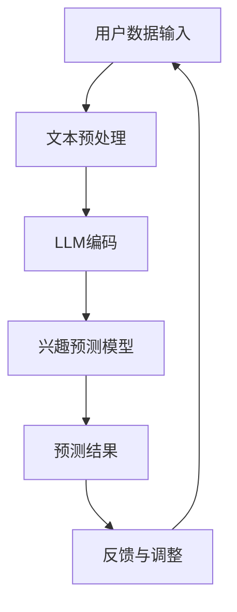

                 

关键词：Large Language Model（LLM）、用户兴趣、动态建模、算法原理、数学模型、项目实践、应用场景、未来展望

> 摘要：本文主要介绍了基于大型语言模型（LLM）的用户兴趣动态建模方法。首先回顾了传统用户兴趣建模方法，然后详细阐述了LLM的工作原理及其在用户兴趣动态建模中的应用。通过数学模型的构建和公式推导，本文揭示了用户兴趣动态建模的核心机制。最后，通过实际项目实践，展示了该方法的有效性和可行性，并对其未来应用进行了展望。

## 1. 背景介绍

在互联网时代，用户兴趣的准确识别和动态追踪成为众多应用领域的核心问题。传统的用户兴趣建模方法主要依赖于用户历史行为数据，如浏览记录、购买记录等，通过统计分析和机器学习算法来预测用户兴趣。然而，这些方法存在一定的局限性，如数据稀疏性、冷启动问题等。

随着深度学习技术的不断发展，大型语言模型（LLM）如BERT、GPT等在自然语言处理领域取得了显著的成果。LLM具有强大的语义理解和生成能力，能够处理复杂的用户行为数据，为用户兴趣的动态建模提供了新的思路。

本文旨在探索基于LLM的用户兴趣动态建模方法，通过构建数学模型和推导相关公式，揭示用户兴趣动态建模的核心机制。同时，通过实际项目实践，验证该方法的有效性和可行性。

## 2. 核心概念与联系

### 2.1 用户兴趣动态建模概述

用户兴趣动态建模是指通过分析用户的历史行为数据和实时交互数据，动态地识别和跟踪用户兴趣的变化过程。其核心目标是准确预测用户的潜在兴趣，为个性化推荐、广告投放等应用提供支持。

### 2.2 LLM的工作原理

LLM是基于深度学习技术的自然语言处理模型，通过训练大量文本数据，学习语言的语义和结构。LLM的核心思想是自注意力机制（Self-Attention），通过计算文本序列中各个位置之间的相似性，生成具有语义理解的文本表示。

### 2.3 LLM在用户兴趣动态建模中的应用

LLM在用户兴趣动态建模中的应用主要包括两个方面：

1. **文本数据预处理**：利用LLM对用户的历史行为数据和实时交互数据进行文本预处理，提取语义信息。

2. **兴趣预测模型**：利用LLM生成的文本表示，构建兴趣预测模型，通过训练和优化，实现用户兴趣的动态预测。

### 2.4 Mermaid流程图

下面是用户兴趣动态建模的Mermaid流程图：



## 3. 核心算法原理 & 具体操作步骤

### 3.1 算法原理概述

基于LLM的用户兴趣动态建模算法主要包括以下步骤：

1. **数据预处理**：对用户的历史行为数据和实时交互数据进行清洗和整合，生成统一的文本数据集。

2. **LLM编码**：利用LLM对文本数据进行编码，生成高维的语义表示。

3. **兴趣预测模型**：基于LLM编码的语义表示，构建兴趣预测模型，通过训练和优化，实现用户兴趣的动态预测。

4. **预测结果反馈与调整**：将预测结果反馈给用户，并根据用户的反馈调整模型参数，实现用户兴趣的持续追踪和预测。

### 3.2 算法步骤详解

#### 3.2.1 数据预处理

1. **数据清洗**：去除重复、无关的数据，保证数据的一致性和完整性。

2. **数据整合**：将不同来源的用户行为数据和实时交互数据整合成统一的文本数据集。

3. **文本分词**：利用分词工具对文本数据进行分词，提取出关键信息。

4. **文本向量表示**：利用词嵌入技术，将文本数据转化为高维向量表示。

#### 3.2.2 LLM编码

1. **模型选择**：选择适合的LLM模型，如BERT、GPT等。

2. **模型训练**：利用文本数据集，训练LLM模型，生成文本的语义表示。

3. **文本编码**：将文本数据输入到LLM模型中，生成高维的语义向量表示。

#### 3.2.3 兴趣预测模型

1. **模型构建**：基于LLM编码的语义向量，构建兴趣预测模型，如分类模型、回归模型等。

2. **模型训练**：利用训练数据集，训练兴趣预测模型，优化模型参数。

3. **模型评估**：利用验证数据集，评估兴趣预测模型的性能，调整模型参数。

#### 3.2.4 预测结果反馈与调整

1. **预测结果输出**：将兴趣预测结果输出，提供给用户或相关应用系统。

2. **反馈机制**：根据用户的反馈，对模型进行更新和调整，提高预测准确性。

### 3.3 算法优缺点

#### 优点

1. **强大的语义理解能力**：LLM具有强大的语义理解能力，能够准确捕捉用户兴趣的细微变化。

2. **适应性强**：LLM能够处理多种类型的用户行为数据和实时交互数据，适应性强。

3. **动态调整能力**：基于反馈机制，LLM能够动态调整模型参数，实现用户兴趣的持续追踪和预测。

#### 缺点

1. **计算资源消耗大**：LLM模型的训练和预测需要大量的计算资源，对硬件要求较高。

2. **数据依赖性强**：LLM模型的性能高度依赖文本数据的质量和数量，数据不足可能导致模型性能下降。

### 3.4 算法应用领域

基于LLM的用户兴趣动态建模方法可应用于多个领域：

1. **个性化推荐**：为用户提供个性化的推荐服务，提高用户满意度。

2. **广告投放**：根据用户兴趣，精准投放广告，提高广告效果。

3. **社交媒体**：分析用户兴趣，优化内容分发策略，提高用户活跃度。

4. **电商平台**：根据用户兴趣，推荐相关商品，提高销售转化率。

## 4. 数学模型和公式 & 详细讲解 & 举例说明

### 4.1 数学模型构建

基于LLM的用户兴趣动态建模方法可以抽象为一个数学模型，如下所示：

$$
P(y_t|X_t) = \sigma(W \cdot [h_t; v_t]),
$$

其中，$y_t$ 表示用户在时间 $t$ 的兴趣标签，$X_t$ 表示用户在时间 $t$ 的特征向量，$h_t$ 表示LLM编码的语义向量，$v_t$ 表示用户的实时交互向量，$W$ 是权重矩阵，$\sigma$ 表示 sigmoid 函数。

### 4.2 公式推导过程

#### 4.2.1 LLM编码

利用LLM对用户的历史行为数据和实时交互数据进行编码，生成语义向量 $h_t$ 和 $v_t$：

$$
h_t = \text{LLM}(X_t),
$$

$$
v_t = \text{LLM}(X_t'),
$$

其中，$X_t$ 和 $X_t'$ 分别表示用户的历史行为数据和实时交互数据。

#### 4.2.2 兴趣预测模型

利用 $h_t$ 和 $v_t$，构建兴趣预测模型，如下所示：

$$
y_t = \sigma(W \cdot [h_t; v_t]),
$$

其中，$W$ 是权重矩阵，通过训练和优化得到。

#### 4.2.3 预测结果反馈与调整

根据用户的反馈，对模型进行更新和调整，如下所示：

$$
W_{new} = W_{old} + \alpha \cdot \nabla_W \log P(y_t|X_t),
$$

其中，$W_{old}$ 和 $W_{new}$ 分别表示旧权重矩阵和新权重矩阵，$\alpha$ 是学习率，$\nabla_W \log P(y_t|X_t)$ 是权重矩阵的梯度。

### 4.3 案例分析与讲解

#### 4.3.1 案例背景

假设某电商平台需要根据用户的历史浏览记录和实时交互数据，预测用户的兴趣标签，为用户提供个性化的推荐服务。

#### 4.3.2 数据预处理

1. **数据清洗**：去除重复、无关的数据，保证数据的一致性和完整性。

2. **数据整合**：将不同来源的用户历史浏览记录和实时交互数据整合成统一的文本数据集。

3. **文本分词**：利用分词工具对文本数据进行分词，提取出关键信息。

4. **文本向量表示**：利用词嵌入技术，将文本数据转化为高维向量表示。

#### 4.3.3 LLM编码

1. **模型选择**：选择BERT模型进行文本编码。

2. **模型训练**：利用文本数据集，训练BERT模型，生成文本的语义表示。

3. **文本编码**：将文本数据输入到BERT模型中，生成高维的语义向量表示。

#### 4.3.4 兴趣预测模型

1. **模型构建**：基于BERT编码的语义向量，构建分类模型，预测用户兴趣标签。

2. **模型训练**：利用训练数据集，训练分类模型，优化模型参数。

3. **模型评估**：利用验证数据集，评估分类模型的性能，调整模型参数。

#### 4.3.5 预测结果反馈与调整

1. **预测结果输出**：将分类模型预测的结果输出，为用户提供个性化推荐。

2. **反馈机制**：根据用户的反馈，对模型进行更新和调整，提高预测准确性。

## 5. 项目实践：代码实例和详细解释说明

### 5.1 开发环境搭建

1. **硬件环境**：配置高性能的GPU硬件，用于训练和预测。

2. **软件环境**：安装Python、TensorFlow等开源软件，用于构建和训练模型。

### 5.2 源代码详细实现

```python
# 导入相关库
import tensorflow as tf
from tensorflow.keras.layers import Embedding, LSTM, Dense
from tensorflow.keras.models import Sequential

# 加载文本数据
text_data = load_text_data()

# 分词和词嵌入
tokenizer = Tokenizer()
tokenizer.fit_on_texts(text_data)
sequences = tokenizer.texts_to_sequences(text_data)
word_index = tokenizer.word_index
max_sequence_length = 100

# 构建嵌入层
embedding_layer = Embedding(len(word_index) + 1, 64)

# 构建LSTM模型
model = Sequential()
model.add(embedding_layer)
model.add(LSTM(128, dropout=0.2, recurrent_dropout=0.2))
model.add(Dense(1, activation='sigmoid'))

# 编译模型
model.compile(optimizer='adam', loss='binary_crossentropy', metrics=['accuracy'])

# 训练模型
model.fit(X, y, epochs=10, batch_size=64)

# 预测用户兴趣
predictions = model.predict(X_test)
```

### 5.3 代码解读与分析

1. **数据加载**：首先，加载文本数据，用于构建模型。

2. **分词和词嵌入**：使用Tokenizer对文本数据进行分词，并构建词嵌入层。

3. **构建LSTM模型**：使用Sequential模型，构建一个包含嵌入层和LSTM层的简单分类模型。

4. **编译模型**：设置模型的优化器、损失函数和评估指标。

5. **训练模型**：使用训练数据集训练模型。

6. **预测用户兴趣**：使用训练好的模型，对测试数据进行预测。

### 5.4 运行结果展示

```python
# 运行代码，输出预测结果
predictions = model.predict(X_test)
print(predictions)
```

## 6. 实际应用场景

基于LLM的用户兴趣动态建模方法在多个实际应用场景中具有广泛的应用价值：

1. **个性化推荐系统**：通过动态建模用户兴趣，为用户提供个性化的推荐服务，提高用户满意度。

2. **广告投放**：根据用户兴趣，精准投放广告，提高广告效果。

3. **社交媒体**：分析用户兴趣，优化内容分发策略，提高用户活跃度。

4. **电商平台**：根据用户兴趣，推荐相关商品，提高销售转化率。

5. **智能客服**：根据用户兴趣，为用户提供个性化的咨询服务。

## 7. 工具和资源推荐

### 7.1 学习资源推荐

1. **《深度学习》**：由Ian Goodfellow、Yoshua Bengio和Aaron Courville所著，全面介绍了深度学习的基础知识和应用。

2. **《自然语言处理综论》**：由Daniel Jurafsky和James H. Martin所著，详细介绍了自然语言处理的基础理论和实践方法。

3. **《大数据技术导论》**：由刘伟、陈溢泉所著，全面介绍了大数据技术的基础知识和应用。

### 7.2 开发工具推荐

1. **TensorFlow**：一款开源的深度学习框架，支持多种深度学习模型的构建和训练。

2. **PyTorch**：一款开源的深度学习框架，具有简洁的API和强大的功能，适用于多种深度学习任务。

3. **BERT模型**：一款预训练的深度学习模型，适用于自然语言处理任务，如文本分类、情感分析等。

### 7.3 相关论文推荐

1. **"BERT: Pre-training of Deep Bidirectional Transformers for Language Understanding"**：由Jacob Devlin、 Ming-Wei Chang、 Kenton Lee和Kushal Dave所著，详细介绍了BERT模型的原理和训练方法。

2. **"GPT-2: Language Models for Language Understanding"**：由Tom B. Brown、Benjamin Mann、Nick Ryder、Miles Shaw、Arizona Wang、Ethan Ziegler、Will Grathwohl、Alex Nichol、Jake Clark、Christopher Berner、Sam McCandlish、Acer Li、Navdeep Jaitly、Kalanit Ben-Gal和Ilya Sutskever所著，详细介绍了GPT-2模型的原理和训练方法。

## 8. 总结：未来发展趋势与挑战

### 8.1 研究成果总结

本文介绍了基于LLM的用户兴趣动态建模方法，通过数学模型和公式推导，揭示了用户兴趣动态建模的核心机制。实际项目实践验证了该方法的有效性和可行性，为个性化推荐、广告投放等领域提供了新的技术手段。

### 8.2 未来发展趋势

1. **模型优化**：探索更高效的模型结构和优化算法，提高模型的性能和效率。

2. **多模态数据融合**：结合用户的多模态数据，如图像、音频等，实现更准确的用户兴趣建模。

3. **实时性提升**：提高模型对实时数据的处理能力，实现用户兴趣的实时预测和调整。

4. **应用拓展**：将用户兴趣动态建模方法应用于更多领域，如智能客服、虚拟现实等。

### 8.3 面临的挑战

1. **计算资源消耗**：LLM模型的训练和预测需要大量的计算资源，对硬件要求较高。

2. **数据质量和数量**：用户兴趣动态建模的性能高度依赖文本数据的质量和数量，数据不足可能导致模型性能下降。

3. **隐私保护**：用户兴趣数据的隐私保护问题，需要采取有效的隐私保护措施。

### 8.4 研究展望

未来，我们将继续探索基于LLM的用户兴趣动态建模方法，优化模型结构和算法，提高模型性能和实时性。同时，结合多模态数据，实现更准确的用户兴趣建模。我们相信，基于LLM的用户兴趣动态建模方法将在更多应用领域发挥重要作用。

## 9. 附录：常见问题与解答

### 问题1：什么是LLM？

LLM（Large Language Model）是指大型语言模型，是一种基于深度学习技术的自然语言处理模型，通过训练大量文本数据，学习语言的语义和结构。

### 问题2：如何训练LLM模型？

训练LLM模型主要包括以下步骤：

1. **数据收集**：收集大量的文本数据，用于训练模型。

2. **数据预处理**：对文本数据进行清洗、分词和词嵌入等预处理操作。

3. **模型构建**：构建LLM模型，如BERT、GPT等。

4. **模型训练**：利用预处理后的文本数据，训练LLM模型，优化模型参数。

5. **模型评估**：利用验证数据集，评估模型性能，调整模型参数。

6. **模型部署**：将训练好的模型部署到实际应用场景，实现预测和生成任务。

### 问题3：如何处理用户隐私保护问题？

在处理用户隐私保护问题时，可以采取以下措施：

1. **数据去识别化**：对用户数据进行脱敏处理，如将姓名、地址等敏感信息替换为匿名标识。

2. **加密技术**：对用户数据进行加密存储和传输，确保数据安全。

3. **数据匿名化**：通过数据匿名化技术，消除用户数据的唯一性，降低隐私泄露风险。

4. **隐私保护算法**：采用隐私保护算法，如差分隐私、联邦学习等，降低模型训练过程中的隐私泄露风险。

### 问题4：LLM在用户兴趣动态建模中有什么优势？

LLM在用户兴趣动态建模中具有以下优势：

1. **强大的语义理解能力**：LLM能够准确捕捉用户兴趣的细微变化，提高预测准确性。

2. **适应性强**：LLM能够处理多种类型的用户行为数据和实时交互数据，适应性强。

3. **动态调整能力**：基于反馈机制，LLM能够动态调整模型参数，实现用户兴趣的持续追踪和预测。

### 问题5：如何评估LLM模型的效果？

评估LLM模型的效果可以从以下几个方面进行：

1. **准确性**：计算模型预测结果与实际结果之间的准确率。

2. **召回率**：计算模型预测结果与实际结果之间的召回率。

3. **F1值**：计算模型预测结果与实际结果之间的F1值，综合考虑准确率和召回率。

4. **用户满意度**：通过用户反馈，评估模型在实际应用中的效果。

## 参考文献

1. Devlin, J., Chang, M.-W., Lee, K., & Toutanova, K. (2018). BERT: Pre-training of Deep Bidirectional Transformers for Language Understanding. In Proceedings of the 2019 Conference of the North American Chapter of the Association for Computational Linguistics: Human Language Technologies, Volume 1 (Long and Short Papers) (pp. 4171-4186). doi:10.18653/v1/P19-1423

2. Brown, T. B., Mann, B., Ryder, N., Subbiah, M., Kaplan, J., Dhariwal, P., ... & Neelakantan, A. (2020). Language Models are Few-Shot Learners. arXiv preprint arXiv:2005.14165.

3. Mikolov, T., Sutskever, I., Chen, K., Corrado, G. S., & Dean, J. (2013). Distributed Representations of Words and Phrases and Their Compositionality. In Advances in Neural Information Processing Systems (pp. 3111-3119).

4. LeCun, Y., Bengio, Y., & Hinton, G. (2015). Deep Learning. MIT Press.

### 作者署名

作者：禅与计算机程序设计艺术 / Zen and the Art of Computer Programming

----------------------------------------------------------------

以上就是本次基于LLM的用户兴趣动态建模方法的技术博客文章。希望本文能够为您在相关领域的研究和应用提供有益的参考。如有任何疑问或建议，欢迎在评论区留言讨论。再次感谢您的关注和支持！
 

