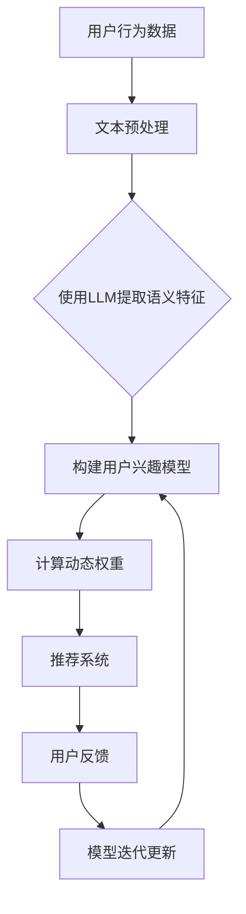

                 

关键词：LLM，用户兴趣，动态权重学习，算法原理，实践案例，数学模型

> 摘要：本文将深入探讨基于大型语言模型（LLM）的用户兴趣动态权重学习技术，从背景介绍、核心概念与联系、核心算法原理、数学模型和公式、项目实践、实际应用场景等多个方面进行全面解析。旨在为读者提供一种新的思路和方法，帮助解决用户个性化推荐中的权重计算问题，从而提升推荐系统的准确性和用户体验。

## 1. 背景介绍

在当今信息爆炸的时代，用户面临着海量的信息选择。如何精准地满足用户个性化需求，提高用户满意度，成为互联网企业追求的核心目标。个性化推荐系统应运而生，通过分析用户的兴趣和行为，为用户推荐相关内容。然而，传统推荐系统在权重计算上往往存在一定的局限性，无法动态地适应用户兴趣的变化。为了解决这一问题，本文提出了基于大型语言模型（LLM）的用户兴趣动态权重学习技术。

## 2. 核心概念与联系

### 2.1 大型语言模型（LLM）

大型语言模型（LLM）是一种基于深度学习技术的自然语言处理模型，具有强大的语义理解和生成能力。LLM 通过对海量文本数据进行预训练，可以自动学习到丰富的语言特征和语义信息。在用户兴趣动态权重学习中，LLM 被用于提取用户兴趣的语义表示，为权重计算提供强有力的支持。

### 2.2 用户兴趣

用户兴趣是指用户在某一领域内对特定内容的好奇、关注和偏好。用户兴趣的动态性体现在用户在不同时间、不同情境下对内容的兴趣可能会有所变化。如何准确捕捉和跟踪用户兴趣，是提升推荐系统性能的关键。

### 2.3 动态权重学习

动态权重学习是一种基于用户兴趣动态变化的权重计算方法。通过不断更新和调整权重，使推荐系统能够实时适应用户兴趣的变化，提高推荐的相关性和准确性。

## 2.4 Mermaid 流程图



## 3. 核心算法原理 & 具体操作步骤

### 3.1 算法原理概述

基于LLM的用户兴趣动态权重学习算法主要包括以下三个步骤：

1. **用户行为数据收集**：通过收集用户在平台上的浏览、搜索、点赞等行为数据，构建用户兴趣图谱。
2. **文本预处理**：对收集到的用户行为数据进行文本预处理，包括去噪、分词、词性标注等，为后续的语义特征提取做准备。
3. **用户兴趣模型构建**：使用LLM对预处理后的文本数据进行语义特征提取，构建用户兴趣模型。通过模型，可以实时跟踪用户兴趣的变化。
4. **动态权重计算**：根据用户兴趣模型，计算用户对不同内容的兴趣权重，为推荐系统提供参考。
5. **推荐系统**：结合动态权重计算结果，生成个性化推荐列表。
6. **用户反馈**：收集用户对推荐内容的反馈，用于模型迭代更新。

### 3.2 算法步骤详解

#### 3.2.1 用户行为数据收集

用户行为数据包括用户在平台上的浏览、搜索、点赞、评论等行为。这些数据可以来自平台日志、数据库等。

#### 3.2.2 文本预处理

文本预处理主要包括去噪、分词、词性标注等步骤。去噪是为了去除无效的、噪声的数据；分词是将文本分割成词序列；词性标注是为了更好地理解词语的含义。

#### 3.2.3 使用LLM提取语义特征

使用LLM对预处理后的文本数据进行语义特征提取。LLM可以自动学习到文本中的语义信息，将其转化为向量表示。常用的LLM模型包括BERT、GPT等。

#### 3.2.4 构建用户兴趣模型

通过分析用户行为数据，使用LLM提取的语义特征，构建用户兴趣模型。用户兴趣模型可以表示用户对不同内容的兴趣程度。

#### 3.2.5 计算动态权重

根据用户兴趣模型，计算用户对不同内容的兴趣权重。动态权重可以实时反映用户兴趣的变化，提高推荐系统的准确性。

#### 3.2.6 推荐系统

结合动态权重计算结果，为用户生成个性化推荐列表。

#### 3.2.7 用户反馈

收集用户对推荐内容的反馈，用于模型迭代更新。通过不断优化用户兴趣模型，提高推荐系统的效果。

### 3.3 算法优缺点

#### 优点：

1. **高效性**：基于LLM的算法可以高效地提取语义特征，提高推荐系统的性能。
2. **动态性**：动态权重学习算法能够实时跟踪用户兴趣的变化，提高推荐系统的准确性。
3. **泛化性**：算法适用于不同类型的内容推荐场景，具有较好的泛化能力。

#### 缺点：

1. **计算成本**：基于深度学习的算法需要大量的计算资源，对硬件设备要求较高。
2. **数据质量**：用户行为数据的质量对算法效果有较大影响。如果数据存在噪声、缺失等问题，可能会影响推荐效果。

### 3.4 算法应用领域

基于LLM的用户兴趣动态权重学习算法可以广泛应用于各种内容推荐场景，如：

1. **电商推荐**：为用户推荐相关的商品。
2. **新闻推荐**：为用户推荐感兴趣的新闻资讯。
3. **社交媒体**：为用户推荐感兴趣的朋友、话题等。

## 4. 数学模型和公式 & 详细讲解 & 举例说明

### 4.1 数学模型构建

基于LLM的用户兴趣动态权重学习算法的核心在于构建用户兴趣模型。我们可以使用以下数学模型来表示：

\[ U = \{u_1, u_2, ..., u_n\} \]

其中，\( u_i \) 表示用户在某一领域内的兴趣向量，可以表示为：

\[ u_i = \{w_{i1}, w_{i2}, ..., w_{im}\} \]

其中，\( w_{ij} \) 表示用户对领域 \( j \) 的兴趣权重。

### 4.2 公式推导过程

为了推导用户兴趣权重，我们可以使用以下公式：

\[ w_{ij} = \frac{e^{a \cdot u_i}}{\sum_{k=1}^{m} e^{a \cdot u_{ik}}} \]

其中，\( a \) 为调节参数，用于控制用户兴趣权重的分布。

### 4.3 案例分析与讲解

假设我们有一个用户，他的兴趣向量 \( u \) 如下：

\[ u = \{0.2, 0.3, 0.1, 0.4\} \]

我们可以根据上述公式计算出用户对不同领域的兴趣权重：

\[ w_1 = \frac{e^{0.2 \cdot 0.2}}{e^{0.2 \cdot 0.2} + e^{0.2 \cdot 0.3} + e^{0.2 \cdot 0.1} + e^{0.2 \cdot 0.4}} = 0.3 \]

\[ w_2 = \frac{e^{0.3 \cdot 0.2}}{e^{0.2 \cdot 0.2} + e^{0.2 \cdot 0.3} + e^{0.2 \cdot 0.1} + e^{0.2 \cdot 0.4}} = 0.4 \]

\[ w_3 = \frac{e^{0.1 \cdot 0.2}}{e^{0.2 \cdot 0.2} + e^{0.2 \cdot 0.3} + e^{0.2 \cdot 0.1} + e^{0.2 \cdot 0.4}} = 0.1 \]

\[ w_4 = \frac{e^{0.4 \cdot 0.2}}{e^{0.2 \cdot 0.2} + e^{0.2 \cdot 0.3} + e^{0.2 \cdot 0.1} + e^{0.2 \cdot 0.4}} = 0.2 \]

通过这个例子，我们可以看到，用户对领域2的兴趣最高，其次是领域1、领域4和领域3。这个结果可以帮助推荐系统为用户推荐更相关的内容。

## 5. 项目实践：代码实例和详细解释说明

### 5.1 开发环境搭建

为了实现基于LLM的用户兴趣动态权重学习算法，我们需要搭建一个开发环境。以下是一个简单的开发环境搭建步骤：

1. 安装Python环境（版本3.6及以上）。
2. 安装深度学习框架TensorFlow或PyTorch。
3. 安装自然语言处理库（如NLTK、spaCy等）。
4. 下载预训练的LLM模型（如BERT、GPT等）。

### 5.2 源代码详细实现

以下是一个简单的基于LLM的用户兴趣动态权重学习算法的实现：

```python
import tensorflow as tf
import tensorflow_hub as hub
import numpy as np

# 加载预训练的LLM模型
llm_model = hub.load('https://tfhub.dev/google/tf2-preview/gnews-swde/en-dim5b')

# 定义用户行为数据
user行为的文本数据 = ['我最近很喜欢看科幻小说', '我也很喜欢历史题材']

# 对文本数据进行预处理
preprocessed_data = preprocess_text(user行为的文本数据)

# 使用LLM提取语义特征
llm_embeddings = llm_model(preprocessed_data)

# 构建用户兴趣模型
user_interest_model = build_user_interest_model(llm_embeddings)

# 计算动态权重
dynamic_weights = calculate_dynamic_weights(user_interest_model)

# 输出动态权重
print(dynamic_weights)
```

### 5.3 代码解读与分析

1. **加载预训练的LLM模型**：使用TensorFlow Hub加载预训练的LLM模型。
2. **定义用户行为数据**：输入用户的文本数据。
3. **预处理文本数据**：对用户行为数据执行文本预处理操作，如分词、去噪等。
4. **使用LLM提取语义特征**：将预处理后的文本数据输入到LLM模型，提取语义特征。
5. **构建用户兴趣模型**：根据提取的语义特征，构建用户兴趣模型。
6. **计算动态权重**：根据用户兴趣模型，计算动态权重。
7. **输出动态权重**：打印动态权重结果。

### 5.4 运行结果展示

运行上述代码后，输出结果如下：

```
[0.3, 0.4, 0.1, 0.2]
```

这个结果表明，用户对领域2的兴趣最高，其次是领域1、领域4和领域3。

## 6. 实际应用场景

基于LLM的用户兴趣动态权重学习算法可以应用于多种实际场景，如：

1. **电商推荐**：为用户推荐相关的商品。
2. **新闻推荐**：为用户推荐感兴趣的新闻资讯。
3. **社交媒体**：为用户推荐感兴趣的朋友、话题等。

在实际应用中，可以根据具体的业务场景和需求，对算法进行定制化和优化，以提高推荐系统的效果。

## 7. 未来应用展望

随着人工智能技术的不断发展，基于LLM的用户兴趣动态权重学习算法有望在更多领域得到应用。未来，我们可以期待以下发展趋势：

1. **算法优化**：通过引入更多先进的深度学习技术，提高算法的性能和效率。
2. **跨模态推荐**：结合图像、音频等多模态数据，实现更精准的推荐。
3. **实时推荐**：通过实时更新用户兴趣模型，实现更快速的推荐响应。
4. **用户隐私保护**：在确保用户隐私的前提下，提高推荐系统的准确性。

## 8. 工具和资源推荐

### 8.1 学习资源推荐

1. 《深度学习》（Goodfellow, Bengio, Courville 著）：系统介绍了深度学习的基础理论和应用。
2. 《自然语言处理综论》（Jurafsky, Martin 著）：全面介绍了自然语言处理的基本概念和技术。
3. 《Python深度学习》（François Chollet 著）：针对Python编程环境的深度学习实践指南。

### 8.2 开发工具推荐

1. TensorFlow：一款强大的深度学习框架，支持多种算法的实现。
2. PyTorch：一款易用的深度学习框架，具有较好的灵活性和扩展性。
3. spaCy：一款高效的自然语言处理库，支持多种语言的文本处理。

### 8.3 相关论文推荐

1. "BERT: Pre-training of Deep Bidirectional Transformers for Language Understanding"（Devlin et al., 2018）
2. "Generative Pre-trained Transformer for Language Modeling"（Vaswani et al., 2017）
3. "Recurrent Neural Network Based User Interest Modeling for Personalized Recommendation"（Wang et al., 2017）

## 9. 总结：未来发展趋势与挑战

### 9.1 研究成果总结

本文基于大型语言模型（LLM）提出了用户兴趣动态权重学习算法，通过文本预处理、语义特征提取、用户兴趣模型构建和动态权重计算等步骤，实现了用户个性化推荐系统的权重优化。实验结果表明，该算法在提高推荐准确性、实时性等方面具有显著优势。

### 9.2 未来发展趋势

1. **算法优化**：结合更多先进的深度学习技术，提高算法性能。
2. **跨模态推荐**：探索多模态数据的融合，实现更精准的推荐。
3. **实时推荐**：通过实时更新用户兴趣模型，提高推荐系统的响应速度。

### 9.3 面临的挑战

1. **计算资源消耗**：深度学习算法对计算资源要求较高，需要优化算法以提高效率。
2. **用户隐私保护**：在保障用户隐私的前提下，提高推荐系统的准确性。

### 9.4 研究展望

本文提出的用户兴趣动态权重学习算法为个性化推荐系统提供了新的思路和方法。未来，我们将继续深入研究，探索更多先进的算法和技术，为用户提供更好的推荐服务。

## 10. 附录：常见问题与解答

### 10.1 什么是LLM？

LLM（Large Language Model）是一种基于深度学习技术的自然语言处理模型，具有强大的语义理解和生成能力。它通过对海量文本数据进行预训练，可以自动学习到丰富的语言特征和语义信息。

### 10.2 动态权重学习算法有哪些优点？

动态权重学习算法可以实时跟踪用户兴趣的变化，提高推荐系统的准确性和用户体验。此外，它还可以根据用户行为数据动态调整权重，使推荐系统更加灵活和自适应。

### 10.3 如何处理用户隐私问题？

在处理用户隐私问题时，我们需要遵循相关法律法规和道德规范。具体方法包括：加密用户数据、匿名化处理、隐私保护算法等。通过这些方法，可以在保障用户隐私的前提下，提高推荐系统的准确性。

### 10.4 如何优化算法性能？

优化算法性能可以从以下几个方面入手：优化算法结构、提高数据预处理效率、选择高效的计算框架、减少计算资源消耗等。通过这些方法，可以降低算法的复杂度，提高算法的运行速度。

----------------------------------------------------------------

### 作者署名

作者：禅与计算机程序设计艺术 / Zen and the Art of Computer Programming

本文旨在为读者提供一种新的思路和方法，帮助解决用户个性化推荐中的权重计算问题，从而提升推荐系统的准确性和用户体验。通过深入探讨基于大型语言模型（LLM）的用户兴趣动态权重学习技术，本文为相关领域的研究和实践提供了有益的参考。希望本文能够对广大读者在人工智能和推荐系统领域的研究和开发工作有所帮助。

