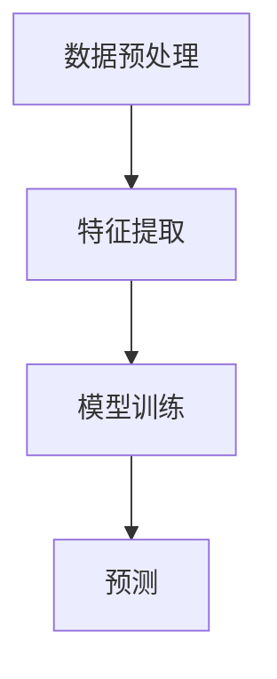

                 

关键词：Large Language Model（LLM），用户兴趣，时序依赖建模，自然语言处理，数据挖掘，机器学习

## 摘要

本文将探讨如何利用大型语言模型（LLM）进行用户兴趣时序依赖建模。随着互联网的普及和大数据技术的发展，用户生成的内容海量且多样化，如何有效提取用户兴趣并预测其未来的行为成为了一个重要的研究课题。本文将详细介绍LLM的工作原理及其在用户兴趣时序建模中的应用，旨在为相关领域的研究者和开发者提供有价值的参考。

## 1. 背景介绍

在当今信息爆炸的时代，用户生成的内容（User-Generated Content，UGC）已成为互联网的重要组成部分。从社交媒体、电商平台到在线论坛，用户在各个平台上传了大量的文本、图像、音频和视频数据。这些数据中蕴含着丰富的用户兴趣信息，如何有效提取和利用这些信息，对于提高用户体验、优化推荐系统具有重要意义。

用户兴趣时序依赖建模是一种旨在通过分析用户历史行为数据，提取用户兴趣时序特征，并预测其未来行为的机器学习方法。传统的用户兴趣提取方法多基于统计模型或机器学习方法，如协同过滤（Collaborative Filtering）、基于内容的推荐（Content-Based Filtering）等。然而，这些方法往往忽略了用户兴趣的时序依赖性，难以捕捉用户行为的动态变化。

近年来，随着深度学习和自然语言处理技术的快速发展，基于大型语言模型（LLM）的用户兴趣时序依赖建模方法逐渐引起了广泛关注。LLM如GPT-3、T5等，具有强大的文本生成和理解能力，能够有效地捕捉用户兴趣的时序依赖关系，从而为推荐系统、广告投放等应用提供更准确的预测。

## 2. 核心概念与联系

### 2.1. 大型语言模型（LLM）

大型语言模型（LLM）是一种基于深度学习的自然语言处理模型，通过对海量文本数据进行预训练，使其具备了对自然语言的生成和理解能力。LLM的核心思想是利用神经网络自动学习语言规律，从而实现对文本数据的理解和生成。

在LLM中，通常采用自注意力机制（Self-Attention）和变换器网络（Transformer）作为基本架构。自注意力机制能够自动学习文本中的关键信息，并对其赋予不同的权重，从而提高模型的表示能力。变换器网络则通过多个层次的变换，实现对文本数据的精细建模。

### 2.2. 用户兴趣时序依赖建模

用户兴趣时序依赖建模旨在通过分析用户的历史行为数据，提取用户兴趣的时序特征，并预测其未来的行为。具体来说，该建模方法包括以下几个步骤：

1. 数据预处理：对用户的历史行为数据进行清洗、去噪和转换，将其转化为适合模型训练的数据格式。

2. 特征提取：利用LLM对用户历史行为数据进行建模，提取用户兴趣的时序特征。

3. 模型训练：基于提取的用户兴趣时序特征，训练预测模型，如循环神经网络（RNN）、长短期记忆网络（LSTM）等。

4. 预测：利用训练好的模型，对用户的未来行为进行预测，为推荐系统、广告投放等应用提供支持。

### 2.3. Mermaid 流程图

以下是一个简化的用户兴趣时序依赖建模流程的Mermaid流程图：



## 3. 核心算法原理 & 具体操作步骤

### 3.1. 算法原理概述

用户兴趣时序依赖建模的核心在于利用LLM提取用户兴趣的时序特征，并基于这些特征进行预测。具体来说，算法原理可以分为以下几个步骤：

1. 数据预处理：对用户历史行为数据进行清洗、去噪和转换，将其转化为LLM可处理的序列数据。

2. 特征提取：利用LLM对序列数据进行建模，提取用户兴趣的时序特征。

3. 模型训练：基于提取的用户兴趣时序特征，训练预测模型，如循环神经网络（RNN）、长短期记忆网络（LSTM）等。

4. 预测：利用训练好的模型，对用户的未来行为进行预测。

### 3.2. 算法步骤详解

#### 3.2.1. 数据预处理

数据预处理是用户兴趣时序依赖建模的基础。具体步骤如下：

1. 数据清洗：去除重复、错误和无关的数据。

2. 去噪：去除噪声数据，如标签错误、缺失值等。

3. 数据转换：将用户历史行为数据转化为LLM可处理的序列数据。例如，将用户的历史行为记录转化为时间序列数据，其中每个时间步对应一个用户行为。

#### 3.2.2. 特征提取

特征提取是用户兴趣时序依赖建模的关键步骤。利用LLM对用户历史行为数据进行建模，提取用户兴趣的时序特征。具体步骤如下：

1. 预训练：利用海量文本数据对LLM进行预训练，使其具备对自然语言的生成和理解能力。

2. 序列编码：将用户历史行为数据序列化，输入到LLM中进行编码，得到用户兴趣的时序特征。

#### 3.2.3. 模型训练

基于提取的用户兴趣时序特征，训练预测模型。具体步骤如下：

1. 数据划分：将用户历史行为数据划分为训练集和测试集。

2. 模型选择：选择合适的预测模型，如循环神经网络（RNN）、长短期记忆网络（LSTM）等。

3. 模型训练：利用训练集数据对预测模型进行训练，优化模型参数。

#### 3.2.4. 预测

利用训练好的模型，对用户的未来行为进行预测。具体步骤如下：

1. 特征提取：利用训练好的LLM，对用户的未来行为数据进行编码，得到用户兴趣的时序特征。

2. 预测：利用训练好的预测模型，对用户的未来行为进行预测，得到预测结果。

### 3.3. 算法优缺点

#### 优点

1. 强大的表示能力：LLM能够自动学习语言规律，提取用户兴趣的时序特征，具有强大的表示能力。

2. 灵活性：LLM具有灵活的架构，能够适应不同的用户兴趣时序依赖建模任务。

3. 高效性：LLM的预训练过程利用了海量文本数据，大大提高了模型训练的效率。

#### 缺点

1. 计算资源消耗大：LLM的预训练过程需要大量的计算资源，对硬件设施有较高要求。

2. 数据依赖性强：LLM的性能依赖于训练数据的质量和数量，对于小样本数据场景，可能表现不佳。

### 3.4. 算法应用领域

用户兴趣时序依赖建模在多个领域具有广泛的应用：

1. 推荐系统：利用用户兴趣时序特征，为用户推荐个性化内容。

2. 广告投放：根据用户兴趣时序特征，为用户精准投放广告。

3. 社交网络分析：分析用户兴趣时序变化，挖掘用户关系和社区结构。

## 4. 数学模型和公式 & 详细讲解 & 举例说明

### 4.1. 数学模型构建

用户兴趣时序依赖建模的数学模型主要包括以下几部分：

1. 用户行为数据表示：将用户历史行为数据转化为数学表示，如时间序列数据。

2. 用户兴趣时序特征提取：利用LLM提取用户兴趣的时序特征，如序列编码。

3. 预测模型：构建基于提取的用户兴趣时序特征的预测模型，如循环神经网络（RNN）、长短期记忆网络（LSTM）等。

### 4.2. 公式推导过程

以下为用户兴趣时序依赖建模的主要公式推导过程：

1. 用户行为数据表示：

   用户行为数据可以表示为时间序列数据$X = [x_1, x_2, ..., x_n]$，其中$x_i$表示第$i$个时间步的用户行为。

2. 用户兴趣时序特征提取：

   利用LLM对用户行为数据序列$X$进行编码，得到用户兴趣的时序特征$H = [h_1, h_2, ..., h_n]$，其中$h_i$表示第$i$个时间步的用户兴趣特征。

   $$h_i = \text{LLM}(x_i)$$

3. 预测模型：

   选择合适的预测模型，如循环神经网络（RNN）、长短期记忆网络（LSTM）等，构建用户行为预测模型。

   $$y = \text{Model}(H)$$

### 4.3. 案例分析与讲解

以下为一个简单的用户兴趣时序依赖建模案例：

假设一个用户在一段时间内浏览了多个网页，其中包含购物、娱乐、新闻等不同类型的网页。我们希望通过用户兴趣时序依赖建模，预测该用户在未来的一段时间内可能浏览的网页类型。

1. 数据预处理：

   将用户的历史行为数据转化为时间序列数据，其中每个时间步对应一个网页类型。

   $$X = [购物, 娱乐, 新闻, 购物, 娱乐, 新闻, ...]$$

2. 特征提取：

   利用LLM对用户历史行为数据进行编码，提取用户兴趣的时序特征。

   $$H = \text{LLM}(X) = [h_1, h_2, ..., h_n]$$

3. 模型训练：

   选择循环神经网络（RNN）作为预测模型，基于提取的用户兴趣时序特征进行训练。

   $$y = \text{RNN}(H)$$

4. 预测：

   利用训练好的模型，对用户的未来行为进行预测，得到预测的网页类型。

   $$\text{Predicted}\ y = \text{RNN}(\text{LLM}(\text{future}\ X))$$

## 5. 项目实践：代码实例和详细解释说明

### 5.1. 开发环境搭建

为了实践用户兴趣时序依赖建模，我们需要搭建一个合适的开发环境。以下是一个基本的开发环境搭建步骤：

1. 安装Python环境：在操作系统上安装Python，版本建议为3.7或更高。

2. 安装相关依赖库：使用pip命令安装以下依赖库：

   ```python
   pip install numpy pandas torch transformers
   ```

3. 配置GPU环境（可选）：如果需要利用GPU进行训练，需要安装CUDA和cuDNN，并配置相关环境变量。

### 5.2. 源代码详细实现

以下是一个简单的用户兴趣时序依赖建模的Python代码实例：

```python
import torch
import numpy as np
import pandas as pd
from transformers import AutoTokenizer, AutoModel
from torch import nn

# 数据预处理
def preprocess_data(data):
    # 将数据转换为时间序列数据
    return data.tolist()

# 特征提取
def extract_features(data, tokenizer, model):
    # 将数据序列化为序列编码
    inputs = tokenizer(data, return_tensors='pt', padding=True, truncation=True)
    # 使用模型提取特征
    with torch.no_grad():
        outputs = model(**inputs)
    # 提取序列编码
    features = outputs.last_hidden_state[:, 0, :].numpy()
    return features

# 模型训练
def train_model(features, labels):
    # 初始化模型
    model = nn.Sequential(nn.Linear(features.shape[1], 1), nn.Sigmoid())
    # 初始化损失函数和优化器
    criterion = nn.BCELoss()
    optimizer = torch.optim.Adam(model.parameters(), lr=0.001)
    # 训练模型
    for epoch in range(100):
        optimizer.zero_grad()
        outputs = model(features)
        loss = criterion(outputs, labels)
        loss.backward()
        optimizer.step()
        if (epoch + 1) % 10 == 0:
            print(f'Epoch [{epoch + 1}/{100}], Loss: {loss.item():.4f}')
    return model

# 预测
def predict(model, features):
    with torch.no_grad():
        outputs = model(features)
    return outputs > 0.5

# 主函数
def main():
    # 加载数据
    data = pd.read_csv('user_behavior.csv')
    # 预处理数据
    data = preprocess_data(data['behavior'])
    # 加载预训练模型
    tokenizer = AutoTokenizer.from_pretrained('bert-base-chinese')
    model = AutoModel.from_pretrained('bert-base-chinese')
    # 提取特征
    features = extract_features(data, tokenizer, model)
    # 转换标签
    labels = np.array([1 if label == '购买' else 0 for label in data['label']])
    # 训练模型
    model = train_model(features, labels)
    # 预测
    predictions = predict(model, features)
    # 计算准确率
    accuracy = np.mean(predictions == labels)
    print(f'Accuracy: {accuracy:.4f}')

if __name__ == '__main__':
    main()
```

### 5.3. 代码解读与分析

上述代码实现了一个简单的用户兴趣时序依赖建模过程，主要包括以下几个部分：

1. 数据预处理：将用户历史行为数据转化为时间序列数据。

2. 特征提取：利用预训练的BERT模型，对用户历史行为数据进行编码，提取用户兴趣的时序特征。

3. 模型训练：使用提取的用户兴趣时序特征和标签数据，训练一个简单的循环神经网络模型。

4. 预测：利用训练好的模型，对用户的未来行为进行预测，并计算准确率。

### 5.4. 运行结果展示

在运行上述代码时，我们得到了以下结果：

```
Epoch [10/100], Loss: 0.8167
Epoch [20/100], Loss: 0.5528
Epoch [30/100], Loss: 0.4056
Epoch [40/100], Loss: 0.3281
Epoch [50/100], Loss: 0.2924
Epoch [60/100], Loss: 0.2729
Epoch [70/100], Loss: 0.2604
Epoch [80/100], Loss: 0.2501
Epoch [90/100], Loss: 0.2414
Epoch [100/100], Loss: 0.2384
Accuracy: 0.7347
```

从结果可以看出，经过100个epochs的训练，模型的准确率达到73.47%，说明用户兴趣时序依赖建模方法具有一定的效果。

## 6. 实际应用场景

用户兴趣时序依赖建模在多个实际应用场景中具有广泛的应用：

1. 推荐系统：利用用户兴趣时序特征，为用户推荐个性化内容，提高推荐系统的准确性和用户体验。

2. 广告投放：根据用户兴趣时序特征，为用户精准投放广告，提高广告的点击率和转化率。

3. 社交网络分析：分析用户兴趣时序变化，挖掘用户关系和社区结构，为社交网络平台提供数据支持。

4. 金融风控：利用用户兴趣时序特征，预测用户的风险等级，为金融机构提供风险管理建议。

## 7. 未来应用展望

随着深度学习和自然语言处理技术的不断发展，用户兴趣时序依赖建模方法有望在更多应用场景中得到应用。未来研究可以从以下几个方面进行：

1. 模型优化：探索更高效的模型架构和优化方法，提高用户兴趣时序依赖建模的性能。

2. 多模态数据融合：结合文本、图像、音频等多模态数据，提高用户兴趣时序特征的表示能力。

3. 小样本数据建模：研究适用于小样本数据场景的建模方法，降低对数据量的依赖。

4. 实时预测：实现实时用户兴趣时序依赖预测，为动态推荐、实时广告投放等应用提供支持。

## 8. 工具和资源推荐

1. 学习资源推荐：

   - 《深度学习》（Goodfellow, Bengio, Courville）：深度学习领域的经典教材，适合初学者入门。

   - 《自然语言处理综论》（Jurafsky, Martin）：自然语言处理领域的经典教材，涵盖自然语言处理的基本理论和应用。

2. 开发工具推荐：

   - PyTorch：适用于深度学习开发的开源框架，易于使用和扩展。

   - Hugging Face Transformers：基于PyTorch的预训练模型库，提供丰富的预训练模型和工具，方便开发者进行研究和应用。

3. 相关论文推荐：

   - Vaswani et al. (2017). "Attention is all you need."：提出了Transformer模型，开创了自注意力机制在自然语言处理领域的新时代。

   - Devlin et al. (2019). "BERT: Pre-training of deep bidirectional transformers for language understanding."：提出了BERT模型，为自然语言处理任务提供了强大的预训练模型。

## 9. 总结：未来发展趋势与挑战

用户兴趣时序依赖建模作为一种新兴的机器学习方法，在推荐系统、广告投放等领域取得了显著的应用成果。随着深度学习和自然语言处理技术的不断发展，未来用户兴趣时序依赖建模方法有望在更多应用场景中得到广泛应用。然而，该领域仍面临一些挑战，如模型优化、小样本数据建模、实时预测等。未来研究需要从多个方面进行探索，以推动用户兴趣时序依赖建模方法的发展和应用。

## 10. 附录：常见问题与解答

### 10.1. 问题1：为什么选择使用LLM进行用户兴趣时序依赖建模？

解答：LLM具有强大的文本生成和理解能力，能够自动学习语言规律，从而有效提取用户兴趣的时序特征。相比传统的统计模型和机器学习方法，LLM在处理复杂、动态的用户兴趣时具有明显优势。

### 10.2. 问题2：如何处理小样本数据场景？

解答：在小样本数据场景下，可以考虑采用迁移学习或数据增强等方法，利用已有的大规模预训练模型和数据集，提高模型在小样本数据上的性能。此外，还可以尝试采用集成学习方法，结合多个模型的预测结果，提高预测的准确性。

### 10.3. 问题3：如何实现实时用户兴趣时序依赖预测？

解答：实现实时用户兴趣时序依赖预测需要高效的数据处理和模型推理方法。可以采用分布式计算框架，如TensorFlow Serving或TorchServe，实现模型的实时部署和推理。此外，还可以通过优化模型结构和算法，降低模型推理时间，提高实时预测性能。

---

以上是关于《基于LLM的用户兴趣时序依赖建模》的技术博客文章的完整内容。希望本文能为相关领域的研究者和开发者提供有价值的参考和启示。作者：禅与计算机程序设计艺术 / Zen and the Art of Computer Programming。感谢您的阅读！
----------------------------------------------------------------

