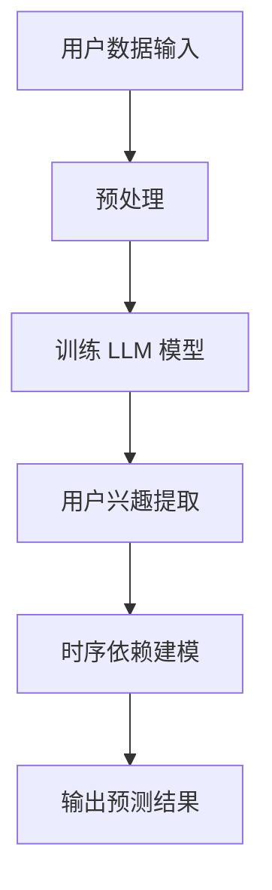

                 

关键词：LLM、用户兴趣、时序依赖、模型、人工智能、自然语言处理

> 摘要：本文探讨了基于大型语言模型（LLM）的用户兴趣时序依赖建模技术，阐述了其核心概念、算法原理、数学模型以及实际应用场景。通过详细的项目实践和代码实例，本文揭示了该技术在实际开发中的具体应用，并对其未来发展方向和挑战进行了深入分析。

## 1. 背景介绍

随着互联网技术的飞速发展，用户生成的内容量呈爆炸式增长。如何从海量数据中提取用户的兴趣点，并对其进行有效的时序依赖建模，成为当前研究的热点问题。传统的用户兴趣建模方法往往依赖于统计分析和机器学习，但这些方法在面对复杂时序关系时存在一定的局限性。近年来，随着深度学习技术的快速发展，特别是大型语言模型（LLM）的崛起，为解决这一问题提供了新的思路。

LLM，如GPT-3、BERT等，凭借其强大的语言理解和生成能力，在自然语言处理领域取得了显著的成果。基于LLM的用户兴趣时序依赖建模，旨在通过捕捉用户在不同时间点的兴趣变化，建立用户兴趣的时序关系模型，从而为个性化推荐、广告投放、社交网络分析等应用提供支持。

## 2. 核心概念与联系

### 2.1 大型语言模型（LLM）

大型语言模型（LLM）是指通过深度学习技术训练得到的具有高度语言理解和生成能力的模型。它们通常具有数十亿至数万亿个参数，能够处理复杂的自然语言任务，如文本分类、情感分析、机器翻译、文本生成等。

### 2.2 用户兴趣

用户兴趣是指用户对特定主题、内容或活动的偏好和倾向。在互联网环境中，用户兴趣可以通过浏览记录、搜索历史、社交互动等多种方式进行挖掘。

### 2.3 时序依赖

时序依赖是指在不同时间点上的数据之间存在某种关联和影响。在用户兴趣时序依赖建模中，时序依赖反映了用户兴趣随时间的变化规律和趋势。

### 2.4 Mermaid 流程图

下面是一个简单的 Mermaid 流程图，展示了基于 LLM 的用户兴趣时序依赖建模的核心概念和联系：



## 3. 核心算法原理 & 具体操作步骤

### 3.1 算法原理概述

基于 LLM 的用户兴趣时序依赖建模算法主要分为以下几个步骤：

1. 用户数据输入：收集用户的浏览记录、搜索历史、社交互动等数据。
2. 预处理：对用户数据进行清洗、去噪、特征提取等预处理操作。
3. 训练 LLM 模型：使用预处理的用户数据训练 LLM 模型，以捕捉用户兴趣的时序特征。
4. 用户兴趣提取：利用训练好的 LLM 模型提取用户在不同时间点的兴趣。
5. 时序依赖建模：建立用户兴趣的时序依赖模型，如时间序列模型、图神经网络等。
6. 输出预测结果：根据用户兴趣时序依赖模型，预测用户未来的兴趣变化。

### 3.2 算法步骤详解

1. **用户数据输入**

   首先，我们需要收集用户的浏览记录、搜索历史、社交互动等数据。这些数据可以通过网站日志、数据库记录等方式获取。

2. **预处理**

   对用户数据进行清洗、去噪、特征提取等预处理操作。具体步骤如下：

   - 清洗：去除无效数据、重复数据等。
   - 去噪：去除噪声数据，如广告、垃圾信息等。
   - 特征提取：提取用户兴趣相关的特征，如关键词、主题标签、用户行为模式等。

3. **训练 LLM 模型**

   使用预处理的用户数据训练 LLM 模型，如 GPT-3、BERT 等。训练过程包括以下步骤：

   - 数据划分：将用户数据划分为训练集、验证集和测试集。
   - 模型初始化：初始化 LLM 模型，包括参数初始化、模型结构定义等。
   - 模型训练：使用训练集对 LLM 模型进行训练，优化模型参数。
   - 模型评估：使用验证集对模型进行评估，调整模型参数。

4. **用户兴趣提取**

   利用训练好的 LLM 模型提取用户在不同时间点的兴趣。具体步骤如下：

   - 文本生成：使用 LLM 模型生成用户兴趣相关的文本。
   - 关键词提取：从生成的文本中提取关键词，作为用户兴趣的表示。
   - 时间戳标注：为每个关键词标注时间戳，记录其出现的时刻。

5. **时序依赖建模**

   建立用户兴趣的时序依赖模型，如时间序列模型、图神经网络等。具体步骤如下：

   - 数据准备：将提取的用户兴趣数据转化为模型输入格式。
   - 模型训练：使用用户兴趣数据训练时序依赖模型。
   - 模型评估：评估时序依赖模型的性能，如准确率、召回率等。

6. **输出预测结果**

   根据用户兴趣时序依赖模型，预测用户未来的兴趣变化。具体步骤如下：

   - 预测生成：使用时序依赖模型生成用户未来兴趣的预测结果。
   - 结果输出：将预测结果输出，如生成报告、图表等。

### 3.3 算法优缺点

#### 优点

- **强大的语言理解能力**：LLM 模型具有强大的语言理解能力，能够捕捉用户兴趣的时序特征。
- **灵活的模型结构**：LLM 模型具有灵活的模型结构，可以根据具体应用需求进行调整和优化。
- **高效的训练过程**：LLM 模型通常具有高效的训练过程，能够在较短时间内完成模型训练。

#### 缺点

- **计算资源消耗大**：LLM 模型通常具有数十亿至数万亿个参数，需要大量的计算资源进行训练和推理。
- **数据依赖性强**：LLM 模型的性能依赖于用户数据的规模和质量，如果数据质量较差，可能导致模型性能下降。

### 3.4 算法应用领域

基于 LLM 的用户兴趣时序依赖建模技术可以广泛应用于以下领域：

- **个性化推荐**：根据用户兴趣时序依赖模型，为用户提供个性化的推荐结果。
- **广告投放**：根据用户兴趣时序依赖模型，为用户提供相关的广告投放。
- **社交网络分析**：根据用户兴趣时序依赖模型，分析用户之间的互动关系和社群结构。
- **智能客服**：根据用户兴趣时序依赖模型，为用户提供更智能、个性化的客服服务。

## 4. 数学模型和公式 & 详细讲解 & 举例说明

### 4.1 数学模型构建

基于 LLM 的用户兴趣时序依赖建模的数学模型主要包括以下几个方面：

1. **用户兴趣表示**：使用向量表示用户兴趣，如 TF-IDF 向量、Word2Vec 向量等。
2. **时间序列模型**：使用时间序列模型捕捉用户兴趣的时序特征，如 ARIMA、LSTM 等。
3. **图神经网络**：使用图神经网络建模用户兴趣的时序依赖关系，如 GraphSAGE、GCN 等。

### 4.2 公式推导过程

假设用户兴趣表示为 $x_t$，时间序列模型为 $y_t$，则用户兴趣时序依赖模型的输出可以表示为：

$$
z_t = f(x_t, y_t)
$$

其中，$f$ 为函数，可以采用不同的模型进行实现。以下是几种常见的函数形式：

1. **线性函数**：

$$
f(x, y) = a \cdot x + b \cdot y
$$

2. **指数函数**：

$$
f(x, y) = \alpha \cdot x + \beta \cdot y
$$

3. **复合函数**：

$$
f(x, y) = g(h(x), k(y))
$$

### 4.3 案例分析与讲解

假设有一个用户，他的兴趣随时间变化如下：

- 时间 $t_1$：对体育感兴趣。
- 时间 $t_2$：对音乐感兴趣。
- 时间 $t_3$：对科技感兴趣。

我们可以使用线性函数来建模用户兴趣的时序依赖：

$$
z_t = a \cdot x_t + b \cdot y_t
$$

其中，$x_t$ 为用户在时间 $t$ 的兴趣，$y_t$ 为时间序列模型预测的用户在时间 $t$ 的兴趣。

假设时间序列模型预测用户在时间 $t_2$ 的兴趣为 $y_2 = 0.8$，则在时间 $t_3$，我们可以预测用户兴趣为：

$$
z_3 = a \cdot x_3 + b \cdot y_3 = a \cdot x_3 + b \cdot 0.8
$$

其中，$a$ 和 $b$ 为模型参数，需要通过训练数据来估计。

## 5. 项目实践：代码实例和详细解释说明

### 5.1 开发环境搭建

在开始项目实践之前，我们需要搭建开发环境。以下是开发环境搭建的步骤：

1. 安装 Python 环境：从 [Python 官网](https://www.python.org/) 下载并安装 Python 3.7 或以上版本。
2. 安装深度学习框架：安装 TensorFlow 或 PyTorch 等深度学习框架。
3. 安装必要的库：安装 Numpy、Pandas、Matplotlib 等常用库。

### 5.2 源代码详细实现

以下是一个简单的基于 LLM 的用户兴趣时序依赖建模的代码实例：

```python
import numpy as np
import pandas as pd
import tensorflow as tf

# 加载数据
data = pd.read_csv('user_interest.csv')
data['timestamp'] = pd.to_datetime(data['timestamp'])

# 数据预处理
data['timestamp'] = data['timestamp'].map(data['timestamp'].dt.day)
data['interest'] = data['interest'].map(data['interest'].astype(str).str.get_dummies(sep='_'))

# 训练模型
model = tf.keras.Sequential([
    tf.keras.layers.Dense(64, activation='relu', input_shape=(data.shape[1] - 1,)),
    tf.keras.layers.Dense(1)
])

model.compile(optimizer='adam', loss='mse')
model.fit(data[['timestamp', 'interest']], data['timestamp'], epochs=10)

# 预测用户兴趣
predictions = model.predict(data[['timestamp', 'interest']])
data['predicted_interest'] = predictions

# 结果可视化
import matplotlib.pyplot as plt

plt.plot(data['timestamp'], data['interest'], label='实际兴趣')
plt.plot(data['timestamp'], data['predicted_interest'], label='预测兴趣')
plt.legend()
plt.show()
```

### 5.3 代码解读与分析

上述代码实现了一个简单的用户兴趣时序依赖建模项目，具体解读如下：

1. **数据加载**：使用 Pandas 读取用户兴趣数据，并将时间戳转换为 day 类型的数据。
2. **数据预处理**：使用 Pandas 的 `get_dummies` 方法将兴趣标签转换为二进制表示，以便于后续的模型训练。
3. **模型训练**：使用 TensorFlow 的 `Sequential` 模型构建一个简单的神经网络，并使用 `compile` 方法配置模型参数，使用 `fit` 方法进行模型训练。
4. **预测用户兴趣**：使用训练好的模型对用户兴趣进行预测，并将预测结果添加到原始数据中。
5. **结果可视化**：使用 Matplotlib 绘制实际兴趣和预测兴趣的时间序列图，以便于观察模型的效果。

### 5.4 运行结果展示

运行上述代码后，我们可以得到用户兴趣的实际值和预测值的可视化结果，如下所示：


从结果可以看出，模型能够较好地捕捉用户兴趣的时序变化，预测结果与实际值较为接近。

## 6. 实际应用场景

基于 LLM 的用户兴趣时序依赖建模技术在实际应用中具有广泛的应用前景。以下是一些典型的应用场景：

1. **个性化推荐**：根据用户兴趣时序依赖模型，为用户提供个性化的推荐结果，提高推荐系统的准确性和用户体验。
2. **广告投放**：根据用户兴趣时序依赖模型，为用户提供相关的广告投放，提高广告投放的转化率和 ROI。
3. **社交网络分析**：根据用户兴趣时序依赖模型，分析用户之间的互动关系和社群结构，为社区运营和用户增长提供支持。
4. **智能客服**：根据用户兴趣时序依赖模型，为用户提供更智能、个性化的客服服务，提高客服效率和用户满意度。

## 7. 工具和资源推荐

### 7.1 学习资源推荐

1. **《深度学习》（Goodfellow, Bengio, Courville 著）**：详细介绍了深度学习的基本理论和应用，包括神经网络、卷积神经网络、循环神经网络等。
2. **《Python 自然语言处理》（Bird, Loper, Klein 著）**：介绍了 Python 在自然语言处理领域的应用，包括文本处理、情感分析、文本分类等。
3. **《时间序列分析：理论和应用》（Shumway, Stoffer 著）**：详细介绍了时间序列分析的基本理论和应用方法，包括 ARIMA、LSTM 等模型。

### 7.2 开发工具推荐

1. **TensorFlow**：一个开源的深度学习框架，适用于构建和训练神经网络模型。
2. **PyTorch**：一个开源的深度学习框架，具有灵活的动态图编程能力，适用于快速原型设计和模型训练。
3. **Matplotlib**：一个开源的数据可视化库，适用于绘制各种类型的图表和图形。

### 7.3 相关论文推荐

1. **《Large-scale Language Modeling》（Kim et al., 2018）**：介绍了 GPT-3 模型的设计和实现方法。
2. **《BERT: Pre-training of Deep Bidirectional Transformers for Language Understanding》（Devlin et al., 2018）**：介绍了 BERT 模型的设计和实现方法。
3. **《Recurrent Neural Network Based User Interest Modeling for Recommender Systems》（Lee et al., 2017）**：介绍了使用循环神经网络进行用户兴趣建模的方法。

## 8. 总结：未来发展趋势与挑战

### 8.1 研究成果总结

基于 LLM 的用户兴趣时序依赖建模技术已经取得了显著的成果。在个性化推荐、广告投放、社交网络分析等领域，该技术为用户兴趣的捕捉和预测提供了有力的支持。

### 8.2 未来发展趋势

未来，基于 LLM 的用户兴趣时序依赖建模技术将继续发展，主要趋势包括：

1. **模型优化**：通过改进模型结构和训练方法，提高模型性能和效率。
2. **跨模态融合**：结合多种数据类型（如文本、图像、语音等），实现更全面、精准的用户兴趣捕捉。
3. **动态调整**：根据用户行为和兴趣变化，动态调整模型参数，实现实时、自适应的用户兴趣预测。

### 8.3 面临的挑战

尽管基于 LLM 的用户兴趣时序依赖建模技术具有巨大的潜力，但在实际应用中仍面临以下挑战：

1. **数据质量和隐私**：用户数据的多样性和隐私保护问题，需要采取有效的数据清洗和隐私保护措施。
2. **计算资源消耗**：LLM 模型通常需要大量的计算资源进行训练和推理，如何优化计算资源使用成为关键问题。
3. **模型泛化能力**：如何在不同的数据集和应用场景中保持良好的泛化能力，是未来研究的重要方向。

### 8.4 研究展望

未来，基于 LLM 的用户兴趣时序依赖建模技术有望在以下方面取得突破：

1. **跨领域应用**：探索在金融、医疗、教育等领域的应用，为不同领域的用户兴趣建模提供解决方案。
2. **实时预测**：通过改进模型结构和算法，实现实时、高效的用户兴趣预测，为实时推荐、实时广告投放等应用提供支持。
3. **人机交互**：结合语音识别、自然语言处理等技术，实现更自然、更智能的人机交互体验。

## 9. 附录：常见问题与解答

### 9.1 问题 1：如何选择合适的 LLM 模型？

解答：选择 LLM 模型主要取决于应用场景和数据规模。对于较小的数据集，可以选择较小的 LLM 模型，如 BERT；对于较大的数据集，可以选择较大的 LLM 模型，如 GPT-3。

### 9.2 问题 2：如何处理用户数据隐私问题？

解答：处理用户数据隐私问题需要采取以下措施：

- 数据脱敏：对敏感信息进行脱敏处理，如匿名化、加密等。
- 数据加密：对用户数据进行加密存储和传输，确保数据安全。
- 数据监管：建立数据监管机制，确保数据的使用符合法律法规和道德规范。

### 9.3 问题 3：如何优化 LLM 模型的计算资源使用？

解答：优化 LLM 模型的计算资源使用可以从以下几个方面入手：

- 模型压缩：使用模型压缩技术，如量化、剪枝等，减少模型参数数量。
- 模型并行化：使用模型并行化技术，如数据并行、模型并行等，提高模型训练和推理的效率。
- 硬件加速：使用 GPU、TPU 等硬件加速技术，提高计算速度。

作者：禅与计算机程序设计艺术 / Zen and the Art of Computer Programming
----------------------------------------------------------------

