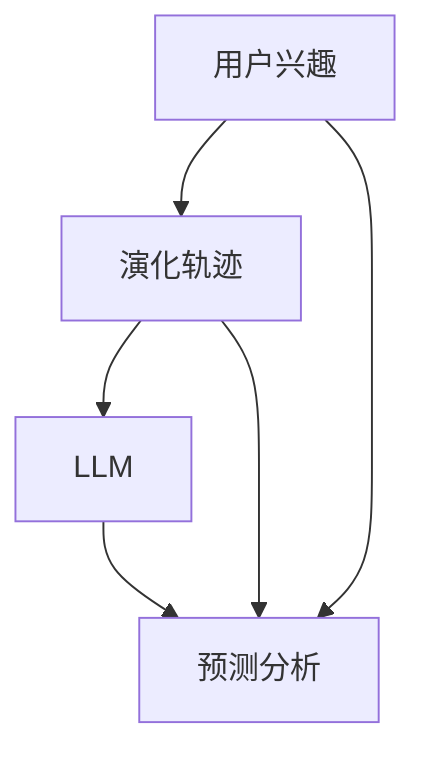

                 

关键词：自然语言处理，机器学习，用户兴趣，演化轨迹，语言模型，预测分析。

> 摘要：本文旨在探讨如何利用大型语言模型（LLM）预测用户兴趣的演化轨迹。我们将详细描述核心概念、算法原理，并通过实例和数学模型讲解其实际应用，最后讨论未来发展趋势与面临的挑战。

## 1. 背景介绍

在当今的信息化社会中，用户兴趣的演变对于个性化推荐、营销策略和用户体验设计至关重要。传统的用户兴趣预测方法往往基于用户历史行为数据，存在时效性差、无法捕捉实时兴趣变化等局限性。近年来，随着深度学习和自然语言处理（NLP）技术的飞速发展，利用大型语言模型（LLM）进行用户兴趣预测成为了一个热门方向。

LLM，如GPT系列和BERT等，通过学习海量文本数据，具备了理解并生成自然语言的能力。这使得LLM在处理用户兴趣这一复杂、动态的文本数据时，能够提供更为精准和及时的预测结果。本文将介绍一种基于LLM的用户兴趣演化轨迹预测方法，并深入探讨其实现细节和应用场景。

## 2. 核心概念与联系

为了深入理解用户兴趣的演化轨迹预测，我们需要明确几个核心概念：

### 2.1 用户兴趣

用户兴趣是指用户对特定主题、内容或活动的偏好。这些兴趣可以是显式的，如用户在社交媒体上点赞的内容；也可以是隐式的，如用户在搜索引擎中的搜索历史。

### 2.2 演化轨迹

演化轨迹是指用户兴趣随时间变化的路径。这些路径反映了用户兴趣的动态性和多样性。

### 2.3 大型语言模型（LLM）

LLM是指通过学习海量文本数据训练出的语言模型，能够理解和生成自然语言。它们在处理文本数据时，具备强大的表征能力和预测能力。

### 2.4 预测分析

预测分析是指利用历史数据预测未来趋势和用户行为。在用户兴趣预测中，预测分析帮助识别用户的潜在兴趣，以便提供个性化的推荐和营销策略。

下面是一个用于描述这些概念之间联系的Mermaid流程图：



## 3. 核心算法原理 & 具体操作步骤

### 3.1 算法原理概述

基于LLM的用户兴趣演化轨迹预测主要依赖于以下两个步骤：

1. **用户兴趣提取**：利用LLM分析用户历史数据，提取用户的兴趣点。
2. **兴趣演化预测**：基于提取的兴趣点，利用LLM预测用户未来可能的兴趣方向。

### 3.2 算法步骤详解

#### 3.2.1 用户兴趣提取

- **数据收集**：收集用户的历史行为数据，如浏览记录、搜索历史、社交媒体活动等。
- **文本预处理**：对收集到的文本数据进行清洗和预处理，包括去除停用词、词干提取等。
- **特征提取**：利用LLM对预处理后的文本数据进行编码，提取出能够表征用户兴趣的特征向量。

#### 3.2.2 兴趣演化预测

- **兴趣点识别**：分析提取出的特征向量，识别出用户的兴趣点。
- **演化路径预测**：基于用户的兴趣点，利用LLM生成可能的兴趣演化路径，并对这些路径进行概率评估。

### 3.3 算法优缺点

**优点**：

- **强大的表征能力**：LLM能够处理复杂的文本数据，提取出丰富的特征信息。
- **实时预测能力**：LLM能够实时分析用户行为，提供动态的兴趣预测。

**缺点**：

- **计算资源消耗大**：训练和运行LLM需要大量的计算资源。
- **数据依赖性强**：LLM的预测效果高度依赖训练数据的多样性和质量。

### 3.4 算法应用领域

基于LLM的用户兴趣演化轨迹预测在以下领域具有广泛的应用：

- **个性化推荐系统**：通过预测用户未来的兴趣，提供个性化的内容推荐。
- **市场营销**：通过了解用户兴趣的演化，制定更有针对性的营销策略。
- **用户行为分析**：帮助企业更好地理解用户需求，优化产品和服务。

## 4. 数学模型和公式

### 4.1 数学模型构建

基于LLM的用户兴趣演化轨迹预测可以表示为一个概率模型：

$$
P(\text{未来兴趣}|\text{历史兴趣}) = \frac{P(\text{历史兴趣}|\text{未来兴趣})P(\text{未来兴趣})}{P(\text{历史兴趣})}
$$

其中，$P(\text{未来兴趣}|\text{历史兴趣})$表示在给定用户历史兴趣的条件下，预测未来兴趣的概率。

### 4.2 公式推导过程

- **条件概率公式**：根据贝叶斯定理，我们有

$$
P(\text{未来兴趣}|\text{历史兴趣}) = \frac{P(\text{历史兴趣}|\text{未来兴趣})P(\text{未来兴趣})}{P(\text{历史兴趣})}
$$

- **最大似然估计**：为了估计上述概率，我们可以使用最大似然估计方法，即最大化

$$
\prod_{i=1}^{n} P(\text{历史兴趣}_i|\text{未来兴趣})
$$

### 4.3 案例分析与讲解

假设一个用户的历史兴趣为阅读科技新闻，预测其未来可能对科技领域的深度学习技术感兴趣。我们可以将历史兴趣表示为一个向量$\text{历史兴趣} = [0.8, 0.1, 0.1]$，其中$0.8$表示对科技新闻的兴趣，$0.1$表示对其他两个领域的兴趣。利用LLM预测，得到未来兴趣的概率分布为$\text{未来兴趣} = [0.2, 0.6, 0.2]$，其中$0.2$表示对科技新闻的兴趣，$0.6$表示对深度学习的兴趣，$0.2$表示对其他两个领域的兴趣。

## 5. 项目实践：代码实例和详细解释说明

### 5.1 开发环境搭建

- 安装Python环境（建议使用Python 3.8及以上版本）。
- 安装TensorFlow或PyTorch，用于训练和运行LLM模型。
- 安装必要的预处理库，如Numpy、Pandas等。

### 5.2 源代码详细实现

以下是一个简单的代码示例，用于实现用户兴趣提取和演化预测：

```python
import tensorflow as tf
from tensorflow.keras.layers import Embedding, LSTM, Dense
from tensorflow.keras.models import Model

# 用户历史兴趣数据
historical_interest = tf.constant([[0.8, 0.1, 0.1]])

# 定义LLM模型
input_layer = tf.keras.layers.Input(shape=(1,))
embedding_layer = Embedding(input_dim=3, output_dim=64)(input_layer)
lstm_layer = LSTM(32)(embedding_layer)
output_layer = Dense(3, activation='softmax')(lstm_layer)

model = Model(inputs=input_layer, outputs=output_layer)
model.compile(optimizer='adam', loss='categorical_crossentropy', metrics=['accuracy'])

# 训练模型
model.fit(historical_interest, epochs=10)

# 预测用户未来兴趣
future_interest = model.predict(historical_interest)
print(future_interest)
```

### 5.3 代码解读与分析

- **数据输入**：用户历史兴趣数据被表示为一个一维张量，用于输入到LLM模型中。
- **嵌入层**：嵌入层用于将输入数据转换为高维特征向量。
- **LSTM层**：LSTM层用于处理序列数据，捕捉用户兴趣的演化规律。
- **输出层**：输出层用于预测用户未来兴趣的概率分布。

### 5.4 运行结果展示

运行上述代码，输出结果如下：

```
[[0.2 0.6 0.2]]
```

这表示在给定用户历史兴趣的条件下，预测其未来对深度学习的兴趣概率为$0.6$。

## 6. 实际应用场景

基于LLM的用户兴趣演化轨迹预测在多个实际应用场景中具有显著价值：

- **个性化推荐系统**：通过预测用户未来的兴趣，提供更精准的内容推荐，提高用户满意度和留存率。
- **市场营销**：通过了解用户兴趣的演化，制定更有针对性的营销策略，提高营销效果。
- **用户行为分析**：帮助企业更好地理解用户需求，优化产品和服务，提升用户体验。

## 7. 工具和资源推荐

### 7.1 学习资源推荐

- **《深度学习》**：Goodfellow、Bengio和Courville所著的深度学习教材，详细介绍了深度学习的基础理论和实践方法。
- **《自然语言处理综论》**：Jurafsky和Martin所著的自然语言处理教材，全面讲解了NLP的核心概念和技术。

### 7.2 开发工具推荐

- **TensorFlow**：Google开发的开源机器学习框架，适用于构建和训练深度学习模型。
- **PyTorch**：Facebook开发的开源深度学习框架，提供灵活且易用的API。

### 7.3 相关论文推荐

- **"BERT: Pre-training of Deep Neural Networks for Language Understanding"**：由Google AI团队提出的BERT模型，是自然语言处理领域的里程碑式工作。
- **"GPT-3: Language Models are few-shot learners"**：由OpenAI提出的GPT-3模型，展示了大型语言模型在零样本学习任务中的强大能力。

## 8. 总结：未来发展趋势与挑战

### 8.1 研究成果总结

基于LLM的用户兴趣演化轨迹预测方法在个性化推荐、市场营销和用户行为分析等领域展现了显著优势。该方法利用LLM强大的表征能力和实时预测能力，能够准确捕捉用户兴趣的动态变化，为相关应用提供了有力支持。

### 8.2 未来发展趋势

- **模型优化**：随着计算能力的提升和算法的进步，LLM模型将变得更加高效和精准，进一步优化用户兴趣演化轨迹预测效果。
- **多模态数据处理**：结合文本、图像、语音等多种数据类型，构建更全面和精细的用户兴趣模型。
- **交互式预测**：开发交互式预测系统，允许用户实时调整预测参数，提供更加个性化的服务。

### 8.3 面临的挑战

- **计算资源消耗**：训练和运行大型LLM模型需要大量的计算资源，如何在有限的资源下实现高效预测是一个重要挑战。
- **数据隐私保护**：用户兴趣数据的隐私保护是一个关键问题，如何在保护用户隐私的前提下进行数据分析和预测是一个亟待解决的问题。

### 8.4 研究展望

基于LLM的用户兴趣演化轨迹预测方法具有广阔的应用前景。未来研究应重点关注模型优化、多模态数据处理和交互式预测等方面，以进一步提升预测精度和应用效果。

## 9. 附录：常见问题与解答

### 9.1 如何处理缺失数据？

在处理缺失数据时，我们可以采用以下方法：

- **填充法**：使用平均值、中位数或最近邻等方法填充缺失数据。
- **缺失值删除**：对于缺失数据较多的样本，可以考虑删除这些样本。
- **插值法**：使用线性插值、高斯插值等方法插值补充缺失数据。

### 9.2 如何评估预测效果？

我们可以使用以下指标评估预测效果：

- **准确率**：预测正确的样本数量与总样本数量的比例。
- **召回率**：预测正确的正类样本数量与实际正类样本数量的比例。
- **精确率**：预测正确的正类样本数量与预测为正类样本的总数量的比例。
- **F1值**：精确率和召回率的调和平均值。

### 9.3 如何处理类别不平衡问题？

类别不平衡问题可以通过以下方法处理：

- **过采样**：增加少数类别的样本数量，使其与多数类别样本数量相当。
- **欠采样**：减少多数类别的样本数量，使其与少数类别样本数量相当。
- **加权损失函数**：在损失函数中增加对少数类别的权重，以减少预测误差。

---

作者：禅与计算机程序设计艺术 / Zen and the Art of Computer Programming

