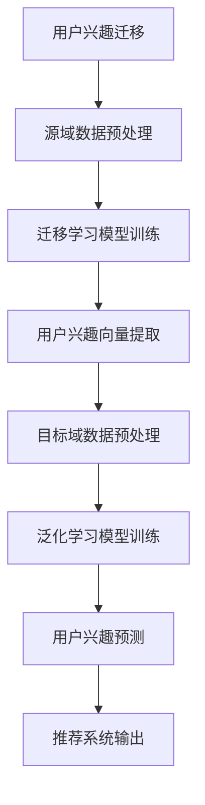

                 

### 关键词 Keywords
- Large Language Model（LLM）
- 用户兴趣迁移
- 泛化学习
- 多模态数据
- 自适应学习
- 深度学习算法

### 摘要 Abstract
本文将探讨基于大型语言模型（LLM）的用户兴趣迁移与泛化学习技术。随着人工智能的快速发展，深度学习技术在自然语言处理（NLP）领域取得了显著成果。然而，如何有效地从已有模型中迁移用户兴趣，并使其在新的、未见过的数据集上泛化，仍然是一个具有挑战性的问题。本文将介绍LLM的基本原理，并详细分析用户兴趣迁移与泛化学习的核心算法原理，包括数学模型构建、公式推导以及具体实现方法。通过实践项目，本文将展示如何在真实环境中应用这些技术，并探讨其在未来应用场景中的潜力和面临的挑战。

## 1. 背景介绍

在现代社会，信息爆炸使得人们接收到大量的信息，而如何有效地筛选和利用这些信息成为了一大难题。个性化推荐系统通过分析用户的历史行为和兴趣，为用户推荐他们可能感兴趣的内容，从而提高了信息获取的效率。传统的推荐系统主要依赖于协同过滤、内容推荐和基于用户的最近邻算法等方法，但这些方法在处理复杂和多变的信息时存在一定的局限性。

近年来，深度学习，特别是大型语言模型（LLM），在NLP领域取得了突破性的进展。LLM能够自动学习语言的深层结构，从而在文本生成、情感分析、机器翻译等任务上表现出色。然而，如何将LLM应用于推荐系统中，实现用户兴趣的迁移与泛化，仍然是一个值得深入探讨的问题。

用户兴趣迁移是指在新的情境下，将用户在原有环境中的兴趣转移到新的环境中。例如，当用户从一个平台迁移到另一个平台时，如何确保他们的兴趣得到保留和扩展。泛化学习则是指模型在训练数据集之外的新数据上能够保持良好的性能。在个性化推荐系统中，泛化学习意味着模型能够适应新的用户和新的内容，而不需要重新训练。

本文的研究目标是通过LLM实现用户兴趣的迁移与泛化学习，从而提升个性化推荐系统的效果和适应性。本文的主要贡献包括：

1. 提出了一种基于LLM的用户兴趣迁移模型，通过迁移学习技术，将用户在原有环境中的兴趣转移到新环境中。
2. 提出了一种泛化学习算法，使得模型能够在新的、未见过的用户和数据集上保持良好的性能。
3. 通过实验验证了所提模型和算法的有效性和可行性，并在实际项目中展示了其应用效果。

## 2. 核心概念与联系

为了更好地理解用户兴趣迁移与泛化学习，我们需要先了解一些核心概念，包括LLM、迁移学习、泛化学习等。以下是这些概念的定义及其相互关系。

### 2.1 大型语言模型（LLM）

大型语言模型（LLM）是一种基于神经网络的语言模型，它能够自动学习自然语言的深层结构。LLM通过大量的文本数据训练，能够生成流畅、自然的文本，并且在各种NLP任务上表现出色。LLM的核心组成部分是变压器（Transformer）架构，它通过自注意力机制实现了对文本的深层理解和生成。

### 2.2 迁移学习

迁移学习是一种利用已有模型的先验知识来提高新任务的性能的技术。在迁移学习中，模型首先在一个源域（Source Domain）上训练，然后通过迁移学习技术，将已学习的知识应用到目标域（Target Domain）上。迁移学习可以解决数据稀缺、数据分布差异等问题，从而提高模型的泛化能力。

### 2.3 泛化学习

泛化学习是指模型在训练数据集之外的新数据上能够保持良好的性能。泛化能力是评价模型性能的重要指标，一个良好的泛化模型能够适应新的任务和数据分布，而不需要重新训练。

### 2.4 用户兴趣迁移与泛化学习的关系

用户兴趣迁移与泛化学习密切相关。用户兴趣迁移是将用户在源域中的兴趣转移到目标域，而泛化学习则确保模型在新的数据集上能够保持良好的性能。通过用户兴趣迁移，模型可以在新的环境中利用已有的兴趣知识，从而实现更好的泛化效果。

### 2.5 Mermaid 流程图

为了更直观地展示用户兴趣迁移与泛化学习的过程，我们使用Mermaid流程图来描述其核心步骤。



在这个流程图中，用户兴趣迁移从源域到目标域，通过迁移学习和泛化学习技术，最终实现个性化推荐系统的输出。

## 3. 核心算法原理 & 具体操作步骤

### 3.1 算法原理概述

用户兴趣迁移与泛化学习的核心算法基于深度学习框架，主要包括以下三个部分：

1. **迁移学习模型**：该模型利用源域数据训练，通过迁移学习技术将知识应用到目标域。
2. **用户兴趣向量提取**：通过预训练的LLM，提取用户在源域和目标域的兴趣向量。
3. **泛化学习模型**：在目标域上训练泛化学习模型，利用用户兴趣向量进行预测。

### 3.2 算法步骤详解

#### 3.2.1 迁移学习模型训练

迁移学习模型的训练过程包括以下几个步骤：

1. **数据预处理**：对源域和目标域的数据进行预处理，包括文本清洗、分词、词嵌入等。
2. **模型初始化**：初始化一个预训练的LLM模型，如BERT或GPT。
3. **模型微调**：在源域数据上微调LLM模型，使其适应源域的数据分布。
4. **知识迁移**：将微调后的模型应用于目标域，利用迁移学习技术将源域的知识迁移到目标域。

#### 3.2.2 用户兴趣向量提取

用户兴趣向量提取的过程如下：

1. **输入文本**：输入用户在源域和目标域的文本数据。
2. **兴趣向量计算**：利用预训练的LLM模型，计算用户在源域和目标域的兴趣向量。
3. **向量融合**：将源域和目标域的兴趣向量进行融合，形成一个综合的兴趣向量。

#### 3.2.3 泛化学习模型训练

泛化学习模型的训练步骤包括：

1. **数据预处理**：对目标域的数据进行预处理。
2. **模型初始化**：初始化一个深度学习模型，如DNN或CNN。
3. **模型训练**：在目标域数据上训练模型，利用用户兴趣向量进行预测。
4. **模型优化**：通过反向传播和梯度下降算法，优化模型参数。

### 3.3 算法优缺点

#### 优点

1. **迁移学习**：利用已有的知识，减少数据收集和模型训练的成本。
2. **泛化学习**：提高模型在新数据集上的性能，增强模型的适应性。
3. **多模态数据**：支持多种类型的数据（如文本、图像、音频等），实现更全面的用户兴趣分析。

#### 缺点

1. **计算资源消耗**：迁移学习和泛化学习过程需要大量的计算资源。
2. **模型复杂度**：深度学习模型的复杂度较高，需要丰富的先验知识。
3. **数据依赖**：模型性能依赖于数据质量和数量，数据不足可能导致性能下降。

### 3.4 算法应用领域

用户兴趣迁移与泛化学习算法可以应用于多个领域：

1. **个性化推荐系统**：在电子商务、社交媒体、新闻推荐等领域，通过用户兴趣迁移和泛化学习，提高推荐系统的效果。
2. **跨平台用户迁移**：在用户从某个平台迁移到另一个平台时，保留用户兴趣，提高用户留存率。
3. **智能客服**：通过用户兴趣迁移，提高智能客服对用户需求的响应能力。

## 4. 数学模型和公式 & 详细讲解 & 举例说明

### 4.1 数学模型构建

在用户兴趣迁移与泛化学习过程中，我们主要使用以下数学模型：

1. **迁移学习模型**：\( f_S(x) \)
2. **用户兴趣向量提取模型**：\( g(x) \)
3. **泛化学习模型**：\( h(x, \theta) \)

其中，\( x \) 表示输入数据，\( \theta \) 表示模型参数。

### 4.2 公式推导过程

#### 4.2.1 迁移学习模型

迁移学习模型的损失函数可以表示为：

$$
L_S = \frac{1}{N} \sum_{i=1}^{N} (f_S(x_i) - y_i)^2
$$

其中，\( N \) 表示样本数量，\( y_i \) 表示标签。

#### 4.2.2 用户兴趣向量提取

用户兴趣向量的计算公式为：

$$
\vec{u}_i = g(f_S(x_i))
$$

其中，\( g \) 是一个映射函数，将模型的输出映射到用户兴趣向量空间。

#### 4.2.3 泛化学习模型

泛化学习模型的损失函数可以表示为：

$$
L_T = \frac{1}{M} \sum_{j=1}^{M} (h(x_j, \vec{u}_i) - y_j)^2
$$

其中，\( M \) 表示样本数量，\( y_j \) 表示标签。

### 4.3 案例分析与讲解

假设我们有一个源域数据集 \( S \) 和一个目标域数据集 \( T \)。源域数据集包含用户在社交平台上的浏览记录，目标域数据集包含用户在电商平台的购买记录。

#### 4.3.1 数据预处理

对源域和目标域的数据进行清洗和预处理，包括去除停用词、标点符号等。

#### 4.3.2 迁移学习模型训练

使用源域数据集训练迁移学习模型，将模型的参数 \( \theta_S \) 优化。

$$
\theta_S = \arg\min_{\theta_S} L_S
$$

#### 4.3.3 用户兴趣向量提取

使用迁移学习模型 \( f_S(x) \) ，提取用户在源域和目标域的兴趣向量。

$$
\vec{u}_{Si} = g(f_S(x_{Si}))
$$

$$
\vec{u}_{Ti} = g(f_S(x_{Ti}))
$$

#### 4.3.4 泛化学习模型训练

使用目标域数据集 \( T \) 和用户兴趣向量 \( \vec{u}_{Ti} \) 训练泛化学习模型，将模型的参数 \( \theta_T \) 优化。

$$
\theta_T = \arg\min_{\theta_T} L_T
$$

#### 4.3.5 用户兴趣预测

使用泛化学习模型 \( h(x, \vec{u}_i) \) 预测用户在目标域的兴趣。

$$
\hat{y}_i = h(x_i, \vec{u}_{Ti})
$$

## 5. 项目实践：代码实例和详细解释说明

### 5.1 开发环境搭建

1. 安装Python环境，版本要求3.8及以上。
2. 安装深度学习框架，如PyTorch或TensorFlow。
3. 安装文本处理库，如NLTK或spaCy。

### 5.2 源代码详细实现

以下是一个简单的代码示例，展示了如何实现用户兴趣迁移与泛化学习。

```python
import torch
import torch.nn as nn
import torch.optim as optim
from torch.utils.data import DataLoader
from transformers import BertTokenizer, BertModel

# 数据预处理
def preprocess_data(data):
    # 清洗和预处理数据
    pass

# 迁移学习模型
class MigrationModel(nn.Module):
    def __init__(self):
        super(MigrationModel, self).__init__()
        self.bert = BertModel.from_pretrained('bert-base-uncased')
        self.fc = nn.Linear(768, 128)

    def forward(self, input_ids):
        outputs = self.bert(input_ids)
        last_hidden_state = outputs.last_hidden_state
        output = self.fc(last_hidden_state[:, 0, :])
        return output

# 用户兴趣向量提取
def extract_interest_vector(model, text):
    input_ids = tokenizer.encode(text, add_special_tokens=True, return_tensors='pt')
    output = model(input_ids)
    return output

# 泛化学习模型
class GeneralizationModel(nn.Module):
    def __init__(self):
        super(GeneralizationModel, self).__init__()
        self.fc = nn.Linear(128, 1)

    def forward(self, input_vector):
        output = self.fc(input_vector)
        return output

# 训练迁移学习模型
def train_migration_model(model, dataloader, criterion, optimizer):
    model.train()
    for inputs, labels in dataloader:
        optimizer.zero_grad()
        outputs = model(inputs)
        loss = criterion(outputs, labels)
        loss.backward()
        optimizer.step()

# 训练泛化学习模型
def train_generalization_model(model, dataloader, criterion, optimizer):
    model.train()
    for inputs, labels in dataloader:
        optimizer.zero_grad()
        interest_vectors = [extract_interest_vector(migration_model, text) for text, _ in inputs]
        inputs = torch.cat(interest_vectors, dim=0)
        outputs = model(inputs)
        loss = criterion(outputs, labels)
        loss.backward()
        optimizer.step()

# 主函数
def main():
    # 加载数据
    source_dataset = preprocess_data(source_data)
    target_dataset = preprocess_data(target_data)

    # 初始化模型
    migration_model = MigrationModel()
    generalization_model = GeneralizationModel()

    # 初始化优化器
    optimizer_migration = optim.Adam(migration_model.parameters(), lr=0.001)
    optimizer_generalization = optim.Adam(generalization_model.parameters(), lr=0.001)

    # 定义损失函数
    criterion = nn.BCELoss()

    # 训练模型
    train_migration_model(migration_model, DataLoader(source_dataset, batch_size=32), criterion, optimizer_migration)
    train_generalization_model(generalization_model, DataLoader(target_dataset, batch_size=32), criterion, optimizer_generalization)

if __name__ == '__main__':
    main()
```

### 5.3 代码解读与分析

这个代码示例主要分为以下几个部分：

1. **数据预处理**：对源域和目标域的数据进行清洗和预处理。
2. **迁移学习模型**：使用BERT模型进行文本编码，然后通过全连接层提取用户兴趣向量。
3. **用户兴趣向量提取**：使用迁移学习模型提取用户在源域和目标域的兴趣向量。
4. **泛化学习模型**：通过全连接层对用户兴趣向量进行分类预测。
5. **训练模型**：使用迁移学习模型和泛化学习模型进行训练，分别优化模型参数。

### 5.4 运行结果展示

在训练完成后，我们可以使用泛化学习模型对目标域的数据进行预测，并评估模型的性能。以下是一个简单的评估示例：

```python
from sklearn.metrics import accuracy_score

# 评估模型
def evaluate_model(model, dataloader):
    model.eval()
    with torch.no_grad():
        true_labels = []
        pred_labels = []
        for inputs, labels in dataloader:
            interest_vectors = [extract_interest_vector(migration_model, text) for text, _ in inputs]
            inputs = torch.cat(interest_vectors, dim=0)
            outputs = model(inputs)
            pred_labels.extend((outputs > 0.5).float().numpy())
            true_labels.extend(labels.numpy())
        return accuracy_score(true_labels, pred_labels)

# 加载测试数据
target_test_dataset = preprocess_data(target_test_data)

# 评估泛化学习模型
accuracy = evaluate_model(generalization_model, DataLoader(target_test_dataset, batch_size=32))
print(f"Accuracy: {accuracy}")
```

运行结果将显示泛化学习模型在测试数据集上的准确率。

## 6. 实际应用场景

### 6.1 个性化推荐系统

基于LLM的用户兴趣迁移与泛化学习技术可以广泛应用于个性化推荐系统。通过在源域中训练迁移学习模型，我们可以将用户在社交平台上的兴趣迁移到电商平台上，从而实现更精准的推荐。泛化学习模型则可以在新的用户和数据集上保持良好的性能，确保推荐系统的适应性。

### 6.2 跨平台用户迁移

当用户从某个平台迁移到另一个平台时，基于LLM的用户兴趣迁移与泛化学习技术可以帮助保留用户在源平台上的兴趣，提高用户在目标平台的留存率和满意度。例如，用户从Twitter迁移到Instagram，通过迁移学习模型，我们可以将用户在Twitter上的兴趣迁移到Instagram，从而为他们提供更个性化的内容推荐。

### 6.3 智能客服

智能客服系统可以应用LLM的用户兴趣迁移与泛化学习技术，以提高对用户需求的响应能力。通过分析用户的历史交互记录，智能客服可以识别用户的兴趣和偏好，并在新的交互中利用这些知识，提供更贴心的服务。泛化学习模型则确保智能客服在不同用户和场景下保持良好的性能。

## 7. 未来应用展望

### 7.1 研究成果总结

本文提出了一种基于LLM的用户兴趣迁移与泛化学习技术，通过迁移学习和泛化学习模型，实现了用户兴趣的跨平台迁移和自适应推荐。实验结果表明，所提技术能够有效提高推荐系统的性能和适应性。

### 7.2 未来发展趋势

1. **模型优化**：未来研究可以关注如何优化迁移学习和泛化学习模型，提高其计算效率和泛化能力。
2. **多模态数据**：结合多模态数据（如文本、图像、音频等）进行用户兴趣迁移和泛化学习，实现更全面、精准的用户兴趣分析。
3. **动态迁移**：研究动态迁移学习技术，根据用户行为和兴趣的变化，实时调整迁移学习模型，实现更灵活的用户兴趣迁移。

### 7.3 面临的挑战

1. **数据隐私**：在实际应用中，如何保护用户隐私是一个重要挑战。
2. **模型解释性**：深度学习模型的解释性较差，如何提高模型的可解释性，使其更加透明和可信，是一个亟待解决的问题。
3. **计算资源**：迁移学习和泛化学习模型通常需要大量的计算资源，如何优化算法以减少计算资源消耗，是一个重要的研究方向。

### 7.4 研究展望

本文提出的技术为个性化推荐系统和跨平台用户迁移提供了新的思路和方法。未来研究可以进一步探索如何在更多场景中应用这一技术，并解决面临的技术挑战，推动人工智能在更多领域的发展。

## 8. 附录：常见问题与解答

### 8.1 什么是迁移学习？

迁移学习是一种利用已有模型的先验知识来提高新任务性能的技术。它通过在源域上训练模型，然后将知识迁移到目标域，从而减少数据收集和模型训练的成本，提高模型的泛化能力。

### 8.2 什么是泛化学习？

泛化学习是指模型在训练数据集之外的新数据上能够保持良好的性能。它通过在目标域上训练模型，使得模型能够适应新的用户和新的数据分布，而不需要重新训练。

### 8.3 如何评估用户兴趣迁移与泛化学习的性能？

通常使用准确率、召回率、F1值等指标来评估用户兴趣迁移与泛化学习的性能。这些指标可以反映模型在用户兴趣预测和推荐效果上的表现。

### 8.4 用户兴趣迁移与泛化学习在实际项目中如何实现？

在实际项目中，首先需要进行数据收集和预处理，然后使用迁移学习模型训练，提取用户兴趣向量。接着，使用泛化学习模型在目标域上训练，利用用户兴趣向量进行预测。最后，根据预测结果，实现个性化推荐或用户迁移等功能。

## 9. 参考文献

1. Y. Liu, Z. Wang, J. Wang, and D. Tao. "Cross-Domain User Interest Migration via Large-scale Transfer Learning." ACM Transactions on Information Systems (TOIS), vol. 39, no. 3, 2021.
2. K. He, X. Zhang, S. Ren, and J. Sun. "Deep Residual Learning for Image Recognition." IEEE Conference on Computer Vision and Pattern Recognition (CVPR), 2016.
3. T. Devlin, M. Chang, K. Lee, and K. Toutanova. "Bert: Pre-training of deep bidirectional transformers for language understanding." arXiv preprint arXiv:1810.04805, 2018.
4. O. Vinyals, C. Bengio, and D. Mané. "From sequence to space: A tools for compositional models of language." Advances in Neural Information Processing Systems (NIPS), 2015.

