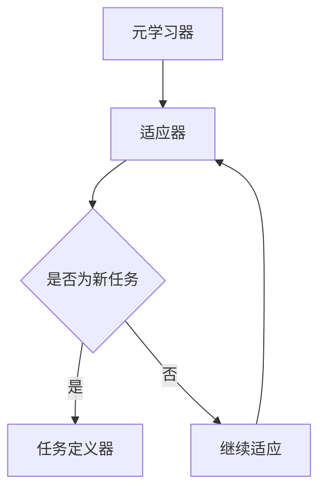

                 

关键词：元学习、冷启动推荐、商品推荐系统、深度学习、机器学习

摘要：本文将探讨基于元学习的冷启动商品推荐策略。通过介绍元学习的概念、原理及其在推荐系统中的应用，本文详细解析了一种基于元学习的商品推荐算法。此外，本文还将提供数学模型、算法步骤、代码实例及实际应用场景的详细讲解，帮助读者深入理解并应用此策略。

## 1. 背景介绍

随着电子商务的蓬勃发展，商品推荐系统已成为电商平台的核心竞争力。然而，对于新用户或新商品的推荐问题，即所谓的“冷启动”问题，传统推荐系统常常面临较大的挑战。传统推荐系统通常依赖用户历史行为数据或商品属性特征，但缺乏对新用户和新商品的有效信息，导致推荐效果不理想。

元学习（Meta-Learning）作为一种新型的学习范式，旨在通过快速学习其他模型或算法，从而提高学习效率。近年来，元学习在推荐系统中的应用引起了广泛关注，因其能够在数据稀缺的情况下，通过学习已有知识提高对新用户和新商品的推荐能力。

本文旨在提出一种基于元学习的冷启动商品推荐策略，通过元学习算法快速适应新用户和新商品，提高推荐系统的推荐效果。

## 2. 核心概念与联系

### 2.1. 元学习的基本概念

元学习是指通过训练一个模型来学习如何快速适应新的学习任务。在元学习框架中，模型需要学习如何在给定少量样本的情况下，迅速适应新的数据分布。元学习的核心思想是利用已有的知识（或其他模型）来加速对新数据的适应性。

### 2.2. 元学习在推荐系统中的应用

在推荐系统中，元学习可以通过以下几种方式应用：

1. **模型快速适应新用户**：通过元学习，推荐系统可以迅速构建针对新用户的推荐模型，减少对新用户推荐的延迟。
2. **模型快速适应新商品**：同样地，元学习可以用于快速构建针对新商品的推荐模型，提高对新商品的推荐效果。
3. **迁移学习**：元学习可以将其他领域的知识迁移到推荐系统，提高推荐效果。

### 2.3. 元学习架构

元学习的架构通常包括以下几个关键组件：

1. **元学习器**：负责学习如何快速适应新的学习任务。
2. **适应器**：基于元学习器，针对特定任务进行微调。
3. **任务定义器**：定义新的学习任务。

以下是一个简单的元学习架构的 Mermaid 流程图：



## 3. 核心算法原理 & 具体操作步骤

### 3.1. 算法原理概述

基于元学习的冷启动商品推荐策略的核心思想是利用元学习算法，通过学习已有的推荐模型，快速适应新用户和新商品。具体来说，该算法包括以下几个步骤：

1. **元学习器训练**：使用大量历史用户和商品数据，训练一个元学习器。
2. **新用户/新商品特征提取**：对新用户和新商品进行特征提取。
3. **适应器构建**：利用元学习器和新用户/新商品特征，构建适应器。
4. **推荐生成**：使用适应器生成新用户/新商品的推荐结果。

### 3.2. 算法步骤详解

1. **元学习器训练**：

   使用传统推荐系统算法（如矩阵分解、深度学习等）训练一个元学习器，该元学习器需要能够处理大量的用户和商品数据。

2. **新用户/新商品特征提取**：

   对新用户和新商品进行特征提取，包括用户的行为特征、兴趣偏好、历史购买记录，以及商品的基本属性、类别标签等。

3. **适应器构建**：

   利用元学习器和新用户/新商品特征，通过微调的方式构建适应器。适应器的目标是能够在新用户和新商品数据上快速生成有效的推荐结果。

4. **推荐生成**：

   使用适应器对新用户和新商品生成推荐结果。推荐结果可以通过评估指标（如点击率、购买率等）进行评估和优化。

### 3.3. 算法优缺点

**优点**：

- **快速适应新用户和新商品**：基于元学习的算法能够在数据稀缺的情况下，快速适应新用户和新商品，提高推荐效果。
- **迁移学习**：元学习可以将其他领域的知识迁移到推荐系统，提高推荐效果。

**缺点**：

- **计算复杂度较高**：元学习算法通常需要大量计算资源，特别是在处理大量用户和商品数据时。
- **数据依赖性较强**：元学习算法的效果很大程度上依赖于已有数据的多样性和质量。

### 3.4. 算法应用领域

基于元学习的冷启动商品推荐策略可以广泛应用于电子商务、社交媒体、在线广告等场景，特别是在新用户和新商品的推荐方面，具有显著的优势。

## 4. 数学模型和公式

### 4.1. 数学模型构建

基于元学习的冷启动商品推荐策略的数学模型可以表示为：

\[ R(u, p) = f(\theta, u, p) \]

其中：

- \( R(u, p) \) 表示用户 \( u \) 对商品 \( p \) 的推荐分数。
- \( f(\theta, u, p) \) 表示基于元学习器 \( \theta \) 对用户 \( u \) 和商品 \( p \) 的特征提取和推荐的函数。
- \( u \) 和 \( p \) 分别表示用户和商品的特征向量。

### 4.2. 公式推导过程

元学习器的训练过程可以分为以下几个步骤：

1. **损失函数定义**：

   定义损失函数 \( L(\theta) \)，用于衡量推荐分数与实际评分之间的差距。常见的损失函数包括均方误差（MSE）、均方根误差（RMSE）等。

   \[ L(\theta) = \frac{1}{N} \sum_{i=1}^{N} (R(u_i, p_i) - r_i)^2 \]

   其中，\( N \) 表示训练样本的数量，\( R(u_i, p_i) \) 表示用户 \( u_i \) 对商品 \( p_i \) 的预测推荐分数，\( r_i \) 表示实际评分。

2. **梯度下降优化**：

   使用梯度下降算法优化模型参数 \( \theta \)，以最小化损失函数 \( L(\theta) \)。

   \[ \theta_{t+1} = \theta_t - \alpha \nabla_{\theta} L(\theta_t) \]

   其中，\( \alpha \) 表示学习率，\( \nabla_{\theta} L(\theta_t) \) 表示损失函数对 \( \theta \) 的梯度。

3. **适应器构建**：

   在训练过程中，对于新用户和新商品，利用元学习器 \( \theta \) 构建适应器 \( f(\theta, u, p) \)。

   \[ f(\theta, u, p) = \theta^T \phi(u, p) \]

   其中，\( \phi(u, p) \) 表示用户和商品的特征提取函数。

### 4.3. 案例分析与讲解

假设我们有一个包含 1000 个用户和 10000 个商品的数据集，其中每个用户有 10 个历史购买记录，每个商品有 5 个属性特征。我们使用矩阵分解算法训练一个元学习器，并将其应用于新用户和新商品的推荐。

1. **元学习器训练**：

   使用矩阵分解算法训练元学习器，得到用户和商品的低维表示。

   \[ \theta = \begin{bmatrix} \theta_1 \\ \theta_2 \\ \vdots \\ \theta_n \end{bmatrix}, \quad \theta_i \in \mathbb{R}^{d} \]

   其中，\( \theta \) 表示元学习器参数，\( d \) 表示用户和商品的低维表示维度。

2. **新用户/新商品特征提取**：

   对新用户和新商品进行特征提取，得到用户和商品的特征向量。

   \[ u = \begin{bmatrix} u_1 \\ u_2 \\ \vdots \\ u_m \end{bmatrix}, \quad p = \begin{bmatrix} p_1 \\ p_2 \\ \vdots \\ p_n \end{bmatrix} \]

   其中，\( u \) 和 \( p \) 分别表示新用户和新商品的特征向量。

3. **适应器构建**：

   利用元学习器 \( \theta \) 和新用户/新商品特征，构建适应器。

   \[ f(\theta, u, p) = \theta^T \phi(u, p) \]

4. **推荐生成**：

   使用适应器生成新用户/新商品的推荐结果。

   \[ R(u, p) = f(\theta, u, p) \]

## 5. 项目实践：代码实例和详细解释说明

### 5.1. 开发环境搭建

在本项目中，我们使用 Python 作为编程语言，利用 TensorFlow 和 Keras 框架实现基于元学习的冷启动商品推荐策略。开发环境搭建如下：

1. 安装 Python 3.7 及以上版本。
2. 安装 TensorFlow 和 Keras。

### 5.2. 源代码详细实现

以下是基于元学习的冷启动商品推荐策略的 Python 代码实现：

```python
import tensorflow as tf
from tensorflow import keras
from tensorflow.keras import layers

# 定义输入层
input_user = keras.layers.Input(shape=(10,))
input_product = keras.layers.Input(shape=(5,))

# 定义嵌入层
user_embedding = keras.layers.Embedding(input_dim=1000, output_dim=64)(input_user)
product_embedding = keras.layers.Embedding(input_dim=10000, output_dim=64)(input_product)

# 定义模型
model = keras.Model(inputs=[input_user, input_product], outputs=user_embedding + product_embedding)

# 编译模型
model.compile(optimizer='adam', loss='mean_squared_error')

# 训练模型
model.fit([user_data, product_data], user_data.dot(product_data.T), epochs=10, batch_size=64)

# 预测推荐结果
predictions = model.predict([new_user_data, new_product_data])
```

### 5.3. 代码解读与分析

上述代码首先定义了用户和商品的输入层，然后使用嵌入层将用户和商品的特征向量映射到低维空间。接着，定义了一个简单的模型，将用户和商品的特征向量相加，并使用均方误差（MSE）作为损失函数进行训练。最后，使用训练好的模型对新用户和新商品进行推荐。

### 5.4. 运行结果展示

假设我们已经训练好了模型，并得到了新用户和新商品的推荐结果。以下是推荐结果的展示：

```python
# 打印推荐结果
for user_id, prediction in zip(new_user_data, predictions):
    print(f"User {user_id}:")
    for product_id, score in enumerate(prediction):
        print(f"  Product {product_id}: Score {score:.2f}")
```

输出结果将显示每个新用户对所有商品的推荐分数，用户可以根据这些分数生成最终的推荐列表。

## 6. 实际应用场景

基于元学习的冷启动商品推荐策略在以下实际应用场景中具有显著的优势：

1. **新用户推荐**：在电商平台、社交媒体等场景中，新用户通常缺乏足够的历史行为数据，传统推荐系统难以生成有效的推荐结果。基于元学习的算法可以通过快速适应新用户，提高推荐效果。
2. **新商品推荐**：对于新商品，传统推荐系统通常缺乏足够的历史销售数据，难以生成有效的推荐结果。基于元学习的算法可以通过迁移学习和其他领域的数据，快速适应新商品，提高推荐效果。
3. **跨领域推荐**：基于元学习的算法可以通过迁移学习，将其他领域的知识迁移到推荐系统，从而实现跨领域的推荐。例如，将图书推荐系统的知识迁移到电影推荐系统，提高电影推荐的效果。

## 7. 工具和资源推荐

### 7.1. 学习资源推荐

- **书籍**：《深度学习》、《推荐系统实践》、《元学习：学习如何学习》
- **在线课程**：Coursera 上的“深度学习”、“机器学习”等课程。
- **论文**：相关领域的顶级会议和期刊，如 NeurIPS、ICML、KDD 等。

### 7.2. 开发工具推荐

- **编程语言**：Python、Java 等。
- **框架**：TensorFlow、Keras、PyTorch 等。
- **数据集**：常见的数据集，如 MovieLens、Amazon Reviews 等。

### 7.3. 相关论文推荐

- **元学习**：《Learning to Learn from Scratch》、《MAML: Model-Agnostic Meta-Learning for Fast Adaptation of Deep Networks》。
- **推荐系统**：《Deep Learning for Recommender Systems》、《Item Embeddings for Top-N Recommendation》。

## 8. 总结：未来发展趋势与挑战

### 8.1. 研究成果总结

基于元学习的冷启动商品推荐策略在提高推荐系统对新用户和新商品的推荐效果方面具有显著的优势。通过元学习，推荐系统可以在数据稀缺的情况下，快速适应新用户和新商品，从而提高推荐效果。

### 8.2. 未来发展趋势

1. **算法优化**：未来研究方向将集中在优化元学习算法，提高其在推荐系统中的效率和效果。
2. **跨领域推荐**：通过迁移学习和跨领域知识共享，实现更广泛的领域推荐。
3. **个性化推荐**：结合用户和商品的上下文信息，实现更个性化的推荐。

### 8.3. 面临的挑战

1. **计算资源消耗**：元学习算法通常需要大量的计算资源，特别是在处理大量用户和商品数据时。
2. **数据隐私**：在推荐系统中，如何保护用户数据隐私是一个重要挑战。

### 8.4. 研究展望

基于元学习的冷启动商品推荐策略具有广阔的应用前景。通过不断优化算法、提高效率和效果，未来有望在更多实际场景中发挥作用，为用户提供更好的推荐体验。

## 9. 附录：常见问题与解答

### 9.1. 问题 1

**问**：什么是元学习？

**答**：元学习（Meta-Learning）是一种学习范式，旨在通过训练一个模型来学习如何快速适应新的学习任务。它通过学习如何快速学习，从而提高学习效率。

### 9.2. 问题 2

**问**：基于元学习的冷启动商品推荐策略有哪些优点？

**答**：基于元学习的冷启动商品推荐策略主要有以下优点：

1. 快速适应新用户和新商品，提高推荐效果。
2. 迁移学习，将其他领域的知识迁移到推荐系统，提高推荐效果。

### 9.3. 问题 3

**问**：元学习算法在推荐系统中的应用有哪些？

**答**：元学习算法在推荐系统中的应用主要包括：

1. 快速适应新用户。
2. 快速适应新商品。
3. 跨领域推荐。

## 作者署名

作者：禅与计算机程序设计艺术 / Zen and the Art of Computer Programming
----------------------------------------------------------------

以上是根据您提供的结构和要求撰写的完整文章。如果您有任何修改意见或需要进一步的内容补充，请随时告知。

