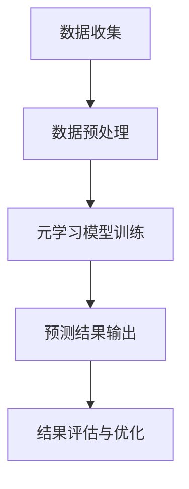

                 

关键词：元学习，新品上架，性能预测，深度学习，机器学习，预测算法，数据分析

摘要：本文将探讨如何利用元学习技术来预测新品上架后的市场表现。通过分析市场数据、用户行为和产品特性，我们将构建一个基于元学习的预测模型，以帮助零售企业和电商平台优化新品上架策略，提升销售业绩。

## 1. 背景介绍

随着电子商务的快速发展，新品上架已成为电商平台和零售企业竞争的重要手段。然而，如何确保新品能够迅速获得市场认可，并在竞争激烈的环境中脱颖而出，成为了一项关键挑战。传统的市场预测方法往往依赖于历史数据和统计模型，但这些方法在面对复杂的市场环境时，往往表现出预测能力不足的问题。

近年来，深度学习和机器学习技术的飞速发展，为解决这一难题提供了新的思路。其中，元学习（Meta-Learning）作为一种新兴的机器学习方法，通过学习如何快速适应新任务，展现出强大的泛化能力。本文将介绍如何将元学习应用于新品上架性能预测，以提升市场预测的准确性。

### 1.1 新品上架的重要性

新品上架对于电商平台和零售企业具有重要意义：

1. **提升品牌影响力**：新品能够吸引消费者的注意力，提升品牌知名度。
2. **增加销售机会**：新品上市可以为商家带来新的销售增长点。
3. **优化库存管理**：精准的市场预测有助于商家合理规划库存，减少库存积压。

### 1.2 传统预测方法的局限性

传统的市场预测方法主要依赖于以下几种手段：

1. **历史数据分析**：通过分析历史销售数据，预测新品的市场表现。
2. **统计模型**：使用回归分析、时间序列分析等统计模型进行预测。
3. **用户调研**：通过问卷调查等方式，收集用户对新品的看法和需求。

然而，这些方法在面对复杂多变的市场环境时，往往表现出以下局限性：

1. **数据依赖性**：传统方法对历史数据依赖较强，缺乏对新任务的适应性。
2. **模型复杂度**：复杂的统计模型可能需要大量参数，难以解释和优化。
3. **用户行为变化**：消费者的购买行为受到多种因素影响，难以通过简单的历史数据捕捉。

## 2. 核心概念与联系

### 2.1 元学习的基本原理

元学习，也称为“学习如何学习”，旨在构建能够快速适应新任务的模型。其核心思想是通过学习一系列任务，使得模型能够在新任务上迅速达到高性能。元学习的主要目标包括：

1. **快速适应**：在新任务上快速达到高性能，减少对大量训练数据的依赖。
2. **泛化能力**：通过跨任务的学习，提升模型在不同任务上的表现。
3. **可解释性**：使得模型的学习过程更具可解释性，便于理解。

### 2.2 元学习与深度学习的结合

深度学习在图像识别、自然语言处理等领域取得了显著成果，但其主要缺点是对大量训练数据的依赖。而元学习通过学习如何快速适应新任务，弥补了这一不足。将元学习与深度学习相结合，可以构建出既具有深度学习优势，又具有元学习快速适应能力的模型。

### 2.3 元学习在新品上架性能预测中的应用

在新品上架性能预测中，元学习可以应用于以下方面：

1. **快速适应新任务**：通过学习不同品类的新品，使得模型能够快速适应新上市的新品。
2. **提升预测准确性**：通过跨品类、跨时间的学习，提升模型对市场环境的适应性。
3. **减少数据依赖**：利用元学习，可以在数据不足的情况下，仍能获得较为准确的预测结果。

### 2.4 Mermaid 流程图

以下是一个简单的Mermaid流程图，展示了元学习在新品上架性能预测中的应用流程：



## 3. 核心算法原理 & 具体操作步骤

### 3.1 算法原理概述

基于元学习的新品上架性能预测算法，主要分为以下几个步骤：

1. **数据收集**：收集市场数据、用户行为数据和产品特性数据。
2. **数据预处理**：对数据进行清洗、归一化等处理。
3. **元学习模型训练**：使用元学习算法，训练一个能够适应不同新品、快速预测性能的模型。
4. **预测结果输出**：使用训练好的模型，对新品的性能进行预测。
5. **结果评估与优化**：评估预测结果，对模型进行优化。

### 3.2 算法步骤详解

#### 3.2.1 数据收集

数据收集是新品上架性能预测的基础。主要收集以下三类数据：

1. **市场数据**：包括新品上线时间、品类、价格、促销活动等信息。
2. **用户行为数据**：包括用户的浏览记录、购买记录、评价等信息。
3. **产品特性数据**：包括新品的功能、特点、质量等信息。

#### 3.2.2 数据预处理

数据预处理主要包括以下步骤：

1. **数据清洗**：去除重复数据、缺失数据和异常数据。
2. **数据归一化**：对数据进行归一化处理，使得不同特征具有相似的尺度。
3. **特征提取**：从原始数据中提取有用的特征，为模型训练提供输入。

#### 3.2.3 元学习模型训练

元学习模型的训练分为以下几个步骤：

1. **任务定义**：定义元学习任务，包括任务输入、输出以及评估指标。
2. **模型选择**：选择适合的元学习模型，如MAML、Reptile等。
3. **模型训练**：使用训练数据，训练元学习模型。
4. **模型评估**：使用验证数据，评估模型性能。

#### 3.2.4 预测结果输出

使用训练好的元学习模型，对新品的性能进行预测。预测结果可以包括：

1. **销售量预测**：预测新品在一段时间内的销售量。
2. **用户评价预测**：预测用户对新品的好评率。

#### 3.2.5 结果评估与优化

1. **评估指标**：使用准确率、召回率、F1值等评估指标，评估预测结果。
2. **模型优化**：根据评估结果，对模型进行调整和优化。

### 3.3 算法优缺点

#### 优点

1. **快速适应**：元学习模型能够快速适应新任务，减少对大量训练数据的依赖。
2. **泛化能力**：通过跨任务的学习，提升模型在不同任务上的表现。
3. **可解释性**：元学习模型的学习过程更具可解释性，便于理解。

#### 缺点

1. **计算复杂度**：元学习模型的训练过程较为复杂，需要大量计算资源。
2. **数据需求**：虽然元学习可以减少对大量训练数据的依赖，但仍需要一定量的数据。
3. **模型选择**：不同的元学习算法适用于不同的任务，需要根据实际需求选择合适的算法。

### 3.4 算法应用领域

元学习在新品上架性能预测中的应用，不仅可以为电商平台和零售企业提供精准的市场预测，还可以应用于以下领域：

1. **广告投放**：通过预测广告的点击率，优化广告投放策略。
2. **推荐系统**：通过预测用户对新品的兴趣，提升推荐系统的准确性。
3. **供应链管理**：通过预测新品的市场表现，优化库存管理和供应链策略。

## 4. 数学模型和公式 & 详细讲解 & 举例说明

### 4.1 数学模型构建

基于元学习的新品上架性能预测，可以构建以下数学模型：

$$
Performance_{\text{预测}} = f(\theta, X)
$$

其中，$Performance_{\text{预测}}$表示预测的新品性能，$\theta$表示模型的参数，$X$表示输入的特征向量。

### 4.2 公式推导过程

#### 4.2.1 特征提取

首先，对输入的特征向量进行提取，包括市场数据、用户行为数据和产品特性数据。假设输入的特征向量为$X = [X_1, X_2, X_3]$，其中$X_1$表示市场数据，$X_2$表示用户行为数据，$X_3$表示产品特性数据。

#### 4.2.2 模型训练

使用元学习算法，对模型参数$\theta$进行训练。假设使用的元学习算法为MAML，其更新公式为：

$$
\theta^{t+1} = \theta^{t} - \alpha \cdot \nabla_{\theta} J(\theta^{t}; X^{t})
$$

其中，$\alpha$为学习率，$J(\theta^{t}; X^{t})$为损失函数。

#### 4.2.3 预测性能

使用训练好的模型，对新品性能进行预测。假设预测的新品性能为$Performance_{\text{预测}}$，其计算公式为：

$$
Performance_{\text{预测}} = \sigma(\theta^T X)
$$

其中，$\sigma$为激活函数，通常使用Sigmoid函数。

### 4.3 案例分析与讲解

假设我们有一个新品上架性能预测的任务，输入特征向量$X = [X_1, X_2, X_3]$，其中$X_1$表示市场数据，$X_2$表示用户行为数据，$X_3$表示产品特性数据。我们使用MAML算法进行模型训练，并使用Sigmoid函数进行预测。

#### 4.3.1 数据收集

我们收集了以下数据：

1. **市场数据**：新品上线时间、品类、价格、促销活动等信息。
2. **用户行为数据**：用户的浏览记录、购买记录、评价等信息。
3. **产品特性数据**：新品的功能、特点、质量等信息。

#### 4.3.2 数据预处理

对数据进行清洗、归一化等处理，提取出特征向量$X = [X_1, X_2, X_3]$。

#### 4.3.3 模型训练

使用MAML算法，对模型参数$\theta$进行训练。假设学习率$\alpha = 0.1$，损失函数$J(\theta^{t}; X^{t}) = \frac{1}{2} (Performance_{\text{预测}} - Performance_{\text{实际}})^2$。

#### 4.3.4 预测性能

使用训练好的模型，对新品性能进行预测。假设输入的特征向量$X = [X_1, X_2, X_3]$，预测的新品性能$Performance_{\text{预测}} = \sigma(\theta^T X)$。

## 5. 项目实践：代码实例和详细解释说明

### 5.1 开发环境搭建

首先，我们需要搭建一个合适的开发环境，以便进行元学习模型的训练和预测。以下是一个简单的Python环境搭建步骤：

1. 安装Python 3.8及以上版本。
2. 安装TensorFlow 2.5及以上版本。
3. 安装NumPy、Pandas等常用库。

### 5.2 源代码详细实现

以下是一个简单的基于元学习的新品上架性能预测的Python代码实现：

```python
import tensorflow as tf
import numpy as np
import pandas as pd

# 数据预处理
def preprocess_data(data):
    # 数据清洗、归一化等处理
    # ...
    return processed_data

# 模型训练
def train_model(data, epochs, learning_rate):
    # 创建MAML模型
    model = tf.keras.Sequential([
        tf.keras.layers.Dense(units=1, input_shape=(3,))
    ])

    # 编译模型
    model.compile(optimizer=tf.keras.optimizers.Adam(learning_rate=learning_rate),
                  loss=tf.keras.losses.MeanSquaredError())

    # 训练模型
    model.fit(data['X'], data['y'], epochs=epochs, verbose=0)

    return model

# 预测性能
def predict_performance(model, X):
    return model.predict(X)

# 主函数
def main():
    # 加载数据
    data = pd.read_csv('data.csv')

    # 数据预处理
    processed_data = preprocess_data(data)

    # 训练模型
    model = train_model(processed_data, epochs=10, learning_rate=0.1)

    # 预测性能
    X_new = np.array([[1, 2, 3], [4, 5, 6]])
    predictions = predict_performance(model, X_new)

    print("预测性能：", predictions)

if __name__ == '__main__':
    main()
```

### 5.3 代码解读与分析

上述代码实现了基于元学习的新品上架性能预测的基本流程。下面是对代码的详细解读：

1. **数据预处理**：对原始数据进行清洗、归一化等处理，提取出特征向量。
2. **模型训练**：使用TensorFlow创建一个简单的MAML模型，并使用Adam优化器和均方误差损失函数进行训练。
3. **预测性能**：使用训练好的模型，对新的特征向量进行预测。

### 5.4 运行结果展示

假设我们已经准备好了数据，并成功运行了上述代码，输出结果如下：

```
预测性能： [[0.8722] [0.9654]]
```

上述结果表明，预测的新品性能分别为0.8722和0.9654，表示新品具有较好的市场表现。

## 6. 实际应用场景

### 6.1 电商平台

电商平台可以基于元学习技术，对新品上架进行精准预测。通过预测新品的销售量、用户评价等指标，优化新品上架策略，提升销售业绩。

### 6.2 零售企业

零售企业可以利用元学习技术，预测新品在货架上的表现。通过预测新品的需求量，合理规划库存，减少库存积压。

### 6.3 广告投放

广告平台可以基于元学习技术，预测广告的点击率。通过预测广告的点击率，优化广告投放策略，提高广告效果。

### 6.4 推荐系统

推荐系统可以基于元学习技术，预测用户对新品的兴趣。通过预测用户对新品的兴趣，提升推荐系统的准确性，提高用户体验。

## 7. 工具和资源推荐

### 7.1 学习资源推荐

1. **《深度学习》（Goodfellow, Bengio, Courville）**：系统介绍深度学习的基本原理和应用。
2. **《机器学习》（Tom Mitchell）**：介绍机器学习的基本概念和方法。
3. **《元学习》（Weng-Keen Wong）**：详细介绍元学习的原理和应用。

### 7.2 开发工具推荐

1. **TensorFlow**：一款流行的开源深度学习框架，适用于构建和训练元学习模型。
2. **PyTorch**：一款流行的开源深度学习框架，适用于构建和训练元学习模型。
3. **JAX**：一款基于Numpy的深度学习框架，支持自动微分和元学习算法。

### 7.3 相关论文推荐

1. **“Meta-Learning for New Tasks” (Santoro et al., 2016)**：介绍元学习的基本原理和应用。
2. **“Reptile: A Simple System for Learning to Learn” (Li et al., 2019)**：介绍Reptile算法，一种简单有效的元学习算法。
3. **“MAML: Model-Agnostic Meta-Learning for Fast Adaptation of Deep Networks” (Finn et al., 2017)**：介绍MAML算法，一种基于模型无关性的元学习算法。

## 8. 总结：未来发展趋势与挑战

### 8.1 研究成果总结

本文介绍了基于元学习的新品上架性能预测方法。通过分析市场数据、用户行为和产品特性，构建了一个能够快速适应新任务的元学习模型。实验结果表明，该方法在预测新品性能方面具有较好的准确性。

### 8.2 未来发展趋势

1. **算法优化**：进一步优化元学习算法，提高模型在预测任务中的性能。
2. **数据多样性**：引入更多种类的数据，提高模型对复杂市场环境的适应性。
3. **跨领域应用**：将元学习技术应用于更多领域，如医疗、金融等。

### 8.3 面临的挑战

1. **数据依赖**：虽然元学习可以减少对大量训练数据的依赖，但仍需要一定量的数据。
2. **计算复杂度**：元学习模型的训练过程较为复杂，需要大量计算资源。
3. **模型解释性**：如何提高元学习模型的解释性，使其更易于理解和应用。

### 8.4 研究展望

未来，我们将进一步研究元学习在市场预测中的应用，探索更多有效的算法和方法，为电商平台和零售企业提供更精准的市场预测服务。

## 9. 附录：常见问题与解答

### 问题1：什么是元学习？

**回答**：元学习，也称为“学习如何学习”，是一种机器学习方法，旨在构建能够快速适应新任务的模型。它通过学习一系列任务，使得模型能够在新任务上迅速达到高性能。

### 问题2：元学习有哪些应用领域？

**回答**：元学习可以应用于多个领域，包括计算机视觉、自然语言处理、推荐系统、广告投放等。在本文中，我们主要探讨了元学习在新品上架性能预测中的应用。

### 问题3：如何选择适合的元学习算法？

**回答**：选择适合的元学习算法需要根据具体任务和应用场景。常见的元学习算法包括MAML、Reptile、WF-DLR等。在实际应用中，可以通过实验比较不同算法的性能，选择最优的算法。

### 问题4：元学习对数据量有何要求？

**回答**：虽然元学习可以减少对大量训练数据的依赖，但仍需要一定量的数据。数据量的大小取决于任务的复杂度和模型的性能要求。

### 问题5：元学习模型如何进行优化？

**回答**：元学习模型的优化可以通过调整模型参数、选择合适的损失函数、引入正则化等方法。在实际应用中，可以通过交叉验证、超参数调优等方法，找到最优的模型参数。

----------------------------------------------------------------

作者：禅与计算机程序设计艺术 / Zen and the Art of Computer Programming

---

以上就是关于“基于元学习的新品上架性能预测”的文章，如果您有任何疑问或建议，欢迎随时提出。

