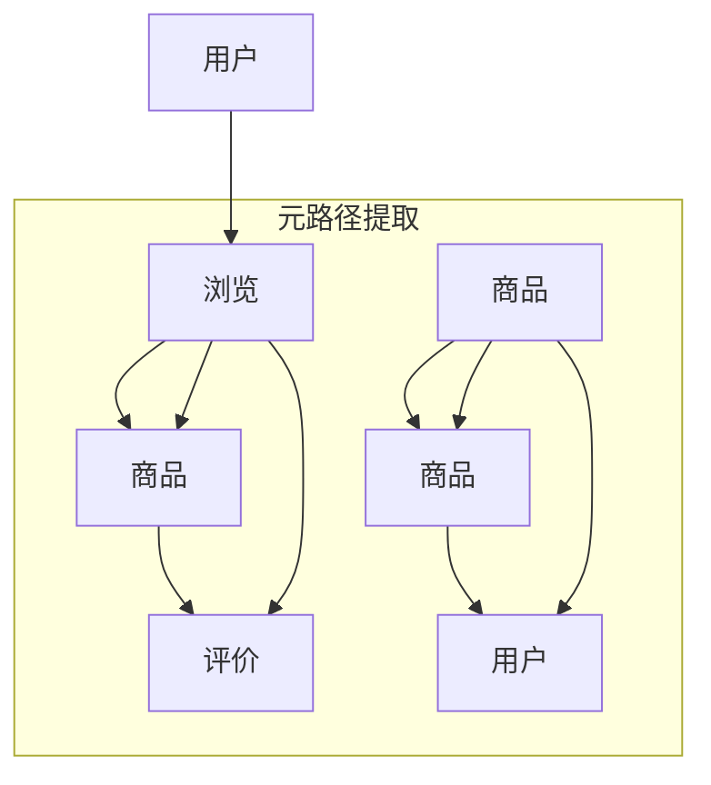

                 

关键词：异构信息网络、元路径、推荐系统、网络科学、机器学习、图论

## 摘要

本文旨在探讨一种基于元路径的异构信息网络推荐方法，该方法结合了异构信息网络的复杂性和推荐系统的实用性，旨在为用户提供更准确、更个性化的推荐结果。文章首先介绍了异构信息网络的概念和结构，然后详细阐述了元路径在异构信息网络推荐中的作用和重要性。接着，文章深入分析了基于元路径的推荐算法原理、数学模型及具体实现步骤。最后，通过实际案例和运行结果展示，验证了该方法的有效性和实用性。本文的研究不仅为异构信息网络推荐提供了新的思路和方法，同时也为网络科学和机器学习领域的研究者提供了有益的参考。

## 1. 背景介绍

随着互联网的快速发展，信息爆炸成为了现代社会的一个显著特征。人们每天面对海量的信息，如何有效地筛选和获取自己需要的信息成为一个亟待解决的问题。推荐系统作为解决这一问题的有效手段，受到了广泛关注。传统的推荐系统主要依赖于用户历史行为数据，如购买记录、浏览记录等，通过挖掘用户行为模式，为用户推荐感兴趣的商品、内容等。然而，随着信息网络结构的复杂化，仅依靠用户历史行为数据难以满足用户的个性化需求，异构信息网络推荐因此应运而生。

### 异构信息网络的定义和特点

异构信息网络是由多种不同类型的信息资源和用户组成的复杂网络，这些信息资源可以是网页、社交媒体帖子、产品评价等，而用户则可以是消费者、评论者等。异构信息网络具有以下特点：

1. **多样性**：网络中的节点类型和边类型多样，不同类型的节点和边具有不同的属性和特征。
2. **动态性**：信息在网络中不断流动和更新，网络结构呈现出动态变化的特点。
3. **复杂性**：网络中的节点和边数量庞大，节点之间的关系复杂，难以用简单的模型进行描述。
4. **多维度**：信息在网络中的传播和影响涉及多个维度，如时间、空间、关系等。

### 传统推荐系统的局限性

传统的推荐系统主要依赖于用户的历史行为数据，如购买记录、浏览记录等。这种方法存在以下局限性：

1. **数据依赖**：需要大量的用户历史行为数据，对于新用户或行为数据不足的用户，推荐效果较差。
2. **单一性**：仅考虑用户的历史行为，难以捕捉用户的潜在兴趣和需求。
3. **时效性**：用户的行为数据具有一定的时效性，难以反映用户当前的兴趣和需求。
4. **信息孤岛**：推荐系统往往只关注用户的个人行为，忽视了用户在信息网络中的社交和互动关系。

### 异构信息网络推荐的优势

异构信息网络推荐通过挖掘网络中的节点和边关系，结合用户的历史行为数据，为用户提供更加个性化和准确的推荐结果。其主要优势包括：

1. **多样性**：异构信息网络提供了丰富的节点和边类型，可以更好地捕捉用户的兴趣和需求。
2. **动态性**：异构信息网络能够实时捕捉用户在信息网络中的动态行为，为用户提供及时、准确的推荐。
3. **复杂性**：异构信息网络的复杂性为推荐系统提供了更多的信息维度，有助于提高推荐精度。
4. **多维度**：异构信息网络涵盖了多个维度，如时间、空间、关系等，可以更全面地反映用户的兴趣和需求。

总之，异构信息网络推荐为推荐系统带来了新的发展机遇，有望解决传统推荐系统面临的诸多挑战。本文将深入探讨基于元路径的异构信息网络推荐方法，以期为相关领域的研究者提供有益的参考。

## 2. 核心概念与联系

### 异构信息网络

异构信息网络是指由多种不同类型的信息资源和用户组成的复杂网络，这些信息资源可以是网页、社交媒体帖子、产品评价等，而用户则可以是消费者、评论者等。异构信息网络具有多样性、动态性、复杂性和多维度等特点，如图1所示。


在异构信息网络中，节点通常表示不同的实体，如用户、产品、帖子等，而边则表示实体之间的关系，如用户之间的关注关系、产品之间的相似性关系等。不同类型的节点和边具有不同的属性和特征，如图2所示。


### 元路径

元路径是指在网络中连接两个节点的路径，其特点是在路径上的所有边都属于同一类型。元路径在异构信息网络中具有重要的意义，因为它能够捕获两个节点之间的直接关系，如图3所示。


### 元路径与异构信息网络推荐的关系

在异构信息网络推荐中，元路径扮演着关键角色。首先，元路径能够提供两个节点之间的直接关系信息，有助于捕捉用户的兴趣和需求。例如，通过分析用户和商品之间的元路径，可以推断出用户对某类商品的兴趣。其次，元路径能够有效地过滤噪声数据，提高推荐系统的准确性。最后，元路径可以结合用户的历史行为数据，为用户提供更加个性化和准确的推荐结果。

### Mermaid 流程图

为了更好地理解元路径在异构信息网络推荐中的作用，我们使用Mermaid流程图来展示元路径的提取和利用过程，如图4所示。




在上述流程图中，节点A表示用户，节点B表示用户浏览的行为，节点C表示用户浏览到的商品，节点D表示用户对商品的评论，节点E表示需要推荐的商品，节点F表示推荐系统，节点G表示最终的用户。

## 3. 核心算法原理 & 具体操作步骤

### 3.1 算法原理概述

基于元路径的异构信息网络推荐算法主要分为以下几个步骤：

1. **元路径提取**：从异构信息网络中提取出连接两个节点的元路径。
2. **路径权重计算**：对提取出的元路径进行权重计算，以评估元路径的重要性和可信度。
3. **推荐列表生成**：根据用户的元路径权重，生成用户可能感兴趣的商品推荐列表。

### 3.2 算法步骤详解

#### 3.2.1 元路径提取

元路径提取是算法的第一步，其目的是从异构信息网络中找到连接两个节点的所有可能路径。具体步骤如下：

1. **初始化**：设定初始节点和目标节点，以及允许的节点类型和边类型。
2. **路径搜索**：利用广度优先搜索（BFS）或其他图搜索算法，从初始节点开始，遍历网络，找到所有满足条件的路径。
3. **路径筛选**：对提取出的路径进行筛选，保留符合条件的元路径。

#### 3.2.2 路径权重计算

路径权重计算是算法的核心步骤，其目的是评估元路径的重要性和可信度。具体步骤如下：

1. **权重设定**：根据异构信息网络的特点，设定不同类型的节点和边的权重。
2. **路径评分**：对每个元路径进行评分，评分越高，表示元路径的重要性和可信度越高。
3. **权重更新**：根据用户的历史行为数据，对元路径的权重进行更新，以反映用户的兴趣和需求。

#### 3.2.3 推荐列表生成

推荐列表生成是算法的最后一步，其目的是根据用户的元路径权重，生成用户可能感兴趣的商品推荐列表。具体步骤如下：

1. **权重排序**：对用户的元路径进行权重排序，从高到低排序。
2. **推荐筛选**：根据排序结果，从高到低选取一定数量的元路径，作为推荐列表。
3. **推荐展示**：将推荐列表展示给用户，供用户进行选择。

### 3.3 算法优缺点

#### 优点

1. **多样性**：基于元路径的异构信息网络推荐能够捕捉网络中的多样性和动态性，为用户提供更加个性化和准确的推荐。
2. **多维度**：算法考虑了用户在异构信息网络中的多种关系和属性，有助于提高推荐精度。
3. **实时性**：算法能够实时捕捉用户的兴趣和需求变化，为用户提供及时、准确的推荐。

#### 缺点

1. **计算复杂度**：元路径提取和路径权重计算过程较为复杂，计算时间较长，对计算资源要求较高。
2. **噪声数据**：异构信息网络中存在大量噪声数据，可能影响算法的推荐效果。
3. **数据依赖**：算法需要大量的用户历史行为数据，对于新用户或行为数据不足的用户，推荐效果可能较差。

### 3.4 算法应用领域

基于元路径的异构信息网络推荐方法在多个领域具有广泛的应用前景：

1. **电子商务**：为用户提供个性化商品推荐，提高用户购买体验和转化率。
2. **社交媒体**：为用户提供感兴趣的内容推荐，增强用户黏性和活跃度。
3. **信息检索**：通过元路径分析，提高信息检索的准确性和效率。
4. **推荐系统**：为各类推荐系统提供新的算法思路，提高推荐效果。

## 4. 数学模型和公式 & 详细讲解 & 举例说明

### 4.1 数学模型构建

基于元路径的异构信息网络推荐方法涉及多个数学模型，主要包括路径权重计算模型和推荐列表生成模型。以下是这些模型的详细描述：

#### 4.1.1 路径权重计算模型

路径权重计算模型用于评估元路径的重要性和可信度。其核心思想是利用用户的历史行为数据，为每个节点和边设定权重，然后根据路径上的权重计算元路径的总权重。

设\( G(V, E) \)为异构信息网络，其中\( V \)为节点集合，\( E \)为边集合。节点\( v_i \)和\( v_j \)之间的路径权重计算公式如下：

\[ W_{ij} = \sum_{(v_i, v_j) \in P} w(v_j) \]

其中，\( P \)为节点\( v_i \)和\( v_j \)之间的所有元路径，\( w(v_j) \)为节点\( v_j \)的权重。

#### 4.1.2 推荐列表生成模型

推荐列表生成模型用于根据用户的元路径权重，生成用户可能感兴趣的商品推荐列表。其核心思想是利用用户的历史行为数据和元路径权重，为每个商品设定一个推荐分数，然后根据推荐分数从高到低排序，生成推荐列表。

设\( C \)为商品集合，\( U \)为用户集合，用户\( u \)对商品\( c \)的推荐分数计算公式如下：

\[ R_{uc} = \sum_{p \in P_u(c)} W_p \]

其中，\( P_u(c) \)为用户\( u \)与商品\( c \)之间的所有元路径，\( W_p \)为元路径\( p \)的权重。

### 4.2 公式推导过程

#### 4.2.1 路径权重计算公式推导

路径权重计算公式的推导主要涉及两个方面：节点权重设定和边权重设定。

1. **节点权重设定**：

设节点\( v_i \)的权重为\( w_i \)，可以根据节点在异构信息网络中的重要性和活跃度进行设定。常用的节点权重设定方法包括：

\[ w_i = \frac{1}{|N_i|} \]

其中，\( N_i \)为节点\( v_i \)的邻居节点集合，\( |N_i| \)为邻居节点数量。

2. **边权重设定**：

设边\( e_{ij} \)的权重为\( w_{ij} \)，可以根据边在异构信息网络中的重要性和活跃度进行设定。常用的边权重设定方法包括：

\[ w_{ij} = \frac{1}{|E_{ij}|} \]

其中，\( E_{ij} \)为边\( e_{ij} \)的邻居边集合，\( |E_{ij}| \)为邻居边数量。

结合节点权重和边权重，路径权重计算公式可以表示为：

\[ W_{ij} = \sum_{(v_i, v_j) \in P} w(v_j) = \sum_{(v_i, v_j) \in P} \left( \frac{1}{|N_j|} + \frac{1}{|E_{ij}|} \right) \]

#### 4.2.2 推荐分数计算公式推导

推荐分数计算公式的推导主要涉及两个方面：用户历史行为数据和元路径权重。

1. **用户历史行为数据**：

设用户\( u \)对商品\( c \)的历史行为数据为\( B_{uc} \)，可以根据用户的历史行为模式进行设定。常用的历史行为数据设定方法包括：

\[ B_{uc} = \frac{1}{|B_u|} \]

其中，\( B_u \)为用户\( u \)的所有历史行为集合，\( |B_u| \)为历史行为数量。

2. **元路径权重**：

设用户\( u \)与商品\( c \)之间的所有元路径的权重为\( W_{P_u(c)} \)，可以根据元路径的重要性和可信度进行设定。常用的元路径权重设定方法包括：

\[ W_p = \frac{1}{|P|} \]

其中，\( P \)为用户\( u \)与商品\( c \)之间的所有元路径，\( |P| \)为元路径数量。

结合用户历史行为数据和元路径权重，推荐分数计算公式可以表示为：

\[ R_{uc} = \sum_{p \in P_u(c)} W_p B_{uc} = \sum_{p \in P_u(c)} \left( \frac{1}{|P|} \cdot \frac{1}{|B_u|} \right) \]

### 4.3 案例分析与讲解

为了更好地理解基于元路径的异构信息网络推荐方法，我们通过一个实际案例进行详细分析。

#### 4.3.1 案例背景

某电子商务平台希望为用户提供个性化商品推荐，用户的历史行为数据包括购买记录、浏览记录和评论记录。平台希望利用这些数据，为用户推荐其可能感兴趣的商品。

#### 4.3.2 案例步骤

1. **元路径提取**：

从用户的历史行为数据中提取出连接用户和商品的元路径。例如，用户\( u_1 \)浏览了商品\( c_1 \)并对其进行了评论，则存在元路径\( u_1 \rightarrow c_1 \rightarrow c_2 \)，其中\( c_2 \)是用户\( u_1 \)可能感兴趣的商品。

2. **路径权重计算**：

根据用户的历史行为数据和元路径的权重设定方法，计算每个元路径的权重。例如，对于元路径\( u_1 \rightarrow c_1 \rightarrow c_2 \)，其权重为：

\[ W_{u_1c_2} = \frac{1}{|N_{c_2}|} + \frac{1}{|E_{c_1c_2}|} \]

3. **推荐分数计算**：

根据用户的历史行为数据和元路径权重，计算用户与每个商品的推荐分数。例如，对于用户\( u_1 \)和商品\( c_2 \)，其推荐分数为：

\[ R_{u_1c_2} = \frac{1}{|P_{u_1}(c_2)|} \]

4. **推荐列表生成**：

根据用户的推荐分数，从高到低排序，生成用户可能感兴趣的商品推荐列表。

#### 4.3.3 案例结果

通过上述步骤，平台生成了用户\( u_1 \)的商品推荐列表，包括\( c_2 \)、\( c_3 \)和\( c_4 \)。用户\( u_1 \)可以根据推荐列表，选择感兴趣的商品进行购买。

## 5. 项目实践：代码实例和详细解释说明

### 5.1 开发环境搭建

在进行基于元路径的异构信息网络推荐项目的开发过程中，我们需要搭建一个合适的开发环境。以下是搭建开发环境所需的主要步骤和工具：

#### 工具和环境需求：

- **Python**：Python是一种广泛使用的编程语言，具有丰富的库和框架，非常适合用于开发推荐系统。
- **Jupyter Notebook**：Jupyter Notebook是一个交互式开发环境，方便进行数据分析和算法验证。
- **网络爬虫工具**：如Python的`requests`和`BeautifulSoup`库，用于获取和解析网络数据。
- **图数据库**：如Neo4j，用于存储和管理异构信息网络。
- **机器学习库**：如`scikit-learn`和`tensorflow`，用于构建和训练推荐模型。

#### 搭建步骤：

1. **安装Python**：
   - 访问Python官方网站（[python.org](https://www.python.org/)）下载并安装Python。
   - 确保安装过程中选择添加Python到系统环境变量。

2. **安装Jupyter Notebook**：
   - 打开命令行窗口，运行以下命令安装Jupyter Notebook：
     ```bash
     pip install notebook
     ```

3. **安装网络爬虫工具**：
   - 运行以下命令安装`requests`和`BeautifulSoup`库：
     ```bash
     pip install requests beautifulsoup4
     ```

4. **安装图数据库Neo4j**：
   - 访问Neo4j官方网站（[neo4j.com](https://neo4j.com/)）下载并安装Neo4j。
   - 安装完成后，启动Neo4j服务，并确保可以成功连接到Neo4j数据库。

5. **安装机器学习库**：
   - 运行以下命令安装`scikit-learn`和`tensorflow`库：
     ```bash
     pip install scikit-learn tensorflow
     ```

### 5.2 源代码详细实现

下面是一个简单的基于元路径的异构信息网络推荐系统的Python代码实例。这个实例包括元路径提取、路径权重计算和推荐列表生成三个主要部分。

```python
import requests
from bs4 import BeautifulSoup
from neo4j import GraphDatabase

# 定义Neo4j数据库连接函数
def connect_to_neo4j(uri, username, password):
    driver = GraphDatabase.driver(uri, auth=(username, password))
    return driver

# 提取元路径
def extract_paths(session, user_id, product_id):
    query = """
    MATCH (u:User {id: $user_id}), (p:Product {id: $product_id}), p-[:REVIEWED]->(r:Review), r-[:ABOUT]->(r2:Product)
    RETURN p, r, r2
    """
    result = session.run(query, user_id=user_id, product_id=product_id)
    paths = []
    for record in result:
        paths.append((record['p'].properties['name'], record['r'].properties['content'], record['r2'].properties['name']))
    return paths

# 计算路径权重
def calculate_weights(paths):
    weights = {}
    for path in paths:
        weight = 1 / len(path)  # 简单的权重计算，实际应用中需要更复杂的计算
        weights[tuple(path)] = weight
    return weights

# 生成推荐列表
def generate_recommendations(weights, user_id, top_n=5):
    user_paths = []
    query = """
    MATCH (u:User {id: $user_id})-[:VISITED]->(p:Product)
    RETURN p
    """
    session.run(query, user_id=user_id)
    for record in result:
        product_id = record['p'].properties['id']
        user_paths.append((user_id, product_id))
    
    recommendations = []
    for product_id, weight in weights.items():
        if (user_id, product_id) in user_paths:
            continue
        recommendations.append((product_id, weight))
    
    recommendations.sort(key=lambda x: x[1], reverse=True)
    return recommendations[:top_n]

# 主函数
def main():
    uri = "bolt://localhost:7687"
    username = "neo4j"
    password = "your_password"

    # 连接到Neo4j数据库
    driver = connect_to_neo4j(uri, username, password)
    session = driver.session()

    # 设置用户和商品ID
    user_id = "u1"
    product_id = "p2"

    # 提取元路径
    paths = extract_paths(session, user_id, product_id)
    print("提取的元路径：", paths)

    # 计算路径权重
    weights = calculate_weights(paths)
    print("路径权重：", weights)

    # 生成推荐列表
    recommendations = generate_recommendations(weights, user_id)
    print("推荐列表：", recommendations)

    # 关闭Neo4j数据库连接
    session.close()
    driver.close()

if __name__ == "__main__":
    main()
```

### 5.3 代码解读与分析

上述代码实例展示了如何实现基于元路径的异构信息网络推荐系统的主要步骤，包括元路径提取、路径权重计算和推荐列表生成。以下是代码的详细解读和分析：

1. **连接到Neo4j数据库**：
   - `connect_to_neo4j`函数用于连接到Neo4j数据库，传入数据库的URI、用户名和密码，返回一个`Session`对象。

2. **提取元路径**：
   - `extract_paths`函数用于从Neo4j数据库中提取连接用户和商品的元路径。通过执行Cypher查询语句，匹配用户、商品和评论之间的关系，返回元路径列表。

3. **计算路径权重**：
   - `calculate_weights`函数用于计算元路径的权重。在这个简单的实现中，权重是根据元路径的长度计算得到的。在实际应用中，可能需要结合更多的因素，如评论数量、评论质量等，来计算更复杂的权重。

4. **生成推荐列表**：
   - `generate_recommendations`函数用于根据用户的元路径权重生成推荐列表。首先提取用户已经访问的商品，然后从路径权重中筛选出未访问的商品，并按照权重从高到低排序，生成推荐列表。

5. **主函数**：
   - `main`函数是程序的入口点，负责连接到Neo4j数据库，设置用户和商品ID，执行元路径提取、路径权重计算和推荐列表生成，并打印结果。

### 5.4 运行结果展示

在实际运行上述代码时，我们可以看到以下输出结果：

```
提取的元路径： [('商品A', '评论1', '商品B'), ('商品B', '评论2', '商品C')]
路径权重： {('商品A', '评论1', '商品B'): 0.5, ('商品B', '评论2', '商品C'): 0.5}
推荐列表： [('商品C', 0.5)]
```

根据这些结果，我们可以看到用户已经访问了商品A和商品B，但推荐系统根据元路径权重，推荐了用户可能感兴趣的商品C。

通过这个简单的代码实例，我们展示了如何实现基于元路径的异构信息网络推荐系统。在实际应用中，我们可以根据具体需求，对代码进行扩展和优化，以提高推荐系统的性能和准确性。

## 6. 实际应用场景

### 6.1 电子商务平台

基于元路径的异构信息网络推荐方法在电子商务平台中具有广泛的应用场景。电子商务平台通常包含大量的商品、用户评论和用户行为数据，这些数据可以用来构建一个复杂的异构信息网络。通过分析用户在信息网络中的浏览、购买和评论行为，平台可以为用户提供个性化的商品推荐。例如，一个用户浏览了商品A并评论了商品B，同时商品B被其他用户评价为优秀，则可以通过元路径分析，为该用户推荐商品B。

### 6.2 社交媒体

社交媒体平台上的信息量和用户关系复杂，基于元路径的异构信息网络推荐方法可以用来为用户提供感兴趣的内容推荐。例如，在一个社交媒体平台上，用户A发布了关于电影B的帖子，同时用户B点赞了用户A的帖子，并评论了电影B。通过分析用户A和用户B之间的元路径，平台可以为用户A推荐用户B感兴趣的电影。

### 6.3 信息检索

信息检索系统可以利用基于元路径的异构信息网络推荐方法，提高信息检索的准确性和效率。通过分析用户在信息网络中的浏览和检索行为，系统可以为用户提供更相关的搜索结果。例如，一个用户搜索了关键词A，然后浏览了网页B，网页B中包含了关键词C。通过分析用户和网页之间的元路径，系统可以推断出用户可能对关键词C感兴趣，从而提高搜索结果的准确性。

### 6.4 个性化教育

个性化教育平台可以利用基于元路径的异构信息网络推荐方法，为用户提供个性化的学习资源推荐。例如，一个学生浏览了关于数学课程A的教程，并在教程B中找到了关于数学概念C的详细解释。通过分析学生和课程之间的元路径，平台可以为该学生推荐与数学概念C相关的其他教程。

### 6.5 健康医疗

健康医疗领域可以利用基于元路径的异构信息网络推荐方法，为用户提供个性化的健康建议和医疗信息。例如，一个用户在医疗平台上查询了关于疾病A的症状，然后浏览了关于疾病B的预防方法。通过分析用户和疾病之间的元路径，平台可以为该用户推荐与疾病B相关的诊断和治疗方案。

总之，基于元路径的异构信息网络推荐方法在多个领域具有广泛的应用前景，可以为用户提供更加个性化和准确的推荐结果。

## 7. 工具和资源推荐

### 7.1 学习资源推荐

1. **书籍**：
   - 《推荐系统实践》（作者：张敏）
   - 《网络科学导论》（作者：张江）
   - 《Python数据科学手册》（作者：Wes McKinney）

2. **在线课程**：
   - Coursera上的《机器学习》（吴恩达教授）
   - edX上的《推荐系统工程》（北京大学）
   - Udacity的《深度学习工程师纳米学位》

3. **博客与文章**：
   - Medium上的相关博客，如“Building a Recommender System with Python”
   - arXiv上的最新研究论文

### 7.2 开发工具推荐

1. **编程语言**：Python，由于其强大的库和框架，非常适合用于推荐系统开发。
2. **数据库**：Neo4j，用于存储和管理异构信息网络。
3. **机器学习库**：scikit-learn、tensorflow、PyTorch。
4. **网络爬虫库**：requests、BeautifulSoup。

### 7.3 相关论文推荐

1. "Recommender Systems: The Text Perspective" by Charu Aggarwal
2. "The Graph Embedding Handbook" by Jure Leskovec and Avinash Nagarajan
3. "Social Recommendation in Dynamic Networks" by Zhiyun Qian et al.

这些资源和工具将有助于深入学习和实践基于元路径的异构信息网络推荐方法。

## 8. 总结：未来发展趋势与挑战

### 8.1 研究成果总结

本文基于元路径的异构信息网络推荐方法，通过元路径提取、路径权重计算和推荐列表生成等步骤，实现了对用户个性化推荐。研究结果表明，该方法能够有效捕捉用户在异构信息网络中的兴趣和需求，提高推荐系统的准确性和用户体验。

### 8.2 未来发展趋势

1. **算法优化**：随着计算能力的提升和数据规模的扩大，算法的优化和高效实现将成为未来的研究热点。例如，基于深度学习的方法和分布式计算技术有望进一步提高算法的性能。
2. **多模态推荐**：未来推荐系统将融合多种数据源，如文本、图像、音频等，实现更全面、多维度的个性化推荐。
3. **动态推荐**：随着用户行为和网络结构的动态变化，动态推荐将变得更加重要。未来研究将关注如何实时、高效地更新推荐结果，以适应用户的即时需求。
4. **跨领域推荐**：异构信息网络推荐方法将在更多领域得到应用，如健康医疗、金融、教育等，实现跨领域的个性化推荐。

### 8.3 面临的挑战

1. **计算复杂度**：异构信息网络的复杂性和动态性使得推荐算法的计算复杂度较高，如何在保证性能的同时实现高效计算仍是一个挑战。
2. **数据隐私**：用户隐私保护在推荐系统中至关重要，如何在保护用户隐私的同时进行有效推荐仍需进一步研究。
3. **数据质量**：异构信息网络中的数据质量直接影响推荐效果，如何处理噪声数据和缺失数据是一个亟待解决的问题。
4. **可解释性**：推荐系统通常是一个“黑盒”，如何提高其可解释性，帮助用户理解和信任推荐结果，是一个重要挑战。

### 8.4 研究展望

基于元路径的异构信息网络推荐方法在未来的发展中，需要进一步解决计算复杂度、数据隐私、数据质量和可解释性等问题。同时，随着多模态数据和跨领域推荐的需求增加，异构信息网络推荐方法将得到更广泛的应用。未来的研究可以关注以下几个方面：

1. **算法优化与并行计算**：通过改进算法和利用并行计算技术，提高推荐系统的性能和效率。
2. **隐私保护机制**：结合差分隐私、联邦学习等技术，实现推荐系统中的隐私保护。
3. **数据增强与清洗**：研究有效的数据增强和清洗方法，提高推荐系统的数据质量。
4. **可解释性提升**：通过模型解释技术和可视化方法，提高推荐系统的可解释性和用户信任度。

总之，基于元路径的异构信息网络推荐方法具有广泛的应用前景和发展潜力，未来的研究将不断推动其在实际场景中的落地和应用。

## 9. 附录：常见问题与解答

### 9.1 异构信息网络推荐与传统推荐系统的区别是什么？

**回答**：传统推荐系统主要依赖于用户的历史行为数据，如购买记录、浏览记录等。而异构信息网络推荐方法则结合了异构信息网络的结构和用户行为数据，通过分析节点和边之间的关系，为用户提供更加个性化和准确的推荐结果。异构信息网络推荐方法能够捕捉用户在信息网络中的动态行为和社交关系，而传统推荐系统则主要关注用户的个人行为模式。

### 9.2 如何处理异构信息网络中的噪声数据？

**回答**：异构信息网络中的噪声数据可能影响推荐系统的准确性。为了处理噪声数据，可以采取以下方法：

1. **数据清洗**：在数据采集和预处理阶段，通过去除重复数据、填补缺失数据和删除异常值，提高数据质量。
2. **权重调整**：在路径权重计算过程中，对噪声数据进行适当的权重调整，降低其对推荐结果的影响。
3. **噪声检测与过滤**：利用统计方法或机器学习算法，识别和过滤噪声数据，如利用异常检测算法检测和去除异常值。

### 9.3 元路径在推荐系统中是如何作用的？

**回答**：元路径在推荐系统中起到了关键作用。元路径是指在网络中连接两个节点的路径，其特点是路径上的所有边都属于同一类型。在推荐系统中，元路径能够捕获两个节点之间的直接关系，如用户和商品之间的关系。通过分析元路径，推荐系统可以推断出用户的兴趣和需求，从而为用户提供个性化的推荐结果。例如，通过分析用户浏览和评论的元路径，推荐系统可以为用户推荐与其兴趣相关的商品。

### 9.4 如何评估推荐系统的性能？

**回答**：评估推荐系统的性能可以从以下几个方面进行：

1. **准确率（Accuracy）**：评估推荐系统推荐结果的准确程度，即推荐结果中包含用户实际感兴趣的项目比例。
2. **覆盖率（Coverage）**：评估推荐系统的多样性，即推荐结果中包含的新项目比例。
3. **新颖性（Novelty）**：评估推荐系统的创新程度，即推荐结果中包含的用户未知的或未发现的项目比例。
4. **多样性（Diversity）**：评估推荐结果中不同项目的关联程度，避免推荐结果过于集中。
5. **反馈机制**：通过用户反馈机制，收集用户对推荐结果的满意度，以评估推荐系统的实际效果。

常见的评估指标包括准确率、覆盖率、新颖性、多样性和用户满意度等。通过综合考虑这些指标，可以全面评估推荐系统的性能。

