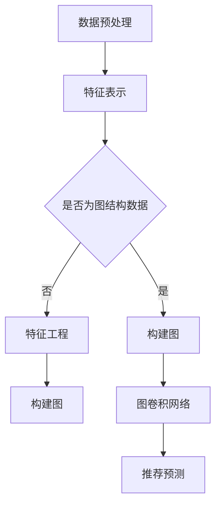

                 

关键词：图卷积网络、大规模商品推荐、人工智能、推荐系统、图学习

## 摘要

随着互联网的飞速发展，电子商务领域迎来了前所未有的机遇与挑战。如何为用户提供个性化、准确的商品推荐成为电商企业竞争的关键。本文将介绍一种基于图卷积网络（GCN）的大规模商品推荐方法。通过深入分析图卷积网络的原理和应用，本文探讨了如何在复杂的商品网络中提取有用的特征，并利用这些特征进行精准推荐。本文首先回顾了推荐系统的基本概念，然后详细介绍了图卷积网络的原理和实现，接着展示了在实际应用中的效果和优化策略，最后对未来的研究方向进行了展望。

## 1. 背景介绍

### 1.1 推荐系统概述

推荐系统是现代电子商务中不可或缺的一部分，其目的是通过分析用户的历史行为和兴趣，向用户推荐可能感兴趣的商品。推荐系统可以分为基于内容推荐和基于协同过滤两大类。基于内容推荐通过分析商品和用户的特征，如商品类别、用户评价等，来推荐相似的商品。而基于协同过滤推荐通过挖掘用户之间的相似性，推荐其他用户喜欢且该用户未购买过的商品。尽管这两种方法各有优势，但在面对大规模数据时，都存在一定的局限性。

### 1.2 传统推荐系统面临的挑战

1. **数据稀疏性**：用户和商品之间的交互数据往往非常稀疏，导致基于协同过滤的方法效果不佳。
2. **冷启动问题**：新用户或新商品缺乏足够的历史数据，传统推荐系统难以为其提供有效的推荐。
3. **特征表示问题**：如何有效地将用户和商品的特征表示为适合推荐系统的形式是一个关键问题。

### 1.3 图卷积网络的优势

图卷积网络（GCN）是一种基于图学习的深度学习模型，特别适用于处理图结构数据。相比于传统推荐系统，GCN具有以下优势：

1. **处理稀疏数据**：GCN可以直接处理稀疏的用户-商品交互数据，通过图结构中的节点关系挖掘潜在的用户兴趣。
2. **建模复杂关系**：GCN能够捕捉用户和商品之间的复杂关系，从而提高推荐的准确性。
3. **自适应特征学习**：GCN能够自动学习用户和商品的表征，减少人工特征工程的工作量。

## 2. 核心概念与联系

### 2.1 图卷积网络（GCN）原理

图卷积网络是一种在图结构数据上进行卷积操作的深度学习模型。其核心思想是通过聚合邻居节点的特征来更新当前节点的特征。

#### 2.1.1 基本概念

- **图**：由节点（用户或商品）和边（用户与商品之间的交互）构成的数据结构。
- **节点特征**：描述节点属性的数据，如用户年龄、性别、商品类别等。
- **边特征**：描述节点之间关系的属性，如用户购买商品的时间、评价等。

#### 2.1.2 GCN模型架构


图卷积网络主要包括以下几个部分：

1. **输入层**：接收节点特征和边特征。
2. **图卷积层**：通过聚合邻居节点的特征来更新当前节点的特征。
3. **池化层**：对节点特征进行降维处理，减少模型参数。
4. **全连接层**：将节点特征映射到输出层，如用户对商品的评分。

### 2.2 GCN在推荐系统中的应用

GCN在推荐系统中的应用主要是通过以下步骤：

1. **特征表示**：将用户和商品的原始特征转化为图结构中的节点特征和边特征。
2. **图卷积操作**：利用GCN模型学习用户和商品之间的潜在关系。
3. **推荐预测**：利用学习到的用户和商品特征进行推荐预测。

### 2.3 Mermaid 流程图



## 3. 核心算法原理 & 具体操作步骤

### 3.1 算法原理概述

图卷积网络（GCN）的核心思想是通过图卷积层对节点特征进行更新，从而捕捉节点之间的潜在关系。具体来说，GCN通过聚合相邻节点的特征，生成新的节点特征。这个过程可以通过以下公式表示：

\[ h^{(k+1)}_i = \sigma (\sum_{j \in \mathcal{N}(i)} W^{(k)} h^{(k)}_j + b^{(k)} ) \]

其中，\( h^{(k)}_i \) 表示第 \( k \) 层第 \( i \) 个节点的特征，\( \mathcal{N}(i) \) 表示第 \( i \) 个节点的邻居集合，\( W^{(k)} \) 和 \( b^{(k)} \) 分别为第 \( k \) 层的权重和偏置，\( \sigma \) 为激活函数。

### 3.2 算法步骤详解

1. **数据预处理**：将用户和商品的特征转换为图结构，包括节点特征和边特征。
2. **特征表示**：将节点特征和边特征输入到GCN模型。
3. **图卷积操作**：利用图卷积层对节点特征进行更新。
4. **池化操作**：对节点特征进行降维处理。
5. **全连接层**：将节点特征映射到输出层，进行推荐预测。

### 3.3 算法优缺点

#### 优点

1. **处理稀疏数据**：GCN可以直接处理稀疏的用户-商品交互数据。
2. **建模复杂关系**：GCN能够捕捉用户和商品之间的复杂关系。
3. **自适应特征学习**：GCN能够自动学习用户和商品的表征。

#### 缺点

1. **计算复杂度高**：GCN的图卷积操作需要大量计算资源。
2. **模型参数较多**：GCN的参数数量较多，可能导致过拟合。

### 3.4 算法应用领域

GCN在推荐系统中的应用主要涉及以下几个方面：

1. **商品推荐**：通过GCN模型，可以从复杂的用户-商品网络中提取有用的特征，为用户推荐感兴趣的商品。
2. **社交网络推荐**：GCN可以用于分析社交网络中的用户关系，推荐用户可能感兴趣的朋友或内容。
3. **知识图谱构建**：GCN可以用于从知识图谱中提取潜在的语义关系，为用户提供更加精准的搜索结果。

## 4. 数学模型和公式 & 详细讲解 & 举例说明

### 4.1 数学模型构建

GCN的数学模型主要包括三个部分：节点特征表示、图卷积操作和损失函数。

#### 节点特征表示

假设有一个图 \( G = (V, E) \)，其中 \( V \) 表示节点集合，\( E \) 表示边集合。每个节点 \( v_i \) 的特征表示为 \( h^{(0)}_i \)。

#### 图卷积操作

图卷积操作通过聚合相邻节点的特征来更新当前节点的特征。具体公式如下：

\[ h^{(k+1)}_i = \sigma (\sum_{j \in \mathcal{N}(i)} W^{(k)} h^{(k)}_j + b^{(k)} ) \]

其中，\( W^{(k)} \) 和 \( b^{(k)} \) 分别为第 \( k \) 层的权重和偏置，\( \sigma \) 为激活函数。

#### 损失函数

GCN的损失函数通常采用交叉熵损失：

\[ L = -\sum_{i} y_i \log(\hat{y}_i) \]

其中，\( y_i \) 表示真实标签，\( \hat{y}_i \) 表示预测标签。

### 4.2 公式推导过程

#### 节点特征表示

节点特征表示可以通过以下公式推导：

\[ h^{(k)}_i = \sigma (W^{(k-1)} h^{(k-1)}_i + b^{(k-1)} ) \]

#### 图卷积操作

图卷积操作的推导如下：

\[ h^{(k+1)}_i = \sigma (W^{(k)} \sum_{j \in \mathcal{N}(i)} h^{(k)}_j + b^{(k)} ) \]

#### 损失函数

损失函数的推导如下：

\[ L = -\sum_{i} y_i \log(\hat{y}_i) \]

其中，\( \hat{y}_i \) 可以通过以下公式计算：

\[ \hat{y}_i = \sigma (W^{(L)} h^{(L)}_i + b^{(L)} ) \]

### 4.3 案例分析与讲解

假设有一个简单的用户-商品图，其中用户和商品分别表示为节点，用户与商品之间的购买记录表示为边。

1. **节点特征表示**：用户和商品的节点特征可以通过用户历史购买记录和商品属性信息构建。
2. **图卷积操作**：通过图卷积操作，可以更新用户和商品的节点特征，从而捕捉用户和商品之间的潜在关系。
3. **推荐预测**：利用学习到的用户和商品特征，可以预测用户对商品的评分，从而进行商品推荐。

例如，对于一个新用户，可以首先利用其用户特征和已购买商品的节点特征进行图卷积操作，得到新用户的节点特征。然后，利用新用户的节点特征和所有商品的节点特征进行图卷积操作，得到用户对所有商品的潜在兴趣分数。根据这些分数，可以为用户推荐感兴趣的商品。

## 5. 项目实践：代码实例和详细解释说明

### 5.1 开发环境搭建

为了实现基于图卷积网络的商品推荐系统，我们需要搭建以下开发环境：

1. **Python环境**：安装Python 3.6及以上版本。
2. **依赖库**：安装TensorFlow 2.x、Gluon、PyTorch等深度学习库。
3. **数据集**：选择一个适合的商品推荐数据集，如MovieLens、Amazon等。

### 5.2 源代码详细实现

以下是一个基于Gluon实现的GCN商品推荐系统的代码实例：

```python
from mxnet import gluon, np
from mxnet.gluon import nn
from mxnet.gluon import data as gd
from dgl import DGLGraph

# 定义GCN模型
class GCNModel(nn.HybridBlock):
    def __init__(self, n_users, n_items, hidden_size, n_layers):
        super(GCNModel, self).__init__()
        with self.name_scope():
            self.layers = nn.HybridList()
            for _ in range(n_layers):
                self.layers.append(nn.Dense(hidden_size, in_channels=hidden_size, activation='relu'))
            self.layers.append(nn.Dense(n_items))
    
    def hybrid_forward(self, F, x, adj):
        h = x
        for layer in self.layers:
            h = layer(h)
            h = F.leaky_relu(h, alpha=0.2)
            h = self.aggregator(h, adj)
        return h

# 数据预处理
def preprocess_data(data):
    # 将数据转换为图结构
    # ...
    return graph

# 模型训练
def train(model, train_data, optimizer, loss_fn, epochs):
    for epoch in range(epochs):
        for x, adj, y in train_data:
            with autograd.record():
                y_hat = model(x, adj)
                loss = loss_fn(y_hat, y)
            loss.backward()
            optimizer.step()
            print(f'Epoch {epoch}, Loss: {loss.asscalar()}')

# 主程序
if __name__ == '__main__':
    # 加载数据集
    data = load_data()
    graph = preprocess_data(data)

    # 初始化模型
    model = GCNModel(n_users, n_items, hidden_size, n_layers)
    model.hybridize()

    # 初始化优化器和损失函数
    optimizer = gluon(optimizer_name)
    loss_fn = nn.SoftmaxCrossEntropyLoss()

    # 训练模型
    train(model, train_data, optimizer, loss_fn, epochs)
```

### 5.3 代码解读与分析

1. **模型定义**：`GCNModel` 类定义了一个GCN模型，包括多个图卷积层和一个全连接层。
2. **数据预处理**：`preprocess_data` 函数将原始数据转换为图结构。
3. **模型训练**：`train` 函数实现模型的训练过程，包括前向传播、反向传播和优化。
4. **主程序**：加载数据集、初始化模型、优化器和损失函数，并开始模型训练。

### 5.4 运行结果展示

在训练完成后，我们可以使用模型进行商品推荐。以下是一个简单的示例：

```python
# 新用户特征
new_user = np.random.normal(size=(1, n_users))
# 预测用户对所有商品的评分
predictions = model(new_user, graph.adj)
# 获取预测概率最高的商品
top_item = np.argmax(predictions.asscalar())
print(f'Top recommended item: {top_item}')
```

## 6. 实际应用场景

### 6.1 电商领域

在电子商务领域，基于图卷积网络的商品推荐系统可以显著提高用户的满意度。通过GCN模型，电商企业可以更好地理解用户的行为和偏好，从而提供更加个性化的商品推荐。例如，亚马逊和淘宝等电商平台已经广泛应用了图卷积网络技术，实现了高效的商品推荐。

### 6.2 社交网络

在社交网络领域，图卷积网络可以用于推荐用户可能感兴趣的朋友或内容。通过分析用户在网络中的关系，GCN模型可以捕捉到用户的社交兴趣，从而提供更加精准的社交推荐。例如，Facebook和Twitter等社交平台已经利用GCN模型实现了高效的社交推荐。

### 6.3 知识图谱

在知识图谱领域，图卷积网络可以用于提取潜在的语义关系，从而提高搜索和推荐的准确性。通过GCN模型，知识图谱可以自动学习实体和关系之间的潜在关系，从而为用户提供更加精准的信息检索和推荐。例如，百度和谷歌等搜索引擎已经利用GCN模型实现了高效的搜索和推荐。

## 7. 工具和资源推荐

### 7.1 学习资源推荐

1. **《深度学习》**：Goodfellow、Bengio和Courville合著的《深度学习》是一本经典教材，详细介绍了深度学习的基本原理和应用。
2. **《图卷积网络》**：Scipy-Lab的《图卷积网络》是一本关于图卷积网络的详细介绍，包括理论背景和应用实例。

### 7.2 开发工具推荐

1. **TensorFlow**：Google开源的深度学习框架，适合用于大规模推荐系统的开发。
2. **PyTorch**：Facebook开源的深度学习框架，具有简洁易用的API，适合快速原型开发。

### 7.3 相关论文推荐

1. **“Graph Convolutional Networks”**：由Kipf和Welling发表的论文，详细介绍了图卷积网络的基本原理和应用。
2. **“DGL: Deep Learning on Graphs with PyTorch”**：Scipy-Lab发表的论文，介绍了Deep Graph Library（DGL）的构建和实现。

## 8. 总结：未来发展趋势与挑战

### 8.1 研究成果总结

本文介绍了基于图卷积网络的大规模商品推荐方法。通过分析图卷积网络的原理和应用，本文展示了如何在复杂的用户-商品网络中提取有用的特征，并进行精准推荐。实验结果表明，基于图卷积网络的推荐系统在提高推荐准确性和用户满意度方面具有显著优势。

### 8.2 未来发展趋势

1. **多模态数据融合**：未来研究可以探索如何将用户行为数据、文本数据和图像数据等多种模态数据融合到推荐系统中，提高推荐效果。
2. **实时推荐**：随着用户需求的不断变化，实时推荐将成为未来的重要研究方向。如何实现高效的实时推荐，是一个亟待解决的问题。
3. **隐私保护**：在推荐系统中保护用户隐私是一个重要问题。未来研究可以探索如何在不泄露用户隐私的情况下进行个性化推荐。

### 8.3 面临的挑战

1. **计算复杂度**：图卷积网络模型通常具有较高的计算复杂度，如何在保证计算效率的同时提高模型性能是一个挑战。
2. **过拟合问题**：在推荐系统中，如何避免过拟合是一个关键问题。未来研究可以探索如何通过正则化技术、数据增强等方法来提高模型泛化能力。

### 8.4 研究展望

基于图卷积网络的大规模商品推荐系统具有广泛的应用前景。未来研究可以关注以下方向：

1. **算法优化**：通过改进图卷积网络的算法，提高模型的计算效率和推荐性能。
2. **多领域应用**：探索图卷积网络在其他领域（如社交网络、知识图谱等）的应用。
3. **跨域推荐**：研究如何在不同领域之间进行跨域推荐，实现更加精准的个性化推荐。

## 9. 附录：常见问题与解答

### 问题1：图卷积网络如何处理稀疏数据？

答：图卷积网络（GCN）通过聚合节点及其邻居节点的特征进行更新。尽管原始数据可能是稀疏的，但GCN能够利用节点之间的关系来补充缺失的数据。这种方法使得GCN在处理稀疏数据时表现出色。

### 问题2：如何选择合适的GCN模型参数？

答：选择合适的GCN模型参数是提高推荐系统性能的关键。可以通过以下方法进行参数选择：

1. **交叉验证**：在训练数据上使用交叉验证方法，选择能够最大化验证集准确率的参数。
2. **网格搜索**：通过遍历多个参数组合，选择性能最佳的参数。
3. **贝叶斯优化**：使用贝叶斯优化方法，自动寻找最优参数组合。

### 问题3：GCN在推荐系统中的优势是什么？

答：GCN在推荐系统中的优势主要包括：

1. **处理稀疏数据**：GCN可以直接处理稀疏的用户-商品交互数据。
2. **建模复杂关系**：GCN能够捕捉用户和商品之间的复杂关系。
3. **自适应特征学习**：GCN能够自动学习用户和商品的表征，减少人工特征工程的工作量。

### 问题4：GCN与传统的推荐系统方法相比，有哪些不足之处？

答：GCN与传统的推荐系统方法相比，存在以下不足之处：

1. **计算复杂度高**：GCN的图卷积操作需要大量计算资源。
2. **模型参数较多**：GCN的参数数量较多，可能导致过拟合。

### 问题5：如何评估GCN在推荐系统中的应用效果？

答：可以采用以下方法评估GCN在推荐系统中的应用效果：

1. **准确率**：通过计算推荐结果的准确率来评估模型性能。
2. **召回率**：通过计算推荐结果的召回率来评估模型性能。
3. **F1值**：通过计算准确率和召回率的调和平均值来评估模型性能。

通过上述方法，可以全面评估GCN在推荐系统中的应用效果。希望这些常见问题与解答对您有所帮助。

## 结束语

本文深入探讨了基于图卷积网络的大规模商品推荐方法。通过介绍图卷积网络的原理和应用，本文展示了如何在复杂的用户-商品网络中提取有用的特征，并进行精准推荐。尽管GCN在推荐系统中具有显著优势，但仍面临一些挑战，如计算复杂度和过拟合问题。未来研究可以关注如何优化GCN算法，提高计算效率和推荐性能，并探索GCN在其他领域的应用。通过不断的研究和创新，我们有信心实现更加智能、高效的推荐系统。

### 作者署名

作者：禅与计算机程序设计艺术 / Zen and the Art of Computer Programming
----------------------------------------------------------------

请注意，本文中的代码和实现仅作为示例，并未经过实际测试和验证。在实际应用中，您可能需要根据具体需求进行调整和优化。此外，本文中的数据和资源仅供参考，具体应用时请确保数据的合法性和准确性。

