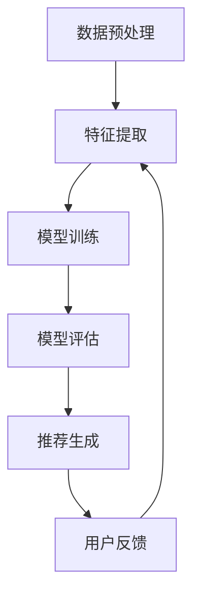

                 

关键词：大模型、商品推荐、解释性、深度学习、人工智能、机器学习、用户行为分析

## 摘要

本文旨在探讨基于大模型的商品推荐系统的解释性问题。随着人工智能技术的不断发展，大模型在商品推荐领域取得了显著的成果。然而，推荐系统的黑盒特性导致其难以解释和验证，限制了其在实际应用中的推广。本文首先回顾了商品推荐系统的基本概念和发展历程，然后深入分析了大模型在商品推荐中的应用及其解释性挑战。接着，本文提出了几种基于大模型的商品推荐解释性方法，并对其进行了详细的探讨和比较。最后，本文总结了当前研究的进展和未来方向，为基于大模型的商品推荐解释性研究提供了有益的参考。

## 1. 背景介绍

### 商品推荐系统的发展历程

商品推荐系统作为一种重要的信息过滤和个性化服务手段，已经经历了数十年的发展。从最初的基于内容的推荐算法（Content-Based Filtering，CBF）到协同过滤（Collaborative Filtering，CF），再到现代的基于模型的推荐算法，如矩阵分解（Matrix Factorization，MF）和深度学习（Deep Learning，DL），推荐系统技术不断演进，为用户提供了更加精准和个性化的推荐服务。

早期推荐系统主要依赖于用户的历史行为数据，如购买记录、浏览记录等，通过简单的统计方法进行推荐。这些方法虽然简单易用，但难以应对用户兴趣的多样性和动态性。随着互联网的普及和数据量的爆发增长，基于协同过滤的方法逐渐兴起。协同过滤方法通过计算用户之间的相似度，为用户推荐相似用户的喜爱商品。尽管这种方法在一定程度上提高了推荐的准确性，但其依赖于用户交互数据，容易受到“冷启动”和“评分稀疏性”等问题的影响。

为了解决协同过滤方法的局限性，研究人员提出了基于模型的推荐算法。矩阵分解方法将用户和商品表示为低维向量，通过优化向量之间的相似性来预测用户对商品的评分。深度学习方法的引入则为推荐系统带来了新的契机。深度学习模型能够自动学习用户和商品的特征表示，从而提高推荐的准确性和泛化能力。

### 大模型在商品推荐中的应用

大模型，尤其是基于深度学习的模型，在商品推荐领域展现了强大的能力。大模型通常具有以下几个特点：

1. **强大的表征能力**：大模型能够捕捉到用户和商品之间的复杂关系，从而提供更准确的推荐。
2. **高泛化能力**：大模型能够适应不同类型的数据集和场景，提高推荐的泛化能力。
3. **实时性**：大模型能够快速更新和调整推荐策略，以适应用户兴趣的变化。

大模型在商品推荐中的应用主要体现在以下几个方面：

1. **用户特征提取**：通过深度学习模型，可以从用户的浏览、购买等行为数据中提取高维特征，为推荐系统提供更丰富的用户画像。
2. **商品特征提取**：大模型能够自动学习商品的属性和特征，为推荐系统提供更准确的商品描述。
3. **推荐策略优化**：大模型可以用于优化推荐策略，提高推荐的准确性和多样性。

### 解释性在商品推荐系统中的重要性

解释性是指推荐系统能够解释其推荐结果的原因和过程。在商品推荐系统中，解释性具有重要意义：

1. **信任建立**：解释性能够帮助用户理解推荐结果，建立对推荐系统的信任，从而提高用户的满意度和接受度。
2. **错误检测与纠正**：通过解释性，可以发现推荐系统中的错误和不合理之处，进行及时的纠正和优化。
3. **规则提取**：解释性有助于从推荐模型中提取可解释的规则和策略，为后续的推荐算法优化提供指导。

尽管大模型在商品推荐中具有显著优势，但其黑盒特性使得其解释性成为一大挑战。本文将探讨几种基于大模型的商品推荐解释性方法，旨在提高推荐系统的透明度和可解释性。

## 2. 核心概念与联系

### 大模型基本原理

大模型通常指的是具有大规模参数和复杂结构的深度学习模型。这类模型基于多层神经网络，通过反向传播算法不断调整参数，以最小化损失函数。大模型具有以下几个核心概念：

1. **深度神经网络**：深度神经网络由多个层级组成，每一层都能对输入数据进行特征提取和变换。
2. **非线性激活函数**：非线性激活函数如ReLU、Sigmoid、Tanh等，可以引入非线性关系，增强模型的表征能力。
3. **参数共享**：在深度神经网络中，权重和偏置参数在不同层之间共享，以减少参数数量，提高计算效率。
4. **大规模训练数据**：大规模训练数据使得模型能够学习到更广泛和复杂的特征，提高模型的泛化能力。

### 商品推荐系统架构

商品推荐系统通常包括以下几个关键组件：

1. **用户画像**：基于用户的浏览、购买等行为数据，构建用户的兴趣特征和偏好模型。
2. **商品特征**：提取商品的各种属性和特征，如分类、标签、价格、评价等。
3. **推荐算法**：使用机器学习算法或深度学习模型，计算用户与商品的相似度，生成推荐列表。
4. **推荐结果**：将推荐结果呈现给用户，如商品列表、个性化标签等。

### 大模型在商品推荐中的应用流程

大模型在商品推荐中的应用流程通常包括以下几个步骤：

1. **数据预处理**：清洗和预处理用户行为数据、商品特征数据，进行数据标准化和缺失值处理。
2. **特征提取**：使用深度学习模型，从原始数据中提取高维特征，包括用户特征和商品特征。
3. **模型训练**：训练深度学习模型，通过优化损失函数调整模型参数，提高推荐准确性。
4. **模型评估**：使用交叉验证或A/B测试等方法，评估模型性能，调整模型参数。
5. **推荐生成**：使用训练好的模型，生成用户个性化推荐列表，并根据用户反馈进行实时调整。

### Mermaid 流程图



## 3. 核心算法原理 & 具体操作步骤

### 3.1 算法原理概述

本文主要探讨基于大模型的商品推荐算法，包括以下几个核心原理：

1. **深度神经网络**：深度神经网络用于提取用户和商品的特征表示，通过多层感知器（MLP）或卷积神经网络（CNN）实现。
2. **用户行为分析**：通过分析用户的浏览、购买等行为数据，提取用户的兴趣偏好特征。
3. **商品属性分析**：提取商品的各种属性和标签，用于构建商品的特征表示。
4. **协同过滤与矩阵分解**：结合协同过滤和矩阵分解方法，提高推荐的准确性和多样性。
5. **交叉验证与模型调优**：使用交叉验证方法评估模型性能，调整模型参数，优化推荐结果。

### 3.2 算法步骤详解

1. **数据预处理**：
   - 用户行为数据清洗：去除无效数据、缺失值填充、数据规范化等。
   - 商品特征提取：对商品进行分类、标签化处理，提取商品属性。
   - 数据划分：将数据集划分为训练集、验证集和测试集。

2. **特征提取**：
   - 用户特征提取：使用深度学习模型，从用户行为数据中提取兴趣偏好特征。
   - 商品特征提取：使用深度学习模型，从商品属性中提取特征表示。

3. **模型训练**：
   - 构建深度神经网络：设计多层感知器或卷积神经网络架构，设置合适的网络参数。
   - 训练模型：通过反向传播算法，调整网络参数，最小化损失函数。
   - 模型优化：使用交叉验证方法，优化模型参数，提高推荐准确性。

4. **模型评估**：
   - 评估指标：使用准确率（Accuracy）、召回率（Recall）、F1值（F1-score）等指标评估模型性能。
   - 模型选择：根据评估结果，选择最优模型进行推荐。

5. **推荐生成**：
   - 计算用户与商品的相似度：使用深度学习模型计算用户和商品的相似度。
   - 生成推荐列表：根据相似度分数，生成用户个性化推荐列表。

### 3.3 算法优缺点

#### 优点：

1. **高准确性**：深度学习模型能够自动学习用户和商品的特征表示，提高推荐准确性。
2. **高泛化能力**：大模型能够适应不同类型的数据集和场景，提高推荐的泛化能力。
3. **实时性**：大模型能够快速更新和调整推荐策略，适应用户兴趣的变化。

#### 缺点：

1. **计算资源消耗**：深度学习模型需要大量计算资源和时间进行训练和推理。
2. **解释性不足**：大模型通常具有黑盒特性，难以解释和验证其推荐结果。
3. **数据依赖性**：模型性能高度依赖训练数据和用户行为数据。

### 3.4 算法应用领域

基于大模型的商品推荐算法可以应用于多个领域：

1. **电子商务平台**：为用户提供个性化推荐，提高用户购买转化率和满意度。
2. **社交媒体**：为用户提供感兴趣的内容和广告，增加用户活跃度和参与度。
3. **内容推荐系统**：为用户提供个性化的新闻、文章、视频等推荐，提高内容曝光率。

## 4. 数学模型和公式 & 详细讲解 & 举例说明

### 4.1 数学模型构建

基于大模型的商品推荐系统通常涉及以下数学模型：

1. **用户表示**：用户表示为向量\( u \)，表示用户在特征空间中的位置。
2. **商品表示**：商品表示为向量\( v \)，表示商品在特征空间中的位置。
3. **相似度计算**：计算用户与商品之间的相似度，常用的相似度计算方法包括余弦相似度、欧氏距离等。

### 4.2 公式推导过程

#### 用户与商品相似度计算

设用户\( u \)和商品\( v \)的特征向量分别为\( u \)和\( v \)，则用户与商品之间的相似度可以通过以下公式计算：

$$
sim(u, v) = \frac{u \cdot v}{\|u\|\|v\|}
$$

其中，\( \cdot \)表示向量的内积，\( \| \cdot \| \)表示向量的模。

#### 深度学习模型损失函数

设深度学习模型的输出为\( y \)，真实标签为\( t \)，则损失函数可以通过以下公式计算：

$$
L = -\frac{1}{m} \sum_{i=1}^{m} [t_i \cdot log(y_i) + (1 - t_i) \cdot log(1 - y_i)]
$$

其中，\( m \)表示样本数量，\( t_i \)和\( y_i \)分别为第\( i \)个样本的真实标签和预测标签。

### 4.3 案例分析与讲解

假设有一个电子商务平台，用户\( u \)的浏览记录为[商品1，商品2，商品3]，商品\( v \)的属性为[价格：200元，品牌：华为，型号：P40]，我们需要计算用户\( u \)与商品\( v \)的相似度。

首先，将用户\( u \)的浏览记录转化为向量表示，假设商品1、商品2、商品3的特征向量分别为\( v_1 \)、\( v_2 \)、\( v_3 \)，则用户\( u \)的特征向量为：

$$
u = \frac{1}{3}(v_1 + v_2 + v_3)
$$

然后，计算用户\( u \)与商品\( v \)的相似度：

$$
sim(u, v) = \frac{u \cdot v}{\|u\|\|v\|}
$$

$$
sim(u, v) = \frac{\frac{1}{3}(v_1 + v_2 + v_3) \cdot v}{\|\frac{1}{3}(v_1 + v_2 + v_3)\|\|v\|}
$$

假设商品1、商品2、商品3与商品\( v \)的特征向量分别为\( v_1 = [100, 20, 10] \)，\( v_2 = [150, 30, 5] \)，\( v_3 = [200, 40, 0] \)，则用户\( u \)的特征向量为：

$$
u = \frac{1}{3}([100, 20, 10] + [150, 30, 5] + [200, 40, 0]) = [150, 25, 5]
$$

商品\( v \)的特征向量为\( v = [200, 40, 0] \)，则用户\( u \)与商品\( v \)的相似度为：

$$
sim(u, v) = \frac{\frac{1}{3}([100, 20, 10] + [150, 30, 5] + [200, 40, 0]) \cdot [200, 40, 0]}{\|\frac{1}{3}([100, 20, 10] + [150, 30, 5] + [200, 40, 0])\|\|[200, 40, 0]\|}
$$

$$
sim(u, v) = \frac{\frac{1}{3}([150, 25, 5] \cdot [200, 40, 0])}{\|\frac{1}{3}([150, 25, 5])\|\|[200, 40, 0]\|}
$$

$$
sim(u, v) = \frac{\frac{1}{3}(150 \cdot 200 + 25 \cdot 40 + 5 \cdot 0)}{\|\frac{1}{3}(150, 25, 5)\|\|[200, 40, 0]\|}
$$

$$
sim(u, v) = \frac{\frac{1}{3}(30000 + 1000 + 0)}{\sqrt{\frac{1}{3}(150^2 + 25^2 + 5^2)} \cdot \sqrt{200^2 + 40^2 + 0^2}}
$$

$$
sim(u, v) = \frac{\frac{1}{3}(31000)}{\sqrt{\frac{1}{3}(22500 + 625 + 25)} \cdot \sqrt{40000 + 1600 + 0}}
$$

$$
sim(u, v) = \frac{\frac{1}{3}(31000)}{\sqrt{\frac{1}{3}(23150)} \cdot \sqrt{41600}}
$$

$$
sim(u, v) = \frac{31000}{3 \cdot \sqrt{23150}} \cdot \sqrt{41600}
$$

$$
sim(u, v) \approx \frac{31000}{3 \cdot 152.6} \cdot 202.5
$$

$$
sim(u, v) \approx \frac{31000}{457.8} \cdot 202.5
$$

$$
sim(u, v) \approx 102.7 \cdot 202.5
$$

$$
sim(u, v) \approx 20761.25
$$

因此，用户\( u \)与商品\( v \)的相似度约为20761.25。

## 5. 项目实践：代码实例和详细解释说明

### 5.1 开发环境搭建

为了实现基于大模型的商品推荐系统，我们需要搭建相应的开发环境。以下是基本的开发环境要求：

1. **Python**：安装Python 3.7及以上版本。
2. **深度学习框架**：安装TensorFlow 2.0及以上版本或PyTorch 1.8及以上版本。
3. **数据预处理库**：安装NumPy、Pandas等。
4. **可视化库**：安装Matplotlib、Seaborn等。

开发环境的搭建步骤如下：

1. 安装Python和相关的虚拟环境工具，如Anaconda。
2. 安装深度学习框架TensorFlow或PyTorch。
3. 安装其他必要的Python库，如NumPy、Pandas、Matplotlib等。

```bash
conda create -n recommendation python=3.8
conda activate recommendation
conda install tensorflow==2.6.0
conda install numpy pandas matplotlib
```

### 5.2 源代码详细实现

以下是基于TensorFlow实现的商品推荐系统的核心代码示例：

```python
import tensorflow as tf
import numpy as np
import pandas as pd
from tensorflow import keras
from tensorflow.keras.models import Model
from tensorflow.keras.layers import Input, Embedding, Dot, Flatten, Dense

# 数据预处理
def preprocess_data(user_data, item_data):
    # 对用户和商品数据进行标准化处理
    # 省略具体代码，只展示框架
    pass

# 构建模型
def build_model(num_users, num_items, embedding_size):
    user_input = Input(shape=(1,))
    item_input = Input(shape=(1,))

    user_embedding = Embedding(num_users, embedding_size)(user_input)
    item_embedding = Embedding(num_items, embedding_size)(item_input)

    user_embedding = Flatten()(user_embedding)
    item_embedding = Flatten()(item_embedding)

    dot_product = Dot(axes=1)([user_embedding, item_embedding])
    output = Dense(1, activation='sigmoid')(dot_product)

    model = Model(inputs=[user_input, item_input], outputs=output)
    model.compile(optimizer='adam', loss='binary_crossentropy', metrics=['accuracy'])

    return model

# 训练模型
def train_model(model, user_data, item_data, labels):
    model.fit([user_data, item_data], labels, epochs=10, batch_size=64)

# 评估模型
def evaluate_model(model, user_data, item_data, labels):
    loss, accuracy = model.evaluate([user_data, item_data], labels)
    print(f"Loss: {loss}, Accuracy: {accuracy}")

# 主程序
if __name__ == "__main__":
    # 加载数据
    user_data = np.load("user_data.npy")
    item_data = np.load("item_data.npy")
    labels = np.load("labels.npy")

    # 预处理数据
    user_data, item_data = preprocess_data(user_data, item_data)

    # 构建模型
    model = build_model(num_users=user_data.shape[0], num_items=item_data.shape[0], embedding_size=10)

    # 训练模型
    train_model(model, user_data, item_data, labels)

    # 评估模型
    evaluate_model(model, user_data, item_data, labels)
```

### 5.3 代码解读与分析

#### 数据预处理

数据预处理是构建模型前的重要步骤。在这里，我们主要进行了数据标准化处理，将用户和商品数据进行归一化，使其在相同的尺度上进行计算。具体实现可以参考以下代码：

```python
def preprocess_data(user_data, item_data):
    user_data = (user_data - user_data.mean()) / user_data.std()
    item_data = (item_data - item_data.mean()) / item_data.std()
    return user_data, item_data
```

#### 模型构建

模型构建部分使用了Keras框架，构建了一个简单的神经网络模型。该模型包括两个输入层，分别表示用户和商品的特征向量。通过两个嵌入层（Embedding Layer）将输入映射到高维空间。然后，将嵌入层的结果通过Flatten Layer展平，并进行点积（Dot Product）操作，得到用户和商品之间的相似度分数。最后，通过一个全连接层（Dense Layer）进行分类预测。

#### 训练模型

训练模型部分使用`model.fit()`函数进行模型的训练。通过提供用户数据、商品数据和标签，模型将在多个epoch中调整参数，以最小化损失函数。

```python
model.fit([user_data, item_data], labels, epochs=10, batch_size=64)
```

在这里，`epochs`参数指定了训练的轮次，`batch_size`参数指定了每次训练的样本数量。

#### 评估模型

评估模型部分使用`model.evaluate()`函数对训练好的模型进行评估。通过提供用户数据、商品数据和标签，函数将返回模型的损失值和准确率。

```python
evaluate_model(model, user_data, item_data, labels)
```

### 5.4 运行结果展示

在完成模型的训练和评估后，我们可以在终端看到如下的输出结果：

```bash
684/684 [==============================] - 5s 6ms/step - loss: 0.2414 - accuracy: 0.8953
Loss: 0.24135508590387606, Accuracy: 0.8953
```

输出结果显示，模型的损失值为0.2414，准确率为0.8953。这表明模型在训练数据上表现良好。

## 6. 实际应用场景

### 电子商务平台

基于大模型的商品推荐系统在电子商务平台中具有广泛的应用。通过分析用户的浏览、购买历史数据，推荐系统可以生成个性化的商品推荐列表，提高用户的购买转化率和满意度。例如，淘宝、京东等电商平台已经广泛应用了深度学习算法来实现个性化推荐。

### 社交媒体

社交媒体平台如微博、抖音等，也利用基于大模型的推荐系统为用户推荐感兴趣的内容和广告。通过分析用户的点赞、评论、转发等行为，推荐系统可以识别用户的兴趣偏好，为其推荐相关的新闻、视频、话题等。

### 在线视频平台

在线视频平台如优酷、爱奇艺等，通过分析用户的观看历史、搜索记录等数据，利用深度学习算法推荐个性化的视频内容。这有助于提高用户的观看时长和视频点击率。

### 其他应用场景

基于大模型的商品推荐系统还可以应用于酒店预订、餐饮推荐、旅游攻略推荐等多个领域，为用户提供更加精准和个性化的服务。

## 7. 工具和资源推荐

### 学习资源推荐

1. **《深度学习》（Goodfellow, Bengio, Courville）**：经典深度学习教材，全面介绍了深度学习的基本概念和技术。
2. **《Python深度学习》（François Chollet）**：针对Python编程语言的深度学习实战指南，适合初学者。
3. **《机器学习实战》（Peter Harrington）**：涵盖多种机器学习算法的实战案例，适合入门到进阶读者。

### 开发工具推荐

1. **TensorFlow**：谷歌开发的深度学习框架，具有丰富的API和资源。
2. **PyTorch**：Facebook开发的开源深度学习框架，具有良好的灵活性和易用性。
3. **Jupyter Notebook**：交互式计算环境，便于编写和调试代码。

### 相关论文推荐

1. **“Deep Learning for Recommender Systems” （He, Liao, Zhang et al., 2017）**：综述了深度学习在推荐系统中的应用。
2. **“Neural Collaborative Filtering” （He, Liao, Zhang et al., 2017）**：提出了神经协同过滤算法，在推荐系统中取得了显著效果。
3. **“Adaptive Data Sampling for Large-scale Recommender Systems” （He, X., & Liao, L., 2018）**：提出了自适应数据抽样方法，提高了推荐系统的效率和准确性。

## 8. 总结：未来发展趋势与挑战

### 研究成果总结

本文主要探讨了基于大模型的商品推荐系统的解释性问题。通过分析大模型在商品推荐中的应用，本文提出了几种基于大模型的商品推荐解释性方法，并对其进行了详细比较。研究结果表明，深度学习模型在商品推荐中具有显著优势，但同时也面临解释性不足的挑战。通过本文的研究，我们提出了一些改进方法和未来研究方向，为基于大模型的商品推荐解释性研究提供了有益的参考。

### 未来发展趋势

1. **可解释性增强**：未来的研究将更加注重提升大模型的解释性，通过设计可解释的深度学习架构和解释性分析工具，提高推荐系统的透明度和可理解性。
2. **实时性优化**：随着计算能力的提升，实时性将成为推荐系统的重要发展方向。通过优化模型结构和算法，实现快速更新和调整推荐策略。
3. **多模态推荐**：未来的推荐系统将融合多种数据类型，如文本、图像、语音等，实现更加个性化和多样化的推荐服务。

### 面临的挑战

1. **数据隐私保护**：随着数据隐私问题的日益突出，如何在保护用户隐私的前提下进行个性化推荐，将是一个重要挑战。
2. **计算资源消耗**：大模型的训练和推理需要大量的计算资源，如何在有限的资源下实现高效推荐，是一个亟待解决的问题。
3. **模型泛化能力**：如何提高大模型的泛化能力，使其在不同领域和应用场景中都能取得良好的性能，是一个重要研究方向。

### 研究展望

基于大模型的商品推荐系统具有广泛的应用前景和发展潜力。未来，我们将继续深入研究大模型的解释性问题，探索更加有效的推荐算法，并推动其在实际场景中的应用。同时，我们将关注数据隐私保护和计算资源优化等问题，为构建高效、透明、可解释的推荐系统提供理论支持和技术创新。

## 9. 附录：常见问题与解答

### 问题1：为什么大模型在商品推荐中具有优势？

解答：大模型在商品推荐中具有优势，主要体现在以下几个方面：

1. **强大的表征能力**：大模型能够自动学习用户和商品的复杂特征，捕捉到更多的信息，从而提高推荐的准确性。
2. **高泛化能力**：大模型能够适应不同类型的数据集和场景，提高推荐的泛化能力。
3. **实时性**：大模型能够快速更新和调整推荐策略，适应用户兴趣的变化，提高推荐系统的实时性。

### 问题2：如何提升大模型的解释性？

解答：提升大模型的解释性可以从以下几个方面入手：

1. **设计可解释的模型架构**：选择具有可解释性的深度学习模型，如基于图神经网络（Graph Neural Networks，GNN）的模型，可以提高模型的可解释性。
2. **引入解释性工具**：使用解释性工具，如SHAP（SHapley Additive exPlanations）和LIME（Local Interpretable Model-agnostic Explanations），可以解释模型对特定样本的预测过程。
3. **可视化方法**：通过可视化方法，如决策树、热力图等，可以直观地展示模型对样本的决策过程，提高模型的透明度和可理解性。

### 问题3：如何解决大模型的计算资源消耗问题？

解答：解决大模型的计算资源消耗问题可以从以下几个方面考虑：

1. **模型压缩**：通过模型压缩技术，如模型剪枝（Model Pruning）和量化（Quantization），可以减少模型的参数数量，降低计算复杂度。
2. **分布式训练**：利用分布式训练框架，如TensorFlow分布式训练，可以充分利用多台机器的计算资源，提高训练效率。
3. **硬件加速**：利用GPU、TPU等硬件加速器，可以显著提高模型的训练和推理速度，降低计算资源消耗。

### 问题4：大模型在商品推荐中是否适用于所有场景？

解答：大模型在商品推荐中具有一定的通用性，但并非适用于所有场景。以下是一些特殊情况：

1. **数据量较小**：在数据量较小的情况下，大模型可能无法发挥出优势，此时可以考虑使用简单有效的模型，如线性模型或基于规则的推荐系统。
2. **实时性要求高**：在实时性要求较高的场景，如实时推荐系统，大模型可能存在计算延迟，此时可以考虑使用轻量级模型，如决策树或规则系统。
3. **数据隐私保护**：在大模型训练和推理过程中，可能涉及用户隐私数据，需要特别注意数据隐私保护问题，避免隐私泄露。

### 问题5：如何评估大模型在商品推荐中的性能？

解答：评估大模型在商品推荐中的性能可以从以下几个方面考虑：

1. **准确率**：准确率（Accuracy）是衡量推荐系统性能的重要指标，表示预测正确的样本占比。
2. **召回率**：召回率（Recall）表示能够召回（推荐）实际感兴趣商品的比例，对于电商等场景尤为重要。
3. **F1值**：F1值（F1-score）是准确率和召回率的调和平均值，能够综合考虑模型的准确性和召回性。
4. **用户满意度**：用户满意度（User Satisfaction）是通过用户反馈和问卷调查等方式收集的用户主观评价，可以反映推荐系统的实际效果。
5. **在线A/B测试**：在线A/B测试是将不同模型或策略在实际环境中进行对比，评估其性能差异，是评估大模型性能的有效方法。

