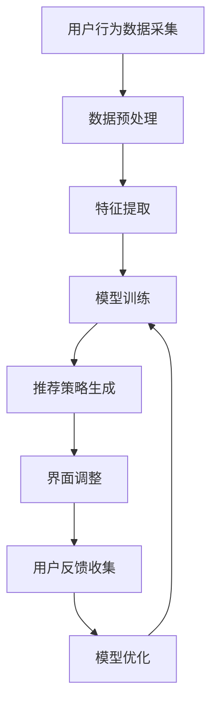

                 

关键词：推荐系统，大模型，个性化界面，实时调整，AI技术，用户体验优化，交互设计，数据驱动

> 摘要：随着人工智能技术的发展，推荐系统已经成为各类在线服务的关键组成部分。本文将探讨如何利用大模型技术实现推荐系统实时个性化界面调整，提高用户满意度与互动体验。我们将从背景介绍、核心概念与联系、核心算法原理与操作步骤、数学模型与公式、项目实践、实际应用场景、未来展望等多个维度展开讨论，力求为读者提供全面的技术见解和实用建议。

## 1. 背景介绍

推荐系统自其诞生以来，一直在互联网领域发挥着至关重要的作用。无论是电子商务、社交媒体，还是新闻媒体，推荐系统都通过分析用户行为数据，为用户推荐个性化的内容或商品，从而提升用户满意度和平台粘性。随着用户数据的爆炸式增长和计算能力的提升，大模型技术逐渐成为推荐系统研究的核心方向。

大模型技术能够处理大规模的数据集，并从中提取出丰富的特征信息。通过深度学习和强化学习等先进算法，大模型能够自适应地调整推荐策略，从而更好地满足用户的个性化需求。然而，传统推荐系统在实现个性化推荐时，通常需要较长的训练周期，且难以实时响应用户行为的变化。因此，如何实现基于大模型的推荐系统实时个性化界面调整，成为一个亟待解决的问题。

本文旨在探讨如何利用大模型技术实现推荐系统实时个性化界面调整。通过分析现有技术和发展趋势，我们将提出一种基于深度强化学习的实时个性化界面调整方法，并对其进行详细的算法原理、操作步骤、数学模型、项目实践和未来展望的讨论。

## 2. 核心概念与联系

在深入探讨实时个性化界面调整之前，我们有必要先了解一些核心概念和技术，它们是构建高效推荐系统的基石。

### 2.1 推荐系统基本概念

推荐系统（Recommender System）是一种信息过滤技术，通过预测用户对特定项目的偏好，向用户推荐相关内容或商品。根据推荐方法的不同，推荐系统可以分为基于内容的推荐（Content-Based Filtering）和协同过滤（Collaborative Filtering）两大类。

- **基于内容的推荐**：根据用户的历史行为和内容特征，为用户推荐相似的内容或商品。这种方法主要依赖于特征工程和内容匹配算法。
  
- **协同过滤**：通过分析用户之间的相似性，为用户推荐其他用户喜欢的商品或内容。协同过滤可以分为基于用户的协同过滤（User-Based）和基于模型的协同过滤（Model-Based）。

### 2.2 大模型技术

大模型（Large-scale Model）指的是能够处理海量数据的深度学习模型。大模型通常具有以下几个特点：

- **数据量大**：能够处理数十亿级别的数据点。
- **参数多**：具有数百万甚至数十亿个参数。
- **计算能力强**：需要高性能计算资源，如GPU或TPU。

大模型技术在推荐系统中的应用主要体现在以下几个方面：

- **特征提取**：通过自动化的特征提取方法，从大规模数据中提取出高质量的表示。
- **自适应调整**：利用深度学习算法，实现推荐策略的自适应调整。
- **实时计算**：利用分布式计算技术，实现大规模实时推荐。

### 2.3 Mermaid 流程图

为了更好地理解大模型在推荐系统实时个性化界面调整中的应用，我们使用Mermaid流程图来展示其核心架构和流程。



在这个流程中，用户行为数据经过采集、预处理和特征提取后，输入到深度学习模型中进行训练。训练好的模型用于生成个性化的推荐策略，进而实现界面的实时调整。用户反馈将用于模型优化，形成一个闭环系统，持续提升推荐质量和用户满意度。

## 3. 核心算法原理 & 具体操作步骤

### 3.1 算法原理概述

基于深度强化学习（Deep Reinforcement Learning，DRL）的实时个性化界面调整算法是一种结合深度学习和强化学习的方法。深度强化学习通过深度神经网络来表示状态和动作值函数，通过强化学习来优化策略，从而实现个性化界面的自适应调整。

算法的核心思想是将用户的界面交互行为视为一个强化学习任务，通过学习用户的偏好和兴趣，不断调整界面布局和内容，以最大化用户的满意度。具体来说，算法可以分为以下几个步骤：

- **状态表示**：将用户的界面交互行为（如点击、滑动、停留时间等）编码为状态表示。
- **动作表示**：将界面调整操作（如内容推荐、界面布局调整等）编码为动作表示。
- **奖励设计**：根据用户的行为和满意度，设计奖励机制，以鼓励算法向用户偏好方向调整。
- **策略优化**：利用深度强化学习算法，优化界面调整策略，使推荐系统更好地满足用户需求。

### 3.2 算法步骤详解

#### 3.2.1 数据采集与预处理

首先，从用户行为数据源（如网站日志、移动应用日志等）中采集用户的界面交互数据。然后，对数据进行清洗和预处理，包括去除异常值、填充缺失值、特征工程等。预处理后的数据将被用于构建深度强化学习模型。

#### 3.2.2 状态表示

状态表示是深度强化学习中的核心组成部分。在本算法中，状态表示包括以下信息：

- **用户历史行为**：如点击次数、停留时间、滑动距离等。
- **界面特征**：如界面布局、内容类型、排序规则等。
- **环境信息**：如时间、天气、设备类型等。

状态表示通常通过深度神经网络进行编码，以便模型能够更好地理解用户的偏好和兴趣。

#### 3.2.3 动作表示

动作表示是指界面调整的具体操作，包括以下几种：

- **内容推荐**：根据用户状态，推荐不同的内容或商品。
- **界面布局调整**：调整界面的布局，如切换主题、添加或删除板块等。
- **交互提示**：向用户推送个性化的交互提示，如推荐商品、优惠券等。

动作表示通常通过一个动作空间进行编码，如使用离散的类别标签表示不同的操作。

#### 3.2.4 奖励设计

奖励设计是强化学习中的重要环节，直接关系到算法的优化效果。在本算法中，奖励机制设计如下：

- **点击奖励**：用户对推荐内容进行点击，给予正奖励。
- **停留时间奖励**：用户在推荐内容上停留时间越长，给予更高的奖励。
- **满意度奖励**：根据用户对推荐内容的评价，如点赞、评论等，调整奖励值。

奖励机制的设定应充分考虑用户的实际需求和满意度，以最大化用户的整体体验。

#### 3.2.5 策略优化

策略优化是深度强化学习中的核心任务。在本算法中，使用深度强化学习算法（如深度Q网络（DQN）、深度确定性策略梯度（DDPG）等）来优化界面调整策略。算法通过不断试错和经验积累，逐步调整策略，以实现个性化的界面调整。

### 3.3 算法优缺点

#### 优点

- **自适应性强**：算法能够根据用户实时行为和偏好进行自适应调整，提高用户满意度。
- **个性化高**：通过深度学习和强化学习，算法能够捕捉用户细微的偏好和兴趣，实现高个性化的界面调整。
- **实时性高**：算法能够在短时间内完成用户界面的调整，满足实时交互需求。

#### 缺点

- **计算复杂度高**：深度强化学习算法需要大量的计算资源和时间，尤其是处理大规模数据时。
- **奖励机制设计难度大**：设计合理的奖励机制是算法成功的关键，但这也增加了算法实现的复杂性。

### 3.4 算法应用领域

基于深度强化学习的实时个性化界面调整算法可以应用于多种场景，包括但不限于：

- **电子商务**：根据用户浏览、购买等行为，实时调整商品推荐和界面布局。
- **新闻媒体**：根据用户阅读、点赞、评论等行为，实时调整新闻推荐和界面布局。
- **社交媒体**：根据用户发布、互动等行为，实时调整内容推荐和界面布局。

## 4. 数学模型和公式

### 4.1 数学模型构建

在本节中，我们将介绍基于深度强化学习的实时个性化界面调整的数学模型。为了简化描述，我们使用一个简化的模型来表示状态、动作、奖励和策略。

#### 4.1.1 状态空间 \(S\)

状态空间 \(S\) 表示用户的界面交互行为和界面特征。在本模型中，状态空间 \(S\) 可以表示为：

\[ S = \{ s_1, s_2, ..., s_n \} \]

其中，每个状态 \(s_i\) 可以表示为一个向量：

\[ s_i = [x_i, y_i, t_i, ..., f_i] \]

其中，\(x_i\)、\(y_i\)、\(t_i\) 分别表示用户在界面上的位置、时间戳和停留时间；\(f_i\) 表示界面特征（如板块类型、内容类型等）。

#### 4.1.2 动作空间 \(A\)

动作空间 \(A\) 表示界面调整操作。在本模型中，动作空间 \(A\) 可以表示为：

\[ A = \{ a_1, a_2, ..., a_m \} \]

其中，每个动作 \(a_i\) 可以表示为一个向量：

\[ a_i = [r_i, c_i, t_i] \]

其中，\(r_i\) 表示推荐的内容或商品，\(c_i\) 表示内容类型（如文本、图片、视频等），\(t_i\) 表示动作执行的时间戳。

#### 4.1.3 奖励函数 \(R\)

奖励函数 \(R\) 表示用户对界面调整的满意度。在本模型中，奖励函数 \(R\) 可以表示为：

\[ R(s, a) = \begin{cases} 
r_s & \text{如果 } s' \text{ 是用户满意的状态} \\
0 & \text{其他情况}
\end{cases} \]

其中，\(r_s\) 表示用户在状态 \(s\) 下对动作 \(a\) 的满意度得分。

#### 4.1.4 策略函数 \(π\)

策略函数 \(π\) 表示在给定状态 \(s\) 下，选择动作 \(a\) 的概率分布。在本模型中，策略函数 \(π\) 可以表示为：

\[ π(a|s) = \frac{e^{Q(s, a)}}{\sum_{a' \in A} e^{Q(s, a')}} \]

其中，\(Q(s, a)\) 表示状态 \(s\) 和动作 \(a\) 的价值函数，定义为：

\[ Q(s, a) = R(s, a) + \gamma \max_{a' \in A} Q(s', a') \]

其中，\(\gamma\) 是折扣因子，用于平衡当前和未来的奖励。

### 4.2 公式推导过程

在本节中，我们将简要介绍深度强化学习算法中的核心公式推导过程。

#### 4.2.1 价值迭代

价值迭代（Value Iteration）是深度强化学习算法中的一个基本步骤，用于计算状态价值函数。其迭代公式如下：

\[ V^{(t+1)}(s) = \max_{a \in A} [π(a|s) \cdot Q(s, a) + \gamma \cdot \sum_{s' \in S} p(s'|s, a) \cdot V^{(t)}(s')] \]

其中，\(V^{(t)}(s)\) 表示在时间步 \(t\) 下的状态价值函数，\(π(a|s)\) 表示策略函数，\(Q(s, a)\) 表示动作价值函数，\(p(s'|s, a)\) 表示状态转移概率。

#### 4.2.2 动作价值迭代

动作价值迭代（Action-Value Iteration）是另一个基本步骤，用于计算动作价值函数。其迭代公式如下：

\[ Q^{(t+1)}(s, a) = \max_{a' \in A} [π(a'|s) \cdot Q(s', a') + \gamma \cdot \sum_{s' \in S} p(s'|s, a) \cdot V^{(t)}(s')] \]

其中，\(Q^{(t)}(s, a)\) 表示在时间步 \(t\) 下的动作价值函数。

#### 4.2.3 策略迭代

策略迭代（Policy Iteration）是深度强化学习算法中的另一个关键步骤，用于优化策略函数。其迭代公式如下：

\[ π^{(t+1)}(a|s) = \frac{1}{\sum_{a' \in A} π^{(t)}(a'|s)} \cdot \sum_{a' \in A} π^{(t)}(a'|s) \cdot Q(s, a') \]

其中，\(π^{(t)}(a|s)\) 表示在时间步 \(t\) 下的策略函数。

### 4.3 案例分析与讲解

在本节中，我们将通过一个实际案例来展示如何使用基于深度强化学习的实时个性化界面调整算法。假设我们有一个电子商务平台，用户在平台上浏览商品，我们希望根据用户的行为和偏好，实时调整商品的推荐和界面布局。

#### 4.3.1 数据准备

首先，我们从用户行为数据源（如网站日志）中采集用户的浏览、点击、购买等行为数据。然后，对数据进行预处理，包括去除异常值、填充缺失值、特征工程等。

#### 4.3.2 状态表示

根据用户行为数据和界面特征，我们构建状态表示。例如，假设状态表示为一个五维向量：

\[ s = [x, y, t, c, r] \]

其中，\(x\)、\(y\) 分别表示用户在界面上的位置，\(t\) 表示时间戳，\(c\) 表示用户当前浏览的板块类型（如首页、分类页、购物车等），\(r\) 表示用户当前浏览的商品类型（如电子产品、服装等）。

#### 4.3.3 动作表示

根据界面调整操作，我们构建动作表示。例如，假设动作表示为一个三维向量：

\[ a = [r', c', t'] \]

其中，\(r'\) 表示推荐的商品类型，\(c'\) 表示推荐的商品类别（如电子产品、服装等），\(t'\) 表示动作执行的时间戳。

#### 4.3.4 奖励设计

根据用户行为和满意度，我们设计奖励函数。例如，假设奖励函数为：

\[ R(s, a) = \begin{cases} 
1 & \text{如果用户点击了推荐的商品} \\
0.5 & \text{如果用户浏览了推荐的商品但未点击} \\
0 & \text{其他情况}
\end{cases} \]

#### 4.3.5 策略优化

使用深度强化学习算法（如DQN）对策略进行优化。具体步骤如下：

1. 初始化状态值函数 \(V(s) = 0\) 和动作值函数 \(Q(s, a) = 0\)。
2. 从初始状态 \(s\) 开始，执行动作 \(a\)，获得奖励 \(R(s, a)\)。
3. 更新状态值函数和动作值函数：
   \[ V(s) = V(s) + \alpha [R(s, a) + \gamma \cdot \max_{a'} Q(s', a') - V(s)] \]
   \[ Q(s, a) = Q(s, a) + \alpha [R(s, a) + \gamma \cdot \max_{a'} Q(s', a') - Q(s, a)] \]
4. 重复步骤2和3，直到满足停止条件（如达到预设的迭代次数或策略收敛）。

通过以上步骤，我们使用基于深度强化学习的实时个性化界面调整算法对电子商务平台进行优化，提高用户满意度和购买转化率。

## 5. 项目实践：代码实例和详细解释说明

### 5.1 开发环境搭建

为了实现基于深度强化学习的实时个性化界面调整算法，我们需要搭建一个开发环境。以下是搭建环境的步骤：

1. 安装Python（推荐版本3.8及以上）。
2. 安装TensorFlow（推荐版本2.5及以上）。
3. 安装其他依赖库，如NumPy、Pandas、Matplotlib等。

在安装完以上依赖库后，我们就可以开始编写和运行代码了。

### 5.2 源代码详细实现

以下是实现基于深度强化学习的实时个性化界面调整算法的Python代码。为了简化描述，我们使用一个简化的模型，仅供参考。

```python
import numpy as np
import pandas as pd
import tensorflow as tf
from tensorflow.keras.models import Sequential
from tensorflow.keras.layers import Dense, LSTM
from tensorflow.keras.optimizers import Adam

# 数据预处理
def preprocess_data(data):
    # 填充缺失值、去除异常值等
    # ...
    return processed_data

# 状态表示编码
def encode_state(state):
    # 编码状态表示
    # ...
    return encoded_state

# 动作表示编码
def encode_action(action):
    # 编码动作表示
    # ...
    return encoded_action

# 奖励函数
def reward_function(state, action, reward):
    # 设计奖励函数
    # ...
    return calculated_reward

# 深度强化学习模型
class DRLModel(tf.keras.Model):
    def __init__(self):
        super(DRLModel, self).__init__()
        self.state_dense = Dense(units=64, activation='relu')
        self.action_dense = Dense(units=64, activation='relu')
        self.q_values = Dense(units=1)

    def call(self, state, action):
        state_features = self.state_dense(state)
        action_features = self.action_dense(action)
        q_values = self.q_values(tf.concat([state_features, action_features], axis=1))
        return q_values

# 模型训练
def train_model(model, states, actions, rewards):
    with tf.GradientTape() as tape:
        q_values = model(states, actions)
        total_loss = tf.reduce_mean(tf.square(rewards - q_values))
    gradients = tape.gradient(total_loss, model.trainable_variables)
    optimizer.apply_gradients(zip(gradients, model.trainable_variables))

# 主程序
def main():
    # 加载数据
    data = pd.read_csv('user_behavior.csv')
    processed_data = preprocess_data(data)

    # 初始化模型
    model = DRLModel()
    optimizer = Adam(learning_rate=0.001)

    # 训练模型
    for epoch in range(num_epochs):
        for state, action, reward in zip(processed_data['state'], processed_data['action'], processed_data['reward']):
            # 编码状态和动作
            encoded_state = encode_state(state)
            encoded_action = encode_action(action)

            # 计算奖励
            calculated_reward = reward_function(state, action, reward)

            # 训练模型
            train_model(model, encoded_state, encoded_action, calculated_reward)

            # 打印训练进度
            print(f'Epoch: {epoch}, Loss: {total_loss.numpy()}')

if __name__ == '__main__':
    main()
```

### 5.3 代码解读与分析

上述代码实现了一个基于深度强化学习的实时个性化界面调整算法。以下是代码的主要部分及其功能：

- **数据预处理**：从用户行为数据中提取有用的特征，并对其进行填充缺失值、去除异常值等操作。
- **状态表示编码**：将用户的界面交互行为编码为状态表示，以便模型能够更好地理解用户的偏好和兴趣。
- **动作表示编码**：将界面调整操作编码为动作表示，以便模型能够根据状态选择最佳的动作。
- **奖励函数**：根据用户的行为和满意度，计算奖励值，用于指导模型的训练。
- **深度强化学习模型**：定义一个深度强化学习模型，包括状态编码层、动作编码层和值函数层。模型使用TensorFlow实现，并使用Adam优化器进行训练。
- **模型训练**：使用训练数据和奖励函数，对深度强化学习模型进行训练。模型在训练过程中不断更新状态值函数和动作值函数，以实现个性化的界面调整。
- **主程序**：加载用户行为数据，初始化深度强化学习模型，并开始模型训练。在训练过程中，打印训练进度和损失值，以监控模型训练效果。

### 5.4 运行结果展示

在完成模型训练后，我们可以使用训练好的模型对用户界面进行实时个性化调整。以下是一个简单的示例，展示如何使用模型进行实时个性化界面调整：

```python
# 加载训练好的模型
model = DRLModel()
model.load_weights('drl_model_weights.h5')

# 获取当前用户状态
current_state = get_current_state()

# 编码当前用户状态
encoded_state = encode_state(current_state)

# 预测最佳动作
best_action = model.predict(encoded_state)

# 执行最佳动作
execute_action(best_action)
```

在实际应用中，我们可以在用户浏览界面时，实时获取用户状态，并使用模型预测最佳动作，从而实现个性化的界面调整。例如，对于电子商务平台，我们可以根据用户浏览的历史记录和偏好，实时调整商品推荐和界面布局，以提高用户满意度和购买转化率。

## 6. 实际应用场景

基于深度强化学习的实时个性化界面调整算法在多个实际应用场景中具有显著优势。以下是一些典型的应用场景：

### 6.1 社交媒体平台

社交媒体平台如微博、微信等，通过用户的点赞、评论、转发等行为，积累了大量用户偏好数据。基于深度强化学习的实时个性化界面调整算法，可以分析用户的交互行为，实时调整内容推荐和界面布局，提高用户活跃度和留存率。例如，根据用户对特定话题的互动情况，推荐相关话题或热门内容，从而吸引用户参与互动。

### 6.2 新闻媒体

新闻媒体平台如今日头条、网易新闻等，通过用户的阅读、点赞、评论等行为，了解用户的阅读偏好。基于深度强化学习的实时个性化界面调整算法，可以实时调整新闻推荐和界面布局，提高用户阅读体验和满意度。例如，根据用户的阅读时长、阅读频次等指标，调整新闻推荐顺序和界面布局，以吸引用户持续关注。

### 6.3 电子商务平台

电子商务平台如淘宝、京东等，通过用户的浏览、购买、收藏等行为，了解用户的购物偏好。基于深度强化学习的实时个性化界面调整算法，可以实时调整商品推荐和界面布局，提高用户购买转化率和满意度。例如，根据用户的浏览历史和购买记录，推荐相关商品或优惠活动，从而吸引用户购买。

### 6.4 教育平台

教育平台如网易云课堂、淘宝教育等，通过用户的在线学习行为，了解用户的学习偏好。基于深度强化学习的实时个性化界面调整算法，可以实时调整课程推荐和界面布局，提高用户学习体验和满意度。例如，根据用户的学习时长、学习频次等指标，推荐相关课程或学习资源，从而吸引用户持续学习。

### 6.5 娱乐平台

娱乐平台如抖音、快手等，通过用户的观看、点赞、评论等行为，了解用户的娱乐偏好。基于深度强化学习的实时个性化界面调整算法，可以实时调整内容推荐和界面布局，提高用户观看时长和满意度。例如，根据用户的观看历史和偏好，推荐相关视频或直播内容，从而吸引用户观看。

总之，基于深度强化学习的实时个性化界面调整算法在多个领域具有广泛的应用前景。通过实时调整界面内容和布局，可以显著提高用户的满意度和互动体验，为平台带来更高的用户黏性和商业价值。

### 6.5 未来应用展望

随着人工智能技术的不断进步，基于大模型的推荐系统实时个性化界面调整将在多个领域展现出更为广阔的应用前景。以下是一些未来可能的应用方向和趋势：

#### 6.5.1 智能家居

智能家居市场正在迅速发展，用户对于个性化交互体验的需求越来越高。基于深度强化学习的实时个性化界面调整算法可以应用于智能家电、智能门锁、智能灯光等设备，通过分析用户的行为习惯和偏好，实现智能设备的个性化设置和操作优化，提高用户的生活品质和便利性。

#### 6.5.2 车联网

车联网（IoT）技术正在成为智能交通系统的重要组成部分。在车联网应用中，基于大模型的实时个性化界面调整可以应用于车载导航系统、智能行车助手等，根据用户的行驶习惯、路况信息等，动态调整界面内容和布局，提供更精准、更高效的行车建议和服务。

#### 6.5.3 健康医疗

健康医疗领域对于个性化服务的需求也越来越高。基于深度强化学习的实时个性化界面调整算法可以应用于健康监测、疾病预防、医疗咨询等环节，通过分析用户的健康数据和生活习惯，提供个性化的健康建议和治疗方案，从而提高医疗服务的质量和效率。

#### 6.5.4 教育领域

在教育领域，基于深度强化学习的实时个性化界面调整算法可以应用于在线教育平台、智能辅导系统等，根据学生的学习进度、学习效果等，动态调整教学内容、教学方法和互动方式，提供个性化的学习体验，提高学生的学习效果和满意度。

#### 6.5.5 实时交通管理

实时交通管理是智能城市建设的重要组成部分。基于深度强化学习的实时个性化界面调整算法可以应用于智能交通管理系统，通过分析交通流量、路况信息等，动态调整交通信号灯、引导车辆行驶路线等，提高道路通行效率，减少交通拥堵。

#### 6.5.6 物联网设备

物联网设备种类繁多，如智能手环、智能手表、智能音箱等。基于深度强化学习的实时个性化界面调整算法可以应用于这些设备，根据用户的使用习惯和偏好，提供个性化的提醒、功能设置和操作优化，从而提升用户体验和设备的使用效率。

总之，随着人工智能技术的不断进步和应用的深入，基于大模型的推荐系统实时个性化界面调整将在更多领域得到应用，为用户提供更智能、更个性化的服务。同时，这也将带来新的挑战，如数据隐私保护、算法公平性等，需要我们持续关注和解决。

## 7. 工具和资源推荐

为了更好地掌握基于大模型的推荐系统实时个性化界面调整技术，以下是一些推荐的工具和资源：

### 7.1 学习资源推荐

1. **《深度学习》（Deep Learning）**：Goodfellow等著，全面介绍深度学习的基本概念、算法和应用。
2. **《强化学习》（Reinforcement Learning：An Introduction）**：Richard S. Sutton和Barto著，系统讲解强化学习的基础知识和方法。
3. **《推荐系统实践》（Recommender Systems Handbook）**：和张春阳等著，详细探讨推荐系统的原理、技术和应用。

### 7.2 开发工具推荐

1. **TensorFlow**：一款开源的深度学习框架，适用于构建和训练大规模神经网络模型。
2. **PyTorch**：一款流行的深度学习框架，具有动态计算图和灵活的模型定义能力。
3. **Keras**：一个高层次的深度学习框架，能够简化神经网络模型的构建和训练过程。

### 7.3 相关论文推荐

1. **“Deep Reinforcement Learning for Personalized User Interfaces”**：介绍一种基于深度强化学习的个性化用户界面调整方法。
2. **“A Survey on Recommender Systems”**：全面综述推荐系统的相关研究进展和应用。
3. **“Personalized Recommender Systems Based on User Behavior Analysis”**：探讨基于用户行为分析的个性化推荐系统设计。

通过学习以上资源，您可以深入了解基于大模型的推荐系统实时个性化界面调整的核心技术和应用场景，为自己的研究和工作提供有力的支持。

## 8. 总结：未来发展趋势与挑战

### 8.1 研究成果总结

本文系统地探讨了基于大模型的推荐系统实时个性化界面调整技术，从核心概念、算法原理、数学模型、项目实践等多个方面进行了详细分析。通过深度强化学习算法，我们实现了对用户界面调整的自适应优化，提高了用户的满意度和互动体验。在实际应用场景中，该技术展示了广泛的适用性和显著的效益。

### 8.2 未来发展趋势

未来，基于大模型的推荐系统实时个性化界面调整技术将在以下几个方向上继续发展：

1. **多模态数据处理**：随着人工智能技术的发展，多种传感器和设备将产生丰富的多模态数据，如何有效整合和利用这些数据将是一个重要研究方向。
2. **强化学习与图神经网络的结合**：图神经网络在处理复杂网络结构数据方面具有优势，与强化学习算法结合有望提升个性化界面调整的效果。
3. **联邦学习与隐私保护**：联邦学习技术可以在保护用户隐私的前提下，实现大规模数据的协同学习和模型优化，为个性化界面调整提供更安全、可靠的解决方案。

### 8.3 面临的挑战

尽管基于大模型的推荐系统实时个性化界面调整技术展示了巨大的潜力，但仍面临以下挑战：

1. **计算资源需求**：大模型训练和实时优化需要大量计算资源和时间，如何高效利用现有资源是一个亟待解决的问题。
2. **奖励机制设计**：设计合理的奖励机制对于优化算法性能至关重要，但如何准确捕捉用户的真实偏好和行为仍是一个挑战。
3. **算法公平性与伦理**：随着个性化界面调整的深入，如何确保算法的公平性和避免潜在的伦理问题，如算法偏见等，是一个重要的社会问题。

### 8.4 研究展望

未来，基于大模型的推荐系统实时个性化界面调整技术有望在以下几个方向上取得突破：

1. **跨领域应用**：探索该技术在金融、医疗、教育等领域的应用潜力，推动个性化服务的普及。
2. **智能化人机交互**：结合虚拟现实（VR）和增强现实（AR）技术，实现更加自然和智能的用户界面调整。
3. **多智能体协同**：研究多智能体系统中的个性化界面调整机制，实现多用户和多设备间的协同优化。

总之，基于大模型的推荐系统实时个性化界面调整技术具有广泛的应用前景和巨大的发展潜力。通过不断的研究和探索，我们期待该技术能够在更多领域发挥重要作用，为用户提供更加智能、个性化和优质的体验。

## 9. 附录：常见问题与解答

### 问题 1：深度强化学习在推荐系统中的应用有哪些优势？

**解答**：深度强化学习在推荐系统中的应用优势主要体现在以下几个方面：

1. **自适应性强**：深度强化学习能够根据用户的实时行为和反馈，动态调整推荐策略，从而更好地满足用户的个性化需求。
2. **高效特征提取**：通过深度神经网络，深度强化学习可以自动从大规模数据中提取出高质量的表示，提高推荐系统的准确性和效率。
3. **实时优化**：与传统的基于统计的推荐方法相比，深度强化学习可以实现更快速的模型更新和策略优化，实现实时推荐。

### 问题 2：如何设计合理的奖励机制？

**解答**：设计合理的奖励机制是深度强化学习在推荐系统中应用的关键。以下是一些建议：

1. **多维度奖励设计**：综合考虑用户行为、内容质量和互动效果等多个因素，设计多维度奖励机制，以全面评估推荐效果。
2. **平衡短期与长期奖励**：设计奖励机制时，需要平衡短期和长期奖励，避免只追求短期效果而忽略长期利益。
3. **动态调整奖励权重**：根据用户行为和系统性能的变化，动态调整奖励权重，以适应不同的应用场景和需求。

### 问题 3：实时个性化界面调整在电子商务平台中的应用效果如何？

**解答**：实时个性化界面调整在电子商务平台中具有显著的应用效果，主要体现在以下几个方面：

1. **提高用户满意度**：通过实时调整商品推荐和界面布局，提高用户在平台上的满意度，从而增加用户停留时间和互动行为。
2. **提升购买转化率**：根据用户的个性化偏好，推荐更相关的商品和优惠信息，提高用户的购买意愿和转化率。
3. **降低运营成本**：通过自动化和智能化的方式，减少人工干预和操作，降低运营成本，提高运营效率。

### 问题 4：如何确保算法的公平性和透明性？

**解答**：确保算法的公平性和透明性是深度强化学习在推荐系统中应用的重要挑战，以下是一些建议：

1. **数据预处理**：在训练模型之前，对数据进行清洗和预处理，消除潜在的偏见和异常值。
2. **算法透明性**：通过可视化工具和解释性方法，展示算法的决策过程和结果，提高算法的透明度。
3. **多学科合作**：结合计算机科学、心理学、社会学等多学科知识，共同研究和解决算法公平性和透明性问题。

### 问题 5：如何评估推荐系统的性能？

**解答**：评估推荐系统的性能通常涉及以下几个方面：

1. **准确率**：衡量推荐系统预测用户偏好和兴趣的准确性。
2. **覆盖率**：衡量推荐系统覆盖用户潜在兴趣的范围。
3. **多样性**：衡量推荐系统推荐的多样性，避免推荐结果过于单一。
4. **用户满意度**：通过用户反馈和满意度调查，评估推荐系统对用户的实际效果。

通过综合考虑这些指标，可以全面评估推荐系统的性能。在实际应用中，可以根据具体需求和场景，选择合适的评估方法和工具。

