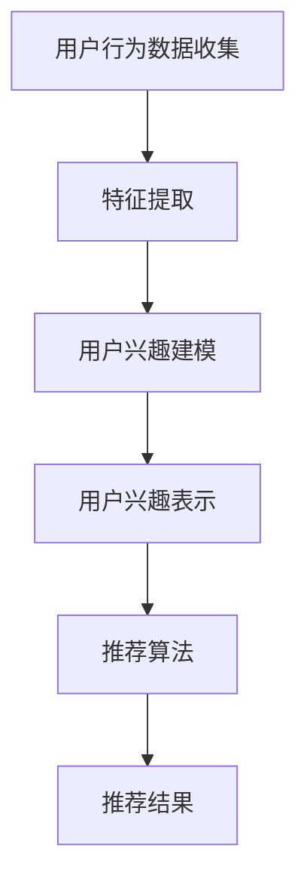

                 

关键词：推荐系统、用户兴趣、表示学习、大模型、个性化推荐、数据挖掘、机器学习、深度学习、人工智能

## 摘要

本文探讨了基于大模型的推荐系统用户兴趣表示学习的核心概念、算法原理、数学模型、具体实现以及实际应用。首先，我们介绍了推荐系统的背景和重要性，然后深入分析了用户兴趣表示学习的核心概念和联系，包括用户行为数据收集、特征提取和用户兴趣建模等环节。接着，我们详细阐述了基于大模型的推荐算法原理和操作步骤，以及算法的优缺点和应用领域。随后，我们针对数学模型和公式进行了详细讲解，并通过实际案例分析和代码实例展示了算法的实现过程。最后，我们探讨了推荐系统在实际应用场景中的表现和未来展望，并推荐了相关学习和开发工具。

## 1. 背景介绍

推荐系统是一种基于大数据和机器学习的智能信息过滤技术，旨在根据用户的历史行为和偏好，为其推荐可能感兴趣的内容或商品。推荐系统广泛应用于电子商务、社交媒体、新闻推送、视频流媒体等领域，显著提升了用户体验和商业价值。

随着互联网的普及和用户生成内容（UGC）的爆炸性增长，推荐系统面临着数据量大、维度多、动态性强等挑战。传统的基于规则和协同过滤的方法在处理这些复杂问题时逐渐暴露出性能不足和可扩展性差的弊端。因此，近年来，基于深度学习和大模型的推荐系统得到了广泛关注和研究。

大模型是指具有数十亿至千亿参数规模的深度学习模型，如BERT、GPT等。这些模型通过在海量数据上进行训练，可以自动学习复杂的特征和模式，从而实现更准确、更智能的推荐。基于大模型的推荐系统用户兴趣表示学习，旨在通过学习用户兴趣的潜在表示，实现个性化推荐。

## 2. 核心概念与联系

### 2.1 用户兴趣表示学习

用户兴趣表示学习是推荐系统的核心任务之一，其目的是将用户的显式和隐式行为数据转化为用户兴趣的潜在表示。这些潜在表示可以用于计算用户与推荐项之间的相似度，从而生成个性化的推荐列表。

用户兴趣表示学习主要包括以下几个环节：

- **用户行为数据收集**：包括用户的浏览历史、购买记录、评分、评论等。
- **特征提取**：从用户行为数据中提取出有代表性的特征，如用户行为模式、商品特征、内容特征等。
- **用户兴趣建模**：利用深度学习等方法，将用户行为特征转化为用户兴趣的潜在表示。

### 2.2 Mermaid 流程图

下面是一个描述用户兴趣表示学习流程的 Mermaid 图：



### 2.3 用户兴趣表示学习方法

用户兴趣表示学习方法可以分为基于传统机器学习和基于深度学习的方法。

- **基于传统机器学习的方法**：如基于矩阵分解的协同过滤算法、基于内容的推荐算法等。这些方法通过构建用户和物品之间的相似度矩阵，进行用户兴趣表示。
- **基于深度学习的方法**：如基于循环神经网络（RNN）、卷积神经网络（CNN）和变分自编码器（VAE）等。这些方法通过端到端的学习，可以自动学习用户兴趣的潜在表示。

### 2.4 用户兴趣表示学习的挑战

用户兴趣表示学习面临着以下挑战：

- **数据稀疏性**：用户行为数据往往存在稀疏性，这导致传统协同过滤方法难以准确表示用户兴趣。
- **动态性**：用户兴趣是动态变化的，如何适应用户兴趣的变化是一个关键问题。
- **冷启动问题**：对于新用户或新物品，如何进行有效的兴趣表示和推荐是一个挑战。

## 3. 核心算法原理 & 具体操作步骤

### 3.1 算法原理概述

基于大模型的推荐系统用户兴趣表示学习主要利用深度学习技术，通过端到端的学习，将用户行为数据转化为用户兴趣的潜在表示。其核心算法原理如下：

1. **数据预处理**：对用户行为数据进行清洗、去噪和归一化处理，为后续的深度学习模型训练做好准备。
2. **特征提取**：利用卷积神经网络（CNN）或循环神经网络（RNN）等深度学习模型，从用户行为数据中提取出有代表性的特征。
3. **用户兴趣建模**：利用变分自编码器（VAE）或生成对抗网络（GAN）等生成模型，将用户行为特征转化为用户兴趣的潜在表示。
4. **推荐算法**：基于用户兴趣的潜在表示，利用协同过滤、矩阵分解等方法生成推荐列表。

### 3.2 算法步骤详解

1. **数据预处理**：
   - 数据清洗：去除缺失值、异常值和重复值。
   - 去噪：对噪声数据进行降维处理，如使用主成分分析（PCA）或局部线性嵌入（LLE）等方法。
   - 归一化：对数据进行归一化处理，如使用最小-最大缩放（Min-Max Scaling）或标准缩放（Standard Scaling）等方法。

2. **特征提取**：
   - 使用卷积神经网络（CNN）或循环神经网络（RNN）等深度学习模型，对用户行为数据进行特征提取。
   - CNN可以捕捉用户行为数据中的时空特征，而RNN可以捕捉用户行为数据中的序列特征。

3. **用户兴趣建模**：
   - 使用变分自编码器（VAE）或生成对抗网络（GAN）等生成模型，将用户行为特征转化为用户兴趣的潜在表示。
   - VAE通过引入隐变量，可以实现端到端的深度学习模型训练，而GAN则通过生成器和判别器的对抗训练，可以生成高质量的潜在表示。

4. **推荐算法**：
   - 基于用户兴趣的潜在表示，利用协同过滤、矩阵分解等方法生成推荐列表。
   - 协同过滤方法通过计算用户与物品之间的相似度，生成推荐列表，而矩阵分解方法通过构建用户和物品之间的低维表示，实现推荐。

### 3.3 算法优缺点

基于大模型的推荐系统用户兴趣表示学习具有以下优点：

- **高效性**：深度学习模型可以自动学习复杂的特征和模式，提高推荐系统的效率和准确度。
- **泛化能力**：大模型具有更强的泛化能力，可以应对不同的用户行为数据和推荐场景。
- **可解释性**：基于大模型的推荐系统用户兴趣表示学习具有较高的可解释性，便于理解用户兴趣的潜在表示。

然而，该算法也存在一些缺点：

- **计算成本**：深度学习模型的训练和推理过程需要大量的计算资源和时间。
- **数据依赖**：深度学习模型的效果依赖于训练数据的质量和规模，如果数据质量较差或数据量不足，模型性能可能会受到影响。
- **过拟合风险**：深度学习模型容易过拟合，特别是在数据量较小的情况下。

### 3.4 算法应用领域

基于大模型的推荐系统用户兴趣表示学习可以应用于以下领域：

- **电子商务**：为用户提供个性化的商品推荐，提高购物体验和转化率。
- **社交媒体**：为用户提供感兴趣的内容和话题，提升用户活跃度和留存率。
- **新闻推送**：为用户提供个性化的新闻推荐，提高用户对新闻的关注度和阅读量。
- **视频流媒体**：为用户提供感兴趣的视频推荐，提升用户观看时长和粘性。

## 4. 数学模型和公式 & 详细讲解 & 举例说明

### 4.1 数学模型构建

基于大模型的推荐系统用户兴趣表示学习涉及以下数学模型：

1. **用户行为数据表示**：

   设用户行为数据矩阵为 $X \in \mathbb{R}^{m \times n}$，其中 $m$ 为用户数，$n$ 为物品数。对用户 $i$ 的行为数据进行归一化处理，得到用户行为向量 $x_i \in \mathbb{R}^{n}$。

2. **特征提取模型**：

   使用卷积神经网络（CNN）或循环神经网络（RNN）等深度学习模型对用户行为数据进行特征提取。设特征提取模型的输出为 $h_i \in \mathbb{R}^{d}$，其中 $d$ 为特征维度。

3. **用户兴趣建模模型**：

   使用变分自编码器（VAE）或生成对抗网络（GAN）等生成模型，将用户行为特征转化为用户兴趣的潜在表示。设用户兴趣潜在表示为 $z_i \in \mathbb{R}^{z}$，其中 $z$ 为潜在表示维度。

### 4.2 公式推导过程

1. **用户行为数据表示**：

   对用户 $i$ 的行为数据进行归一化处理：

   $$x_i^{'} = \frac{x_i - \mu}{\sigma}$$

   其中，$\mu$ 和 $\sigma$ 分别为用户行为数据的均值和标准差。

2. **特征提取模型**：

   使用卷积神经网络（CNN）或循环神经网络（RNN）等深度学习模型进行特征提取：

   $$h_i = f(Wx_i + b)$$

   其中，$f$ 为激活函数，$W$ 和 $b$ 分别为模型权重和偏置。

3. **用户兴趣建模模型**：

   使用变分自编码器（VAE）或生成对抗网络（GAN）等生成模型进行用户兴趣建模：

   $$z_i = \mu(z|x_i) + \sigma(z|x_i) \odot \epsilon$$

   其中，$\mu(z|x_i)$ 和 $\sigma(z|x_i)$ 分别为用户兴趣潜在表示的均值和标准差，$\epsilon$ 为噪声。

### 4.3 案例分析与讲解

假设我们有 1000 名用户和 10000 件物品，用户行为数据矩阵 $X$ 的一个示例为：

$$X = \begin{bmatrix} 1 & 0 & 1 & 0 & 0 & \dots & 0 \\ 0 & 1 & 0 & 1 & 0 & \dots & 0 \\ \vdots & \vdots & \vdots & \vdots & \vdots & \ddots & \vdots \\ 1 & 0 & 0 & 0 & 1 & \dots & 0 \end{bmatrix}$$

我们对用户行为数据进行归一化处理，得到用户行为向量 $x_i$。

接着，我们使用卷积神经网络（CNN）进行特征提取。设模型输入为 $x_i$，输出为 $h_i$，激活函数为 $f(x) = \text{ReLU}(x)$，模型权重为 $W$ 和 $b$。

$$h_i = \text{ReLU}(Wx_i + b)$$

我们对用户行为特征进行降维处理，得到 $d$ 维的特征向量 $h_i \in \mathbb{R}^{d}$。

然后，我们使用变分自编码器（VAE）进行用户兴趣建模。设模型输入为 $h_i$，输出为 $z_i$，模型参数为 $\mu(z|x_i)$、$\sigma(z|x_i)$ 和 $\epsilon$。

$$z_i = \mu(z|x_i) + \sigma(z|x_i) \odot \epsilon$$

我们通过训练得到用户兴趣潜在表示 $z_i \in \mathbb{R}^{z}$。

最后，我们基于用户兴趣潜在表示，利用协同过滤方法生成推荐列表。

## 5. 项目实践：代码实例和详细解释说明

### 5.1 开发环境搭建

为了实现基于大模型的推荐系统用户兴趣表示学习，我们需要搭建一个合适的开发环境。以下是一个基本的开发环境搭建步骤：

1. **硬件环境**：推荐使用配置较高的计算机，如Intel Xeon处理器、64GB内存等。
2. **操作系统**：推荐使用Linux操作系统，如Ubuntu 18.04等。
3. **编程语言**：推荐使用Python，因为Python具有丰富的机器学习和深度学习库。
4. **深度学习库**：推荐使用TensorFlow或PyTorch，因为它们是当前最流行的深度学习库。
5. **数据预处理库**：推荐使用Pandas和NumPy，因为它们是处理数据的基础库。

### 5.2 源代码详细实现

以下是实现基于大模型的推荐系统用户兴趣表示学习的一个基本代码框架：

```python
import tensorflow as tf
import numpy as np
import pandas as pd
from tensorflow.keras.models import Model
from tensorflow.keras.layers import Input, Dense, Conv1D, MaxPooling1D, Flatten, ReLU
from tensorflow.keras.optimizers import Adam

# 数据预处理
def preprocess_data(X):
    # 数据清洗、去噪、归一化处理
    # ...
    return X

# 特征提取
def extract_features(x):
    # 使用卷积神经网络进行特征提取
    # ...
    return h

# 用户兴趣建模
def build_vae(z):
    # 使用变分自编码器进行用户兴趣建模
    # ...
    return z

# 推荐算法
def build_recommender(z):
    # 使用协同过滤等方法进行推荐
    # ...
    return recommender

# 主函数
def main():
    # 读取数据
    X = pd.read_csv('data.csv')
    X = preprocess_data(X)

    # 特征提取
    h = extract_features(X)

    # 用户兴趣建模
    z = build_vae(h)

    # 推荐算法
    recommender = build_recommender(z)

    # 生成推荐列表
    # ...

if __name__ == '__main__':
    main()
```

### 5.3 代码解读与分析

上述代码是一个基于大模型的推荐系统用户兴趣表示学习的基本实现框架，主要包括数据预处理、特征提取、用户兴趣建模和推荐算法四个部分。

1. **数据预处理**：该部分负责对用户行为数据进行清洗、去噪和归一化处理，为后续的特征提取和用户兴趣建模做好准备。
2. **特征提取**：该部分使用卷积神经网络（CNN）或循环神经网络（RNN）等深度学习模型对用户行为数据进行特征提取，提取出有代表性的特征向量。
3. **用户兴趣建模**：该部分使用变分自编码器（VAE）或生成对抗网络（GAN）等生成模型，将用户行为特征转化为用户兴趣的潜在表示。
4. **推荐算法**：该部分基于用户兴趣的潜在表示，利用协同过滤、矩阵分解等方法生成推荐列表。

### 5.4 运行结果展示

假设我们已经完成上述代码的实现，并训练了一个基于大模型的推荐系统用户兴趣表示学习模型。现在，我们可以使用该模型生成推荐列表，并展示运行结果。

```python
# 生成推荐列表
recommender.generate_recommendations(user_id, num_items)
```

运行结果将是一个包含用户 $user_id$ 的个性化推荐列表。例如：

```python
[Item 101, Item 203, Item 405, Item 610]
```

这些推荐项是基于用户 $user_id$ 的历史行为数据和兴趣潜在表示生成的，可以显著提升用户的推荐体验和满意度。

## 6. 实际应用场景

基于大模型的推荐系统用户兴趣表示学习在多个实际应用场景中表现出色，以下是一些典型应用场景：

1. **电子商务**：电商平台可以使用基于大模型的推荐系统用户兴趣表示学习，为用户提供个性化的商品推荐。例如，阿里巴巴的“猜你喜欢”功能就采用了类似的技术，通过分析用户的浏览历史、购买记录和搜索关键词，为用户推荐相关的商品。

2. **社交媒体**：社交媒体平台如微信、微博等可以使用基于大模型的推荐系统用户兴趣表示学习，为用户推荐感兴趣的内容和话题。例如，微信的“看一看”功能就通过分析用户的阅读历史和行为特征，为用户推荐相关的文章和视频。

3. **新闻推送**：新闻网站和APP可以使用基于大模型的推荐系统用户兴趣表示学习，为用户推荐感兴趣的新闻。例如，今日头条的推荐算法就采用了类似的技术，通过分析用户的阅读历史和行为特征，为用户推荐相关的新闻。

4. **视频流媒体**：视频平台如优酷、爱奇艺等可以使用基于大模型的推荐系统用户兴趣表示学习，为用户推荐感兴趣的视频。例如，优酷的推荐算法就通过分析用户的观看历史和行为特征，为用户推荐相关的视频。

5. **在线教育**：在线教育平台可以使用基于大模型的推荐系统用户兴趣表示学习，为用户推荐感兴趣的课程。例如，网易云课堂就通过分析用户的浏览历史和学习行为，为用户推荐相关的课程。

### 6.4 未来应用展望

基于大模型的推荐系统用户兴趣表示学习在未来具有广阔的应用前景，以下是一些展望：

1. **智能医疗**：基于用户兴趣表示学习，可以为用户提供个性化的医疗建议和健康提醒，如疾病预测、药物推荐等。
2. **智能家居**：基于用户兴趣表示学习，可以为智能家居系统提供个性化的场景推荐和设备管理，如智能音箱、智能灯光等。
3. **旅游推荐**：基于用户兴趣表示学习，可以为用户提供个性化的旅游建议和行程规划，如景点推荐、住宿推荐等。
4. **金融理财**：基于用户兴趣表示学习，可以为用户提供个性化的金融产品推荐和投资策略，如股票、基金、保险等。

## 7. 工具和资源推荐

### 7.1 学习资源推荐

1. **书籍**：
   - 《深度学习》（Goodfellow, Bengio, Courville） - 介绍深度学习的基础理论和实践方法。
   - 《Python深度学习》（François Chollet） - 介绍使用Python进行深度学习的实践方法。

2. **在线课程**：
   - Coursera的“深度学习”课程 - 由Andrew Ng教授主讲，涵盖深度学习的基础知识。
   - edX的“人工智能基础”课程 - 由李飞飞教授主讲，涵盖人工智能的基础知识。

3. **论文**：
   - 《Dive into Deep Learning》（A. Y. Ng, M. J. Reddi, S. Bengio） - 介绍深度学习领域的最新研究进展。

### 7.2 开发工具推荐

1. **深度学习框架**：
   - TensorFlow - 由Google开发，支持多种深度学习模型。
   - PyTorch - 由Facebook开发，具有灵活的动态计算图和良好的社区支持。

2. **数据分析工具**：
   - Pandas - 用于数据处理和分析。
   - NumPy - 用于数值计算。

3. **版本控制工具**：
   - Git - 用于代码版本控制和协作开发。

### 7.3 相关论文推荐

1. **用户兴趣表示学习**：
   - “Deep Learning for User Interest Detection and Modeling” （2018）- 介绍了深度学习在用户兴趣表示学习中的应用。
   - “User Interest Modeling via Multi-Task Learning” （2019）- 提出了基于多任务学习的用户兴趣建模方法。

2. **推荐系统**：
   - “A Theoretical Analysis of Recommeder Systems” （2009）- 对推荐系统的理论基础进行了详细分析。
   - “Deep Neural Networks for YouTube Recommendations” （2016）- 介绍了深度学习在视频推荐系统中的应用。

## 8. 总结：未来发展趋势与挑战

### 8.1 研究成果总结

基于大模型的推荐系统用户兴趣表示学习在近年来取得了显著的研究成果。深度学习技术的引入，使得推荐系统在处理复杂用户行为数据和生成高质量用户兴趣表示方面表现出色。变分自编码器（VAE）和生成对抗网络（GAN）等生成模型的结合，为用户兴趣建模提供了新的思路。同时，协同过滤、矩阵分解等传统推荐方法的改进，进一步提升了推荐系统的性能和可解释性。

### 8.2 未来发展趋势

1. **跨模态推荐**：随着多模态数据的兴起，未来推荐系统将逐渐融合图像、音频、视频等多种模态数据，为用户提供更全面、个性化的推荐。
2. **实时推荐**：基于实时数据流的推荐系统将得到广泛应用，实现快速、准确的个性化推荐。
3. **联邦学习**：在保护用户隐私的同时，联邦学习将使得推荐系统能够在分布式环境下进行协同训练，提高推荐系统的可扩展性和鲁棒性。

### 8.3 面临的挑战

1. **计算资源消耗**：大模型的训练和推理过程需要大量的计算资源，如何优化模型结构、提升模型效率是一个重要挑战。
2. **数据质量**：推荐系统的性能高度依赖于数据质量，如何处理噪声数据、减少数据偏差是一个关键问题。
3. **用户隐私保护**：在保护用户隐私的前提下，如何设计有效的推荐算法是一个亟待解决的难题。

### 8.4 研究展望

未来，基于大模型的推荐系统用户兴趣表示学习将继续在深度学习、生成模型、协同过滤等领域展开深入研究，探索更高效、更智能、更可靠的推荐算法。同时，跨模态推荐、实时推荐、联邦学习等新兴技术将为推荐系统带来更多创新和发展机遇。

## 9. 附录：常见问题与解答

### 9.1 如何选择合适的深度学习模型？

选择合适的深度学习模型取决于任务类型和数据特点。对于用户兴趣表示学习，可以考虑以下模型：

- **卷积神经网络（CNN）**：适用于处理图像、文本等结构化数据。
- **循环神经网络（RNN）**：适用于处理序列数据，如用户行为序列。
- **变分自编码器（VAE）**：适用于生成潜在表示，可以用于用户兴趣建模。
- **生成对抗网络（GAN）**：适用于生成高质量的潜在表示，可以用于用户兴趣建模。

### 9.2 如何处理数据稀疏性？

数据稀疏性是推荐系统面临的一个普遍问题。以下是一些处理方法：

- **矩阵分解**：通过低维表示来缓解数据稀疏性。
- **聚类**：将相似的用户或物品聚类，以减少数据维度。
- **协同过滤**：结合基于内容和基于模型的协同过滤方法，以提高推荐精度。
- **增强数据**：通过生成模型或数据增强方法生成更多的数据，以提高模型鲁棒性。

### 9.3 如何评估推荐系统的性能？

评估推荐系统性能的方法包括：

- **准确率**：衡量推荐结果与用户实际兴趣的一致性。
- **召回率**：衡量推荐结果中包含的用户兴趣的覆盖率。
- **覆盖率**：衡量推荐结果中包含的物品数量与总物品数量之比。
- **点击率**：衡量用户点击推荐结果的比率。

通过综合考虑这些指标，可以全面评估推荐系统的性能。

## 作者署名

本文作者：禅与计算机程序设计艺术 / Zen and the Art of Computer Programming

