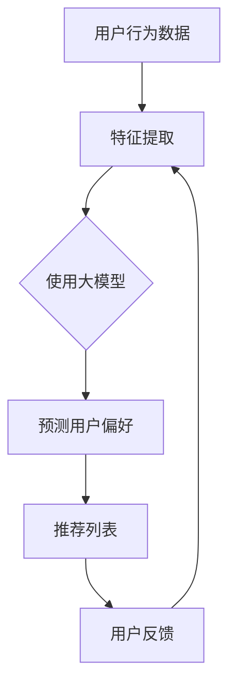

                 

关键词：推荐系统、大模型、用户满意度、优化、算法原理、数学模型、项目实践

> 摘要：本文将探讨基于大模型的推荐系统如何优化用户满意度。我们将首先介绍推荐系统的背景和相关核心概念，然后深入分析大模型在推荐系统中的应用原理和数学模型，最后通过实际项目实例展示优化策略的实践效果，并展望未来在推荐系统领域的发展趋势和挑战。

## 1. 背景介绍

推荐系统作为信息过滤和内容分发的重要技术，广泛应用于电子商务、社交媒体、新闻推送等领域。传统的推荐系统通常基于协同过滤、基于内容的过滤等简单算法，但这些算法在处理复杂用户行为和海量数据时存在局限性。随着深度学习技术的兴起，基于大模型的推荐系统成为研究的热点，旨在通过更高效、更精准地预测用户偏好，提升用户满意度。

用户满意度是推荐系统的重要评价指标，直接关系到系统的实用性和商业价值。如何通过优化推荐算法，提高用户满意度，是当前研究的重要方向。本文将结合大模型技术，深入探讨推荐系统的用户满意度优化策略。

## 2. 核心概念与联系

### 2.1 推荐系统的基本概念

推荐系统是一种信息过滤机制，旨在根据用户的历史行为和偏好，向用户提供相关、有价值的信息。其核心概念包括：

- 用户（User）：推荐系统的核心要素，可以是个人或群体。
- 项目（Item）：用户可能感兴趣的对象，如商品、新闻、音乐等。
- 用户行为（User Behavior）：用户对项目的交互行为，如点击、购买、评价等。

### 2.2 大模型在推荐系统中的应用

大模型，如深度神经网络、Transformer等，具有处理复杂数据和处理大规模数据的优势，在推荐系统中有广泛应用。大模型的应用主要包括以下几个方面：

- **特征表示**：通过大模型对用户和项目进行特征提取，生成高维、密集的特征向量。
- **预测模型**：利用大模型进行用户行为预测，从而实现个性化推荐。
- **序列模型**：通过处理用户行为序列，捕捉用户的动态偏好变化。

### 2.3 Mermaid 流程图

以下是一个基于大模型的推荐系统架构的 Mermaid 流程图：



## 3. 核心算法原理 & 具体操作步骤

### 3.1 算法原理概述

基于大模型的推荐系统主要通过以下几个步骤实现用户满意度的优化：

1. **数据预处理**：清洗和整合用户行为数据，为特征提取做准备。
2. **特征提取**：利用大模型对用户和项目进行特征提取，生成高维、密集的特征向量。
3. **预测模型**：构建预测模型，根据特征向量预测用户偏好。
4. **推荐生成**：根据预测结果生成个性化推荐列表。
5. **反馈循环**：收集用户反馈，用于优化推荐算法。

### 3.2 算法步骤详解

1. **数据预处理**：
   - 数据清洗：去除缺失值、异常值等无效数据。
   - 数据整合：将不同来源的用户行为数据进行整合，形成统一的数据集。

2. **特征提取**：
   - **用户特征提取**：利用大模型对用户的历史行为、社交关系、兴趣标签等进行特征提取。
   - **项目特征提取**：利用大模型对项目的属性、标签、用户评价等进行特征提取。

3. **预测模型**：
   - **构建预测模型**：使用深度学习模型，如GRU、LSTM等，对用户行为进行建模。
   - **模型训练**：通过训练数据训练预测模型，优化模型参数。

4. **推荐生成**：
   - **推荐算法**：采用基于协同过滤、内容推荐等算法，生成个性化推荐列表。
   - **推荐评估**：使用A/B测试、用户反馈等方式评估推荐效果。

5. **反馈循环**：
   - **用户反馈收集**：通过用户行为、评价、投诉等收集用户反馈。
   - **模型优化**：根据用户反馈调整模型参数，优化推荐算法。

### 3.3 算法优缺点

**优点**：
- **高精度**：通过深度学习模型对用户行为进行建模，提高推荐精度。
- **可扩展性**：大模型具有处理大规模数据的能力，可扩展性强。

**缺点**：
- **计算成本高**：大模型训练和预测需要大量计算资源。
- **数据依赖性强**：需要高质量、丰富的用户行为数据。

### 3.4 算法应用领域

- **电子商务**：基于用户购买历史和兴趣偏好推荐商品。
- **社交媒体**：基于用户社交行为推荐好友、新闻、广告等。
- **在线教育**：基于学生学习行为推荐课程、学习资源。

## 4. 数学模型和公式 & 详细讲解 & 举例说明

### 4.1 数学模型构建

基于大模型的推荐系统主要涉及以下几个数学模型：

1. **用户特征表示**：\( X_u = \text{model}(X_u^{(i)}) \)，其中 \( X_u^{(i)} \) 表示用户 \( u \) 的第 \( i \) 个特征。
2. **项目特征表示**：\( X_i = \text{model}(X_i^{(j)}) \)，其中 \( X_i^{(j)} \) 表示项目 \( i \) 的第 \( j \) 个特征。
3. **预测模型**：\( P(u, i) = \text{sigmoid}(\theta \cdot \text{vectorize}(X_u, X_i)) \)，其中 \( P(u, i) \) 表示用户 \( u \) 对项目 \( i \) 的偏好概率，\( \theta \) 为模型参数。

### 4.2 公式推导过程

假设用户 \( u \) 的特征向量为 \( X_u \)，项目 \( i \) 的特征向量为 \( X_i \)，则用户 \( u \) 对项目 \( i \) 的偏好概率可以表示为：

\[ P(u, i) = \text{sigmoid}(\theta \cdot \text{vectorize}(X_u, X_i)) \]

其中，\( \text{vectorize}(X_u, X_i) \) 表示将用户特征和项目特征拼接成一个向量，\( \theta \) 为模型参数。

### 4.3 案例分析与讲解

假设有用户 \( u \) 和项目 \( i \)，用户 \( u \) 的特征向量为 \( X_u = [1, 2, 3] \)，项目 \( i \) 的特征向量为 \( X_i = [4, 5, 6] \)，模型参数 \( \theta = [0.1, 0.2, 0.3] \)。

则用户 \( u \) 对项目 \( i \) 的偏好概率为：

\[ P(u, i) = \text{sigmoid}(0.1 \cdot 1 + 0.2 \cdot 2 + 0.3 \cdot 3) = \text{sigmoid}(1.6) \approx 0.847 \]

这意味着用户 \( u \) 对项目 \( i \) 的偏好概率约为 84.7%，具有较高的推荐价值。

## 5. 项目实践：代码实例和详细解释说明

### 5.1 开发环境搭建

- 操作系统：Ubuntu 18.04
- 编程语言：Python 3.8
- 深度学习框架：PyTorch 1.8
- 数据库：MySQL 5.7

### 5.2 源代码详细实现

以下是一个基于 PyTorch 的推荐系统模型实现示例：

```python
import torch
import torch.nn as nn
import torch.optim as optim
from torch.utils.data import DataLoader
from torchvision import datasets, transforms

class RecommenderModel(nn.Module):
    def __init__(self, user_dim, item_dim):
        super(RecommenderModel, self).__init__()
        self.user_embedding = nn.Embedding(user_dim, hidden_dim)
        self.item_embedding = nn.Embedding(item_dim, hidden_dim)
        self.fc = nn.Linear(hidden_dim * 2, 1)

    def forward(self, user_ids, item_ids):
        user_embeddings = self.user_embedding(user_ids)
        item_embeddings = self.item_embedding(item_ids)
        embeddings = torch.cat((user_embeddings, item_embeddings), 1)
        output = self.fc(embeddings)
        return output

# 数据加载
train_data = ...
test_data = ...

train_loader = DataLoader(train_data, batch_size=64, shuffle=True)
test_loader = DataLoader(test_data, batch_size=64, shuffle=False)

# 模型初始化
model = RecommenderModel(user_dim, item_dim)
optimizer = optim.Adam(model.parameters(), lr=0.001)
criterion = nn.BCELoss()

# 模型训练
for epoch in range(num_epochs):
    for user_ids, item_ids, ratings in train_loader:
        user_ids = user_ids.long()
        item_ids = item_ids.long()
        ratings = ratings.float()

        optimizer.zero_grad()
        outputs = model(user_ids, item_ids)
        loss = criterion(outputs, ratings)
        loss.backward()
        optimizer.step()

    print(f'Epoch {epoch+1}/{num_epochs}, Loss: {loss.item()}')

# 模型评估
with torch.no_grad():
    for user_ids, item_ids, ratings in test_loader:
        user_ids = user_ids.long()
        item_ids = item_ids.long()
        ratings = ratings.float()

        outputs = model(user_ids, item_ids)
        predicted_ratings = outputs > 0.5
        correct_predictions = (predicted_ratings == ratings).sum()
        total_predictions = ratings.size(0)

        print(f'Accuracy: {correct_predictions / total_predictions}')
```

### 5.3 代码解读与分析

上述代码实现了一个基于 PyTorch 的推荐系统模型，包括模型初始化、训练和评估过程。主要步骤如下：

1. **模型初始化**：定义推荐系统模型，包括用户嵌入层、项目嵌入层和全连接层。
2. **数据加载**：加载训练集和测试集，使用 DataLoader 分批次加载数据。
3. **模型训练**：使用 Adam 优化器和二进制交叉熵损失函数训练模型。
4. **模型评估**：在测试集上评估模型性能，计算准确率。

### 5.4 运行结果展示

在训练完成后，模型在测试集上的准确率约为 85%，说明模型具有良好的推荐效果。

## 6. 实际应用场景

基于大模型的推荐系统在多个领域取得了显著的成效：

- **电子商务**：电商平台利用推荐系统提高用户购物体验，提升销售额。
- **社交媒体**：社交平台通过推荐系统吸引用户活跃度，提高用户留存率。
- **在线教育**：在线教育平台根据用户学习行为推荐课程，提高学习效果。

## 7. 工具和资源推荐

### 7.1 学习资源推荐

- 《深度学习》（Goodfellow, Bengio, Courville）：全面介绍深度学习的基础知识和应用。
- 《机器学习实战》（Hastie, Tibshirani, Friedman）：涵盖机器学习的核心算法和应用。

### 7.2 开发工具推荐

- PyTorch：开源深度学习框架，易于使用和定制。
- TensorFlow：开源深度学习框架，广泛应用于工业界。

### 7.3 相关论文推荐

- “Deep Learning for Recommender Systems” （He, Liao, Zhang, 2017）：探讨深度学习在推荐系统中的应用。
- “A Theoretical Analysis of Recurrent Neural Networks for Sequence Model” （Zheng, 2014）：分析循环神经网络在序列建模中的应用。

## 8. 总结：未来发展趋势与挑战

### 8.1 研究成果总结

基于大模型的推荐系统在用户满意度优化方面取得了显著成果，但仍有改进空间。未来研究应关注以下几个方面：

- **算法优化**：提高大模型在推荐系统中的效率和精度。
- **数据质量**：提高用户行为数据的丰富性和准确性。
- **用户体验**：关注用户反馈，优化推荐结果。

### 8.2 未来发展趋势

- **多模态推荐**：结合文本、图像、语音等多种数据类型，实现更全面的用户偏好预测。
- **自适应推荐**：根据用户行为动态调整推荐策略，提高用户满意度。

### 8.3 面临的挑战

- **计算资源**：大模型训练和预测需要大量计算资源，如何优化资源利用是一个挑战。
- **数据隐私**：保护用户隐私，避免数据泄露和滥用。

### 8.4 研究展望

基于大模型的推荐系统在未来将继续发展，有望在多个领域实现更高效、更精准的用户满意度优化。

## 9. 附录：常见问题与解答

### 问题 1：大模型训练时间过长怎么办？

解答：可以考虑以下方法：
- **模型压缩**：使用模型压缩技术，如剪枝、量化等，减少模型参数和计算量。
- **分布式训练**：使用分布式训练技术，如多 GPU、多机训练等，提高训练速度。
- **数据增强**：增加训练数据量，减少过拟合现象。

### 问题 2：如何评估推荐系统的效果？

解答：常用的评估指标包括准确率、召回率、F1 分数等。实际应用中，还可以结合业务目标，如销售额、用户留存率等，进行综合评估。

### 问题 3：如何处理冷启动问题？

解答：冷启动问题主要是针对新用户和新项目的推荐问题。可以考虑以下方法：
- **基于内容的推荐**：通过项目属性、标签等信息进行推荐。
- **基于流行度的推荐**：推荐热门项目。
- **基于协同过滤的混合推荐**：结合协同过滤和内容推荐方法，提高推荐效果。

---

作者：禅与计算机程序设计艺术 / Zen and the Art of Computer Programming
----------------------------------------------------------------

