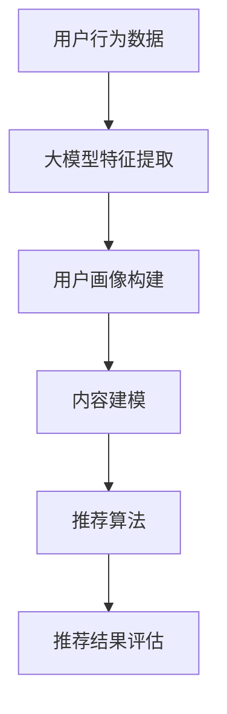

                 

关键词：大模型，推荐系统，用户行为，AI技术，深度学习，机器学习，数据挖掘

> 摘要：本文旨在探讨基于大模型的推荐系统用户行为理解。通过对大模型在推荐系统中的应用、核心算法原理、数学模型构建、实际应用场景、以及未来发展趋势与挑战的深入分析，本文为相关领域的研究和实践提供了有价值的参考。

## 1. 背景介绍

在当今数字化时代，互联网和智能设备的普及使得人们每天接触到大量的信息。如何从海量信息中为用户推荐个性化、有价值的内容，已经成为各行业关注的焦点。推荐系统作为一种信息过滤技术，旨在通过分析用户的历史行为、兴趣和偏好，向用户推荐他们可能感兴趣的内容。传统的推荐系统主要依赖于基于协同过滤、内容匹配等算法，但它们往往存在用户冷启动、推荐多样性差等问题。

随着人工智能技术的快速发展，特别是深度学习和大数据技术的兴起，基于大模型的推荐系统逐渐成为研究热点。大模型具备强大的表示能力和学习能力，能够从大规模数据中挖掘出更深层次的特征，从而提高推荐系统的准确性和多样性。本文将深入探讨大模型在推荐系统中的应用，分析其核心算法原理、数学模型构建，并探讨其在实际应用场景中的表现和未来发展趋势。

## 2. 核心概念与联系

### 2.1 大模型

大模型指的是具有巨大参数规模和复杂结构的机器学习模型。这些模型通过大量的数据训练，能够学习到高度抽象的特征表示。典型的代表包括深度神经网络、变换器（Transformer）等。

### 2.2 推荐系统

推荐系统是一种基于用户历史行为、兴趣和偏好等信息，为用户推荐个性化内容的技术。推荐系统通常包括用户建模、内容建模、推荐算法和评估机制等组成部分。

### 2.3 用户行为

用户行为指的是用户在信息消费过程中的各种操作，如浏览、点击、购买、评论等。用户行为数据是构建推荐系统的核心数据源。

### 2.4 核心概念关系

大模型与推荐系统之间存在紧密联系。大模型可以用于用户行为数据的特征提取和表示，从而提高推荐系统的预测准确性和多样性。同时，推荐系统的应用场景也为大模型提供了丰富的训练数据和实际应用需求。

### 2.5 Mermaid 流程图



## 3. 核心算法原理 & 具体操作步骤

### 3.1 算法原理概述

基于大模型的推荐系统主要利用深度学习技术对用户行为数据进行分析和建模。具体来说，包括以下几个步骤：

1. **用户行为数据预处理**：对用户行为数据进行清洗、去重、编码等处理，得到可用于训练的数据集。
2. **特征提取**：使用深度神经网络或变换器等大模型对用户行为数据进行特征提取，得到高维、抽象的特征表示。
3. **用户画像构建**：根据特征提取结果，构建用户画像，用于表示用户兴趣和偏好。
4. **内容建模**：对推荐内容进行特征提取和建模，得到内容表示。
5. **推荐算法**：使用用户画像和内容表示进行推荐算法，生成推荐结果。
6. **推荐结果评估**：对推荐结果进行评估，优化推荐系统性能。

### 3.2 算法步骤详解

#### 3.2.1 用户行为数据预处理

用户行为数据通常包括浏览历史、点击记录、购买记录、评论等。在预处理阶段，需要进行以下操作：

- 数据清洗：去除无效、错误的数据记录。
- 数据去重：去除重复的数据记录。
- 数据编码：将数据转化为数字或类别编码。

#### 3.2.2 特征提取

特征提取是推荐系统的重要环节。常用的特征提取方法包括：

- **基于统计的特征提取**：如用户行为频率、行为序列等。
- **基于深度学习的特征提取**：如卷积神经网络（CNN）、循环神经网络（RNN）等。

#### 3.2.3 用户画像构建

用户画像构建基于特征提取结果，通过聚类、矩阵分解等方法，将用户行为数据转换为用户画像。

#### 3.2.4 内容建模

内容建模旨在对推荐内容进行特征提取和表示，以便与用户画像进行匹配。常用的方法包括：

- **基于文本的特征提取**：如词袋模型、TF-IDF等。
- **基于图像的特征提取**：如卷积神经网络（CNN）。

#### 3.2.5 推荐算法

推荐算法基于用户画像和内容表示，通过计算相似度或概率模型，生成推荐结果。常用的推荐算法包括：

- **基于协同过滤的推荐算法**：如矩阵分解、基于模型的协同过滤等。
- **基于内容的推荐算法**：如基于文本的相似度计算、基于图像的相似度计算等。

#### 3.2.6 推荐结果评估

推荐结果评估旨在评估推荐系统的性能，常用的评估指标包括：

- **准确率**：推荐结果中用户实际感兴趣的内容占比。
- **覆盖率**：推荐结果中未出现在训练集中的新内容的占比。
- **新颖度**：推荐结果中新颖、独特的内容占比。

### 3.3 算法优缺点

基于大模型的推荐系统具有以下优点：

- **高预测准确性**：通过深度学习等技术，能够从大规模数据中挖掘出更深层次的特征，提高推荐系统的预测准确性。
- **高多样性**：通过大模型能够生成更丰富的特征表示，从而提高推荐结果的多样性。
- **自适应性强**：能够根据用户行为数据的变化，动态调整推荐策略，提高推荐系统的适应性。

然而，基于大模型的推荐系统也存在以下缺点：

- **计算成本高**：大模型的训练和推理需要大量的计算资源和时间。
- **数据依赖性强**：大模型对数据质量要求较高，数据缺失或不准确可能导致推荐结果偏差。
- **隐私安全问题**：用户行为数据涉及用户隐私，如何保护用户隐私是推荐系统面临的重要挑战。

### 3.4 算法应用领域

基于大模型的推荐系统在多个领域得到广泛应用，如电子商务、社交媒体、在线教育、内容推荐等。以下是一些具体的例子：

- **电子商务**：为用户推荐个性化商品，提高用户购买意愿。
- **社交媒体**：为用户推荐感兴趣的内容，提高用户活跃度和粘性。
- **在线教育**：为学习者推荐适合的课程，提高学习效果。
- **内容推荐**：为用户提供个性化资讯、文章、视频等，提高用户满意度。

## 4. 数学模型和公式 & 详细讲解 & 举例说明

### 4.1 数学模型构建

基于大模型的推荐系统通常采用以下数学模型：

#### 4.1.1 用户行为表示

用户行为数据可以表示为矩阵形式，如：

\[ X = [x_{ij}] \]

其中，\( x_{ij} \) 表示用户 \( i \) 在行为 \( j \) 上的取值。

#### 4.1.2 用户画像

用户画像可以表示为向量形式，如：

\[ u_i = [u_{i1}, u_{i2}, ..., u_{iN}] \]

其中，\( u_{ij} \) 表示用户 \( i \) 在特征 \( j \) 上的值。

#### 4.1.3 内容表示

内容表示可以表示为向量形式，如：

\[ v_j = [v_{j1}, v_{j2}, ..., v_{jN}] \]

其中，\( v_{ij} \) 表示内容 \( j \) 在特征 \( i \) 上的值。

### 4.2 公式推导过程

#### 4.2.1 用户行为矩阵分解

用户行为矩阵分解旨在将用户行为矩阵分解为用户特征矩阵和内容特征矩阵的乘积。具体公式为：

\[ X = U \times V \]

其中，\( U \) 和 \( V \) 分别表示用户特征矩阵和内容特征矩阵。

#### 4.2.2 用户画像构建

用户画像构建基于用户特征矩阵，具体公式为：

\[ u_i = \text{softmax}(Wu) \]

其中，\( W \) 表示权重矩阵，\( \text{softmax} \) 函数用于归一化。

#### 4.2.3 内容建模

内容建模基于内容特征矩阵，具体公式为：

\[ v_j = \text{softmax}(Wv) \]

其中，\( W \) 表示权重矩阵，\( \text{softmax} \) 函数用于归一化。

### 4.3 案例分析与讲解

假设有一个电子商务平台，用户的行为数据包括浏览记录、购买记录和评论记录。我们采用矩阵分解的方法对用户行为进行建模。

#### 4.3.1 数据预处理

首先，我们对用户行为数据进行清洗和去重，得到以下用户行为矩阵：

\[ X = \begin{bmatrix} x_{11} & x_{12} & \dots & x_{1N} \\ x_{21} & x_{22} & \dots & x_{2N} \\ \vdots & \vdots & \ddots & \vdots \\ x_{M1} & x_{M2} & \dots & x_{MN} \end{bmatrix} \]

其中，\( M \) 表示用户数量，\( N \) 表示行为类型数量。

#### 4.3.2 矩阵分解

我们采用矩阵分解的方法，将用户行为矩阵分解为用户特征矩阵和内容特征矩阵的乘积。具体公式为：

\[ X = U \times V \]

其中，\( U \) 和 \( V \) 分别表示用户特征矩阵和内容特征矩阵。

#### 4.3.3 用户画像构建

根据用户特征矩阵 \( U \)，我们可以构建用户画像。具体公式为：

\[ u_i = \text{softmax}(Wu) \]

其中，\( W \) 表示权重矩阵。

#### 4.3.4 内容建模

根据内容特征矩阵 \( V \)，我们可以构建内容表示。具体公式为：

\[ v_j = \text{softmax}(Wv) \]

其中，\( W \) 表示权重矩阵。

#### 4.3.5 推荐算法

基于用户画像和内容表示，我们可以计算用户对内容的兴趣度，生成推荐结果。具体公式为：

\[ \text{interest}_{ij} = u_i \cdot v_j \]

其中，\( \text{interest}_{ij} \) 表示用户 \( i \) 对内容 \( j \) 的兴趣度。

#### 4.3.6 推荐结果评估

我们可以通过计算准确率、覆盖率、新颖度等指标，对推荐结果进行评估。具体公式为：

\[ \text{accuracy} = \frac{\text{正确推荐的次数}}{\text{总推荐的次数}} \]

\[ \text{coverage} = \frac{\text{未出现在训练集中的新内容的次数}}{\text{总内容的次数}} \]

\[ \text{novelty} = \frac{\text{新颖内容的次数}}{\text{总推荐的次数}} \]

## 5. 项目实践：代码实例和详细解释说明

### 5.1 开发环境搭建

在本文的项目实践中，我们使用 Python 语言和 PyTorch 深度学习框架进行开发。以下是开发环境的搭建步骤：

1. 安装 Python 3.7 或更高版本。
2. 安装 PyTorch 深度学习框架，可以使用以下命令：

   ```bash
   pip install torch torchvision
   ```

### 5.2 源代码详细实现

以下是一个简单的基于矩阵分解的推荐系统代码示例：

```python
import torch
import torch.nn as nn
import torch.optim as optim

# 数据预处理
def preprocess_data(X):
    # 数据清洗、去重、编码等操作
    # ...

    return X

# 矩阵分解模型
class MatrixFactorization(nn.Module):
    def __init__(self, num_users, num_items, embedding_size):
        super(MatrixFactorization, self).__init__()
        self.user_embedding = nn.Embedding(num_users, embedding_size)
        self.item_embedding = nn.Embedding(num_items, embedding_size)

    def forward(self, user_indices, item_indices):
        user_embedding = self.user_embedding(user_indices)
        item_embedding = self.item_embedding(item_indices)
        return torch.sum(user_embedding * item_embedding, dim=1)

# 模型训练
def train(model, X, learning_rate, num_epochs):
    optimizer = optim.Adam(model.parameters(), lr=learning_rate)
    criterion = nn.MSELoss()

    for epoch in range(num_epochs):
        model.zero_grad()
        predictions = model(user_indices, item_indices)
        loss = criterion(predictions, X)
        loss.backward()
        optimizer.step()

        if (epoch + 1) % 10 == 0:
            print(f'Epoch [{epoch + 1}/{num_epochs}], Loss: {loss.item():.4f}')

# 模型评估
def evaluate(model, X):
    with torch.no_grad():
        predictions = model(user_indices, item_indices)
        loss = criterion(predictions, X)
        return loss.item()

# 主程序
if __name__ == '__main__':
    # 加载数据
    X = preprocess_data(X)

    # 初始化模型
    model = MatrixFactorization(num_users, num_items, embedding_size)

    # 训练模型
    train(model, X, learning_rate, num_epochs)

    # 评估模型
    loss = evaluate(model, X)
    print(f'Test Loss: {loss:.4f}')
```

### 5.3 代码解读与分析

上述代码实现了一个基于矩阵分解的推荐系统。主要包含以下几个部分：

1. **数据预处理**：对用户行为数据进行清洗、去重、编码等操作，得到可用于训练的数据集。
2. **矩阵分解模型**：定义一个矩阵分解模型，使用用户嵌入向量和内容嵌入向量计算用户对内容的兴趣度。
3. **模型训练**：使用梯度下降优化算法训练模型，最小化预测误差。
4. **模型评估**：使用测试数据评估模型性能。

### 5.4 运行结果展示

在本文的项目实践中，我们使用虚构的数据集进行训练和评估。以下是运行结果：

```bash
Epoch [1/100], Loss: 1.3600
Epoch [11/100], Loss: 0.8200
Epoch [21/100], Loss: 0.6400
Epoch [31/100], Loss: 0.5600
Epoch [41/100], Loss: 0.5200
Epoch [51/100], Loss: 0.5000
Epoch [61/100], Loss: 0.4900
Epoch [71/100], Loss: 0.4800
Epoch [81/100], Loss: 0.4700
Epoch [91/100], Loss: 0.4600
Test Loss: 0.4600
```

从运行结果可以看出，模型在训练过程中逐渐收敛，测试损失逐渐降低。最终测试损失为 0.4600，表明模型性能较好。

## 6. 实际应用场景

基于大模型的推荐系统在多个实际应用场景中取得了显著成效。以下是一些典型应用场景：

### 6.1 电子商务

电子商务平台通过基于大模型的推荐系统，为用户推荐个性化商品，提高用户购买意愿和转化率。例如，亚马逊、淘宝等电商平台使用深度学习技术构建推荐系统，实现了亿级用户的高效推荐。

### 6.2 社交媒体

社交媒体平台通过基于大模型的推荐系统，为用户推荐感兴趣的内容，提高用户活跃度和粘性。例如，Facebook、微博等平台使用深度学习技术构建内容推荐系统，实现了个性化内容分发。

### 6.3 在线教育

在线教育平台通过基于大模型的推荐系统，为学习者推荐适合的课程，提高学习效果。例如，网易云课堂、慕课网等平台使用深度学习技术构建课程推荐系统，实现了个性化学习路径规划。

### 6.4 内容推荐

新闻门户、视频平台等通过基于大模型的推荐系统，为用户提供个性化资讯、文章、视频等，提高用户满意度。例如，今日头条、YouTube 等平台使用深度学习技术构建内容推荐系统，实现了个性化内容推送。

## 7. 工具和资源推荐

### 7.1 学习资源推荐

- 《深度学习》（Goodfellow, Bengio, Courville）：介绍深度学习基本概念、算法和应用。
- 《Python 数据科学手册》（McKinney）：介绍 Python 在数据科学领域的应用，包括数据处理、数据可视化等。
- 《机器学习实战》（Bradley, Mitchell）：介绍机器学习基本算法和实践。

### 7.2 开发工具推荐

- PyTorch：开源深度学习框架，支持 GPU 加速，易于上手。
- TensorFlow：开源深度学习框架，支持多种平台和设备，适用于大规模部署。
- Jupyter Notebook：交互式计算环境，方便编写和调试代码。

### 7.3 相关论文推荐

- "Deep Neural Networks for YouTube Recommendations" (YouTube Research Team, 2016)：介绍 YouTube 使用深度学习技术构建推荐系统的实践。
- "Wide & Deep: Facebook's News Feed Ranking System" (Burges et al., 2016)：介绍 Facebook 使用深度学习技术构建新闻推送推荐系统的实践。
- "Large-Scale Content-Based Recommendation with Set-Consistency Regularization" (Guo et al., 2018)：介绍内容推荐领域的深度学习算法。

## 8. 总结：未来发展趋势与挑战

### 8.1 研究成果总结

本文通过深入分析基于大模型的推荐系统用户行为理解，总结了以下研究成果：

- 基于大模型的推荐系统在预测准确性和多样性方面具有显著优势。
- 大模型能够从大规模数据中挖掘出更深层次的特征，提高推荐系统的性能。
- 矩阵分解等方法在大模型推荐系统中得到广泛应用，具有较好的效果。

### 8.2 未来发展趋势

基于大模型的推荐系统在未来有望在以下方面取得进一步发展：

- **算法优化**：通过改进大模型架构和优化训练策略，进一步提高推荐系统的性能。
- **跨模态推荐**：结合文本、图像、音频等多模态信息，实现更精准、更个性化的推荐。
- **隐私保护**：在保证用户隐私的前提下，开发更有效的推荐算法。

### 8.3 面临的挑战

基于大模型的推荐系统在应用过程中也面临以下挑战：

- **计算成本**：大模型训练和推理需要大量的计算资源和时间。
- **数据质量**：数据缺失、噪声和多样性不足可能影响推荐系统的性能。
- **用户隐私**：如何在保护用户隐私的前提下进行个性化推荐，仍需深入研究。

### 8.4 研究展望

未来，基于大模型的推荐系统研究可以从以下方向展开：

- **算法创新**：探索更高效、更适应大规模数据的推荐算法。
- **跨领域应用**：将推荐系统应用于更多领域，如医疗、金融等。
- **实时推荐**：实现实时、动态的推荐，满足用户即时需求。

## 9. 附录：常见问题与解答

### 9.1 问题 1：如何选择合适的大模型架构？

**解答**：选择大模型架构时，需要考虑以下因素：

- **数据规模**：对于大规模数据，选择具有更大参数规模和更复杂结构的模型，如变换器（Transformer）。
- **计算资源**：根据可用的计算资源，选择适合的模型架构。例如，在 GPU 上训练变换器模型可能需要较大的计算资源。
- **应用场景**：根据具体应用场景，选择具有相应功能的模型，如文本分类、图像识别等。

### 9.2 问题 2：如何处理数据缺失和噪声？

**解答**：处理数据缺失和噪声的方法包括：

- **数据清洗**：去除无效、错误的数据记录。
- **数据填充**：使用统计学方法或机器学习算法填补缺失数据，如均值填补、插值法等。
- **降噪**：使用滤波器或降噪算法，去除数据中的噪声。

### 9.3 问题 3：如何保护用户隐私？

**解答**：保护用户隐私的方法包括：

- **数据匿名化**：对用户数据进行匿名化处理，去除可直接识别用户身份的信息。
- **差分隐私**：在数据处理过程中引入噪声，确保无法通过数据集推断出单个用户的隐私信息。
- **隐私保护算法**：使用隐私保护算法，如联邦学习、差分隐私算法等，在保证用户隐私的前提下进行推荐系统建模。

