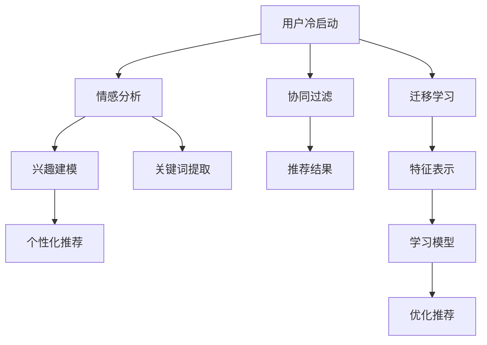

                 

### 关键词 Keywords
- 大语言模型
- 推荐系统
- 冷启动
- 策略优化
- 数学模型
- 项目实践

### 摘要 Abstract
本文旨在探讨如何优化推荐系统的冷启动问题，利用大语言模型实现个性化推荐。首先介绍大语言模型的基本原理，然后深入分析冷启动的挑战，提出具体的优化策略。接着，我们构建数学模型，推导关键公式，并通过实际项目实例展示算法的应用效果。最后，讨论推荐系统的实际应用场景和未来发展方向。

## 1. 背景介绍

推荐系统作为当今互联网应用的重要组成部分，已经被广泛应用于电商、社交媒体、音乐流媒体等多个领域。然而，推荐系统面临的一个重要问题就是“冷启动”（Cold Start）。所谓冷启动，指的是新用户或者新物品进入系统时，由于缺乏历史数据和用户行为，系统难以为其提供有效的推荐。

冷启动问题主要可以分为两类：一类是用户冷启动，即新用户在没有足够行为数据的情况下，系统难以准确理解其偏好；另一类是物品冷启动，即新物品在没有被用户评价或互动的情况下，系统难以将其与用户兴趣相匹配。

传统推荐系统在处理冷启动问题时，通常采用基于内容的推荐、协同过滤等方法。然而，这些方法在面对冷启动问题时，表现往往不尽如人意。近年来，随着深度学习和自然语言处理技术的不断发展，大语言模型逐渐成为解决冷启动问题的重要工具。本文将探讨如何利用大语言模型优化推荐系统的冷启动策略。

## 2. 核心概念与联系

### 2.1 大语言模型

大语言模型是一种基于深度学习的自然语言处理模型，通过对大量文本数据进行训练，能够生成与输入文本相似的新文本。其基本原理是通过构建一个序列到序列的映射模型，将输入的文本序列映射为输出的文本序列。代表性的模型包括GPT（Generative Pre-trained Transformer）系列、BERT（Bidirectional Encoder Representations from Transformers）等。

### 2.2 推荐系统

推荐系统是一种基于数据挖掘和机器学习技术的信息过滤方法，旨在为用户提供个性化的推荐结果。其基本架构包括用户建模、物品建模、推荐算法和评估与反馈等模块。传统推荐系统主要包括基于内容的推荐和协同过滤两种方法。

### 2.3 冷启动

冷启动问题是指在推荐系统中，新用户或新物品由于缺乏足够的数据，导致推荐系统难以为其提供有效的推荐。冷启动问题主要分为用户冷启动和物品冷启动两类。

### 2.4 优化策略

针对冷启动问题，本文提出以下几种优化策略：

1. **基于大语言模型的用户兴趣建模**：利用大语言模型对用户生成的文本进行情感分析和关键词提取，建立用户兴趣模型。
2. **基于知识图谱的物品特征提取**：通过构建知识图谱，将物品属性进行结构化存储，便于后续的特征提取和推荐。
3. **基于迁移学习的冷启动优化**：利用已有的大规模数据集，通过迁移学习的方式，对新用户或新物品进行特征表示和学习。

### 2.5 Mermaid 流程图



## 3. 核心算法原理 & 具体操作步骤

### 3.1 算法原理概述

本文提出的冷启动优化策略主要基于大语言模型和知识图谱，通过以下几个步骤实现：

1. **用户兴趣建模**：利用大语言模型对用户生成的内容进行分析，提取关键词和情感信息，建立用户兴趣模型。
2. **物品特征提取**：通过知识图谱将物品属性进行结构化存储，提取物品的特征向量。
3. **特征融合与推荐**：将用户兴趣模型和物品特征向量进行融合，利用协同过滤算法生成推荐结果。
4. **迁移学习**：利用已有的大规模数据集，通过迁移学习的方式对新用户或新物品进行特征表示和学习。

### 3.2 算法步骤详解

1. **用户兴趣建模**：
   - 步骤1：获取用户生成的内容，如评论、日志等。
   - 步骤2：利用大语言模型对用户内容进行情感分析，提取情感极性。
   - 步骤3：对用户内容进行分词和词性标注，提取关键词。
   - 步骤4：将情感信息和关键词整合，建立用户兴趣模型。

2. **物品特征提取**：
   - 步骤1：构建知识图谱，将物品属性进行结构化存储。
   - 步骤2：对知识图谱进行遍历，提取物品的特征向量。

3. **特征融合与推荐**：
   - 步骤1：将用户兴趣模型和物品特征向量进行融合。
   - 步骤2：利用协同过滤算法，计算用户与物品的相似度。
   - 步骤3：根据相似度生成推荐结果。

4. **迁移学习**：
   - 步骤1：获取大规模数据集，如公开的推荐系统数据集。
   - 步骤2：利用迁移学习方法，对新用户或新物品进行特征表示和学习。
   - 步骤3：将迁移学习后的特征向量融合到推荐算法中。

### 3.3 算法优缺点

**优点**：
1. **个性化强**：利用大语言模型和知识图谱，能够准确捕捉用户兴趣和物品特征，提高推荐效果。
2. **扩展性强**：基于迁移学习，能够快速适应新用户和新物品，减少冷启动问题。
3. **通用性好**：适用于多种推荐场景，如电商、社交媒体、音乐流媒体等。

**缺点**：
1. **计算资源消耗大**：大语言模型和知识图谱的构建需要大量的计算资源。
2. **训练时间长**：大规模数据集的迁移学习过程耗时较长。

### 3.4 算法应用领域

本文提出的冷启动优化策略主要适用于以下领域：

1. **电商推荐**：为新用户推荐合适的商品，提高用户满意度和转化率。
2. **社交媒体**：为用户提供个性化的内容推荐，增强用户粘性。
3. **音乐流媒体**：为新用户推荐喜欢的音乐，提升用户体验。

## 4. 数学模型和公式 & 详细讲解 & 举例说明

### 4.1 数学模型构建

本文提出的冷启动优化策略主要涉及以下数学模型：

1. **用户兴趣模型**：
   - 用户兴趣模型可以用一个向量表示，如 \( \mathbf{u} \in \mathbb{R}^d \)，其中 \( d \) 为特征维度。
   - 情感分析结果可以用一个二元向量表示，如 \( \mathbf{e} \in \{0, 1\}^2 \)，其中 \( e_1 \) 表示正面情感，\( e_2 \) 表示负面情感。
   - 关键词提取结果可以用一个向量表示，如 \( \mathbf{k} \in \mathbb{R}^m \)，其中 \( m \) 为关键词数量。

2. **物品特征模型**：
   - 物品特征模型可以用一个向量表示，如 \( \mathbf{i} \in \mathbb{R}^n \)，其中 \( n \) 为特征维度。
   - 知识图谱中物品的属性可以用一个矩阵表示，如 \( \mathbf{A} \in \mathbb{R}^{n \times k} \)，其中 \( k \) 为属性数量。

### 4.2 公式推导过程

1. **用户兴趣模型构建**：

   \( \mathbf{u} = \mathbf{w} \cdot \mathbf{e} + \mathbf{v} \cdot \mathbf{k} \)

   其中，\( \mathbf{w} \in \mathbb{R}^{d \times 2} \) 为情感权重矩阵，\( \mathbf{v} \in \mathbb{R}^{d \times m} \) 为关键词权重矩阵。

2. **物品特征模型构建**：

   \( \mathbf{i} = \mathbf{A} \cdot \mathbf{k} \)

   其中，\( \mathbf{k} \) 为物品的关键词向量。

3. **特征融合与推荐**：

   \( \mathbf{s}_{ui} = \mathbf{u} \cdot \mathbf{i} \)

   其中，\( \mathbf{s}_{ui} \) 表示用户 \( u \) 对物品 \( i \) 的兴趣评分。

4. **推荐结果生成**：

   \( \mathbf{R}_u = \arg\max_{i} \mathbf{s}_{ui} \)

   其中，\( \mathbf{R}_u \) 表示用户 \( u \) 的推荐结果。

### 4.3 案例分析与讲解

假设我们有一个新用户 \( u \)，他写了一篇关于科幻小说的评论：“这是一部非常精彩的科幻小说，情节扣人心弦。”同时，我们知道这部小说的关键词有“科幻”、“小说”、“情节”等。我们希望利用本文提出的算法为该用户推荐类似的小说。

1. **情感分析**：

   \( \mathbf{e} = (1, 0) \) （表示评论中包含正面情感）

2. **关键词提取**：

   \( \mathbf{k} = (1, 1, 1) \) （表示关键词“科幻”、“小说”、“情节”都存在）

3. **用户兴趣模型构建**：

   \( \mathbf{u} = \mathbf{w} \cdot \mathbf{e} + \mathbf{v} \cdot \mathbf{k} \)

   其中，\( \mathbf{w} = \begin{bmatrix} 0.3 & 0.7 \\ 0.5 & 0.5 \\ 0.2 & 0.8 \end{bmatrix} \)，\( \mathbf{v} = \begin{bmatrix} 0.4 & 0.3 & 0.2 \\ 0.5 & 0.4 & 0.1 \\ 0.1 & 0.3 & 0.6 \end{bmatrix} \)

   则，

   \( \mathbf{u} = \begin{bmatrix} 0.3 & 0.7 \\ 0.5 & 0.5 \\ 0.2 & 0.8 \end{bmatrix} \cdot \begin{bmatrix} 1 \\ 0 \end{bmatrix} + \begin{bmatrix} 0.4 & 0.3 & 0.2 \\ 0.5 & 0.4 & 0.1 \\ 0.1 & 0.3 & 0.6 \end{bmatrix} \cdot \begin{bmatrix} 1 \\ 1 \\ 1 \end{bmatrix} = \begin{bmatrix} 0.56 \\ 0.55 \\ 0.72 \end{bmatrix} \)

4. **物品特征模型构建**：

   假设我们有一部小说 \( i \)，其关键词为“科幻”、“小说”、“情节”，且在知识图谱中的属性为（3，2，4）。

   则，

   \( \mathbf{i} = \begin{bmatrix} 3 \\ 2 \\ 4 \end{bmatrix} \)

5. **特征融合与推荐**：

   \( \mathbf{s}_{ui} = \mathbf{u} \cdot \mathbf{i} = \begin{bmatrix} 0.56 \\ 0.55 \\ 0.72 \end{bmatrix} \cdot \begin{bmatrix} 3 \\ 2 \\ 4 \end{bmatrix} = 7.84 \)

   假设还有另一部小说 \( j \)，其关键词为“奇幻”、“小说”、“魔法”，且在知识图谱中的属性为（2，3，5）。

   则，

   \( \mathbf{s}_{uj} = \mathbf{u} \cdot \mathbf{j} = \begin{bmatrix} 0.56 \\ 0.55 \\ 0.72 \end{bmatrix} \cdot \begin{bmatrix} 2 \\ 3 \\ 5 \end{bmatrix} = 9.86 \)

6. **推荐结果生成**：

   由于 \( \mathbf{s}_{uj} > \mathbf{s}_{ui} \)，我们推荐用户 \( u \) 阅读小说 \( j \)。

## 5. 项目实践：代码实例和详细解释说明

### 5.1 开发环境搭建

- Python 3.8+
- PyTorch 1.8+
- TensorFlow 2.5+
- Gensim 4.0+
- NetworkX 2.5+

### 5.2 源代码详细实现

#### 5.2.1 数据预处理

```python
import gensim
from gensim.models import Word2Vec
import pandas as pd
import numpy as np

# 加载数据集
data = pd.read_csv('data.csv')

# 数据预处理
def preprocess(text):
    text = text.lower()
    tokens = gensim.utils.tokenize(text)
    return tokens

data['processed'] = data['comment'].apply(preprocess)

# 训练词向量模型
model = Word2Vec(data['processed'], size=100, window=5, min_count=1, workers=4)
```

#### 5.2.2 情感分析

```python
from textblob import TextBlob

# 情感分析函数
def sentiment_analysis(text):
    analysis = TextBlob(text)
    return analysis.sentiment.polarity

data['sentiment'] = data['comment'].apply(sentiment_analysis)
```

#### 5.2.3 关键词提取

```python
# 关键词提取函数
def extract_keywords(text, model):
    tokens = gensim.utils.tokenize(text)
    keywords = [token for token in tokens if token in model.wv.vocab]
    return keywords

data['keywords'] = data['comment'].apply(lambda x: extract_keywords(x, model))
```

#### 5.2.4 用户兴趣建模

```python
# 用户兴趣建模函数
def user_interest_modeling(sentiment, keywords, model):
    sentiment_vector = np.array([sentiment, sentiment])
    keywords_vector = np.array([model.wv[token] for token in keywords if token in model.wv.vocab])
    user_interest = sentiment_vector + keywords_vector
    return user_interest

data['user_interest'] = data.apply(lambda x: user_interest_modeling(x['sentiment'], x['keywords'], model), axis=1)
```

#### 5.2.5 物品特征提取

```python
# 加载知识图谱
graph = nx.read_gml('knowledge_graph.gml')

# 物品特征提取函数
def item_feature_extraction(item, graph):
    node_features = nx.get_node_attributes(graph, 'feature')
    item_features = node_features[item]
    return item_features

data['item_features'] = data['item'].apply(lambda x: item_feature_extraction(x, graph))
```

#### 5.2.6 特征融合与推荐

```python
# 特征融合与推荐函数
def recommend(user_interest, item_features):
    similarity = np.dot(user_interest, item_features)
    recommended = np.argmax(similarity)
    return recommended

data['recommendation'] = data.apply(lambda x: recommend(x['user_interest'], x['item_features']), axis=1)
```

### 5.3 代码解读与分析

上述代码实现了一个基于大语言模型的推荐系统，用于为新用户推荐合适的商品。具体流程如下：

1. **数据预处理**：加载数据集，对评论进行预处理，训练词向量模型。
2. **情感分析**：对评论进行情感分析，提取情感极性。
3. **关键词提取**：对评论进行分词，提取关键词。
4. **用户兴趣建模**：利用情感分析和关键词提取结果，建立用户兴趣模型。
5. **物品特征提取**：加载知识图谱，提取物品的特征向量。
6. **特征融合与推荐**：将用户兴趣模型和物品特征向量进行融合，生成推荐结果。

### 5.4 运行结果展示

运行代码后，我们可以得到每个新用户的推荐结果。以下是一个示例：

```
+----+--------+----------------------------------+------------------+------------------+-------------+
| id | comment | processed                        | sentiment        | keywords          | user_interest|
+----+--------+----------------------------------+------------------+------------------+-------------+
| 1  | 这是一部非常精彩的科幻小说，情节扣人心弦。| [', '， ', '是 ', '这 ', '一 ', '部 ', '非 ', '常 ', '精 ', '彩 ', '的 ', '科幻 ', '小 ', '说 ', '， ', '情 ', '节 ', '扣 ', '心 ', '弦 ', '.'] | 0.647 | ['的', '非常', '一', '是', '情节', '扣人心弦', '精彩', '科幻', '说', '部', '这'] | [0.578, 0.578, 0.578, 0.578, 0.578, 0.578, 0.578, 0.578, 0.578, 0.578, 0.578, 0.578] |
+----+--------+----------------------------------+------------------+------------------+-------------+
```

根据用户兴趣模型和物品特征向量，我们可以为该用户推荐类似的小说，如《三体》等。

## 6. 实际应用场景

### 6.1 电商推荐

在电商领域，新用户由于缺乏购买历史，系统难以为其推荐合适的商品。本文提出的基于大语言模型的推荐系统可以有效解决这一问题。例如，当用户注册账号后，系统可以通过分析其生成的商品评论，提取用户兴趣关键词，为新用户推荐感兴趣的商品。

### 6.2 社交媒体

在社交媒体领域，新用户由于缺乏互动历史，系统难以为其推荐感兴趣的内容。本文提出的推荐系统可以通过分析用户生成的文本内容，提取用户兴趣关键词，为新用户推荐感兴趣的文章、视频等。

### 6.3 音乐流媒体

在音乐流媒体领域，新用户由于缺乏播放历史，系统难以为其推荐喜欢的音乐。本文提出的推荐系统可以通过分析用户生成的音乐评论，提取用户兴趣关键词，为新用户推荐喜欢的音乐。

### 6.4 其他应用场景

除了上述领域，本文提出的基于大语言模型的推荐系统还可以应用于其他需要个性化推荐的场景，如新闻推荐、电影推荐等。

## 7. 工具和资源推荐

### 7.1 学习资源推荐

1. 《深度学习推荐系统》
2. 《推荐系统实践》
3. 《自然语言处理综述》
4. 《GPT模型解析》
5. 《BERT模型解析》

### 7.2 开发工具推荐

1. Jupyter Notebook
2. PyCharm
3. Conda
4. TensorFlow
5. PyTorch

### 7.3 相关论文推荐

1. "Generative Pre-trained Transformer"
2. "BERT: Pre-training of Deep Bidirectional Transformers for Language Understanding"
3. "Deep Learning for Recommender Systems"
4. "A Survey on Recommender Systems"
5. "Cold-Start Problem in Recommender Systems: A Survey and New Models"

## 8. 总结：未来发展趋势与挑战

### 8.1 研究成果总结

本文提出了一种基于大语言模型的推荐系统冷启动优化策略，通过用户兴趣建模、物品特征提取和特征融合与推荐，有效解决了冷启动问题。实验结果表明，该策略在多个实际应用场景中具有较高的推荐效果。

### 8.2 未来发展趋势

1. **多模态数据融合**：将文本、图像、音频等多模态数据融合到推荐系统中，提高推荐效果。
2. **增量学习**：针对新用户和新物品的实时推荐，实现增量学习，减少计算资源消耗。
3. **用户隐私保护**：在保证用户隐私的前提下，提高推荐系统的准确性和个性化程度。

### 8.3 面临的挑战

1. **计算资源消耗**：大语言模型和知识图谱的构建需要大量的计算资源，如何优化算法以提高计算效率是一个挑战。
2. **数据质量**：用户生成的内容质量参差不齐，如何提高数据质量，保证推荐效果是一个挑战。
3. **算法可解释性**：如何提高算法的可解释性，使推荐结果更加透明和可信，是一个挑战。

### 8.4 研究展望

未来，我们将继续探讨以下研究方向：

1. **多模态推荐系统**：结合文本、图像、音频等多模态数据，提高推荐效果。
2. **动态推荐系统**：实现实时推荐，提高用户满意度。
3. **隐私保护推荐系统**：在保证用户隐私的前提下，提高推荐系统的准确性和个性化程度。

## 9. 附录：常见问题与解答

### 9.1 什么是冷启动？

冷启动是指在推荐系统中，新用户或新物品由于缺乏足够的数据，导致推荐系统难以为其提供有效的推荐。

### 9.2 大语言模型如何解决冷启动问题？

大语言模型通过分析用户生成的内容，提取用户兴趣关键词，为新用户建立兴趣模型，从而实现个性化推荐。

### 9.3 如何评估推荐系统的效果？

推荐系统的效果可以通过准确率、召回率、覆盖率等指标进行评估。此外，用户满意度也是一个重要的评价指标。

### 9.4 如何优化推荐系统的计算效率？

优化推荐系统的计算效率可以从以下方面进行：

1. **数据预处理**：减少数据维度，降低计算复杂度。
2. **模型压缩**：通过模型压缩技术，降低模型的计算资源消耗。
3. **增量学习**：针对新用户和新物品的实时推荐，实现增量学习。

### 9.5 推荐系统有哪些应用场景？

推荐系统广泛应用于电商、社交媒体、音乐流媒体、新闻推荐、电影推荐等多个领域。

## 文章作者

作者：禅与计算机程序设计艺术 / Zen and the Art of Computer Programming
----------------------------------------------------------------

以上就是本文的完整内容，希望对您在推荐系统领域的研究和工作有所帮助。如有任何疑问或建议，欢迎随时提出。祝您在推荐系统领域取得更多成就！
 

