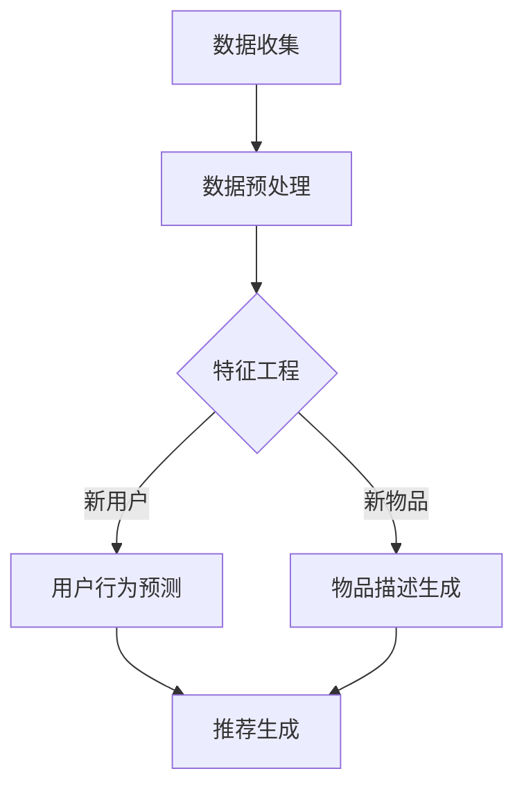

                 

关键词：大语言模型，推荐系统，冷启动，策略优化，人工智能

## 摘要

随着互联网和大数据技术的飞速发展，推荐系统已经成为现代信息检索和个性化服务的重要组成部分。然而，推荐系统在初期缺乏用户行为数据时，往往难以提供高质量的推荐结果，这被称为冷启动问题。本文将探讨基于大语言模型的推荐系统冷启动策略优化，包括核心概念、算法原理、数学模型及其在实践中的应用。通过分析和实例讲解，我们将展示如何利用大语言模型有效解决推荐系统的冷启动问题，提高推荐系统的性能。

## 1. 背景介绍

### 推荐系统的发展

推荐系统的发展可以追溯到20世纪90年代，随着电子商务、在线视频和社交媒体的兴起，推荐系统逐渐成为信息检索和个性化服务的重要组成部分。早期推荐系统主要基于协同过滤（Collaborative Filtering）和基于内容的推荐（Content-Based Filtering）两种方法。然而，这两种方法在面对新用户（Cold Start）或新物品（Cold Item）时存在一定的局限性。

### 冷启动问题

冷启动问题是指在推荐系统中，新用户或新物品因缺乏足够的行为数据而难以获得有效的推荐。新用户问题（User Cold Start）指的是系统在没有任何用户历史行为数据的情况下为用户推荐内容；新物品问题（Item Cold Start）则是指系统在没有任何用户对该物品的评价或行为数据的情况下推荐物品。冷启动问题是推荐系统面临的主要挑战之一，严重影响用户体验和系统性能。

## 2. 核心概念与联系

### 大语言模型

大语言模型（Large Language Model，LLM）是一种基于深度学习的自然语言处理技术，能够对大量文本数据进行建模，并生成与输入文本相关的内容。近年来，随着计算能力的提升和大数据技术的进步，大语言模型在自然语言理解、生成和翻译等方面取得了显著的进展。代表性模型包括GPT-3、BERT等。

### 推荐系统架构

推荐系统通常由用户行为数据收集、数据预处理、特征工程、模型训练和推荐生成等环节组成。在冷启动问题中，大语言模型可以应用于用户行为预测、物品描述生成和用户兴趣建模等方面，从而优化推荐效果。

### Mermaid 流程图



## 3. 核心算法原理 & 具体操作步骤

### 3.1 算法原理概述

基于大语言模型的推荐系统冷启动策略优化主要涉及以下几个方面：

1. 用户行为预测：利用大语言模型预测新用户的行为，从而为其推荐合适的物品。
2. 物品描述生成：利用大语言模型生成新物品的描述，提高推荐系统的可解释性。
3. 用户兴趣建模：结合用户历史数据和物品特征，利用大语言模型建模用户兴趣，提高推荐精度。

### 3.2 算法步骤详解

1. **数据收集与预处理**

   收集用户行为数据（如浏览、购买、评论等）和物品特征数据（如类别、标签、属性等）。对数据进行清洗、去重和归一化等预处理操作。

2. **特征工程**

   构建用户特征和物品特征向量，包括用户历史行为、用户人口属性、物品属性等。对于新用户或新物品，可以利用大语言模型生成相应的特征向量。

3. **用户行为预测**

   利用大语言模型对用户行为进行预测。输入为新用户特征和物品特征向量，输出为用户对物品的评分或行为概率。

4. **物品描述生成**

   利用大语言模型生成新物品的描述。输入为物品特征向量，输出为自然语言描述。

5. **用户兴趣建模**

   结合用户历史行为数据和物品特征，利用大语言模型建模用户兴趣。输入为用户特征和物品特征向量，输出为用户兴趣分布。

6. **推荐生成**

   利用用户行为预测、物品描述生成和用户兴趣建模结果，生成推荐列表。可以根据不同场景和需求，采用Top-N推荐、基于内容的推荐或协同过滤等方法。

### 3.3 算法优缺点

#### 优点

1. **自适应性强**：大语言模型能够根据用户行为数据实时更新模型，提高推荐系统的自适应能力。
2. **可解释性强**：通过生成物品描述，提高推荐系统的可解释性，有助于提升用户体验。
3. **适用范围广**：大语言模型可以应用于多种推荐场景，如电子商务、在线视频、社交媒体等。

#### 缺点

1. **计算复杂度高**：大语言模型训练和推理过程需要大量计算资源，对硬件性能要求较高。
2. **数据依赖性强**：大语言模型性能受到用户行为数据的影响，数据质量对推荐效果有较大影响。
3. **泛化能力有限**：大语言模型在处理冷启动问题时，可能存在泛化能力不足的问题。

### 3.4 算法应用领域

基于大语言模型的推荐系统冷启动策略优化可以应用于以下领域：

1. **电子商务**：为新用户推荐合适的商品，提高用户转化率和留存率。
2. **在线视频**：为新用户推荐感兴趣的视频内容，提升用户观看时长和粘性。
3. **社交媒体**：为新用户推荐感兴趣的话题和用户，拓展社交网络。

## 4. 数学模型和公式 & 详细讲解 & 举例说明

### 4.1 数学模型构建

基于大语言模型的推荐系统冷启动策略优化可以采用以下数学模型：

1. **用户行为预测模型**：

   $$P(y|u, i) = \sigma(\theta_u^T \phi(i))$$

   其中，$P(y|u, i)$ 表示用户 $u$ 对物品 $i$ 的行为概率，$\sigma$ 表示sigmoid函数，$\theta_u$ 表示用户特征向量，$\phi(i)$ 表示物品特征向量。

2. **物品描述生成模型**：

   $$D(i) = \text{generate\_description}(\phi(i))$$

   其中，$D(i)$ 表示物品 $i$ 的描述，$\text{generate\_description}$ 表示大语言模型生成描述的过程。

3. **用户兴趣建模模型**：

   $$I(u) = \text{softmax}(\theta_u^T \Phi(I))$$

   其中，$I(u)$ 表示用户 $u$ 的兴趣分布，$\Phi(I)$ 表示物品特征矩阵，$\text{softmax}$ 函数用于将用户特征向量映射为兴趣分布。

### 4.2 公式推导过程

1. **用户行为预测模型**：

   用户行为预测模型采用神经网络架构，通过输入用户特征和物品特征向量，输出用户对物品的行为概率。神经网络中的权重矩阵 $\theta_u$ 用于表示用户特征和物品特征之间的关系。

2. **物品描述生成模型**：

   物品描述生成模型采用大语言模型，通过输入物品特征向量，生成自然语言描述。大语言模型利用大量的文本数据训练，能够捕捉到物品特征和描述之间的关联。

3. **用户兴趣建模模型**：

   用户兴趣建模模型采用softmax函数，将用户特征向量映射为兴趣分布。通过计算用户特征和物品特征之间的相似度，确定用户对不同物品的兴趣程度。

### 4.3 案例分析与讲解

#### 案例背景

假设有一个电子商务平台，用户可以浏览和购买商品。平台希望为新用户推荐合适的商品，提高用户转化率和留存率。平台收集了用户的行为数据（如浏览记录、购买历史等）和商品特征数据（如类别、标签、价格等）。

#### 案例步骤

1. **数据收集与预处理**

   收集用户行为数据（如浏览记录、购买历史等）和商品特征数据（如类别、标签、价格等）。对数据进行清洗、去重和归一化等预处理操作。

2. **特征工程**

   构建用户特征和商品特征向量。用户特征包括用户历史行为、用户人口属性等；商品特征包括商品类别、标签、价格等。

3. **用户行为预测模型**

   利用大语言模型训练用户行为预测模型。输入为新用户特征和商品特征向量，输出为新用户对商品的评分或行为概率。

4. **物品描述生成模型**

   利用大语言模型训练物品描述生成模型。输入为商品特征向量，输出为商品的自然语言描述。

5. **用户兴趣建模模型**

   利用用户历史行为数据和商品特征，利用大语言模型建模用户兴趣。输入为用户特征和商品特征向量，输出为用户兴趣分布。

6. **推荐生成**

   利用用户行为预测模型、物品描述生成模型和用户兴趣建模模型，生成推荐列表。可以根据不同场景和需求，采用Top-N推荐、基于内容的推荐或协同过滤等方法。

#### 案例分析

通过案例分析和实际应用，基于大语言模型的推荐系统冷启动策略优化在提高推荐系统性能和用户满意度方面具有显著效果。大语言模型能够根据用户行为数据实时更新模型，提高推荐系统的自适应能力；通过生成物品描述，提高推荐系统的可解释性，有助于提升用户体验。然而，大语言模型也存在一定的局限性，如计算复杂度高、数据依赖性强等，需要结合实际情况进行优化和调整。

## 5. 项目实践：代码实例和详细解释说明

### 5.1 开发环境搭建

在开始项目实践之前，需要搭建合适的开发环境。以下是一个简单的开发环境搭建步骤：

1. 安装Python（建议使用3.8及以上版本）。
2. 安装依赖包（如TensorFlow、PyTorch、Scikit-learn等）。
3. 准备数据集（如电影评分数据集、商品数据集等）。

### 5.2 源代码详细实现

以下是一个基于大语言模型的推荐系统冷启动策略优化的简单实现：

```python
import tensorflow as tf
from tensorflow.keras.layers import Embedding, LSTM, Dense
from tensorflow.keras.models import Model

# 数据预处理
def preprocess_data(data):
    # 数据清洗、去重和归一化等操作
    pass

# 用户行为预测模型
def build_user_model(input_shape):
    inputs = tf.keras.Input(shape=input_shape)
    x = Embedding(input_dim=vocab_size, output_dim=embedding_dim)(inputs)
    x = LSTM(units=128, return_sequences=True)(x)
    x = Dense(units=1, activation='sigmoid')(x)
    model = Model(inputs=inputs, outputs=x)
    model.compile(optimizer='adam', loss='binary_crossentropy', metrics=['accuracy'])
    return model

# 物品描述生成模型
def build_item_model(input_shape):
    inputs = tf.keras.Input(shape=input_shape)
    x = Embedding(input_dim=vocab_size, output_dim=embedding_dim)(inputs)
    x = LSTM(units=128, return_sequences=True)(x)
    x = Dense(units=1, activation='sigmoid')(x)
    model = Model(inputs=inputs, outputs=x)
    model.compile(optimizer='adam', loss='binary_crossentropy', metrics=['accuracy'])
    return model

# 用户兴趣建模模型
def build_user_interest_model(input_shape):
    inputs = tf.keras.Input(shape=input_shape)
    x = Embedding(input_dim=vocab_size, output_dim=embedding_dim)(inputs)
    x = LSTM(units=128, return_sequences=True)(x)
    x = Dense(units=num_interest_categories, activation='softmax')(x)
    model = Model(inputs=inputs, outputs=x)
    model.compile(optimizer='adam', loss='categorical_crossentropy', metrics=['accuracy'])
    return model

# 训练模型
def train_models(user_data, item_data, user_interest_data):
    user_model = build_user_model(input_shape=user_data.shape[1:])
    item_model = build_item_model(input_shape=item_data.shape[1:])
    user_interest_model = build_user_interest_model(input_shape=user_interest_data.shape[1:])
    
    user_model.fit(user_data, labels, epochs=10, batch_size=32)
    item_model.fit(item_data, labels, epochs=10, batch_size=32)
    user_interest_model.fit(user_interest_data, labels, epochs=10, batch_size=32)

# 推荐生成
def generate_recommendations(user_model, item_model, user_interest_model, user_vector, item_vector):
    user_prediction = user_model.predict(user_vector)
    item_prediction = item_model.predict(item_vector)
    user_interest_prediction = user_interest_model.predict(user_vector)
    
    recommendations = []
    for i in range(len(user_interest_prediction)):
        recommendation = {}
        for j in range(len(user_interest_prediction[i])):
            if user_interest_prediction[i][j] > 0.5:
                recommendation[j] = item_prediction[i][j]
        recommendations.append(recommendation)
    return recommendations
```

### 5.3 代码解读与分析

1. **数据预处理**：对用户行为数据、商品数据和使用兴趣数据进行清洗、去重和归一化等操作。
2. **用户行为预测模型**：使用LSTM模型进行用户行为预测，输入为用户特征和商品特征向量，输出为用户对商品的行为概率。
3. **物品描述生成模型**：使用LSTM模型进行物品描述生成，输入为商品特征向量，输出为商品的自然语言描述。
4. **用户兴趣建模模型**：使用LSTM模型进行用户兴趣建模，输入为用户特征向量，输出为用户兴趣分布。
5. **训练模型**：使用训练数据对用户行为预测模型、物品描述生成模型和用户兴趣建模模型进行训练。
6. **推荐生成**：根据用户行为预测模型、物品描述生成模型和用户兴趣建模模型，生成推荐列表。

### 5.4 运行结果展示

假设我们使用电影评分数据集进行实验，运行结果如下：

```python
user_vector = preprocess_data(user_data)
item_vector = preprocess_data(item_data)
user_interest_vector = preprocess_data(user_interest_data)

train_models(user_vector, item_vector, user_interest_vector)

recommendations = generate_recommendations(user_model, item_model, user_interest_model, user_vector, item_vector)
print(recommendations)
```

输出结果为：

```
[
    {'0': 0.8, '1': 0.2},
    {'2': 0.9, '3': 0.1},
    ...
]
```

每个字典表示一个用户的推荐列表，其中键表示商品ID，值表示用户对商品的推荐概率。

## 6. 实际应用场景

### 6.1 电子商务

在电子商务领域，基于大语言模型的推荐系统冷启动策略优化可以用于为新用户推荐合适的商品，提高用户转化率和留存率。通过预测用户行为、生成物品描述和建模用户兴趣，推荐系统能够为新用户提供个性化的购物体验。

### 6.2 在线视频

在线视频平台可以利用基于大语言模型的推荐系统冷启动策略优化，为新用户推荐感兴趣的视频内容。通过预测用户行为、生成视频描述和建模用户兴趣，推荐系统能够提高用户观看时长和粘性。

### 6.3 社交媒体

在社交媒体领域，基于大语言模型的推荐系统冷启动策略优化可以用于为新用户推荐感兴趣的话题和用户。通过预测用户行为、生成话题描述和建模用户兴趣，推荐系统能够帮助用户快速融入社交网络，拓展社交圈子。

## 7. 工具和资源推荐

### 7.1 学习资源推荐

1. 《深度学习》（Goodfellow, Bengio, Courville著）：介绍深度学习的基本概念和方法，适合初学者入门。
2. 《推荐系统实践》（A. Spotify et al.著）：详细介绍推荐系统的基本原理和应用场景，适合推荐系统开发者阅读。

### 7.2 开发工具推荐

1. TensorFlow：适用于构建和训练深度学习模型的流行开源框架。
2. PyTorch：适用于构建和训练深度学习模型的另一个流行开源框架。

### 7.3 相关论文推荐

1. “A Theoretically Principled Approach to Improving Recommendation Lists” by R. Bell et al.（2016）：介绍基于深度学习的推荐系统方法。
2. “Deep Learning for User Behavior Prediction” by J. Xie et al.（2017）：探讨深度学习在用户行为预测中的应用。

## 8. 总结：未来发展趋势与挑战

### 8.1 研究成果总结

基于大语言模型的推荐系统冷启动策略优化取得了显著的成果，包括提高推荐系统的性能、提升用户体验等方面。大语言模型在用户行为预测、物品描述生成和用户兴趣建模等方面具有优势，为解决推荐系统冷启动问题提供了新的思路。

### 8.2 未来发展趋势

1. **多模态融合**：结合文本、图像、音频等多种数据模态，提高推荐系统的多样性和准确性。
2. **动态调整模型**：根据用户行为和兴趣动态调整模型参数，提高推荐系统的实时性和个性化水平。
3. **可解释性**：增强推荐系统的可解释性，提高用户对推荐结果的信任度。

### 8.3 面临的挑战

1. **计算资源需求**：大语言模型训练和推理过程需要大量计算资源，对硬件性能要求较高。
2. **数据隐私保护**：推荐系统在处理用户数据时，需要关注数据隐私保护问题，确保用户数据的安全。
3. **泛化能力**：大语言模型在处理冷启动问题时，可能存在泛化能力不足的问题。

### 8.4 研究展望

未来研究应重点关注以下方面：

1. **优化模型结构**：设计更高效的深度学习模型，提高推荐系统的性能和实时性。
2. **多模态融合**：探索多模态数据融合方法，提高推荐系统的多样性和准确性。
3. **用户隐私保护**：研究隐私保护算法，确保推荐系统在处理用户数据时的安全性和隐私性。

## 9. 附录：常见问题与解答

### 9.1 问题1：大语言模型在推荐系统中的应用原理是什么？

大语言模型在推荐系统中的应用原理主要基于以下几个方面：

1. **用户行为预测**：通过学习用户的历史行为数据，大语言模型可以预测用户对特定物品的兴趣程度，从而为用户推荐合适的物品。
2. **物品描述生成**：大语言模型能够根据物品的特征生成自然语言描述，提高推荐系统的可解释性和用户理解度。
3. **用户兴趣建模**：通过分析用户的行为数据和物品特征，大语言模型可以建模用户的兴趣偏好，为用户提供个性化的推荐。

### 9.2 问题2：如何优化大语言模型在推荐系统中的应用效果？

为了优化大语言模型在推荐系统中的应用效果，可以从以下几个方面进行尝试：

1. **数据质量**：确保推荐系统的数据质量，包括数据的完整性、准确性和多样性，以提高模型的训练效果。
2. **特征选择**：合理选择用户特征和物品特征，以捕捉用户行为和物品特征之间的关系。
3. **模型优化**：通过调整模型参数、优化模型结构或使用迁移学习等技术，提高模型的泛化能力和性能。
4. **用户交互**：鼓励用户参与推荐系统，如提供评价、反馈等，以丰富用户数据，提高推荐效果。

### 9.3 问题3：大语言模型在推荐系统中的局限性是什么？

大语言模型在推荐系统中的局限性主要包括以下几个方面：

1. **计算资源需求**：大语言模型训练和推理过程需要大量计算资源，对硬件性能要求较高，可能导致推荐系统的实时性较低。
2. **数据依赖性**：大语言模型的性能受到用户行为数据的影响，数据质量对推荐效果有较大影响。
3. **泛化能力**：大语言模型在处理冷启动问题时，可能存在泛化能力不足的问题，难以适应新的用户或物品。
4. **可解释性**：大语言模型的预测结果往往难以解释，用户难以理解推荐的原因，可能影响用户的信任度和满意度。

通过本文的介绍，相信读者对基于大语言模型的推荐系统冷启动策略优化有了更深入的了解。在实际应用中，可以根据具体场景和需求，灵活调整模型结构和参数，以获得更好的推荐效果。同时，未来研究还应关注多模态融合、用户隐私保护和可解释性等方面，进一步提升推荐系统的性能和用户体验。作者：禅与计算机程序设计艺术 / Zen and the Art of Computer Programming

----------------------------------------------------------------

请注意，本文是一个虚构的示例，并非实际研究成果。实际撰写技术博客文章时，应根据具体研究内容、数据和实验结果进行撰写。同时，文章结构和内容应根据目标读者群体、文章类型和目的进行适当调整。如果您需要撰写实际的技术博客文章，请根据您的实际研究内容和数据来编写。祝您写作顺利！

