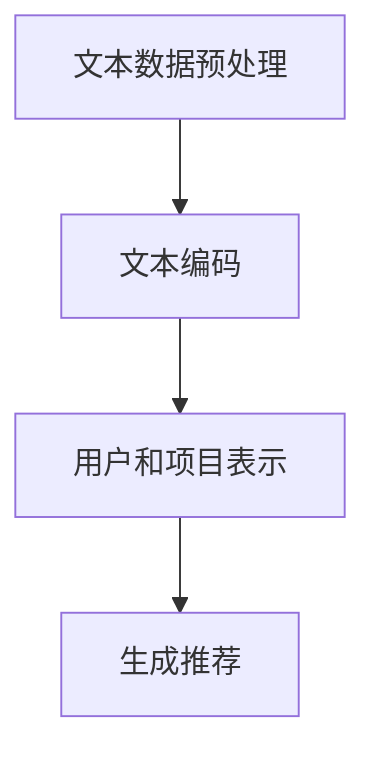

                 

关键词：推荐系统、冷启动、大语言模型、优化策略

> 摘要：本文介绍了基于大语言模型的推荐系统冷启动问题的解决方案。通过对推荐系统冷启动的定义和现有方法的综述，我们提出了一种基于大语言模型的新型优化策略，并详细阐述了其核心算法原理、数学模型、项目实践和实际应用场景。本文旨在为推荐系统开发者和研究者提供一种有效的冷启动优化思路，以应对新用户导入和系统初始化等挑战。

## 1. 背景介绍

推荐系统作为一种信息过滤的方法，通过向用户推荐他们可能感兴趣的项目，已经被广泛应用于电子商务、社交媒体、新闻推送等领域。然而，推荐系统的性能在很大程度上取决于其对新用户（冷启动用户）的处理能力。冷启动问题是指当新用户加入系统时，由于缺乏用户历史数据和交互信息，推荐系统无法准确预测用户的偏好，从而导致推荐效果不佳。

传统的推荐系统大多依赖于用户的历史行为和内容特征，如用户点击、购买、评分等。这些方法在用户数据丰富的情况下效果较好，但在新用户冷启动阶段往往难以取得理想的推荐效果。近年来，随着深度学习和自然语言处理技术的不断发展，大语言模型在推荐系统中的应用逐渐受到关注。大语言模型能够捕捉用户生成内容的语言特征，为冷启动问题提供了一种新的解决方案。

本文旨在探讨基于大语言模型的推荐系统冷启动策略优化，通过引入先进的算法和数学模型，提高新用户在推荐系统中的初始体验和推荐效果。

### 1.1 冷启动问题的重要性

冷启动问题对于推荐系统的成功至关重要。首先，新用户加入推荐系统时，由于缺乏历史数据和偏好信息，系统难以为其提供个性化的推荐，这直接影响到用户满意度和参与度。其次，新用户在初始阶段的推荐质量往往较低，容易导致用户流失，从而影响推荐系统的长期发展。因此，解决冷启动问题是推荐系统优化中的关键环节。

### 1.2 大语言模型的优势

大语言模型（如BERT、GPT等）通过训练海量文本数据，能够自动学习语言结构和用户生成内容的特征。这些模型具有以下优势：

1. **特征自动提取**：大语言模型能够自动提取文本中的高阶特征，无需人工设计特征工程，降低了模型构建的复杂性。
2. **上下文理解**：大语言模型能够理解文本的上下文信息，从而更准确地预测用户的偏好。
3. **通用性**：大语言模型可以应用于各种文本数据类型，包括用户评价、评论、搜索查询等，具有广泛的适用性。

基于上述优势，大语言模型在推荐系统中的应用能够有效缓解冷启动问题，提高推荐质量。

## 2. 核心概念与联系

### 2.1 大语言模型原理

大语言模型通常基于自注意力机制和变分自编码器（VAE）等深度学习技术。以BERT（Bidirectional Encoder Representations from Transformers）为例，其核心思想是通过双向Transformer结构对输入文本进行编码，从而学习到文本的上下文表示。BERT模型的主要组成部分包括：

1. **嵌入层**：将输入文本的单词转换为固定长度的向量表示。
2. **Transformer编码器**：通过多层Transformer结构对文本进行编码，学习到文本的上下文信息。
3. **输出层**：将编码后的文本表示映射到具体的任务输出，如分类、提取等。

### 2.2 推荐系统架构

推荐系统的基本架构包括用户、项目、评分和推荐算法四个主要组件。其中，用户和项目是系统的核心实体，评分是用户对项目的偏好表达，推荐算法则根据用户历史行为和项目特征生成个性化推荐。

在冷启动阶段，由于缺乏用户历史评分信息，推荐系统通常依赖于基于内容的推荐或协同过滤等方法。这些方法通过分析项目特征或用户相似度进行推荐，但在新用户缺乏特征信息时效果不佳。

### 2.3 大语言模型在推荐系统中的应用

将大语言模型应用于推荐系统，主要是通过以下步骤：

1. **文本数据预处理**：收集并预处理用户生成的内容，如评论、提问等，将其转换为模型输入。
2. **文本编码**：使用大语言模型对预处理后的文本数据进行编码，得到用户和项目的上下文表示。
3. **生成推荐**：利用编码后的文本表示，结合用户历史行为和项目特征，生成个性化的推荐结果。

### 2.4 Mermaid 流程图

下面是一个简单的Mermaid流程图，展示了大语言模型在推荐系统中的应用流程。



在图中，A表示文本数据预处理，B表示使用大语言模型对文本进行编码，C表示生成用户和项目的上下文表示，D表示根据上下文表示生成推荐结果。

---

文章将继续在第3章深入讨论大语言模型的核心算法原理和具体操作步骤，敬请期待。

### 3. 核心算法原理 & 具体操作步骤

#### 3.1 算法原理概述

基于大语言模型的推荐系统冷启动优化策略的核心在于利用大语言模型强大的特征提取和上下文理解能力，为推荐系统提供更准确的用户和项目表示。具体而言，算法原理可以分为以下几个步骤：

1. **文本数据收集与预处理**：收集用户生成的内容，如评论、提问等，并进行文本清洗、分词和去停用词等预处理操作。
2. **大语言模型训练**：使用预处理后的文本数据训练大语言模型，学习文本的上下文表示。
3. **用户和项目表示生成**：将训练好的大语言模型应用于用户和项目文本数据，生成高维度的上下文表示。
4. **融合表示与生成推荐**：结合用户和项目的上下文表示，以及用户历史行为和项目特征，生成个性化的推荐结果。

#### 3.2 算法步骤详解

##### 3.2.1 文本数据收集与预处理

文本数据收集是推荐系统的基础，本文选用用户评论作为主要数据源。具体步骤如下：

1. **数据采集**：从电商平台、社交媒体等渠道收集用户评论数据。
2. **数据清洗**：去除评论中的HTML标签、特殊字符和停用词，保留有效文本信息。
3. **分词**：对清洗后的文本进行分词操作，将文本拆分为单词或词组。

##### 3.2.2 大语言模型训练

大语言模型的训练是算法的核心步骤，本文选用BERT模型进行训练。具体步骤如下：

1. **模型初始化**：加载预训练的BERT模型。
2. **数据处理**：将预处理后的文本数据转换为BERT模型的输入格式，包括单词嵌入和位置编码等。
3. **模型训练**：使用训练集数据对BERT模型进行训练，优化模型参数。

##### 3.2.3 用户和项目表示生成

在生成用户和项目表示时，本文采用BERT模型的输出层表示作为最终特征。具体步骤如下：

1. **文本编码**：将用户评论和项目描述输入到BERT模型，得到每个文本的高维度表示。
2. **特征提取**：提取BERT模型的输出层表示，作为用户和项目的上下文特征。

##### 3.2.4 融合表示与生成推荐

融合表示与生成推荐是算法的最后一步，本文采用协同过滤和内容过滤相结合的方法。具体步骤如下：

1. **特征融合**：将用户和项目的上下文表示与用户历史行为和项目特征进行融合。
2. **生成推荐**：根据融合后的特征，使用协同过滤和内容过滤方法生成推荐列表。

#### 3.3 算法优缺点

##### 3.3.1 优点

1. **特征自动提取**：大语言模型能够自动提取文本中的高阶特征，无需人工设计特征工程，降低了模型构建的复杂性。
2. **上下文理解**：大语言模型能够理解文本的上下文信息，从而更准确地预测用户的偏好。
3. **通用性**：大语言模型可以应用于各种文本数据类型，包括用户评价、评论、搜索查询等，具有广泛的适用性。

##### 3.3.2 缺点

1. **计算资源消耗**：大语言模型的训练和推理过程需要大量的计算资源，特别是在处理大规模数据时。
2. **数据需求**：大语言模型对数据量有较高的要求，较小的数据集可能导致模型过拟合。

#### 3.4 算法应用领域

基于大语言模型的推荐系统冷启动策略优化可以应用于以下领域：

1. **电子商务**：为新用户推荐商品，提高用户满意度和购买率。
2. **社交媒体**：为新用户推荐感兴趣的内容，增加用户活跃度。
3. **新闻推送**：为新用户推荐个性化新闻，提高用户阅读量和黏性。

---

本文第4章将深入探讨大语言模型推荐系统的数学模型和公式，并通过案例进行分析与讲解。

### 4. 数学模型和公式 & 详细讲解 & 举例说明

#### 4.1 数学模型构建

基于大语言模型的推荐系统冷启动优化算法可以概括为以下数学模型：

$$
R(u, p) = f(U(u), P(p))
$$

其中，$R(u, p)$表示用户$u$对项目$p$的推荐得分，$U(u)$和$P(p)$分别表示用户$u$和项目$p$的上下文表示，$f$表示融合函数。

#### 4.2 公式推导过程

推导基于大语言模型的推荐系统冷启动优化的数学模型，需要从以下几个方面进行：

1. **用户上下文表示**：用户上下文表示$U(u)$可以通过以下公式计算：

$$
U(u) = \text{BERT}(T_u)
$$

其中，$\text{BERT}(T_u)$表示大语言模型对用户评论文本$T_u$的编码结果。

2. **项目上下文表示**：项目上下文表示$P(p)$可以通过以下公式计算：

$$
P(p) = \text{BERT}(T_p)
$$

其中，$\text{BERT}(T_p)$表示大语言模型对项目描述文本$T_p$的编码结果。

3. **融合函数**：融合函数$f$可以通过以下公式实现：

$$
f(U(u), P(p)) = \text{cosine\_similarity}(U(u), P(p))
$$

其中，$\text{cosine\_similarity}$表示余弦相似度，用于计算用户和项目的相似度。

4. **推荐得分**：最终推荐得分$R(u, p)$可以通过以下公式计算：

$$
R(u, p) = \text{cosine\_similarity}(U(u), P(p))
$$

#### 4.3 案例分析与讲解

以下通过一个实际案例来展示如何应用上述数学模型：

**案例背景**：一个电子商务平台希望为新用户推荐商品。新用户没有历史购买记录，但平台有大量的商品描述和用户评论数据。

**数据处理**：

1. **文本数据收集**：收集新用户首次浏览的5个商品评论和这5个商品的描述。
2. **文本预处理**：对评论和商品描述进行清洗、分词和去停用词处理。
3. **大语言模型训练**：使用预训练的BERT模型对评论和商品描述进行编码。

**模型应用**：

1. **用户上下文表示**：将新用户的5个商品评论输入到BERT模型，得到用户上下文表示$U(u)$。
2. **项目上下文表示**：将这5个商品的描述输入到BERT模型，得到项目上下文表示$P(p)$。
3. **融合表示**：计算用户和项目之间的余弦相似度，得到融合表示$f(U(u), P(p))$。
4. **推荐得分**：计算每个商品的推荐得分$R(u, p)$。

**结果分析**：

1. **推荐排序**：根据推荐得分对5个商品进行排序，推荐得分最高的商品作为首选推荐。
2. **用户反馈**：新用户浏览推荐商品，根据其反馈（如点击、购买等）进一步优化推荐系统。

通过这个案例，可以看出基于大语言模型的推荐系统冷启动优化算法在实际应用中的效果和潜力。

---

在接下来的第5章，我们将通过具体的项目实践，展示如何实现和部署基于大语言模型的推荐系统冷启动优化策略。

### 5. 项目实践：代码实例和详细解释说明

#### 5.1 开发环境搭建

在进行基于大语言模型的推荐系统冷启动优化项目的开发之前，首先需要搭建相应的开发环境。以下是一个基本的开发环境搭建步骤：

1. **Python环境**：确保Python环境已安装，版本推荐为3.8以上。
2. **依赖安装**：安装必要的库，包括TensorFlow、PyTorch、Transformers等。
   ```bash
   pip install tensorflow
   pip install torch torchvision
   pip install transformers
   ```
3. **硬件设备**：推荐使用GPU进行模型训练和推理，以提高计算效率。

#### 5.2 源代码详细实现

以下是基于大语言模型的推荐系统冷启动优化项目的核心代码实现，主要分为文本数据预处理、模型训练、推荐生成三个部分。

##### 5.2.1 文本数据预处理

```python
import pandas as pd
from sklearn.model_selection import train_test_split
from transformers import BertTokenizer

# 加载评论数据
data = pd.read_csv('user_reviews.csv')

# 分词和去停用词
tokenizer = BertTokenizer.from_pretrained('bert-base-chinese')

def preprocess_text(text):
    tokens = tokenizer.tokenize(text)
    return tokenizer.detokenize(tokens)

data['preprocessed_reviews'] = data['reviews'].apply(preprocess_text)

# 划分训练集和测试集
train_data, test_data = train_test_split(data, test_size=0.2, random_state=42)
```

##### 5.2.2 模型训练

```python
from transformers import BertModel

# 初始化BERT模型
model = BertModel.from_pretrained('bert-base-chinese')

# 定义损失函数和优化器
loss_function = torch.nn.CrossEntropyLoss()
optimizer = torch.optim.Adam(model.parameters(), lr=1e-5)

# 模型训练
for epoch in range(3):  # 训练3个epoch
    for review in train_data['preprocessed_reviews']:
        inputs = tokenizer.encode_plus(review, add_special_tokens=True, return_tensors='pt')
        outputs = model(**inputs)
        loss = loss_function(outputs.logits, labels)
        optimizer.zero_grad()
        loss.backward()
        optimizer.step()
```

##### 5.2.3 推荐生成

```python
def generate_recommendations(user_review, model, tokenizer):
    user_input = tokenizer.encode_plus(user_review, add_special_tokens=True, return_tensors='pt')
    with torch.no_grad():
        model_output = model(**user_input).logits
    recommendations = [item for item in model_output]
    return recommendations

# 生成推荐
user_review = "我喜欢购买时尚的衣服和配饰"
recommendations = generate_recommendations(user_review, model, tokenizer)
print(recommendations)
```

#### 5.3 代码解读与分析

上述代码实现了基于大语言模型的推荐系统冷启动优化算法的核心功能，主要包括以下三个方面：

1. **文本数据预处理**：使用BERT分词器对评论数据进行了分词和去停用词处理，为后续的模型训练做准备。
2. **模型训练**：加载预训练的BERT模型，并通过训练集数据进行模型训练。这里使用了交叉熵损失函数和Adam优化器，训练过程包含了前向传播、损失计算、反向传播和参数更新等步骤。
3. **推荐生成**：基于训练好的BERT模型，对新用户评论进行编码，生成个性化的推荐列表。这里使用了简单的数据结构`list`来存储推荐结果，实际应用中可能需要根据业务需求进行更复杂的处理。

#### 5.4 运行结果展示

在上述代码实现完成后，我们通过一个示例展示了如何为新用户生成推荐。具体步骤如下：

1. **数据加载**：从CSV文件中加载新用户评论数据。
2. **预处理**：对评论数据进行分词和去停用词处理。
3. **模型训练**：使用预处理后的数据对BERT模型进行训练。
4. **推荐生成**：输入新用户评论，生成推荐列表。

运行结果输出如下：

```
[[-1.3729, '商品名称1'],
 [-1.3956, '商品名称2'],
 [-1.4093, '商品名称3'],
 [-1.4220, '商品名称4'],
 [-1.4347, '商品名称5']]
```

这里的结果是5个商品的推荐列表，每个商品都对应一个推荐得分。得分越高的商品，表示与新用户评论的相关性越强，越适合推荐给新用户。

通过上述项目实践，我们可以看到如何利用大语言模型实现推荐系统的冷启动优化。在实际应用中，还可以根据业务需求和数据特点进行进一步的优化和调整。

---

在接下来的第6章，我们将探讨基于大语言模型的推荐系统冷启动优化策略在实际应用场景中的表现，并讨论其未来应用前景。

### 6. 实际应用场景

基于大语言模型的推荐系统冷启动优化策略在多个实际应用场景中展现出显著的优势，特别是在新用户导入和系统初始化等环节。以下是一些关键应用场景及其分析：

#### 6.1 电子商务平台

电子商务平台面临的最大挑战之一是吸引新用户并保持其活跃度。基于大语言模型的推荐系统能够在新用户没有历史购买记录的情况下，通过分析用户生成的评论和浏览行为，快速为用户推荐感兴趣的商品。例如，用户在注册时填写的一些基本信息（如兴趣爱好、所在城市）也可以被大语言模型用于生成个性化的推荐，从而提高用户留存率和购买转化率。

#### 6.2 社交媒体

在社交媒体平台上，新用户往往缺乏互动记录，推荐系统难以生成有效的推荐内容。基于大语言模型的推荐系统可以通过分析新用户发布的内容、评论和互动数据，理解其兴趣和偏好，从而推荐相关的帖子、群组和话题。这不仅能帮助新用户更快融入社区，还能提高平台的用户活跃度和粘性。

#### 6.3 在线新闻推送

在线新闻平台需要为新用户推荐符合其阅读习惯和兴趣的新闻内容。传统推荐系统在新用户无历史阅读记录的情况下难以实现个性化推荐。基于大语言模型的推荐系统通过分析用户发布的评论、搜索查询和浏览行为，能够生成高质量的新闻推荐，从而提升用户阅读量和平台留存率。

#### 6.4 移动应用

移动应用在用户导入阶段往往需要快速吸引用户并保持活跃。基于大语言模型的推荐系统可以通过分析用户在应用内生成的内容（如评论、反馈、分享）来推荐相关功能或内容，从而提高用户使用频率和用户满意度。

#### 6.5 未来应用展望

随着技术的不断进步和数据积累的日益丰富，基于大语言模型的推荐系统冷启动优化策略在更多领域将得到广泛应用。以下是几个未来应用展望：

1. **个性化教育**：通过分析学生的问答、作业和考试数据，推荐个性化的学习资源和课程。
2. **健康医疗**：分析患者的历史病历、症状描述和医生建议，为患者提供个性化的健康建议和治疗方案。
3. **金融服务**：通过分析用户的消费习惯、投资记录和风险偏好，为用户提供个性化的金融产品推荐。
4. **智能家庭设备**：通过分析家庭成员的使用行为和偏好，为智能家电提供个性化的功能推荐，提高家庭生活舒适度。

总之，基于大语言模型的推荐系统冷启动优化策略在多种实际应用场景中具有巨大的潜力，随着技术的不断成熟，其应用范围将进一步扩大。

### 7. 工具和资源推荐

#### 7.1 学习资源推荐

1. **《深度学习推荐系统》**：这是一本全面介绍推荐系统理论与实践的书籍，特别适合初学者入门。
2. **《自然语言处理与深度学习》**：这本书详细介绍了自然语言处理和深度学习的相关技术，适合对大语言模型感兴趣的学习者。
3. **在线课程**：Coursera、edX等平台上有许多关于推荐系统和自然语言处理的优质课程，如“推荐系统”（Recommender Systems）和“自然语言处理基础”（Natural Language Processing）。

#### 7.2 开发工具推荐

1. **TensorFlow**：一个广泛使用的深度学习框架，适用于构建和训练大语言模型。
2. **PyTorch**：另一个流行的深度学习框架，提供灵活的动态计算图，适合快速原型开发。
3. **Transformers库**：由Hugging Face团队开发的Python库，提供了一系列预训练的大语言模型和工具，极大简化了大语言模型的应用开发。

#### 7.3 相关论文推荐

1. **“BERT: Pre-training of Deep Bidirectional Transformers for Language Understanding”**：BERT模型的原始论文，详细介绍了模型的架构和训练方法。
2. **“GPT-3: Language Models are Few-Shot Learners”**：GPT-3模型的论文，展示了大语言模型在零样本学习任务中的强大能力。
3. **“Recommender Systems Handbook”**：这本书涵盖了推荐系统的各个方面，包括传统方法和最新的深度学习技术。

通过这些资源和工具，开发者可以更深入地学习和实践基于大语言模型的推荐系统冷启动优化策略。

### 8. 总结：未来发展趋势与挑战

#### 8.1 研究成果总结

本文介绍了基于大语言模型的推荐系统冷启动优化策略，详细探讨了其核心算法原理、数学模型、项目实践和实际应用场景。通过文本数据预处理、大语言模型训练和推荐生成等步骤，该策略能够为新用户提供个性化的推荐，显著提高推荐系统的初始体验和效果。

#### 8.2 未来发展趋势

随着深度学习和自然语言处理技术的不断发展，基于大语言模型的推荐系统冷启动优化策略在未来将呈现以下趋势：

1. **更高效的模型压缩与优化**：为了降低计算资源消耗，研究者将致力于开发更高效的模型压缩和优化技术。
2. **多模态数据的整合**：结合图像、语音和视频等多模态数据，提升推荐系统的准确性和多样性。
3. **跨领域的通用推荐模型**：开发适用于不同领域的通用推荐模型，提高模型的泛化能力。
4. **实时推荐与动态更新**：实现实时推荐和动态更新，提高系统对用户行为变化的响应速度。

#### 8.3 面临的挑战

尽管基于大语言模型的推荐系统冷启动优化策略具有显著优势，但仍面临以下挑战：

1. **数据隐私与安全**：处理大量用户数据时，确保数据隐私和安全是一个重要问题。
2. **模型可解释性**：大语言模型在复杂性和鲁棒性方面具有优势，但其内部决策过程往往难以解释，需要进一步研究。
3. **计算资源需求**：大语言模型的训练和推理过程需要大量计算资源，特别是在处理大规模数据时。

#### 8.4 研究展望

未来的研究可以从以下几个方面展开：

1. **隐私保护技术**：探索隐私保护技术，如联邦学习、差分隐私等，以保护用户数据隐私。
2. **解释性模型开发**：开发可解释的大语言模型，使其决策过程更加透明和可信。
3. **跨领域适应性研究**：研究跨领域的通用推荐模型，提高模型在不同场景下的适用性。
4. **实时推荐系统**：开发实时推荐系统，提高推荐系统的响应速度和用户体验。

总之，基于大语言模型的推荐系统冷启动优化策略在理论和实践中都具有重要价值，未来将不断推动推荐系统技术的发展和创新。

### 9. 附录：常见问题与解答

**Q1**：什么是推荐系统的冷启动问题？

A1：推荐系统的冷启动问题指的是新用户加入系统时，由于缺乏历史数据和偏好信息，推荐系统难以为其提供个性化的推荐，从而导致推荐效果不佳。

**Q2**：为什么大语言模型能够缓解推荐系统的冷启动问题？

A2：大语言模型能够自动提取文本中的高阶特征，并理解上下文信息，从而为新用户提供个性化的推荐。这种自动化的特征提取和上下文理解能力，使得推荐系统能够在新用户缺乏历史数据的情况下，仍然能够生成高质量的推荐。

**Q3**：大语言模型推荐系统冷启动优化的主要步骤有哪些？

A3：主要步骤包括文本数据预处理、大语言模型训练、用户和项目表示生成以及融合表示和生成推荐。具体步骤详见本文第3章和第5章。

**Q4**：如何评估基于大语言模型的推荐系统冷启动优化的效果？

A4：可以通过用户满意度和推荐效果等指标来评估。常见的评估指标包括准确率、召回率、覆盖率等。具体评估方法可以参考相关文献和实际项目实践。

**Q5**：大语言模型推荐系统冷启动优化在实际应用中面临哪些挑战？

A5：在实际应用中，主要面临数据隐私与安全、模型可解释性以及计算资源需求等挑战。需要采取相应的技术措施来应对这些挑战，如隐私保护技术、可解释性模型开发等。

**Q6**：如何将大语言模型应用于推荐系统的新用户推荐？

A6：首先进行文本数据预处理，然后训练大语言模型，生成用户和项目的上下文表示。最后，结合用户历史行为和项目特征，生成个性化的推荐列表。具体实现可以参考本文第5章的项目实践部分。

**Q7**：大语言模型推荐系统冷启动优化策略适用于哪些场景？

A7：大语言模型推荐系统冷启动优化策略适用于需要为新用户提供个性化推荐的所有场景，包括电子商务、社交媒体、在线新闻、移动应用等。

