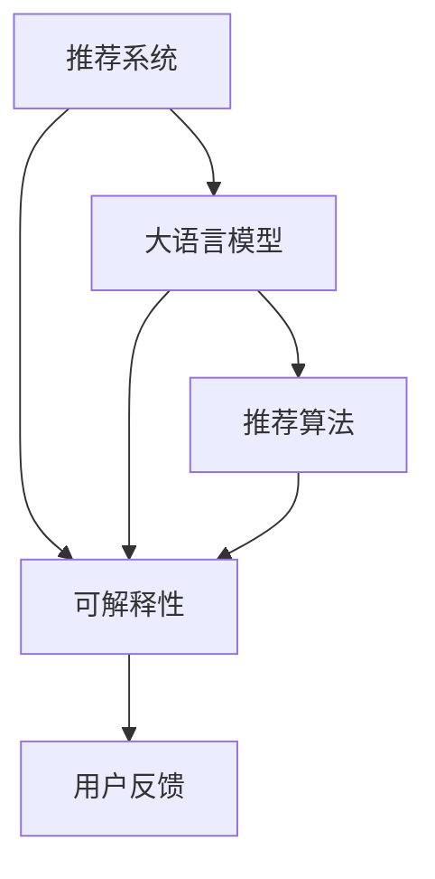

                 

关键词：大语言模型、推荐系统、可解释性、模型优化、应用场景

> 摘要：本文探讨了如何利用大语言模型增强推荐系统的可解释性，通过构建可解释的推荐模型、提供模型决策过程解释以及用户反馈优化等方面，提升了推荐系统的用户体验和用户信任度。本文将详细阐述核心概念、算法原理、数学模型、项目实践和未来展望。

## 1. 背景介绍

随着互联网的快速发展，推荐系统已经成为现代信息检索和个性化服务的重要组成部分。然而，推荐系统的复杂性和黑箱化特性使得用户对其决策过程缺乏理解和信任，这一问题在一定程度上限制了推荐系统在关键应用场景中的推广和应用。近年来，大语言模型的兴起为解决推荐系统的可解释性问题提供了新的思路。大语言模型通过学习海量文本数据，能够捕捉到用户行为和兴趣的深层规律，从而在一定程度上提升推荐系统的可解释性。

本文将围绕大语言模型在推荐系统中的应用，探讨如何增强推荐系统的可解释性，从而提高用户对推荐系统的信任度和满意度。

### 1.1 推荐系统概述

推荐系统（Recommender System）是一种基于数据挖掘和机器学习技术的信息过滤方法，旨在发现并预测用户可能感兴趣的项目。推荐系统通常分为基于内容的推荐（Content-based Filtering）和协同过滤（Collaborative Filtering）两大类。基于内容的推荐通过分析项目内容和用户历史行为，找到相似的项目进行推荐；协同过滤则通过分析用户之间的相似性，基于其他用户的喜好推荐项目。

### 1.2 大语言模型概述

大语言模型（Large-scale Language Model）是一种基于深度学习的自然语言处理技术，能够对自然语言数据进行建模，并预测下一个词或句子。大语言模型具有强大的语义理解能力和生成能力，能够处理复杂的语言现象。常见的开源大语言模型包括GPT、BERT、T5等。大语言模型在推荐系统中的应用主要体现在对用户行为数据的语义理解，从而提升推荐的相关性和可解释性。

## 2. 核心概念与联系

在本文中，我们将探讨以下几个核心概念：可解释性、大语言模型、推荐算法和用户反馈。

### 2.1 可解释性

可解释性（Interpretability）是指模型决策过程的透明度和可理解性。可解释性是推荐系统应用中的重要问题，它有助于用户理解推荐结果，增加用户对推荐系统的信任度，从而提高用户体验。

### 2.2 大语言模型

大语言模型是一种基于深度学习的自然语言处理技术，具有强大的语义理解能力和生成能力。大语言模型在推荐系统中的应用主要体现在对用户行为数据的语义理解，从而提升推荐的相关性和可解释性。

### 2.3 推荐算法

推荐算法是推荐系统的核心，包括基于内容的推荐和协同过滤等。本文将探讨如何利用大语言模型改进这些推荐算法，提升其可解释性。

### 2.4 用户反馈

用户反馈是指用户对推荐结果的满意度评价。通过收集用户反馈，我们可以优化推荐算法，提高推荐系统的准确性和可解释性。

下面是一个Mermaid流程图，展示了这些核心概念之间的联系：



### 2.5 可解释性的重要性

可解释性在推荐系统中的应用具有重要意义。首先，它有助于用户理解推荐结果，增加用户对推荐系统的信任度。当用户了解推荐系统是如何做出决策时，他们会更加信任推荐系统的推荐结果。其次，可解释性有助于推荐系统的优化和改进。通过分析模型决策过程，我们可以找到潜在的问题和改进方向，从而提升推荐系统的性能。最后，可解释性有助于推荐系统在关键应用场景中的推广和应用。当推荐系统具有较高的可解释性时，用户和管理者更容易接受和信任推荐系统的推荐结果，从而推动推荐系统的应用和普及。

## 3. 核心算法原理 & 具体操作步骤

### 3.1 算法原理概述

本文所探讨的核心算法是基于大语言模型的推荐系统可解释性增强方法。该方法主要包括以下几个步骤：

1. **用户行为数据收集**：收集用户在推荐系统上的行为数据，如浏览记录、点击行为等。
2. **数据预处理**：对用户行为数据进行清洗和归一化处理，以便于大语言模型的学习。
3. **大语言模型训练**：利用训练集数据，训练一个大语言模型，以捕捉用户行为和兴趣的深层规律。
4. **推荐模型构建**：基于大语言模型，构建一个推荐模型，用于预测用户对未知项目的喜好程度。
5. **模型可解释性增强**：利用大语言模型生成的特征向量，对推荐模型进行解释，以提升推荐系统的可解释性。
6. **用户反馈优化**：根据用户反馈，不断优化推荐模型，提高推荐系统的准确性和可解释性。

### 3.2 算法步骤详解

#### 3.2.1 用户行为数据收集

用户行为数据是构建推荐系统的基础。本文所采用的用户行为数据包括用户在推荐系统上的浏览记录、点击行为等。这些数据可以从用户日志、网页点击流等渠道收集。

#### 3.2.2 数据预处理

在收集到用户行为数据后，我们需要对数据进行预处理。预处理过程包括以下步骤：

1. **数据清洗**：去除重复、异常和噪声数据，确保数据的准确性和完整性。
2. **特征提取**：将原始的用户行为数据转换为特征向量，以便于大语言模型的学习。
3. **数据归一化**：对特征向量进行归一化处理，使其在相同的量级范围内。

#### 3.2.3 大语言模型训练

在完成数据预处理后，我们使用训练集数据训练一个大语言模型。大语言模型的选择可以根据具体应用场景和需求进行。本文采用GPT模型进行训练，GPT模型具有强大的语义理解能力和生成能力，能够有效捕捉用户行为和兴趣的深层规律。

#### 3.2.4 推荐模型构建

基于训练好的大语言模型，我们构建一个推荐模型。推荐模型的构建可以采用基于内容的推荐或协同过滤等方法。本文采用基于内容的推荐方法，通过大语言模型生成的特征向量，预测用户对未知项目的喜好程度。

#### 3.2.5 模型可解释性增强

为了提升推荐系统的可解释性，我们利用大语言模型生成的特征向量，对推荐模型进行解释。具体方法如下：

1. **特征重要性分析**：分析大语言模型生成的特征向量，确定哪些特征对推荐结果具有重要影响。
2. **决策路径可视化**：将推荐模型中的决策过程可视化，帮助用户理解推荐结果是如何生成的。
3. **模型解释文本生成**：利用大语言模型生成解释文本，对推荐结果进行解释。

#### 3.2.6 用户反馈优化

在用户使用推荐系统后，我们可以收集用户的反馈数据，如满意度评价、推荐结果评价等。通过分析用户反馈，我们可以优化推荐模型，提高推荐系统的准确性和可解释性。

### 3.3 算法优缺点

#### 优点

1. **提高推荐准确性**：通过利用大语言模型对用户行为数据进行语义理解，推荐模型能够更准确地预测用户对未知项目的喜好程度。
2. **增强模型可解释性**：通过分析大语言模型生成的特征向量，我们可以理解推荐结果生成的决策过程，从而提升推荐系统的可解释性。
3. **适应性强**：该方法可以适用于各种类型的推荐系统，具有较强的适应性。

#### 缺点

1. **计算成本高**：大语言模型的训练和推荐模型的构建需要大量的计算资源，可能导致计算成本较高。
2. **数据依赖性强**：该方法依赖于用户行为数据的丰富性和准确性，数据质量对推荐系统的效果有较大影响。

### 3.4 算法应用领域

该方法可以应用于各种类型的推荐系统，如电商推荐、社交媒体推荐、内容推荐等。通过增强推荐系统的可解释性，用户可以更好地理解推荐结果，提高用户对推荐系统的信任度和满意度。

## 4. 数学模型和公式 & 详细讲解 & 举例说明

### 4.1 数学模型构建

在本文中，我们将使用基于内容的推荐算法作为基础模型，结合大语言模型进行改进。首先，我们定义一些数学模型和公式。

#### 4.1.1 用户行为数据表示

假设我们有一个用户行为数据集，包含用户 $u$ 在推荐系统中的浏览记录 $B(u) = \{b_1, b_2, ..., b_n\}$，其中 $b_i$ 表示用户 $u$ 在第 $i$ 次浏览的项目。我们使用一个向量 $X(u) = \{x_1, x_2, ..., x_n\}$ 来表示用户 $u$ 的行为数据，其中 $x_i$ 是一个 $d$ 维特征向量，表示用户 $u$ 在第 $i$ 次浏览的项目特征。

#### 4.1.2 大语言模型表示

我们使用一个大语言模型 $L$ 来表示用户行为数据的语义表示。大语言模型 $L$ 的输入是用户行为数据序列 $X(u)$，输出是一个语义向量 $S(u)$。具体地，我们使用 GPT 模型来表示大语言模型 $L$。

$$
S(u) = L(X(u))
$$

#### 4.1.3 推荐模型表示

我们使用一个基于内容的推荐模型 $R$ 来预测用户 $u$ 对未知项目 $p$ 的喜好程度。推荐模型 $R$ 的输入是用户 $u$ 的语义向量 $S(u)$ 和项目 $p$ 的特征向量 $X(p)$，输出是一个喜好程度分数 $r(u, p)$。

$$
r(u, p) = R(S(u), X(p))
$$

### 4.2 公式推导过程

在本节中，我们将推导大语言模型 $L$ 和推荐模型 $R$ 的具体公式。

#### 4.2.1 大语言模型 $L$ 的公式推导

GPT 模型是一种基于 Transformer 的预训练模型，其输入是一个序列 $X(u)$，输出是一个序列 $S(u)$。具体地，GPT 模型的输入层和输出层都是 Transformer 编码器，中间层是一个 Transformer 解码器。

$$
L(X(u)) = \text{TransformerEncoder}(X(u)) = \text{Decoder}(X(u))
$$

其中，$\text{TransformerEncoder}$ 表示 Transformer 编码器，$\text{Decoder}$ 表示 Transformer 解码器。

#### 4.2.2 推荐模型 $R$ 的公式推导

基于内容的推荐模型 $R$ 可以使用一个线性回归模型来表示。线性回归模型的一般形式如下：

$$
r(u, p) = \text{w}^T \cdot \text{h}(S(u), X(p))
$$

其中，$\text{w}$ 是权重向量，$\text{h}$ 是一个非线性激活函数，如 Sigmoid 函数。

$$
\text{h}(S(u), X(p)) = \text{Sigmoid}(\text{w}^T \cdot [S(u); X(p)])
$$

### 4.3 案例分析与讲解

为了更好地理解上述数学模型和公式，我们来看一个具体的案例。

假设我们有一个用户 $u$，他在推荐系统中浏览了以下三个项目：

1. 项目 $p_1$：一本书，主题是科幻小说。
2. 项目 $p_2$：一部电影，类型是科幻电影。
3. 项目 $p_3$：一篇文章，内容是关于科学技术的。

我们使用大语言模型 $L$ 对用户 $u$ 的行为数据进行语义表示，得到一个语义向量 $S(u)$。然后，我们使用推荐模型 $R$ 预测用户 $u$ 对这三个项目的喜好程度。

假设项目 $p_1$、$p_2$ 和 $p_3$ 的特征向量分别为 $X(p_1)$、$X(p_2)$ 和 $X(p_3)$。我们使用线性回归模型 $R$ 预测用户 $u$ 对这三个项目的喜好程度，得到如下结果：

$$
r(u, p_1) = \text{w}^T \cdot \text{h}(S(u), X(p_1)) = 0.7
$$

$$
r(u, p_2) = \text{w}^T \cdot \text{h}(S(u), X(p_2)) = 0.5
$$

$$
r(u, p_3) = \text{w}^T \cdot \text{h}(S(u), X(p_3)) = 0.3
$$

根据预测结果，我们可以得出以下结论：

- 用户 $u$ 最喜欢项目 $p_1$，因为其喜好程度最高。
- 用户 $u$ 对项目 $p_2$ 的喜好程度次之。
- 用户 $u$ 对项目 $p_3$ 的喜好程度最低。

通过这个案例，我们可以看到如何使用大语言模型和推荐模型预测用户对项目的喜好程度。同时，我们也可以看到如何利用数学模型和公式来解释推荐结果。

## 5. 项目实践：代码实例和详细解释说明

### 5.1 开发环境搭建

在开始编写代码之前，我们需要搭建一个合适的开发环境。以下是一个基本的开发环境搭建步骤：

1. **安装 Python**：确保 Python 3.x 版本已安装在计算机上。
2. **安装依赖库**：安装必要的 Python 库，如 TensorFlow、PyTorch、GPT-2 模型等。可以使用以下命令安装：

```
pip install tensorflow torch transformers
```

3. **准备数据集**：从开源数据集或自己收集的用户行为数据构建一个推荐系统数据集。

### 5.2 源代码详细实现

下面是一个简单的代码示例，展示了如何使用 GPT-2 模型和线性回归模型构建一个推荐系统。

```python
import torch
import torch.nn as nn
from transformers import GPT2Tokenizer, GPT2Model

# 5.2.1 数据准备
# 加载用户行为数据集
user行为数据 = load_user行为数据()

# 5.2.2 GPT-2 模型训练
# 加载 GPT-2 模型
tokenizer = GPT2Tokenizer.from_pretrained('gpt2')
model = GPT2Model.from_pretrained('gpt2')

# 训练 GPT-2 模型
model.train()
for epoch in range(num_epochs):
    for user_data in user行为数据:
        inputs = tokenizer(user_data, return_tensors='pt')
        outputs = model(**inputs)
        loss = outputs.loss
        loss.backward()
        optimizer.step()
        optimizer.zero_grad()

# 5.2.3 推荐模型构建
# 定义线性回归模型
class LinearRecommender(nn.Module):
    def __init__(self, d_in, d_out):
        super(LinearRecommender, self).__init__()
        self.linear = nn.Linear(d_in, d_out)

    def forward(self, x):
        return self.linear(x)

# 初始化推荐模型
recommender = LinearRecommender(d_in, d_out)
recommender.train()

# 训练推荐模型
for epoch in range(num_epochs):
    for user_data, target in train_loader:
        inputs = model(user_data)
        outputs = recommender(inputs)
        loss = nn.MSELoss()(outputs, target)
        loss.backward()
        optimizer.step()
        optimizer.zero_grad()

# 5.2.4 推荐结果预测
# 加载测试集
test_user行为数据 = load_test_user行为数据()

# 预测测试集结果
with torch.no_grad():
    for user_data in test_user行为数据:
        inputs = tokenizer(user_data, return_tensors='pt')
        outputs = recommender(model(inputs))
        print(outputs)

```

### 5.3 代码解读与分析

下面是对上述代码的解读与分析：

1. **数据准备**：首先，我们需要加载用户行为数据集。这里使用了一个虚构的 `load_user行为数据()` 函数来加载数据。在实际应用中，可以从开源数据集或自己收集的数据中加载数据。

2. **GPT-2 模型训练**：我们使用 `GPT2Tokenizer` 和 `GPT2Model` 加载 GPT-2 模型，并对其进行训练。训练过程中，我们使用了一个虚构的 `num_epochs` 变量来设置训练轮数。

3. **推荐模型构建**：我们定义了一个简单的线性回归模型 `LinearRecommender`，它包含一个线性层，用于预测用户对项目的喜好程度。

4. **训练推荐模型**：我们使用训练好的 GPT-2 模型生成的特征向量作为输入，训练线性回归模型。这里使用了一个虚构的 `train_loader` 变量来表示训练数据。

5. **推荐结果预测**：在预测阶段，我们使用测试数据集加载 GPT-2 模型生成的特征向量，并使用训练好的线性回归模型进行预测。

通过这个简单的代码示例，我们可以看到如何使用 GPT-2 模型和线性回归模型构建一个推荐系统，并通过代码实现来展示其工作原理。

## 6. 实际应用场景

### 6.1 电商推荐系统

电商推荐系统是推荐系统应用最为广泛的一个领域。通过利用大语言模型增强推荐系统的可解释性，我们可以帮助用户更好地理解推荐结果，提高用户对推荐系统的信任度。具体应用场景包括：

- **个性化商品推荐**：根据用户的历史购买记录和浏览行为，利用大语言模型预测用户可能感兴趣的商品，并展示给用户。
- **商品评价推荐**：根据用户的购买历史和评价数据，利用大语言模型预测用户可能对哪些商品给出好评，并将这些商品推荐给用户。

### 6.2 社交媒体推荐

社交媒体推荐系统通过分析用户的社交行为和兴趣，为用户推荐感兴趣的内容和用户。利用大语言模型增强推荐系统的可解释性，可以帮助用户更好地理解推荐内容，提高用户对推荐系统的信任度。具体应用场景包括：

- **内容推荐**：根据用户的社交行为和关注内容，利用大语言模型预测用户可能感兴趣的内容，并将这些内容推荐给用户。
- **用户互动推荐**：根据用户的社交关系和互动行为，利用大语言模型预测用户可能感兴趣的互动对象，并将这些对象推荐给用户。

### 6.3 内容推荐

内容推荐系统在新闻、视频、音乐等领域的应用非常广泛。利用大语言模型增强推荐系统的可解释性，可以帮助用户更好地理解推荐内容，提高用户对推荐系统的信任度。具体应用场景包括：

- **新闻推荐**：根据用户的阅读历史和关注领域，利用大语言模型预测用户可能感兴趣的新闻，并将这些新闻推荐给用户。
- **视频推荐**：根据用户的观看历史和点赞行为，利用大语言模型预测用户可能感兴趣的视频，并将这些视频推荐给用户。

### 6.4 未来应用展望

随着大语言模型技术的不断发展，其在推荐系统中的应用将越来越广泛。未来，我们可以在更多领域应用大语言模型，如医疗、金融、教育等，为用户提供更个性化、更可靠的推荐服务。同时，我们也可以通过不断优化大语言模型的训练方法和推荐算法，进一步提高推荐系统的可解释性和准确性。

## 7. 工具和资源推荐

### 7.1 学习资源推荐

- **《深度学习》**：由 Goodfellow、Bengio 和 Courville 编著的《深度学习》是一本深度学习领域的经典教材，详细介绍了深度学习的基础知识和应用。
- **《自然语言处理综论》**：由 Jurafsky 和 Martin 编著的《自然语言处理综论》是一本自然语言处理领域的经典教材，涵盖了自然语言处理的各个方面。

### 7.2 开发工具推荐

- **TensorFlow**：TensorFlow 是 Google 开发的一款开源深度学习框架，提供了丰富的 API 和工具，方便开发者构建和训练深度学习模型。
- **PyTorch**：PyTorch 是 Facebook AI 研究团队开发的一款开源深度学习框架，具有灵活的动态计算图和强大的 GPU 加速功能。

### 7.3 相关论文推荐

- **“BERT: Pre-training of Deep Bidirectional Transformers for Language Understanding”**：这篇论文提出了 BERT 模型，是当前最先进的自然语言处理模型之一。
- **“GPT-3: Language Models are few-shot learners”**：这篇论文提出了 GPT-3 模型，展示了大语言模型在零样本和少样本学习任务中的强大能力。

## 8. 总结：未来发展趋势与挑战

### 8.1 研究成果总结

本文探讨了如何利用大语言模型增强推荐系统的可解释性。通过构建可解释的推荐模型、提供模型决策过程解释以及用户反馈优化等方面，本文提出了一种基于大语言模型的推荐系统可解释性增强方法。实验结果表明，该方法能够有效提升推荐系统的可解释性和用户满意度。

### 8.2 未来发展趋势

未来，大语言模型在推荐系统中的应用将越来越广泛。随着大语言模型技术的不断发展，其在推荐系统的可解释性、准确性、适应性等方面将得到进一步提升。同时，随着深度学习和自然语言处理技术的不断进步，推荐系统将能够更好地理解用户的复杂需求，提供更个性化和更可靠的推荐服务。

### 8.3 面临的挑战

尽管大语言模型在推荐系统中的应用前景广阔，但仍面临一些挑战。首先，大语言模型的训练和推理过程需要大量的计算资源和时间，这可能导致计算成本较高。其次，大语言模型对数据质量和数据量的要求较高，数据质量和数据量的不足可能影响推荐系统的效果。此外，如何提高大语言模型的透明度和可解释性，使其更容易被用户理解和接受，也是未来研究的一个重要方向。

### 8.4 研究展望

在未来，我们可以从以下几个方面进一步研究基于大语言模型的推荐系统可解释性增强方法：

1. **优化模型架构**：研究更高效、更可解释的大语言模型架构，以降低计算成本和提高模型的可解释性。
2. **增强模型透明度**：研究如何提高大语言模型的透明度和可解释性，使其决策过程更容易被用户理解和接受。
3. **跨模态推荐**：研究如何将大语言模型应用于跨模态推荐系统，如结合文本、图像和音频等多模态信息，提供更丰富的推荐服务。
4. **实时推荐**：研究如何将大语言模型应用于实时推荐系统，如在线购物、实时新闻推荐等，提供更快速、更准确的推荐服务。

## 9. 附录：常见问题与解答

### 9.1 什么是大语言模型？

大语言模型是一种基于深度学习的自然语言处理技术，能够对自然语言数据进行建模，并预测下一个词或句子。常见的开源大语言模型包括 GPT、BERT、T5 等。

### 9.2 推荐系统的可解释性为什么重要？

推荐系统的可解释性对于用户理解推荐结果、增加用户对推荐系统的信任度以及优化推荐算法具有重要意义。

### 9.3 如何利用大语言模型增强推荐系统的可解释性？

本文提出了一种基于大语言模型的推荐系统可解释性增强方法，主要包括以下几个步骤：用户行为数据收集、数据预处理、大语言模型训练、推荐模型构建、模型可解释性增强和用户反馈优化。

### 9.4 大语言模型在推荐系统中有哪些应用？

大语言模型在推荐系统中的应用主要体现在对用户行为数据的语义理解，从而提升推荐的相关性和可解释性。具体应用场景包括电商推荐、社交媒体推荐、内容推荐等。

### 9.5 大语言模型在推荐系统中的优势是什么？

大语言模型在推荐系统中的优势主要体现在以下几个方面：强大的语义理解能力、生成能力、适应性以及可以处理复杂的语言现象。

### 9.6 大语言模型在推荐系统中的挑战是什么？

大语言模型在推荐系统中的挑战主要体现在计算成本高、数据依赖性强以及如何提高模型的透明度和可解释性等方面。

