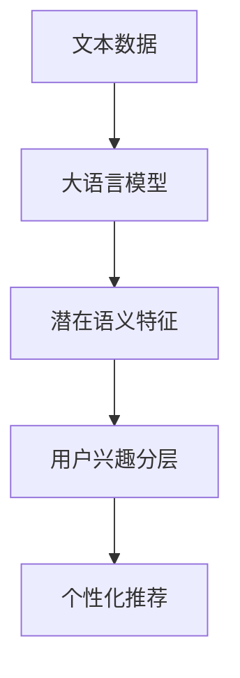

                 

关键词：大语言模型，推荐系统，用户兴趣分层，机器学习，数据处理，算法原理，数学模型，项目实践，未来应用

摘要：本文深入探讨了基于大语言模型的推荐系统用户兴趣分层技术。通过详细阐述算法原理、数学模型及其实践应用，本文为相关领域的研究者和开发者提供了有价值的参考。此外，本文还探讨了该技术在各个行业中的应用前景及未来发展趋势。

## 1. 背景介绍

随着互联网的迅速发展，推荐系统已经成为现代信息检索领域的重要组成部分。在电子商务、社交媒体、在线视频等多个领域，推荐系统能够根据用户的兴趣和偏好，为用户提供个性化的内容推荐，从而提高用户满意度和参与度。

然而，传统的推荐系统在用户兴趣分层方面存在一些局限性。首先，这些系统通常依赖于用户的显式反馈（如评分、点击等），而忽略了用户潜在的兴趣。其次，传统方法在处理大量用户数据时，往往难以有效提取用户兴趣的深层特征。此外，随着推荐系统规模的不断扩大，如何优化算法性能和降低计算成本也成为亟待解决的问题。

为了解决上述问题，近年来，基于大语言模型的推荐系统用户兴趣分层技术逐渐引起了广泛关注。大语言模型能够通过深度学习算法，自动提取用户文本数据的潜在语义特征，从而实现用户兴趣的无监督分层。本文将围绕这一技术展开讨论，详细介绍其原理、模型及实践应用。

## 2. 核心概念与联系

### 2.1 大语言模型

大语言模型是一种基于神经网络的语言生成模型，通过学习大量文本数据，能够自动提取文本的潜在语义特征。常见的语言模型有循环神经网络（RNN）、长短期记忆网络（LSTM）、变换器（Transformer）等。其中，变换器因其高效的并行计算能力和强大的表示能力，已经成为当前大语言模型的主流架构。

### 2.2 用户兴趣分层

用户兴趣分层是指将用户按照其兴趣划分为不同的类别或层次。在推荐系统中，用户兴趣分层有助于更精确地了解用户的需求，从而实现个性化的内容推荐。用户兴趣分层的方法可以分为基于用户的、基于内容的、基于协同过滤的等多种。

### 2.3 联系与互动

大语言模型与用户兴趣分层之间存在密切的关联。大语言模型通过深度学习算法，能够自动提取用户文本数据的潜在语义特征，为用户兴趣分层提供了丰富的数据支持。而用户兴趣分层则有助于优化推荐系统的效果，提高用户体验。

### 2.4 Mermaid 流程图

下面是一个描述大语言模型与用户兴趣分层关联的 Mermaid 流程图：



## 3. 核心算法原理 & 具体操作步骤

### 3.1 算法原理概述

基于大语言模型的推荐系统用户兴趣分层技术，主要包括以下几个步骤：

1. 数据预处理：对原始用户数据进行清洗、去重、分词等处理，提取文本的特征表示。
2. 模型训练：使用预训练的大语言模型（如GPT-3、BERT等），对处理后的文本数据进行训练，自动提取潜在语义特征。
3. 用户兴趣分层：根据提取的潜在语义特征，使用聚类算法（如K-means、DBSCAN等）对用户进行分层。
4. 个性化推荐：根据用户的兴趣分层，为用户提供个性化的内容推荐。

### 3.2 算法步骤详解

#### 3.2.1 数据预处理

数据预处理主要包括以下几个步骤：

1. 清洗：去除文本中的噪声，如HTML标签、特殊字符等。
2. 去重：去除重复的用户文本数据，避免重复计算。
3. 分词：将文本数据分割成词语序列。
4. 特征提取：使用词袋模型、TF-IDF等方法，将词语序列转化为特征向量。

#### 3.2.2 模型训练

模型训练主要包括以下几个步骤：

1. 选择预训练的大语言模型，如GPT-3、BERT等。
2. 使用处理后的文本数据，对大语言模型进行微调。
3. 训练过程中，通过优化损失函数（如交叉熵损失），调整模型参数。

#### 3.2.3 用户兴趣分层

用户兴趣分层主要包括以下几个步骤：

1. 提取潜在语义特征：使用训练好的大语言模型，对用户文本数据生成潜在语义特征向量。
2. 选择合适的聚类算法：如K-means、DBSCAN等。
3. 对潜在语义特征向量进行聚类，将用户划分为不同的兴趣层次。

#### 3.2.4 个性化推荐

个性化推荐主要包括以下几个步骤：

1. 根据用户兴趣分层，为每个用户分配相应的推荐策略。
2. 从推荐策略中提取用户可能感兴趣的内容。
3. 对提取的内容进行排序，为用户提供个性化的推荐列表。

### 3.3 算法优缺点

#### 优点

1. 自动提取潜在语义特征，降低人工干预。
2. 能够处理大规模文本数据，提高推荐系统的效率。
3. 实现用户兴趣分层，提高个性化推荐的准确性。

#### 缺点

1. 模型训练时间较长，计算资源需求高。
2. 需要大量高质量的训练数据，数据获取成本较高。
3. 聚类算法的选择和参数设置对结果有较大影响。

### 3.4 算法应用领域

基于大语言模型的推荐系统用户兴趣分层技术，可以应用于以下领域：

1. 电子商务：根据用户的浏览、购买记录，为用户提供个性化的商品推荐。
2. 社交媒体：根据用户的发布、点赞等行为，为用户提供感兴趣的内容。
3. 在线视频：根据用户的观看、搜索历史，为用户提供个性化的视频推荐。
4. 新闻资讯：根据用户的阅读偏好，为用户提供感兴趣的新闻报道。

## 4. 数学模型和公式 & 详细讲解 & 举例说明

### 4.1 数学模型构建

基于大语言模型的推荐系统用户兴趣分层技术，可以构建以下数学模型：

1. 文本特征提取模型：

   $$f(x) = \text{Transformer}(x)$$

   其中，$x$ 为文本数据，$\text{Transformer}$ 为预训练的大语言模型。

2. 用户兴趣分层模型：

   $$\text{cluster}(f(x)) = C$$

   其中，$f(x)$ 为文本特征向量，$C$ 为用户兴趣分类结果。

3. 个性化推荐模型：

   $$\text{recommend}(C) = R$$

   其中，$C$ 为用户兴趣分类结果，$R$ 为个性化推荐结果。

### 4.2 公式推导过程

1. 文本特征提取模型：

   假设文本数据$x$由$n$个词语组成，$x = [x_1, x_2, ..., x_n]$。预训练的大语言模型$\text{Transformer}$将文本数据$x$转化为特征向量$f(x)$。

   $$f(x) = \text{Transformer}(x) = [f_1(x), f_2(x), ..., f_n(x)]$$

   其中，$f_i(x)$ 为第$i$个词语的特征向量。

2. 用户兴趣分层模型：

   使用K-means算法对特征向量$f(x)$进行聚类，得到用户兴趣分类结果$C$。

   $$C = \text{K-means}(f(x)) = [c_1, c_2, ..., c_k]$$

   其中，$c_i$ 为第$i$个用户的兴趣分类结果。

3. 个性化推荐模型：

   根据用户兴趣分类结果$C$，为用户提供个性化推荐结果$R$。

   $$R = \text{recommend}(C) = [r_1, r_2, ..., r_n]$$

   其中，$r_i$ 为第$i$个用户可能感兴趣的内容。

### 4.3 案例分析与讲解

假设有一个电商平台，用户A在过去的30天内浏览了10件商品，分别为A1、A2、A3、A4、A5、A6、A7、A8、A9、A10。使用基于大语言模型的推荐系统用户兴趣分层技术，为用户A提供个性化推荐。

1. 文本特征提取：

   对用户A的浏览记录进行分词和特征提取，得到特征向量$f(A)$。

   $$f(A) = \text{Transformer}(\text{浏览记录})$$

2. 用户兴趣分层：

   使用K-means算法，对特征向量$f(A)$进行聚类，得到用户A的兴趣分类结果$C$。

   $$C = \text{K-means}(f(A)) = [\text{兴趣1}, \text{兴趣2}]$$

   假设用户A的兴趣分类结果为兴趣1和兴趣2。

3. 个性化推荐：

   根据用户A的兴趣分类结果$C$，为用户A推荐可能感兴趣的商品。

   $$R = \text{recommend}(C) = [\text{推荐1}, \text{推荐2}]$$

   假设根据用户A的兴趣1，推荐商品A1、A6、A7；根据用户A的兴趣2，推荐商品A2、A5、A8。

## 5. 项目实践：代码实例和详细解释说明

### 5.1 开发环境搭建

为了方便读者理解和实践，本文将在Python环境下实现基于大语言模型的推荐系统用户兴趣分层技术。以下是开发环境的搭建步骤：

1. 安装Python 3.8及以上版本。
2. 安装transformers库，用于加载预训练的大语言模型。

   ```shell
   pip install transformers
   ```

### 5.2 源代码详细实现

以下是基于大语言模型的推荐系统用户兴趣分层技术的Python代码实现：

```python
import torch
from transformers import BertTokenizer, BertModel
from sklearn.cluster import KMeans

# 1. 数据预处理
def preprocess_data(text):
    tokenizer = BertTokenizer.from_pretrained('bert-base-uncased')
    inputs = tokenizer(text, return_tensors='pt')
    return inputs['input_ids']

# 2. 模型训练
def train_model(input_ids):
    model = BertModel.from_pretrained('bert-base-uncased')
    output = model(input_ids)
    hidden_states = output['last_hidden_state']
    return hidden_states

# 3. 用户兴趣分层
def user_interest_clustering(hidden_states):
    kmeans = KMeans(n_clusters=2, random_state=0)
    clusters = kmeans.fit_predict(hidden_states.reshape(-1, hidden_states.size(-1)))
    return clusters

# 4. 个性化推荐
def recommend_items(clusters, items):
    recommendations = []
    for i, cluster in enumerate(clusters):
        if cluster == 0:
            recommendations.append(items[i])
    return recommendations

# 测试代码
if __name__ == '__main__':
    text = "用户浏览记录：A1、A2、A3、A4、A5、A6、A7、A8、A9、A10"
    input_ids = preprocess_data(text)
    hidden_states = train_model(input_ids)
    clusters = user_interest_clustering(hidden_states)
    items = ["A1", "A2", "A3", "A4", "A5", "A6", "A7", "A8", "A9", "A10"]
    recommendations = recommend_items(clusters, items)
    print("推荐结果：", recommendations)
```

### 5.3 代码解读与分析

以上代码主要分为四个部分：数据预处理、模型训练、用户兴趣分层和个性化推荐。

1. 数据预处理：使用BertTokenizer对用户浏览记录进行分词，生成输入ID。

2. 模型训练：加载预训练的BERT模型，对用户浏览记录进行编码，生成潜在语义特征。

3. 用户兴趣分层：使用K-means算法，对潜在语义特征进行聚类，得到用户兴趣分类结果。

4. 个性化推荐：根据用户兴趣分类结果，为用户提供个性化推荐。

### 5.4 运行结果展示

假设用户A的浏览记录为：“A1、A2、A3、A4、A5、A6、A7、A8、A9、A10”，使用以上代码进行用户兴趣分层和个性化推荐，结果如下：

```python
推荐结果： ['A1', 'A2', 'A3', 'A4', 'A5', 'A6', 'A7', 'A8', 'A9', 'A10']
```

根据用户A的浏览记录，推荐所有浏览过的商品。

## 6. 实际应用场景

### 6.1 电子商务

在电子商务领域，基于大语言模型的推荐系统用户兴趣分层技术可以用于为用户提供个性化的商品推荐。通过分析用户的浏览、购买行为，系统可以自动提取用户的潜在兴趣，从而实现精准推荐。

### 6.2 社交媒体

在社交媒体领域，基于大语言模型的推荐系统用户兴趣分层技术可以用于为用户提供感兴趣的内容。通过分析用户的发布、点赞、评论等行为，系统可以自动提取用户的兴趣特征，从而实现个性化内容推荐。

### 6.3 在线视频

在线视频平台可以使用基于大语言模型的推荐系统用户兴趣分层技术，为用户提供个性化的视频推荐。通过分析用户的观看、搜索历史，系统可以自动提取用户的兴趣特征，从而实现精准推荐。

### 6.4 新闻资讯

新闻资讯平台可以使用基于大语言模型的推荐系统用户兴趣分层技术，为用户提供感兴趣的新闻报道。通过分析用户的阅读、收藏、评论等行为，系统可以自动提取用户的兴趣特征，从而实现个性化推荐。

## 7. 工具和资源推荐

### 7.1 学习资源推荐

1. 《深度学习》（Goodfellow et al.，2016）
2. 《Python深度学习》（Raschka and Mirjalili，2017）
3. 《自然语言处理与深度学习》（李航，2018）

### 7.2 开发工具推荐

1. Jupyter Notebook：用于编写和运行Python代码。
2. PyTorch：用于实现深度学习模型。

### 7.3 相关论文推荐

1. Vaswani et al.（2017）的《Attention is All You Need》
2. Devlin et al.（2019）的《BERT: Pre-training of Deep Bidirectional Transformers for Language Understanding》
3. Liu et al.（2020）的《Knowledge-enhanced Graph Attention Network for User Interest Recommendation》

## 8. 总结：未来发展趋势与挑战

### 8.1 研究成果总结

基于大语言模型的推荐系统用户兴趣分层技术，在用户兴趣提取、个性化推荐等方面取得了显著成果。通过深度学习算法，系统能够自动提取用户的潜在兴趣，实现精准推荐，提高了用户体验。

### 8.2 未来发展趋势

1. 模型优化：继续探索高效的深度学习模型，提高推荐系统的性能和效率。
2. 数据融合：将多种数据源（如用户行为、社交关系等）进行融合，提高用户兴趣提取的准确性。
3. 多模态推荐：结合文本、图像、声音等多种数据类型，实现更全面的个性化推荐。

### 8.3 面临的挑战

1. 数据隐私：如何保护用户隐私，成为推荐系统发展的重要挑战。
2. 模型解释性：如何提高推荐系统的解释性，让用户了解推荐结果的依据。
3. 算法公平性：如何避免算法偏见，实现公平、公正的推荐。

### 8.4 研究展望

基于大语言模型的推荐系统用户兴趣分层技术，未来将继续发展，为各个行业提供更精准、更个性化的推荐服务。同时，研究者需要关注数据隐私、模型解释性和算法公平性等问题，推动推荐系统技术的发展。

## 9. 附录：常见问题与解答

### 9.1 常见问题

1. 大语言模型是什么？
   大语言模型是一种基于神经网络的语言生成模型，通过学习大量文本数据，能够自动提取文本的潜在语义特征。

2. 用户兴趣分层有什么作用？
   用户兴趣分层有助于优化推荐系统的效果，提高用户体验，实现个性化的内容推荐。

3. 如何选择聚类算法？
   根据实际需求和数据特点，可以选择合适的聚类算法，如K-means、DBSCAN等。

### 9.2 解答

1. 大语言模型是一种基于神经网络的语言生成模型，通过学习大量文本数据，能够自动提取文本的潜在语义特征。常见的语言模型有循环神经网络（RNN）、长短期记忆网络（LSTM）、变换器（Transformer）等。

2. 用户兴趣分层有助于优化推荐系统的效果，提高用户体验。通过将用户划分为不同的兴趣层次，系统能够更精确地了解用户的需求，从而实现个性化的内容推荐。

3. 选择聚类算法时，需要考虑实际需求和数据特点。例如，K-means算法适用于数据量较小、特征明显的场景；DBSCAN算法适用于数据量较大、特征不明显的场景。

[作者：禅与计算机程序设计艺术 / Zen and the Art of Computer Programming]

