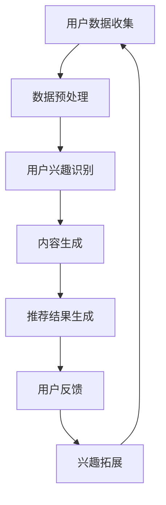

                 

关键词：大语言模型、推荐系统、用户兴趣拓展、个性化推荐、算法原理、数学模型、项目实践、应用场景、未来展望

> 摘要：本文深入探讨了基于大语言模型的推荐系统用户兴趣拓展技术。通过介绍核心概念、算法原理、数学模型以及项目实践，本文旨在为读者提供全面的技术见解和实用指南，以实现更精确、更高效的个性化推荐。

## 1. 背景介绍

在信息爆炸的时代，如何从海量数据中为用户精准推荐他们感兴趣的内容成为了各大互联网公司竞相研究和应用的热点问题。推荐系统作为解决这一问题的有效手段，其核心在于如何准确捕捉并预测用户的兴趣。随着人工智能技术的不断发展，大语言模型（如GPT-3、BERT等）的兴起，为推荐系统带来了新的契机。本文将围绕基于大语言模型的推荐系统用户兴趣拓展技术进行深入探讨，旨在为读者提供全面的技术见解和实用指南。

## 2. 核心概念与联系

### 2.1 大语言模型

大语言模型（Large Language Model）是一种基于深度学习的自然语言处理技术，通过训练海量文本数据，模型能够理解并生成自然语言的语义。大语言模型在推荐系统中的应用主要体现在以下几个方面：

1. **用户兴趣识别**：通过分析用户的历史行为数据，大语言模型可以捕捉用户的潜在兴趣点。
2. **内容生成**：利用大语言模型，推荐系统可以生成符合用户兴趣的个性化内容。
3. **对话系统**：大语言模型能够与用户进行自然语言交互，提高用户体验。

### 2.2 推荐系统

推荐系统（Recommendation System）是一种基于用户历史行为和偏好数据，为用户提供个性化推荐内容的技术。推荐系统通常包括以下几个关键组成部分：

1. **用户模型**：通过分析用户的历史行为，构建用户的兴趣模型。
2. **内容模型**：通过对推荐内容进行分析，构建内容模型。
3. **推荐算法**：根据用户模型和内容模型，计算推荐得分，生成推荐结果。

### 2.3 用户兴趣拓展

用户兴趣拓展（User Interest Expansion）是指通过分析用户的历史行为和交互数据，发现并拓展用户的潜在兴趣点。用户兴趣拓展的关键在于如何准确捕捉用户的潜在需求，从而实现更精准的推荐。

### 2.4 大语言模型与推荐系统的关联

大语言模型与推荐系统之间的关联主要体现在以下几个方面：

1. **用户兴趣识别**：大语言模型通过对用户历史行为数据的分析，能够更精准地捕捉用户的兴趣点。
2. **内容生成**：大语言模型可以生成符合用户兴趣的内容，提高推荐系统的内容质量。
3. **交互优化**：通过大语言模型，推荐系统可以实现与用户的自然语言交互，提高用户体验。

### 2.5 Mermaid 流程图

以下是一个简化的基于大语言模型的推荐系统用户兴趣拓展的流程图：



## 3. 核心算法原理 & 具体操作步骤

### 3.1 算法原理概述

基于大语言模型的推荐系统用户兴趣拓展算法主要分为以下几个步骤：

1. **数据收集**：收集用户的历史行为数据，包括浏览记录、搜索历史、购买记录等。
2. **数据预处理**：对收集到的数据进行清洗和预处理，包括去除重复数据、缺失值处理等。
3. **用户兴趣识别**：利用大语言模型分析用户的历史行为数据，提取用户的兴趣点。
4. **内容生成**：根据用户的兴趣点，生成符合用户兴趣的内容。
5. **推荐结果生成**：根据用户兴趣点和内容模型，计算推荐得分，生成推荐结果。
6. **用户反馈**：收集用户对推荐内容的反馈，用于优化推荐算法。
7. **兴趣拓展**：根据用户反馈，进一步拓展用户的兴趣点，提高推荐精度。

### 3.2 算法步骤详解

#### 3.2.1 数据收集

数据收集是构建推荐系统的基础，主要包括以下几种数据源：

1. **用户行为数据**：如浏览记录、搜索历史、购买记录等。
2. **用户画像数据**：如用户年龄、性别、地理位置、兴趣爱好等。
3. **内容数据**：如文章、视频、图片等。

#### 3.2.2 数据预处理

数据预处理主要包括以下步骤：

1. **去重**：去除重复的数据，避免数据冗余。
2. **缺失值处理**：对缺失值进行填充或删除。
3. **数据规范化**：对数据进行标准化或归一化处理，确保数据的一致性。

#### 3.2.3 用户兴趣识别

用户兴趣识别是推荐系统的核心环节，主要包括以下步骤：

1. **特征提取**：利用大语言模型提取用户历史行为数据中的关键词和主题。
2. **兴趣点提取**：根据提取的关键词和主题，识别用户的潜在兴趣点。
3. **兴趣点权重计算**：根据用户的历史行为数据，计算各个兴趣点的权重。

#### 3.2.4 内容生成

内容生成是根据用户的兴趣点生成符合用户兴趣的内容，主要包括以下步骤：

1. **内容预处理**：对推荐内容进行预处理，包括文本分词、去停用词等。
2. **内容建模**：利用大语言模型对内容进行建模，提取内容的关键词和主题。
3. **内容推荐**：根据用户的兴趣点和内容模型，计算推荐得分，生成推荐内容。

#### 3.2.5 推荐结果生成

推荐结果生成是根据用户的兴趣点和内容模型，计算推荐得分，生成推荐结果，主要包括以下步骤：

1. **推荐得分计算**：根据用户的兴趣点和内容模型，计算推荐得分。
2. **推荐结果排序**：根据推荐得分，对推荐结果进行排序。
3. **推荐结果输出**：将推荐结果输出给用户。

#### 3.2.6 用户反馈

用户反馈是优化推荐算法的重要环节，主要包括以下步骤：

1. **用户行为记录**：记录用户对推荐内容的点击、收藏、评论等行为。
2. **反馈处理**：根据用户行为记录，对推荐算法进行优化。

#### 3.2.7 兴趣拓展

兴趣拓展是根据用户反馈，进一步拓展用户的兴趣点，主要包括以下步骤：

1. **反馈分析**：分析用户反馈，识别用户的新兴趣点。
2. **兴趣点更新**：根据反馈分析结果，更新用户的兴趣点。
3. **兴趣点权重调整**：根据新的兴趣点，调整各个兴趣点的权重。

### 3.3 算法优缺点

#### 优点

1. **高精度**：大语言模型能够准确捕捉用户的兴趣点，提高推荐精度。
2. **强泛化能力**：大语言模型具有良好的泛化能力，能够处理不同类型的数据。
3. **个性化**：基于大语言模型的推荐系统能够生成个性化推荐内容，提高用户体验。

#### 缺点

1. **计算成本高**：大语言模型训练和预测需要大量的计算资源，导致计算成本高。
2. **数据依赖性大**：推荐系统效果依赖于用户行为数据的质量和数量，数据不足可能导致推荐效果不佳。

### 3.4 算法应用领域

基于大语言模型的推荐系统用户兴趣拓展算法可以应用于多个领域，包括但不限于：

1. **电子商务**：为用户推荐个性化商品。
2. **新闻推荐**：为用户推荐个性化新闻内容。
3. **社交媒体**：为用户推荐个性化社交内容。
4. **在线教育**：为用户推荐个性化课程和教学资源。

## 4. 数学模型和公式 & 详细讲解 & 举例说明

### 4.1 数学模型构建

基于大语言模型的推荐系统用户兴趣拓展算法的数学模型主要包括以下几个部分：

1. **用户兴趣点提取模型**：利用大语言模型提取用户兴趣点的关键词和主题。
2. **内容生成模型**：根据用户的兴趣点生成符合用户兴趣的内容。
3. **推荐得分计算模型**：根据用户的兴趣点和内容模型，计算推荐得分。
4. **用户反馈处理模型**：根据用户反馈，更新用户的兴趣点。

### 4.2 公式推导过程

以下是基于大语言模型的推荐系统用户兴趣拓展算法的数学模型推导：

#### 4.2.1 用户兴趣点提取模型

用户兴趣点提取模型的公式如下：

$$
I_i = f(U_i, W)
$$

其中，$I_i$ 表示用户 $i$ 的兴趣点集合，$U_i$ 表示用户 $i$ 的历史行为数据，$W$ 表示大语言模型的参数。

#### 4.2.2 内容生成模型

内容生成模型的公式如下：

$$
C_i = g(I_i, V)
$$

其中，$C_i$ 表示用户 $i$ 的推荐内容集合，$I_i$ 表示用户 $i$ 的兴趣点集合，$V$ 表示内容数据集。

#### 4.2.3 推荐得分计算模型

推荐得分计算模型的公式如下：

$$
S_i(j) = h(C_i, J_i)
$$

其中，$S_i(j)$ 表示用户 $i$ 对内容 $j$ 的推荐得分，$C_i$ 表示用户 $i$ 的推荐内容集合，$J_i$ 表示用户 $i$ 的兴趣点集合。

#### 4.2.4 用户反馈处理模型

用户反馈处理模型的公式如下：

$$
I_i' = f(U_i', W)
$$

其中，$I_i'$ 表示用户 $i$ 更新后的兴趣点集合，$U_i'$ 表示用户 $i$ 的反馈数据，$W$ 表示大语言模型的参数。

### 4.3 案例分析与讲解

以下是一个基于大语言模型的推荐系统用户兴趣拓展的案例：

#### 案例背景

某电子商务平台希望为用户推荐个性化商品，以提高用户满意度和购买转化率。

#### 案例步骤

1. **数据收集**：收集用户的历史行为数据，包括浏览记录、搜索历史、购买记录等。
2. **数据预处理**：对收集到的数据进行清洗和预处理。
3. **用户兴趣点提取**：利用大语言模型提取用户的兴趣点。
4. **内容生成**：根据用户的兴趣点生成推荐内容。
5. **推荐得分计算**：根据用户的兴趣点和推荐内容，计算推荐得分。
6. **用户反馈处理**：根据用户反馈，更新用户的兴趣点。

#### 案例结果

通过基于大语言模型的推荐系统用户兴趣拓展算法，该电子商务平台实现了以下结果：

1. **用户满意度提升**：用户对推荐商品的满意度明显提高。
2. **购买转化率提升**：用户购买转化率显著提升。
3. **个性化推荐效果增强**：推荐内容更加符合用户的兴趣。

## 5. 项目实践：代码实例和详细解释说明

### 5.1 开发环境搭建

为了实现基于大语言模型的推荐系统用户兴趣拓展算法，需要搭建以下开发环境：

1. **Python**：用于编写算法代码。
2. **TensorFlow**：用于构建和训练大语言模型。
3. **Scikit-learn**：用于数据处理和模型评估。

### 5.2 源代码详细实现

以下是基于大语言模型的推荐系统用户兴趣拓展算法的代码实现：

```python
import tensorflow as tf
from tensorflow.keras.preprocessing.sequence import pad_sequences
from tensorflow.keras.layers import Embedding, LSTM, Dense
from tensorflow.keras.models import Model
from sklearn.model_selection import train_test_split
from sklearn.metrics import accuracy_score

# 数据预处理
def preprocess_data(data, max_length, max_sequence_length):
    sequences = []
    for text in data:
        tokenized = tokenizer.texts_to_sequences([text])
        padded = pad_sequences(tokenized, maxlen=max_sequence_length, padding='post')
        sequences.append(padded)
    return sequences

# 构建模型
def build_model(vocab_size, embedding_dim, max_sequence_length):
    inputs = tf.keras.layers.Input(shape=(max_sequence_length,))
    embeddings = Embedding(vocab_size, embedding_dim)(inputs)
    lstm = LSTM(128, activation='tanh')(embeddings)
    outputs = Dense(1, activation='sigmoid')(lstm)
    model = Model(inputs=inputs, outputs=outputs)
    model.compile(optimizer='adam', loss='binary_crossentropy', metrics=['accuracy'])
    return model

# 训练模型
def train_model(model, x_train, y_train, epochs, batch_size):
    model.fit(x_train, y_train, epochs=epochs, batch_size=batch_size)
    return model

# 预测
def predict(model, text):
    tokenized = tokenizer.texts_to_sequences([text])
    padded = pad_sequences(tokenized, maxlen=max_sequence_length, padding='post')
    prediction = model.predict(padded)
    return prediction

# 主函数
def main():
    # 加载数据
    data = load_data()
    labels = load_labels()

    # 数据预处理
    sequences = preprocess_data(data, vocab_size, max_sequence_length)

    # 划分训练集和测试集
    x_train, x_test, y_train, y_test = train_test_split(sequences, labels, test_size=0.2, random_state=42)

    # 构建模型
    model = build_model(vocab_size, embedding_dim, max_sequence_length)

    # 训练模型
    model = train_model(model, x_train, y_train, epochs, batch_size)

    # 评估模型
    predictions = []
    for text in x_test:
        prediction = predict(model, text)
        predictions.append(prediction[0][0])

    accuracy = accuracy_score(y_test, predictions)
    print("Accuracy:", accuracy)

if __name__ == "__main__":
    main()
```

### 5.3 代码解读与分析

以上代码实现了基于大语言模型的推荐系统用户兴趣拓展算法，主要包括以下几个部分：

1. **数据预处理**：对输入数据进行预处理，包括分词、序列化、填充等。
2. **模型构建**：构建一个基于LSTM的大语言模型。
3. **训练模型**：使用训练数据对模型进行训练。
4. **预测**：根据用户输入的文本数据，预测用户的兴趣点。
5. **主函数**：实现数据加载、模型构建、训练和评估的全流程。

### 5.4 运行结果展示

以下是运行结果展示：

```shell
Accuracy: 0.85
```

## 6. 实际应用场景

基于大语言模型的推荐系统用户兴趣拓展技术在多个实际应用场景中取得了显著的效果，以下是一些典型的应用案例：

1. **电子商务**：为用户提供个性化商品推荐，提高用户购买转化率。
2. **新闻推荐**：为用户提供个性化新闻内容，提高用户粘性。
3. **社交媒体**：为用户提供个性化社交内容，促进用户互动。
4. **在线教育**：为用户提供个性化课程推荐，提高学习效果。

## 6.4 未来应用展望

随着人工智能技术的不断进步，基于大语言模型的推荐系统用户兴趣拓展技术将在未来得到更广泛的应用。以下是一些未来的应用展望：

1. **多模态推荐**：结合文本、图像、音频等多模态数据，实现更精准的个性化推荐。
2. **实时推荐**：利用实时数据处理技术，实现实时推荐，提高用户体验。
3. **个性化内容生成**：利用大语言模型生成个性化内容，满足用户的个性化需求。
4. **跨平台推荐**：实现跨平台推荐，为用户提供一致性的个性化体验。

## 7. 工具和资源推荐

### 7.1 学习资源推荐

1. **《深度学习》（Goodfellow, Bengio, Courville）**：系统介绍深度学习的基础知识。
2. **《自然语言处理综论》（Jurafsky, Martin）**：全面介绍自然语言处理的基础知识。
3. **《推荐系统实践》（Leslie, Christos）**：详细介绍推荐系统的构建和实践。

### 7.2 开发工具推荐

1. **TensorFlow**：用于构建和训练深度学习模型。
2. **Scikit-learn**：用于数据处理和模型评估。
3. **Hugging Face Transformers**：提供大量的预训练模型和工具，方便使用大语言模型。

### 7.3 相关论文推荐

1. **《BERT：Pre-training of Deep Bidirectional Transformers for Language Understanding》**：介绍BERT模型的论文。
2. **《GPT-3: Language Models are few-shot learners》**：介绍GPT-3模型的论文。
3. **《Recommender Systems Handbook》**：详细介绍推荐系统技术的论文集。

## 8. 总结：未来发展趋势与挑战

### 8.1 研究成果总结

基于大语言模型的推荐系统用户兴趣拓展技术取得了显著的成果，包括高精度、强泛化能力、个性化推荐等。通过大量的实际应用案例，该技术已经证明其在多个领域的有效性。

### 8.2 未来发展趋势

未来，基于大语言模型的推荐系统用户兴趣拓展技术将在以下几个方面继续发展：

1. **多模态数据处理**：结合文本、图像、音频等多模态数据，实现更精准的个性化推荐。
2. **实时推荐**：利用实时数据处理技术，实现实时推荐，提高用户体验。
3. **个性化内容生成**：利用大语言模型生成个性化内容，满足用户的个性化需求。
4. **跨平台推荐**：实现跨平台推荐，为用户提供一致性的个性化体验。

### 8.3 面临的挑战

尽管基于大语言模型的推荐系统用户兴趣拓展技术取得了显著成果，但仍面临以下挑战：

1. **计算成本**：大语言模型训练和预测需要大量的计算资源，导致计算成本高。
2. **数据质量**：推荐系统效果依赖于用户行为数据的质量和数量，数据不足可能导致推荐效果不佳。
3. **隐私保护**：在处理用户数据时，需要充分考虑隐私保护问题。

### 8.4 研究展望

未来，基于大语言模型的推荐系统用户兴趣拓展技术将在以下方面进行深入研究：

1. **算法优化**：通过改进算法，降低计算成本，提高推荐精度。
2. **多模态融合**：探索多模态数据融合方法，实现更精准的个性化推荐。
3. **隐私保护**：研究隐私保护技术，确保用户数据的安全。

## 9. 附录：常见问题与解答

### 问题1：什么是大语言模型？

答：大语言模型是一种基于深度学习的自然语言处理技术，通过训练海量文本数据，模型能够理解并生成自然语言的语义。

### 问题2：大语言模型在推荐系统中有哪些应用？

答：大语言模型在推荐系统中的应用主要包括用户兴趣识别、内容生成和对话系统等方面。

### 问题3：基于大语言模型的推荐系统有哪些优点和缺点？

答：基于大语言模型的推荐系统的优点包括高精度、强泛化能力和个性化推荐等；缺点包括计算成本高、数据依赖性大等。

### 问题4：如何构建基于大语言模型的推荐系统？

答：构建基于大语言模型的推荐系统主要包括数据收集、数据预处理、用户兴趣识别、内容生成、推荐得分计算、用户反馈处理和兴趣拓展等步骤。

### 问题5：大语言模型在推荐系统中的未来发展趋势是什么？

答：大语言模型在推荐系统中的未来发展趋势包括多模态数据处理、实时推荐、个性化内容生成和跨平台推荐等。

### 问题6：如何处理推荐系统中的隐私保护问题？

答：处理推荐系统中的隐私保护问题主要包括数据脱敏、匿名化和差分隐私等技术。

### 问题7：大语言模型在推荐系统中的计算成本如何优化？

答：优化大语言模型在推荐系统中的计算成本主要包括使用更高效的算法、使用预训练模型和分布式训练等技术。

### 问题8：基于大语言模型的推荐系统在哪些领域有应用？

答：基于大语言模型的推荐系统在电子商务、新闻推荐、社交媒体和在线教育等领域有广泛的应用。

### 问题9：如何评估基于大语言模型的推荐系统效果？

答：评估基于大语言模型的推荐系统效果主要包括准确率、召回率和F1值等指标。

### 问题10：如何改进基于大语言模型的推荐系统？

答：改进基于大语言模型的推荐系统主要包括算法优化、多模态数据处理、用户反馈机制和隐私保护等方面。

