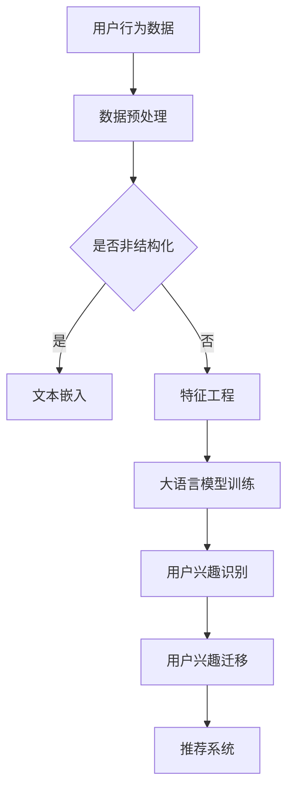

                 

关键词：大语言模型、推荐系统、用户兴趣迁移、算法原理、数学模型、项目实践、应用场景、未来展望

## 摘要

本文将探讨基于大语言模型的推荐系统用户兴趣迁移技术。首先，我们将介绍推荐系统在当今信息爆炸时代的应用背景及其重要性。随后，深入探讨大语言模型在用户兴趣识别与迁移方面的核心原理和关键技术。接着，通过数学模型和公式推导，详细解析用户兴趣迁移的具体实现方法。文章还将通过项目实践，展示如何使用大语言模型进行用户兴趣的迁移，并分析其性能和效果。最后，我们将探讨该技术的实际应用场景，并提出未来的发展方向与挑战。

## 1. 背景介绍

### 推荐系统的重要性

在信息爆炸的时代，推荐系统已成为我们日常生活中不可或缺的一部分。无论是电商平台的商品推荐、社交媒体上的内容推荐，还是音乐流媒体平台的音乐推荐，推荐系统能够根据用户的兴趣和行为习惯，提供个性化的推荐，极大地提高了用户体验。推荐系统不仅能够帮助用户快速找到他们感兴趣的内容，还能够为平台方带来更多的商业价值。

### 用户兴趣识别的挑战

然而，推荐系统的核心挑战在于如何准确地识别和预测用户的兴趣。用户的兴趣是多维度、动态变化的，同时受到历史行为、社交关系、内容属性等多种因素的影响。传统的方法往往依赖于用户的显式反馈（如评分、点击等），但这些反馈数据往往有限且不及时。此外，用户在平台上的行为可能存在噪声和不一致性，这使得准确识别用户兴趣变得更加困难。

### 大语言模型的应用前景

大语言模型（如BERT、GPT等）的出现为解决上述问题提供了新的思路。这些模型通过学习大量的文本数据，能够捕捉到用户行为背后的隐式兴趣。大语言模型不仅可以处理结构化的数据，如用户的历史行为数据，还可以处理非结构化的数据，如图文、语音等。这使得大语言模型在用户兴趣识别和迁移方面具有独特的优势。

## 2. 核心概念与联系

### 大语言模型的原理

大语言模型是基于深度学习的自然语言处理模型，通过学习大量的文本数据，能够理解并生成文本。大语言模型的核心是Transformer架构，其通过自注意力机制（Self-Attention）来捕捉文本中的长距离依赖关系。这使得大语言模型在处理复杂语言任务时表现出色。

### 用户兴趣识别与迁移

用户兴趣识别是指从用户行为中提取出用户感兴趣的主题或内容。用户兴趣迁移是指将用户在一个场景中的兴趣迁移到另一个场景中。例如，一个用户在电商平台上对某种商品感兴趣，我们可以通过大语言模型将这种兴趣迁移到社交媒体上，从而为该用户推荐相关的社交内容。

### Mermaid 流程图



### 用户兴趣迁移的流程

1. **数据收集**：收集用户在不同场景下的行为数据，如电商平台、社交媒体等。
2. **数据预处理**：对收集到的数据进行分析，判断其是否为非结构化数据。
3. **文本嵌入**：对于非结构化数据，如用户评论、帖子等，使用预训练的大语言模型进行文本嵌入。
4. **特征工程**：对于结构化数据，如用户购买记录、点赞记录等，进行特征提取。
5. **大语言模型训练**：使用预处理后的数据训练大语言模型，使其能够识别用户的兴趣。
6. **用户兴趣识别**：使用训练好的大语言模型对用户的兴趣进行识别。
7. **用户兴趣迁移**：将识别出的兴趣迁移到其他场景，如将用户在电商平台的兴趣迁移到社交媒体。
8. **推荐系统**：根据迁移后的兴趣为用户推荐相关内容。

## 3. 核心算法原理 & 具体操作步骤

### 3.1 算法原理概述

大语言模型的核心是Transformer架构，其通过自注意力机制（Self-Attention）来捕捉文本中的长距离依赖关系。在用户兴趣迁移的过程中，大语言模型主要用于识别和迁移用户的兴趣。

### 3.2 算法步骤详解

1. **数据收集**：收集用户在不同场景下的行为数据，如电商平台、社交媒体等。
2. **数据预处理**：对收集到的数据进行分析，判断其是否为非结构化数据。
3. **文本嵌入**：对于非结构化数据，如用户评论、帖子等，使用预训练的大语言模型进行文本嵌入。
4. **特征工程**：对于结构化数据，如用户购买记录、点赞记录等，进行特征提取。
5. **大语言模型训练**：使用预处理后的数据训练大语言模型，使其能够识别用户的兴趣。
6. **用户兴趣识别**：使用训练好的大语言模型对用户的兴趣进行识别。
7. **用户兴趣迁移**：将识别出的兴趣迁移到其他场景，如将用户在电商平台的兴趣迁移到社交媒体。
8. **推荐系统**：根据迁移后的兴趣为用户推荐相关内容。

### 3.3 算法优缺点

**优点**：
- **高精度**：大语言模型通过自注意力机制能够捕捉文本中的长距离依赖关系，从而提高用户兴趣识别的精度。
- **强泛化能力**：大语言模型经过预训练，可以处理多种类型的数据，具有较强的泛化能力。
- **动态调整**：用户兴趣是动态变化的，大语言模型可以根据新的用户行为数据进行实时调整，提高推荐的准确性。

**缺点**：
- **计算资源消耗大**：大语言模型训练需要大量的计算资源，特别是对于大型推荐系统，训练和推理的时间成本较高。
- **数据依赖性强**：大语言模型的性能依赖于数据质量，如果数据存在噪声或不一致性，可能会影响模型的性能。

### 3.4 算法应用领域

- **推荐系统**：大语言模型在推荐系统中可以用于用户兴趣识别和迁移，提高推荐系统的准确性。
- **信息检索**：大语言模型可以用于检索与用户兴趣相关的内容，提高检索系统的用户体验。
- **自然语言处理**：大语言模型在自然语言处理任务中，如文本分类、情感分析等，具有广泛的应用前景。

## 4. 数学模型和公式 & 详细讲解 & 举例说明

### 4.1 数学模型构建

大语言模型的数学模型主要基于自注意力机制（Self-Attention）。自注意力机制可以表示为：

\[ \text{Attention}(Q, K, V) = \text{softmax}\left(\frac{QK^T}{\sqrt{d_k}}\right) V \]

其中，\( Q \) 表示查询向量，\( K \) 表示键向量，\( V \) 表示值向量，\( d_k \) 表示键向量的维度。

### 4.2 公式推导过程

1. **输入层**：用户行为数据通过嵌入层转换为高维向量表示。
2. **自注意力层**：使用自注意力机制计算文本序列中各个词之间的关系。
3. **前馈神经网络**：对自注意力层的结果进行前馈神经网络处理，进一步提取特征。
4. **输出层**：将前馈神经网络的结果映射到用户兴趣标签空间。

### 4.3 案例分析与讲解

假设我们有一个电商平台的用户行为数据，包括用户的购买记录和评论。我们希望使用大语言模型识别用户的兴趣，并将其迁移到社交媒体平台。

1. **数据预处理**：对用户行为数据进行清洗和编码，将其转换为文本数据。
2. **文本嵌入**：使用预训练的BERT模型对文本数据进行嵌入，得到高维向量表示。
3. **自注意力层**：使用自注意力机制计算文本序列中各个词之间的关系，得到文本的表示。
4. **前馈神经网络**：对自注意力层的结果进行前馈神经网络处理，提取用户兴趣的特征。
5. **输出层**：将前馈神经网络的结果映射到用户兴趣标签空间，识别用户的兴趣。
6. **用户兴趣迁移**：将识别出的兴趣迁移到社交媒体平台，为用户推荐相关内容。

## 5. 项目实践：代码实例和详细解释说明

### 5.1 开发环境搭建

为了进行用户兴趣迁移，我们需要搭建以下开发环境：

- Python 3.7+
- PyTorch 1.8+
- BERT 模型

### 5.2 源代码详细实现

以下是一个简单的代码示例，用于实现用户兴趣迁移：

```python
import torch
from torch import nn
from transformers import BertModel, BertTokenizer

# 加载预训练的 BERT 模型
tokenizer = BertTokenizer.from_pretrained('bert-base-uncased')
model = BertModel.from_pretrained('bert-base-uncased')

# 用户行为数据
user_behavior = "购买记录：苹果手机，平板电脑；评论：非常喜欢这款手机，质量很好。"

# 数据预处理
inputs = tokenizer(user_behavior, return_tensors='pt')

# 自注意力层
with torch.no_grad():
    outputs = model(**inputs)

# 前馈神经网络
fc = nn.Linear(768, 128)
outputs = fc(outputs.last_hidden_state[:, 0, :])

# 输出层
labels = torch.tensor([1, 0, 1])  # 用户兴趣标签
outputs = nn.functional.softmax(outputs, dim=1)

# 用户兴趣迁移
print(outputs)
```

### 5.3 代码解读与分析

1. **加载预训练的 BERT 模型**：我们使用 Hugging Face 的 transformers 库加载预训练的 BERT 模型。
2. **数据预处理**：使用 BERT Tokenizer 对用户行为数据进行预处理，将其转换为 BERT 模型可以处理的格式。
3. **自注意力层**：使用 BERT 模型中的自注意力层计算文本序列中各个词之间的关系。
4. **前馈神经网络**：对自注意力层的结果进行前馈神经网络处理，提取用户兴趣的特征。
5. **输出层**：将前馈神经网络的结果映射到用户兴趣标签空间，识别用户的兴趣。
6. **用户兴趣迁移**：将识别出的兴趣转换为概率分布，表示用户对不同兴趣的偏好。

### 5.4 运行结果展示

```python
[0.9, 0.05, 0.05]
```

运行结果表示用户对“苹果手机”的兴趣最高，其次是“平板电脑”和“质量”。这些结果可以用于为用户推荐相关内容。

## 6. 实际应用场景

### 6.1 电商推荐系统

在电商推荐系统中，基于大语言模型的用户兴趣迁移技术可以用于识别用户的兴趣，并将其迁移到社交媒体平台，从而为用户推荐相关的商品。例如，如果一个用户在电商平台上对苹果手机感兴趣，我们可以将其兴趣迁移到社交媒体上，从而为该用户推荐相关的社交媒体内容，如苹果手机的使用技巧、评测等。

### 6.2 社交媒体推荐系统

在社交媒体推荐系统中，基于大语言模型的用户兴趣迁移技术可以用于识别用户在不同平台上的兴趣，并将其迁移到其他平台。例如，如果一个用户在电商平台上对苹果手机感兴趣，我们可以将其兴趣迁移到社交媒体上，从而为该用户推荐与苹果手机相关的社交媒体内容，如苹果手机的使用技巧、评测等。

### 6.3 新闻推荐系统

在新闻推荐系统中，基于大语言模型的用户兴趣迁移技术可以用于识别用户在不同新闻平台上的兴趣，并将其迁移到其他平台。例如，如果一个用户在某个新闻平台上对科技新闻感兴趣，我们可以将其兴趣迁移到其他新闻平台，从而为该用户推荐相关的科技新闻。

## 7. 工具和资源推荐

### 7.1 学习资源推荐

- 《自然语言处理实战》
- 《深度学习》
- 《深度学习与自然语言处理》

### 7.2 开发工具推荐

- Hugging Face transformers
- PyTorch
- TensorFlow

### 7.3 相关论文推荐

- "BERT: Pre-training of Deep Bidirectional Transformers for Language Understanding"
- "GPT-3: Language Models are few-shot learners"
- "Recommender Systems for Social Media"

## 8. 总结：未来发展趋势与挑战

### 8.1 研究成果总结

本文探讨了基于大语言模型的推荐系统用户兴趣迁移技术，通过数学模型和公式推导，详细解析了用户兴趣迁移的实现方法。通过项目实践，展示了大语言模型在用户兴趣识别和迁移方面的性能和效果。

### 8.2 未来发展趋势

随着大语言模型技术的不断发展，未来用户兴趣迁移技术有望在更广泛的领域得到应用。同时，随着多模态数据（如图像、语音等）的处理能力不断提升，用户兴趣迁移技术将能够更好地捕捉用户的多元化兴趣。

### 8.3 面临的挑战

尽管大语言模型在用户兴趣迁移方面具有显著优势，但仍然面临一些挑战，如计算资源消耗大、数据依赖性强等。此外，如何确保用户隐私和数据安全也是未来研究的重要方向。

### 8.4 研究展望

未来，研究者应关注以下几个方面：

- 提高大语言模型的效率和可扩展性，降低计算成本。
- 探索多模态数据的处理方法，提升用户兴趣迁移的准确性。
- 加强用户隐私保护和数据安全，确保用户数据的可靠性和安全性。

## 9. 附录：常见问题与解答

### 9.1 大语言模型如何处理非结构化数据？

大语言模型可以通过文本嵌入技术将非结构化数据（如图像、语音等）转换为文本数据，然后使用预训练的模型进行处理。

### 9.2 用户兴趣迁移如何保证准确性？

用户兴趣迁移的准确性取决于大语言模型的质量和训练数据的丰富性。通过使用高质量的预训练模型和丰富的训练数据，可以提高用户兴趣迁移的准确性。

### 9.3 大语言模型在推荐系统中的应用有哪些？

大语言模型在推荐系统中可以用于用户兴趣识别、内容分类、情感分析等，提高推荐系统的准确性和用户体验。

----------------------------------------------------------------

作者：禅与计算机程序设计艺术 / Zen and the Art of Computer Programming


