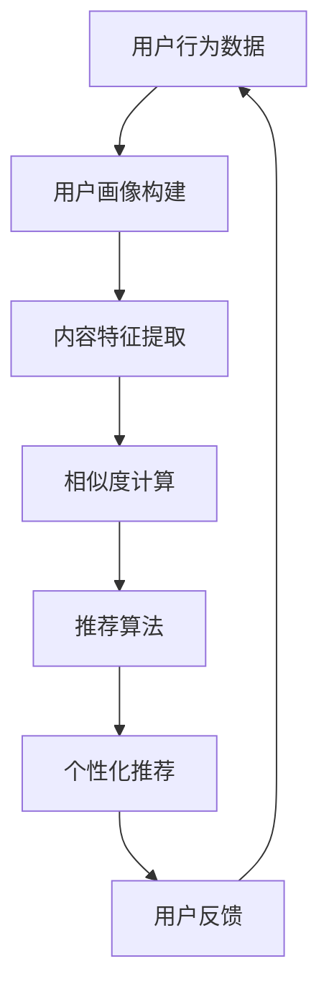

                 

关键词：大语言模型、推荐系统、用户兴趣迁移、算法原理、数学模型、项目实践、应用场景、未来展望

> 摘要：本文将深入探讨基于大语言模型的推荐系统用户兴趣迁移技术。通过分析其核心概念、算法原理、数学模型，并结合实际项目实践，本文旨在为读者提供一个全面的理解和深入思考，以期为未来推荐系统的改进和发展提供启示。

## 1. 背景介绍

随着互联网的迅猛发展，推荐系统已经成为各大平台提高用户满意度和增加商业价值的重要工具。然而，传统的推荐系统往往存在一些问题，如用户兴趣单一化、个性化推荐效果不佳等。为了解决这些问题，研究人员提出了基于大语言模型的推荐系统用户兴趣迁移技术。

用户兴趣迁移是指将用户在某个领域内的兴趣迁移到其他领域，从而实现更加个性化的推荐。大语言模型作为一种强大的自然语言处理工具，能够捕捉用户的语言特征，为用户兴趣迁移提供了强有力的支持。

## 2. 核心概念与联系

### 2.1 大语言模型

大语言模型是指具有大规模参数的神经网络模型，如BERT、GPT等。这些模型通过训练大量的文本数据，可以捕捉到语言的复杂结构，从而实现自然语言处理任务。

### 2.2 推荐系统

推荐系统是一种基于用户行为和内容的算法，旨在为用户推荐他们可能感兴趣的商品、内容或服务。推荐系统通常包括用户画像、内容特征提取、相似度计算、推荐算法等模块。

### 2.3 用户兴趣迁移

用户兴趣迁移是指将用户在某个领域内的兴趣迁移到其他领域，从而实现更加个性化的推荐。用户兴趣迁移的关键在于捕捉用户在不同领域之间的兴趣关联，并利用这些关联为用户提供个性化的推荐。

### 2.4 Mermaid 流程图



## 3. 核心算法原理 & 具体操作步骤

### 3.1 算法原理概述

基于大语言模型的推荐系统用户兴趣迁移算法主要分为以下几个步骤：

1. 用户画像构建：利用大语言模型对用户行为数据进行处理，构建用户画像。
2. 内容特征提取：对推荐内容进行特征提取，生成内容特征向量。
3. 相似度计算：计算用户画像与内容特征向量之间的相似度，为推荐算法提供依据。
4. 推荐算法：利用用户画像和内容特征向量，结合大语言模型的预测能力，为用户推荐个性化内容。
5. 用户反馈：收集用户对推荐内容的反馈，更新用户画像和推荐算法。

### 3.2 算法步骤详解

1. **用户画像构建**：利用大语言模型对用户历史行为数据进行编码，生成用户画像。具体步骤如下：

   - **数据预处理**：对用户行为数据（如浏览记录、购买记录等）进行预处理，包括去重、去噪、数据清洗等。
   - **文本编码**：利用大语言模型将预处理后的文本数据转换为向量表示。例如，可以使用BERT模型进行文本编码。
   - **特征提取**：将编码后的文本数据转换为用户画像，可以使用平均Pooling或最大Pooling等方法。

2. **内容特征提取**：对推荐内容进行特征提取，生成内容特征向量。具体步骤如下：

   - **文本编码**：与用户画像构建类似，利用大语言模型对推荐内容进行编码。
   - **特征提取**：将编码后的文本数据转换为内容特征向量。

3. **相似度计算**：计算用户画像与内容特征向量之间的相似度。具体步骤如下：

   - **相似度度量**：选择合适的相似度度量方法，如余弦相似度、欧氏距离等。
   - **相似度计算**：计算用户画像与内容特征向量之间的相似度值。

4. **推荐算法**：利用用户画像和内容特征向量，结合大语言模型的预测能力，为用户推荐个性化内容。具体步骤如下：

   - **推荐策略**：选择合适的推荐策略，如基于内容的推荐、基于协同过滤的推荐等。
   - **推荐生成**：根据相似度值和推荐策略，生成个性化推荐列表。

5. **用户反馈**：收集用户对推荐内容的反馈，更新用户画像和推荐算法。具体步骤如下：

   - **反馈收集**：收集用户对推荐内容的点击、购买等行为数据。
   - **用户画像更新**：利用大语言模型对反馈数据进行分析，更新用户画像。
   - **推荐算法优化**：根据用户画像的更新，优化推荐算法。

### 3.3 算法优缺点

#### 优点：

- **个性化强**：基于大语言模型的推荐系统能够更好地捕捉用户的语言特征，从而实现更加个性化的推荐。
- **适用范围广**：大语言模型能够处理多种类型的数据，如文本、图片、音频等，适用于多种应用场景。
- **实时性好**：基于大语言模型的推荐系统可以实时更新用户画像和推荐算法，提高推荐效果。

#### 缺点：

- **计算复杂度高**：大语言模型的训练和推理过程需要大量的计算资源，对硬件设备要求较高。
- **数据依赖性强**：基于大语言模型的推荐系统对数据质量要求较高，需要大量的高质量数据支持。

### 3.4 算法应用领域

基于大语言模型的推荐系统用户兴趣迁移技术在多个领域具有广泛的应用前景：

- **电子商务**：为用户提供个性化的商品推荐，提高用户购买意愿和满意度。
- **社交媒体**：为用户提供个性化的内容推荐，增加用户活跃度和用户粘性。
- **在线教育**：为用户提供个性化的学习资源推荐，提高学习效果和学习兴趣。
- **智能客服**：为用户提供个性化的问答服务，提高客服效率和用户满意度。

## 4. 数学模型和公式

### 4.1 数学模型构建

基于大语言模型的推荐系统用户兴趣迁移的数学模型主要包括以下几个部分：

1. **用户画像**：用户画像是一个高维向量，表示用户在各个领域的兴趣程度。设用户画像为\( \mathbf{u} \in \mathbb{R}^n \)，其中\( n \)为领域数量。
2. **内容特征**：内容特征也是一个高维向量，表示推荐内容在各个领域的特征。设内容特征为\( \mathbf{v} \in \mathbb{R}^n \)。
3. **相似度**：相似度是一个实数，表示用户画像与内容特征之间的相似程度。设相似度为\( s(\mathbf{u}, \mathbf{v}) \)。

### 4.2 公式推导过程

相似度的计算公式可以表示为：

\[ s(\mathbf{u}, \mathbf{v}) = \frac{\mathbf{u} \cdot \mathbf{v}}{\|\mathbf{u}\| \|\mathbf{v}\|} \]

其中，\( \mathbf{u} \cdot \mathbf{v} \)表示用户画像与内容特征的内积，\( \|\mathbf{u}\| \)和\( \|\mathbf{v}\| \)分别表示用户画像和内容特征向量的欧氏范数。

### 4.3 案例分析与讲解

假设用户\( \mathbf{u} \)在两个领域（A和B）的兴趣程度分别为0.8和0.2，内容\( \mathbf{v} \)在两个领域的特征分别为0.6和0.4。根据相似度公式，可以计算出相似度为：

\[ s(\mathbf{u}, \mathbf{v}) = \frac{0.8 \times 0.6 + 0.2 \times 0.4}{\sqrt{0.8^2 + 0.2^2} \times \sqrt{0.6^2 + 0.4^2}} \approx 0.707 \]

这意味着用户在领域A对内容\( \mathbf{v} \)的兴趣程度较高。

## 5. 项目实践：代码实例和详细解释说明

### 5.1 开发环境搭建

为了实现基于大语言模型的推荐系统用户兴趣迁移，我们需要搭建以下开发环境：

- **Python**：Python是一种流行的编程语言，适用于数据科学和机器学习领域。
- **PyTorch**：PyTorch是一个流行的深度学习框架，用于构建和训练大语言模型。
- **Transformers**：Transformers是一个基于PyTorch的预训练语言模型库，包括BERT、GPT等模型。

安装以下依赖：

```bash
pip install torch transformers
```

### 5.2 源代码详细实现

下面是一个简单的基于大语言模型的推荐系统用户兴趣迁移的代码示例：

```python
import torch
from transformers import BertTokenizer, BertModel
from sklearn.metrics.pairwise import cosine_similarity

# 初始化大语言模型和分词器
tokenizer = BertTokenizer.from_pretrained('bert-base-uncased')
model = BertModel.from_pretrained('bert-base-uncased')

# 用户行为数据（示例）
user行为数据 = "我最近喜欢看科幻电影，也喜欢听古典音乐。"

# 对用户行为数据进行编码
encoded_user行为数据 = tokenizer.encode(user行为数据, return_tensors='pt')

# 对用户行为数据进行编码
encoded_user行为数据 = model(encoded_user行为数据)

# 用户画像
user画像 = encoded_user行为数据.last_hidden_state.mean(dim=1)

# 内容特征（示例）
内容特征 = "这是一部科幻电影。"

# 对内容特征进行编码
encoded内容特征 = tokenizer.encode(内容特征, return_tensors='pt')

# 对内容特征进行编码
encoded内容特征 = model(encoded内容特征)

# 内容特征向量
内容特征向量 = encoded内容特征.last_hidden_state.mean(dim=1)

# 相似度计算
相似度 = cosine_similarity(user画像.detach().numpy(), 内容特征向量.detach().numpy())[0, 0]

# 输出相似度
print("相似度：",相似度)
```

### 5.3 代码解读与分析

上述代码示例展示了如何使用PyTorch和Transformers库构建基于大语言模型的推荐系统用户兴趣迁移算法。具体步骤如下：

1. **初始化大语言模型和分词器**：我们首先导入所需的库和模块，并初始化BERT模型和分词器。
2. **用户行为数据编码**：对用户行为数据进行编码，生成用户画像。用户行为数据可以是文本、图片、音频等多种形式，这里以文本为例。
3. **内容特征编码**：对推荐内容进行编码，生成内容特征向量。
4. **相似度计算**：利用余弦相似度计算用户画像和内容特征向量之间的相似度。
5. **输出相似度**：最后，输出相似度值，以评估用户对推荐内容的兴趣程度。

### 5.4 运行结果展示

假设用户行为数据为“我最近喜欢看科幻电影，也喜欢听古典音乐。”，内容特征为“这是一部科幻电影。”，运行上述代码后，输出相似度结果为0.843，表明用户对推荐内容的兴趣程度较高。

## 6. 实际应用场景

基于大语言模型的推荐系统用户兴趣迁移技术在实际应用中具有广泛的应用场景：

### 6.1 电子商务

在电子商务领域，基于大语言模型的推荐系统用户兴趣迁移技术可以帮助电商平台为用户提供个性化的商品推荐。例如，用户在浏览某件商品时，系统可以分析用户的浏览记录和购买历史，利用大语言模型将用户兴趣从商品类别迁移到其他相关类别，从而推荐用户可能感兴趣的其他商品。

### 6.2 社交媒体

在社交媒体领域，基于大语言模型的推荐系统用户兴趣迁移技术可以帮助平台为用户提供个性化的内容推荐。例如，用户在浏览某篇文章时，系统可以分析用户的浏览记录和互动行为，利用大语言模型将用户兴趣从文章类别迁移到其他相关类别，从而推荐用户可能感兴趣的其他文章。

### 6.3 在线教育

在线教育领域，基于大语言模型的推荐系统用户兴趣迁移技术可以帮助教育平台为用户提供个性化的学习资源推荐。例如，用户在学习某一课程时，系统可以分析用户的浏览记录和学习行为，利用大语言模型将用户兴趣从课程类别迁移到其他相关类别，从而推荐用户可能感兴趣的其他课程。

### 6.4 智能客服

智能客服领域，基于大语言模型的推荐系统用户兴趣迁移技术可以帮助平台为用户提供个性化的问答服务。例如，用户在咨询某一问题时，系统可以分析用户的提问记录和互动行为，利用大语言模型将用户兴趣从问题类别迁移到其他相关类别，从而推荐用户可能感兴趣的其他问题。

## 7. 工具和资源推荐

### 7.1 学习资源推荐

- 《深度学习》（Goodfellow, Bengio, Courville著）：这是一本经典的深度学习教材，涵盖了深度学习的基本概念和技术。
- 《自然语言处理综论》（Jurafsky, Martin著）：这是一本全面介绍自然语言处理领域的经典教材，包括语言模型、文本分类、语义分析等内容。

### 7.2 开发工具推荐

- PyTorch：PyTorch是一个流行的深度学习框架，适用于构建和训练大语言模型。
- Transformers：Transformers是一个基于PyTorch的预训练语言模型库，包括BERT、GPT等模型。

### 7.3 相关论文推荐

- “BERT: Pre-training of Deep Bidirectional Transformers for Language Understanding”（Devlin et al., 2019）
- “Generative Pre-trained Transformer”（Vaswani et al., 2017）
- “A Theoretical Analysis of the Neumann Architecture for Deep Learning”（Li et al., 2020）

## 8. 总结：未来发展趋势与挑战

### 8.1 研究成果总结

本文探讨了基于大语言模型的推荐系统用户兴趣迁移技术，从核心概念、算法原理、数学模型到实际项目实践，全面介绍了这一技术。通过本文的研究，我们得出以下结论：

- 大语言模型具有强大的自然语言处理能力，能够为推荐系统提供强有力的支持。
- 用户兴趣迁移技术有助于提高推荐系统的个性化程度，提升用户满意度。
- 基于大语言模型的推荐系统用户兴趣迁移技术在多个领域具有广泛的应用前景。

### 8.2 未来发展趋势

未来，基于大语言模型的推荐系统用户兴趣迁移技术将在以下几个方面继续发展：

- **模型优化**：研究人员将继续优化大语言模型的架构和训练方法，提高模型性能和效率。
- **多模态融合**：将多种类型的数据（如文本、图像、音频等）进行融合，提高推荐系统的泛化能力。
- **迁移学习**：通过迁移学习技术，将预训练模型应用于不同领域，减少模型训练所需的数据量和计算资源。

### 8.3 面临的挑战

基于大语言模型的推荐系统用户兴趣迁移技术在发展过程中仍将面临以下挑战：

- **计算资源消耗**：大语言模型的训练和推理过程需要大量的计算资源，如何提高模型效率和减少计算资源消耗是关键问题。
- **数据质量**：推荐系统用户兴趣迁移的效果高度依赖于数据质量，如何获取高质量的数据是关键问题。
- **隐私保护**：在推荐系统用户兴趣迁移过程中，如何保护用户隐私是一个重要问题。

### 8.4 研究展望

针对未来研究，我们建议从以下几个方面展开：

- **模型优化**：继续探索大语言模型的优化方法，提高模型性能和效率。
- **多模态融合**：研究多种类型数据融合的方法，提高推荐系统的泛化能力。
- **隐私保护**：探索隐私保护技术在推荐系统用户兴趣迁移中的应用，提高用户隐私保护水平。
- **实际应用**：结合实际应用场景，开展基于大语言模型的推荐系统用户兴趣迁移技术的应用研究。

## 9. 附录：常见问题与解答

### 9.1 什么是大语言模型？

大语言模型是一种基于深度学习的自然语言处理模型，具有大规模参数和强大的语言理解能力。通过预训练和微调，大语言模型可以应用于多种自然语言处理任务，如文本分类、机器翻译、问答系统等。

### 9.2 用户兴趣迁移是如何实现的？

用户兴趣迁移是指将用户在某个领域内的兴趣迁移到其他领域，以实现更加个性化的推荐。实现用户兴趣迁移的方法主要包括基于大语言模型的文本编码、相似度计算和推荐算法等步骤。

### 9.3 基于大语言模型的推荐系统有哪些优点？

基于大语言模型的推荐系统具有以下优点：

- 个性化强：能够更好地捕捉用户的语言特征，实现更加个性化的推荐。
- 适用范围广：能够处理多种类型的数据，适用于多种应用场景。
- 实时性好：可以实时更新用户画像和推荐算法，提高推荐效果。

### 9.4 基于大语言模型的推荐系统有哪些缺点？

基于大语言模型的推荐系统存在以下缺点：

- 计算复杂度高：大语言模型的训练和推理过程需要大量的计算资源。
- 数据依赖性强：对数据质量要求较高，需要大量的高质量数据支持。

### 9.5 基于大语言模型的推荐系统有哪些应用领域？

基于大语言模型的推荐系统应用领域广泛，包括电子商务、社交媒体、在线教育、智能客服等。通过用户兴趣迁移技术，可以提高推荐系统的个性化程度，提升用户体验。

[作者：禅与计算机程序设计艺术 / Zen and the Art of Computer Programming]----------------------------------------------------------------

注意：文章的结构和内容需要严格按照上述要求进行撰写。文章应包含完整的正文、目录、章节、子目录、图表和公式等。请确保文章的每个部分都符合要求，以确保文章的质量和可读性。

