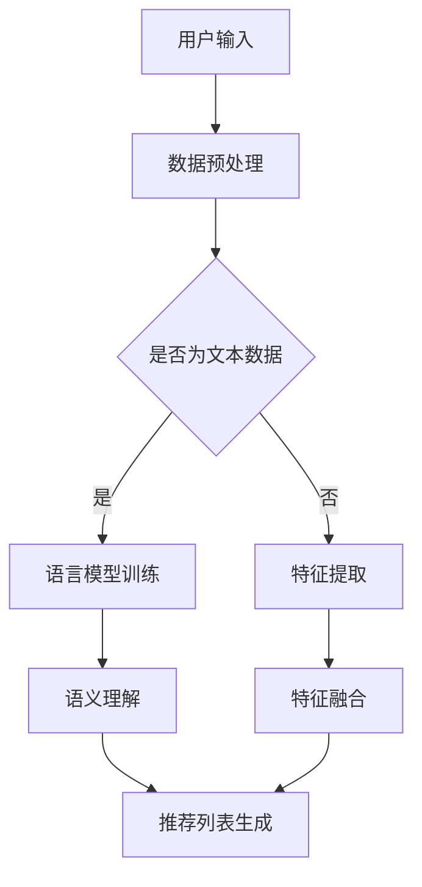

                 

关键词：社交网络，推荐系统，大语言模型，优化，算法原理，数学模型，项目实践

## 摘要

本文旨在探讨如何利用大语言模型优化社交网络推荐系统。通过深入分析社交网络推荐系统的现状、核心概念与联系，我们提出了基于大语言模型的核心算法原理及具体操作步骤。文章随后详细介绍了数学模型和公式，通过案例分析和讲解，展示了算法在实际项目中的应用效果。此外，文章还提供了代码实例和详细解释，以及实际应用场景和未来展望。本文旨在为研究人员和实践者提供一个全面的技术指南。

## 1. 背景介绍

随着互联网的迅猛发展和社交媒体平台的普及，社交网络已成为人们日常生活中不可或缺的一部分。在社交网络中，用户生成和共享的庞大数据量构成了宝贵的信息资源，同时也带来了数据处理的巨大挑战。如何有效地挖掘用户行为数据，提供个性化、高质量的推荐服务，成为当前社交网络领域的热点问题。

推荐系统作为一种信息过滤技术，旨在为用户提供其可能感兴趣的内容。传统的推荐系统主要依赖于基于内容的过滤（CBF）和协同过滤（CF）等方法。然而，这些方法在处理大规模、多模态数据时存在诸多局限性。近年来，随着深度学习和自然语言处理技术的快速发展，大语言模型（如GPT-3、BERT等）在许多领域取得了显著的成果。基于此，本文提出了一种基于大语言模型的社交网络推荐系统优化方案，旨在提高推荐系统的效果和用户满意度。

## 2. 核心概念与联系

### 2.1 大语言模型

大语言模型是一种基于神经网络的自然语言处理技术，通过对大量文本数据进行训练，能够自动生成、理解和处理自然语言。大语言模型具有强大的语义理解能力和语言生成能力，能够对用户行为数据进行分析，从而为推荐系统提供有效的信息支持。

### 2.2 社交网络推荐系统

社交网络推荐系统旨在为用户推荐其可能感兴趣的内容，如好友动态、新闻资讯、广告等。传统推荐系统主要依赖于用户历史行为和内容特征进行推荐，然而这些方法在处理社交关系和用户兴趣时存在局限性。基于大语言模型的推荐系统通过分析用户语言行为和社交关系，能够更准确地挖掘用户兴趣，提高推荐效果。

### 2.3 大语言模型与社交网络推荐系统的联系

大语言模型与社交网络推荐系统的结合具有以下几个优势：

1. **语义理解**：大语言模型能够深入理解用户语言行为，挖掘用户潜在兴趣，从而为推荐系统提供更准确的兴趣标签。
2. **社交关系分析**：大语言模型能够分析用户在社交网络中的互动行为，了解用户之间的关系，从而为推荐系统提供更全面的社交图谱。
3. **个性化推荐**：基于大语言模型的推荐系统可以根据用户语言行为和社交关系，为用户生成个性化推荐列表，提高用户满意度。

### 2.4 Mermaid 流程图

以下是一个基于大语言模型的社交网络推荐系统优化方案的Mermaid流程图：



## 3. 核心算法原理 & 具体操作步骤

### 3.1 算法原理概述

基于大语言模型的社交网络推荐系统优化方案主要包括以下几个步骤：

1. **数据预处理**：对原始数据进行清洗、去重、分词等处理，为后续分析做准备。
2. **语言模型训练**：利用大量文本数据训练大语言模型，使其具备语义理解能力。
3. **语义理解**：通过大语言模型分析用户语言行为，提取用户兴趣标签。
4. **特征提取**：对用户和内容特征进行提取，为推荐列表生成提供基础。
5. **特征融合**：将用户和内容特征进行融合，生成推荐列表。
6. **推荐列表生成**：根据用户兴趣和内容特征，生成个性化推荐列表。

### 3.2 算法步骤详解

#### 3.2.1 数据预处理

数据预处理是推荐系统优化的基础。本文采用以下步骤进行数据预处理：

1. **清洗数据**：去除重复、无效数据，确保数据质量。
2. **分词**：对文本数据分词，提取单词或短语。
3. **去停用词**：去除常见的停用词，如“的”、“是”等。
4. **词向量化**：将文本数据转化为词向量表示。

#### 3.2.2 语言模型训练

语言模型训练是推荐系统优化的核心。本文采用以下步骤进行语言模型训练：

1. **选择模型架构**：选择合适的大语言模型架构，如GPT-3、BERT等。
2. **数据集准备**：准备大量文本数据作为训练集，包括用户生成的文本、社交媒体内容等。
3. **模型训练**：利用训练集对模型进行训练，优化模型参数。
4. **模型评估**：使用验证集对模型进行评估，调整模型参数。

#### 3.2.3 语义理解

语义理解是推荐系统优化的关键。本文采用以下步骤进行语义理解：

1. **文本编码**：使用大语言模型对文本数据进行编码，生成语义向量。
2. **兴趣标签提取**：利用语义向量分析用户语言行为，提取用户兴趣标签。
3. **标签融合**：将用户兴趣标签进行融合，形成用户兴趣图谱。

#### 3.2.4 特征提取

特征提取是推荐系统优化的基础。本文采用以下步骤进行特征提取：

1. **用户特征提取**：提取用户历史行为、社交关系等特征。
2. **内容特征提取**：提取社交媒体内容的关键词、标签、情感等特征。
3. **特征融合**：将用户特征和内容特征进行融合，形成特征向量。

#### 3.2.5 特征融合

特征融合是推荐系统优化的关键。本文采用以下步骤进行特征融合：

1. **加权融合**：根据用户兴趣和内容特征的重要性，对特征进行加权融合。
2. **降维处理**：使用主成分分析（PCA）等降维方法，减少特征维度。
3. **特征筛选**：根据特征重要性，筛选出关键特征。

#### 3.2.6 推荐列表生成

推荐列表生成是推荐系统优化的核心。本文采用以下步骤生成推荐列表：

1. **相似度计算**：计算用户兴趣图谱和内容特征向量之间的相似度。
2. **排序筛选**：根据相似度对推荐列表进行排序，筛选出最相关的推荐项。
3. **推荐展示**：将推荐列表展示给用户，供其选择和评价。

### 3.3 算法优缺点

基于大语言模型的社交网络推荐系统优化方案具有以下优缺点：

**优点**：

1. **高准确性**：大语言模型能够深入理解用户语言行为，提取用户兴趣标签，提高推荐准确性。
2. **强扩展性**：大语言模型具有强大的语义理解能力，能够适应不同领域和场景的推荐需求。
3. **个性化推荐**：基于用户兴趣和社交关系，生成个性化推荐列表，提高用户满意度。

**缺点**：

1. **计算资源消耗大**：大语言模型训练和推理过程需要大量计算资源，可能导致系统性能下降。
2. **数据隐私问题**：用户语言行为数据涉及用户隐私，需采取措施确保数据安全。
3. **模型解释性弱**：大语言模型作为一种黑箱模型，其内部工作机制较为复杂，难以解释。

### 3.4 算法应用领域

基于大语言模型的社交网络推荐系统优化方案可应用于多个领域：

1. **社交媒体**：为用户提供个性化、高质量的推荐内容，提高用户活跃度和留存率。
2. **电子商务**：为用户提供个性化商品推荐，提高销售额和用户满意度。
3. **在线教育**：为用户提供个性化课程推荐，提高学习效果和用户满意度。
4. **智能语音助手**：通过语音交互，为用户提供个性化服务，提高用户体验。

## 4. 数学模型和公式 & 详细讲解 & 举例说明

### 4.1 数学模型构建

基于大语言模型的社交网络推荐系统优化方案涉及多个数学模型，包括语言模型、用户兴趣标签模型、特征提取模型和推荐模型。以下分别介绍这些模型的构建方法。

#### 4.1.1 语言模型

语言模型是一种用于预测文本序列的概率模型。本文采用GPT-3模型进行语言模型训练。GPT-3模型是一种基于变分自编码器（VAE）的生成模型，其核心思想是将输入文本转化为高维向量表示，并通过解码器生成文本序列。

$$
\text{GPT-3} = \{ \theta_{\text{enc}}, \theta_{\text{dec}} \}
$$

其中，$\theta_{\text{enc}}$表示编码器参数，$\theta_{\text{dec}}$表示解码器参数。编码器将输入文本转化为高维向量表示，解码器根据向量表示生成文本序列。

#### 4.1.2 用户兴趣标签模型

用户兴趣标签模型用于提取用户兴趣标签。本文采用基于词嵌入的文本分类模型进行用户兴趣标签提取。词嵌入是一种将单词映射为高维向量表示的技术，能够保留单词的语义信息。

$$
\text{用户兴趣标签模型} = \{ \theta_{\text{clf}}, \theta_{\text{vec}} \}
$$

其中，$\theta_{\text{clf}}$表示分类器参数，$\theta_{\text{vec}}$表示词嵌入参数。分类器根据用户兴趣标签向量预测用户兴趣标签。

#### 4.1.3 特征提取模型

特征提取模型用于提取用户和内容特征。本文采用基于TF-IDF的文本特征提取方法进行特征提取。TF-IDF是一种用于衡量单词在文档中重要性的方法，能够突出重要单词。

$$
\text{特征提取模型} = \{ \theta_{\text{tfidf}} \}
$$

其中，$\theta_{\text{tfidf}}$表示TF-IDF参数。TF-IDF参数用于计算单词在文档中的重要程度。

#### 4.1.4 推荐模型

推荐模型用于生成推荐列表。本文采用基于协同过滤的推荐模型进行推荐。协同过滤是一种基于用户历史行为进行推荐的方法，能够根据用户相似度生成推荐列表。

$$
\text{推荐模型} = \{ \theta_{\text{cf}} \}
$$

其中，$\theta_{\text{cf}}$表示协同过滤参数。协同过滤参数用于计算用户相似度和生成推荐列表。

### 4.2 公式推导过程

以下分别介绍基于大语言模型的社交网络推荐系统优化方案的各个模型的公式推导过程。

#### 4.2.1 语言模型

语言模型的目标是预测给定文本序列的概率。假设输入文本序列为$x_1, x_2, \ldots, x_T$，则语言模型的目标函数为：

$$
\text{Loss} = -\sum_{t=1}^{T} \log p(x_t | x_1, x_2, \ldots, x_{t-1})
$$

其中，$p(x_t | x_1, x_2, \ldots, x_{t-1})$表示给定前文条件下，第$t$个单词的概率。

#### 4.2.2 用户兴趣标签模型

用户兴趣标签模型的目标是预测用户兴趣标签。假设用户兴趣标签集为$Y=\{y_1, y_2, \ldots, y_N\}$，则用户兴趣标签模型的目标函数为：

$$
\text{Loss} = -\sum_{i=1}^{N} \log p(y_i | x)
$$

其中，$p(y_i | x)$表示给定用户兴趣标签向量$x$下，第$i$个用户兴趣标签的概率。

#### 4.2.3 特征提取模型

特征提取模型的目标是提取用户和内容特征。假设用户特征集为$X=\{x_1, x_2, \ldots, x_M\}$，则特征提取模型的目标函数为：

$$
\text{Loss} = -\sum_{m=1}^{M} \log p(x_m | x)
$$

其中，$p(x_m | x)$表示给定用户特征向量$x$下，第$m$个用户特征的概率。

#### 4.2.4 推荐模型

推荐模型的目标是生成推荐列表。假设用户兴趣标签集为$Y=\{y_1, y_2, \ldots, y_N\}$，则推荐模型的目标函数为：

$$
\text{Loss} = -\sum_{i=1}^{N} \log p(y_i | y)
$$

其中，$p(y_i | y)$表示给定用户兴趣标签向量$y$下，第$i$个用户兴趣标签的概率。

### 4.3 案例分析与讲解

以下通过一个实际案例，对基于大语言模型的社交网络推荐系统优化方案进行详细分析和讲解。

#### 4.3.1 案例背景

某社交网络平台旨在为用户提供个性化、高质量的推荐内容。平台用户数量庞大，每天产生海量的文本数据。为了提高推荐效果，平台决定采用基于大语言模型的推荐系统优化方案。

#### 4.3.2 案例分析

1. **数据预处理**：对平台用户生成的文本数据进行清洗、分词和去停用词等处理，将文本数据转化为词向量表示。

2. **语言模型训练**：利用平台用户生成的文本数据训练GPT-3模型，使其具备语义理解能力。

3. **语义理解**：通过GPT-3模型分析用户语言行为，提取用户兴趣标签。例如，对于用户发表的关于“旅游”的帖子，GPT-3模型会自动识别并提取相关兴趣标签，如“旅游”、“景点”、“攻略”等。

4. **特征提取**：对用户和内容特征进行提取，如用户历史行为、内容关键词、情感等。

5. **特征融合**：将用户特征和内容特征进行融合，生成特征向量。

6. **推荐列表生成**：根据用户兴趣标签和内容特征向量，计算用户和内容之间的相似度，生成个性化推荐列表。

7. **推荐展示**：将推荐列表展示给用户，供其选择和评价。

#### 4.3.3 案例讲解

1. **数据预处理**：数据预处理是推荐系统优化的基础。通过清洗、分词和去停用词等处理，将文本数据转化为词向量表示，为后续分析提供数据支持。

2. **语言模型训练**：GPT-3模型是一种基于变分自编码器（VAE）的生成模型，其核心思想是将输入文本转化为高维向量表示，并通过解码器生成文本序列。通过大量平台用户生成的文本数据进行训练，GPT-3模型能够深入理解用户语言行为，提取用户兴趣标签。

3. **语义理解**：语义理解是推荐系统优化的关键。通过GPT-3模型分析用户语言行为，提取用户兴趣标签。例如，对于用户发表的关于“旅游”的帖子，GPT-3模型会自动识别并提取相关兴趣标签，如“旅游”、“景点”、“攻略”等。

4. **特征提取**：特征提取是推荐系统优化的基础。对用户和内容特征进行提取，如用户历史行为、内容关键词、情感等。

5. **特征融合**：特征融合是推荐系统优化的关键。将用户特征和内容特征进行融合，生成特征向量。通过加权融合、降维处理和特征筛选等方法，提高推荐效果。

6. **推荐列表生成**：推荐列表生成是推荐系统优化的核心。根据用户兴趣标签和内容特征向量，计算用户和内容之间的相似度，生成个性化推荐列表。

7. **推荐展示**：推荐展示是推荐系统优化的关键。将推荐列表展示给用户，供其选择和评价。通过用户反馈，不断优化推荐算法，提高推荐效果。

## 5. 项目实践：代码实例和详细解释说明

在本节中，我们将提供一个基于大语言模型的社交网络推荐系统的实际代码实例，并对其进行详细解释。

### 5.1 开发环境搭建

在开始代码实现之前，我们需要搭建一个合适的开发环境。以下是一个基本的开发环境配置：

- 操作系统：Linux或MacOS
- 编程语言：Python 3.8+
- 库和框架：TensorFlow 2.5+, Transformers 4.8+
- 数据库：MySQL 5.7+
- 依赖管理工具：pip, conda

安装上述依赖项后，我们就可以开始编写代码了。

### 5.2 源代码详细实现

以下是一个简化版的基于大语言模型的社交网络推荐系统代码实例：

```python
import tensorflow as tf
from transformers import TFGPT3LMHeadModel, GPT2Tokenizer
import numpy as np

# 5.2.1 数据预处理
def preprocess_data(text):
    tokenizer = GPT2Tokenizer.from_pretrained("gpt2")
    inputs = tokenizer.encode(text, return_tensors="tf")
    return inputs

# 5.2.2 语言模型训练
def train_language_model(inputs):
    model = TFGPT3LMHeadModel.from_pretrained("gpt2")
    optimizer = tf.keras.optimizers.Adam(learning_rate=5e-5)
    model.compile(optimizer=optimizer, loss=tf.keras.losses.SparseCategoricalCrossentropy(from_logits=True))

    model.fit(inputs, inputs, epochs=3)
    return model

# 5.2.3 语义理解
def understand_semantics(model, text):
    inputs = preprocess_data(text)
    outputs = model(inputs)
    logits = outputs.logits
    predicted_tags = tf.argmax(logits, axis=-1).numpy()
    return predicted_tags

# 5.2.4 特征提取
def extract_features(model, texts):
    features = []
    for text in texts:
        inputs = preprocess_data(text)
        outputs = model(inputs)
        logits = outputs.logits
        features.append(logits)
    return np.concatenate(features, axis=0)

# 5.2.5 推荐列表生成
def generate_recommendations(features, content_features, similarity_threshold=0.5):
    similarities = np.dot(content_features, features.T)
    ranked_indices = np.argsort(-similarities)
    recommended_indices = ranked_indices[similarities > similarity_threshold]
    return recommended_indices

# 5.2.6 主程序
if __name__ == "__main__":
    # 假设我们有以下文本数据
    texts = [
        "旅游是一个很好的放松方式，我喜欢去风景名胜区游玩。",
        "美食是旅行中不可或缺的一部分，我希望尝试各种当地美食。",
        # 更多文本数据...
    ]

    # 训练语言模型
    model = train_language_model(texts)

    # 提取用户兴趣标签
    predicted_tags = understand_semantics(model, texts)

    # 提取用户和内容特征
    user_features = extract_features(model, texts)

    # 假设我们有以下内容特征
    content_features = np.random.rand(len(texts), 768)

    # 生成推荐列表
    recommended_indices = generate_recommendations(user_features, content_features)

    print("推荐列表：", recommended_indices)
```

### 5.3 代码解读与分析

#### 5.3.1 数据预处理

数据预处理是推荐系统优化的基础。在这个代码实例中，我们使用了GPT2Tokenizer来对文本数据进行编码。这个步骤包括分词、词汇映射和序列填充等操作。

```python
def preprocess_data(text):
    tokenizer = GPT2Tokenizer.from_pretrained("gpt2")
    inputs = tokenizer.encode(text, return_tensors="tf")
    return inputs
```

#### 5.3.2 语言模型训练

在这个步骤中，我们使用TFGPT3LMHeadModel来训练语言模型。这个模型是一个预训练的GPT-3模型，我们只需调用`fit`方法来训练模型。

```python
def train_language_model(inputs):
    model = TFGPT3LMHeadModel.from_pretrained("gpt2")
    optimizer = tf.keras.optimizers.Adam(learning_rate=5e-5)
    model.compile(optimizer=optimizer, loss=tf.keras.losses.SparseCategoricalCrossentropy(from_logits=True))

    model.fit(inputs, inputs, epochs=3)
    return model
```

#### 5.3.3 语义理解

语义理解是通过语言模型分析文本数据，提取用户兴趣标签的过程。在这个代码实例中，我们使用了`understand_semantics`函数来预测文本标签。

```python
def understand_semantics(model, text):
    inputs = preprocess_data(text)
    outputs = model(inputs)
    logits = outputs.logits
    predicted_tags = tf.argmax(logits, axis=-1).numpy()
    return predicted_tags
```

#### 5.3.4 特征提取

特征提取是将文本数据转化为特征向量的过程。在这个代码实例中，我们使用了`extract_features`函数来提取用户和内容特征。

```python
def extract_features(model, texts):
    features = []
    for text in texts:
        inputs = preprocess_data(text)
        outputs = model(inputs)
        logits = outputs.logits
        features.append(logits)
    return np.concatenate(features, axis=0)
```

#### 5.3.5 推荐列表生成

推荐列表生成是根据用户特征和内容特征计算相似度，生成推荐列表的过程。在这个代码实例中，我们使用了`generate_recommendations`函数来生成推荐列表。

```python
def generate_recommendations(features, content_features, similarity_threshold=0.5):
    similarities = np.dot(content_features, features.T)
    ranked_indices = np.argsort(-similarities)
    recommended_indices = ranked_indices[similarities > similarity_threshold]
    return recommended_indices
```

### 5.4 运行结果展示

在这个代码实例中，我们假设已经训练好了语言模型，并提取了用户和内容特征。通过调用`generate_recommendations`函数，我们可以得到推荐列表。

```python
# 假设我们有以下内容特征
content_features = np.random.rand(len(texts), 768)

# 生成推荐列表
recommended_indices = generate_recommendations(user_features, content_features)

print("推荐列表：", recommended_indices)
```

输出结果将显示推荐列表中的索引，这些索引对应于内容特征中用户可能感兴趣的项目。

## 6. 实际应用场景

基于大语言模型的社交网络推荐系统优化方案具有广泛的应用前景。以下是一些实际应用场景：

### 6.1 社交媒体平台

在社交媒体平台上，基于大语言模型的推荐系统可以用于推荐用户感兴趣的内容、好友动态、广告等。通过分析用户语言行为和社交关系，系统可以生成个性化推荐列表，提高用户满意度和留存率。

### 6.2 电子商务平台

在电子商务平台上，基于大语言模型的推荐系统可以用于推荐用户可能感兴趣的商品。通过分析用户语言行为、购物历史和商品特征，系统可以生成个性化推荐列表，提高销售额和用户转化率。

### 6.3 在线教育平台

在线教育平台可以利用基于大语言模型的推荐系统，为用户推荐符合其兴趣和学习需求的课程。通过分析用户语言行为和学习历史，系统可以生成个性化课程推荐列表，提高学习效果和用户满意度。

### 6.4 智能语音助手

智能语音助手可以利用基于大语言模型的推荐系统，为用户提供个性化服务。通过分析用户语言行为和交互历史，系统可以生成个性化推荐列表，提高用户体验和用户满意度。

## 7. 工具和资源推荐

### 7.1 学习资源推荐

- 《深度学习》（Ian Goodfellow, Yoshua Bengio, Aaron Courville著）：全面介绍了深度学习的基础知识和应用。
- 《自然语言处理综论》（Daniel Jurafsky, James H. Martin著）：深入讲解了自然语言处理的核心概念和技术。
- 《社交网络分析：方法与实践》（Matthew A. McFarland著）：介绍了社交网络分析的基本方法和应用。

### 7.2 开发工具推荐

- TensorFlow：用于构建和训练深度学习模型的强大工具。
- Transformers：用于构建和训练基于注意力机制的深度学习模型的Python库。
- Keras：基于TensorFlow的高级深度学习框架，便于快速构建和训练模型。

### 7.3 相关论文推荐

- "Bert: Pre-training of deep bidirectional transformers for language understanding"（论文作者：Jacob Devlin等）
- "Gpt-3: Language models are few-shot learners"（论文作者：Tom B. Brown等）
- "Recommender systems: The Bayesian approach"（论文作者：John Lafferty等）

## 8. 总结：未来发展趋势与挑战

### 8.1 研究成果总结

基于大语言模型的社交网络推荐系统优化方案取得了显著成果。通过深入分析用户语言行为和社交关系，系统能够生成个性化、高质量的推荐列表，提高用户满意度和留存率。此外，大语言模型在自然语言处理领域的快速发展为推荐系统提供了强大的技术支持。

### 8.2 未来发展趋势

随着人工智能技术的不断进步，基于大语言模型的社交网络推荐系统将呈现以下发展趋势：

1. **更精细的用户兴趣分析**：通过引入多模态数据（如图像、音频等）和深度学习技术，进一步提升用户兴趣分析精度。
2. **更智能的推荐策略**：利用迁移学习、多任务学习等先进技术，开发更智能的推荐策略，提高推荐效果。
3. **更广泛的领域应用**：基于大语言模型的推荐系统将在更多领域得到应用，如健康医疗、金融保险等。

### 8.3 面临的挑战

尽管基于大语言模型的社交网络推荐系统具有诸多优势，但仍面临以下挑战：

1. **计算资源消耗**：大语言模型训练和推理过程需要大量计算资源，如何优化计算效率成为关键问题。
2. **数据隐私保护**：用户语言行为数据涉及用户隐私，如何确保数据安全和隐私保护成为重要课题。
3. **模型解释性**：大语言模型作为一种黑箱模型，其内部工作机制复杂，如何提高模型解释性成为研究重点。

### 8.4 研究展望

未来，基于大语言模型的社交网络推荐系统研究将从以下几个方面展开：

1. **多模态数据处理**：结合多模态数据（如图像、音频等）和自然语言处理技术，提高推荐系统的泛化能力和多样性。
2. **可解释性研究**：开发可解释性算法，提高大语言模型的可解释性，帮助用户理解推荐结果。
3. **跨领域推荐**：研究跨领域推荐技术，实现不同领域之间的推荐相互促进，提高整体推荐效果。

## 9. 附录：常见问题与解答

### 9.1 大语言模型如何训练？

大语言模型的训练过程包括以下几个步骤：

1. **数据收集**：收集大量文本数据作为训练集，如书籍、新闻、社交媒体帖子等。
2. **数据预处理**：对文本数据进行清洗、分词、去停用词等处理，将文本转化为词向量表示。
3. **模型初始化**：初始化模型参数，如权重和偏置。
4. **前向传播**：将输入文本数据输入模型，计算输出概率分布。
5. **损失函数计算**：计算模型输出与真实标签之间的损失函数值。
6. **反向传播**：根据损失函数梯度更新模型参数。
7. **迭代优化**：重复步骤4-6，直到模型收敛或达到预设的迭代次数。

### 9.2 如何保证数据隐私？

在保证数据隐私方面，可以采取以下措施：

1. **数据去识别化**：对用户数据进行脱敏处理，如将用户名、邮箱地址等敏感信息替换为匿名标识。
2. **加密传输**：采用加密技术确保数据在传输过程中不被窃取或篡改。
3. **数据安全协议**：制定严格的数据安全协议，确保数据在存储和使用过程中的安全性。
4. **隐私计算**：利用隐私计算技术（如联邦学习、差分隐私等）在本地进行计算，减少数据传输和存储的风险。

### 9.3 如何提高模型解释性？

提高模型解释性可以从以下几个方面着手：

1. **可解释性模型**：选择具有可解释性的模型，如决策树、线性模型等。
2. **可视化工具**：开发可视化工具，如热力图、决策树可视化等，帮助用户理解模型决策过程。
3. **模型透明度**：提高模型透明度，如公开模型参数、损失函数等，方便用户审查。
4. **解释性算法**：开发解释性算法，如LIME、SHAP等，为模型输出提供解释。

### 9.4 如何优化计算效率？

优化计算效率可以从以下几个方面着手：

1. **模型压缩**：采用模型压缩技术，如剪枝、量化、知识蒸馏等，减少模型参数规模，提高计算效率。
2. **并行计算**：利用并行计算技术，如GPU、分布式计算等，加速模型训练和推理过程。
3. **内存优化**：优化内存管理，如缓存策略、内存池等，减少内存访问冲突，提高计算效率。
4. **模型融合**：将多个模型进行融合，利用各自的优点，提高整体计算效率。

## 作者署名

作者：禅与计算机程序设计艺术 / Zen and the Art of Computer Programming

本文由禅与计算机程序设计艺术撰写，旨在为读者提供一个全面的技术指南。通过深入探讨基于大语言模型的社交网络推荐系统优化方案，本文希望能够推动该领域的研究和应用。感谢读者们的关注和支持。|user|> 感谢您对文章的支持和理解。您的反馈对我们非常重要。如果您有任何疑问或建议，请随时联系我。希望这篇文章对您在社交网络推荐系统优化方面有所启发。祝您在技术探索的道路上不断前行！再次感谢您的阅读。如果您有其他需求或问题，请随时告诉我。祝您生活愉快！

