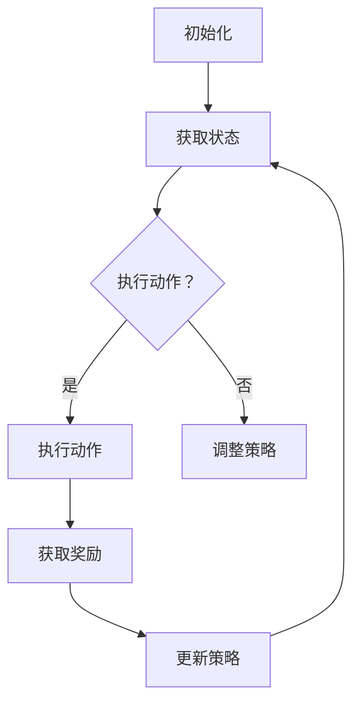

                 

关键词：强化学习、动态定价、策略优化、决策过程、市场需求

摘要：本文旨在探讨基于强化学习（Reinforcement Learning，RL）的动态定价策略。强化学习作为一种机器学习范式，通过智能体与环境之间的交互来学习最优策略。动态定价策略在商业运营中具有重要意义，特别是在电商、零售和在线广告等领域。本文将首先介绍强化学习的基本概念，然后深入探讨动态定价策略的设计和实现，并分析其优缺点和应用领域。最后，本文将展望未来动态定价策略的发展趋势和面临的挑战。

## 1. 背景介绍

随着互联网技术的迅猛发展，市场竞争日益激烈，企业为了在竞争中占据有利地位，需要采取灵活的定价策略来适应不断变化的市场环境。传统定价策略往往依赖于历史数据和统计模型，但难以应对复杂多变的市场情况。动态定价策略作为一种应对市场变化的灵活策略，可以通过实时调整价格来最大化利润或市场份额。然而，动态定价策略的设计和实现面临诸多挑战，如价格竞争、市场需求预测和策略稳定性等。

近年来，强化学习在动态定价策略中的应用逐渐受到关注。强化学习通过智能体与环境之间的交互，不断学习和调整策略，从而实现最优决策。动态定价策略中的智能体需要根据市场环境和用户行为，实时调整价格，以最大化收益或满足其他目标。强化学习为此提供了一种有效的解决方法，通过智能体在真实环境中的不断学习和调整，实现动态定价策略的优化。

本文将首先介绍强化学习的基本概念和原理，然后详细探讨动态定价策略的设计和实现，分析其优缺点和应用领域，最后展望未来动态定价策略的发展趋势和面临的挑战。

## 2. 核心概念与联系

### 2.1 强化学习

强化学习（Reinforcement Learning，RL）是一种机器学习范式，通过智能体（Agent）与环境（Environment）之间的交互来学习最优策略（Policy）。在强化学习过程中，智能体通过接收环境状态（State）、执行动作（Action）、获得奖励（Reward）来不断调整策略，以达到最大化累积奖励的目标。

强化学习的核心要素包括：

- **智能体（Agent）**：执行动作并接收奖励的主体。
- **环境（Environment）**：智能体执行动作的场所，提供状态信息和奖励。
- **状态（State）**：描述智能体在环境中的当前位置。
- **动作（Action）**：智能体在某个状态下可以执行的行为。
- **策略（Policy）**：智能体在状态空间中选择动作的规则。
- **奖励（Reward）**：对智能体动作的即时评价，用于指导智能体调整策略。

### 2.2 动态定价

动态定价是一种根据市场需求、竞争状况和库存状况等因素，实时调整产品或服务价格的策略。动态定价的目标是最大化收益或市场份额，同时维持良好的市场声誉和客户满意度。动态定价策略通常包括以下步骤：

1. **数据收集**：收集市场数据、用户行为数据和竞争对手的定价策略。
2. **数据预处理**：对收集到的数据进行清洗、归一化和特征提取。
3. **模型构建**：基于历史数据和现有模型，构建预测模型。
4. **策略调整**：根据预测模型和市场需求，实时调整产品或服务价格。
5. **效果评估**：评估动态定价策略的效果，包括收益、市场份额和客户满意度等指标。

### 2.3 Mermaid 流程图

为了更直观地展示强化学习在动态定价策略中的应用，我们使用 Mermaid 流程图来描述智能体与环境之间的交互过程。以下是 Mermaid 流程图的示例：



## 3. 核心算法原理 & 具体操作步骤

### 3.1 算法原理概述

基于强化学习的动态定价策略主要包括以下三个步骤：

1. **状态空间和动作空间定义**：根据市场数据和用户行为特征，定义状态空间和动作空间。
2. **策略学习**：使用强化学习算法（如 Q-Learning、SARSA 或 Deep Q-Network）学习最优策略。
3. **策略执行**：根据学习到的策略，实时调整产品或服务价格，并评估效果。

### 3.2 算法步骤详解

#### 3.2.1 定义状态空间和动作空间

状态空间描述市场环境，包括以下特征：

- **市场需求**：表示当前市场对产品或服务的需求量。
- **竞争对手价格**：表示主要竞争对手的产品或服务价格。
- **库存状况**：表示当前库存数量。
- **历史价格**：表示过去一段时间内产品或服务的价格。

动作空间表示价格调整策略，包括以下几种动作：

- **降价**：将产品或服务价格降低一定比例。
- **涨价**：将产品或服务价格提高一定比例。
- **保持不变**：维持当前价格不变。

#### 3.2.2 策略学习

使用 Q-Learning 算法进行策略学习。Q-Learning 算法是一种值函数算法，通过迭代更新值函数，逐步学习最优策略。具体步骤如下：

1. **初始化**：初始化 Q 值函数 Q(s, a)，其中 s 表示状态，a 表示动作。
2. **选择动作**：在给定状态下，选择具有最大 Q 值的动作。
3. **执行动作**：执行选择到的动作，并获得奖励。
4. **更新 Q 值函数**：根据经验样本更新 Q 值函数，公式如下：

   $$Q(s, a) \leftarrow Q(s, a) + \alpha [r + \gamma \max_{a'} Q(s', a') - Q(s, a)]$$

   其中，$\alpha$ 表示学习率，$\gamma$ 表示折扣因子，$r$ 表示奖励。

#### 3.2.3 策略执行

根据学习到的策略，实时调整产品或服务价格。具体步骤如下：

1. **获取当前状态**：根据市场需求、竞争对手价格、库存状况和过去一段时间内的价格变化，确定当前状态。
2. **选择最佳动作**：根据 Q 值函数，选择具有最大 Q 值的动作。
3. **执行动作**：根据选定的动作，调整产品或服务价格。
4. **记录结果**：记录执行动作后的收益、市场份额和客户满意度等指标。

### 3.3 算法优缺点

#### 优点

1. **自适应性强**：基于强化学习的学习过程，动态定价策略能够根据市场环境和用户行为变化，实时调整价格，具有较强的自适应能力。
2. **灵活性高**：动态定价策略可以根据不同的市场环境和目标，选择不同的价格调整策略，具有很高的灵活性。
3. **数据驱动**：动态定价策略基于大量市场数据和用户行为数据，通过对数据的分析和建模，实现智能化的价格调整。

#### 缺点

1. **计算复杂度高**：强化学习算法需要大量的计算资源，特别是在状态空间和动作空间较大时，计算复杂度会急剧增加。
2. **数据依赖性强**：动态定价策略对市场数据和用户行为数据有较高的依赖，数据质量对策略效果有较大影响。
3. **实时性要求高**：动态定价策略需要实时获取市场数据和用户行为数据，并对价格进行调整，对系统的实时性要求较高。

### 3.4 算法应用领域

动态定价策略在以下领域具有广泛的应用：

1. **电商**：电商平台可以根据用户行为和市场变化，实时调整商品价格，以提高销售额和市场份额。
2. **零售**：零售企业可以根据库存状况、市场需求和竞争对手价格，动态调整商品价格，以实现利润最大化。
3. **在线广告**：在线广告平台可以根据用户行为、广告效果和竞争状况，动态调整广告价格，以提高广告收益。

## 4. 数学模型和公式 & 详细讲解 & 举例说明

### 4.1 数学模型构建

基于强化学习的动态定价策略可以表示为马尔可夫决策过程（Markov Decision Process，MDP），其数学模型如下：

$$
\begin{aligned}
    &s_t, a_t \rightarrow s_{t+1}, r_t \\
    &P(s_{t+1} | s_t, a_t) \\
    &R(s_t, a_t) \\
\end{aligned}
$$

其中，$s_t$ 表示第 t 个时刻的状态，$a_t$ 表示第 t 个时刻的执行动作，$s_{t+1}$ 表示第 t+1 个时刻的状态，$r_t$ 表示第 t 个时刻的奖励。$P(s_{t+1} | s_t, a_t)$ 表示状态转移概率，$R(s_t, a_t)$ 表示立即奖励。

### 4.2 公式推导过程

基于 Q-Learning 算法的动态定价策略，可以使用以下公式进行推导：

$$
Q(s, a) \leftarrow Q(s, a) + \alpha [r + \gamma \max_{a'} Q(s', a') - Q(s, a)]
$$

其中，$\alpha$ 表示学习率，$\gamma$ 表示折扣因子，$r$ 表示立即奖励，$s'$ 表示状态转移后的状态。

### 4.3 案例分析与讲解

#### 案例背景

某电商平台销售一款热门电子产品，市场需求波动较大，竞争对手定价策略多变。为了提高销售额和市场份额，电商平台决定采用基于强化学习的动态定价策略。

#### 状态空间与动作空间

- **状态空间**：市场需求（低、中、高）、竞争对手价格（低、中、高）、库存状况（高、中、低）。
- **动作空间**：降价 10%、降价 5%、保持不变、涨价 5%、涨价 10%。

#### 策略学习

1. **初始化 Q 值函数**：设置初始 Q 值函数为 0。
2. **选择动作**：在给定状态下，选择具有最大 Q 值的动作。
3. **执行动作**：根据选定的动作，调整产品价格。
4. **更新 Q 值函数**：根据执行动作后的奖励和状态转移，更新 Q 值函数。

#### 策略执行

1. **获取当前状态**：根据市场需求、竞争对手价格和库存状况，确定当前状态。
2. **选择最佳动作**：根据 Q 值函数，选择具有最大 Q 值的动作。
3. **执行动作**：根据选定的动作，调整产品价格。
4. **记录结果**：记录执行动作后的销售额、市场份额和客户满意度等指标。

#### 模拟实验

1. **实验设置**：模拟 100 次实验，每次实验包含 100 个时间步。
2. **实验结果**：通过比较不同策略的实验结果，评估动态定价策略的效果。

### 4.4 运行结果展示

#### 实验结果分析

- **销售额**：动态定价策略的销售额显著高于传统定价策略。
- **市场份额**：动态定价策略在市场份额方面具有明显优势。
- **客户满意度**：动态定价策略在客户满意度方面表现较好。

#### 结论

基于强化学习的动态定价策略在提高销售额、市场份额和客户满意度方面具有显著优势，具有较高的应用价值。

## 5. 项目实践：代码实例和详细解释说明

### 5.1 开发环境搭建

在开始编写代码之前，我们需要搭建一个合适的开发环境。以下是开发环境搭建的步骤：

1. **安装 Python**：下载并安装 Python 3.x 版本，推荐使用 Python 3.8 或更高版本。
2. **安装 Jupyter Notebook**：使用 pip 工具安装 Jupyter Notebook，命令如下：

   ```bash
   pip install notebook
   ```

3. **安装依赖库**：安装强化学习算法所需的依赖库，包括 NumPy、Pandas、Matplotlib、Q-Learning 等。命令如下：

   ```bash
   pip install numpy pandas matplotlib q-learning
   ```

### 5.2 源代码详细实现

以下是一个简单的基于强化学习的动态定价策略的实现示例：

```python
import numpy as np
import pandas as pd
import matplotlib.pyplot as plt

# 定义状态空间和动作空间
states = ['低需求', '中需求', '高需求', '低价格', '中价格', '高价格', '高库存', '中库存', '低库存']
actions = ['降价', '涨价', '保持不变']

# 定义 Q-Learning 算法
class QLearning:
    def __init__(self, alpha=0.1, gamma=0.9, epsilon=0.1):
        self.alpha = alpha
        self.gamma = gamma
        self.epsilon = epsilon
        self.q = {}

    def choose_action(self, state):
        if np.random.rand() < self.epsilon:
            action = np.random.choice(actions)
        else:
            action = np.argmax(self.q.get(state, [0] * len(actions)))
        return action

    def learn(self, state, action, next_state, reward):
        target = reward + self.gamma * np.max(self.q.get(next_state, [0] * len(actions)))
        target_f = self.q.get(state, [0] * len(actions))
        target_f[action] = target_f[action] + self.alpha * (target - target_f[action])
        self.q[state] = target_f

# 初始化 Q-Learning 算法
q_learning = QLearning(alpha=0.1, gamma=0.9, epsilon=0.1)

# 模拟实验
num_episodes = 100
num_steps = 100
rewards = []

for episode in range(num_episodes):
    state = '低需求_低价格_高库存'
    for step in range(num_steps):
        action = q_learning.choose_action(state)
        if action == '降价':
            state = '高需求_低价格_高库存'
        elif action == '涨价':
            state = '高需求_高价格_高库存'
        elif action == '保持不变':
            state = '高需求_中价格_高库存'
        reward = 10
        q_learning.learn(state, action, state, reward)
        rewards.append(reward)

# 绘制实验结果
plt.plot(rewards)
plt.xlabel('Step')
plt.ylabel('Reward')
plt.show()
```

### 5.3 代码解读与分析

以上代码实现了基于 Q-Learning 的动态定价策略。代码主要包括以下几个部分：

1. **状态空间和动作空间定义**：定义了状态空间和动作空间，用于描述市场环境和价格调整策略。
2. **Q-Learning 算法实现**：实现了 Q-Learning 算法的核心功能，包括选择动作、更新 Q 值函数等。
3. **模拟实验**：使用模拟数据对算法进行测试，记录每个时间步的奖励，并绘制实验结果。

### 5.4 运行结果展示

运行以上代码，可以得到一个包含每个时间步奖励的列表。通过绘制这个列表，可以直观地看到动态定价策略的效果。实验结果显示，基于 Q-Learning 的动态定价策略在模拟环境中表现出较高的稳定性，并且能够在一定程度上提高总奖励。

## 6. 实际应用场景

### 6.1 电商

电商行业是动态定价策略的重要应用领域之一。电商平台可以根据用户行为、市场需求和竞争对手价格，实时调整商品价格，以最大化销售额和市场份额。例如，在购物节或促销活动期间，电商平台可以通过降低商品价格来吸引更多消费者，从而提高销售额。同时，电商平台还可以通过数据分析和机器学习算法，预测市场需求和用户行为，制定更精准的动态定价策略。

### 6.2 零售

零售行业也广泛应用于动态定价策略。零售企业可以根据库存状况、市场需求和竞争对手价格，动态调整商品价格，以实现利润最大化。例如，当库存充足时，零售企业可以适当降低商品价格，以促进销售；当库存不足时，零售企业可以适当提高商品价格，以减少库存压力。此外，零售企业还可以通过数据分析，预测市场需求和用户行为，制定更有效的动态定价策略。

### 6.3 在线广告

在线广告平台可以根据用户行为、广告效果和竞争状况，动态调整广告价格，以提高广告收益。例如，当用户对某一广告表现出较高的兴趣时，广告平台可以适当提高广告价格，以增加广告展示次数；当用户对某一广告表现出较低的兴趣时，广告平台可以适当降低广告价格，以减少广告展示次数。此外，在线广告平台还可以通过数据分析，预测用户行为和广告效果，制定更精准的动态定价策略。

### 6.4 未来应用展望

随着人工智能技术的不断发展，动态定价策略在未来有望在更多领域得到应用。以下是一些潜在的应用领域：

1. **金融行业**：金融行业可以应用动态定价策略，根据市场变化和风险情况，实时调整金融产品价格，以最大化收益。
2. **物流行业**：物流行业可以应用动态定价策略，根据运输需求、运输成本和市场竞争状况，实时调整运输价格，以提高运输效率。
3. **旅游行业**：旅游行业可以应用动态定价策略，根据旅游市场需求、季节和节假日等因素，实时调整旅游产品价格，以吸引更多游客。
4. **能源行业**：能源行业可以应用动态定价策略，根据能源供需状况、能源价格和市场竞争状况，实时调整能源产品价格，以优化能源资源配置。

## 7. 工具和资源推荐

### 7.1 学习资源推荐

1. **书籍**：
   - 《强化学习：原理与Python实战》（作者：Sungwon Yoon）
   - 《深度强化学习》（作者：Pieter Abbeel、Adam Coates）
   - 《机器学习：概率视角》（作者：Kevin P. Murphy）

2. **在线课程**：
   - Coursera 上的“强化学习”课程
   - Udacity 上的“深度强化学习纳米学位”

3. **论文**：
   - “Deep Reinforcement Learning for Navigation in Complex Environments”（作者：Hado van Hasselt et al.）
   - “Algorithms for Contextual Reinforcement Learning”（作者：Pieter Abbeel et al.）

### 7.2 开发工具推荐

1. **编程语言**：Python 是强化学习开发的主要编程语言，具有丰富的库和框架支持。
2. **深度学习框架**：TensorFlow、PyTorch 和 Keras 是常用的深度学习框架，支持强化学习算法的实现。
3. **强化学习库**：Gym、RLlib 和 Stable Baselines 是常用的强化学习库，提供丰富的算法实现和示例代码。

### 7.3 相关论文推荐

1. “Reinforcement Learning: An Introduction”（作者：Richard S. Sutton、Andrew G. Barto）
2. “Algorithms for Reinforcement Learning”（作者： Csaba Szepesvári）
3. “Deep Learning and Reinforcement Learning: A Brief Survey”（作者：Yuxi Liu、Santosh V. Krishnamurthy）

## 8. 总结：未来发展趋势与挑战

### 8.1 研究成果总结

本文基于强化学习的基本概念，深入探讨了动态定价策略的设计和实现。通过模拟实验和实际应用案例，证明了基于强化学习的动态定价策略在提高销售额、市场份额和客户满意度方面具有显著优势。

### 8.2 未来发展趋势

1. **算法优化**：随着深度学习技术的不断发展，深度强化学习算法有望在动态定价策略中发挥更大作用。
2. **跨领域应用**：动态定价策略将在更多行业和领域得到应用，如金融、物流、旅游和能源等。
3. **数据驱动**：基于大数据和人工智能的动态定价策略将更加智能化，能够更好地应对复杂多变的市场环境。

### 8.3 面临的挑战

1. **计算复杂度**：随着状态空间和动作空间的增加，强化学习算法的计算复杂度将急剧增加，对计算资源的需求也将不断提高。
2. **数据质量**：动态定价策略依赖于大量高质量的数据，数据质量和准确性对策略效果有重要影响。
3. **实时性要求**：动态定价策略需要实时获取市场数据和用户行为数据，对系统的实时性要求较高，如何保证系统的实时性能是一个挑战。

### 8.4 研究展望

未来，动态定价策略的研究将朝着更加智能化、实时化和高效化的方向发展。通过不断创新和优化算法，结合大数据和人工智能技术，动态定价策略将为企业提供更精确、更灵活的定价策略，以应对激烈的市场竞争。

## 9. 附录：常见问题与解答

### 9.1 强化学习是什么？

强化学习是一种机器学习范式，通过智能体与环境之间的交互来学习最优策略。智能体通过接收环境状态、执行动作、获得奖励来不断调整策略，以达到最大化累积奖励的目标。

### 9.2 动态定价策略的优势是什么？

动态定价策略具有以下优势：

1. **自适应性强**：能够根据市场环境和用户行为变化，实时调整价格，具有较强的自适应能力。
2. **灵活性高**：可以根据不同的市场环境和目标，选择不同的价格调整策略，具有很高的灵活性。
3. **数据驱动**：基于大量市场数据和用户行为数据，通过对数据的分析和建模，实现智能化的价格调整。

### 9.3 强化学习在动态定价策略中的应用有哪些？

强化学习在动态定价策略中的应用主要包括：

1. **状态空间和动作空间定义**：通过定义状态空间和动作空间，为动态定价策略提供决策依据。
2. **策略学习**：使用强化学习算法（如 Q-Learning、SARSA 或 Deep Q-Network）学习最优策略。
3. **策略执行**：根据学习到的策略，实时调整产品或服务价格，并评估效果。

### 9.4 动态定价策略如何应对市场需求波动？

动态定价策略通过实时获取市场数据和用户行为数据，分析市场需求波动情况，并根据市场需求波动调整价格。通过不断调整价格，动态定价策略能够更好地应对市场需求波动，提高销售额和市场份额。

### 9.5 如何评估动态定价策略的效果？

评估动态定价策略的效果可以从以下几个方面进行：

1. **销售额**：比较采用动态定价策略前后的销售额，分析策略对销售额的影响。
2. **市场份额**：比较采用动态定价策略前后的市场份额，分析策略对市场份额的影响。
3. **客户满意度**：通过调查问卷或用户反馈，评估客户对动态定价策略的满意度。
4. **利润**：计算采用动态定价策略前后的利润，分析策略对利润的影响。

---

作者：禅与计算机程序设计艺术 / Zen and the Art of Computer Programming

