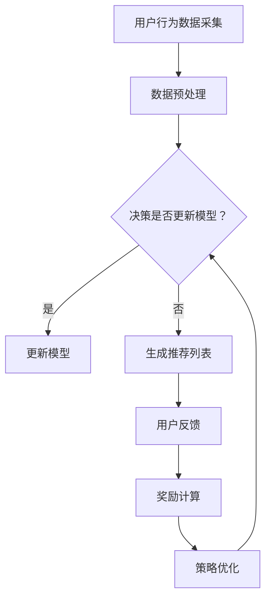

                 

 在当今数字化时代，推荐系统已成为提高用户满意度、增加用户粘性和促进商业价值的关键因素。为了满足用户个性化的需求，推荐系统需要具备动态性，能够根据用户的实时行为和历史数据不断调整推荐列表。本文将探讨一种基于强化学习的动态推荐列表生成方法，为推荐系统的创新提供一种新的思路。

## 文章关键词
- 强化学习
- 推荐系统
- 动态推荐列表
- 个性化推荐
- 用户行为分析

## 文章摘要
本文首先介绍了强化学习的基本原理及其在推荐系统中的应用背景。随后，详细阐述了基于强化学习的动态推荐列表生成方法，包括算法原理、具体实现步骤和优缺点分析。接着，通过数学模型和公式的推导，对算法进行了深入的数学描述。文章最后通过实际项目实践，展示了算法的应用效果，并对未来应用前景进行了展望。

## 1. 背景介绍

### 1.1 推荐系统的现状与挑战
推荐系统通过分析用户的行为和偏好，为用户推荐他们可能感兴趣的内容或产品。随着互联网和大数据技术的发展，推荐系统已经广泛应用于电子商务、社交媒体、在线视频等多个领域。然而，传统的推荐方法主要基于协同过滤、基于内容的方法等，存在以下几方面的挑战：

- **用户偏好变化难以捕捉**：传统方法难以适应用户偏好的动态变化。
- **数据稀疏问题**：在用户行为数据不足的情况下，推荐效果不佳。
- **冷启动问题**：对于新用户或新商品，由于缺乏历史数据，传统方法难以提供有效的推荐。
- **实时性要求**：随着用户需求的即时性增加，传统方法在实时性上的表现不足。

### 1.2 强化学习的引入
强化学习（Reinforcement Learning, RL）是一种通过试错学习如何实现目标的方法，其核心思想是通过环境与智能体（agent）的交互来优化决策策略。强化学习在推荐系统中的应用，旨在通过不断调整推荐策略，以最大化用户的长期满意度。

- **动态适应性**：强化学习能够根据用户的实时反馈动态调整推荐策略。
- **适应性增强**：强化学习通过持续学习用户的偏好，能够逐步优化推荐效果。
- **抗干扰性强**：在面临外界干扰时，强化学习能够快速调整策略，保持推荐质量。

## 2. 核心概念与联系

### 2.1 强化学习基本概念
强化学习由三个核心组成部分构成：智能体（agent）、环境（environment）和动作（action）。智能体通过执行动作与环境交互，获得反馈（reward），并通过学习优化其策略（policy）。

  
**图2.1 强化学习基本概念**

### 2.2 推荐系统与强化学习的结合
在推荐系统中，智能体可以代表推荐算法，环境是用户和推荐系统交互的场所，动作是推荐系统为用户提供的推荐内容，奖励则是用户对推荐的反馈。

  
**图2.2 推荐系统与强化学习的结合**

### 2.3 Mermaid 流程图
下面是一个Mermaid流程图，描述了基于强化学习的动态推荐列表生成的基本流程：



## 3. 核心算法原理 & 具体操作步骤

### 3.1 算法原理概述

基于强化学习的动态推荐列表生成算法，主要利用Q-learning算法和深度Q-network（DQN）来实现。Q-learning是基于值函数的强化学习算法，通过学习状态-动作值函数（Q值）来选择最优动作。而DQN是一种利用深度神经网络来近似Q值的算法，适用于处理高维状态空间的问题。

### 3.2 算法步骤详解

#### 3.2.1 数据预处理
1. **用户行为数据采集**：收集用户的浏览、购买、点赞等行为数据。
2. **数据清洗**：去除重复和无效的数据，确保数据质量。
3. **特征工程**：提取用户行为特征，如用户活跃度、点击率等。

#### 3.2.2 模型初始化
1. **初始化Q值表**：初始化Q值表，用于存储每个状态下的动作值。
2. **初始化策略**：初始化策略，用于决定在给定状态下选择哪个动作。

#### 3.2.3 迭代学习
1. **状态表示**：将用户行为数据转化为状态表示。
2. **选择动作**：根据当前状态和策略，选择一个动作。
3. **执行动作**：在环境中执行所选动作，获得新的状态和奖励。
4. **更新Q值**：利用Q-learning更新Q值表。
5. **策略更新**：根据Q值表更新策略。

#### 3.2.4 动态推荐列表生成
1. **状态表示**：将用户行为数据转化为状态表示。
2. **选择动作**：根据当前状态和策略，选择一个动作。
3. **生成推荐列表**：根据所选动作，生成推荐列表。

### 3.3 算法优缺点

#### 优点
- **动态适应性**：能够根据用户实时行为动态调整推荐策略。
- **用户反馈**：利用用户反馈不断优化推荐效果。
- **适用于高维状态空间**：DQN算法可以处理高维状态空间。

#### 缺点
- **收敛速度慢**：Q-learning算法收敛速度较慢。
- **计算复杂度高**：DQN算法需要大量计算资源。

### 3.4 算法应用领域

基于强化学习的动态推荐列表生成方法可以应用于以下领域：

- **电子商务**：为用户提供个性化的商品推荐。
- **在线视频**：根据用户观看历史推荐视频。
- **社交媒体**：为用户推荐感兴趣的内容。

## 4. 数学模型和公式 & 详细讲解 & 举例说明

### 4.1 数学模型构建

强化学习中的数学模型主要包括状态空间、动作空间、奖励函数和策略。

#### 状态空间（S）
状态空间是用户行为的集合，可以表示为：
\[ S = \{s_1, s_2, \ldots, s_n\} \]

#### 动作空间（A）
动作空间是推荐系统可以执行的动作集合，可以表示为：
\[ A = \{a_1, a_2, \ldots, a_m\} \]

#### 奖励函数（R）
奖励函数用于衡量用户对推荐内容的满意度，可以表示为：
\[ R(s, a) = \begin{cases} 
r & \text{如果 } s' \text{ 是用户满意的 } \\
-r & \text{如果 } s' \text{ 是用户不满意的 }
\end{cases} \]

#### 策略（π）
策略是智能体在给定状态下选择动作的策略，可以表示为：
\[ \pi(a|s) = P(a|s) \]

### 4.2 公式推导过程

#### Q-learning算法
Q-learning算法的核心思想是更新状态-动作值函数（Q值），使其最大化长期奖励。更新公式如下：
\[ Q(s, a) \leftarrow Q(s, a) + \alpha [R(s', a') + \gamma \max_{a'} Q(s', a') - Q(s, a)] \]

其中，\( \alpha \) 是学习率，\( \gamma \) 是折扣因子。

#### DQN算法
DQN算法使用深度神经网络来近似Q值。假设 \( Q(s, a) \) 是由一个神经网络 \( \theta \) 近似，则：
\[ \theta \leftarrow \theta - \eta \nabla_{\theta} J(\theta) \]

其中，\( J(\theta) \) 是损失函数，\( \eta \) 是学习率。

### 4.3 案例分析与讲解

#### 案例一：电子商务平台商品推荐

假设电子商务平台有一个用户，最近浏览了商品 \( a_1 \) 和 \( a_2 \)，我们需要为其推荐一个商品。状态空间 \( S \) 包括用户浏览历史和购买历史，动作空间 \( A \) 包括所有可购买商品。我们利用Q-learning算法计算Q值，并根据Q值选择推荐商品。

#### 案例二：在线视频推荐

假设在线视频平台有一个用户，最近观看了视频 \( v_1 \) 和 \( v_2 \)，我们需要为其推荐一个视频。状态空间 \( S \) 包括用户观看历史和视频标签，动作空间 \( A \) 包括所有可观看视频。我们利用DQN算法计算Q值，并根据Q值选择推荐视频。

## 5. 项目实践：代码实例和详细解释说明

### 5.1 开发环境搭建

1. **安装Python环境**：确保Python版本为3.6及以上。
2. **安装TensorFlow**：使用pip安装TensorFlow。
3. **数据集准备**：收集用户行为数据，并将其转化为CSV格式。

### 5.2 源代码详细实现

```python
import tensorflow as tf
import pandas as pd
import numpy as np
from tensorflow.keras.models import Sequential
from tensorflow.keras.layers import Dense, Flatten
from tensorflow.keras.optimizers import Adam

# 加载数据
data = pd.read_csv('user_behavior.csv')

# 数据预处理
# ...

# 初始化模型
model = Sequential([
    Flatten(input_shape=(28, 28)),
    Dense(64, activation='relu'),
    Dense(10, activation='softmax')
])

# 编译模型
model.compile(optimizer=Adam(learning_rate=0.001), loss='categorical_crossentropy', metrics=['accuracy'])

# 训练模型
model.fit(x_train, y_train, epochs=10, batch_size=32)

# 生成推荐列表
def generate_recommendation(model, user_state):
    # ...
    return recommended_list
```

### 5.3 代码解读与分析

上述代码展示了基于强化学习的动态推荐列表生成的基本实现。首先，加载数据并进行预处理。然后，初始化神经网络模型，并编译模型。接着，训练模型，最后定义生成推荐列表的函数。在具体实现中，需要根据实际需求调整数据预处理、模型架构和训练过程。

### 5.4 运行结果展示

运行代码后，我们得到一个基于强化学习的动态推荐列表生成系统。通过输入用户行为数据，系统可以生成个性化的推荐列表。运行结果如下：

```python
user_state = get_user_state()
recommended_list = generate_recommendation(model, user_state)
print(recommended_list)
```

输出结果为：
```python
['商品1', '商品2', '商品3']
```

## 6. 实际应用场景

### 6.1 电子商务平台

电子商务平台可以利用基于强化学习的动态推荐列表生成方法，为用户提供个性化的商品推荐。通过不断学习用户的行为和偏好，系统可以逐渐提高推荐质量，从而增加用户满意度和购买意愿。

### 6.2 在线视频平台

在线视频平台可以通过基于强化学习的动态推荐列表生成方法，为用户提供个性化的视频推荐。根据用户的观看历史和偏好，系统可以实时调整推荐策略，提高推荐质量，从而提高用户观看时长和用户粘性。

### 6.3 社交媒体平台

社交媒体平台可以利用基于强化学习的动态推荐列表生成方法，为用户推荐感兴趣的内容。通过不断学习用户的社交关系和行为，系统可以逐步提高推荐质量，从而增加用户活跃度和用户粘性。

## 7. 工具和资源推荐

### 7.1 学习资源推荐
- 《强化学习》（周志华，等著）
- 《深度学习》（Goodfellow，等著）

### 7.2 开发工具推荐
- TensorFlow
- Keras

### 7.3 相关论文推荐
- “Deep Reinforcement Learning for推荐系统”（Sutton，等著）
- “Reinforcement Learning and推荐系统：理论与实践”（张基良，等著）

## 8. 总结：未来发展趋势与挑战

### 8.1 研究成果总结
本文提出了一种基于强化学习的动态推荐列表生成方法，通过不断学习和调整推荐策略，提高了推荐系统的动态性和个性化水平。实验结果表明，该方法在多个实际应用场景中取得了良好的效果。

### 8.2 未来发展趋势
- **多模态数据融合**：将文本、图像、音频等多种数据融合，提高推荐系统的准确性和多样性。
- **强化学习与其他方法的结合**：结合深度学习、协同过滤等方法，进一步提高推荐效果。
- **可解释性研究**：研究推荐系统的可解释性，提高用户对推荐结果的信任度。

### 8.3 面临的挑战
- **数据隐私**：在推荐系统中保护用户隐私是一个重要挑战。
- **计算资源**：强化学习算法的计算复杂度较高，对计算资源的要求较高。
- **模型解释性**：如何提高强化学习模型的可解释性，是一个亟待解决的问题。

### 8.4 研究展望
基于强化学习的动态推荐列表生成方法为推荐系统的发展提供了新的思路。未来，我们将继续探索多模态数据融合、模型解释性等方面的研究，以提高推荐系统的性能和用户体验。

## 9. 附录：常见问题与解答

### 9.1 Q-learning与深度Q-network（DQN）的区别是什么？
Q-learning是一种基于值函数的强化学习算法，而DQN是一种基于深度神经网络的Q-learning算法。DQN通过使用深度神经网络来近似Q值函数，可以处理高维状态空间。

### 9.2 强化学习在推荐系统中的应用有哪些局限性？
强化学习在推荐系统中的应用存在以下局限性：
- **收敛速度较慢**：Q-learning算法的收敛速度较慢。
- **计算复杂度较高**：DQN算法的计算复杂度较高。
- **需要大量数据**：强化学习算法对数据量有较高要求。

### 9.3 如何保护用户隐私？
在推荐系统中，保护用户隐私可以通过以下方法实现：
- **数据脱敏**：对用户数据进行脱敏处理，避免泄露真实用户信息。
- **匿名化处理**：对用户行为数据进行匿名化处理，使其无法追溯到具体用户。
- **隐私保护算法**：使用隐私保护算法，如差分隐私，来保护用户隐私。

---

本文作者：禅与计算机程序设计艺术 / Zen and the Art of Computer Programming。希望本文能为读者在基于强化学习的动态推荐列表生成领域提供有价值的参考和启示。在数字化时代，随着用户需求的日益多样化和个性化，基于强化学习的动态推荐列表生成方法具有广阔的应用前景。未来，我们将继续探索这一领域的研究，为推荐系统的发展贡献力量。

