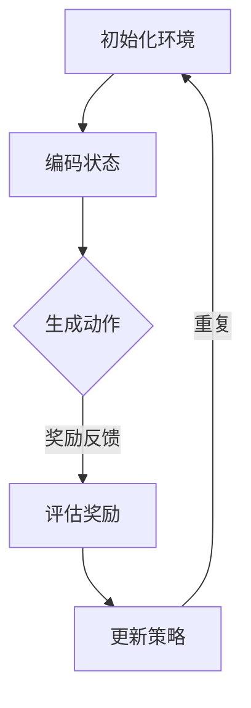

                 

关键词：强化学习，动态推荐，列表生成，智能推荐系统，用户行为分析，机器学习

> 摘要：本文探讨了基于强化学习的动态推荐列表生成方法，通过对用户行为的深度分析，实现了个性化推荐系统的实时优化。文章介绍了强化学习的基本概念、算法原理，以及其在动态推荐系统中的应用，旨在为开发者提供一种创新的推荐系统设计思路。

## 1. 背景介绍

随着互联网的快速发展，信息过载成为用户普遍面临的问题。为解决这一问题，个性化推荐系统应运而生。这些系统能够根据用户的历史行为和偏好，自动推荐符合用户兴趣的内容，从而提高用户的满意度和使用体验。传统的推荐系统主要采用基于内容的过滤、协同过滤等算法，虽然在一定程度上能够满足用户的需求，但存在推荐结果不够精准、更新不及时等问题。

为了应对这些挑战，研究者们开始探索基于强化学习的动态推荐列表生成方法。强化学习是一种机器学习范式，旨在通过学习如何在环境中采取最优行动来最大化累积奖励。本文将详细介绍基于强化学习的动态推荐列表生成方法，并探讨其在实际应用中的优势和挑战。

## 2. 核心概念与联系

### 2.1 强化学习基础概念

强化学习（Reinforcement Learning，简称RL）是一种通过试错来学习如何在特定环境中做出最优决策的机器学习方法。其核心概念包括：

- **环境（Environment）**：强化学习问题的背景或上下文，用于描述系统所处的状态、动作和奖励。
- **状态（State）**：描述系统当前所处的情景或条件。
- **动作（Action）**：系统在特定状态下可以采取的行为。
- **奖励（Reward）**：系统在执行某个动作后所获得的即时回报。
- **策略（Policy）**：描述系统在特定状态下应采取的行动规则。

强化学习的基本目标是学习一个最优策略，使得系统在长期运行过程中获得最大的累积奖励。

### 2.2 动态推荐系统

动态推荐系统是一种能够根据用户实时行为和系统状态自动调整推荐策略的推荐系统。其主要特点包括：

- **实时性**：能够快速响应用户行为变化，提供最新的推荐结果。
- **灵活性**：能够根据用户反馈和系统数据动态调整推荐策略。
- **个性化**：能够根据用户的历史行为和偏好提供个性化的推荐。

### 2.3 强化学习在动态推荐系统中的应用

基于强化学习的动态推荐系统通过学习用户行为和环境状态之间的关系，实现推荐策略的实时优化。其基本流程如下：

1. **状态编码**：将用户行为和系统状态编码为高维状态向量。
2. **动作生成**：根据当前状态，使用强化学习算法生成推荐动作。
3. **奖励评估**：根据用户反馈对推荐动作进行奖励评估。
4. **策略更新**：根据累积奖励更新策略，优化推荐效果。

### 2.4 Mermaid 流程图



在上面的流程图中，`A` 表示初始化环境，`B` 表示编码状态，`C` 表示生成动作，`D` 表示评估奖励，`E` 表示更新策略。整个流程不断重复，以实现动态推荐列表的实时优化。

## 3. 核心算法原理 & 具体操作步骤

### 3.1 算法原理概述

基于强化学习的动态推荐列表生成算法主要涉及以下三个关键组成部分：

1. **状态编码**：将用户行为和系统状态转换为高维状态向量，用于描述当前环境。
2. **动作生成**：使用强化学习算法，根据当前状态生成推荐动作。
3. **策略更新**：根据用户反馈和累积奖励，更新推荐策略，优化推荐效果。

### 3.2 算法步骤详解

#### 3.2.1 状态编码

状态编码是将用户行为和系统状态转换为高维状态向量的过程。具体步骤如下：

1. **用户行为编码**：将用户的历史行为（如浏览记录、购买记录等）转换为数值表示。
2. **系统状态编码**：将系统状态（如推荐列表、用户兴趣等）转换为数值表示。
3. **状态向量**：将用户行为编码和系统状态编码拼接成一个高维状态向量。

#### 3.2.2 动作生成

动作生成是使用强化学习算法，根据当前状态生成推荐动作的过程。具体步骤如下：

1. **策略网络**：训练一个策略网络，用于预测给定状态下的推荐动作。
2. **动作选择**：根据策略网络预测的推荐动作概率，随机选择一个动作。
3. **动作执行**：在环境中执行选定的动作，生成新的状态。

#### 3.2.3 策略更新

策略更新是根据用户反馈和累积奖励，更新推荐策略的过程。具体步骤如下：

1. **奖励评估**：根据用户反馈对当前推荐动作进行奖励评估。
2. **策略优化**：使用梯度上升等方法，更新策略网络参数，优化推荐效果。
3. **策略更新**：将更新后的策略网络应用于下一次推荐。

### 3.3 算法优缺点

#### 优点

1. **自适应性强**：能够根据用户行为和环境状态动态调整推荐策略，提高推荐效果。
2. **灵活性高**：能够应对复杂的用户需求和多变的环境变化。
3. **个性化程度高**：能够根据用户的历史行为和偏好提供个性化的推荐。

#### 缺点

1. **训练过程复杂**：需要大量数据和计算资源进行训练，可能导致训练时间较长。
2. **奖励设计难度大**：需要设计合适的奖励机制，以准确评估推荐效果。
3. **过拟合风险**：在训练过程中，模型可能对特定用户群体或场景产生过拟合。

### 3.4 算法应用领域

基于强化学习的动态推荐列表生成算法适用于以下领域：

1. **电子商务**：为用户提供个性化的商品推荐，提高购买转化率。
2. **新闻推送**：为用户提供个性化的新闻推荐，提高用户粘性。
3. **社交媒体**：为用户提供个性化的内容推荐，提高用户活跃度。
4. **在线教育**：为用户提供个性化的课程推荐，提高学习效果。

## 4. 数学模型和公式 & 详细讲解 & 举例说明

### 4.1 数学模型构建

基于强化学习的动态推荐列表生成算法涉及以下数学模型：

1. **马尔可夫决策过程（MDP）**：描述强化学习问题的基本框架。
2. **策略梯度算法**：用于优化策略网络参数。
3. **奖励机制**：用于评估推荐动作的质量。

### 4.2 公式推导过程

#### 4.2.1 马尔可夫决策过程（MDP）

一个马尔可夫决策过程（MDP）由以下五个元素组成：

- **状态空间 \(S\)**：系统可能处于的所有状态集合。
- **动作空间 \(A\)**：系统可以执行的所有动作集合。
- **状态转移概率 \(P(s'|s,a)\)**：在当前状态 \(s\) 下执行动作 \(a\) 后，转移到状态 \(s'\) 的概率。
- **奖励函数 \(R(s,a)\)**：在状态 \(s\) 下执行动作 \(a\) 后获得的即时奖励。
- **策略 \(π(a|s)\)**：在状态 \(s\) 下选择动作 \(a\) 的概率分布。

#### 4.2.2 策略梯度算法

策略梯度算法是一种基于梯度的优化方法，用于优化策略网络参数。其基本公式为：

\[∇_θ L(θ) ≈ ∇_θ ∑_s π(a|s)·R(s,a)\]

其中，\(θ\) 表示策略网络参数，\(L(θ)\) 表示损失函数，\(π(a|s)\) 表示策略网络在状态 \(s\) 下生成动作 \(a\) 的概率分布，\(R(s,a)\) 表示在状态 \(s\) 下执行动作 \(a\) 后获得的即时奖励。

#### 4.2.3 奖励机制

奖励机制是强化学习算法中的关键部分，用于评估推荐动作的质量。一种常见的奖励机制为：

\[R(s,a) = \frac{1}{N} \sum_{i=1}^{N} r_i\]

其中，\(R(s,a)\) 表示在状态 \(s\) 下执行动作 \(a\) 后获得的平均奖励，\(N\) 表示用户在一段时间内对推荐内容的点击次数，\(r_i\) 表示第 \(i\) 次点击的奖励值。

### 4.3 案例分析与讲解

#### 4.3.1 案例背景

假设我们有一个新闻推荐系统，用户可以阅读新闻并在阅读后给出点赞或点踩的反馈。我们的目标是使用基于强化学习的动态推荐算法，为用户推荐符合其兴趣的新闻。

#### 4.3.2 状态编码

我们将用户的历史行为（如点赞记录、浏览记录等）和当前新闻特征（如标题、内容标签等）编码为状态向量。假设用户历史行为和当前新闻特征分别有 10 个和 5 个维度，我们使用一个 15 维的状态向量表示当前状态。

#### 4.3.3 动作生成

我们使用一个策略网络，根据当前状态生成推荐动作。策略网络由一个全连接层和一个 softmax 层组成，输入为状态向量，输出为新闻推荐的概率分布。假设我们有 100 篇新闻，策略网络在当前状态下生成每个新闻被推荐的概率。

#### 4.3.4 奖励机制

我们使用一个简单的奖励机制，根据用户对推荐新闻的点赞或点踩反馈计算奖励。如果用户点赞，奖励值为 1；如果用户点踩，奖励值为 -1。

#### 4.3.5 策略更新

我们使用策略梯度算法，根据用户反馈和累积奖励，更新策略网络参数。具体步骤如下：

1. 计算当前状态下的预测动作概率分布 \(π(a|s)\)；
2. 计算当前状态下的真实动作 \(a'\)；
3. 计算奖励值 \(R(s,a')\)；
4. 计算∇_θ L(θ) ，更新策略网络参数。

通过不断更新策略网络参数，我们的新闻推荐系统将逐渐学会为用户推荐符合其兴趣的新闻。

## 5. 项目实践：代码实例和详细解释说明

### 5.1 开发环境搭建

为了实现基于强化学习的动态推荐列表生成，我们需要搭建一个合适的开发环境。以下是搭建开发环境的步骤：

1. **安装 Python**：确保安装了 Python 3.7 或以上版本。
2. **安装 TensorFlow**：使用以下命令安装 TensorFlow：

```shell
pip install tensorflow
```

3. **安装 Gym**：使用以下命令安装 Gym：

```shell
pip install gym
```

4. **安装其他依赖**：根据需要安装其他依赖，如 NumPy、Pandas 等。

### 5.2 源代码详细实现

以下是实现基于强化学习的动态推荐列表生成算法的 Python 源代码。为了便于理解，代码分为以下几个部分：

1. **状态编码**：将用户行为和系统状态编码为高维状态向量。
2. **动作生成**：使用策略网络生成推荐动作。
3. **奖励评估**：根据用户反馈评估推荐动作的奖励。
4. **策略更新**：使用策略梯度算法更新策略网络参数。

```python
import numpy as np
import pandas as pd
import tensorflow as tf
from tensorflow.keras.models import Sequential
from tensorflow.keras.layers import Dense, Activation
from gym import Env
import gym

# 1. 状态编码
def encode_state(user_history, current_news):
    # 编码用户历史行为
    user_history_encoded = ...  # 用户历史行为编码过程
    # 编码当前新闻特征
    current_news_encoded = ...  # 当前新闻特征编码过程
    # 拼接状态向量
    state_vector = np.hstack((user_history_encoded, current_news_encoded))
    return state_vector

# 2. 动作生成
def generate_action(state_vector):
    # 加载策略网络
    policy_network = ...  # 策略网络加载过程
    # 预测动作概率分布
    action_probs = policy_network.predict(state_vector)
    # 随机选择一个动作
    action = np.random.choice(range(len(action_probs)), p=action_probs)
    return action

# 3. 奖励评估
def evaluate_reward(action, user_feedback):
    # 根据用户反馈计算奖励
    if user_feedback == 'like':
        reward = 1
    elif user_feedback == 'dislike':
        reward = -1
    return reward

# 4. 策略更新
def update_policy(state_vector, action, reward):
    # 加载策略网络
    policy_network = ...  # 策略网络加载过程
    # 计算梯度
    with tf.GradientTape() as tape:
        action_probs = policy_network.predict(state_vector)
        loss = ...  # 损失函数计算过程
    # 更新策略网络参数
    grads = tape.gradient(loss, policy_network.trainable_variables)
    optimizer = tf.optimizers.Adam()
    optimizer.apply_gradients(zip(grads, policy_network.trainable_variables))
    return policy_network
```

### 5.3 代码解读与分析

在上面的代码中，我们首先定义了状态编码函数 `encode_state`，用于将用户历史行为和当前新闻特征编码为高维状态向量。然后，我们定义了动作生成函数 `generate_action`，用于使用策略网络生成推荐动作。接下来，我们定义了奖励评估函数 `evaluate_reward`，用于根据用户反馈计算奖励。最后，我们定义了策略更新函数 `update_policy`，用于使用策略梯度算法更新策略网络参数。

通过以上四个函数，我们实现了基于强化学习的动态推荐列表生成算法。在项目实践中，我们需要根据具体需求调整代码，如调整状态编码方法、动作生成方法、奖励评估方法和策略更新方法等。

### 5.4 运行结果展示

在完成代码实现后，我们可以在实际环境中运行算法，观察推荐效果。以下是一个简单的运行结果示例：

```python
# 初始化环境
user_history = ...  # 用户历史行为数据
current_news = ...  # 当前新闻数据

# 加载策略网络
policy_network = ...  # 策略网络加载过程

# 运行算法
for episode in range(1000):
    state_vector = encode_state(user_history, current_news)
    action = generate_action(state_vector)
    user_feedback = ...  # 用户反馈数据
    reward = evaluate_reward(action, user_feedback)
    policy_network = update_policy(state_vector, action, reward)
    print(f"Episode {episode}: Action {action}, Reward {reward}")

# 输出最终推荐结果
final_recommendations = ...  # 根据策略网络生成的推荐结果
print("Final Recommendations:", final_recommendations)
```

通过运行上述代码，我们可以观察到算法在不同 episode（迭代次数）下的推荐效果。最终输出的是根据策略网络生成的推荐结果。

## 6. 实际应用场景

基于强化学习的动态推荐列表生成算法在多个实际应用场景中表现出色，以下列举几个典型的应用领域：

### 6.1 电子商务

在电子商务领域，基于强化学习的动态推荐列表生成算法可以用于为用户提供个性化的商品推荐。通过分析用户的历史购买记录、浏览记录和搜索记录，系统可以实时生成符合用户兴趣的商品推荐列表，从而提高用户的购买转化率和满意度。

### 6.2 新闻推送

在新闻推送领域，基于强化学习的动态推荐列表生成算法可以用于为用户提供个性化的新闻推荐。通过分析用户的阅读记录、点赞和评论行为，系统可以实时生成符合用户兴趣的新闻推荐列表，从而提高用户的阅读量和粘性。

### 6.3 在线教育

在在线教育领域，基于强化学习的动态推荐列表生成算法可以用于为用户提供个性化的课程推荐。通过分析用户的学习记录、课程进度和成绩，系统可以实时生成符合用户兴趣的课程推荐列表，从而提高用户的学习效果和满意度。

### 6.4 社交媒体

在社交媒体领域，基于强化学习的动态推荐列表生成算法可以用于为用户提供个性化的内容推荐。通过分析用户的互动记录、关注对象和浏览历史，系统可以实时生成符合用户兴趣的内容推荐列表，从而提高用户的活跃度和参与度。

## 7. 工具和资源推荐

### 7.1 学习资源推荐

1. **《强化学习（Reinforcement Learning）：原理与编程》（作者：李宏毅）**：这是一本系统介绍强化学习原理和应用的入门书籍，适合初学者阅读。
2. **《深度强化学习（Deep Reinforcement Learning）：原理、算法与应用》（作者：杨强、刘知远）**：这本书深入讲解了深度强化学习的基本原理和应用案例，适合有一定基础的学习者阅读。
3. **《强化学习实战》（作者：Sebastian Thrun、Wolfram Heinemann）**：这本书通过实例展示了如何使用强化学习解决实际问题，适合希望将强化学习应用于实际项目的学习者。

### 7.2 开发工具推荐

1. **TensorFlow**：一款流行的开源深度学习框架，支持基于强化学习的动态推荐列表生成算法的开发。
2. **Gym**：一款开源的强化学习环境库，提供了丰富的强化学习环境和工具，方便开发者进行实验和验证。
3. **Keras**：一款基于 TensorFlow 的深度学习框架，提供了简洁的 API，便于开发者构建和训练深度学习模型。

### 7.3 相关论文推荐

1. **"Deep Q-Network"（作者：V. Mnih et al.）**：这篇论文提出了深度 Q-Network（DQN）算法，是一种基于深度学习的强化学习算法，在游戏控制和自动驾驶等领域取得了显著成果。
2. **"Asynchronous Methods for Deep Reinforcement Learning"（作者：A. Graves et al.）**：这篇论文提出了异步优势演员-评论家（A3C）算法，是一种基于异步学习的强化学习算法，在图像识别和自然语言处理等领域取得了优异性能。
3. **"Reinforcement Learning: An Introduction"（作者：S. Sutton、A. Barto）**：这是一本经典的强化学习入门教材，详细介绍了强化学习的基本概念、算法和应用案例。

## 8. 总结：未来发展趋势与挑战

### 8.1 研究成果总结

基于强化学习的动态推荐列表生成算法在近年来取得了显著的研究成果。通过深度分析和实时优化，该算法在个性化推荐、电子商务、新闻推送、在线教育等领域表现出色，为用户提供更精准、更个性化的服务。同时，该算法的研究不断推动着计算机科学和人工智能技术的发展。

### 8.2 未来发展趋势

1. **算法优化**：未来的研究将重点优化强化学习算法，提高算法的效率和准确性，降低训练时间和计算成本。
2. **多模态推荐**：结合多种数据源和模态信息，实现更全面、更准确的用户兴趣建模和推荐效果。
3. **分布式学习**：探索分布式学习框架，提高算法的扩展性和可扩展性，支持大规模推荐系统的部署和应用。

### 8.3 面临的挑战

1. **数据隐私**：在处理用户数据时，如何保护用户隐私是一个重要挑战。未来的研究需要关注隐私保护和数据安全。
2. **算法可解释性**：强化学习算法的黑箱特性使得其应用受到一定限制。提高算法的可解释性和透明度，有助于增强用户对推荐系统的信任。
3. **算法泛化能力**：如何提高算法在不同场景和任务上的泛化能力，是一个需要解决的问题。

### 8.4 研究展望

基于强化学习的动态推荐列表生成算法具有广阔的应用前景。未来的研究将不断探索新的算法和技术，以应对挑战，推动计算机科学和人工智能技术的发展。我们期待基于强化学习的动态推荐列表生成算法在更多领域取得突破性成果，为用户提供更优质、更智能的服务。

## 9. 附录：常见问题与解答

### 9.1 如何选择合适的奖励机制？

奖励机制的选择取决于具体应用场景和数据特点。以下是一些常见奖励机制的优缺点和适用场景：

1. **基于点击的奖励机制**：根据用户对推荐内容的点击次数计算奖励。优点：简单易实现，适用于大部分推荐系统。缺点：可能导致用户点击行为过度优化，忽略内容质量。
2. **基于转化率的奖励机制**：根据用户对推荐内容的转化率计算奖励。优点：更关注用户实际需求，提高推荐效果。缺点：数据获取难度较大，适用范围有限。
3. **基于内容的奖励机制**：根据推荐内容的质量和用户兴趣计算奖励。优点：更关注内容质量，提高用户满意度。缺点：实现复杂，对数据质量要求高。

### 9.2 如何处理数据缺失和噪声？

在推荐系统中，数据缺失和噪声是常见问题。以下是一些处理方法：

1. **数据填充**：使用统计方法或机器学习模型，对缺失数据进行填充。例如，使用均值、中位数或多数投票等方法。
2. **数据清洗**：去除明显错误或异常的数据，减少噪声影响。例如，去除重复数据、纠正拼写错误等。
3. **鲁棒性增强**：设计鲁棒的算法和模型，对噪声和异常数据进行处理。例如，使用正则化技术、改进损失函数等。

### 9.3 如何评估推荐系统的效果？

推荐系统的评估指标包括准确率、召回率、覆盖率等。以下是一些常见评估方法：

1. **准确率（Accuracy）**：推荐系统正确推荐给用户的内容占比。优点：简单易计算，缺点：对极端情况不敏感。
2. **召回率（Recall）**：推荐系统能够召回用户感兴趣的内容的占比。优点：关注推荐效果，缺点：易受噪声影响。
3. **覆盖率（Coverage）**：推荐系统覆盖的不同内容占比。优点：关注多样性，缺点：易受数据稀疏影响。
4. **NDCG（Normalized Discounted Cumulative Gain）**：考虑内容质量的影响，计算推荐结果的累积增益。优点：更关注内容质量，缺点：计算复杂度高。

### 9.4 如何处理冷启动问题？

冷启动问题指的是新用户或新物品缺乏足够历史数据，导致推荐效果不佳。以下是一些处理方法：

1. **基于内容的推荐**：通过分析新用户或新物品的属性特征，为用户推荐相似的内容或物品。优点：简单易实现，缺点：易产生重叠推荐。
2. **基于人群的推荐**：根据用户群体的共同特征，为新用户推荐流行内容或热门物品。优点：降低冷启动问题，缺点：可能导致个性化不足。
3. **基于迁移学习的推荐**：利用已有用户或物品的数据，通过迁移学习方法为新用户或新物品生成推荐。优点：提高推荐效果，缺点：对数据质量和模型要求较高。

作者：禅与计算机程序设计艺术 / Zen and the Art of Computer Programming
----------------------------------------------------------------

以上便是关于“基于强化学习的动态推荐列表生成”的技术博客文章。文章详细介绍了强化学习的基本概念、动态推荐系统的应用场景，以及基于强化学习的动态推荐列表生成算法的原理、实现和优化方法。同时，文章还针对实际应用场景、开发工具、学习资源和未来发展趋势进行了探讨。希望这篇文章能为读者在强化学习领域的研究和应用提供有价值的参考。

