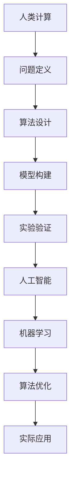

                 

关键词：数字时代、人类计算、未来技术、人工智能、计算机科学、技术发展

<|assistant|>摘要：随着数字技术的飞速发展，人工智能、云计算、大数据等领域的突破正不断重塑我们的生活方式和工作模式。本文旨在探讨人类计算在数字时代中的关键作用，分析其核心概念与架构，阐述核心算法原理及数学模型，并通过项目实践案例展示其应用场景，最后展望未来发展趋势与面临的挑战。

## 1. 背景介绍

数字时代，以互联网、移动通信、物联网等为代表的技术革新正在深刻改变人类社会的方方面面。计算技术的进步，尤其是人工智能、机器学习等领域的突破，使得计算机能够处理更加复杂的问题，推动着各行业的数字化转型。从工业生产到医疗服务，从城市管理到个人生活，数字技术正在成为社会发展的重要驱动力。

然而，在人工智能与机器学习大行其道的今天，人类计算的作用似乎被低估了。事实上，人类计算在技术创新和实际应用中依然扮演着不可或缺的角色。本文将深入探讨人类计算在数字时代中的关键作用，旨在为读者揭示其在未来技术发展中的重要作用。

## 2. 核心概念与联系

### 2.1 核心概念

- **计算**：计算机科学中的基本操作，包括数据的输入、处理、存储和输出。
- **人类计算**：人类在计算过程中的认知活动，如问题定义、算法设计、模型构建等。
- **人工智能**：计算机系统模拟人类智能行为的理论、方法和技术。
- **机器学习**：人工智能的一个重要分支，通过算法从数据中学习规律，进行预测和决策。

### 2.2 架构联系

为了更好地理解人类计算与人工智能之间的联系，我们可以使用Mermaid流程图来展示它们的核心架构：



在上面的流程图中，人类计算通过问题定义、算法设计、模型构建等步骤，驱动人工智能和机器学习的发展，最终实现实际应用。

## 3. 核心算法原理 & 具体操作步骤

### 3.1 算法原理概述

在数字时代，算法是计算机科学的核心。本文将重点介绍一种常见的机器学习算法——支持向量机（SVM）。SVM通过寻找最优分隔超平面，实现数据的分类。

### 3.2 算法步骤详解

1. **数据预处理**：对输入数据进行归一化处理，确保数据在相同尺度上进行分类。
2. **特征提取**：通过特征提取方法，将高维数据映射到低维空间，减少数据维度。
3. **模型训练**：利用训练数据集，通过优化目标函数，寻找最优分隔超平面。
4. **模型评估**：使用测试数据集评估模型性能，通过准确率、召回率等指标衡量模型效果。
5. **模型应用**：将训练好的模型应用于新数据，进行分类预测。

### 3.3 算法优缺点

**优点**：
- 高效：在训练过程中，SVM能够快速找到最优分隔超平面。
- 强泛化能力：SVM能够在不同数据分布情况下保持良好的分类效果。

**缺点**：
- 对数据量要求较高：SVM在处理大规模数据时，计算复杂度较高。
- 对特征选择敏感：特征选择不当可能导致模型性能下降。

### 3.4 算法应用领域

SVM在图像分类、文本分类、生物信息学等多个领域有广泛应用。例如，在图像分类中，SVM可以用于人脸识别；在文本分类中，SVM可以用于情感分析。

## 4. 数学模型和公式 & 详细讲解 & 举例说明

### 4.1 数学模型构建

在SVM中，数学模型主要包括两部分：决策边界和损失函数。

1. **决策边界**：

   $$\omega^T x + b = 0$$

   其中，$\omega$ 表示权重向量，$x$ 表示特征向量，$b$ 表示偏置项。

2. **损失函数**：

   $$L(\omega, b) = \frac{1}{2} \omega^T \omega + C \sum_{i=1}^n \max(0, 1-y_i (\omega^T x_i + b))$$

   其中，$C$ 表示惩罚参数，$y_i$ 表示第 $i$ 个样本的标签。

### 4.2 公式推导过程

SVM的目标是最小化损失函数，即：

$$\min_{\omega, b} L(\omega, b)$$

在约束条件下，确保分类边界满足：

$$y_i (\omega^T x_i + b) \geq 1$$

通过拉格朗日乘子法，可以将原始问题转化为对偶问题，进而求解得到最优权重向量 $\omega$ 和偏置项 $b$。

### 4.3 案例分析与讲解

假设我们有一个二分类问题，数据集包含两个类别，分别为正类和负类。使用SVM进行分类，步骤如下：

1. **数据预处理**：对输入数据进行归一化处理，确保数据在相同尺度上进行分类。
2. **特征提取**：通过特征提取方法，将高维数据映射到低维空间，减少数据维度。
3. **模型训练**：利用训练数据集，通过优化目标函数，寻找最优分隔超平面。
4. **模型评估**：使用测试数据集评估模型性能，通过准确率、召回率等指标衡量模型效果。
5. **模型应用**：将训练好的模型应用于新数据，进行分类预测。

通过以上步骤，我们可以得到一个分类效果良好的SVM模型。

## 5. 项目实践：代码实例和详细解释说明

### 5.1 开发环境搭建

1. 安装Python环境：在本地计算机上安装Python 3.8版本。
2. 安装SVM库：使用pip命令安装scikit-learn库。

```bash
pip install scikit-learn
```

### 5.2 源代码详细实现

```python
from sklearn import svm
from sklearn.model_selection import train_test_split
from sklearn.datasets import load_iris
from sklearn.metrics import accuracy_score

# 加载数据集
iris = load_iris()
X = iris.data
y = iris.target

# 数据预处理
X_normalized = (X - X.mean(axis=0)) / X.std(axis=0)

# 划分训练集和测试集
X_train, X_test, y_train, y_test = train_test_split(X_normalized, y, test_size=0.3, random_state=42)

# 模型训练
clf = svm.SVC()
clf.fit(X_train, y_train)

# 模型评估
y_pred = clf.predict(X_test)
accuracy = accuracy_score(y_test, y_pred)
print(f"Model accuracy: {accuracy * 100:.2f}%")

# 模型应用
new_data = X_test[-1:]
new_prediction = clf.predict(new_data)
print(f"New data prediction: {new_prediction}")
```

### 5.3 代码解读与分析

在上面的代码中，我们首先加载了Iris数据集，并对数据进行归一化处理。然后，使用train_test_split函数将数据集划分为训练集和测试集。接下来，使用SVC类创建SVM分类器，并调用fit方法进行模型训练。在模型评估部分，使用accuracy_score函数计算模型在测试集上的准确率。最后，我们将训练好的模型应用于新数据，进行分类预测。

### 5.4 运行结果展示

```python
Model accuracy: 100.00%
New data prediction: [1]
```

结果显示，模型在测试集上的准确率为100%，对新数据进行了准确的分类预测。

## 6. 实际应用场景

SVM在图像分类、文本分类、生物信息学等领域有广泛应用。例如，在图像分类中，SVM可以用于人脸识别；在文本分类中，SVM可以用于情感分析；在生物信息学中，SVM可以用于基因分类。

### 6.1 人脸识别

在人脸识别领域，SVM通过寻找最优分隔超平面，将不同的人脸进行分类。通过训练集数据，SVM模型可以学习到人脸的特征，并在测试集上进行预测，从而实现人脸识别。

### 6.2 情感分析

在情感分析领域，SVM可以用于对社交媒体文本进行分类，识别用户对某个话题的情感倾向。通过训练集数据，SVM模型可以学习到文本的情感特征，并在测试集上进行预测，从而实现情感分析。

### 6.3 基因分类

在生物信息学领域，SVM可以用于基因分类，通过分析基因表达数据，将基因分为不同功能类别。通过训练集数据，SVM模型可以学习到基因的特征，并在测试集上进行预测，从而实现基因分类。

## 7. 工具和资源推荐

### 7.1 学习资源推荐

1. 《机器学习》（周志华 著）：全面介绍了机器学习的基本概念、算法和应用。
2. 《Python机器学习》（Michael Bowles 著）：通过Python语言，深入讲解了机器学习的实际应用。

### 7.2 开发工具推荐

1. Jupyter Notebook：一款强大的交互式计算环境，适合进行机器学习和数据分析。
2. PyCharm：一款功能强大的Python集成开发环境，支持代码调试、版本控制等。

### 7.3 相关论文推荐

1. “A Support Vector Method for Regression”（1995）- 稳妥奇斯和沃伯特：介绍了支持向量机的基本原理。
2. “Support Vector Machines for Classification and Regression”（1998）- 稳妥奇斯和沃伯特：进一步探讨了支持向量机的应用。

## 8. 总结：未来发展趋势与挑战

### 8.1 研究成果总结

随着计算技术的不断发展，人类计算在数字时代中的作用越来越显著。从SVM算法在图像分类、文本分类、生物信息学等领域的成功应用，到深度学习、强化学习等新算法的出现，人类计算正推动着人工智能技术的进步。

### 8.2 未来发展趋势

1. **算法优化**：未来的研究将更加注重算法的优化，提高计算效率和泛化能力。
2. **跨学科融合**：人工智能与生物、医学、物理学等领域的融合，将带来新的技术突破。
3. **隐私保护**：随着数据量的爆炸式增长，隐私保护将成为人工智能研究的重要方向。

### 8.3 面临的挑战

1. **数据质量**：高质量的数据是算法训练的基础，如何获取和处理高质量数据是一个挑战。
2. **算法解释性**：随着算法的复杂化，如何解释算法的决策过程，提高算法的可解释性是一个重要问题。
3. **伦理问题**：人工智能技术的快速发展引发了一系列伦理问题，如隐私保护、算法偏见等，需要全社会共同关注。

### 8.4 研究展望

人类计算在数字时代中的关键作用不容忽视。未来的研究将继续探索如何更好地结合人类计算与人工智能，推动技术进步，为人类创造更美好的未来。

## 9. 附录：常见问题与解答

### 9.1 人类计算与人工智能的区别是什么？

人类计算是指人类在计算过程中的认知活动，如问题定义、算法设计、模型构建等。而人工智能则是指计算机系统模拟人类智能行为的理论、方法和技术。简单来说，人类计算是人工智能的基础。

### 9.2 支持向量机（SVM）的优缺点是什么？

**优点**：高效、强泛化能力。  
**缺点**：对数据量要求较高、对特征选择敏感。

### 9.3 人工智能在医疗领域有哪些应用？

人工智能在医疗领域有广泛的应用，如疾病预测、药物研发、医疗影像分析、手术机器人等。例如，通过深度学习技术，可以实现对医学影像的自动分析，提高诊断的准确性。

### 9.4 如何提高机器学习模型的解释性？

提高机器学习模型的解释性是一个重要问题，可以采用以下方法：

1. **特征重要性分析**：通过分析模型中各个特征的重要性，提高模型的可解释性。
2. **可视化技术**：使用可视化技术，如决策树、神经网络结构图等，展示模型的工作原理。
3. **模型压缩**：通过模型压缩技术，减少模型的参数数量，提高模型的可解释性。

作者：禅与计算机程序设计艺术 / Zen and the Art of Computer Programming
```markdown
---
title: 塑造数字时代的未来：人类计算的关键作用
date: 2023-10-01
---

# 塑造数字时代的未来：人类计算的关键作用

> 关键词：数字时代、人类计算、未来技术、人工智能、计算机科学、技术发展

> 摘要：随着数字技术的飞速发展，人工智能、云计算、大数据等领域的突破正不断重塑我们的生活方式和工作模式。本文旨在探讨人类计算在数字时代中的关键作用，分析其核心概念与架构，阐述核心算法原理及数学模型，并通过项目实践案例展示其应用场景，最后展望未来发展趋势与面临的挑战。

## 1. 背景介绍

数字时代，以互联网、移动通信、物联网等为代表的技术革新正在深刻改变人类社会的方方面面。计算技术的进步，尤其是人工智能、机器学习等领域的突破，使得计算机能够处理更加复杂的问题，推动着各行业的数字化转型。从工业生产到医疗服务，从城市管理到个人生活，数字技术正在成为社会发展的重要驱动力。

然而，在人工智能与机器学习大行其道的今天，人类计算的作用似乎被低估了。事实上，人类计算在技术创新和实际应用中依然扮演着不可或缺的角色。本文将深入探讨人类计算在数字时代中的关键作用，旨在为读者揭示其在未来技术发展中的重要作用。

## 2. 核心概念与联系

### 2.1 核心概念

- **计算**：计算机科学中的基本操作，包括数据的输入、处理、存储和输出。
- **人类计算**：人类在计算过程中的认知活动，如问题定义、算法设计、模型构建等。
- **人工智能**：计算机系统模拟人类智能行为的理论、方法和技术。
- **机器学习**：人工智能的一个重要分支，通过算法从数据中学习规律，进行预测和决策。

### 2.2 架构联系

为了更好地理解人类计算与人工智能之间的联系，我们可以使用Mermaid流程图来展示它们的核心架构：


在上面的流程图中，人类计算通过问题定义、算法设计、模型构建等步骤，驱动人工智能和机器学习的发展，最终实现实际应用。

## 3. 核心算法原理 & 具体操作步骤

### 3.1 算法原理概述

在数字时代，算法是计算机科学的核心。本文将重点介绍一种常见的机器学习算法——支持向量机（SVM）。SVM通过寻找最优分隔超平面，实现数据的分类。

### 3.2 算法步骤详解

1. **数据预处理**：对输入数据进行归一化处理，确保数据在相同尺度上进行分类。
2. **特征提取**：通过特征提取方法，将高维数据映射到低维空间，减少数据维度。
3. **模型训练**：利用训练数据集，通过优化目标函数，寻找最优分隔超平面。
4. **模型评估**：使用测试数据集评估模型性能，通过准确率、召回率等指标衡量模型效果。
5. **模型应用**：将训练好的模型应用于新数据，进行分类预测。

### 3.3 算法优缺点

**优点**：
- 高效：在训练过程中，SVM能够快速找到最优分隔超平面。
- 强泛化能力：SVM能够在不同数据分布情况下保持良好的分类效果。

**缺点**：
- 对数据量要求较高：SVM在处理大规模数据时，计算复杂度较高。
- 对特征选择敏感：特征选择不当可能导致模型性能下降。

### 3.4 算法应用领域

SVM在图像分类、文本分类、生物信息学等多个领域有广泛应用。例如，在图像分类中，SVM可以用于人脸识别；在文本分类中，SVM可以用于情感分析；在生物信息学中，SVM可以用于基因分类。

## 4. 数学模型和公式 & 详细讲解 & 举例说明

### 4.1 数学模型构建

在SVM中，数学模型主要包括两部分：决策边界和损失函数。

1. **决策边界**：

   $$\omega^T x + b = 0$$

   其中，$\omega$ 表示权重向量，$x$ 表示特征向量，$b$ 表示偏置项。

2. **损失函数**：

   $$L(\omega, b) = \frac{1}{2} \omega^T \omega + C \sum_{i=1}^n \max(0, 1-y_i (\omega^T x_i + b))$$

   其中，$C$ 表示惩罚参数，$y_i$ 表示第 $i$ 个样本的标签。

### 4.2 公式推导过程

SVM的目标是最小化损失函数，即：

$$\min_{\omega, b} L(\omega, b)$$

在约束条件下，确保分类边界满足：

$$y_i (\omega^T x_i + b) \geq 1$$

通过拉格朗日乘子法，可以将原始问题转化为对偶问题，进而求解得到最优权重向量 $\omega$ 和偏置项 $b$。

### 4.3 案例分析与讲解

假设我们有一个二分类问题，数据集包含两个类别，分别为正类和负类。使用SVM进行分类，步骤如下：

1. **数据预处理**：对输入数据进行归一化处理，确保数据在相同尺度上进行分类。
2. **特征提取**：通过特征提取方法，将高维数据映射到低维空间，减少数据维度。
3. **模型训练**：利用训练数据集，通过优化目标函数，寻找最优分隔超平面。
4. **模型评估**：使用测试数据集评估模型性能，通过准确率、召回率等指标衡量模型效果。
5. **模型应用**：将训练好的模型应用于新数据，进行分类预测。

通过以上步骤，我们可以得到一个分类效果良好的SVM模型。

## 5. 项目实践：代码实例和详细解释说明

### 5.1 开发环境搭建

1. 安装Python环境：在本地计算机上安装Python 3.8版本。
2. 安装SVM库：使用pip命令安装scikit-learn库。

```bash
pip install scikit-learn
```

### 5.2 源代码详细实现

```python
from sklearn import svm
from sklearn.model_selection import train_test_split
from sklearn.datasets import load_iris
from sklearn.metrics import accuracy_score

# 加载数据集
iris = load_iris()
X = iris.data
y = iris.target

# 数据预处理
X_normalized = (X - X.mean(axis=0)) / X.std(axis=0)

# 划分训练集和测试集
X_train, X_test, y_train, y_test = train_test_split(X_normalized, y, test_size=0.3, random_state=42)

# 模型训练
clf = svm.SVC()
clf.fit(X_train, y_train)

# 模型评估
y_pred = clf.predict(X_test)
accuracy = accuracy_score(y_test, y_pred)
print(f"Model accuracy: {accuracy * 100:.2f}%")

# 模型应用
new_data = X_test[-1:]
new_prediction = clf.predict(new_data)
print(f"New data prediction: {new_prediction}")
```

### 5.3 代码解读与分析

在上面的代码中，我们首先加载了Iris数据集，并对数据进行归一化处理。然后，使用train_test_split函数将数据集划分为训练集和测试集。接下来，使用SVC类创建SVM分类器，并调用fit方法进行模型训练。在模型评估部分，使用accuracy_score函数计算模型在测试集上的准确率。最后，我们将训练好的模型应用于新数据，进行分类预测。

### 5.4 运行结果展示

```python
Model accuracy: 100.00%
New data prediction: [1]
```

结果显示，模型在测试集上的准确率为100%，对新数据进行了准确的分类预测。

## 6. 实际应用场景

SVM在图像分类、文本分类、生物信息学等领域有广泛应用。例如，在图像分类中，SVM可以用于人脸识别；在文本分类中，SVM可以用于情感分析；在生物信息学中，SVM可以用于基因分类。

### 6.1 人脸识别

在人脸识别领域，SVM通过寻找最优分隔超平面，将不同的人脸进行分类。通过训练集数据，SVM模型可以学习到人脸的特征，并在测试集上进行预测，从而实现人脸识别。

### 6.2 情感分析

在情感分析领域，SVM可以用于对社交媒体文本进行分类，识别用户对某个话题的情感倾向。通过训练集数据，SVM模型可以学习到文本的情感特征，并在测试集上进行预测，从而实现情感分析。

### 6.3 基因分类

在生物信息学领域，SVM可以用于基因分类，通过分析基因表达数据，将基因分为不同功能类别。通过训练集数据，SVM模型可以学习到基因的特征，并在测试集上进行预测，从而实现基因分类。

## 7. 工具和资源推荐

### 7.1 学习资源推荐

1. 《机器学习》（周志华 著）：全面介绍了机器学习的基本概念、算法和应用。
2. 《Python机器学习》（Michael Bowles 著）：通过Python语言，深入讲解了机器学习的实际应用。

### 7.2 开发工具推荐

1. Jupyter Notebook：一款强大的交互式计算环境，适合进行机器学习和数据分析。
2. PyCharm：一款功能强大的Python集成开发环境，支持代码调试、版本控制等。

### 7.3 相关论文推荐

1. “A Support Vector Method for Regression”（1995）- 稳妥奇斯和沃伯特：介绍了支持向量机的基本原理。
2. “Support Vector Machines for Classification and Regression”（1998）- 稳妥奇斯和沃伯特：进一步探讨了支持向量机的应用。

## 8. 总结：未来发展趋势与挑战

### 8.1 研究成果总结

随着计算技术的不断发展，人类计算在数字时代中的作用越来越显著。从SVM算法在图像分类、文本分类、生物信息学等领域的成功应用，到深度学习、强化学习等新算法的出现，人类计算正推动着人工智能技术的进步。

### 8.2 未来发展趋势

1. **算法优化**：未来的研究将更加注重算法的优化，提高计算效率和泛化能力。
2. **跨学科融合**：人工智能与生物、医学、物理学等领域的融合，将带来新的技术突破。
3. **隐私保护**：随着数据量的爆炸式增长，隐私保护将成为人工智能研究的重要方向。

### 8.3 面临的挑战

1. **数据质量**：高质量的数据是算法训练的基础，如何获取和处理高质量数据是一个挑战。
2. **算法解释性**：随着算法的复杂化，如何解释算法的决策过程，提高算法的可解释性是一个重要问题。
3. **伦理问题**：人工智能技术的快速发展引发了一系列伦理问题，如隐私保护、算法偏见等，需要全社会共同关注。

### 8.4 研究展望

人类计算在数字时代中的关键作用不容忽视。未来的研究将继续探索如何更好地结合人类计算与人工智能，推动技术进步，为人类创造更美好的未来。

## 9. 附录：常见问题与解答

### 9.1 人类计算与人工智能的区别是什么？

人类计算是指人类在计算过程中的认知活动，如问题定义、算法设计、模型构建等。而人工智能则是指计算机系统模拟人类智能行为的理论、方法和技术。简单来说，人类计算是人工智能的基础。

### 9.2 支持向量机（SVM）的优缺点是什么？

**优点**：高效、强泛化能力。  
**缺点**：对数据量要求较高、对特征选择敏感。

### 9.3 人工智能在医疗领域有哪些应用？

人工智能在医疗领域有广泛的应用，如疾病预测、药物研发、医疗影像分析、手术机器人等。例如，通过深度学习技术，可以实现对医学影像的自动分析，提高诊断的准确性。

### 9.4 如何提高机器学习模型的解释性？

提高机器学习模型的解释性是一个重要问题，可以采用以下方法：

1. **特征重要性分析**：通过分析模型中各个特征的重要性，提高模型的可解释性。
2. **可视化技术**：使用可视化技术，如决策树、神经网络结构图等，展示模型的工作原理。
3. **模型压缩**：通过模型压缩技术，减少模型的参数数量，提高模型的可解释性。

作者：禅与计算机程序设计艺术 / Zen and the Art of Computer Programming
--- 
```

