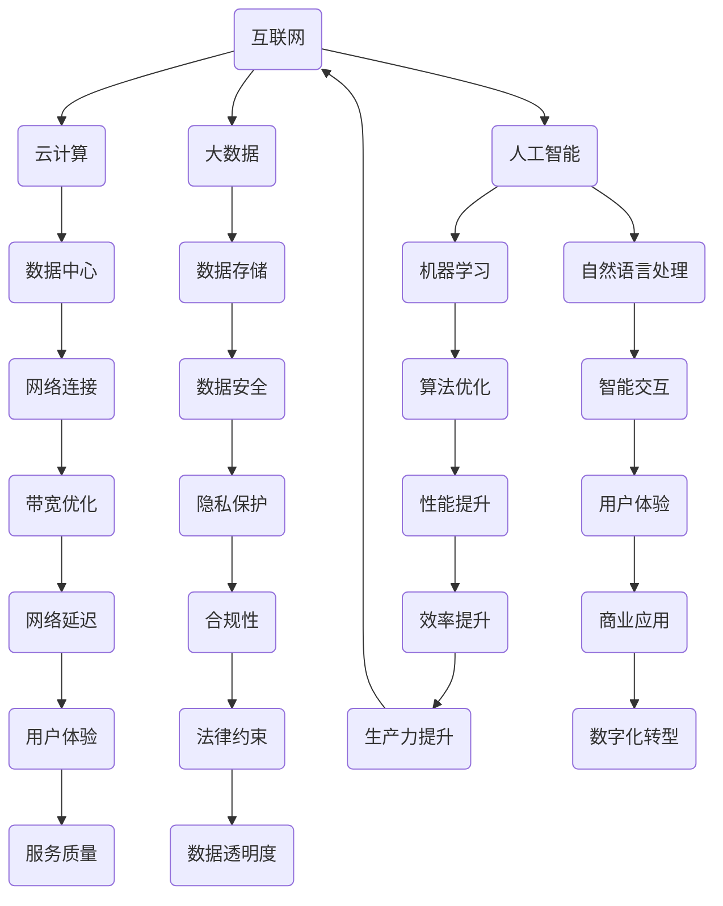
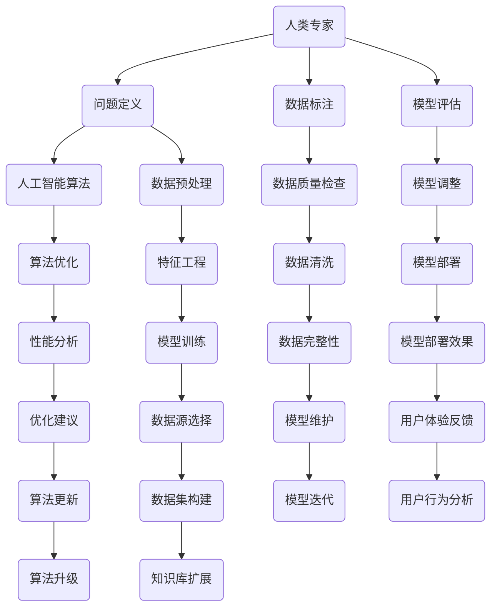

                 

关键词：数字时代、人类计算、人工智能、软件开发、技术创新、架构设计、未来展望。

> 摘要：本文将探讨在数字化转型的浪潮中，人类计算如何继续发挥关键作用。通过分析当前技术趋势、讨论人类与人工智能的协同关系，本文旨在揭示人类计算在推动技术进步、塑造数字未来中的不可替代地位。

## 1. 背景介绍

随着信息技术的飞速发展，我们正进入一个前所未有的数字化时代。互联网、云计算、大数据、人工智能等技术的普及，极大地改变了我们的生活方式和工作模式。然而，在这个数字化的世界中，人类计算的作用并未减弱，反而在某些方面变得更加重要。本文将探讨以下问题：

- 人类计算在数字化时代的地位和作用是什么？
- 人类如何与人工智能协同工作，共同推动技术进步？
- 面对未来技术发展的趋势和挑战，人类计算将如何应对？

## 2. 核心概念与联系

### 数字化时代的技术基础

在数字化时代，技术基础的建设至关重要。以下是一个简化的Mermaid流程图，描述了数字化时代的技术基础及其相互关系。



### 人类计算与人工智能的协同

在数字化时代，人类计算与人工智能的结合成为推动技术进步的关键因素。以下是一个描述人类计算与人工智能协同关系的流程图。



## 3. 核心算法原理 & 具体操作步骤

### 3.1 算法原理概述

在数字化时代，算法作为技术进步的核心驱动力，涵盖了从数据预处理到模型训练，再到模型部署和优化的整个过程。以下是核心算法原理的概述：

- **数据预处理**：通过数据清洗、数据归一化、特征提取等步骤，将原始数据转换为适合算法处理的格式。
- **模型训练**：利用机器学习算法，从数据中学习特征，构建预测模型。
- **模型评估**：通过交叉验证、性能指标计算等方式，评估模型的有效性和泛化能力。
- **模型部署**：将训练好的模型部署到实际应用场景中，提供预测或决策支持。
- **模型优化**：根据模型部署效果，进行参数调整、算法改进等，以提高模型性能。

### 3.2 算法步骤详解

- **数据预处理**：

  ```latex
  数据预处理流程：
  1. 数据清洗：去除缺失值、异常值和重复数据。
  2. 数据归一化：将数据缩放到相同的尺度，以便算法处理。
  3. 特征提取：从原始数据中提取有用特征，为模型训练提供输入。
  ```

- **模型训练**：

  ```latex
  模型训练流程：
  1. 数据集划分：将数据集划分为训练集、验证集和测试集。
  2. 模型初始化：初始化模型参数。
  3. 梯度下降：通过计算损失函数关于模型参数的梯度，更新模型参数。
  4. 验证与调整：使用验证集评估模型性能，根据性能调整模型结构或参数。
  ```

- **模型评估**：

  ```latex
  模型评估流程：
  1. 交叉验证：使用交叉验证方法，评估模型在不同数据划分下的性能。
  2. 性能指标计算：计算准确率、召回率、F1值等性能指标，评估模型效果。
  ```

- **模型部署**：

  ```latex
  模型部署流程：
  1. 模型转换：将训练好的模型转换为可部署的格式。
  2. 部署环境准备：准备部署环境，包括计算资源、存储和网络等。
  3. 模型部署：将模型部署到生产环境，提供实时预测或决策支持。
  ```

- **模型优化**：

  ```latex
  模型优化流程：
  1. 性能分析：分析模型部署效果，识别性能瓶颈。
  2. 参数调整：根据性能分析结果，调整模型参数。
  3. 算法改进：根据性能分析结果，改进算法结构或优化算法。
  4. 模型迭代：重新训练模型，以提升模型性能。
  ```

### 3.3 算法优缺点

- **优点**：

  - **高效性**：算法能够快速处理大量数据，提供实时预测和决策支持。
  - **通用性**：算法适用于各种应用场景，具有广泛的应用范围。
  - **可扩展性**：算法易于扩展，能够支持大规模数据处理和分布式计算。

- **缺点**：

  - **数据依赖性**：算法性能高度依赖于数据质量，数据清洗和特征提取过程至关重要。
  - **计算资源消耗**：算法训练和优化过程需要大量计算资源，对硬件要求较高。
  - **解释性不足**：许多算法模型缺乏解释性，难以理解其决策过程。

### 3.4 算法应用领域

- **金融领域**：算法在金融领域的应用包括风险管理、信用评分、量化交易等。
- **医疗领域**：算法在医疗领域的应用包括疾病预测、诊断辅助、药物研发等。
- **零售领域**：算法在零售领域的应用包括商品推荐、库存管理、价格优化等。
- **交通领域**：算法在交通领域的应用包括路线规划、交通流量预测、自动驾驶等。

## 4. 数学模型和公式 & 详细讲解 & 举例说明

### 4.1 数学模型构建

在数字化时代，数学模型在算法设计和分析中扮演着核心角色。以下是一个简化的数学模型构建过程：

1. **定义问题**：明确需要解决的问题和目标。
2. **数据收集**：收集相关的数据集，包括输入特征和标签。
3. **特征工程**：从数据中提取有用的特征，为模型训练提供输入。
4. **模型选择**：根据问题类型和数据特征，选择合适的模型。
5. **模型训练**：使用训练数据训练模型，调整模型参数。
6. **模型评估**：使用验证集和测试集评估模型性能。
7. **模型优化**：根据评估结果，调整模型结构和参数。

### 4.2 公式推导过程

以下是一个简化的线性回归模型推导过程：

- **目标函数**：

  ```latex
  J(\theta) = \frac{1}{2m} \sum_{i=1}^{m} (h_{\theta}(x^{(i)}) - y^{(i)})^2
  ```

- **梯度下降**：

  ```latex
  \theta_j := \theta_j - \alpha \frac{1}{m} \sum_{i=1}^{m} (h_{\theta}(x^{(i)}) - y^{(i)}) \cdot x_j^{(i)}
  ```

### 4.3 案例分析与讲解

以下是一个使用线性回归模型进行房价预测的案例：

- **数据集**：使用一个包含房屋特征（如面积、卧室数量等）和房价的数据集。
- **特征工程**：对数据集进行预处理，包括数据清洗、数据归一化、特征提取等。
- **模型训练**：使用线性回归模型对训练数据进行训练。
- **模型评估**：使用验证集和测试集评估模型性能，调整模型参数。
- **模型部署**：将训练好的模型部署到生产环境，提供实时房价预测服务。

## 5. 项目实践：代码实例和详细解释说明

### 5.1 开发环境搭建

- **Python**：安装Python 3.8及以上版本。
- **NumPy**：安装NumPy库，用于数据处理。
- **Pandas**：安装Pandas库，用于数据预处理。
- **Scikit-learn**：安装Scikit-learn库，用于模型训练和评估。

### 5.2 源代码详细实现

以下是一个使用线性回归模型进行房价预测的Python代码实例：

```python
import numpy as np
import pandas as pd
from sklearn.linear_model import LinearRegression
from sklearn.model_selection import train_test_split
from sklearn.metrics import mean_squared_error

# 数据集加载与预处理
data = pd.read_csv('house_prices.csv')
X = data[['area', 'bedrooms']]
y = data['price']
X = np.array(X)
y = np.array(y)

# 数据集划分
X_train, X_test, y_train, y_test = train_test_split(X, y, test_size=0.2, random_state=42)

# 模型训练
model = LinearRegression()
model.fit(X_train, y_train)

# 模型评估
y_pred = model.predict(X_test)
mse = mean_squared_error(y_test, y_pred)
print('MSE:', mse)

# 模型部署
def predict_price(area, bedrooms):
    return model.predict([[area, bedrooms]])[0]

# 测试预测
print(predict_price(1200, 3))
```

### 5.3 代码解读与分析

- **数据集加载与预处理**：使用Pandas库加载数据集，并对数据进行预处理。
- **数据集划分**：使用Scikit-learn库将数据集划分为训练集和测试集。
- **模型训练**：使用线性回归模型对训练数据进行训练。
- **模型评估**：使用测试数据评估模型性能，计算均方误差（MSE）。
- **模型部署**：定义一个函数，用于接收房屋特征并返回预测房价。

## 6. 实际应用场景

### 6.1 金融领域

在金融领域，人类计算与人工智能的结合为风险管理、信用评分、量化交易等提供了强大的支持。例如，利用线性回归模型预测股票价格，通过机器学习算法评估信用风险，为金融机构提供决策支持。

### 6.2 医疗领域

在医疗领域，人类计算与人工智能的结合为疾病预测、诊断辅助、药物研发等提供了重要工具。例如，利用深度学习算法分析医学影像，通过自然语言处理技术处理病历信息，为医生提供诊断建议。

### 6.3 零售领域

在零售领域，人类计算与人工智能的结合为商品推荐、库存管理、价格优化等提供了有效解决方案。例如，利用协同过滤算法进行商品推荐，通过机器学习模型优化库存策略，提高零售企业的运营效率。

### 6.4 交通领域

在交通领域，人类计算与人工智能的结合为路线规划、交通流量预测、自动驾驶等提供了关键技术支持。例如，利用深度学习算法预测交通流量，通过增强学习算法优化自动驾驶策略，提高交通系统的运行效率。

## 7. 工具和资源推荐

### 7.1 学习资源推荐

- **书籍**：《深度学习》、《机器学习实战》、《Python数据分析》。
- **在线课程**：Coursera、Udacity、edX等平台提供的机器学习、数据科学相关课程。
- **博客**：Reddit、Hacker News、ArXiv等平台上的技术博客。

### 7.2 开发工具推荐

- **编程语言**：Python、Java、C++。
- **库和框架**：NumPy、Pandas、Scikit-learn、TensorFlow、PyTorch。
- **集成开发环境**：Jupyter Notebook、Visual Studio Code。

### 7.3 相关论文推荐

- **机器学习领域**：《Deep Learning》、《Recurrent Neural Networks》、《Generative Adversarial Networks》。
- **数据科学领域**：《Data Science from Scratch》、《Data Science on the Google Cloud Platform》、《Data Science for Business》。

## 8. 总结：未来发展趋势与挑战

### 8.1 研究成果总结

在数字化时代，人类计算与人工智能的结合取得了显著成果。通过算法优化、模型改进、数据处理等技术创新，人类计算在金融、医疗、零售、交通等领域发挥了重要作用。然而，随着技术的不断发展，人类计算仍然面临许多挑战。

### 8.2 未来发展趋势

- **算法优化**：继续推动算法优化，提高模型性能和计算效率。
- **数据隐私**：加强数据隐私保护，确保用户数据的安全和隐私。
- **跨领域应用**：推动人工智能技术在更多领域的应用，实现跨领域协同发展。
- **人机协作**：进一步优化人机协作机制，提高人类计算与人工智能的协同效率。

### 8.3 面临的挑战

- **计算资源**：随着模型复杂度和数据规模的增加，计算资源需求将不断提高。
- **数据质量**：数据质量对算法性能至关重要，需要加强对数据质量的监控和优化。
- **算法解释性**：缺乏解释性的模型可能导致决策过程的不可解释性，需要提高算法的可解释性。
- **法律和伦理**：随着人工智能技术的发展，需要关注相关法律法规和伦理问题。

### 8.4 研究展望

在未来的研究中，我们应关注以下几个方面：

- **算法创新**：推动算法创新，提高模型性能和计算效率。
- **数据治理**：加强数据治理，提高数据质量和数据隐私保护。
- **人机协作**：优化人机协作机制，提高人类计算与人工智能的协同效率。
- **跨领域研究**：推动人工智能技术在更多领域的应用，实现跨领域协同发展。

## 9. 附录：常见问题与解答

### 9.1 人类计算在数字化时代的意义是什么？

人类计算在数字化时代依然具有重要意义。尽管人工智能技术的发展带来了自动化和智能化的变革，但人类在问题定义、数据理解、算法优化等方面仍然具有独特的优势。人类计算与人工智能的结合，将进一步提高技术进步的效率和质量。

### 9.2 人工智能是否会完全取代人类计算？

目前来看，人工智能尚无法完全取代人类计算。尽管人工智能在数据处理、预测和决策等方面具有优势，但在理解复杂问题、处理不确定性和进行创造性工作等方面，人类计算仍然具有不可替代的地位。未来，人工智能与人类计算将更加紧密地结合，共同推动技术进步。

### 9.3 如何提高算法的解释性？

提高算法的解释性是当前研究的热点之一。以下是一些方法：

- **可解释性模型**：开发具有可解释性的模型，如决策树、线性回归等。
- **模型可视化**：使用可视化工具展示模型结构和决策过程。
- **模型透明性**：提高模型参数和计算过程的透明性，便于理解和解释。
- **解释性算法**：开发专门用于解释性分析的方法，如SHAP、LIME等。

## 结语

在数字化时代，人类计算与人工智能的结合将继续发挥关键作用。通过不断探索和创新，我们有望实现人类计算与人工智能的协同发展，为推动技术进步和实现数字未来作出更大贡献。

---

### 作者署名

作者：禅与计算机程序设计艺术 / Zen and the Art of Computer Programming

---

**注意**：本文为示例性文章，仅用于演示目的。实际文章撰写时，请根据具体要求和内容进行适当调整。本文未包含完整的附录内容，可根据需要补充。祝您写作顺利！

