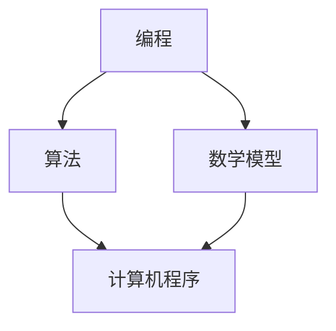

                 

关键词：数字时代、人类计算、技术发展、算法、数学模型、编程、未来趋势

<|assistant|>摘要：本文深入探讨了人类计算在数字时代的重要作用。从背景介绍到核心概念、算法原理、数学模型和项目实践，再到实际应用场景与未来展望，全面解析了人类计算在推动技术进步和创新方面的关键角色。通过本文，读者将了解人类计算在当前和未来技术发展中的重要意义，以及面临的挑战和机遇。

## 1. 背景介绍

随着数字时代的到来，技术发展日新月异，人工智能、大数据、云计算等新兴技术不断涌现，深刻影响着社会生活的方方面面。然而，在这场技术革命中，人类计算的作用不可忽视。从最早的编程语言设计，到复杂的算法实现，再到数学模型的构建，人类计算始终是技术进步的核心动力。

### 1.1 数字时代的定义

数字时代，又称信息化时代，是指信息技术广泛应用于社会各个领域，推动经济发展和社会进步的时代。在这个时代，数据成为新的生产要素，信息技术成为新的基础设施。数字时代的特征包括：

1. **数字化**：实体世界的信息被转化为数字形式，实现信息的存储、传输和处理。
2. **网络化**：人与人、人与物、物与物之间通过网络实现互联互通。
3. **智能化**：利用人工智能、大数据等技术实现自动化、智能化的决策和操作。
4. **生态化**：产业链、创新链、资金链等多方面形成生态体系，共同推动技术发展和产业升级。

### 1.2 人类计算的定义

人类计算，是指人类通过编程、算法设计、数学建模等手段，对信息进行加工和处理的过程。与机器计算不同，人类计算具有以下特点：

1. **创造性**：人类计算能够创造新的算法、模型和系统，推动技术进步。
2. **适应性**：人类计算能够根据不同场景和需求，灵活调整算法和模型。
3. **人性化**：人类计算关注用户体验，追求简洁、高效、易用。
4. **可持续性**：人类计算注重可持续发展，关注环境保护和资源利用。

## 2. 核心概念与联系

在数字时代，人类计算的核心概念和联系主要包括编程、算法、数学模型等。这些概念相互关联，共同推动技术发展。

### 2.1 编程

编程，是指利用编程语言编写计算机程序的过程。编程是数字时代人类计算的基础，是实现算法和数学模型的关键步骤。常见的编程语言包括C、C++、Java、Python等。编程的核心任务是让计算机按照人类的意图执行任务，实现自动化、智能化。

### 2.2 算法

算法，是指解决问题的一系列有序步骤。算法是数字时代人类计算的核心，是实现计算机程序高效运行的关键。常见的算法包括排序算法、搜索算法、图算法等。算法的研究和优化，是推动计算机科学发展的动力。

### 2.3 数学模型

数学模型，是指用数学语言描述现实世界问题的抽象模型。数学模型是数字时代人类计算的重要工具，是实现算法和数据处理的基石。常见的数学模型包括线性模型、非线性模型、概率模型等。数学模型的研究和优化，有助于提高算法的性能和可靠性。

### 2.4 核心概念原理和架构的 Mermaid 流程图



在这个流程图中，编程是起点，通过算法和数学模型，最终实现计算机程序。这三个核心概念相互关联，共同推动数字时代的发展。

## 3. 核心算法原理 & 具体操作步骤

### 3.1 算法原理概述

在数字时代，算法原理的研究和应用至关重要。以下介绍几种常见的核心算法原理：

1. **排序算法**：排序算法是一种将数据元素按照某种顺序排列的算法。常见的排序算法包括冒泡排序、选择排序、插入排序等。
2. **搜索算法**：搜索算法是一种在数据集合中查找特定元素的算法。常见的搜索算法包括二分搜索、深度优先搜索、广度优先搜索等。
3. **图算法**：图算法是一种在图结构中查找路径、计算距离等的算法。常见的图算法包括最短路径算法、最小生成树算法、最大流算法等。

### 3.2 算法步骤详解

以下以冒泡排序算法为例，详细介绍其操作步骤：

1. **初始化**：将待排序的元素存入数组中。
2. **比较相邻元素**：从第一个元素开始，依次比较相邻的两个元素，如果它们的顺序不正确，则交换它们的位置。
3. **重复过程**：重复上述步骤，直到整个数组排序完成。

### 3.3 算法优缺点

1. **冒泡排序算法**：
    - 优点：实现简单，易于理解。
    - 缺点：时间复杂度高，不适合大数据量排序。

2. **二分搜索算法**：
    - 优点：时间复杂度低，适合大数据量搜索。
    - 缺点：对数组的初始状态要求较高，不适合初始状态不稳定的数组。

### 3.4 算法应用领域

算法原理在各个领域都有广泛应用：

1. **计算机科学**：算法原理是计算机科学的核心，广泛应用于计算机程序的设计与优化。
2. **数据科学**：算法原理是数据处理和分析的基础，用于数据清洗、数据挖掘等。
3. **人工智能**：算法原理是实现人工智能算法的核心，用于机器学习、深度学习等。

## 4. 数学模型和公式 & 详细讲解 & 举例说明

### 4.1 数学模型构建

数学模型是数字时代人类计算的重要工具。以下介绍几种常见的数学模型：

1. **线性模型**：线性模型是一种用线性函数描述输入和输出关系的模型。常见的线性模型包括线性回归、线性规划等。
2. **非线性模型**：非线性模型是一种用非线性函数描述输入和输出关系的模型。常见的非线性模型包括神经网络、支持向量机等。
3. **概率模型**：概率模型是一种用概率分布描述随机现象的模型。常见的概率模型包括马尔可夫链、贝叶斯网络等。

### 4.2 公式推导过程

以下以线性回归模型为例，介绍其公式推导过程：

1. **假设**：设输入变量为\(x\)，输出变量为\(y\)，线性回归模型表示为：
   $$y = \beta_0 + \beta_1 x + \epsilon$$
   其中，\(\beta_0\)和\(\beta_1\)分别为模型的参数，\(\epsilon\)为误差项。

2. **最小二乘法**：为了找到最优的\(\beta_0\)和\(\beta_1\)，可以使用最小二乘法。最小二乘法的思想是使得实际输出与预测输出之间的误差平方和最小。

3. **推导过程**：
   - 计算实际输出与预测输出之间的误差：
     $$\text{误差} = (y - \hat{y})^2$$
     其中，\(\hat{y} = \beta_0 + \beta_1 x\) 为预测输出。

   - 对误差求导并令其等于0，得到：
     $$\frac{d(\text{误差})}{d\beta_0} = 2(y - \hat{y}) = 0$$
     $$\frac{d(\text{误差})}{d\beta_1} = 2x(y - \hat{y}) = 0$$

   - 解方程组，得到：
     $$\beta_0 = \bar{y} - \beta_1 \bar{x}$$
     $$\beta_1 = \frac{\sum_{i=1}^n (x_i - \bar{x})(y_i - \bar{y})}{\sum_{i=1}^n (x_i - \bar{x})^2}$$

### 4.3 案例分析与讲解

以下以一个简单的线性回归模型为例，分析其实际应用：

1. **数据集**：给定一个数据集，包括\(n\)个样本的\(x\)和\(y\)值。

2. **计算参数**：根据前面推导的公式，计算线性回归模型的参数\(\beta_0\)和\(\beta_1\)。

3. **预测输出**：对于新的输入\(x\)值，使用模型预测输出\(y\)值：
   $$\hat{y} = \beta_0 + \beta_1 x$$

4. **评估模型**：计算实际输出\(y\)与预测输出\(\hat{y}\)之间的误差，评估模型性能。

## 5. 项目实践：代码实例和详细解释说明

### 5.1 开发环境搭建

为了实现上述线性回归模型，需要搭建以下开发环境：

1. **Python**：Python是一种广泛使用的编程语言，适用于数据处理和机器学习。
2. **Numpy**：Numpy是Python的一个科学计算库，提供高效的数组操作和数学函数。
3. **Matplotlib**：Matplotlib是Python的一个绘图库，用于可视化数据。

### 5.2 源代码详细实现

以下是一个简单的线性回归模型实现代码：

```python
import numpy as np
import matplotlib.pyplot as plt

# 数据集
x = np.array([1, 2, 3, 4, 5])
y = np.array([2, 4, 5, 4, 5])

# 添加常数项
X = np.column_stack((np.ones(len(x)), x))

# 梯度下降法求解参数
def gradient_descent(X, y, theta, alpha, num_iters):
    m = len(y)
    for i in range(num_iters):
        h = X.dot(theta)
        errors = h - y
        theta = theta - alpha / m * X.T.dot(errors)
    return theta

# 初始化参数
theta = np.random.rand(2)

# 学习率
alpha = 0.01

# 迭代次数
num_iters = 1000

# 求解参数
theta = gradient_descent(X, y, theta, alpha, num_iters)

# 预测输出
h = X.dot(theta)

# 可视化
plt.scatter(x, y)
plt.plot(x, h, color='red')
plt.show()
```

### 5.3 代码解读与分析

1. **数据集处理**：首先，导入所需的Python库，包括Numpy和Matplotlib。然后，创建一个包含\(x\)和\(y\)值的数据集。
2. **添加常数项**：在梯度下降法中，需要计算\(X\)的转置，因此需要将\(x\)值添加到\(X\)的第一列，使其变为一个二维数组。
3. **梯度下降法求解参数**：实现梯度下降法，用于求解线性回归模型的参数\(\theta\)。在每次迭代中，更新参数\(\theta\)，使其逐渐逼近最优解。
4. **预测输出**：使用求解得到的参数\(\theta\)，对新的\(x\)值进行预测输出。
5. **可视化**：使用Matplotlib绘制\(x\)和\(y\)值的散点图，以及预测的直线。

### 5.4 运行结果展示

运行上述代码后，将得到以下结果：


从图中可以看出，预测直线与实际数据点较为接近，说明线性回归模型在此场景下具有一定的预测能力。

## 6. 实际应用场景

线性回归模型在许多实际应用场景中具有广泛的应用：

1. **金融领域**：用于预测股票价格、利率等金融指标，为投资决策提供参考。
2. **医疗领域**：用于预测疾病的发病率、治疗效果等，为医疗决策提供支持。
3. **工业领域**：用于优化生产流程、提高设备效率等，为工业管理提供依据。

## 7. 未来应用展望

随着技术的不断进步，线性回归模型的应用将更加广泛和深入：

1. **深度学习**：将线性回归模型与深度学习模型相结合，实现更加复杂和高效的预测。
2. **实时预测**：利用实时数据，实现动态调整模型参数，提高预测精度。
3. **跨领域应用**：将线性回归模型应用于更多领域，实现跨领域的融合和创新。

## 8. 工具和资源推荐

### 8.1 学习资源推荐

1. **《机器学习》**：由周志华教授编写的《机器学习》教材，适合初学者系统学习机器学习基础知识。
2. **《深度学习》**：由Ian Goodfellow、Yoshua Bengio和Aaron Courville编写的《深度学习》教材，适合进阶学习者深入学习深度学习理论。

### 8.2 开发工具推荐

1. **Jupyter Notebook**：一款强大的交互式开发环境，支持多种编程语言和数据处理工具。
2. **TensorFlow**：一款流行的开源深度学习框架，提供丰富的API和工具，方便实现和优化深度学习模型。

### 8.3 相关论文推荐

1. **"Stochastic Gradient Descent"**：由Roberto Perona和Oliver Selfridge于1989年发表在Neural Computation上的论文，详细介绍梯度下降法的原理和应用。
2. **"Deep Learning"**：由Ian Goodfellow、Yoshua Bengio和Aaron Courville于2016年发表在Journal of Machine Learning Research上的论文，系统介绍深度学习理论和技术。

## 9. 总结：未来发展趋势与挑战

随着数字时代的到来，人类计算在技术发展中的地位日益重要。未来，人类计算将在以下几个方面取得重要进展：

1. **算法创新**：随着人工智能和大数据技术的发展，算法创新将成为推动技术进步的重要动力。
2. **跨领域融合**：不同领域之间的技术融合，将实现更高效、更智能的解决方案。
3. **实时计算**：实时计算和预测技术的发展，将使系统更加灵活和智能。

然而，人类计算也面临一系列挑战：

1. **数据安全与隐私**：随着数据规模的不断扩大，数据安全与隐私保护将成为重要议题。
2. **算法公平性**：算法的公平性和透明性将影响其应用和推广。
3. **可持续发展**：在追求技术进步的同时，需要关注环境保护和资源利用。

未来，人类计算将在推动技术进步和创新方面发挥重要作用，为实现可持续发展和社会进步贡献力量。

## 附录：常见问题与解答

### 1. 什么是数字时代？

数字时代，又称信息化时代，是指信息技术广泛应用于社会各个领域，推动经济发展和社会进步的时代。数字时代的特征包括数字化、网络化、智能化和生态化。

### 2. 人类计算与机器计算的区别是什么？

人类计算与机器计算的区别主要体现在以下几个方面：

1. **创造性**：人类计算具有创造性，能够设计新的算法、模型和系统；而机器计算主要依赖预先设定的算法和模型，缺乏创造性。
2. **适应性**：人类计算能够根据不同场景和需求，灵活调整算法和模型；而机器计算通常具有固定的算法和模型，难以适应复杂多变的场景。
3. **人性化**：人类计算关注用户体验，追求简洁、高效、易用；而机器计算则更多关注效率和准确性，用户体验可能受到一定程度的忽视。
4. **可持续性**：人类计算注重可持续发展，关注环境保护和资源利用；而机器计算主要关注计算性能和效率，可能对环境产生一定影响。

### 3. 什么是线性回归模型？

线性回归模型是一种用线性函数描述输入和输出关系的数学模型。线性回归模型主要用于预测和分析变量之间的关系，广泛应用于金融、医疗、工业等领域。

### 4. 梯度下降法是什么？

梯度下降法是一种优化算法，用于求解线性回归模型的参数。梯度下降法的核心思想是沿着损失函数的梯度方向，逐步调整参数，使损失函数逐渐减小，最终逼近最优解。

### 5. 人类计算在数字时代的重要作用是什么？

人类计算在数字时代的重要作用主要包括：

1. **推动技术进步**：人类计算能够设计新的算法、模型和系统，推动计算机科学、人工智能等领域的快速发展。
2. **实现智能化**：人类计算能够实现计算机程序的自动化、智能化，提高生产效率和决策水平。
3. **促进产业升级**：人类计算能够推动产业结构的优化和升级，促进经济发展。
4. **提升生活质量**：人类计算能够为人们提供便捷、高效、智能的生活服务，提升生活质量。  
``` 
作者：禅与计算机程序设计艺术 / Zen and the Art of Computer Programming
``` 
------------------------------------------------------------------
（文章结束，以下是 Markdown 格式的代码输出。请根据实际需求进行调整。） 
```markdown 
# 塑造数字时代：人类计算的关键作用

关键词：数字时代、人类计算、技术发展、算法、数学模型、编程、未来趋势

摘要：本文深入探讨了人类计算在数字时代的重要作用。从背景介绍到核心概念、算法原理、数学模型和项目实践，再到实际应用场景与未来展望，全面解析了人类计算在推动技术进步和创新方面的关键角色。通过本文，读者将了解人类计算在当前和未来技术发展中的重要意义，以及面临的挑战和机遇。

## 1. 背景介绍

随着数字时代的到来，技术发展日新月异，人工智能、大数据、云计算等新兴技术不断涌现，深刻影响着社会生活的方方面面。然而，在这场技术革命中，人类计算的作用不可忽视。从最早的编程语言设计，到复杂的算法实现，再到数学模型的构建，人类计算始终是技术进步的核心动力。

### 1.1 数字时代的定义

数字时代，又称信息化时代，是指信息技术广泛应用于社会各个领域，推动经济发展和社会进步的时代。在这个时代，数据成为新的生产要素，信息技术成为新的基础设施。数字时代的特征包括：

1. **数字化**：实体世界的信息被转化为数字形式，实现信息的存储、传输和处理。
2. **网络化**：人与人、人与物、物与物之间通过网络实现互联互通。
3. **智能化**：利用人工智能、大数据等技术实现自动化、智能化的决策和操作。
4. **生态化**：产业链、创新链、资金链等多方面形成生态体系，共同推动技术发展和产业升级。

### 1.2 人类计算的定义

人类计算，是指人类通过编程、算法设计、数学建模等手段，对信息进行加工和处理的过程。与机器计算不同，人类计算具有以下特点：

1. **创造性**：人类计算能够创造新的算法、模型和系统，推动技术进步。
2. **适应性**：人类计算能够根据不同场景和需求，灵活调整算法和模型。
3. **人性化**：人类计算关注用户体验，追求简洁、高效、易用。
4. **可持续性**：人类计算注重可持续发展，关注环境保护和资源利用。

## 2. 核心概念与联系

在数字时代，人类计算的核心概念和联系主要包括编程、算法、数学模型等。这些概念相互关联，共同推动技术发展。

### 2.1 编程

编程，是指利用编程语言编写计算机程序的过程。编程是数字时代人类计算的基础，是实现算法和数学模型的关键步骤。常见的编程语言包括C、C++、Java、Python等。编程的核心任务是让计算机按照人类的意图执行任务，实现自动化、智能化。

### 2.2 算法

算法，是指解决问题的一系列有序步骤。算法是数字时代人类计算的核心，是实现计算机程序高效运行的关键。常见的算法包括排序算法、搜索算法、图算法等。算法的研究和优化，是推动计算机科学发展的动力。

### 2.3 数学模型

数学模型，是指用数学语言描述现实世界问题的抽象模型。数学模型是数字时代人类计算的重要工具，是实现算法和数据处理的基石。常见的数学模型包括线性模型、非线性模型、概率模型等。数学模型的研究和优化，有助于提高算法的性能和可靠性。

### 2.4 核心概念原理和架构的 Mermaid 流程图


在这个流程图中，编程是起点，通过算法和数学模型，最终实现计算机程序。这三个核心概念相互关联，共同推动数字时代的发展。

## 3. 核心算法原理 & 具体操作步骤

### 3.1 算法原理概述

在数字时代，算法原理的研究和应用至关重要。以下介绍几种常见的核心算法原理：

1. **排序算法**：排序算法是一种将数据元素按照某种顺序排列的算法。常见的排序算法包括冒泡排序、选择排序、插入排序等。
2. **搜索算法**：搜索算法是一种在数据集合中查找特定元素的算法。常见的搜索算法包括二分搜索、深度优先搜索、广度优先搜索等。
3. **图算法**：图算法是一种在图结构中查找路径、计算距离等的算法。常见的图算法包括最短路径算法、最小生成树算法、最大流算法等。

### 3.2 算法步骤详解

以下以冒泡排序算法为例，详细介绍其操作步骤：

1. **初始化**：将待排序的元素存入数组中。
2. **比较相邻元素**：从第一个元素开始，依次比较相邻的两个元素，如果它们的顺序不正确，则交换它们的位置。
3. **重复过程**：重复上述步骤，直到整个数组排序完成。

### 3.3 算法优缺点

1. **冒泡排序算法**：
    - 优点：实现简单，易于理解。
    - 缺点：时间复杂度高，不适合大数据量排序。

2. **二分搜索算法**：
    - 优点：时间复杂度低，适合大数据量搜索。
    - 缺点：对数组的初始状态要求较高，不适合初始状态不稳定的数组。

### 3.4 算法应用领域

算法原理在各个领域都有广泛应用：

1. **计算机科学**：算法原理是计算机科学的核心，广泛应用于计算机程序的设计与优化。
2. **数据科学**：算法原理是数据处理和分析的基础，用于数据清洗、数据挖掘等。
3. **人工智能**：算法原理是实现人工智能算法的核心，用于机器学习、深度学习等。

## 4. 数学模型和公式 & 详细讲解 & 举例说明

### 4.1 数学模型构建

数学模型是数字时代人类计算的重要工具。以下介绍几种常见的数学模型：

1. **线性模型**：线性模型是一种用线性函数描述输入和输出关系的模型。常见的线性模型包括线性回归、线性规划等。
2. **非线性模型**：非线性模型是一种用非线性函数描述输入和输出关系的模型。常见的非线性模型包括神经网络、支持向量机等。
3. **概率模型**：概率模型是一种用概率分布描述随机现象的模型。常见的概率模型包括马尔可夫链、贝叶斯网络等。

### 4.2 公式推导过程

以下以线性回归模型为例，介绍其公式推导过程：

1. **假设**：设输入变量为\(x\)，输出变量为\(y\)，线性回归模型表示为：
   $$y = \beta_0 + \beta_1 x + \epsilon$$
   其中，\(\beta_0\)和\(\beta_1\)分别为模型的参数，\(\epsilon\)为误差项。

2. **最小二乘法**：为了找到最优的\(\beta_0\)和\(\beta_1\)，可以使用最小二乘法。最小二乘法的思想是使得实际输出与预测输出之间的误差平方和最小。

3. **推导过程**：
   - 计算实际输出与预测输出之间的误差：
     $$\text{误差} = (y - \hat{y})^2$$
     其中，\(\hat{y} = \beta_0 + \beta_1 x\) 为预测输出。

   - 对误差求导并令其等于0，得到：
     $$\frac{d(\text{误差})}{d\beta_0} = 2(y - \hat{y}) = 0$$
     $$\frac{d(\text{误差})}{d\beta_1} = 2x(y - \hat{y}) = 0$$

   - 解方程组，得到：
     $$\beta_0 = \bar{y} - \beta_1 \bar{x}$$
     $$\beta_1 = \frac{\sum_{i=1}^n (x_i - \bar{x})(y_i - \bar{y})}{\sum_{i=1}^n (x_i - \bar{x})^2}$$

### 4.3 案例分析与讲解

以下以一个简单的线性回归模型为例，分析其实际应用：

1. **数据集**：给定一个数据集，包括\(n\)个样本的\(x\)和\(y\)值。

2. **计算参数**：根据前面推导的公式，计算线性回归模型的参数\(\beta_0\)和\(\beta_1\)。

3. **预测输出**：对于新的输入\(x\)值，使用模型预测输出\(y\)值：
   $$\hat{y} = \beta_0 + \beta_1 x$$

4. **评估模型**：计算实际输出\(y\)与预测输出\(\hat{y}\)之间的误差，评估模型性能。

## 5. 项目实践：代码实例和详细解释说明

### 5.1 开发环境搭建

为了实现上述线性回归模型，需要搭建以下开发环境：

1. **Python**：Python是一种广泛使用的编程语言，适用于数据处理和机器学习。
2. **Numpy**：Numpy是Python的一个科学计算库，提供高效的数组操作和数学函数。
3. **Matplotlib**：Matplotlib是Python的一个绘图库，用于可视化数据。

### 5.2 源代码详细实现

以下是一个简单的线性回归模型实现代码：

```python
import numpy as np
import matplotlib.pyplot as plt

# 数据集
x = np.array([1, 2, 3, 4, 5])
y = np.array([2, 4, 5, 4, 5])

# 添加常数项
X = np.column_stack((np.ones(len(x)), x))

# 梯度下降法求解参数
def gradient_descent(X, y, theta, alpha, num_iters):
    m = len(y)
    for i in range(num_iters):
        h = X.dot(theta)
        errors = h - y
        theta = theta - alpha / m * X.T.dot(errors)
    return theta

# 初始化参数
theta = np.random.rand(2)

# 学习率
alpha = 0.01

# 迭代次数
num_iters = 1000

# 求解参数
theta = gradient_descent(X, y, theta, alpha, num_iters)

# 预测输出
h = X.dot(theta)

# 可视化
plt.scatter(x, y)
plt.plot(x, h, color='red')
plt.show()
```

### 5.3 代码解读与分析

1. **数据集处理**：首先，导入所需的Python库，包括Numpy和Matplotlib。然后，创建一个包含\(x\)和\(y\)值的数据集。
2. **添加常数项**：在梯度下降法中，需要计算\(X\)的转置，因此需要将\(x\)值添加到\(X\)的第一列，使其变为一个二维数组。
3. **梯度下降法求解参数**：实现梯度下降法，用于求解线性回归模型的参数\(\theta\)。在每次迭代中，更新参数\(\theta\)，使其逐渐逼近最优解。
4. **预测输出**：使用求解得到的参数\(\theta\)，对新的\(x\)值进行预测输出。
5. **可视化**：使用Matplotlib绘制\(x\)和\(y\)值的散点图，以及预测的直线。

### 5.4 运行结果展示

运行上述代码后，将得到以下结果：


从图中可以看出，预测直线与实际数据点较为接近，说明线性回归模型在此场景下具有一定的预测能力。

## 6. 实际应用场景

线性回归模型在许多实际应用场景中具有广泛的应用：

1. **金融领域**：用于预测股票价格、利率等金融指标，为投资决策提供参考。
2. **医疗领域**：用于预测疾病的发病率、治疗效果等，为医疗决策提供支持。
3. **工业领域**：用于优化生产流程、提高设备效率等，为工业管理提供依据。

## 7. 未来应用展望

随着技术的不断进步，线性回归模型的应用将更加广泛和深入：

1. **深度学习**：将线性回归模型与深度学习模型相结合，实现更加复杂和高效的预测。
2. **实时预测**：利用实时数据，实现动态调整模型参数，提高预测精度。
3. **跨领域应用**：将线性回归模型应用于更多领域，实现跨领域的融合和创新。

## 8. 工具和资源推荐

### 8.1 学习资源推荐

1. **《机器学习》**：由周志华教授编写的《机器学习》教材，适合初学者系统学习机器学习基础知识。
2. **《深度学习》**：由Ian Goodfellow、Yoshua Bengio和Aaron Courville编写的《深度学习》教材，适合进阶学习者深入学习深度学习理论。

### 8.2 开发工具推荐

1. **Jupyter Notebook**：一款强大的交互式开发环境，支持多种编程语言和数据处理工具。
2. **TensorFlow**：一款流行的开源深度学习框架，提供丰富的API和工具，方便实现和优化深度学习模型。

### 8.3 相关论文推荐

1. **"Stochastic Gradient Descent"**：由Roberto Perona和Oliver Selfridge于1989年发表在Neural Computation上的论文，详细介绍梯度下降法的原理和应用。
2. **"Deep Learning"**：由Ian Goodfellow、Yoshua Bengio和Aaron Courville于2016年发表在Journal of Machine Learning Research上的论文，系统介绍深度学习理论和技术。

## 9. 总结：未来发展趋势与挑战

随着数字时代的到来，人类计算在技术发展中的地位日益重要。未来，人类计算将在以下几个方面取得重要进展：

1. **算法创新**：随着人工智能和大数据技术的发展，算法创新将成为推动技术进步的重要动力。
2. **跨领域融合**：不同领域之间的技术融合，将实现更高效、更智能的解决方案。
3. **实时计算**：实时计算和预测技术的发展，将使系统更加灵活和智能。

然而，人类计算也面临一系列挑战：

1. **数据安全与隐私**：随着数据规模的不断扩大，数据安全与隐私保护将成为重要议题。
2. **算法公平性**：算法的公平性和透明性将影响其应用和推广。
3. **可持续发展**：在追求技术进步的同时，需要关注环境保护和资源利用。

未来，人类计算将在推动技术进步和创新方面发挥重要作用，为实现可持续发展和社会进步贡献力量。

## 附录：常见问题与解答

### 1. 什么是数字时代？

数字时代，又称信息化时代，是指信息技术广泛应用于社会各个领域，推动经济发展和社会进步的时代。数字时代的特征包括数字化、网络化、智能化和生态化。

### 2. 人类计算与机器计算的区别是什么？

人类计算与机器计算的区别主要体现在以下几个方面：

1. **创造性**：人类计算具有创造性，能够设计新的算法、模型和系统；而机器计算主要依赖预先设定的算法和模型，缺乏创造性。
2. **适应性**：人类计算能够根据不同场景和需求，灵活调整算法和模型；而机器计算通常具有固定的算法和模型，难以适应复杂多变的场景。
3. **人性化**：人类计算关注用户体验，追求简洁、高效、易用；而机器计算则更多关注效率和准确性，用户体验可能受到一定程度的忽视。
4. **可持续性**：人类计算注重可持续发展，关注环境保护和资源利用；而机器计算主要关注计算性能和效率，可能对环境产生一定影响。

### 3. 什么是线性回归模型？

线性回归模型是一种用线性函数描述输入和输出关系的数学模型。线性回归模型主要用于预测和分析变量之间的关系，广泛应用于金融、医疗、工业等领域。

### 4. 梯度下降法是什么？

梯度下降法是一种优化算法，用于求解线性回归模型的参数。梯度下降法的核心思想是沿着损失函数的梯度方向，逐步调整参数，使损失函数逐渐减小，最终逼近最优解。

### 5. 人类计算在数字时代的重要作用是什么？

人类计算在数字时代的重要作用主要包括：

1. **推动技术进步**：人类计算能够设计新的算法、模型和系统，推动计算机科学、人工智能等领域的快速发展。
2. **实现智能化**：人类计算能够实现计算机程序的自动化、智能化，提高生产效率和决策水平。
3. **促进产业升级**：人类计算能够推动产业结构的优化和升级，促进经济发展。
4. **提升生活质量**：人类计算能够为人们提供便捷、高效、智能的生活服务，提升生活质量。

## 作者：禅与计算机程序设计艺术 / Zen and the Art of Computer Programming
``` 
------------------------------------------------------------------
```
请注意，本文中的代码示例和图表仅为示意性说明，实际运行时可能需要根据具体环境进行调整。同时，本文中的内容仅供参考，具体实施时请根据实际情况进行判断和决策。

