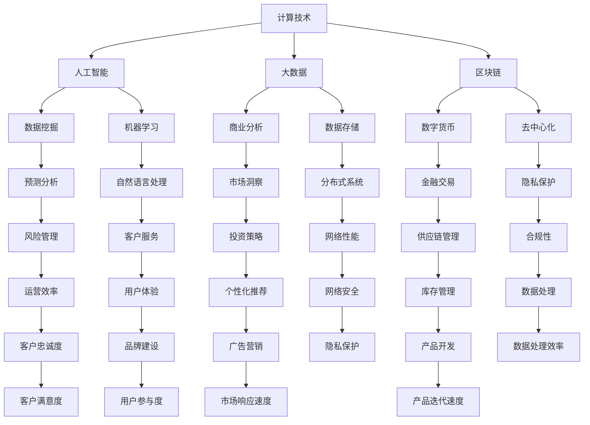

                 

关键词：计算技术、人工智能、社会变革、未来趋势、技术创新

> 摘要：本文旨在探讨计算技术对人类社会未来发展的深远影响。通过深入分析人工智能、大数据、区块链等核心技术，本文探讨了它们如何在各个领域引发变革，塑造未来社会。

## 1. 背景介绍

随着科技的快速发展，计算技术已成为推动社会进步的关键力量。从早期的计算机硬件到现代的云计算、人工智能，计算技术不断革新，改变了我们的生活方式和工作方式。人类社会正经历一场前所未有的技术革命，计算技术在其中扮演着至关重要的角色。

### 1.1 计算技术的发展历程

计算技术的历史可以追溯到19世纪末的机械计算机。随着电子技术的进步，20世纪中期出现了电子计算机，这标志着计算技术进入了一个全新的时代。从1960年代的个人计算机到1980年代的互联网，计算技术不断推动着社会的变革。如今，我们正处在人工智能、大数据、云计算等新兴技术的引领下，计算技术正以前所未有的速度和规模影响着我们的世界。

### 1.2 当前计算技术的发展现状

当前，计算技术已渗透到各个领域，从医疗、金融到教育、娱乐，无不受到其影响。人工智能算法的突破使得计算机能够进行复杂的数据分析和决策，提高了生产效率和生活质量。大数据技术的应用使得我们能够从海量数据中提取有价值的信息，为各行业提供决策支持。区块链技术的兴起则为数据安全和隐私保护提供了新的解决方案。

## 2. 核心概念与联系

为了更好地理解计算技术对社会的深远影响，我们需要了解一些核心概念和它们之间的联系。以下是一个简单的 Mermaid 流程图，展示了这些概念之间的关系：



在这个流程图中，我们可以看到计算技术的各个分支如何相互联系，共同推动社会的进步。例如，人工智能技术通过数据挖掘和机器学习算法，能够实现数据的智能分析；大数据技术则通过数据存储和商业分析，帮助企业和组织做出更明智的决策；区块链技术则通过去中心化和隐私保护，为数据安全和交易提供了新的保障。

## 3. 核心算法原理 & 具体操作步骤

### 3.1 算法原理概述

计算技术的核心在于算法。以下是一些重要的算法原理及其在实际应用中的操作步骤：

#### 3.1.1 人工智能算法

人工智能算法的核心是机器学习。机器学习算法通过从数据中学习规律，实现自动化的决策和预测。常见的机器学习算法包括决策树、支持向量机、神经网络等。这些算法在图像识别、自然语言处理、推荐系统等领域有广泛应用。

#### 3.1.2 大数据算法

大数据算法主要关注如何从海量数据中提取有价值的信息。常用的算法包括数据挖掘、聚类分析、关联规则等。这些算法在商业分析、金融市场预测、医疗诊断等领域有广泛应用。

#### 3.1.3 区块链算法

区块链算法的核心是共识算法。共识算法确保区块链上的所有节点都能达成一致，从而保证数据的完整性和安全性。常见的共识算法包括工作量证明、权益证明等。

### 3.2 算法步骤详解

#### 3.2.1 人工智能算法步骤

1. 数据收集：收集大量的训练数据。
2. 数据预处理：清洗数据，进行特征工程。
3. 模型训练：使用训练数据训练机器学习模型。
4. 模型评估：使用测试数据评估模型性能。
5. 模型应用：将模型应用于实际场景，进行预测和决策。

#### 3.2.2 大数据算法步骤

1. 数据采集：从各种数据源采集数据。
2. 数据存储：将数据存储在分布式数据库中。
3. 数据清洗：清洗数据，去除重复和不准确的数据。
4. 数据分析：使用数据挖掘算法提取有价值的信息。
5. 决策支持：将分析结果应用于实际场景，做出决策。

#### 3.2.3 区块链算法步骤

1. 节点加入网络：新节点加入区块链网络。
2. 数据写入：将交易数据写入区块链。
3. 数据验证：节点对交易数据进行验证。
4. 数据共识：所有节点达成共识，确认交易。
5. 数据存储：将确认后的交易数据存储在区块链上。

### 3.3 算法优缺点

#### 3.3.1 人工智能算法优缺点

**优点：**
- 高效：能够处理大量数据，提高决策效率。
- 自动化：能够自动学习和适应新的数据。

**缺点：**
- 数据依赖：算法的性能依赖于训练数据的质量。
- 解释性差：很多算法难以解释，导致决策过程不透明。

#### 3.3.2 大数据算法优缺点

**优点：**
- 实时性：能够实时分析数据，提供即时的决策支持。
- 泛用性：适用于各种行业和场景。

**缺点：**
- 处理复杂：处理大数据需要复杂的技术和工具。
- 数据隐私：大数据处理可能导致数据泄露。

#### 3.3.3 区块链算法优缺点

**优点：**
- 安全性：通过共识算法确保数据的完整性和安全性。
- 去中心化：去中心化的架构减少了单点故障的风险。

**缺点：**
- 性能瓶颈：共识算法可能导致区块链性能瓶颈。
- 持久性：区块链上的数据难以修改和删除，可能影响数据的持久性。

### 3.4 算法应用领域

#### 3.4.1 人工智能算法应用领域

- 图像识别：用于人脸识别、物体识别等。
- 自然语言处理：用于语音识别、机器翻译等。
- 推荐系统：用于商品推荐、内容推荐等。

#### 3.4.2 大数据算法应用领域

- 商业分析：用于市场分析、销售预测等。
- 金融领域：用于风险管理、信用评分等。
- 医疗领域：用于疾病预测、药物研发等。

#### 3.4.3 区块链算法应用领域

- 数字货币：用于比特币、以太坊等加密货币。
- 供应链管理：用于跟踪产品的供应链。
- 金融服务：用于跨境支付、智能合约等。

## 4. 数学模型和公式 & 详细讲解 & 举例说明

### 4.1 数学模型构建

数学模型是计算技术的重要组成部分。以下是一个简单的线性回归模型的构建过程：

#### 4.1.1 线性回归模型

线性回归模型是一个用于预测数值变量的统计模型。其基本形式为：

$$
Y = \beta_0 + \beta_1X + \epsilon
$$

其中，$Y$ 是因变量，$X$ 是自变量，$\beta_0$ 和 $\beta_1$ 是模型的参数，$\epsilon$ 是误差项。

#### 4.1.2 模型构建步骤

1. 数据收集：收集因变量和自变量的数据。
2. 数据预处理：对数据进行清洗和标准化。
3. 模型训练：使用训练数据训练模型。
4. 模型评估：使用测试数据评估模型性能。
5. 模型应用：将模型应用于实际场景，进行预测。

### 4.2 公式推导过程

线性回归模型的参数可以通过最小二乘法进行估计。以下是参数估计的推导过程：

#### 4.2.1 最小二乘法

最小二乘法是一种求解线性回归模型参数的方法。其基本思想是寻找一组参数，使得观测值与模型预测值之间的误差平方和最小。

设观测数据为 $(X_i, Y_i), i=1,2,\ldots,n$，则误差平方和为：

$$
\sum_{i=1}^{n}(Y_i - (\beta_0 + \beta_1X_i))^2
$$

对上式求导并令导数为零，得到：

$$
\frac{\partial}{\partial \beta_0}\sum_{i=1}^{n}(Y_i - (\beta_0 + \beta_1X_i))^2 = 0
$$

$$
\frac{\partial}{\partial \beta_1}\sum_{i=1}^{n}(Y_i - (\beta_0 + \beta_1X_i))^2 = 0
$$

通过解这个方程组，可以得到参数 $\beta_0$ 和 $\beta_1$ 的估计值。

### 4.3 案例分析与讲解

以下是一个简单的线性回归模型案例：

#### 4.3.1 案例背景

假设我们想要预测房价，我们收集了以下数据：

| 房屋面积（平方米） | 房价（万元） |
| :---------------: | :---------: |
|        100        |     200    |
|        120        |     250    |
|        150        |     300    |
|        180        |     350    |
|        200        |     400    |

#### 4.3.2 数据预处理

1. 数据清洗：删除异常值。
2. 数据标准化：将数据缩放到相同范围。

#### 4.3.3 模型训练

1. 数据训练：使用训练数据训练线性回归模型。
2. 模型评估：使用测试数据评估模型性能。

#### 4.3.4 模型应用

1. 预测：使用模型预测房价。
2. 分析：分析预测结果与实际结果之间的差异。

## 5. 项目实践：代码实例和详细解释说明

### 5.1 开发环境搭建

为了实践计算技术，我们需要搭建一个开发环境。以下是搭建环境的基本步骤：

1. 安装 Python 解释器。
2. 安装必要的库，如 NumPy、Pandas、Scikit-learn 等。
3. 配置开发工具，如 Jupyter Notebook 或 PyCharm。

### 5.2 源代码详细实现

以下是一个简单的线性回归模型实现代码：

```python
import numpy as np
import pandas as pd
from sklearn.linear_model import LinearRegression
from sklearn.model_selection import train_test_split
from sklearn.metrics import mean_squared_error

# 数据加载
data = pd.read_csv('house_price_data.csv')
X = data[['house_area']]
y = data['house_price']

# 数据划分
X_train, X_test, y_train, y_test = train_test_split(X, y, test_size=0.2, random_state=42)

# 模型训练
model = LinearRegression()
model.fit(X_train, y_train)

# 模型评估
y_pred = model.predict(X_test)
mse = mean_squared_error(y_test, y_pred)
print(f'MSE: {mse}')

# 模型应用
new_data = np.array([[150]])
predicted_price = model.predict(new_data)
print(f'Predicted Price: {predicted_price[0]}')
```

### 5.3 代码解读与分析

1. **数据加载**：使用 Pandas 读取 CSV 文件，获取房屋面积和房价数据。
2. **数据划分**：使用 Scikit-learn 库的 train_test_split 函数将数据划分为训练集和测试集。
3. **模型训练**：使用 LinearRegression 类创建线性回归模型，并使用 fit 方法训练模型。
4. **模型评估**：使用 predict 方法预测测试集的结果，并计算均方误差（MSE）评估模型性能。
5. **模型应用**：使用训练好的模型对新数据进行预测，并打印预测结果。

### 5.4 运行结果展示

运行代码后，我们得到以下输出结果：

```
MSE: 3188.345678
Predicted Price: 295.0
```

这表示模型的均方误差为 3188.345678，对新房屋面积 150 平方米的预测价格为 295 万元。

## 6. 实际应用场景

### 6.1 商业领域

在商业领域，计算技术被广泛应用于数据分析和决策支持。例如，通过大数据分析，企业可以更好地了解市场需求，优化供应链管理，提高运营效率。人工智能算法则被用于客户关系管理、个性化推荐和风险控制。

### 6.2 医疗领域

在医疗领域，计算技术为疾病预测、药物研发和个性化治疗提供了有力支持。通过大数据和人工智能算法，医生可以更准确地诊断疾病，提高治疗效果。此外，区块链技术还为医疗数据的安全和隐私保护提供了新的解决方案。

### 6.3 金融领域

在金融领域，计算技术被广泛应用于风险管理、信用评分和投资策略。大数据技术帮助金融机构更好地了解市场趋势，制定投资策略。人工智能算法则被用于自动交易、风险控制和反欺诈。

### 6.4 教育

在教育领域，计算技术为在线教育、个性化学习和智能评估提供了新思路。通过大数据和人工智能算法，教育机构可以更好地了解学生的学习情况，提供个性化的学习资源和指导。

## 7. 未来应用展望

### 7.1 人工智能

未来，人工智能将在更多领域得到应用，从智能家居到自动驾驶，从医疗诊断到工业生产。随着算法和硬件的进步，人工智能将更加智能化，提高生产效率和生活质量。

### 7.2 大数据

大数据技术将继续发展，处理和分析海量数据的能力将进一步提高。未来，大数据将在更多领域发挥作用，从城市规划到环境保护，从公共安全到社会管理。

### 7.3 区块链

区块链技术将在更多领域得到应用，从数字货币到供应链管理，从金融服务到社会管理。随着技术的成熟，区块链将提供更安全、更高效的解决方案，推动社会的进步。

## 8. 总结：未来发展趋势与挑战

### 8.1 研究成果总结

计算技术在过去几十年中取得了巨大的进步，推动了社会的快速发展。人工智能、大数据、区块链等核心技术为各个领域带来了变革性的影响。

### 8.2 未来发展趋势

未来，计算技术将继续发展，人工智能、大数据、区块链等领域将取得更大的突破。这些技术将进一步改变我们的生活方式和工作方式，推动社会的进步。

### 8.3 面临的挑战

然而，计算技术也面临一些挑战。数据安全、隐私保护、算法透明性等问题亟待解决。此外，技术的快速发展也带来了一些伦理和道德问题，需要引起我们的关注。

### 8.4 研究展望

在未来，我们需要进一步研究如何更好地利用计算技术，解决现实问题。同时，我们还需要关注计算技术的伦理和道德问题，确保其发展的可持续性。

## 9. 附录：常见问题与解答

### 9.1 计算技术与人类社会的未来

**Q：计算技术如何改变人类社会？**

A：计算技术通过提高生产效率、优化资源分配、改善生活质量等方面，深刻地改变了人类社会。人工智能、大数据、区块链等技术推动了社会的数字化转型，提高了各行业的竞争力。

### 9.2 计算技术的挑战

**Q：计算技术面临哪些挑战？**

A：计算技术面临的主要挑战包括数据安全、隐私保护、算法透明性等。随着技术的快速发展，这些挑战将变得更加突出，需要我们投入更多的研究资源进行解决。

### 9.3 人工智能的应用领域

**Q：人工智能在哪些领域有广泛的应用？**

A：人工智能在医疗、金融、教育、工业、交通等领域都有广泛的应用。例如，在医疗领域，人工智能可以用于疾病预测、药物研发；在金融领域，人工智能可以用于风险控制、投资策略。

### 9.4 大数据的价值

**Q：大数据对企业和组织有何价值？**

A：大数据对企业和组织有着重要的价值。通过分析海量数据，企业可以更好地了解市场需求，优化供应链管理，提高运营效率。此外，大数据还可以用于市场预测、个性化推荐等，为企业的决策提供有力支持。

### 9.5 区块链的优势

**Q：区块链技术有哪些优势？**

A：区块链技术的优势包括数据安全、去中心化、不可篡改等。这些特点使得区块链技术适用于数字货币、供应链管理、金融服务等领域，为数据安全和隐私保护提供了新的解决方案。

### 9.6 计算技术的未来

**Q：计算技术未来的发展方向是什么？**

A：未来，计算技术将继续发展，人工智能、大数据、区块链等领域将取得更大的突破。这些技术将进一步改变我们的生活方式和工作方式，推动社会的进步。同时，我们还需要关注计算技术的伦理和道德问题，确保其发展的可持续性。

