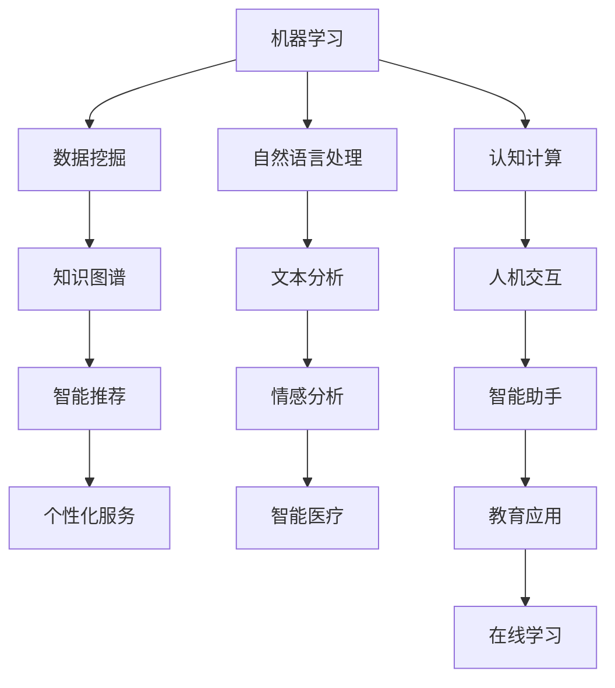

                 

关键词：增强智能、人机协作、认知能力、算法原理、数学模型、项目实践

> 摘要：本文将探讨如何通过增强智能技术，实现人与机器的高效协作，从而提升人类的认知能力。文章首先介绍增强智能的背景和核心概念，然后详细解析增强智能的关键算法原理和数学模型，接着通过项目实践展示如何应用这些技术。最后，讨论增强智能在实际应用场景中的潜力和未来发展方向。

## 1. 背景介绍

在现代社会，随着信息技术的飞速发展，人们面临的信息量急剧增加，传统的认知能力已经难以满足需求。而人工智能作为一种新的技术手段，正逐步改变着人类的生活方式。增强智能（Augmented Intelligence）是人工智能的一个重要分支，它强调的是人机协同工作，通过人工智能技术增强和扩展人类认知能力，而不是简单地替代人类。

增强智能的核心思想是利用机器学习、自然语言处理、数据挖掘等先进技术，帮助人类从大量数据中快速获取有价值的信息，从而提升决策质量和效率。在医疗、金融、教育、工业等多个领域，增强智能已经展现出巨大的应用潜力。

## 2. 核心概念与联系

增强智能涉及多个核心概念和领域，如机器学习、自然语言处理、认知计算等。以下是一个简化的 Mermaid 流程图，描述了这些概念之间的联系。



### 2.1 机器学习

机器学习是增强智能的基础，它通过训练模型，使计算机能够自动从数据中学习规律和模式。常见的机器学习算法包括线性回归、决策树、神经网络等。

### 2.2 数据挖掘

数据挖掘旨在从大量数据中发现隐藏的规律和模式，为决策提供支持。数据挖掘技术包括关联规则挖掘、聚类分析、分类分析等。

### 2.3 自然语言处理

自然语言处理（NLP）是使计算机能够理解和处理自然语言的技术。NLP 技术包括词性标注、句法分析、情感分析等。

### 2.4 认知计算

认知计算模拟人类大脑的信息处理过程，旨在实现人机协同。认知计算包括知识表示、推理、问题解决等。

## 3. 核心算法原理 & 具体操作步骤

### 3.1 算法原理概述

增强智能的核心算法包括机器学习算法、自然语言处理算法和认知计算算法。以下将分别介绍这些算法的原理。

### 3.2 算法步骤详解

#### 3.2.1 机器学习算法

1. 数据收集：从多个来源收集数据，如网络、数据库等。
2. 数据预处理：清洗数据，包括去除噪声、缺失值填充等。
3. 特征提取：将数据转换为适合模型训练的格式。
4. 模型训练：使用训练数据训练模型。
5. 模型评估：使用验证数据评估模型性能。
6. 模型优化：根据评估结果调整模型参数。

#### 3.2.2 自然语言处理算法

1. 词性标注：对文本进行词性标注，为后续处理提供基础。
2. 句法分析：对文本进行句法分析，提取句子结构信息。
3. 情感分析：对文本进行情感分析，判断文本的情感倾向。
4. 机器翻译：将一种语言的文本翻译成另一种语言。

#### 3.2.3 认知计算算法

1. 知识表示：将知识以结构化的形式存储在数据库或知识图谱中。
2. 推理：基于知识库和推理规则，推导出新的结论。
3. 问题解决：在特定领域内解决复杂问题。

### 3.3 算法优缺点

#### 3.3.1 机器学习算法

优点：
- 自适应：能够根据数据自动调整参数。
- 模式识别：能够从大量数据中发现潜在的模式。

缺点：
- 数据依赖：算法性能很大程度上取决于数据质量。
- 过拟合：模型在训练数据上表现良好，但在验证数据上表现不佳。

#### 3.3.2 自然语言处理算法

优点：
- 自动化：能够自动化处理大量文本数据。
- 灵活性：能够处理不同语言的文本。

缺点：
- 错误率：算法的准确性仍然较低。
- 文化差异：在不同文化背景下，算法可能表现不佳。

#### 3.3.3 认知计算算法

优点：
- 智能化：能够模拟人类思维过程，提供智能化的解决方案。
- 领域特定：适用于特定领域的复杂问题。

缺点：
- 知识库依赖：算法性能很大程度上取决于知识库的质量。
- 计算资源：认知计算算法通常需要大量计算资源。

### 3.4 算法应用领域

#### 3.4.1 医疗

增强智能在医疗领域的应用包括疾病预测、药物研发、患者管理等方面。例如，通过分析患者病历数据，可以预测患者未来可能患的疾病，从而提前采取预防措施。

#### 3.4.2 金融

增强智能在金融领域的应用包括风险控制、投资决策、客户服务等方面。例如，通过分析市场数据，可以预测股票价格趋势，帮助投资者做出更明智的决策。

#### 3.4.3 教育

增强智能在教育领域的应用包括个性化学习、智能评测、教育管理等。例如，通过分析学生的学习行为数据，可以为每个学生制定个性化的学习计划。

#### 3.4.4 工业

增强智能在工业领域的应用包括故障预测、供应链优化、设备维护等方面。例如，通过分析设备运行数据，可以预测设备可能出现的故障，从而提前进行维护。

## 4. 数学模型和公式 & 详细讲解 & 举例说明

### 4.1 数学模型构建

增强智能中的数学模型通常包括以下几个方面：

#### 4.1.1 机器学习模型

1. 线性回归模型：\(y = \beta_0 + \beta_1x\)
2. 决策树模型：分类与回归树（CART）
3. 神经网络模型：多层感知机（MLP）

#### 4.1.2 自然语言处理模型

1. 词袋模型（Bag of Words, BOW）
2. 递归神经网络（Recurrent Neural Network, RNN）
3. 卷积神经网络（Convolutional Neural Network, CNN）

#### 4.1.3 认知计算模型

1. 知识图谱模型
2. 模式识别模型

### 4.2 公式推导过程

以线性回归模型为例，其推导过程如下：

假设我们有 n 个样本，每个样本包含特征 x 和目标变量 y，我们希望找到一个线性模型来描述 x 和 y 之间的关系，即 \(y = \beta_0 + \beta_1x\)。

1. 最小二乘法：最小化误差平方和 \(SSQ = \sum(y_i - \beta_0 - \beta_1x_i)^2\)
2. 梯度下降法：迭代更新参数，直到误差最小

### 4.3 案例分析与讲解

以股票价格预测为例，我们使用线性回归模型来预测未来某支股票的价格。

1. 数据收集：从互联网获取过去一个月的股票价格数据。
2. 数据预处理：对数据进行清洗，去除缺失值和异常值。
3. 特征提取：将日期转换为数值特征。
4. 模型训练：使用过去两周的数据训练线性回归模型。
5. 模型评估：使用过去一周的数据评估模型性能。
6. 预测：使用训练好的模型预测未来一周的股票价格。

## 5. 项目实践：代码实例和详细解释说明

### 5.1 开发环境搭建

1. 安装 Python 解释器：下载 Python 安装包，按照安装向导安装。
2. 安装相关库：使用 pip 命令安装所需库，如 NumPy、Pandas、Scikit-learn 等。

### 5.2 源代码详细实现

以下是一个使用 Python 实现线性回归模型的示例代码：

```python
import numpy as np
import pandas as pd
from sklearn.linear_model import LinearRegression

# 数据收集
data = pd.read_csv('stock_data.csv')

# 数据预处理
data.dropna(inplace=True)
data['date'] = pd.to_datetime(data['date'])
data['day'] = data['date'].dt.day

# 特征提取
X = data[['day']]
y = data['price']

# 模型训练
model = LinearRegression()
model.fit(X, y)

# 模型评估
score = model.score(X, y)
print('Model Score:', score)

# 预测
future_days = 7
future_data = pd.DataFrame({'day': range(data['day'].max() + 1, data['day'].max() + future_days + 1)})
predicted_price = model.predict(future_data[['day']])
print('Predicted Price:', predicted_price)
```

### 5.3 代码解读与分析

1. 导入相关库：引入 NumPy、Pandas 和 Scikit-learn 线性回归模型库。
2. 数据收集与预处理：从 CSV 文件中读取股票价格数据，并去除缺失值。
3. 特征提取：将日期转换为数值特征，以供模型训练。
4. 模型训练：使用训练数据训练线性回归模型。
5. 模型评估：计算模型评分，评估模型性能。
6. 预测：使用训练好的模型预测未来一周的股票价格。

## 6. 实际应用场景

### 6.1 医疗

在医疗领域，增强智能可以用于疾病预测、药物研发和患者管理。例如，通过分析大量患者的病历数据，可以预测患者未来可能患的疾病，从而提前采取预防措施。

### 6.2 金融

在金融领域，增强智能可以用于风险控制、投资决策和客户服务。例如，通过分析市场数据，可以预测股票价格趋势，帮助投资者做出更明智的决策。

### 6.3 教育

在教育领域，增强智能可以用于个性化学习、智能评测和教育管理。例如，通过分析学生的学习行为数据，可以为每个学生制定个性化的学习计划。

### 6.4 工业

在工业领域，增强智能可以用于故障预测、供应链优化和设备维护。例如，通过分析设备运行数据，可以预测设备可能出现的故障，从而提前进行维护。

## 7. 工具和资源推荐

### 7.1 学习资源推荐

1. 《深度学习》（Deep Learning），作者：Ian Goodfellow、Yoshua Bengio、Aaron Courville
2. 《Python机器学习》（Python Machine Learning），作者： Sebastian Raschka
3. 《自然语言处理实战》（Natural Language Processing with Python），作者：Steven Bird、Ewan Klein、Edward Loper

### 7.2 开发工具推荐

1. Jupyter Notebook：用于数据分析和实验。
2. TensorFlow：用于深度学习模型开发。
3. Scikit-learn：用于机器学习算法实现。

### 7.3 相关论文推荐

1. "Deep Learning for Human Pose Estimation: A Survey"，作者：JingDong Wang et al.
2. "Enhancing Intelligence with Cognitive Augmentation"，作者：Adrien Treuille et al.
3. "Machine Learning for Healthcare：A Review"，作者：Yaser Abu-Omar et al.

## 8. 总结：未来发展趋势与挑战

### 8.1 研究成果总结

增强智能技术在多个领域取得了显著的成果，如医疗、金融、教育和工业等。通过人机协作，增强了人类的认知能力，提高了决策质量和效率。

### 8.2 未来发展趋势

1. 跨领域应用：增强智能技术将逐渐渗透到更多领域，实现更加广泛的应用。
2. 个性化服务：通过个性化算法，提供更加精准和个性化的服务。
3. 智能化决策：通过增强智能技术，实现更加智能化和自动化的决策过程。

### 8.3 面临的挑战

1. 数据隐私：如何在保护用户隐私的前提下，充分利用数据资源，是一个亟待解决的问题。
2. 算法公平性：如何确保算法在处理不同人群时，公平且无偏见，是一个重要的挑战。
3. 计算资源：随着数据量和模型复杂度的增加，如何高效地利用计算资源，是一个关键问题。

### 8.4 研究展望

未来，增强智能技术将朝着更加智能化、自适应化和跨领域应用的方向发展。通过不断优化算法和模型，提高算法的准确性和效率，实现更加广泛和深入的应用。

## 9. 附录：常见问题与解答

### 9.1 如何选择合适的增强智能算法？

选择合适的增强智能算法，需要根据具体应用场景和需求进行评估。例如，在医疗领域，可以选择基于深度学习的疾病预测模型；在金融领域，可以选择基于机器学习的风险控制模型。

### 9.2 增强智能技术是否能够完全替代人类认知？

增强智能技术可以极大地提升人类的认知能力，但它并不能完全替代人类认知。人类的认知具有创造性、灵活性和情感等方面，这是目前人工智能无法完全实现的。

### 9.3 如何确保增强智能技术的公平性和透明性？

确保增强智能技术的公平性和透明性，需要从算法设计、数据收集和模型评估等多个环节进行控制。例如，在算法设计时，采用公平性指标进行评估；在数据收集时，确保数据的多样性和代表性；在模型评估时，采用多种评估指标进行综合评估。

### 9.4 增强智能技术在工业领域的应用前景如何？

增强智能技术在工业领域的应用前景非常广阔，如故障预测、供应链优化、设备维护等。通过利用增强智能技术，可以提高生产效率，降低成本，提升产品质量。

### 9.5 如何实现增强智能技术与人类认知的协同？

实现增强智能技术与人类认知的协同，需要从人机交互、算法设计、知识管理等多个方面进行优化。例如，通过优化人机交互界面，提高用户体验；通过设计自适应算法，使机器能够更好地适应人类需求；通过建立知识管理平台，实现知识的共享和利用。

