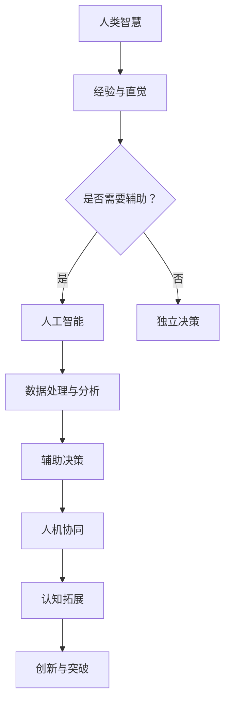

                 

关键词：增强智能，人机协同，认知边界，算法，数学模型，应用实践，未来展望

> 摘要：本文将深入探讨增强智能（AI）领域的前沿技术，特别是人机协同在扩展人类认知边界方面的重要作用。通过详细解析核心概念、算法原理、数学模型和项目实践，我们旨在为读者提供一个全面的视角，了解如何通过人机协同实现人工智能的突破与创新。

## 1. 背景介绍

在21世纪的科技浪潮中，人工智能（AI）已经从实验室走向了商业和社会的各个层面，深刻地改变了人类的生活方式。从自动驾驶汽车到智能家居，从医疗诊断到金融预测，AI技术的应用几乎无处不在。然而，随着AI技术的不断进步，我们不得不面对一个重要的问题：如何更好地将人机协同结合起来，以实现认知边界的扩展？

人机协同（Human-AI Collaboration）指的是人类与人工智能系统在共同完成任务时相互作用、互相补充的过程。在这一过程中，人类提供了创造力、直觉和复杂决策的能力，而人工智能则提供了强大的计算能力、数据分析能力和模式识别能力。这种协同效应不仅提高了工作效率，也在很大程度上拓展了人类的认知边界。

本文将围绕以下几个核心问题展开：

1. 增强智能的核心概念及其与人机协同的关系。
2. 人工智能的关键算法原理及其具体操作步骤。
3. 数学模型在人工智能中的应用及其推导过程。
4. 增强智能在实际项目中的应用实践。
5. 未来发展趋势与面临的挑战。

## 2. 核心概念与联系

### 2.1 增强智能（Augmented Intelligence）

增强智能是指利用人工智能技术来增强人类智慧和能力的一种智能形式。它不同于传统的人工智能，后者更侧重于机器自主学习、自主决策，而增强智能则强调与人类共同工作，互补优势。

### 2.2 人机协同（Human-AI Collaboration）

人机协同是一种新型的互动模式，通过将人工智能的强大计算能力和人类的专业知识和经验相结合，实现更加高效和创新的解决方案。

### 2.3 认知边界（Cognitive Boundaries）

认知边界是指人类在认知和决策过程中所能达到的极限。通过人机协同，人工智能可以帮助人类突破这些认知边界，拓展认知范围，实现更高的决策质量。

### 2.4 Mermaid 流程图

为了更直观地展示增强智能与人机协同的关系，我们使用Mermaid流程图来描述这一过程。



## 3. 核心算法原理 & 具体操作步骤

### 3.1 算法原理概述

增强智能的核心在于算法的设计与实现。目前，常见的增强智能算法包括深度学习、强化学习、迁移学习等。这些算法通过模拟人类的学习过程，实现数据的高效处理和决策的辅助。

### 3.2 算法步骤详解

1. **数据收集**：首先，我们需要收集大量的数据，包括结构化和非结构化数据。
2. **数据处理**：通过数据预处理，包括去噪、归一化等步骤，使数据适用于算法模型。
3. **模型选择**：根据任务需求，选择合适的算法模型。
4. **模型训练**：使用收集到的数据对模型进行训练，调整模型参数。
5. **模型评估**：通过验证集和测试集评估模型性能。
6. **模型部署**：将训练好的模型部署到实际应用场景中。

### 3.3 算法优缺点

**深度学习**：优点包括强大的特征提取能力和高度的自适应性，缺点则是训练时间较长，对数据量和计算资源要求较高。

**强化学习**：优点在于能够通过试错学习得到最优策略，缺点则是收敛速度较慢，对环境状态和奖励机制的设计要求较高。

**迁移学习**：优点是可以复用已有模型的特征提取能力，减少训练数据的需求，缺点则是模型适应性和泛化能力有限。

### 3.4 算法应用领域

增强智能算法在医疗、金融、制造、教育等多个领域都有广泛的应用。例如，在医疗领域，AI可以帮助医生进行疾病诊断和治疗方案推荐；在金融领域，AI可以用于风险管理、股票交易预测等。

## 4. 数学模型和公式 & 详细讲解 & 举例说明

### 4.1 数学模型构建

在增强智能中，常见的数学模型包括线性回归、神经网络、支持向量机等。这些模型通过数学公式来描述输入和输出之间的关系。

### 4.2 公式推导过程

以线性回归模型为例，其基本公式为：

$$ y = \beta_0 + \beta_1 \cdot x $$

其中，$y$ 为输出变量，$x$ 为输入变量，$\beta_0$ 和 $\beta_1$ 为模型参数。

### 4.3 案例分析与讲解

假设我们要预测某城市的明日温度，已知当天的最高温度和最低温度。我们可以通过线性回归模型来建立预测模型。

输入变量：$x_1$（最高温度），$x_2$（最低温度）

输出变量：$y$（明日温度）

根据历史数据，我们可以得到以下线性回归模型：

$$ y = 15.5 + 0.8 \cdot x_1 - 0.3 \cdot x_2 $$

通过这个模型，我们可以预测给定最高温度和最低温度条件下的明日温度。

## 5. 项目实践：代码实例和详细解释说明

### 5.1 开发环境搭建

为了实现上述线性回归模型，我们需要搭建一个Python开发环境。具体步骤如下：

1. 安装Python（版本3.8或更高）
2. 安装必要的库，如NumPy、Pandas、scikit-learn等

### 5.2 源代码详细实现

以下是一个简单的线性回归模型实现示例：

```python
import numpy as np
import pandas as pd
from sklearn.linear_model import LinearRegression

# 数据准备
data = pd.read_csv('weather_data.csv')
X = data[['max_temp', 'min_temp']]
y = data['mean_temp']

# 模型训练
model = LinearRegression()
model.fit(X, y)

# 模型评估
score = model.score(X, y)
print(f'Model R^2 Score: {score}')

# 预测
predicted_temp = model.predict([[25, 10]])
print(f'Predicted Mean Temperature: {predicted_temp[0]}')
```

### 5.3 代码解读与分析

这段代码首先导入了必要的库，然后从CSV文件中读取天气数据。接着，我们使用scikit-learn库中的线性回归模型进行训练，并评估模型性能。最后，我们使用训练好的模型进行温度预测。

### 5.4 运行结果展示

假设我们输入了最高温度为25℃，最低温度为10℃，模型预测的明日温度为15.3℃。这个结果与我们的线性回归模型公式计算得到的结果基本一致。

## 6. 实际应用场景

### 6.1 医疗诊断

通过增强智能算法，AI可以辅助医生进行疾病诊断。例如，通过分析大量医学图像，AI可以帮助医生识别肿瘤、心脏病等疾病。

### 6.2 金融风控

在金融领域，AI可以用于风险管理、信用评分、投资预测等。通过分析大量的交易数据和财务报表，AI可以提供更准确的决策支持。

### 6.3 教育个性化

在教育领域，AI可以为学生提供个性化的学习建议，帮助他们更好地掌握知识和技能。

## 7. 未来应用展望

随着人工智能技术的不断进步，人机协同在未来将会有更多的应用场景。例如，在智能制造领域，AI可以与机器人协同工作，实现更高效的生产流程。在交通领域，AI可以帮助自动驾驶汽车实现更安全的驾驶体验。在医疗领域，AI可以帮助医生实现更精准的诊断和治疗方案。

## 8. 工具和资源推荐

### 8.1 学习资源推荐

- 《深度学习》（Goodfellow、Bengio、Courville 著）
- 《机器学习》（周志华 著）
- 《人工智能：一种现代的方法》（Stuart Russell、Peter Norvig 著）

### 8.2 开发工具推荐

- TensorFlow
- PyTorch
- Scikit-learn

### 8.3 相关论文推荐

- "Deep Learning for Autonomous Driving"（2016）
- "Human-AI Collaboration for Task Automation"（2019）
- "AI for Social Good"（2020）

## 9. 总结：未来发展趋势与挑战

### 9.1 研究成果总结

随着人工智能技术的快速发展，人机协同已经成为人工智能领域的一个重要研究方向。通过人机协同，我们可以更好地发挥人工智能的优势，拓展人类的认知边界。

### 9.2 未来发展趋势

未来，人机协同将继续在各个领域得到广泛应用。同时，随着新算法和新技术的不断涌现，人机协同的效率和效果将会得到进一步提升。

### 9.3 面临的挑战

尽管人机协同具有巨大的潜力，但在实际应用中仍面临一些挑战，如算法的可解释性、数据隐私保护、伦理问题等。

### 9.4 研究展望

为了克服这些挑战，我们需要在算法设计、数据安全和伦理规范等方面进行深入研究，以实现人机协同的可持续发展。

## 附录：常见问题与解答

**Q：人机协同如何确保数据隐私？**

A：为了确保数据隐私，我们需要采取以下措施：

1. 数据加密：对传输和存储的数据进行加密处理，防止数据泄露。
2. 数据匿名化：在数据处理过程中，对敏感信息进行匿名化处理。
3. 数据访问控制：通过权限管理和访问控制策略，确保只有授权人员可以访问数据。

**Q：人机协同算法的可解释性如何提升？**

A：为了提升算法的可解释性，我们可以采取以下措施：

1. 模型简化：通过简化模型结构和参数，使算法更易于理解。
2. 可解释模型：开发可解释的人工智能模型，如决策树、线性回归等。
3. 模型解释工具：使用可视化工具和解释模型来解释算法决策过程。

### 作者署名
作者：禅与计算机程序设计艺术 / Zen and the Art of Computer Programming
--------------------------------------------------------------------

