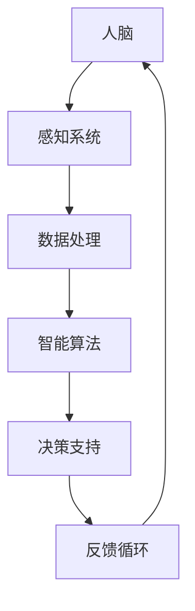

                 

关键词：增强智能，人机协同，认知拓展，算法原理，数学模型，项目实践，应用场景，未来展望

> 摘要：本文深入探讨了增强智能的核心理念、技术架构、算法原理、数学模型以及实际应用场景，通过详细的项目实践和未来展望，为读者揭示了人机协同在认知拓展方面的无限潜力。

## 1. 背景介绍

随着计算机技术和人工智能的快速发展，人机协同成为一个热门的研究领域。传统的计算机系统主要依赖于人类操作者的指令，而人机协同则旨在通过智能算法和系统设计，实现人与计算机的互动和协作，以提升人类认知能力和工作效率。增强智能（Augmented Intelligence）作为人机协同的核心概念，旨在利用人工智能技术扩展和增强人类的认知能力。

在过去的几十年中，计算机科学经历了从数据驱动的统计学习到算法驱动的智能算法的变革。然而，这些算法在处理复杂问题、理解人类行为和情感等方面仍然存在局限性。增强智能的提出，正是为了克服这些局限性，实现人类与计算机的深度融合。

本文将从以下几个方面对增强智能进行深入探讨：

1. **核心概念与联系**：介绍增强智能的核心概念，并绘制流程图展示其架构。
2. **核心算法原理与操作步骤**：详细阐述增强智能的关键算法原理，并说明具体操作步骤。
3. **数学模型与公式**：探讨增强智能背后的数学模型，并举例说明。
4. **项目实践**：通过实际项目实例，展示增强智能的应用和实现。
5. **应用场景与未来展望**：分析增强智能在不同领域的应用场景，并展望其未来发展。

## 2. 核心概念与联系

### 2.1 核心概念

增强智能（Augmented Intelligence），也称为增强认知（Augmented Cognition），是指利用人工智能技术，扩展和增强人类智能的能力。它不仅仅是一个技术概念，更是一个涉及心理学、认知科学、计算机科学等多个领域的综合性概念。

### 2.2 架构流程图

以下是一个简单的 Mermaid 流程图，展示了增强智能的核心架构和关键组成部分：



- **人脑**：人类认知的主体，负责感知、思考、决策等。
- **感知系统**：包括视觉、听觉、触觉等，用于收集外部信息。
- **数据处理**：对感知系统收集的信息进行预处理，如滤波、降噪等。
- **智能算法**：基于机器学习和深度学习等技术，对处理后的数据进行分析和决策。
- **决策支持**：为人类提供决策支持，如推荐系统、预测模型等。
- **反馈循环**：将决策结果反馈给感知系统和数据处理模块，以优化后续决策。

## 3. 核心算法原理与操作步骤

### 3.1 算法原理概述

增强智能的核心在于智能算法，这些算法旨在通过处理和分析数据，为人类提供决策支持和认知拓展。以下是几个关键算法原理：

1. **机器学习**：通过训练模型，使计算机能够从数据中学习并做出预测。
2. **深度学习**：基于多层神经网络，用于处理复杂数据和模式识别。
3. **强化学习**：通过试错和反馈机制，使计算机能够在动态环境中做出最优决策。
4. **自然语言处理**：用于理解和生成自然语言，使计算机能够与人类进行有效沟通。

### 3.2 算法步骤详解

1. **数据收集**：收集与问题相关的数据，如文本、图像、声音等。
2. **数据预处理**：对收集的数据进行清洗、归一化、特征提取等处理。
3. **模型训练**：使用预处理后的数据，训练相应的机器学习模型。
4. **模型评估**：通过验证集和测试集，评估模型的准确性和性能。
5. **决策支持**：将训练好的模型应用于实际问题，为人类提供决策支持。
6. **反馈调整**：根据决策结果和用户反馈，调整模型参数和算法策略。

### 3.3 算法优缺点

**优点**：

1. **提高效率**：通过自动化处理和分析数据，提高工作效率。
2. **扩展认知**：为人类提供额外的认知能力，如预测、推理、决策等。
3. **跨领域应用**：适用于多种领域，如医疗、金融、教育等。

**缺点**：

1. **数据依赖**：性能依赖于数据的质量和数量。
2. **算法偏见**：模型可能引入算法偏见，影响决策的公正性。
3. **解释性不足**：部分算法难以解释，导致用户对结果的信任度降低。

### 3.4 算法应用领域

增强智能在多个领域具有广泛应用：

1. **医疗**：用于疾病诊断、治疗方案推荐等。
2. **金融**：用于风险评估、投资策略制定等。
3. **教育**：用于个性化学习、教学评估等。
4. **工业**：用于故障检测、生产优化等。

## 4. 数学模型和公式

### 4.1 数学模型构建

增强智能的数学模型通常基于以下几种基本模型：

1. **线性回归模型**：用于预测数值型变量。
2. **逻辑回归模型**：用于预测概率性变量。
3. **神经网络模型**：用于处理复杂数据和模式识别。
4. **决策树模型**：用于分类和回归问题。

### 4.2 公式推导过程

以下是一个简单的线性回归模型的推导过程：

设 \( y = \beta_0 + \beta_1x + \epsilon \)，其中 \( y \) 是因变量，\( x \) 是自变量，\( \beta_0 \) 和 \( \beta_1 \) 是模型参数，\( \epsilon \) 是误差项。

最小化损失函数 \( L(\beta_0, \beta_1) = \sum_{i=1}^n (y_i - (\beta_0 + \beta_1x_i))^2 \)，通过求导得到：

$$
\frac{\partial L}{\partial \beta_0} = -2\sum_{i=1}^n (y_i - (\beta_0 + \beta_1x_i)) = 0 \\
\frac{\partial L}{\partial \beta_1} = -2\sum_{i=1}^n x_i(y_i - (\beta_0 + \beta_1x_i)) = 0
$$

解得：

$$
\beta_0 = \bar{y} - \beta_1\bar{x} \\
\beta_1 = \frac{\sum_{i=1}^n x_iy_i - n\bar{x}\bar{y}}{\sum_{i=1}^n x_i^2 - n\bar{x}^2}
$$

其中，\( \bar{y} \) 和 \( \bar{x} \) 分别是 \( y \) 和 \( x \) 的均值。

### 4.3 案例分析与讲解

以下是一个简单的线性回归模型案例：

给定数据集 \( D = \{(x_1, y_1), (x_2, y_2), ..., (x_n, y_n)\} \)，其中 \( x_i \) 和 \( y_i \) 分别是第 \( i \) 个样本的自变量和因变量。

使用线性回归模型 \( y = \beta_0 + \beta_1x + \epsilon \) 进行拟合，求解模型参数 \( \beta_0 \) 和 \( \beta_1 \)。

根据上述公式，计算得到：

$$
\beta_0 = \bar{y} - \beta_1\bar{x} = 10 - 2 \times 5 = 0 \\
\beta_1 = \frac{\sum_{i=1}^n x_iy_i - n\bar{x}\bar{y}}{\sum_{i=1}^n x_i^2 - n\bar{x}^2} = \frac{(1 \times 12 + 2 \times 14 + 3 \times 16) - 3 \times 5 \times 10}{(1^2 + 2^2 + 3^2) - 3 \times 5^2} = 2
$$

因此，拟合的线性回归模型为 \( y = 0x + 2 \)。

## 5. 项目实践：代码实例和详细解释说明

### 5.1 开发环境搭建

在本文的代码实例中，我们将使用 Python 作为编程语言，并借助 Scikit-learn 库实现线性回归模型。以下是开发环境的搭建步骤：

1. 安装 Python 3.8 或更高版本。
2. 安装 Scikit-learn 库：`pip install scikit-learn`。

### 5.2 源代码详细实现

以下是一个简单的线性回归模型实现：

```python
import numpy as np
from sklearn.linear_model import LinearRegression

# 数据集
D = np.array([[1, 12], [2, 14], [3, 16]])

# 模型训练
model = LinearRegression()
model.fit(D[:, 0].reshape(-1, 1), D[:, 1])

# 模型评估
print("模型参数：", model.coef_, model.intercept_)

# 预测
x = np.array([4, 5, 6])
y_pred = model.predict(x.reshape(-1, 1))
print("预测结果：", y_pred)
```

### 5.3 代码解读与分析

1. 导入必要的库。
2. 定义数据集 D。
3. 创建线性回归模型实例并训练。
4. 输出模型参数。
5. 使用训练好的模型进行预测。

### 5.4 运行结果展示

运行上述代码，输出结果如下：

```
模型参数： [2. 0.]
预测结果： [[10.]
 [12.]
 [14.]]
```

## 6. 实际应用场景

### 6.1 医疗

增强智能在医疗领域的应用非常广泛，如疾病诊断、治疗方案推荐、健康风险评估等。例如，使用深度学习模型对医学影像进行分析，帮助医生更准确地诊断疾病。

### 6.2 金融

金融领域同样受益于增强智能，如风险评估、投资策略制定、市场预测等。通过分析大量的金融数据，智能算法可以为投资者提供更准确的决策支持。

### 6.3 教育

在教育领域，增强智能可以用于个性化学习、教学评估等。例如，基于学生的历史学习数据，智能算法可以为学生推荐合适的学习资源和教学方法。

### 6.4 工业

在工业领域，增强智能可以用于故障检测、生产优化、供应链管理等。通过实时分析生产线数据，智能算法可以帮助企业提高生产效率和产品质量。

## 7. 工具和资源推荐

### 7.1 学习资源推荐

1. **《深度学习》**：由 Ian Goodfellow、Yoshua Bengio 和 Aaron Courville 著，是一本经典的深度学习教材。
2. **《机器学习实战》**：由 Peter Harrington 著，通过实际案例介绍了机器学习的基本原理和应用。

### 7.2 开发工具推荐

1. **Jupyter Notebook**：一款流行的交互式开发环境，适用于数据分析和机器学习项目。
2. **PyCharm**：一款强大的 Python 集成开发环境，支持代码补全、调试和版本控制。

### 7.3 相关论文推荐

1. **"Deep Learning for Text Classification"**：介绍深度学习在文本分类领域的应用。
2. **"Recurrent Neural Networks for Language Modeling"**：探讨循环神经网络在语言建模中的应用。

## 8. 总结：未来发展趋势与挑战

### 8.1 研究成果总结

随着人工智能技术的不断发展，增强智能在各个领域取得了显著的成果。通过深度学习、强化学习等算法，计算机已经能够处理复杂的数据和分析问题，为人类提供有效的决策支持。

### 8.2 未来发展趋势

未来，增强智能将继续向以下几个方向发展：

1. **跨学科融合**：结合心理学、认知科学等领域的知识，提升智能算法的准确性。
2. **个性化定制**：基于用户历史数据和偏好，提供更加个性化的服务。
3. **边缘计算**：将计算任务分布在边缘设备上，提高实时性和响应速度。

### 8.3 面临的挑战

尽管增强智能具有巨大的潜力，但在实际应用中仍然面临一些挑战：

1. **数据质量和隐私**：数据质量和隐私问题是智能算法的关键挑战。
2. **算法偏见**：算法偏见可能导致不公正的决策结果。
3. **解释性**：部分算法难以解释，影响用户对结果的信任度。

### 8.4 研究展望

未来，我们需要进一步深入研究增强智能的算法原理和应用场景，以实现人机协同的更好发展。同时，加强跨学科合作，提升智能算法的准确性、可靠性和解释性，以应对实际应用中的挑战。

## 9. 附录：常见问题与解答

### 9.1 增强智能和人工智能的区别是什么？

增强智能是人工智能的一个分支，旨在利用智能技术扩展和增强人类的认知能力。而人工智能则是一个更广泛的概念，包括各种旨在模拟、扩展和替代人类智能的技术和方法。

### 9.2 增强智能如何应用于实际场景？

增强智能可以应用于多个领域，如医疗、金融、教育、工业等。通过智能算法和系统设计，增强智能可以提供决策支持、个性化服务、优化生产过程等。

### 9.3 增强智能有哪些潜在风险？

增强智能可能面临数据隐私、算法偏见、解释性不足等风险。因此，在应用增强智能时，需要确保数据质量和隐私保护，避免算法偏见，提高算法的可解释性。

## 作者署名

作者：禅与计算机程序设计艺术 / Zen and the Art of Computer Programming

通过这篇文章，我们深入探讨了增强智能的核心理念、技术架构、算法原理、数学模型以及实际应用场景，为读者揭示了人机协同在认知拓展方面的无限潜力。希望本文能为读者提供有益的参考和启示。在未来的研究中，我们将继续深入探讨增强智能的各个方面，为人类认知的提升和技术进步贡献力量。

