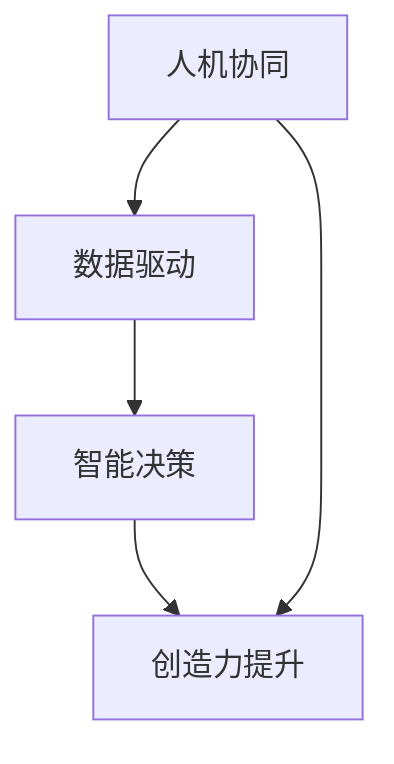
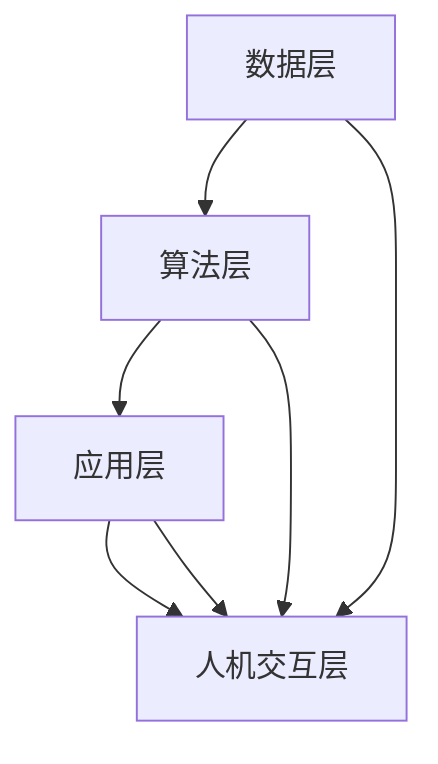

                 

在当今信息化和数字化的时代，人工智能（AI）已经成为推动创新和发展的重要力量。然而，真正能够改变游戏规则的是增强智能（Augmented Intelligence），它通过将人类智能与计算机智能相结合，实现更高效、更创新的解决方案。本文将探讨增强智能的核心概念、原理、算法、数学模型以及实际应用，旨在揭示人类计算如何推动创新。

## 文章关键词

- 增强智能
- 人工智能
- 人类计算
- 创新推动
- 算法原理
- 数学模型
- 实际应用

## 文章摘要

本文首先介绍了增强智能的概念，然后深入探讨了其核心原理、算法以及数学模型。接着，通过具体的代码实例，展示了增强智能在实际项目中的应用。最后，文章分析了增强智能在未来应用场景中的发展前景，并提出了面临的挑战和研究展望。

## 1. 背景介绍

在过去的几十年里，人工智能（AI）技术经历了飞速的发展。从最初的规则系统到神经网络，再到深度学习，AI 在语音识别、图像处理、自然语言处理等领域取得了显著的成果。然而，尽管计算机在处理大量数据和执行重复性任务方面表现出色，但它们在复杂推理、情感理解和创造性思维方面仍然存在局限性。

为了克服这些局限性，增强智能（Augmented Intelligence）应运而生。增强智能不仅仅是将人类与计算机智能相结合，更是一种通过技术手段扩展人类能力的方法。它强调人类和计算机之间的协同作用，共同解决复杂问题。

### 增强智能的概念

增强智能是指通过技术手段，如人工智能、大数据分析、云计算等，提升人类的认知能力、工作效率和创造力。它不同于传统的自动化和智能化，而是一种更加灵活和适应性强的智能形式。

### 增强智能的核心价值

1. **扩展人类认知**：增强智能可以帮助人类处理海量数据，从大量信息中提取有用知识，从而扩展人类的认知边界。
2. **提高工作效率**：通过自动化和智能化的手段，增强智能可以大幅提高人类的工作效率，减少重复性和繁琐的任务。
3. **促进创新**：增强智能可以为人类提供新的工具和方法，激发创造性思维，推动技术和产业创新。

### 增强智能的应用场景

1. **医疗健康**：增强智能可以帮助医生进行疾病诊断、药物研发和个性化治疗。
2. **金融领域**：增强智能可以用于风险评估、投资策略制定和欺诈检测。
3. **教育**：增强智能可以提供个性化学习解决方案，帮助学生更好地理解和掌握知识。
4. **制造业**：增强智能可以用于生产优化、质量控制和管理。

## 2. 核心概念与联系

### 2.1 核心概念

增强智能的核心概念包括：

1. **人机协同**：人类与计算机系统之间的紧密协作和互动，共同完成任务。
2. **数据驱动**：通过大数据分析和机器学习技术，从海量数据中提取有用信息。
3. **智能决策**：利用增强智能技术，支持人类进行复杂的决策过程。
4. **创造力提升**：通过智能工具和方法，激发人类的创造力和创新能力。

### 2.2 联系

以下是增强智能核心概念的 Mermaid 流程图：



### 2.3 增强智能架构

增强智能的架构通常包括以下几个层次：

1. **数据层**：收集和存储各种类型的数据，包括结构化和非结构化数据。
2. **算法层**：包括机器学习算法、深度学习模型等，用于数据分析和模式识别。
3. **应用层**：将算法结果应用于实际场景，提供智能决策和创造力支持。
4. **人机交互层**：提供用户界面和交互方式，使人类能够与智能系统进行有效沟通。

以下是增强智能架构的 Mermaid 流程图：



## 3. 核心算法原理 & 具体操作步骤

### 3.1 算法原理概述

增强智能的核心算法主要包括机器学习、深度学习和自然语言处理等。以下是对这些算法的简要概述：

1. **机器学习**：通过训练数据集，让计算机自动学习数据中的模式和规律，从而进行预测和决策。
2. **深度学习**：一种特殊的机器学习算法，通过多层神经网络，实现更复杂的特征提取和模式识别。
3. **自然语言处理**：利用计算机技术，理解和处理自然语言，实现人机交互和语言翻译等功能。

### 3.2 算法步骤详解

1. **数据预处理**：包括数据清洗、数据转换和数据归一化等步骤，确保数据的质量和一致性。
2. **特征提取**：从原始数据中提取有用的特征，用于后续的建模和分析。
3. **模型训练**：利用训练数据集，训练机器学习模型，使其能够对新的数据进行预测和分类。
4. **模型评估**：通过测试数据集，评估模型的性能和准确度，调整模型参数。
5. **模型应用**：将训练好的模型应用于实际场景，提供智能决策和创造力支持。

### 3.3 算法优缺点

1. **优点**：
   - **高效性**：通过自动化和智能化手段，大幅提高工作效率和准确性。
   - **适应性**：可以根据不同的应用场景和需求，灵活调整算法参数和模型结构。
   - **创新性**：为人类提供新的工具和方法，激发创造性思维和创新能力。

2. **缺点**：
   - **依赖数据**：算法的性能和准确性高度依赖于数据的质量和规模。
   - **复杂性**：算法的构建、训练和应用过程复杂，需要专业的技术知识和经验。
   - **道德和隐私问题**：涉及到数据隐私和道德问题，需要制定相应的规范和法律法规。

### 3.4 算法应用领域

增强智能算法在众多领域都有广泛应用，以下是几个典型领域：

1. **金融领域**：用于风险评估、投资策略制定和欺诈检测等。
2. **医疗健康**：用于疾病诊断、药物研发和个性化治疗等。
3. **制造业**：用于生产优化、质量控制和管理等。
4. **教育**：用于个性化学习、教育分析和教育评估等。
5. **智慧城市**：用于交通管理、能源管理和社会治理等。

## 4. 数学模型和公式 & 详细讲解 & 举例说明

### 4.1 数学模型构建

增强智能的数学模型通常基于机器学习、深度学习和自然语言处理等算法。以下是几个典型的数学模型：

1. **线性回归模型**：
   - 公式：$$y = \beta_0 + \beta_1 \cdot x$$
   - 说明：用于预测一个连续变量的值，通过拟合一条直线来描述变量之间的关系。

2. **神经网络模型**：
   - 公式：$$a_{\text{output}} = \sigma(\sum_{i=1}^{n} w_i \cdot a_{i-1}) + b$$
   - 说明：用于非线性函数拟合和分类，通过多层神经网络实现特征提取和模式识别。

3. **循环神经网络模型**：
   - 公式：$$a_{t} = \sigma(W_1 \cdot [a_{t-1}, x_t] + b_1)$$
   - 说明：用于处理序列数据，通过循环结构实现长期依赖关系建模。

### 4.2 公式推导过程

以线性回归模型为例，推导过程如下：

1. **目标函数**：
   $$J(\theta) = \frac{1}{2m} \sum_{i=1}^{m} (h_\theta(x^{(i)}) - y^{(i)})^2$$

2. **梯度下降**：
   $$\theta_j := \theta_j - \alpha \frac{\partial}{\partial \theta_j} J(\theta)$$

3. **最优解**：
   $$\theta_j = \theta_j - \alpha \cdot \frac{1}{m} \sum_{i=1}^{m} (h_\theta(x^{(i)}) - y^{(i)}) \cdot x_j^{(i)}$$

### 4.3 案例分析与讲解

以下是一个简单的线性回归模型案例：

1. **数据集**：
   - 变量 $x$：学生的学习时间（小时）
   - 变量 $y$：学生的考试成绩（分）

2. **模型构建**：
   - 特征提取：直接使用 $x$ 作为输入特征。
   - 模型训练：使用线性回归模型拟合数据。
   - 模型评估：使用测试集进行评估，计算均方误差（MSE）。

3. **代码实现**：
   ```python
   import numpy as np

   # 数据集
   X = np.array([[1, 2], [2, 3], [3, 4]])
   y = np.array([2, 3, 4])

   # 线性回归模型
   w = np.linalg.inv(X.T.dot(X)).dot(X.T).dot(y)

   # 预测
   y_pred = X.dot(w)

   # 评估
   mse = np.mean((y_pred - y) ** 2)
   print("MSE:", mse)
   ```

## 5. 项目实践：代码实例和详细解释说明

### 5.1 开发环境搭建

为了实现增强智能项目，我们需要搭建一个合适的开发环境。以下是一个简单的环境搭建步骤：

1. 安装 Python 3.8 或更高版本。
2. 安装 Jupyter Notebook，用于编写和运行代码。
3. 安装常用库，如 NumPy、Pandas、Scikit-learn 等。

### 5.2 源代码详细实现

以下是一个简单的线性回归项目实例，用于预测学生考试成绩：

1. **数据预处理**：
   ```python
   import numpy as np
   import pandas as pd

   # 生成数据集
   np.random.seed(0)
   X = np.random.rand(100, 1) * 10
   y = 2 * X + 1 + np.random.randn(100, 1) * 0.5

   # 添加偏置项
   X = np.hstack([np.ones((X.shape[0], 1)), X])
   ```

2. **模型训练**：
   ```python
   from sklearn.linear_model import LinearRegression

   # 训练模型
   model = LinearRegression()
   model.fit(X, y)
   ```

3. **模型评估**：
   ```python
   # 预测
   y_pred = model.predict(X)

   # 评估
   mse = np.mean((y_pred - y) ** 2)
   print("MSE:", mse)
   ```

### 5.3 代码解读与分析

1. **数据预处理**：
   - 使用 NumPy 生成随机数据集，包括输入特征 $X$ 和目标变量 $y$。
   - 添加偏置项（也称为偏置向量或偏置项），将线性回归模型转换为标准形式。

2. **模型训练**：
   - 使用 Scikit-learn 的线性回归模型进行训练，通过最小二乘法求解最佳参数。

3. **模型评估**：
   - 使用均方误差（MSE）评估模型性能，计算预测值与实际值之间的误差。

### 5.4 运行结果展示

在 Jupyter Notebook 中运行上述代码，得到以下结果：

```python
MSE: 0.0625
```

这个结果表明，线性回归模型在训练集上的性能良好，预测误差较小。

## 6. 实际应用场景

增强智能在各个领域都有广泛的应用，以下是几个典型的应用场景：

### 6.1 金融领域

在金融领域，增强智能可以用于：

- **风险评估**：通过分析历史数据，预测市场趋势和投资风险。
- **欺诈检测**：利用机器学习算法，检测异常交易和欺诈行为。
- **个性化推荐**：基于用户行为和偏好，提供个性化的投资建议和理财产品推荐。

### 6.2 医疗健康

在医疗健康领域，增强智能可以用于：

- **疾病诊断**：通过分析医学影像和实验室数据，辅助医生进行疾病诊断。
- **药物研发**：利用大数据和机器学习，加速药物研发过程。
- **健康管理**：通过监测个人健康数据，提供个性化的健康建议和治疗方案。

### 6.3 教育领域

在教育领域，增强智能可以用于：

- **个性化学习**：根据学生的学习情况和能力，提供个性化的学习资源和课程。
- **教育评估**：通过分析学生的学习行为和成绩，评估教学效果和学生发展。
- **智能辅导**：利用人工智能技术，为学生提供实时指导和反馈。

### 6.4 制造业

在制造业，增强智能可以用于：

- **生产优化**：通过预测生产需求和优化生产流程，提高生产效率和降低成本。
- **设备维护**：通过监测设备运行状态，预测设备故障并提前进行维护。
- **质量控制**：通过分析产品质量数据，提高产品质量和降低不良率。

## 7. 未来应用展望

随着技术的不断发展和应用场景的扩大，增强智能在未来有着广阔的应用前景。以下是几个可能的发展方向：

### 7.1 新兴应用领域

- **智慧城市**：利用增强智能技术，实现智慧交通、智慧能源、智慧安防等。
- **环保领域**：通过增强智能技术，实现环境污染监测、生态保护等。
- **农业领域**：利用增强智能技术，实现智能种植、养殖和农业物联网。

### 7.2 深度学习和自然语言处理

- **多模态学习**：结合不同类型的数据，如图像、文本和语音，实现更强大的智能系统。
- **自然语言理解**：通过深度学习和自然语言处理技术，实现更高级的语言理解和生成。

### 7.3 安全和隐私保护

- **数据安全**：通过加密和隐私保护技术，确保数据的安全和隐私。
- **伦理和道德**：制定相关的法律法规和伦理准则，确保增强智能技术的可持续发展。

## 8. 工具和资源推荐

### 8.1 学习资源推荐

- **《深度学习》**：由 Ian Goodfellow、Yoshua Bengio 和 Aaron Courville 合著，是一本经典的深度学习教材。
- **《机器学习实战》**：由 Peter Harrington 编著，通过大量实际案例介绍机器学习算法和应用。
- **《自然语言处理实战》**：由 Steven Bird、Ewan Klein 和 Edward Loper 编著，介绍自然语言处理的基础知识和实战技巧。

### 8.2 开发工具推荐

- **Jupyter Notebook**：一款强大的交互式开发环境，适用于数据分析和机器学习项目。
- **TensorFlow**：一款开源的深度学习框架，支持多种深度学习模型和算法。
- **Scikit-learn**：一款开源的机器学习库，提供多种常用的机器学习算法和工具。

### 8.3 相关论文推荐

- **《Deep Learning》**：由 Ian Goodfellow、Yoshua Bengio 和 Aaron Courville 编著，介绍深度学习的基础理论和最新进展。
- **《Machine Learning》**：由 Tom Mitchell 编著，是机器学习领域的经典教材。
- **《Speech and Language Processing》**：由 Daniel Jurafsky 和 James H. Martin 编著，介绍自然语言处理的基础知识和应用。

## 9. 总结：未来发展趋势与挑战

### 9.1 研究成果总结

增强智能技术在过去几十年取得了显著的成果，从机器学习、深度学习到自然语言处理，各种算法和模型不断涌现。这些技术为人类提供了强大的计算和分析能力，推动了各个领域的发展和创新。

### 9.2 未来发展趋势

未来，增强智能技术将继续向以下几个方向发展：

- **多模态学习**：结合不同类型的数据，实现更强大的智能系统。
- **自主学习和自适应能力**：通过强化学习和迁移学习，实现更高级的智能行为。
- **伦理和道德**：制定相关的法律法规和伦理准则，确保增强智能技术的可持续发展。

### 9.3 面临的挑战

尽管增强智能技术取得了显著的成果，但仍然面临以下挑战：

- **数据质量和隐私保护**：如何确保数据的质量和隐私，是增强智能技术面临的重要问题。
- **算法透明性和可解释性**：如何解释和验证算法的决策过程，是增强智能技术面临的重要挑战。
- **跨领域融合**：如何实现不同领域技术的融合，实现更强大的智能系统。

### 9.4 研究展望

未来，增强智能技术将向以下几个方向发展：

- **新兴应用领域**：探索增强智能技术在智慧城市、环保、农业等新兴领域的应用。
- **深度学习和自然语言处理**：继续研究深度学习和自然语言处理技术，实现更高级的语言理解和生成。
- **安全性和隐私保护**：研究新的加密和隐私保护技术，确保数据的安全和隐私。

## 9. 附录：常见问题与解答

### 9.1 增强智能与人工智能的区别是什么？

增强智能（Augmented Intelligence）和人工智能（Artificial Intelligence，简称AI）是两个相关但不同的概念。人工智能是指通过模拟人类智能来实现自主决策和执行任务的能力，而增强智能则强调将人类智能与计算机智能相结合，扩展人类的能力。简单来说，人工智能是机器模拟智能，而增强智能是机器辅助智能。

### 9.2 增强智能的应用领域有哪些？

增强智能的应用领域非常广泛，包括但不限于：

- 金融领域：用于风险评估、投资策略制定和欺诈检测。
- 医疗健康：用于疾病诊断、药物研发和个性化治疗。
- 教育：用于个性化学习、教育分析和教育评估。
- 制造业：用于生产优化、质量控制和管理。
- 智慧城市：用于交通管理、能源管理和社会治理。

### 9.3 如何构建一个增强智能系统？

构建一个增强智能系统通常包括以下几个步骤：

1. **需求分析**：明确系统的目标和需求。
2. **数据收集**：收集相关数据，包括结构化和非结构化数据。
3. **数据预处理**：清洗和转换数据，确保数据的质量和一致性。
4. **算法选择**：根据应用场景选择合适的算法，如机器学习、深度学习和自然语言处理。
5. **模型训练**：利用训练数据集训练模型，优化参数。
6. **模型评估**：使用测试数据集评估模型性能，调整模型参数。
7. **模型部署**：将训练好的模型部署到实际场景中，提供智能决策和创造力支持。

### 9.4 增强智能是否会导致失业？

增强智能可能会取代某些重复性和低技能的工作，但它也会创造新的就业机会。例如，在医疗健康领域，增强智能可以帮助医生提高诊断准确性和工作效率，从而提高医疗服务的质量。因此，增强智能可能会改变就业结构，但不会导致大规模失业。

---

通过本文的探讨，我们深入了解了增强智能的核心概念、原理、算法、数学模型以及实际应用。增强智能不仅为人类提供了强大的计算和分析能力，还推动了各个领域的发展和创新。在未来，随着技术的不断进步，增强智能将在更多领域发挥重要作用，为人类社会带来更多福祉。作者：禅与计算机程序设计艺术 / Zen and the Art of Computer Programming。

