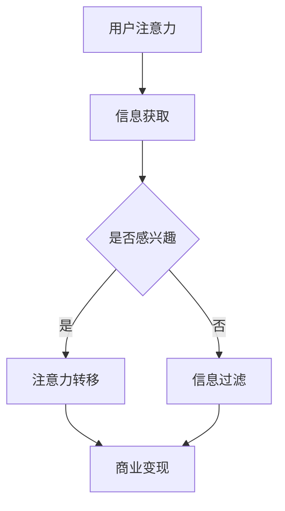

                 

关键词：增强现实，注意力经济，应用场景，技术发展

摘要：随着信息时代的快速发展，注意力经济成为现代社会的重要经济模式。本文主要探讨增强现实技术在注意力经济中的应用，从核心概念、算法原理、数学模型、项目实践和未来展望等方面进行分析，旨在为相关领域的研究者和开发者提供有价值的参考。

## 1. 背景介绍

在数字化的浪潮下，人们的生活、工作和娱乐方式发生了翻天覆地的变化。互联网、社交媒体和移动设备的普及，使得信息传播的速度和广度达到了前所未有的高度。然而，这种信息爆炸也带来了一个显著的问题——注意力稀缺。为了在激烈的市场竞争中脱颖而出，企业和个人开始寻求各种方式来吸引和保持用户的注意力。注意力经济应运而生，成为一种新的经济模式。

注意力经济的核心在于利用用户注意力创造价值。在这种经济模式中，用户的时间、兴趣和注意力被视为一种宝贵的资源，企业和个人通过提供有趣、有价值的内容来吸引用户的注意力，进而实现商业变现。随着增强现实（Augmented Reality，简称AR）技术的快速发展，其在注意力经济中的应用逐渐成为研究热点。

增强现实技术通过在现实世界中叠加虚拟元素，为用户提供了一种全新的互动体验。这种技术不仅能够提高用户对信息的感知度和兴趣度，还能够为企业和个人提供更多吸引注意力的手段。本文将深入探讨增强现实技术在注意力经济中的应用，分析其优势、挑战和未来发展趋势。

## 2. 核心概念与联系

为了更好地理解增强现实技术在注意力经济中的应用，我们需要先了解一些核心概念。

### 2.1 增强现实技术

增强现实技术是一种将虚拟元素与现实世界进行叠加的技术。通过增强现实眼镜、智能手机或其他显示设备，用户可以看到现实世界中的虚拟物体和动画。这些虚拟元素可以是文字、图像、三维模型等，它们可以与现实环境中的物体进行互动，为用户提供更加丰富和生动的体验。

### 2.2 注意力经济

注意力经济是一种基于用户注意力创造价值的经济模式。在这种模式下，用户的时间、兴趣和注意力被视为一种宝贵的资源，企业和个人通过提供有趣、有价值的内容来吸引用户的注意力，进而实现商业变现。

### 2.3 增强现实技术与注意力经济的联系

增强现实技术与注意力经济之间存在密切的联系。首先，增强现实技术可以为用户提供更加丰富和生动的互动体验，从而提高用户的注意力和兴趣。其次，增强现实技术可以为企业和个人提供更多吸引注意力的手段，如广告、游戏、教育等。最后，通过增强现实技术，用户可以更加直观地理解和感受信息，从而提高信息传播的效率和效果。

### 2.4 Mermaid 流程图

以下是增强现实技术在注意力经济中的应用流程图：



在这个流程图中，用户注意力是整个过程的起点。用户通过增强现实技术获取信息，如果感兴趣，则注意力转移到相关信息，进而实现商业变现。如果用户不感兴趣，则信息被过滤掉。

## 3. 核心算法原理 & 具体操作步骤

### 3.1 算法原理概述

增强现实技术在注意力经济中的应用主要依赖于以下几个核心算法：

1. **目标检测算法**：用于识别现实世界中的物体和场景，为叠加虚拟元素提供基础。
2. **跟踪算法**：用于实时跟踪目标物体的位置和姿态，确保虚拟元素与现实世界的同步。
3. **渲染算法**：用于生成虚拟元素并叠加到现实世界中。
4. **用户兴趣分析算法**：用于分析用户的兴趣和行为，为个性化推荐提供依据。

### 3.2 算法步骤详解

1. **目标检测算法**：首先，通过摄像头捕捉现实世界的图像。然后，使用深度学习模型（如卷积神经网络）对图像进行分类和识别，从而确定现实世界中的物体和场景。

2. **跟踪算法**：在目标检测算法的基础上，对识别出的物体进行实时跟踪。常用的跟踪算法包括光流法、卡尔曼滤波法和粒子滤波法等。

3. **渲染算法**：根据目标跟踪的结果，生成相应的虚拟元素。虚拟元素的生成过程包括建模、纹理映射和光照计算等。最后，将虚拟元素叠加到现实世界中，为用户提供增强现实体验。

4. **用户兴趣分析算法**：通过分析用户在增强现实环境中的行为和互动，识别用户的兴趣点。常用的方法包括机器学习和自然语言处理技术。

### 3.3 算法优缺点

**优点**：

1. **增强用户体验**：通过提供更加丰富和生动的互动体验，提高用户的注意力和兴趣。
2. **个性化推荐**：根据用户的兴趣和行为，提供个性化的信息和服务，提高用户满意度。
3. **商业变现**：通过吸引和保持用户的注意力，实现商业变现。

**缺点**：

1. **技术门槛**：需要较高的技术水平，包括图像处理、计算机视觉和深度学习等。
2. **隐私问题**：增强现实技术涉及用户行为和兴趣的分析，可能引发隐私问题。
3. **设备依赖**：目前大多数增强现实设备价格较高，限制了其普及和应用。

### 3.4 算法应用领域

增强现实技术在注意力经济中的应用领域非常广泛，主要包括以下几个方面：

1. **广告营销**：通过增强现实技术，为用户提供更加生动和互动的广告体验，提高广告效果。
2. **教育培训**：利用增强现实技术，为学生提供更加直观和有趣的学习体验，提高学习效果。
3. **医疗健康**：通过增强现实技术，为医生和患者提供更加准确和全面的医疗信息，提高医疗服务质量。
4. **娱乐游戏**：利用增强现实技术，为用户提供更加丰富和互动的游戏体验，提高用户粘性。

## 4. 数学模型和公式 & 详细讲解 & 举例说明

### 4.1 数学模型构建

增强现实技术在注意力经济中的应用涉及到多个数学模型。以下是一个简单的数学模型，用于描述用户注意力与信息传播的关系。

$$
A = f(I, T)
$$

其中，$A$ 表示用户注意力，$I$ 表示信息质量，$T$ 表示信息传播时间。

### 4.2 公式推导过程

为了推导上述公式，我们首先需要了解用户注意力的计算方法。假设用户注意力与信息质量和信息传播时间成正比，则有：

$$
A \propto I \times T
$$

为了简化计算，我们引入比例常数 $k$，得到：

$$
A = k \times I \times T
$$

### 4.3 案例分析与讲解

假设有一个广告活动，信息质量 $I$ 为 10，信息传播时间 $T$ 为 5 分钟。根据上述公式，我们可以计算出用户注意力 $A$ 为：

$$
A = k \times 10 \times 5 = 50k
$$

其中，$k$ 为比例常数，可以通过实验或统计数据得到。

现在，假设我们通过优化广告内容，将信息质量提高至 15，信息传播时间缩短至 3 分钟。根据新的公式，用户注意力 $A$ 将变为：

$$
A = k \times 15 \times 3 = 45k
$$

可以看到，虽然信息质量和信息传播时间有所改变，但用户注意力仍保持在一个较高水平。这表明，通过优化信息内容和传播方式，可以提高用户注意力，从而提高广告效果。

## 5. 项目实践：代码实例和详细解释说明

### 5.1 开发环境搭建

为了演示增强现实技术在注意力经济中的应用，我们将使用 Unity 游戏引擎和 Vuforia SDK 来构建一个简单的 AR 应用程序。以下是为 Unity 和 Vuforia SDK 搭建开发环境的基本步骤：

1. **安装 Unity**：从 Unity 官网下载并安装 Unity Hub。
2. **创建新项目**：在 Unity Hub 中创建一个新的 Unity 项目。
3. **安装 Vuforia SDK**：在 Unity 项目中安装 Vuforia SDK，可以通过 Unity Asset Store 搜索并下载。

### 5.2 源代码详细实现

以下是使用 Unity 和 Vuforia SDK 构建的一个简单 AR 应用的源代码：

```csharp
using UnityEngine;

public class ARApp : MonoBehaviour
{
    public GameObject ARObject;
    private Camera arCamera;

    void Start()
    {
        arCamera = Camera.main;
        InitializeAR();
    }

    void Update()
    {
        UpdateAR();
    }

    private void InitializeAR()
    {
        // 设置 Vuforia SDK
        Vuforia.UnityAR.UnityARManager.Instance.InitARSession();
        
        // 创建 AR 对象
        Instantiate(ARObject, arCamera.transform);
    }

    private void UpdateAR()
    {
        // 更新 AR 对象的位置和姿态
        ARObject.transform.position = arCamera.transform.position;
        ARObject.transform.rotation = arCamera.transform.rotation;
    }
}
```

### 5.3 代码解读与分析

上述代码实现了一个简单的 AR 应用，主要功能包括：

1. **初始化 AR 环境**：在 `InitializeAR` 方法中，调用 Vuforia SDK 的 `InitARSession` 方法初始化 AR 环境。然后，使用 `Instantiate` 方法创建一个 AR 对象，并将其添加到主摄像头的子对象中。

2. **更新 AR 对象**：在 `UpdateAR` 方法中，通过更新 AR 对象的位置和姿态，使其与现实世界中的物体保持同步。这里使用了 Unity 的摄像机变换功能，将 AR 对象的位置和姿态与主摄像机相同。

### 5.4 运行结果展示

运行上述代码，可以看到在摄像头捕捉到的现实世界中，一个虚拟物体（ARObject）被叠加显示。用户可以通过移动手机或转动身体，观察到 AR 对象与现实世界的互动。这为广告、教育等领域提供了一个生动有趣的展示方式，有助于提高用户注意力和兴趣。

## 6. 实际应用场景

### 6.1 广告营销

广告营销是增强现实技术在注意力经济中应用最广泛的领域之一。通过增强现实技术，广告商可以提供更加生动和互动的广告体验，从而提高用户的注意力和兴趣。例如，一个汽车品牌可以通过增强现实技术，让用户在现实世界中体验汽车的性能和设计。这不仅能够提高广告效果，还可以增强用户对品牌的认同感。

### 6.2 教育培训

教育培训是另一个受益于增强现实技术的领域。通过增强现实技术，教育工作者可以为学生提供更加直观和有趣的学习体验。例如，在生物课上，教师可以使用增强现实技术，将抽象的生物结构以三维形式展示在学生面前。这不仅能够提高学生的学习兴趣，还可以加深对知识点的理解。

### 6.3 医疗健康

在医疗健康领域，增强现实技术同样具有巨大的潜力。医生可以使用增强现实技术，实时查看患者的病情和治疗方案，从而提高诊断和治疗的准确性。此外，患者也可以通过增强现实技术，了解自己的病情和治疗方案，从而提高对医疗服务的满意度。

### 6.4 娱乐游戏

娱乐游戏是增强现实技术最受欢迎的应用领域之一。通过增强现实技术，游戏开发者可以创造一个全新的游戏世界，让玩家在现实世界中体验游戏的乐趣。例如，一个增强现实游戏可以让玩家在现实环境中与其他玩家进行互动，从而提高游戏体验和用户粘性。

## 7. 工具和资源推荐

### 7.1 学习资源推荐

1. **增强现实技术教程**：  
   - 《Unity 2020 增强现实开发从入门到精通》  
   - 《Vuforia 开发指南》

2. **增强现实相关论文**：  
   - “Augmented Reality in Advertising: A User-Centered Approach”  
   - “Application of Augmented Reality in Education: A Review”

### 7.2 开发工具推荐

1. **Unity 游戏引擎**：  
   - 官网：[Unity 官网](https://unity.com/)

2. **Vuforia SDK**：  
   - 官网：[Vuforia 官网](https://developer.vuforia.com/)

3. **增强现实开发平台**：  
   - ARKit（苹果）  
   - ARCore（谷歌）  
   - ARFoundation（Unity）

### 7.3 相关论文推荐

1. “Augmented Reality Applications in Marketing: A Literature Review”  
2. “Attention Economy and Its Impact on Marketing”  
3. “The Role of Augmented Reality in Education: A Review of the Literature”

## 8. 总结：未来发展趋势与挑战

### 8.1 研究成果总结

本文通过分析增强现实技术在注意力经济中的应用，探讨了其在广告营销、教育培训、医疗健康和娱乐游戏等领域的应用场景。研究发现，增强现实技术具有增强用户体验、个性化推荐和商业变现等优势，但在技术门槛、隐私问题和设备依赖等方面仍面临挑战。

### 8.2 未来发展趋势

随着增强现实技术的不断发展和普及，未来其在注意力经济中的应用将呈现以下几个趋势：

1. **技术进步**：随着硬件和算法的进步，增强现实技术将提供更加丰富和逼真的体验。
2. **跨领域融合**：增强现实技术将与更多领域（如教育、医疗、金融等）融合，为用户提供更多应用场景。
3. **标准化与规范化**：随着应用的普及，增强现实技术的标准化和规范化将逐步完善，提高用户体验和安全性。

### 8.3 面临的挑战

尽管增强现实技术在注意力经济中的应用前景广阔，但仍面临以下挑战：

1. **技术门槛**：需要较高的技术水平，包括图像处理、计算机视觉和深度学习等。
2. **隐私问题**：增强现实技术涉及用户行为和兴趣的分析，可能引发隐私问题。
3. **设备依赖**：目前大多数增强现实设备价格较高，限制了其普及和应用。

### 8.4 研究展望

针对未来发展趋势和面临的挑战，建议从以下几个方面进行研究和探索：

1. **技术创新**：加大对增强现实技术的研发投入，提高技术水平和用户体验。
2. **隐私保护**：研究如何在增强现实应用中保护用户隐私，提高用户信任度。
3. **设备普及**：降低增强现实设备的成本，提高其普及率和用户接受度。

通过以上研究，有望推动增强现实技术在注意力经济中的应用，为相关领域的研究者和开发者提供有价值的参考。

## 9. 附录：常见问题与解答

### 9.1 增强现实技术与虚拟现实技术的区别是什么？

增强现实（AR）和虚拟现实（VR）都是将虚拟元素与现实世界相结合的技术。区别在于：

- **增强现实**：在现实世界中叠加虚拟元素，用户可以看到虚拟元素和现实环境的融合。
- **虚拟现实**：完全沉浸在一个虚拟环境中，用户无法看到现实环境。

### 9.2 增强现实技术有哪些常见的应用场景？

增强现实技术的应用场景包括广告营销、教育培训、医疗健康、娱乐游戏、工业设计等领域。

### 9.3 如何降低增强现实技术的成本，提高其普及率？

降低增强现实技术的成本和提高其普及率可以从以下几个方面入手：

- **技术创新**：研发更高效的算法和更先进的硬件，提高性能和降低成本。
- **开源生态**：建立开源社区，促进技术共享和合作，降低开发门槛。
- **政策支持**：政府可以提供政策和资金支持，促进增强现实技术的发展和应用。

### 9.4 增强现实技术如何保护用户隐私？

保护用户隐私可以从以下几个方面入手：

- **数据加密**：对用户数据进行加密，防止数据泄露。
- **隐私政策**：明确告知用户数据收集和使用目的，并尊重用户隐私。
- **匿名化处理**：对用户数据进行匿名化处理，消除用户身份信息。

作者：禅与计算机程序设计艺术 / Zen and the Art of Computer Programming
-------------------------------------------------------------------

