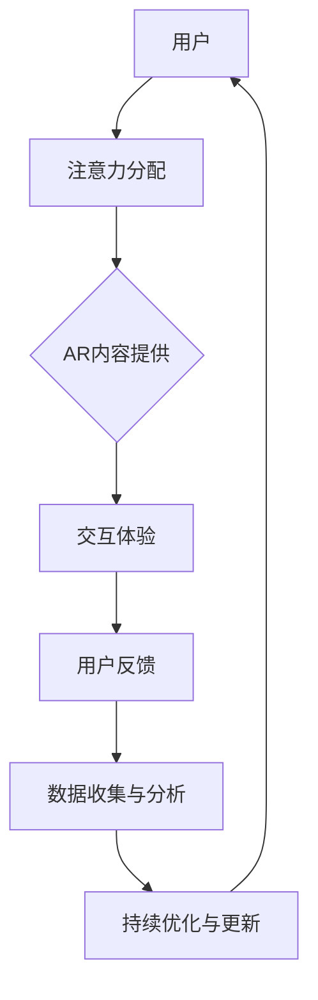

                 

关键词：增强现实（AR）、注意力经济、用户体验、技术架构、算法优化、应用案例、未来展望

> 摘要：随着数字化转型的深入，注意力经济成为现代商业的新焦点。本文深入探讨增强现实技术（AR）在注意力经济中的关键作用，分析了其核心概念与架构，介绍了核心算法原理和具体操作步骤，以及数学模型和公式的应用。同时，通过项目实践和实际应用场景，展示了AR技术在注意力经济中的潜力和挑战，为未来发展趋势和挑战提供了前瞻性思考。

## 1. 背景介绍

### 注意力经济的兴起

注意力经济是近年来在互联网经济中崭露头角的新概念。它以用户注意力为关键资源，通过内容、服务和体验的优化，吸引并保持用户的持续关注。随着社交媒体、在线游戏、视频平台等数字媒介的普及，用户的时间与注意力资源变得愈发稀缺，因此如何有效地获取和保持用户的注意力成为企业竞争的重要策略。

### 增强现实技术（AR）的发展

增强现实技术（AR）作为一种跨学科的技术，将虚拟信息叠加到真实环境中，提供了一种全新的交互方式。从最早的AR游戏《Pokémon Go》到如今的各类商业应用，AR技术在用户体验和商业价值方面展现出巨大的潜力。其发展离不开计算机视觉、图形处理、传感器融合、机器学习等技术的支撑。

## 2. 核心概念与联系

### 核心概念

- **增强现实（AR）**：通过增强现实技术，将虚拟信息叠加到真实环境中，使用户能够在现实中与虚拟内容互动。
- **注意力经济**：通过吸引和保持用户的注意力，创造商业价值和用户价值。
- **用户体验（UX）**：在注意力经济中，用户体验是获取和保持用户注意力的关键。

### 联系与架构

下面是增强现实技术在注意力经济中的应用架构的Mermaid流程图：



在上述流程中，用户首先分配注意力，AR内容提供者通过增强现实技术吸引用户的注意力，提供互动体验，用户反馈数据用于进一步的数据分析和优化。

## 3. 核心算法原理 & 具体操作步骤

### 3.1 算法原理概述

增强现实技术中的核心算法主要包括：

- **计算机视觉算法**：用于识别和跟踪现实环境中的物体和特征。
- **图形处理算法**：用于生成虚拟信息并将其叠加到现实环境中。
- **传感器融合算法**：用于整合多种传感器数据，提供更准确的实时信息。

### 3.2 算法步骤详解

1. **环境感知**：通过摄像头和其他传感器收集现实环境的数据。
2. **特征识别**：使用计算机视觉算法识别和跟踪现实环境中的物体和特征。
3. **虚拟信息生成**：根据用户需求和场景，生成相应的虚拟信息。
4. **信息叠加**：使用图形处理算法将虚拟信息叠加到现实环境中。
5. **实时交互**：用户与虚拟信息进行实时互动。

### 3.3 算法优缺点

- **优点**：
  - 提供丰富的交互体验，增强用户参与感。
  - 可以在多种场景下应用，如游戏、教育、医疗、零售等。
  - 潜在的商业价值巨大。

- **缺点**：
  - 技术实现复杂，成本较高。
  - 对硬件设备要求较高，用户体验可能受限。

### 3.4 算法应用领域

增强现实技术已在多个领域得到广泛应用，如：

- **游戏与娱乐**：提供沉浸式的游戏体验。
- **教育与培训**：增强学习互动性。
- **医疗与健康**：辅助诊断和治疗。
- **零售与营销**：提升消费者购物体验。

## 4. 数学模型和公式 & 详细讲解 & 举例说明

### 4.1 数学模型构建

在增强现实技术中，常用的数学模型包括：

- **3D几何模型**：用于描述虚拟物体的几何形状和位置。
- **投影模型**：用于将虚拟物体投影到现实环境中。
- **视觉感知模型**：用于模拟人类视觉系统对现实环境的感知。

### 4.2 公式推导过程

以3D几何模型为例，其关键公式推导如下：

- **点乘公式**：
  $$ \vec{a} \cdot \vec{b} = a_x b_x + a_y b_y + a_z b_z $$
- **向量加法公式**：
  $$ \vec{a} + \vec{b} = (a_x + b_x, a_y + b_y, a_z + b_z) $$

这些公式用于计算虚拟物体与现实环境之间的交互关系。

### 4.3 案例分析与讲解

假设我们有一个立方体，边长为2，其质心位于原点。我们需要将其投影到二维平面上。

1. **确定立方体顶点**：
   $$ V_1 = (1, 1, 1), V_2 = (1, 1, -1), V_3 = (1, -1, 1), V_4 = (1, -1, -1), V_5 = (-1, 1, 1), V_6 = (-1, 1, -1), V_7 = (-1, -1, 1), V_8 = (-1, -1, -1) $$

2. **选择投影平面**：
   我们选择z=0作为投影平面。

3. **计算投影坐标**：
   $$ \text{投影坐标} = (x, y, 0) $$

   例如，顶点$V_1$的投影坐标为$(1, 1, 0)$。

通过上述步骤，我们成功地将立方体投影到二维平面上，为后续交互提供了基础。

## 5. 项目实践：代码实例和详细解释说明

### 5.1 开发环境搭建

为了演示增强现实技术在注意力经济中的应用，我们将使用Unity游戏引擎和ARKit框架进行开发。以下是开发环境搭建的步骤：

1. **安装Unity Hub**：
   访问Unity官网下载并安装Unity Hub。

2. **创建Unity项目**：
   打开Unity Hub，创建一个新的2D或3D项目。

3. **安装ARKit插件**：
   在Unity项目中，通过包管理器安装ARKit插件。

### 5.2 源代码详细实现

以下是关键代码实现的部分：

```csharp
using UnityEngine;

public class ARObjectPlacement : MonoBehaviour
{
    public Camera arCamera;
    public GameObject arObject;

    void Start()
    {
        // 初始化ARKit
        ARKitManager.Instance.Initialize(arCamera);

        // 创建虚拟物体
        GameObject obj = Instantiate(arObject, arCamera.transform);
        obj.name = "ARObject";
    }

    void Update()
    {
        // 跟踪现实环境中的物体
        ARKitManager.Instance.TrackObjects();
        
        // 更新虚拟物体的位置和朝向
        GameObject obj = GameObject.Find("ARObject");
        if (obj != null)
        {
            obj.transform.position = ARKitManager.Instance.GetObjectPosition("RealObject");
            obj.transform.rotation = ARKitManager.Instance.GetObjectRotation("RealObject");
        }
    }
}
```

### 5.3 代码解读与分析

上述代码主要实现了以下功能：

- **初始化ARKit**：使用ARKitManager的Initialize方法初始化AR功能。
- **创建虚拟物体**：在场景中创建一个虚拟物体。
- **实时跟踪**：使用ARKitManager的TrackObjects方法实时跟踪现实环境中的物体。
- **更新虚拟物体**：根据跟踪结果更新虚拟物体的位置和朝向。

### 5.4 运行结果展示

当运行Unity项目时，我们可以看到虚拟物体与现实环境中的物体同步更新，实现了增强现实的效果。

## 6. 实际应用场景

### 6.1 游戏与娱乐

在游戏与娱乐领域，增强现实技术提供了丰富的交互体验。例如，《Pokémon Go》通过AR技术让玩家在现实世界中捕捉虚拟的宠物小精灵，极大地提升了游戏的趣味性和参与度。

### 6.2 教育与培训

在教育与培训领域，增强现实技术可以提供沉浸式的学习体验。例如，学生可以通过AR设备了解历史事件或科学实验，从而加深对知识的理解和记忆。

### 6.3 医疗与健康

在医疗与健康领域，增强现实技术被用于辅助诊断和治疗。医生可以通过AR设备查看患者的三维图像，进行更精确的手术规划。

### 6.4 零售与营销

在零售与营销领域，增强现实技术可以提升消费者的购物体验。例如，消费者可以通过AR试穿衣物，从而更轻松地做出购买决策。

## 7. 工具和资源推荐

### 7.1 学习资源推荐

- **《增强现实：理论与实践》**：详细介绍了增强现实技术的基本原理和应用。
- **Unity官方文档**：提供关于Unity游戏引擎和ARKit插件的详细教程和示例代码。

### 7.2 开发工具推荐

- **Unity游戏引擎**：用于开发增强现实应用。
- **ARKit框架**：用于在iOS设备上实现增强现实功能。

### 7.3 相关论文推荐

- **"Augmented Reality in the Age of Attention Economics"**：分析了增强现实技术在注意力经济中的应用。
- **"Designing for Attention in Digital Media"**：探讨了如何在数字媒介中吸引和保持用户的注意力。

## 8. 总结：未来发展趋势与挑战

### 8.1 研究成果总结

增强现实技术在注意力经济中的应用取得了显著成果，不仅提升了用户体验，还创造了巨大的商业价值。通过技术优化和场景应用，AR技术逐渐成为现代商业的新引擎。

### 8.2 未来发展趋势

未来，增强现实技术将在更多领域得到应用，如智能家居、智慧城市、远程工作等。同时，随着5G和人工智能技术的不断发展，AR体验将更加实时、智能和沉浸。

### 8.3 面临的挑战

尽管前景广阔，增强现实技术仍面临诸多挑战，包括技术实现的复杂性、硬件设备的普及程度、用户体验的优化等。

### 8.4 研究展望

未来，研究人员应重点关注以下几个方面：

- **算法优化**：提高实时性和准确性。
- **跨平台兼容**：实现不同平台间的无缝切换。
- **隐私保护**：确保用户数据的安全。

通过持续的研究和探索，增强现实技术将在注意力经济中发挥更加重要的作用。

## 9. 附录：常见问题与解答

### 9.1 增强现实技术的核心组成部分是什么？

增强现实技术的核心组成部分包括计算机视觉、图形处理、传感器融合和机器学习。

### 9.2 增强现实技术有哪些实际应用场景？

增强现实技术的实际应用场景包括游戏与娱乐、教育与培训、医疗与健康、零售与营销等。

### 9.3 如何优化增强现实技术的用户体验？

优化增强现实技术的用户体验可以从以下几个方面入手：

- 提高实时性和准确性。
- 优化虚拟信息与真实环境的融合度。
- 关注不同用户群体的需求。
- 加强硬件设备的性能。

以上，是关于增强现实技术在注意力经济中的应用的详细探讨。希望本文能为读者提供有益的启示和思考。作者：禅与计算机程序设计艺术 / Zen and the Art of Computer Programming。----------------------------------------------------------------

# 后记

本文以《增强现实技术在注意力经济中的应用》为主题，从背景介绍、核心概念、算法原理、数学模型、项目实践、应用场景等多个角度，全面探讨了AR技术在现代商业中的关键作用。随着数字化转型的深入，注意力经济成为企业竞争的新焦点，而增强现实技术以其独特的交互方式和沉浸体验，为用户提供了全新的体验方式，同时也为企业创造了巨大的商业价值。

未来，随着5G和人工智能技术的不断发展，增强现实技术将在更多领域得到应用，如智慧城市、远程工作、智能家居等。同时，随着技术的不断成熟，用户体验和安全性也将得到进一步提升。

然而，增强现实技术仍面临诸多挑战，包括技术实现的复杂性、硬件设备的普及程度、用户体验的优化等。因此，未来研究和开发应重点关注算法优化、跨平台兼容、隐私保护等方面，以推动增强现实技术的广泛应用。

本文旨在为读者提供对增强现实技术在注意力经济中的应用的全面了解，并展望其未来的发展趋势和挑战。希望本文能对读者有所启发，共同探索增强现实技术的无限可能。作者：禅与计算机程序设计艺术 / Zen and the Art of Computer Programming。

