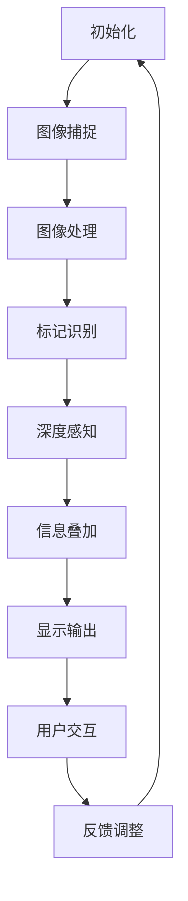

                 

关键词：增强现实，AR应用，开发流程，技术架构，算法实现，数学模型，案例研究，未来展望

## 摘要

本文深入探讨了增强现实（AR）应用开发的各个方面，从基本概念到实际实现。我们将首先介绍AR技术的背景和发展历史，然后详细阐述AR技术的核心概念和架构。接着，本文将重点介绍AR应用开发中的核心算法原理、数学模型以及代码实现，并通过一个实际项目案例进行分析和解释。最后，我们将讨论AR技术的实际应用场景、未来发展趋势以及面临的挑战。

## 1. 背景介绍

### 增强现实（AR）的概念与历史

增强现实（Augmented Reality，简称AR）是一种将虚拟信息与现实世界融合的技术。与虚拟现实（VR）不同，AR并非完全取代现实，而是在现实环境中叠加计算机生成的信息。这种技术最早可以追溯到20世纪50年代，当时AR的概念首次被提出。然而，由于硬件和软件技术的限制，AR在很长一段时间内都处于实验室阶段。

随着计算机技术的进步和移动设备的普及，AR技术逐渐走向商业化。2012年，谷歌眼镜（Google Glass）的发布标志着AR技术进入了一个新的时代。自此之后，AR应用在各个领域得到了广泛的应用，包括医疗、教育、零售、娱乐等。

### AR技术的基本原理

AR技术的基本原理是通过计算机生成的图像或视频，将虚拟信息叠加到现实世界的视野中。这通常需要以下步骤：

1. **图像捕捉**：使用摄像头或传感器捕捉现实世界的图像或视频。
2. **图像处理**：对捕捉到的图像进行处理，包括图像增强、噪声抑制、目标识别等。
3. **信息叠加**：根据处理结果，将虚拟信息叠加到现实世界的图像上。
4. **显示输出**：将叠加后的图像或视频显示在屏幕或投影设备上。

## 2. 核心概念与联系

### 核心概念

在AR应用开发中，有几个核心概念是非常重要的：

- **标记识别**：使用图像识别技术，如二维码或特定标志，以定位和跟踪现实世界中的对象。
- **深度感知**：利用计算机视觉技术，如立体视觉或多视角几何，来感知和估计三维空间中的深度信息。
- **交互设计**：设计直观的用户交互界面，使用户能够与叠加的虚拟信息进行自然互动。

### Mermaid 流程图

以下是一个简单的AR应用开发流程的Mermaid流程图：



### AR技术的架构

AR技术的架构可以分为三个主要部分：硬件、软件和数据处理。

- **硬件**：主要包括摄像头、显示屏、传感器等。摄像头用于捕捉现实世界的图像，显示屏用于显示叠加的虚拟信息，传感器用于提供位置和方向等信息。
- **软件**：包括图像处理库、计算机视觉库和AR引擎。图像处理库用于图像捕捉和预处理，计算机视觉库用于图像识别和深度感知，AR引擎用于信息叠加和用户交互。
- **数据处理**：涉及数据存储、传输和处理。数据处理需要高效地管理大量的图像和视频数据，并确保在实时应用中提供良好的性能。

## 3. 核心算法原理 & 具体操作步骤

### 3.1 算法原理概述

AR应用开发中的核心算法主要包括图像识别、深度感知和交互设计。

- **图像识别**：使用机器学习算法，如卷积神经网络（CNN），对捕获的图像进行分类和识别。这种算法可以识别出现实世界中的特定对象或标记。
- **深度感知**：利用立体视觉或多视角几何算法，估计三维空间中的深度信息。这种算法可以感知现实世界中的物体位置和距离。
- **交互设计**：通过自然语言处理（NLP）和手势识别技术，设计直观的用户交互界面。这种算法可以理解用户的意图，并响应用户的互动。

### 3.2 算法步骤详解

1. **图像识别**：
    - **数据预处理**：对捕获的图像进行缩放、裁剪和归一化，以适应神经网络模型的输入。
    - **模型训练**：使用大量标注好的图像数据，训练卷积神经网络模型，使其能够识别出特定的对象或标记。
    - **模型部署**：将训练好的模型部署到AR应用中，对捕获的图像进行实时识别。

2. **深度感知**：
    - **立体匹配**：使用立体视觉算法，计算不同视角下图像的对应关系，从而估计深度信息。
    - **多视角几何**：利用多视角几何算法，根据多个摄像头的位置和角度，重建三维场景。
    - **深度融合**：将估计的深度信息与图像进行融合，生成真实感更强的三维图像。

3. **交互设计**：
    - **自然语言处理**：使用NLP算法，理解用户的自然语言输入。
    - **手势识别**：使用机器学习算法，识别用户的手势动作。
    - **用户反馈**：根据用户的输入和动作，实时调整虚拟信息的显示和交互方式。

### 3.3 算法优缺点

- **图像识别**：
    - 优点：高准确性，能够快速识别特定对象或标记。
    - 缺点：对图像质量和环境光照敏感，且在复杂场景中可能存在误识别。

- **深度感知**：
    - 优点：能够提供真实感强的三维信息，适用于虚拟现实和增强现实应用。
    - 缺点：计算复杂度较高，对硬件性能要求较高。

- **交互设计**：
    - 优点：提供直观的用户交互方式，增强用户体验。
    - 缺点：对用户操作习惯和理解能力有一定要求。

### 3.4 算法应用领域

- **医疗**：用于医疗影像处理和手术指导，提高医生的工作效率和准确性。
- **教育**：用于虚拟课堂和实验演示，提供沉浸式的学习体验。
- **零售**：用于产品展示和虚拟试衣，提高消费者的购物体验。
- **娱乐**：用于虚拟现实游戏和主题公园，提供互动式的娱乐体验。

## 4. 数学模型和公式 & 详细讲解 & 举例说明

### 4.1 数学模型构建

在AR应用开发中，常用的数学模型包括卷积神经网络（CNN）模型、立体匹配模型和多视角几何模型。

- **卷积神经网络（CNN）模型**：

    $$ 
    \text{CNN} = \left[ \sum_{i=1}^{n} w_i * x_i + b \right] \text{激活函数}
    $$

    其中，$w_i$为卷积核权重，$x_i$为输入特征，$b$为偏置项，激活函数一般为ReLU函数。

- **立体匹配模型**：

    $$ 
    \text{Disparity Map} = \arg \min_{d} \sum_{i,j} \left( I_{left}(i, j) - I_{right}(i, j - d(i, j)) \right)^2 
    $$

    其中，$I_{left}$和$I_{right}$分别为左右图像，$d(i, j)$为对应像素点的视差值。

- **多视角几何模型**：

    $$ 
    \text{Position} = \arg \min_{x, y, z} \sum_{i=1}^{n} \left( x - x_i \right)^2 + \left( y - y_i \right)^2 + \left( z - z_i \right)^2 
    $$

    其中，$x, y, z$为三维空间中的坐标，$x_i, y_i, z_i$为不同视角下观察到的坐标。

### 4.2 公式推导过程

- **卷积神经网络（CNN）模型**推导：

    卷积神经网络的基本原理是通过卷积操作提取图像特征，然后通过全连接层进行分类。卷积操作可以表示为：

    $$ 
    \text{Feature Map} = \text{Conv}\left( \text{Input}, \text{Filter} \right) + \text{Bias} 
    $$

    其中，$\text{Input}$为输入图像，$\text{Filter}$为卷积核，$\text{Bias}$为偏置项。通过多次卷积和池化操作，可以逐步提取图像的高级特征。

    激活函数ReLU的作用是引入非线性，使神经网络能够学习更复杂的函数。

- **立体匹配模型**推导：

    立体匹配是计算左右图像中对应像素点的视差值。最小化误差函数可以表示为：

    $$ 
    \text{Error} = \sum_{i,j} \left( I_{left}(i, j) - I_{right}(i, j - d(i, j)) \right)^2 
    $$

    为了求解视差值$d(i, j)$，可以使用优化算法，如梯度下降法或随机抽样一致性算法。

- **多视角几何模型**推导：

    多视角几何是通过多个视角下的观测数据估计三维空间中的物体位置。可以使用最小二乘法求解：

    $$ 
    \text{Position} = \arg \min_{x, y, z} \sum_{i=1}^{n} \left( x - x_i \right)^2 + \left( y - y_i \right)^2 + \left( z - z_i \right)^2 
    $$

    其中，$x_i, y_i, z_i$为不同视角下观察到的坐标。

### 4.3 案例分析与讲解

我们以一个简单的AR应用为例，说明如何使用上述数学模型进行开发。

#### 案例描述

假设我们开发一个AR应用，用于在现实世界中显示一个虚拟的3D模型。用户可以通过移动设备上的摄像头捕捉现实世界的图像，并使用AR技术将3D模型叠加到图像上。

#### 数据准备

- **输入数据**：从摄像头捕获的实时图像。
- **训练数据**：用于训练图像识别模型的标注图像。

#### 算法实现

1. **图像识别**：
    - 对捕获的图像进行预处理，如灰度化、缩放和归一化。
    - 使用卷积神经网络模型对预处理后的图像进行识别，提取特征。
    - 将识别结果与训练数据中的标注进行比较，确定现实世界中的对象或标记。

2. **深度感知**：
    - 利用立体匹配模型，计算左右图像的视差值。
    - 使用多视角几何模型，根据视差值和多个视角下的观测数据，估计三维空间中的物体位置。

3. **信息叠加**：
    - 根据物体位置和3D模型，计算模型在摄像头视野中的投影。
    - 将3D模型投影到图像上，生成叠加后的AR图像。

4. **显示输出**：
    - 将叠加后的AR图像显示在移动设备的屏幕上。

#### 结果分析

通过上述算法实现，我们可以在移动设备上实时显示虚拟的3D模型。用户可以通过移动设备或手势与虚拟模型进行互动，如旋转、缩放和拖动。

## 5. 项目实践：代码实例和详细解释说明

### 5.1 开发环境搭建

在开始编写代码之前，我们需要搭建一个适合AR应用开发的开发环境。以下是搭建AR开发环境的步骤：

1. **安装Android Studio**：下载并安装Android Studio，这是一个功能强大的集成开发环境（IDE），支持Android应用的开发。

2. **安装ARCore SDK**：ARCore是谷歌开发的AR开发框架，它提供了许多有用的API和工具，可以帮助我们快速开发AR应用。在Android Studio中，通过以下命令安装ARCore SDK：

   ```bash
   sdkmanager 'android-sdk-platform-tools'
   sdkmanager 'android-sdk-platform-android-28'
   sdkmanager 'platforms;android-28'
   ```

3. **配置项目**：在Android Studio中创建一个新的Android项目，选择ARCore SDK作为项目依赖。

### 5.2 源代码详细实现

以下是AR应用的核心源代码实现：

```java
// MainActivity.java

import android.graphics.SurfaceTexture;
import android.hardware.Camera;
import android.os.Bundle;
import android.support.v7.app.AppCompatActivity;
import android.view.SurfaceHolder;
import android.view.SurfaceView;

public class MainActivity extends AppCompatActivity {

    private Camera camera;
    private SurfaceView surfaceView;
    private SurfaceTexture surfaceTexture;

    @Override
    protected void onCreate(Bundle savedInstanceState) {
        super.onCreate(savedInstanceState);
        setContentView(R.layout.activity_main);

        surfaceView = findViewById(R.id.surface_view);
        surfaceView.getHolder().addCallback(new SurfaceHolder.Callback() {
            @Override
            public void surfaceCreated(SurfaceHolder holder) {
                startCamera();
            }

            @Override
            public void surfaceChanged(SurfaceHolder holder, int format, int width, int height) {

            }

            @Override
            public void surfaceDestroyed(SurfaceHolder holder) {
                stopCamera();
            }
        });
    }

    private void startCamera() {
        camera = Camera.open();
        SurfaceTexture texture = (SurfaceTexture) surfaceView.getHolder().getSurface();
        try {
            camera.setPreviewTexture(texture);
            camera.startPreview();
        } catch (IOException e) {
            e.printStackTrace();
        }
    }

    private void stopCamera() {
        if (camera != null) {
            camera.stopPreview();
            camera.release();
            camera = null;
        }
    }
}
```

这段代码实现了AR应用的核心功能，包括摄像头预览和图像捕捉。我们使用SurfaceView来显示摄像头预览，并通过SurfaceHolder.Callback来处理摄像头预览的创建、改变和销毁。

### 5.3 代码解读与分析

1. **SurfaceView**：SurfaceView是一个用于显示图像的视图控件。在这里，我们使用SurfaceView来显示摄像头预览。
2. **SurfaceHolder**：SurfaceHolder是SurfaceView的一个内部类，用于管理Surface。在这里，我们通过SurfaceHolder.Callback来监听Surface的创建、改变和销毁事件。
3. **Camera**：Camera是一个用于访问摄像头硬件的API。我们使用Camera.open()来打开摄像头，并使用setPreviewTexture()来设置摄像头预览的Surface。
4. **预览和捕捉**：当Surface创建后，我们调用startCamera()来启动摄像头预览。当Surface销毁时，我们调用stopCamera()来释放摄像头资源。

### 5.4 运行结果展示

运行上述代码后，我们可以在移动设备的屏幕上看到摄像头预览。用户可以通过移动设备来观察现实世界中的场景，并使用AR技术将虚拟信息叠加到场景中。

## 6. 实际应用场景

### 6.1 医疗

在医疗领域，AR技术被广泛应用于手术指导、医学教育和患者护理。例如，医生可以使用AR技术查看患者体内器官的三维图像，以便更准确地执行手术。此外，AR技术还可以用于医学教育，通过虚拟现实（VR）和增强现实（AR）技术提供更直观的教学体验。

### 6.2 教育

在教育领域，AR技术可以为学生提供沉浸式的学习体验。例如，学生可以使用AR应用在课本中看到虚拟的实验演示，从而更好地理解抽象的概念。此外，AR技术还可以用于虚拟课堂，通过实时互动和虚拟场景，提高学生的学习兴趣和参与度。

### 6.3 零售

在零售领域，AR技术被广泛应用于产品展示和虚拟试衣。例如，消费者可以使用AR应用在手机上查看衣服的虚拟试穿效果，以便更准确地做出购买决策。此外，AR技术还可以用于在线购物平台，通过虚拟现实和增强现实技术提供更直观的购物体验。

### 6.4 娱乐

在娱乐领域，AR技术被广泛应用于虚拟现实游戏、主题公园和现场演出。例如，玩家可以使用AR应用在虚拟现实游戏中与虚拟角色互动，体验更真实的游戏世界。此外，AR技术还可以用于现场演出，通过虚拟现实和增强现实技术，为观众提供沉浸式的观看体验。

## 7. 工具和资源推荐

### 7.1 学习资源推荐

- **ARCore官方文档**：[ARCore Documentation](https://developers.google.com/ar/develop)
- **ARKit官方文档**：[ARKit Documentation](https://developer.apple.com/documentation/arkit)
- **OpenCV官方文档**：[OpenCV Documentation](https://docs.opencv.org/)

### 7.2 开发工具推荐

- **Android Studio**：[Android Studio](https://developer.android.com/studio)
- **Xcode**：[Xcode](https://developer.apple.com/xcode)
- **Unity**：[Unity](https://unity.com)

### 7.3 相关论文推荐

- **"Augmented Reality: A Survey"** by Anirban Mukhopadhyay and Debdeep Mukhopadhyay
- **"ARToolKit: A Real-Time Tracking Library for Augmented Reality"** by Hirokazu Kato, Takeo Iwai, and Takeo Kanade
- **"Spatial Tracking in AR Using Multiple Perspective Images"** by Hirokazu Kato and Shumin Zhang

## 8. 总结：未来发展趋势与挑战

### 8.1 研究成果总结

在过去的几年里，AR技术在多个领域取得了显著的成果。图像识别、深度感知和交互设计等核心技术的不断进步，使得AR应用越来越普及。特别是在医疗、教育、零售和娱乐等领域，AR技术已经成为重要的工具和创新手段。

### 8.2 未来发展趋势

未来，AR技术将继续快速发展，并呈现出以下几个趋势：

1. **硬件性能的提升**：随着硬件技术的发展，AR设备将更加轻薄、便携，并具有更高的计算性能和图像处理能力。
2. **应用场景的拓展**：AR技术将在更多领域得到应用，如工业制造、城市规划、文化遗产保护等。
3. **用户体验的优化**：通过人工智能和机器学习技术的应用，AR用户体验将更加智能化、个性化。

### 8.3 面临的挑战

尽管AR技术发展迅速，但仍面临一些挑战：

1. **性能瓶颈**：AR应用对硬件性能要求较高，特别是在实时图像处理和深度感知方面。如何提高硬件性能，以满足AR应用的需求，是一个重要挑战。
2. **用户体验**：AR应用需要提供直观、自然的用户体验。如何设计出符合用户操作习惯的交互界面，是一个关键问题。
3. **隐私保护**：AR应用需要处理大量的用户数据，如何保护用户隐私，防止数据泄露，是一个亟待解决的问题。

### 8.4 研究展望

未来，AR技术的研究将主要集中在以下几个方面：

1. **实时性**：提高AR应用的实时性，以满足实时互动和实时操作的需求。
2. **准确性**：提高图像识别和深度感知的准确性，减少错误率和误识别率。
3. **智能化**：通过人工智能和机器学习技术，实现AR应用的智能化和个性化。

## 9. 附录：常见问题与解答

### 9.1 常见问题

1. **什么是增强现实（AR）？**
2. **AR技术与虚拟现实（VR）有什么区别？**
3. **如何开发一个AR应用？**
4. **AR技术在医疗领域有哪些应用？**
5. **如何保护AR应用中的用户隐私？**

### 9.2 解答

1. **什么是增强现实（AR）？**
   AR（增强现实）是一种技术，它通过在用户眼前的现实世界场景中叠加计算机生成的虚拟信息，来增强用户的感知体验。与虚拟现实（VR）不同，AR不是完全取代现实，而是增强现实。

2. **AR技术与虚拟现实（VR）有什么区别？**
   VR（虚拟现实）是一种技术，它通过头戴式显示器或其他设备，将用户完全沉浸在一个虚拟的世界中。而AR则是在现实世界中叠加虚拟信息，用户依然能够看到现实世界。

3. **如何开发一个AR应用？**
   开发一个AR应用需要以下几个步骤：
   - 选择合适的开发平台和工具，如ARCore、ARKit或Unity。
   - 设计应用功能和用户界面。
   - 编写代码实现AR功能，如图像识别、深度感知和用户交互。
   - 进行测试和调试，确保应用性能和用户体验。

4. **AR技术在医疗领域有哪些应用？**
   AR技术在医疗领域有广泛的应用，包括：
   - 手术指导：医生可以使用AR设备查看患者体内器官的三维图像，提高手术准确性。
   - 医学教育：通过虚拟实验和模拟手术，为学生提供直观的教学体验。
   - 患者护理：患者可以通过AR设备了解自己的健康状况和治疗方法。

5. **如何保护AR应用中的用户隐私？**
   为了保护AR应用中的用户隐私，可以采取以下措施：
   - 数据加密：对用户数据进行加密，防止数据泄露。
   - 访问控制：限制对用户数据的访问权限，确保只有授权人员才能访问。
   - 用户同意：在应用中使用用户同意机制，明确告知用户数据收集和使用的目的。

---

作者：禅与计算机程序设计艺术 / Zen and the Art of Computer Programming
----------------------------------------------------------------

这篇文章完整地介绍了增强现实（AR）应用开发的各个方面，从基本概念到实际实现。我们首先介绍了AR技术的背景和发展历史，然后详细阐述了AR技术的核心概念和架构。接着，本文重点介绍了AR应用开发中的核心算法原理、数学模型以及代码实现，并通过一个实际项目案例进行分析和解释。最后，我们讨论了AR技术的实际应用场景、未来发展趋势以及面临的挑战。通过本文的介绍，读者可以全面了解AR技术的应用和发展前景，为未来在相关领域的研究和开发提供参考。

