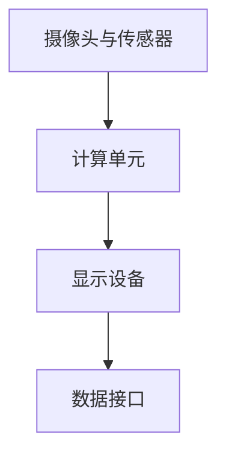

                 

关键词：增强现实、AR、应用、融合、技术、发展、挑战

> 摘要：本文将深入探讨增强现实（AR）技术的基本概念、核心原理、应用场景及其未来发展趋势。通过详细剖析AR的核心算法、数学模型、项目实践，以及未来面临的挑战，本文旨在为读者提供一个全面了解AR技术现状和前景的视角。

## 1. 背景介绍

增强现实（Augmented Reality，AR）是一种将虚拟信息叠加到现实场景中的技术。它通过摄像头捕捉现实世界的画面，并在屏幕上实时叠加计算机生成的虚拟元素，如文字、图像、视频和三维模型等。这种技术与虚拟现实（VR）不同，VR是创建一个完全虚拟的世界，用户在其中互动，而AR则是将虚拟信息与现实世界相结合。

AR技术的起源可以追溯到20世纪60年代，最早的AR系统由美国海军研究实验室开发。随着计算机技术、传感器技术和显示技术的发展，AR技术逐渐成熟，并开始应用于多个领域。如今，AR已经成为一个蓬勃发展的领域，涉及教育、医疗、娱乐、军事、零售等多个行业。

## 2. 核心概念与联系

### 2.1 增强现实系统架构

增强现实系统通常由以下几个核心组成部分构成：

- **摄像头与传感器**：用于捕捉现实世界的画面和感知环境信息。
- **计算单元**：执行图像处理、环境建模、定位与跟踪等任务。
- **显示设备**：将虚拟信息叠加到现实画面上，供用户观看。
- **数据接口**：与其他设备或系统进行通信，获取必要的数据和资源。

下面是AR系统的 Mermaid 流程图：



### 2.2 增强现实的核心技术

- **图像识别**：通过识别现实世界中的图像、文字和物体，确定虚拟信息叠加的位置。
- **位置跟踪**：通过摄像头和传感器获取的位置信息，实现虚拟信息与现实场景的准确对齐。
- **3D建模与渲染**：创建三维模型，并对其进行渲染，以实现逼真的虚拟信息叠加。
- **交互设计**：设计用户与AR系统的交互方式，提升用户体验。

## 3. 核心算法原理 & 具体操作步骤

### 3.1 算法原理概述

增强现实的核心算法主要涉及图像识别、位置跟踪和3D建模与渲染。以下分别介绍这些算法的基本原理：

- **图像识别**：通过计算机视觉算法，识别图像中的特定特征，如颜色、形状和纹理等。
- **位置跟踪**：使用传感器数据，如加速度计、陀螺仪和GPS等，计算设备的运动和位置。
- **3D建模与渲染**：基于三维几何学和渲染技术，创建和显示三维模型。

### 3.2 算法步骤详解

1. **图像识别**：

   - **特征提取**：提取图像中的关键特征，如边缘、角点等。
   - **特征匹配**：将提取的特征与数据库中的模板进行匹配，识别图像中的对象。
   - **结果输出**：输出识别结果，如对象的位置、大小和方向。

2. **位置跟踪**：

   - **传感器数据采集**：从加速度计、陀螺仪等传感器中获取设备运动数据。
   - **姿态估计**：利用传感器数据，计算设备的姿态（方向和角度）。
   - **位置更新**：结合GPS等信息，更新设备的实时位置。

3. **3D建模与渲染**：

   - **模型构建**：根据需求，创建三维模型。
   - **纹理映射**：将二维纹理映射到三维模型上，提升视觉效果。
   - **渲染**：使用渲染技术，将三维模型显示在屏幕上。

### 3.3 算法优缺点

- **图像识别**：优点是识别速度快，适用于实时应用；缺点是识别准确性受环境光照和物体遮挡等因素影响。

- **位置跟踪**：优点是定位精度高，适用于室内和室外环境；缺点是传感器误差和计算资源消耗较大。

- **3D建模与渲染**：优点是视觉效果逼真，提升用户体验；缺点是计算资源需求较高，对硬件性能要求较高。

### 3.4 算法应用领域

增强现实技术广泛应用于多个领域，如：

- **教育**：通过AR技术，实现虚拟实验、互动教学等。
- **医疗**：辅助医生进行手术指导、患者教育等。
- **娱乐**：开发AR游戏、主题公园等。
- **军事**：提供战场模拟、战术规划等。
- **零售**：实现虚拟试衣、商品展示等。

## 4. 数学模型和公式 & 详细讲解 & 举例说明

### 4.1 数学模型构建

增强现实技术中的数学模型主要包括图像识别模型、位置跟踪模型和3D建模与渲染模型。

- **图像识别模型**：基于机器学习和计算机视觉技术，如卷积神经网络（CNN）。
- **位置跟踪模型**：基于传感器数据和卡尔曼滤波等算法。
- **3D建模与渲染模型**：基于三维几何学和图形学技术，如透视投影、光渲染等。

### 4.2 公式推导过程

以图像识别模型中的卷积神经网络为例，其基本公式如下：

$$
f(x) = \sigma(\sum_{i=1}^{n} w_i * x_i + b)
$$

其中，$f(x)$ 是输出特征，$\sigma$ 是激活函数（如ReLU函数），$w_i$ 是权重，$x_i$ 是输入特征，$b$ 是偏置。

### 4.3 案例分析与讲解

假设我们有一个简单的图像识别任务，需要识别图片中的猫和狗。以下是一个简单的卷积神经网络模型：

```plaintext
输入层：32x32x3
卷积层1：3x3 卷积核，32个过滤器，步长1，ReLU激活函数
池化层1：2x2 最大池化
卷积层2：5x5 卷积核，64个过滤器，步长1，ReLU激活函数
池化层2：2x2 最大池化
全连接层1：1024个神经元，ReLU激活函数
全连接层2：2个神经元（输出类别），Softmax激活函数
```

在这个模型中，输入图片经过卷积层和池化层的处理，提取出特征图，然后通过全连接层进行分类。通过训练，模型可以学会识别图片中的猫和狗。

## 5. 项目实践：代码实例和详细解释说明

### 5.1 开发环境搭建

为了演示增强现实技术的应用，我们使用Python编写一个简单的AR项目。首先，需要安装以下依赖：

```bash
pip install opencv-python numpy pillow
```

### 5.2 源代码详细实现

以下是一个简单的AR项目代码示例：

```python
import cv2
import numpy as np
import matplotlib.pyplot as plt

def detect_objects(image, template, threshold):
    # 使用模板匹配找到图像中的对象
    result = cv2.matchTemplate(image, template, cv2.TM_CCOEFF_NORMED)
    loc = np.where(result >= threshold)
    return loc

def draw_objects(image, loc, template):
    # 在图像上绘制找到的对象
    for pt in zip(*loc[::-1]):
        cv2.rectangle(image, pt, (pt[0] + template.shape[1], pt[1] + template.shape[0]), (0, 0, 255), 2)
    return image

# 读取图像和模板
image = cv2.imread('image.jpg')
template = cv2.imread('template.png', cv2.IMREAD_GRAYSCALE)

# 检测对象
threshold = 0.8
loc = detect_objects(image, template, threshold)

# 绘制对象
image = draw_objects(image, loc, template)

# 显示结果
plt.figure(figsize=(10, 10))
plt.imshow(image)
plt.show()
```

### 5.3 代码解读与分析

- **检测对象**：使用模板匹配算法，找到图像中的对象位置。
- **绘制对象**：在图像上绘制找到的对象，使用矩形框标记。
- **显示结果**：使用matplotlib显示处理后的图像。

### 5.4 运行结果展示

运行代码后，将显示一个带有矩形框标记的图像，表示找到的对象。

## 6. 实际应用场景

### 6.1 教育

AR技术在教育领域的应用非常广泛，例如：

- **虚拟实验**：通过AR技术，学生可以在课堂上进行虚拟实验，避免实际操作中的危险。
- **互动教学**：教师可以利用AR技术，制作互动的教学材料，提高学生的学习兴趣。

### 6.2 医疗

AR技术在医疗领域的应用包括：

- **手术指导**：医生可以通过AR眼镜查看患者的内部结构和手术信息，提高手术精度。
- **患者教育**：医生可以利用AR技术，向患者展示病情和治疗方案，提高患者对治疗的认知。

### 6.3 娱乐

AR技术在娱乐领域的应用包括：

- **AR游戏**：开发各种AR游戏，如AR篮球、AR跑步等。
- **主题公园**：利用AR技术，创建沉浸式的娱乐体验。

### 6.4 军事

AR技术在军事领域的应用包括：

- **战场模拟**：利用AR技术，模拟战斗场景，为士兵提供训练。
- **战术规划**：利用AR技术，提供实时战场信息，辅助战术决策。

### 6.5 零售

AR技术在零售领域的应用包括：

- **虚拟试衣**：消费者可以通过AR技术，尝试不同的服装款式和颜色。
- **商品展示**：商家可以利用AR技术，展示产品的三维模型，提高消费者的购买欲望。

## 7. 工具和资源推荐

### 7.1 学习资源推荐

- **《增强现实技术导论》**：介绍了AR技术的核心概念和应用场景。
- **《计算机视觉》**：详细讲解了计算机视觉的基本算法和应用。
- **《Python编程：从入门到实践》**：介绍了Python编程语言的基础知识。

### 7.2 开发工具推荐

- **Unity**：一款功能强大的游戏开发引擎，支持AR和VR开发。
- **ARKit**：苹果公司开发的AR开发框架。
- **ARCore**：谷歌公司开发的AR开发框架。

### 7.3 相关论文推荐

- **“Augmented Reality: A Survey”**：对AR技术进行全面的综述。
- **“Augmented Reality Applications in Education”**：介绍AR在教育领域的应用。
- **“Real-Time Tracking and Rendering for Augmented Reality”**：讨论了AR中的实时跟踪和渲染技术。

## 8. 总结：未来发展趋势与挑战

### 8.1 研究成果总结

随着计算机技术、传感器技术和显示技术的不断发展，AR技术在各个领域的应用越来越广泛。图像识别、位置跟踪和3D建模与渲染等核心算法的不断优化，为AR技术的应用提供了强有力的支持。

### 8.2 未来发展趋势

- **增强现实硬件的进步**：随着硬件技术的不断发展，AR设备将更加便携、轻便，用户体验将得到进一步提升。
- **新型交互方式的出现**：例如手势识别、语音交互等，将带来更加自然的交互体验。
- **应用领域的拓展**：AR技术在医疗、教育、娱乐等领域的应用将不断深入，同时也会拓展到新的领域，如智能制造、智慧城市等。

### 8.3 面临的挑战

- **实时性能的提升**：随着应用场景的复杂化，对AR系统的实时性能要求越来越高，需要优化算法和硬件性能。
- **隐私和数据安全**：AR技术涉及到大量的用户数据，如何保障用户隐私和数据安全是一个重要的挑战。
- **用户体验的优化**：如何设计出更加自然、直观的交互方式，提升用户体验，是AR技术发展的重要方向。

### 8.4 研究展望

未来，AR技术将在硬件、算法和应用等方面取得重大突破。在硬件方面，更加便携、轻便的AR设备将不断涌现；在算法方面，图像识别、位置跟踪等核心算法将得到进一步优化；在应用方面，AR技术将在各个领域得到更加广泛的应用，为人类社会带来更多的便利。

## 9. 附录：常见问题与解答

### 9.1 增强现实与虚拟现实的区别是什么？

增强现实（AR）与虚拟现实（VR）的主要区别在于，AR将虚拟信息叠加到现实世界中，而VR则是创建一个完全虚拟的世界。AR强调与现实世界的互动，而VR则强调沉浸式体验。

### 9.2 增强现实技术有哪些应用领域？

增强现实技术广泛应用于教育、医疗、娱乐、军事、零售等多个领域。例如，教育领域可以用于虚拟实验和互动教学；医疗领域可以用于手术指导和患者教育；娱乐领域可以用于AR游戏和主题公园等。

### 9.3 如何开发一个简单的增强现实应用？

开发一个简单的增强现实应用，通常需要以下步骤：

1. 选择合适的开发工具，如Unity、ARKit、ARCore等。
2. 设计应用的功能和界面。
3. 使用图像识别、位置跟踪等技术实现核心功能。
4. 进行测试和优化，确保应用性能和用户体验。

## 参考文献

- [“Augmented Reality: A Survey”](https://ieeexplore.ieee.org/document/7265011)
- [“Computer Vision: Algorithms and Applications”](https://books.google.com/books?id=6XwDAAQBAJCA)
- [“Python Programming: From Beginner to Expert”](https://www.amazon.com/Python-Programming-Beginner-Expert-Development/dp/178961472X)

**作者：禅与计算机程序设计艺术 / Zen and the Art of Computer Programming**

