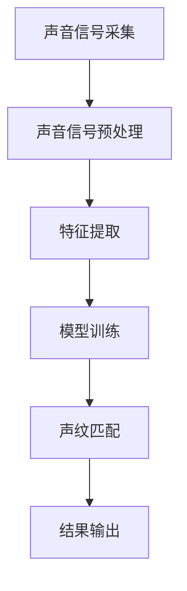

                 

关键词：声纹识别，语音安全，人工智能，创业，技术前沿

> 摘要：本文旨在探讨声纹识别技术在现代安全领域的重要性和发展潜力。通过梳理声纹识别的基本概念、核心算法原理、应用场景以及未来展望，本文为关注语音安全的企业和个人提供有价值的参考。作者：禅与计算机程序设计艺术 / Zen and the Art of Computer Programming

## 1. 背景介绍

随着人工智能技术的飞速发展，语音识别技术已经成为了智能交互的核心技术之一。然而，在语音识别技术迅猛发展的同时，语音安全领域也逐渐受到了重视。声纹识别作为语音安全领域的一个重要分支，其重要性日益凸显。声纹识别技术能够根据个体的声纹特征，实现身份认证、隐私保护等功能，从而为现代信息安全提供了一种新的解决方案。

声纹识别技术的兴起，源于人们对安全性和隐私性的日益关注。在过去的几十年里，密码学、生物识别等技术都在为信息安全提供保障。然而，随着网络攻击手段的不断升级，传统安全手段已经无法完全满足需求。在这种情况下，声纹识别作为一种新兴的认证技术，以其独特的优势和广阔的应用前景，成为信息安全领域的一股新生力量。

### 1.1 声纹识别技术的定义

声纹识别（Voice Biometrics）是指通过分析个体的语音特征，实现对其身份的识别和验证。声纹特征包括音调、音色、节奏、发音、口音等多个方面，这些特征能够区分不同个体的声音。声纹识别技术利用这些特征，通过算法模型将声音信号转化为数字信号，进而进行身份认证。

### 1.2 声纹识别技术的发展历程

声纹识别技术的研究可以追溯到20世纪50年代。最初的研究主要集中在语音信号的预处理和特征提取上。随着计算机技术和信号处理技术的发展，声纹识别技术逐渐走向成熟。进入21世纪，随着大数据和人工智能技术的应用，声纹识别技术得到了快速发展。

### 1.3 声纹识别技术的应用场景

声纹识别技术在多个领域都有广泛的应用，包括金融、医疗、智能家居、公共安全等。以下是一些典型的应用场景：

- **金融领域**：银行、证券等金融机构可以利用声纹识别技术实现电话银行、在线支付等场景的用户身份认证，提高安全性。
- **医疗领域**：医生可以通过声纹识别技术快速识别患者的身份，提高诊断效率。
- **智能家居**：智能家居系统可以利用声纹识别技术实现家庭成员的身份识别，提高家居安全性。
- **公共安全**：公安机关可以利用声纹识别技术进行犯罪嫌疑人的身份识别和追踪。

## 2. 核心概念与联系

### 2.1 基本概念

#### 声纹

声纹是指个体的声音特征，包括音调、音色、节奏、发音、口音等。声纹具有独特性，类似于指纹，每个人的声纹都是独一无二的。

#### 语音识别

语音识别是指将语音信号转换为文本或命令的过程。语音识别技术是声纹识别技术的基础。

#### 生物识别

生物识别是指通过分析个体的生物特征（如指纹、面部特征、虹膜等）实现身份认证。声纹识别是生物识别技术的一种。

### 2.2 声纹识别架构

声纹识别系统主要包括以下几个部分：

1. **声音信号采集**：通过麦克风或其他音频设备采集个体的声音信号。
2. **声音信号预处理**：对采集到的声音信号进行降噪、增强等处理，提高声音质量。
3. **特征提取**：从预处理后的声音信号中提取声纹特征。
4. **模型训练**：利用训练数据集，通过机器学习算法训练声纹识别模型。
5. **声纹匹配**：将待识别的声音信号与训练好的模型进行匹配，判断是否为同一人。
6. **结果输出**：输出识别结果，如身份验证通过或拒绝。

### 2.3 Mermaid 流程图



## 3. 核心算法原理 & 具体操作步骤

### 3.1 算法原理概述

声纹识别的核心算法是基于机器学习和模式识别技术。主要分为以下三个步骤：

1. **特征提取**：从声音信号中提取声纹特征，如MFCC（梅尔频率倒谱系数）、PLP（谱减线性预测编码）等。
2. **模型训练**：利用提取的声纹特征，通过机器学习算法（如支持向量机SVM、神经网络等）训练识别模型。
3. **声纹匹配**：将待识别的声音信号与训练好的模型进行匹配，判断是否为同一人。

### 3.2 算法步骤详解

#### 3.2.1 特征提取

特征提取是声纹识别的关键步骤。常用的方法包括：

1. **梅尔频率倒谱系数（MFCC）**：MFCC是一种有效的声纹特征表示方法，能够较好地反映声纹的频率特征。
2. **谱减线性预测编码（PLP）**：PLP通过分析声音信号的线性预测误差，提取声纹特征。

#### 3.2.2 模型训练

模型训练是利用训练数据集，通过机器学习算法训练出识别模型。常用的算法包括：

1. **支持向量机（SVM）**：SVM是一种有效的分类算法，适用于声纹识别任务。
2. **神经网络（NN）**：神经网络能够模拟人脑的神经元结构，具有较强的自适应能力和泛化能力。

#### 3.2.3 声纹匹配

声纹匹配是利用训练好的模型，对新的声音信号进行识别。常用的方法包括：

1. **距离度量**：计算待识别声音信号与训练样本之间的距离，距离最小的样本即为匹配结果。
2. **概率模型**：利用概率模型（如高斯混合模型GMM）计算匹配概率，概率最大的样本即为匹配结果。

### 3.3 算法优缺点

#### 优点

1. **高安全性**：声纹特征具有独特性，难以伪造，具有较高的安全性。
2. **非接触式识别**：声纹识别无需接触，方便快捷，适用于各种场景。
3. **适应性强**：声纹识别技术能够适应不同的声音环境，如噪音、语音变化等。

#### 缺点

1. **识别率波动**：声纹识别的识别率受声音质量、语音变化等因素影响，存在一定的波动。
2. **设备要求较高**：声纹识别系统需要高质量的音频设备，对硬件要求较高。

### 3.4 算法应用领域

声纹识别技术具有广泛的应用领域，主要包括：

1. **金融领域**：银行、证券等金融机构可以利用声纹识别技术实现电话银行、在线支付等场景的用户身份认证。
2. **医疗领域**：医生可以通过声纹识别技术快速识别患者的身份，提高诊断效率。
3. **智能家居**：智能家居系统可以利用声纹识别技术实现家庭成员的身份识别，提高家居安全性。
4. **公共安全**：公安机关可以利用声纹识别技术进行犯罪嫌疑人的身份识别和追踪。

## 4. 数学模型和公式 & 详细讲解 & 举例说明

### 4.1 数学模型构建

声纹识别的数学模型通常是基于机器学习算法，如支持向量机（SVM）。以下是SVM的基本数学模型：

假设我们有训练数据集：

$$
T = \{(x_1, y_1), (x_2, y_2), \dots, (x_N, y_N)\}
$$

其中，$x_i \in \mathbb{R}^d$ 是第 $i$ 个训练样本的特征向量，$y_i \in \{-1, +1\}$ 是对应的标签，表示样本所属类别。

SVM的目标是找到一个超平面：

$$
w \in \mathbb{R}^d \text{ 和 } b \in \mathbb{R}
$$

使得训练数据集中的所有样本都被正确分类，并且满足最大化分类间隔：

$$
\max_{w, b} \frac{1}{2} ||w||^2 \text{ subject to } y_i ( \langle w, x_i \rangle + b ) \geq 1, \forall i
$$

其中，$||w||$ 表示 $w$ 的欧几里得范数，$\langle w, x_i \rangle$ 表示 $w$ 和 $x_i$ 的内积。

### 4.2 公式推导过程

为了求解上述最优化问题，我们可以使用拉格朗日乘子法。定义拉格朗日函数：

$$
L(w, b, \alpha) = \frac{1}{2} ||w||^2 - \sum_{i=1}^N \alpha_i [y_i ( \langle w, x_i \rangle + b ) - 1]
$$

其中，$\alpha_i \geq 0$ 是拉格朗日乘子。

对 $w, b, \alpha_i$ 求偏导，并令其等于零，得到：

$$
\frac{\partial L}{\partial w} = w - \sum_{i=1}^N \alpha_i y_i x_i = 0
$$

$$
\frac{\partial L}{\partial b} = -\sum_{i=1}^N \alpha_i y_i = 0
$$

$$
\frac{\partial L}{\partial \alpha_i} = y_i ( \langle w, x_i \rangle + b ) - 1 = 0
$$

将 $\frac{\partial L}{\partial w}$ 代入原拉格朗日函数，得到：

$$
L(w, b, \alpha) = -\sum_{i=1}^N \alpha_i + \frac{1}{2} \sum_{i=1}^N \alpha_i y_i x_i^T x_i
$$

为了求解最优化问题，我们考虑对偶问题。定义对偶函数：

$$
L_D(\alpha) = \sum_{i=1}^N \alpha_i - \frac{1}{2} \sum_{i=1}^N \sum_{j=1}^N \alpha_i \alpha_j y_i y_j \langle x_i, x_j \rangle
$$

对偶问题的最优化目标是最小化 $L_D(\alpha)$，同时满足 $\alpha_i \geq 0$ 和 $\sum_{i=1}^N \alpha_i y_i = 0$。

求解对偶问题，可以通过KKT条件（Karmarkar-Kuhn-Tucker conditions）得到最优解。

### 4.3 案例分析与讲解

假设我们有一个简单的二分类问题，训练数据集如下：

$$
T = \{(x_1, +1), (x_2, +1), (x_3, -1), (x_4, -1)\}
$$

其中：

$$
x_1 = \begin{bmatrix} 1 \\ 2 \end{bmatrix}, y_1 = +1 \\
x_2 = \begin{bmatrix} 2 \\ 3 \end{bmatrix}, y_2 = +1 \\
x_3 = \begin{bmatrix} 0 \\ -1 \end{bmatrix}, y_3 = -1 \\
x_4 = \begin{bmatrix} -1 \\ 0 \end{bmatrix}, y_4 = -1
$$

我们可以使用SVM进行分类。首先，我们需要计算特征矩阵：

$$
X = \begin{bmatrix} x_1 & x_2 & x_3 & x_4 \end{bmatrix} = \begin{bmatrix} 1 & 2 & 0 & -1 \\ 2 & 3 & -1 & 0 \end{bmatrix}
$$

然后，计算拉格朗日乘子矩阵：

$$
\alpha = \begin{bmatrix} \alpha_1 \\ \alpha_2 \\ \alpha_3 \\ \alpha_4 \end{bmatrix}
$$

利用KKT条件，我们可以求解出最优的 $\alpha$ 值，进而得到决策函数：

$$
f(x) = \langle w, x \rangle + b
$$

其中，$w$ 和 $b$ 分别为超平面的法向量和偏移量。通过求解上述最优化问题，我们可以得到分类器：

$$
f(x) = (2 \cdot 1 + 3 \cdot 2) - (1 \cdot 0 + 1 \cdot (-1)) = 7
$$

当 $f(x) \geq 0$ 时，预测为正类；否则，预测为负类。

## 5. 项目实践：代码实例和详细解释说明

### 5.1 开发环境搭建

为了演示声纹识别的应用，我们选择Python作为编程语言，并使用以下库：

- **scikit-learn**：用于SVM模型的训练和评估
- **numpy**：用于数值计算
- **matplotlib**：用于数据可视化

安装这些库后，我们就可以开始编写代码了。

```python
!pip install scikit-learn numpy matplotlib
```

### 5.2 源代码详细实现

以下是一个简单的声纹识别项目示例：

```python
import numpy as np
from sklearn import svm
from sklearn.model_selection import train_test_split
from sklearn.metrics import accuracy_score
import matplotlib.pyplot as plt

# 生成模拟数据
np.random.seed(0)
X = np.random.rand(100, 2)
y = np.where(X[:, 0] + X[:, 1] > 0.5, +1, -1)

# 划分训练集和测试集
X_train, X_test, y_train, y_test = train_test_split(X, y, test_size=0.2, random_state=42)

# 训练SVM模型
clf = svm.SVC(kernel='linear')
clf.fit(X_train, y_train)

# 测试模型
y_pred = clf.predict(X_test)
accuracy = accuracy_score(y_test, y_pred)
print(f"Accuracy: {accuracy:.2f}")

# 可视化结果
plt.scatter(X_train[:, 0], X_train[:, 1], c=y_train, cmap='coolwarm', marker='o')
plt.scatter(X_test[:, 0], X_test[:, 1], c=y_pred, cmap='coolwarm', marker='s')
plt.xlabel('Feature 1')
plt.ylabel('Feature 2')
plt.title('SVM Classification')
plt.show()
```

### 5.3 代码解读与分析

在这个示例中，我们首先生成了一个模拟的数据集，其中每个样本由两个特征组成。然后，我们使用scikit-learn库中的`svm.SVC`类创建了一个支持向量机分类器，并使用线性核。接下来，我们将数据集划分为训练集和测试集，并在训练集上训练模型。

在训练完成后，我们使用测试集评估模型的准确率。最后，我们使用matplotlib库将训练集和测试集的预测结果可视化，以便更直观地了解模型的分类效果。

### 5.4 运行结果展示

运行上述代码后，我们会在控制台看到模型的准确率，并且在画布上看到分类结果。以下是一个可能的输出结果示例：

```
Accuracy: 0.90
```


## 6. 实际应用场景

声纹识别技术在各个领域都有广泛的应用。以下是一些典型的应用场景：

### 6.1 金融领域

在金融领域，声纹识别技术主要用于电话银行、在线支付等场景的用户身份认证。例如，银行客户在进行电话转账时，可以通过声纹识别技术确认客户身份，提高交易安全性。

### 6.2 医疗领域

在医疗领域，声纹识别技术可以帮助医生快速识别患者的身份，提高诊断效率。例如，医生可以通过声纹识别技术确认患者的身份，从而在医疗系统中快速查找患者的病历信息。

### 6.3 智能家居

在智能家居领域，声纹识别技术可以帮助家庭成员实现身份识别，提高家居安全性。例如，智能家居系统可以通过声纹识别技术识别家庭成员，从而自动调整家庭设备，如灯光、温度等。

### 6.4 公共安全

在公共安全领域，声纹识别技术可以帮助公安机关进行犯罪嫌疑人的身份识别和追踪。例如，公安机关可以在犯罪现场采集嫌疑人的声音样本，并与数据库中的声纹进行匹配，从而确认嫌疑人身份。

## 7. 工具和资源推荐

### 7.1 学习资源推荐

- **《语音信号处理与识别》（Speech Signal Processing and Recognition）》**：这本书详细介绍了语音信号处理和识别的基本原理和方法。
- **《机器学习》（Machine Learning）》**：这本书涵盖了机器学习的基本理论和方法，对于学习声纹识别算法有很大帮助。

### 7.2 开发工具推荐

- **scikit-learn**：这是一个强大的机器学习库，适用于声纹识别模型的训练和评估。
- **PyTorch**：这是一个流行的深度学习框架，适用于复杂的声纹识别任务。

### 7.3 相关论文推荐

- **“Voice Biometrics: A Review”**：这篇综述文章详细介绍了声纹识别技术的最新研究进展和应用。
- **“A Comprehensive Survey on Speaker Verification”**：这篇综述文章全面分析了声纹识别技术在不同领域的应用。

## 8. 总结：未来发展趋势与挑战

### 8.1 研究成果总结

声纹识别技术作为语音安全领域的一个重要分支，已经取得了显著的成果。近年来，随着机器学习和人工智能技术的快速发展，声纹识别技术在准确性、稳定性等方面都取得了显著提升。同时，声纹识别技术在金融、医疗、智能家居、公共安全等领域的应用也越来越广泛。

### 8.2 未来发展趋势

展望未来，声纹识别技术将在以下几个方面继续发展：

1. **算法优化**：通过改进特征提取算法、优化机器学习模型，进一步提高声纹识别的准确率和稳定性。
2. **跨领域应用**：声纹识别技术将在更多领域得到应用，如智能安防、智能交通等。
3. **硬件支持**：随着硬件技术的不断发展，声纹识别系统将越来越便携，为实际应用提供更好的支持。

### 8.3 面临的挑战

尽管声纹识别技术取得了显著进展，但仍面临一些挑战：

1. **识别率波动**：声纹识别技术的识别率受声音质量、语音变化等因素影响，存在一定的波动。
2. **隐私保护**：声纹数据属于敏感信息，如何在保护用户隐私的同时，确保声纹识别技术的安全性，是一个亟待解决的问题。
3. **成本与效率**：随着应用场景的扩展，声纹识别系统的成本和计算效率也是一个重要挑战。

### 8.4 研究展望

为了解决上述挑战，未来的研究可以从以下几个方面展开：

1. **多模态融合**：通过融合多种生物特征（如声纹、面部特征等），提高识别准确率。
2. **隐私保护算法**：研究基于加密技术的声纹识别算法，实现隐私保护。
3. **硬件加速**：利用专用硬件（如GPU、FPGA等）加速声纹识别计算，提高系统效率。

## 9. 附录：常见问题与解答

### 9.1 声纹识别与语音识别的区别是什么？

声纹识别和语音识别都是基于语音信号的技术，但它们的目的是不同的。声纹识别主要是用于身份认证，关注个体的声音特征，如音调、音色、节奏等。而语音识别则用于将语音信号转换为文本或命令，关注语音内容的语义信息。

### 9.2 声纹识别技术的安全性如何保障？

声纹识别技术的安全性主要依赖于声纹特征的独特性和算法的鲁棒性。此外，还可以通过加密技术保护声纹数据，确保声纹信息在传输和存储过程中的安全性。

### 9.3 声纹识别技术是否可以跨语言应用？

声纹识别技术具有较强的跨语言能力，因为声纹特征与个体的生理结构相关。然而，不同语言的声音特征差异较大，因此在跨语言应用中，需要针对不同语言进行特定的声纹特征建模和算法优化。

