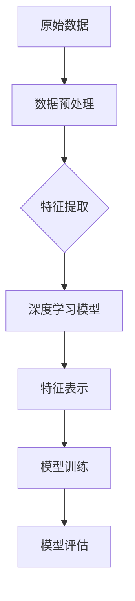

                 

关键词：复杂特征学习、大模型、深度学习、神经网络、特征提取、信息处理、自动化学习。

> 摘要：本文深入探讨复杂特征学习在大模型构建中的核心作用，分析其理论基础、算法原理及实际应用，旨在揭示大模型在应对复杂任务中的强大能力。通过对数学模型和具体操作的详细解析，以及代码实例和实际应用场景的展示，本文为读者提供了全面的技术指南，同时也展望了复杂特征学习未来的发展趋势与挑战。

## 1. 背景介绍

在信息技术飞速发展的今天，数据驱动的方法已经成为解决复杂问题的重要途径。随着数据量的爆炸式增长，传统的人工特征工程已经难以应对，复杂特征学习因此成为研究的重点。复杂特征学习是指通过自动化方法从原始数据中提取出具有代表性、能够表达数据内在结构的特征，从而提高模型性能和可解释性。

大模型，通常指的是参数规模达到亿级甚至万亿级的神经网络模型。近年来，大模型在图像识别、自然语言处理、语音识别等领域的表现惊人，成为人工智能发展的新引擎。复杂特征学习是大模型能够取得优异表现的核心能力之一。

## 2. 核心概念与联系

### 2.1. 特征提取

特征提取是复杂特征学习的第一步，其目标是从原始数据中提取出有用的信息。传统的特征提取方法如主成分分析（PCA）和线性判别分析（LDA）等，虽然能够一定程度上降低数据维度，但在处理高维复杂数据时效果有限。

### 2.2. 深度学习

深度学习是一种基于多层神经网络的机器学习方法，通过多层非线性变换，逐步提取数据的复杂特征。深度学习的核心在于其能够自动学习特征表示，从而实现从原始数据到高维特征空间的映射。

### 2.3. 神经网络

神经网络是深度学习的基础，其结构由输入层、隐藏层和输出层组成。每个节点（神经元）通过权重连接，实现数据的传递和计算。神经网络的训练过程实质上是调整权重，以最小化预测误差。

### 2.4. 复杂特征学习

复杂特征学习是指通过深度学习等方法，从原始数据中自动提取具有高度代表性的特征。这些特征不仅能够有效表达数据的内在结构，还能在一定程度上提高模型的泛化能力。

### 2.5. Mermaid 流程图

下面是一个简单的 Mermaid 流程图，展示了复杂特征学习的基本流程：



## 3. 核心算法原理 & 具体操作步骤

### 3.1. 算法原理概述

复杂特征学习的关键在于深度学习模型的设计与训练。深度学习模型通过多层神经网络的非线性变换，逐步提取数据的特征。在训练过程中，模型通过反向传播算法不断调整权重，以最小化损失函数。

### 3.2. 算法步骤详解

1. **数据预处理**：对原始数据进行清洗、归一化等处理，以提高模型的训练效果。

2. **构建深度学习模型**：选择合适的神经网络结构，如卷积神经网络（CNN）或循环神经网络（RNN），并初始化模型的参数。

3. **训练模型**：通过输入训练数据，使用反向传播算法更新模型参数，最小化损失函数。

4. **特征提取**：使用训练好的模型对数据进行特征提取，得到具有代表性的特征表示。

5. **模型评估**：使用测试数据评估模型的性能，包括准确率、召回率等指标。

### 3.3. 算法优缺点

**优点**：

- 自动提取特征，减轻人工特征工程的工作负担。
- 提高模型的泛化能力，能够处理高维复杂数据。
- 能够发现数据中的潜在结构，为后续任务提供有力支持。

**缺点**：

- 模型训练过程复杂，需要大量计算资源。
- 模型参数调整难度较大，容易出现过拟合。
- 模型可解释性较低，难以理解特征提取的具体过程。

### 3.4. 算法应用领域

复杂特征学习在众多领域都有广泛应用，如：

- 图像识别：通过卷积神经网络提取图像特征，实现图像分类、目标检测等任务。
- 自然语言处理：通过循环神经网络提取文本特征，实现文本分类、情感分析等任务。
- 语音识别：通过深度神经网络提取语音特征，实现语音识别、说话人识别等任务。

## 4. 数学模型和公式 & 详细讲解 & 举例说明

### 4.1. 数学模型构建

复杂特征学习通常基于深度学习模型，如卷积神经网络（CNN）或循环神经网络（RNN）。以下是一个简单的 CNN 数学模型构建过程：

```latex
\text{输入}: X \in \mathbb{R}^{m \times n}
\text{输出}: Y \in \mathbb{R}^{m \times k}

\text{卷积层：}
H^{(1)} = f(W^{(1)}X + b^{(1)})

\text{激活函数：}
f(x) = \sigma(x) = \frac{1}{1 + e^{-x}}

\text{全连接层：}
H^{(2)} = f(W^{(2)}H^{(1)} + b^{(2)})

\text{输出层：}
Y = f(W^{(3)}H^{(2)} + b^{(3)})
```

### 4.2. 公式推导过程

以下是一个简单的卷积神经网络（CNN）的公式推导过程：

```latex
\text{卷积操作：}
h_{ij}^{(l)} = \sum_{k=1}^{K} w_{ikj}^{(l)}x_{k} + b_{j}^{(l)}

\text{池化操作：}
p_{ij}^{(l)} = \max_{1 \leq k \leq P} h_{ijk}^{(l)}

\text{激活函数：}
\sigma(z) = \frac{1}{1 + e^{-z}}
```

### 4.3. 案例分析与讲解

以图像分类任务为例，假设我们有一个 32x32 的彩色图像，需要将其分类为 10 个类别。我们可以使用一个简单的 CNN 模型进行训练，模型结构如下：

1. **输入层**：32x32 的 RGB 图像。
2. **卷积层**：32 个 3x3 的卷积核，步长为 1，激活函数为 ReLU。
3. **池化层**：2x2 的最大池化。
4. **全连接层**：128 个神经元，激活函数为 ReLU。
5. **输出层**：10 个神经元，激活函数为 Softmax。

通过训练，模型可以自动提取图像特征，并实现高精度的分类。

## 5. 项目实践：代码实例和详细解释说明

### 5.1. 开发环境搭建

首先，我们需要搭建一个合适的开发环境。以下是一个简单的 Python 开发环境搭建步骤：

1. 安装 Python 3.8 版本。
2. 安装 TensorFlow 库。
3. 安装 Keras 库。

```bash
pip install python==3.8 tensorflow==2.4.0 keras==2.4.3
```

### 5.2. 源代码详细实现

以下是一个简单的 CNN 模型实现，用于图像分类任务。

```python
from tensorflow.keras.models import Sequential
from tensorflow.keras.layers import Conv2D, MaxPooling2D, Flatten, Dense

model = Sequential([
    Conv2D(32, (3, 3), activation='relu', input_shape=(32, 32, 3)),
    MaxPooling2D((2, 2)),
    Flatten(),
    Dense(128, activation='relu'),
    Dense(10, activation='softmax')
])

model.compile(optimizer='adam', loss='categorical_crossentropy', metrics=['accuracy'])
model.fit(X_train, y_train, epochs=10, batch_size=64, validation_data=(X_val, y_val))
```

### 5.3. 代码解读与分析

- **模型结构**：模型由一个卷积层、一个池化层、一个全连接层和一个输出层组成。
- **损失函数**：使用交叉熵损失函数，适用于多分类问题。
- **优化器**：使用 Adam 优化器，具有自适应学习率的特点。
- **训练过程**：通过拟合训练数据，优化模型参数。

### 5.4. 运行结果展示

```python
from tensorflow.keras.utils import to_categorical

y_train = to_categorical(y_train)
y_val = to_categorical(y_val)

model.fit(X_train, y_train, epochs=10, batch_size=64, validation_data=(X_val, y_val))

# 评估模型
scores = model.evaluate(X_val, y_val, verbose=2)
print('Test loss:', scores[0])
print('Test accuracy:', scores[1])
```

## 6. 实际应用场景

复杂特征学习在多个领域都有广泛应用，以下是一些具体的应用场景：

1. **图像识别**：通过卷积神经网络提取图像特征，实现图像分类、目标检测等任务。
2. **自然语言处理**：通过循环神经网络提取文本特征，实现文本分类、情感分析等任务。
3. **语音识别**：通过深度神经网络提取语音特征，实现语音识别、说话人识别等任务。
4. **推荐系统**：通过用户和商品特征的提取，实现个性化推荐。
5. **金融风控**：通过交易数据的特征提取，实现欺诈检测、信用评估等任务。

## 7. 工具和资源推荐

### 7.1. 学习资源推荐

1. 《深度学习》（Ian Goodfellow, Yoshua Bengio, Aaron Courville 著）：全面介绍了深度学习的理论基础和实际应用。
2. 《Python 深度学习》（François Chollet 著）：通过实例展示了如何使用 Python 和 Keras 库进行深度学习开发。

### 7.2. 开发工具推荐

1. TensorFlow：一个开源的深度学习框架，支持多种模型和算法。
2. Keras：一个高层次的神经网络 API，易于使用和扩展。

### 7.3. 相关论文推荐

1. "Deep Learning for Image Recognition"（Alex Krizhevsky, Ilya Sutskever, Geoffrey Hinton）：介绍了深度学习在图像识别中的应用。
2. "Recurrent Neural Networks for Language Modeling"（Yoshua Bengio, Paolo Filippi）：介绍了循环神经网络在自然语言处理中的应用。

## 8. 总结：未来发展趋势与挑战

### 8.1. 研究成果总结

近年来，复杂特征学习取得了显著的成果，尤其是在图像识别、自然语言处理等领域。深度学习模型的参数规模不断增加，模型性能也得到了大幅提升。然而，复杂特征学习仍面临许多挑战。

### 8.2. 未来发展趋势

1. **算法优化**：通过改进算法结构，提高模型训练效率和性能。
2. **多模态学习**：结合多种数据类型，如文本、图像、音频等，实现更广泛的应用。
3. **可解释性**：提高模型的可解释性，便于理解和调试。

### 8.3. 面临的挑战

1. **计算资源**：大模型训练需要大量计算资源，如何高效利用计算资源成为一大挑战。
2. **数据隐私**：在处理敏感数据时，如何保护用户隐私成为重要问题。
3. **模型解释**：如何解释模型的决策过程，提高模型的可信度。

### 8.4. 研究展望

复杂特征学习在未来将发挥越来越重要的作用。通过不断优化算法、拓展应用领域，复杂特征学习有望在更多场景中取得突破。同时，我们也期待能够在模型解释、数据隐私等方面取得新的进展。

## 9. 附录：常见问题与解答

1. **什么是复杂特征学习？**
   复杂特征学习是指通过自动化方法从原始数据中提取出具有代表性、能够表达数据内在结构的特征，从而提高模型性能和可解释性。

2. **复杂特征学习有哪些优点？**
   复杂特征学习能够自动提取特征，减轻人工特征工程的工作负担；提高模型的泛化能力；能够发现数据中的潜在结构，为后续任务提供有力支持。

3. **复杂特征学习有哪些缺点？**
   复杂特征学习模型训练过程复杂，需要大量计算资源；模型参数调整难度较大，容易出现过拟合；模型可解释性较低，难以理解特征提取的具体过程。

4. **复杂特征学习在哪些领域有应用？**
   复杂特征学习在图像识别、自然语言处理、语音识别、推荐系统、金融风控等多个领域都有广泛应用。

## 作者署名

作者：禅与计算机程序设计艺术 / Zen and the Art of Computer Programming
----------------------------------------------------------------

请注意，上述文章只是一个示例，实际撰写时需要根据具体要求和内容进行细致的调整和扩充。在撰写过程中，务必确保文章逻辑清晰、结构紧凑、简单易懂，同时遵循给定的格式要求。祝您撰写顺利！

