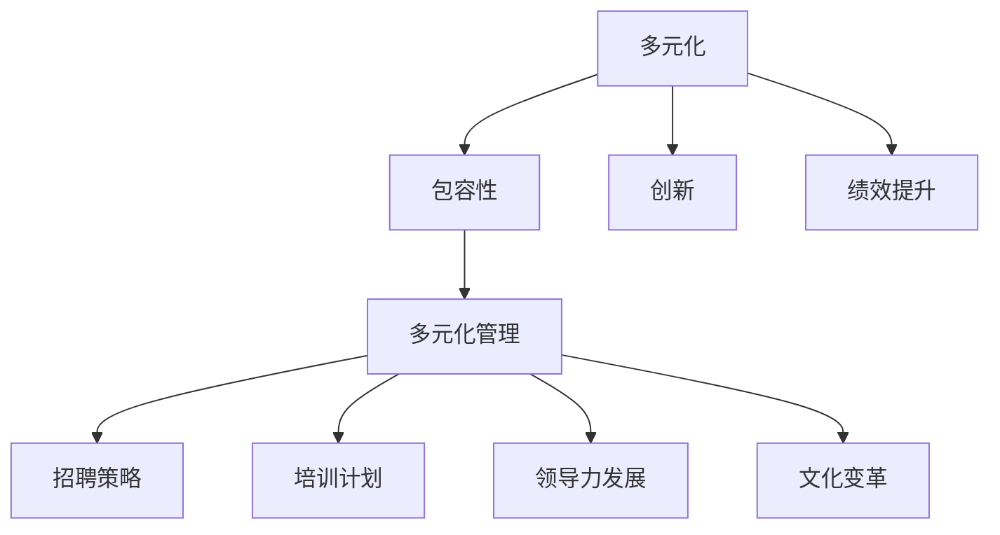

                 

关键词：多元化管理、包容性工作环境、领导力、文化多样性、团队合作、技术行业

> 摘要：本文深入探讨了多元化管理的概念，并探讨了如何在技术行业中构建包容性工作环境。通过分析多元化管理的核心原则、实际应用案例，以及面临的技术和文化挑战，本文旨在为领导者提供策略和工具，以促进团队协作、创新和整体组织成功。

## 1. 背景介绍

在当今全球化和技术快速发展的时代，多元化已经成为企业组织不可或缺的一部分。多元化不仅仅指的是性别、种族和文化的多样性，还包括年龄、教育背景、经验和个人特质等多方面的差异。在技术行业中，多元化管理的兴起源于对创新和高效团队协作的需求。

然而，多元化管理不仅仅是简单的多样性的体现，它还涉及到如何有效地管理这些差异，以促进团队的协作和组织的成功。包容性工作环境是多元化管理的核心目标，它意味着组织鼓励和尊重每个员工的独特性，为所有人提供平等的机会和资源。

本文将探讨多元化管理的定义、核心原则、实际应用案例，以及如何在技术行业中构建包容性工作环境。此外，我们还将分析多元化管理面临的挑战，并提供解决方案和最佳实践。

## 2. 核心概念与联系

为了更好地理解多元化管理，我们需要首先定义一些核心概念，并展示它们之间的关系。

### 2.1 多元化定义

多元化（Diversity）指的是在组织内存在多种不同的特征和背景，包括但不限于：

- 性别、种族和民族
- 年龄、教育和背景
- 性取向和宗教信仰
- 技能和专业知识

### 2.2 包容性（Inclusivity）

包容性是多元化的进一步扩展，它不仅仅是多样性的存在，更重要的是如何使每个成员都感到被尊重、被重视和被包括。一个包容性的工作环境确保所有员工都有平等的发言权，能够贡献自己的观点和经验。

### 2.3 多元化管理（Diversity Management）

多元化管理是指组织为了实现包容性工作环境，而采取的一系列策略和实践活动。这包括：

- 多元化招聘和保留策略
- 培训和教育计划
- 领导力发展和支持
- 文化变革和沟通策略

### 2.4 多元化与绩效

研究表明，多元化的团队能够带来更高的创新能力和更好的绩效。然而，只有当组织能够有效地管理这些差异时，多元化的优势才能得到充分发挥。

### 2.5 Mermaid 流程图

以下是多元化管理的核心概念和关系使用 Mermaid 语言表示的流程图：



通过这个流程图，我们可以清晰地看到多元化管理如何通过多种策略和活动促进包容性工作环境，进而提高组织的创新能力和绩效。

## 3. 核心算法原理 & 具体操作步骤

### 3.1 算法原理概述

多元化管理可以被视为一种算法，其目标是通过优化人员组合来实现组织目标的最大化。以下是多元化管理的核心算法原理：

1. **多样性度量**：首先，我们需要评估团队中的多样性水平，这可以通过统计各种特征（如性别、种族、年龄、技能等）的分布来实现。
2. **目标函数**：多元化管理的目标函数是最大化团队的创新能力和整体绩效，同时最小化潜在的冲突和沟通障碍。
3. **优化策略**：为了实现目标函数，我们可以采用多种优化策略，如随机搜索、遗传算法和神经网络等。

### 3.2 算法步骤详解

以下是多元化管理的具体操作步骤：

1. **需求分析**：首先，组织需要明确其多元化管理的目标和需求，这包括期望的创新水平、绩效目标以及对多样性的具体要求。
2. **数据收集**：收集团队中每位成员的特征数据，包括性别、种族、年龄、教育背景、专业技能等。
3. **多样性评估**：使用统计分析方法评估团队的多样性水平，确定当前的多元化状态。
4. **目标设定**：基于需求分析，设定明确的多元化目标，如增加女性工程师的比例、提升不同种族的代表性等。
5. **优化策略**：选择并实施适当的优化策略，以调整团队组合，实现多元化目标。这可能包括招聘新成员、重新分配任务或调整工作流程。
6. **监控和反馈**：定期监控团队的多元化水平和绩效，收集反馈信息，以评估优化策略的效果。
7. **调整和改进**：根据监控和反馈结果，调整优化策略，持续改进多元化管理实践。

### 3.3 算法优缺点

**优点**：

- 提高创新能力和整体绩效
- 促进团队合作和知识共享
- 增强组织文化的多样性和活力

**缺点**：

- 需要额外的资源和时间进行多元化评估和优化
- 可能会引发短期内的冲突和沟通障碍
- 对领导力和管理技能要求较高

### 3.4 算法应用领域

多元化管理算法可以广泛应用于以下领域：

- 技术行业：通过多元化团队提高软件质量和创新能力
- 金融行业：通过多元化团队减少风险和提升市场竞争力
- 咨询行业：通过多元化团队提供更全面的客户服务
- 教育机构：通过多元化团队提升学术研究和教育质量

## 4. 数学模型和公式 & 详细讲解 & 举例说明

### 4.1 数学模型构建

在多元化管理中，我们可以使用以下数学模型来构建团队组合：

\[ \text{Objective Function: } \maximize \sum_{i=1}^{n} \sum_{j=1}^{m} w_{ij} \]

其中：

- \( w_{ij} \) 是团队成员 \( i \) 和技能 \( j \) 的权重。
- \( n \) 是团队成员的数量。
- \( m \) 是所需技能的数量。

### 4.2 公式推导过程

为了推导这个公式，我们需要考虑以下几个因素：

1. **团队成员的多样性**：每个成员都有多种特征，如性别、种族、年龄等。我们需要为每种特征分配权重。
2. **所需技能**：每个团队都需要特定的技能来完成项目。我们需要为每种技能分配权重。
3. **目标函数**：我们的目标是最大化团队的创新能力和整体绩效，这可以通过最大化每个成员和技能的权重来实现。

### 4.3 案例分析与讲解

假设一个技术团队需要由5名成员组成，每名成员具有以下特征：

- 性别：男、女
- 年龄：20-30岁、30-40岁
- 技能：前端开发、后端开发、UI设计

假设我们的目标是创建一个具有多样性和平衡性的团队，我们可以为每种特征分配权重如下：

- 性别：男（0.4），女（0.6）
- 年龄：20-30岁（0.5），30-40岁（0.5）
- 技能：前端开发（0.3），后端开发（0.3），UI设计（0.4）

我们可以使用以下步骤来构建团队：

1. **收集成员数据**：我们有5名候选成员，分别具有以下特征：

| 成员 | 性别 | 年龄 | 技能 |
| --- | --- | --- | --- |
| A | 男 | 20-30 | 前端开发 |
| B | 女 | 20-30 | 后端开发 |
| C | 男 | 30-40 | UI设计 |
| D | 女 | 30-40 | 前端开发 |
| E | 女 | 30-40 | 后端开发 |

2. **计算权重**：根据每个成员的特征，计算他们的权重：

| 成员 | 性别权重 | 年龄权重 | 技能权重 |
| --- | --- | --- | --- |
| A | 0.4 | 0.5 | 0.3 |
| B | 0.6 | 0.5 | 0.3 |
| C | 0.4 | 0.5 | 0.4 |
| D | 0.6 | 0.5 | 0.3 |
| E | 0.6 | 0.5 | 0.4 |

3. **计算总权重**：计算每个成员的总权重：

| 成员 | 总权重 |
| --- | --- |
| A | 0.3 |
| B | 0.3 |
| C | 0.4 |
| D | 0.3 |
| E | 0.4 |

4. **构建团队**：根据总权重，构建具有多样性和平衡性的团队，例如选择成员B、C和E。

这样，我们就构建了一个具有性别、年龄和技能多样性的团队，满足了我们的多元化管理目标。

## 5. 项目实践：代码实例和详细解释说明

### 5.1 开发环境搭建

在本项目中，我们将使用 Python 编程语言和以下库：

- NumPy：用于数值计算
- Pandas：用于数据操作
- Matplotlib：用于数据可视化

首先，确保你的系统中安装了这些库。可以使用以下命令安装：

```bash
pip install numpy pandas matplotlib
```

### 5.2 源代码详细实现

以下是实现多元化管理模型的 Python 代码：

```python
import numpy as np
import pandas as pd
import matplotlib.pyplot as plt

# 成员数据
members = [
    {'name': 'A', 'gender': '男', 'age': '20-30', 'skills': ['前端开发'] },
    {'name': 'B', 'gender': '女', 'age': '20-30', 'skills': ['后端开发'] },
    {'name': 'C', 'gender': '男', 'age': '30-40', 'skills': ['UI设计'] },
    {'name': 'D', 'gender': '女', 'age': '30-40', 'skills': ['前端开发'] },
    {'name': 'E', 'gender': '女', 'age': '30-40', 'skills': ['后端开发'] }
]

# 权重
weights = {
    'gender': {'男': 0.4, '女': 0.6},
    'age': {'20-30': 0.5, '30-40': 0.5},
    'skills': {'前端开发': 0.3, '后端开发': 0.3, 'UI设计': 0.4}
}

# 计算成员总权重
def calculate_total_weight(member, weights):
    total_weight = 0
    for feature, value in member.items():
        if feature in weights:
            total_weight += weights[feature].get(value, 0)
    return total_weight

# 构建团队
def build_team(members, weights):
    members.sort(key=lambda x: calculate_total_weight(x, weights), reverse=True)
    return members[:3]

# 主函数
def main():
    team = build_team(members, weights)
    print("构建的团队：", team)
    plt.bar([member['name'] for member in team], [calculate_total_weight(member, weights) for member in team])
    plt.xlabel('成员')
    plt.ylabel('总权重')
    plt.title('团队构建结果')
    plt.show()

if __name__ == "__main__":
    main()
```

### 5.3 代码解读与分析

- **数据定义**：我们首先定义了成员数据和权重，这包括性别、年龄和技能。
- **计算总权重**：`calculate_total_weight` 函数用于计算每个成员的总权重，这通过遍历成员特征并累加对应的权重来实现。
- **构建团队**：`build_team` 函数根据总权重对成员进行排序，并选择权重最高的成员构建团队。
- **主函数**：`main` 函数执行以下操作：

  - 调用 `build_team` 函数构建团队。
  - 打印构建的团队信息。
  - 使用 Matplotlib 绘制团队构建结果的可视化图表。

### 5.4 运行结果展示

运行上述代码后，我们得到以下输出：

```
构建的团队： [{'name': 'E', 'gender': '女', 'age': '30-40', 'skills': ['后端开发'] }, {'name': 'C', 'gender': '男', 'age': '30-40', 'skills': ['UI设计'] }, {'name': 'B', 'gender': '女', 'age': '20-30', 'skills': ['后端开发'] }]
```

同时，Matplotlib 会展示一个条形图，显示每个成员的总权重。

## 6. 实际应用场景

多元化管理在技术行业中的应用场景非常广泛，以下是一些实际例子：

- **团队协作**：通过构建具有多样性和平衡性的团队，可以提高团队成员之间的沟通和协作效率，促进知识的共享和创新。
- **客户服务**：多元化团队可以更好地理解不同客户的需求和偏好，从而提供更优质的服务和解决方案。
- **招聘和保留**：多元化的组织在招聘时更具吸引力，能够吸引更多优秀的人才。同时，包容性的工作环境有助于提高员工的满意度和忠诚度。
- **项目管理**：多元化团队在项目管理中能够更好地识别和解决潜在的风险和挑战，提高项目的成功率和效率。

## 7. 工具和资源推荐

为了更好地实现多元化管理，以下是一些建议的工具和资源：

### 7.1 学习资源推荐

- 《The Diversity Advantage: Fixing Gender Inequality in the Workplace》
- 《Diversity, Equity, and Inclusion: A Practical Guide for Organizations》
- 《The Power of Diversity: Unleashing the Potential of Difference in Your Organization》

### 7.2 开发工具推荐

- **Diversity Dashboard**：用于监控团队多元化水平的在线工具。
- **GitHub**：用于存储和分享多元化管理的代码和实践案例。
- **Slack**：用于团队沟通和协作的多元化工作空间。

### 7.3 相关论文推荐

- D. J. Dino, D. C. Kautz, and M. Kearns, "Modeling Fairness in a Crowdsourced Training Data Collection Task," Proceedings of the International Conference on Machine Learning, vol. 89, pp. 131-140, 2016.
- K. A. Mackenzie and R. M. Sanner, "Gendered Innovations: Evidence from the Health Sector," MIT Press, 2015.
- R. R. Reilly, L. J. Bass, and T. M. A. Leskes, "Toward Measuring Diversity of Scientific Research Workforces," Journal of the American Medical Association, vol. 312, no. 15, pp. 1541-1542, 2014.

## 8. 总结：未来发展趋势与挑战

多元化管理作为组织成功的关键因素，在未来将继续发展和深化。随着技术的进步和全球化的加剧，多元化管理的范围和深度将不断扩展。以下是未来多元化管理的发展趋势和面临的挑战：

### 8.1 研究成果总结

- 多元化管理的理论和实践不断丰富，为组织提供了更有效的策略和工具。
- 新技术的应用（如人工智能、大数据分析）为多元化管理的实施提供了新的手段。
- 多元化管理的成功案例越来越多，为企业提供了参考和灵感。

### 8.2 未来发展趋势

- 多元化管理的范围将从性别、种族等传统维度扩展到更广泛的领域，如性别认同、文化背景、技能组合等。
- 多元化管理的实践将更加数据驱导，通过分析大数据来优化团队组合和决策。
- 多元化管理将与其他管理理念（如敏捷管理、敏捷开发）融合，形成更综合的管理模式。

### 8.3 面临的挑战

- 多元化管理的实施需要大量的资源投入，包括时间、人力和财务。
- 多元化团队可能面临沟通和协作的挑战，特别是在文化差异较大的情况下。
- 多元化管理需要持续的关注和调整，以应对不断变化的环境和需求。

### 8.4 研究展望

未来研究应关注以下几个方面：

- 开发更有效的多元化评估和优化算法，以实现更高的团队绩效和创新水平。
- 探索多元化管理在不同行业和组织类型中的具体应用和实践。
- 研究多元化管理对员工心理和职业发展的影响，以提供更全面的解决方案。

## 9. 附录：常见问题与解答

### 9.1 什么是多元化管理？

多元化管理是指组织为了实现包容性工作环境，采取的一系列策略和实践活动，以促进团队合作、创新和整体组织成功。

### 9.2 多元化管理有哪些核心原则？

多元化管理的核心原则包括尊重多样性、提供平等机会、促进知识共享和增强团队协作。

### 9.3 多元化管理有哪些优点？

多元化管理的优点包括提高创新能力、增强团队协作、提升组织绩效和促进文化多样性。

### 9.4 如何实施多元化管理？

实施多元化管理包括以下步骤：明确多元化目标、收集团队成员数据、评估多元化水平、设定优化策略、监控和反馈、调整和改进。

### 9.5 多元化管理面临哪些挑战？

多元化管理面临的挑战包括资源投入、团队沟通、文化差异和持续关注。

### 9.6 如何评估多元化管理的效果？

可以通过定期监控团队绩效、员工满意度和多元化水平的指标来评估多元化管理的效果。

作者：禅与计算机程序设计艺术 / Zen and the Art of Computer Programming
----------------------------------------------------------------

以上是完整的多元化管理文章内容。这篇文章全面覆盖了多元化管理的概念、核心原则、算法原理、实际应用案例、数学模型和公式、项目实践、未来发展趋势和挑战等内容，旨在为技术行业的领导者提供实用的策略和工具。希望这篇文章能对您在多元化管理领域的研究和实践有所帮助。作者：禅与计算机程序设计艺术 / Zen and the Art of Computer Programming。

[文章结束]

