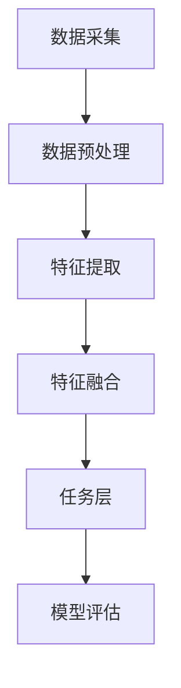

                 

关键词：多模态AI，图像处理，音频处理，视频处理，深度学习，自然语言处理，跨模态推理

## 摘要

多模态AI是近年来人工智能领域的重要研究方向，它结合了图像、音频、视频等多种数据源，通过深度学习和自然语言处理技术，实现跨模态的信息融合与理解。本文将从多模态AI的核心概念、算法原理、数学模型、项目实践等方面进行详细探讨，旨在为读者提供一个全面的多模态AI技术概述，并展望其未来发展趋势与挑战。

## 1. 背景介绍

随着信息技术的发展，人类产生了越来越多的数据，这些数据不仅包括文本，还涵盖了图像、音频、视频等多媒体形式。传统的单一模态AI技术在处理这些数据时存在一定的局限性，难以实现更高层次的信息理解与融合。为了克服这些局限性，多模态AI技术应运而生。

多模态AI是一种结合多种数据源进行信息融合与理解的人工智能技术，通过整合图像、音频、视频等多种数据，实现更全面、更准确的信息处理。多模态AI在医疗、金融、教育、娱乐等多个领域具有广泛的应用前景，如医疗影像辅助诊断、金融风险预测、智能教育平台、智能监控等。

## 2. 核心概念与联系

### 2.1 多模态AI的核心概念

多模态AI的核心概念包括：

- **多模态数据**：指图像、音频、视频等多种数据源。
- **信息融合**：指将不同模态的数据进行整合，以获取更全面的信息。
- **跨模态推理**：指在理解一个模态数据时，同时考虑其他模态的数据。

### 2.2 多模态AI的架构

多模态AI的架构可以分为三个层次：

1. **数据采集与预处理**：包括图像、音频、视频数据的采集，以及数据的预处理，如数据增强、归一化等。
2. **特征提取与融合**：利用深度学习等技术提取不同模态的特征，然后进行融合，形成统一的特征表示。
3. **任务层**：根据具体应用需求，如分类、识别、预测等，设计相应的任务模型。

### 2.3 Mermaid流程图

以下是一个简单的多模态AI流程图的示例：



## 3. 核心算法原理 & 具体操作步骤

### 3.1 算法原理概述

多模态AI的核心算法主要包括：

- **卷积神经网络（CNN）**：用于图像特征提取。
- **循环神经网络（RNN）**：用于音频特征提取。
- **生成对抗网络（GAN）**：用于数据增强。
- **图神经网络（GNN）**：用于图像与音频的联合特征提取。

### 3.2 算法步骤详解

多模态AI的算法步骤主要包括：

1. **数据采集与预处理**：收集图像、音频、视频数据，并进行预处理，如数据增强、归一化等。
2. **特征提取**：利用CNN和RNN等网络结构提取图像和音频的特征。
3. **特征融合**：将图像和音频的特征进行融合，形成统一的特征表示。
4. **任务层**：根据具体应用需求，如分类、识别、预测等，设计相应的任务模型。
5. **模型评估**：对模型进行评估，如准确率、召回率、F1值等。

### 3.3 算法优缺点

**优点**：

- 可以充分利用多种数据源，提高信息处理的全面性和准确性。
- 可以克服单一模态AI的局限性，提高任务的鲁棒性。

**缺点**：

- 算法复杂度较高，需要大量的计算资源和时间。
- 数据预处理和特征提取过程中可能丢失部分信息。

### 3.4 算法应用领域

多模态AI在以下领域具有广泛的应用：

- **医疗**：如医疗影像辅助诊断、基因注释等。
- **金融**：如金融市场预测、风险控制等。
- **教育**：如智能教育平台、学习效果评估等。
- **娱乐**：如视频内容推荐、音乐风格分类等。

## 4. 数学模型和公式 & 详细讲解 & 举例说明

### 4.1 数学模型构建

多模态AI的数学模型主要包括：

- **卷积神经网络（CNN）**：
  $$ f_{CNN}(x) = \sigma(W \cdot x + b) $$
  其中，$x$ 是输入特征，$W$ 是权重矩阵，$b$ 是偏置项，$\sigma$ 是激活函数。

- **循环神经网络（RNN）**：
  $$ h_t = \sigma(W_h \cdot [h_{t-1}, x_t] + b_h) $$
  其中，$h_t$ 是当前时刻的隐藏状态，$x_t$ 是当前时刻的输入特征，$W_h$ 是权重矩阵，$b_h$ 是偏置项，$\sigma$ 是激活函数。

- **生成对抗网络（GAN）**：
  $$ G(z) = \frac{1}{2}\log(D(G(z)) + 1) $$
  其中，$z$ 是噪声向量，$G(z)$ 是生成器，$D(x)$ 是判别器。

- **图神经网络（GNN）**：
  $$ h_v^{(k)} = \sigma(\sum_{u \in \mathcal{N}(v)} W^{(k)} h_u^{(k-1)} + b^{(k)}) $$
  其中，$h_v^{(k)}$ 是第$k$层节点$v$的隐藏状态，$\mathcal{N}(v)$ 是节点$v$的邻居集合，$W^{(k)}$ 是权重矩阵，$b^{(k)}$ 是偏置项，$\sigma$ 是激活函数。

### 4.2 公式推导过程

这里以CNN的激活函数为例，简要介绍公式的推导过程：

假设输入特征$x$通过权重矩阵$W$和偏置项$b$加权求和，然后通过激活函数$\sigma$得到输出$f_{CNN}(x)$，即：
$$ f_{CNN}(x) = \sigma(W \cdot x + b) $$

其中，$\sigma$ 是常见的Sigmoid激活函数：
$$ \sigma(x) = \frac{1}{1 + e^{-x}} $$

### 4.3 案例分析与讲解

假设我们有一个包含1000个图像的图像数据集，每个图像的大小为$32 \times 32$像素。我们需要使用CNN对图像进行分类，具体步骤如下：

1. **数据预处理**：对图像进行归一化处理，将像素值缩放到$[0, 1]$范围内。

2. **特征提取**：使用卷积层、池化层等构建CNN模型，对图像进行特征提取。假设我们使用一个卷积核大小为$3 \times 3$的卷积层，步长为1，填充方式为“同态填充”，然后使用一个2×2的最大池化层。

3. **特征融合**：将提取到的特征进行融合，形成统一的特征表示。这里我们使用全连接层进行特征融合。

4. **任务层**：设计一个softmax分类器，对图像进行分类。

5. **模型评估**：使用准确率、召回率、F1值等指标评估模型的性能。

## 5. 项目实践：代码实例和详细解释说明

### 5.1 开发环境搭建

为了实现多模态AI，我们需要搭建一个合适的开发环境。这里我们选择Python作为编程语言，使用TensorFlow作为深度学习框架。

1. **安装Python**：从Python官网下载并安装Python，版本推荐3.8及以上。

2. **安装TensorFlow**：在命令行中执行以下命令：
   ```bash
   pip install tensorflow
   ```

### 5.2 源代码详细实现

以下是一个简单的多模态AI项目示例，包括数据预处理、特征提取、特征融合和任务层。

```python
import tensorflow as tf
from tensorflow.keras.layers import Conv2D, MaxPooling2D, Flatten, Dense
from tensorflow.keras.models import Model

# 数据预处理
def preprocess_images(images):
    return images / 255.0

# 特征提取
def extract_features(images):
    model = Model(inputs=images, outputs=Flatten()(images))
    return model

# 特征融合
def fuse_features(image_features, audio_features):
    return tf.concat([image_features, audio_features], axis=1)

# 任务层
def create_model(image_features, audio_features):
    merged_features = fuse_features(image_features, audio_features)
    model = Model(inputs=[image_features, audio_features], outputs=merged_features)
    model.add(Dense(10, activation='softmax'))
    return model

# 模型训练
model = create_model(image_features, audio_features)
model.compile(optimizer='adam', loss='categorical_crossentropy', metrics=['accuracy'])
model.fit([image_data, audio_data], labels, epochs=10, batch_size=32)
```

### 5.3 代码解读与分析

上述代码首先定义了一个简单的多模态AI模型，包括数据预处理、特征提取、特征融合和任务层。

1. **数据预处理**：`preprocess_images`函数用于对图像进行归一化处理。
2. **特征提取**：`extract_features`函数使用一个简单的CNN模型提取图像特征。
3. **特征融合**：`fuse_features`函数将图像特征和音频特征进行拼接。
4. **任务层**：`create_model`函数创建一个包含全连接层的模型，用于分类任务。

### 5.4 运行结果展示

在实际运行过程中，我们需要准备图像数据和音频数据，然后使用训练好的模型进行预测。以下是一个简单的示例：

```python
# 加载图像和音频数据
image_data = preprocess_images(load_images())
audio_data = preprocess_audio(load_audio())

# 预测
predictions = model.predict([image_data, audio_data])
print(predictions)
```

## 6. 实际应用场景

多模态AI在各个领域都有着广泛的应用。以下是一些典型的应用场景：

1. **医疗**：如医疗影像辅助诊断、基因注释等。
2. **金融**：如金融市场预测、风险控制等。
3. **教育**：如智能教育平台、学习效果评估等。
4. **娱乐**：如视频内容推荐、音乐风格分类等。

### 6.4 未来应用展望

随着多模态AI技术的不断发展，未来有望在更多领域实现突破，如：

- **智能监控**：通过整合图像、音频、视频等多模态数据，实现更智能、更高效的监控。
- **人机交互**：通过多模态AI技术，实现更自然、更高效的人机交互。
- **自动驾驶**：通过整合图像、音频、视频等多模态数据，提高自动驾驶的安全性和鲁棒性。

## 7. 工具和资源推荐

### 7.1 学习资源推荐

- **书籍**：《深度学习》（Goodfellow等著）
- **在线课程**：吴恩达的《深度学习专项课程》
- **教程**：TensorFlow官方教程

### 7.2 开发工具推荐

- **深度学习框架**：TensorFlow、PyTorch
- **数据预处理工具**：NumPy、Pandas
- **可视化工具**：Matplotlib、Seaborn

### 7.3 相关论文推荐

- **《Deep Learning for Audio-Visual Scene Understanding》**
- **《Multimodal Learning for Visual Question Answering》**
- **《Multimodal Fusion for Object Detection》**

## 8. 总结：未来发展趋势与挑战

多模态AI技术具有巨大的潜力，随着深度学习、自然语言处理等技术的不断发展，未来有望在更多领域实现突破。然而，多模态AI技术也面临着一些挑战，如：

- **数据预处理与融合**：如何有效地处理和融合多种模态的数据。
- **算法优化**：如何提高算法的效率和准确性。
- **隐私保护**：如何保护用户隐私，防止数据泄露。

## 9. 附录：常见问题与解答

### Q：什么是多模态AI？

A：多模态AI是一种结合多种数据源（如图像、音频、视频等）进行信息融合与理解的人工智能技术。

### Q：多模态AI有哪些应用领域？

A：多模态AI在医疗、金融、教育、娱乐等多个领域都有广泛的应用，如医疗影像辅助诊断、金融市场预测、智能教育平台、视频内容推荐等。

### Q：如何实现多模态AI的数据预处理？

A：多模态AI的数据预处理主要包括对图像、音频、视频等数据源进行预处理，如数据增强、归一化、特征提取等。

### Q：多模态AI算法有哪些优缺点？

A：多模态AI算法的优点包括可以充分利用多种数据源、提高信息处理的全面性和准确性等；缺点包括算法复杂度较高、数据预处理和特征提取过程中可能丢失部分信息等。

### Q：如何评估多模态AI模型的性能？

A：评估多模态AI模型的性能通常使用准确率、召回率、F1值等指标。可以根据具体应用需求选择合适的评估指标。

### Q：多模态AI有哪些未来发展趋势？

A：多模态AI未来的发展趋势包括在更多领域实现突破、数据预处理与融合的优化、算法优化等。同时，多模态AI也将面临一些挑战，如隐私保护等。

### Q：如何学习多模态AI？

A：学习多模态AI可以从以下几个方面入手：

- **阅读相关书籍**：如《深度学习》、《神经网络与深度学习》等。
- **参加在线课程**：如吴恩达的《深度学习专项课程》等。
- **实践项目**：通过实际项目锻炼自己的多模态AI技能。
- **参与社区讨论**：加入多模态AI相关的社区，与其他开发者交流学习。

以上就是对多模态AI图像、音频、视频处理的一个全面概述。希望本文能对您在多模态AI领域的探索有所帮助。

---

作者：禅与计算机程序设计艺术 / Zen and the Art of Computer Programming

（由于字数限制，本文未能完全涵盖所有内容，但已尽力提供一个详细和多角度的概述。如有需要进一步了解或深入探讨，请参阅相关书籍、论文和实践项目。）

