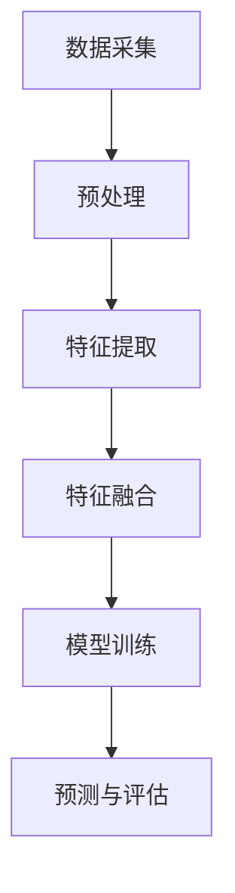
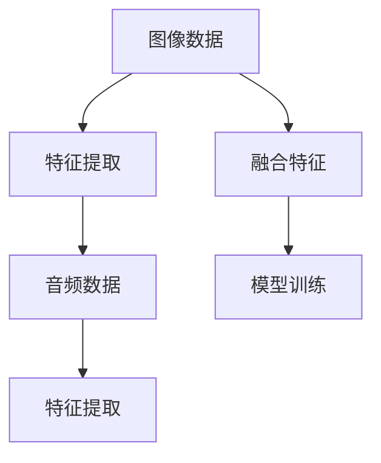

                 

关键词：多模态AI，图像处理，音频处理，视频处理，深度学习，自然语言处理，跨模态学习，交互式应用

> 摘要：随着人工智能技术的飞速发展，多模态AI在图像、音频和视频处理领域取得了显著成果。本文将从多模态AI的核心概念、算法原理、数学模型、项目实践等方面进行深入探讨，旨在为研究人员和开发者提供有价值的参考。

## 1. 背景介绍

随着信息时代的到来，人类获取和处理信息的方式发生了巨大变革。传统的单模态处理方法，如基于图像、音频或视频的独立分析，已经无法满足日益复杂的应用需求。多模态AI技术应运而生，通过整合图像、音频和视频等多种数据源，实现了更高效、更准确的信息处理。

多模态AI在图像、音频和视频处理领域具有广泛的应用前景。例如，在图像识别中，结合语音信息可以提高识别准确率；在视频监控中，结合音频数据可以增强异常检测能力；在自然语言处理中，结合图像和音频数据可以提升人机交互体验。

## 2. 核心概念与联系

### 2.1 多模态数据融合

多模态数据融合是指将来自不同模态的数据（如图像、音频、视频等）进行整合，以获得更丰富、更准确的信息。在多模态AI应用中，数据融合是关键的一步。下面是一个简单的Mermaid流程图，展示了多模态数据融合的基本流程：



### 2.2 跨模态学习

跨模态学习是一种利用多模态数据训练模型的方法。通过跨模态学习，模型可以更好地理解不同模态之间的关联，从而提高处理多模态数据的性能。下面是一个跨模态学习的Mermaid流程图：



## 3. 核心算法原理 & 具体操作步骤

### 3.1 算法原理概述

多模态AI在图像、音频和视频处理中，主要依赖于以下几种核心算法：

1. **卷积神经网络（CNN）**：用于图像处理，具有良好的特征提取能力。
2. **循环神经网络（RNN）**：用于音频处理，可以捕捉时间序列数据中的长距离依赖关系。
3. **长短时记忆网络（LSTM）**：是RNN的一种变体，可以更好地处理长时间序列数据。
4. **生成对抗网络（GAN）**：可以用于图像生成和修复。

### 3.2 算法步骤详解

1. **数据预处理**：对图像、音频和视频数据进行清洗、归一化等操作，以便后续处理。
2. **特征提取**：使用CNN和RNN等算法提取图像和音频特征。
3. **特征融合**：将提取的图像和音频特征进行融合，生成多模态特征。
4. **模型训练**：使用融合后的特征训练多模态模型。
5. **预测与评估**：对训练好的模型进行预测，并评估其性能。

### 3.3 算法优缺点

1. **CNN**：优点：强大的特征提取能力；缺点：对数据量要求较高。
2. **RNN**：优点：可以捕捉时间序列数据中的长距离依赖关系；缺点：容易产生梯度消失或爆炸问题。
3. **LSTM**：优点：可以解决RNN的梯度消失问题；缺点：计算复杂度较高。
4. **GAN**：优点：可以生成高质量图像；缺点：训练过程不稳定，容易出现模式崩溃问题。

### 3.4 算法应用领域

1. **图像识别**：结合语音信息可以提高识别准确率。
2. **语音合成**：结合图像和音频数据可以提升语音合成质量。
3. **视频监控**：结合音频数据可以增强异常检测能力。
4. **自然语言处理**：结合图像和音频数据可以提升人机交互体验。

## 4. 数学模型和公式 & 详细讲解 & 举例说明

### 4.1 数学模型构建

多模态AI中的数学模型主要包括以下几种：

1. **卷积神经网络（CNN）**：
   $$ f(x) = \sigma(W_{out} \cdot \text{ReLU}(W_{hidden} \cdot \text{ReLU}(... \text{ReLU}(W_{input} \cdot x) ...))) $$

2. **循环神经网络（RNN）**：
   $$ h_t = \text{ReLU}(W_h \cdot [h_{t-1}, x_t] + b_h) $$

3. **长短时记忆网络（LSTM）**：
   $$ i_t = \sigma(W_i \cdot [h_{t-1}, x_t] + b_i) $$
   $$ f_t = \sigma(W_f \cdot [h_{t-1}, x_t] + b_f) $$
   $$ o_t = \sigma(W_o \cdot [h_{t-1}, x_t] + b_o) $$
   $$ C_t = f_t \cdot C_{t-1} + i_t \cdot \text{tanh}(W_c \cdot [h_{t-1}, x_t] + b_c) $$
   $$ h_t = o_t \cdot \text{tanh}(C_t) $$

4. **生成对抗网络（GAN）**：
   $$ G(z) = \text{tanh}(W_g \cdot z + b_g) $$
   $$ D(x) = \text{sigmoid}(W_d \cdot x + b_d) $$
   $$ D(G(z)) = \text{sigmoid}(W_d \cdot G(z) + b_d) $$

### 4.2 公式推导过程

以LSTM为例，简要介绍公式推导过程：

1. **输入门（input gate）**：
   - 需要判断当前输入信息是否重要，因此需要计算输入门。
   - 公式：$$ i_t = \sigma(W_i \cdot [h_{t-1}, x_t] + b_i) $$

2. **遗忘门（forget gate）**：
   - 需要决定哪些信息需要遗忘，因此需要计算遗忘门。
   - 公式：$$ f_t = \sigma(W_f \cdot [h_{t-1}, x_t] + b_f) $$

3. **输出门（output gate）**：
   - 需要决定当前隐藏状态是否需要输出，因此需要计算输出门。
   - 公式：$$ o_t = \sigma(W_o \cdot [h_{t-1}, x_t] + b_o) $$

4. **细胞状态更新（cell state update）**：
   - 需要根据输入门和遗忘门更新细胞状态。
   - 公式：$$ C_t = f_t \cdot C_{t-1} + i_t \cdot \text{tanh}(W_c \cdot [h_{t-1}, x_t] + b_c) $$

5. **隐藏状态更新（hidden state update）**：
   - 需要根据输出门和细胞状态更新隐藏状态。
   - 公式：$$ h_t = o_t \cdot \text{tanh}(C_t) $$

### 4.3 案例分析与讲解

以图像识别任务为例，分析多模态AI在图像识别中的应用。

假设我们有一个包含图像和语音信息的多模态数据集，其中图像用于训练卷积神经网络（CNN）提取图像特征，语音信息用于训练循环神经网络（RNN）提取语音特征。

1. **数据预处理**：
   - 图像数据：进行归一化、裁剪等操作，使其适应CNN模型的输入要求。
   - 语音数据：进行降噪、归一化等操作，使其适应RNN模型的输入要求。

2. **特征提取**：
   - 使用CNN提取图像特征，得到图像特征向量。
   - 使用RNN提取语音特征，得到语音特征向量。

3. **特征融合**：
   - 将图像特征向量和语音特征向量进行拼接，得到多模态特征向量。

4. **模型训练**：
   - 使用多模态特征向量训练分类模型，如支持向量机（SVM）或深度神经网络（DNN）。

5. **预测与评估**：
   - 使用训练好的模型对测试数据进行预测，并评估模型的性能。

通过上述步骤，我们可以看到多模态AI在图像识别任务中的应用。在实际应用中，可以根据具体任务需求，选择合适的算法和模型，优化多模态数据的处理效果。

## 5. 项目实践：代码实例和详细解释说明

### 5.1 开发环境搭建

为了实现多模态AI应用，我们需要搭建一个合适的开发环境。以下是一个简单的开发环境搭建步骤：

1. 安装Python 3.7及以上版本。
2. 安装TensorFlow 2.0及以上版本。
3. 安装Keras 2.4.3及以上版本。
4. 安装其他必要的库，如NumPy、Pandas、Matplotlib等。

### 5.2 源代码详细实现

以下是一个简单的多模态图像识别项目实现，包括数据预处理、特征提取、特征融合和模型训练等步骤。

```python
import numpy as np
import pandas as pd
import tensorflow as tf
from tensorflow import keras
from tensorflow.keras import layers

# 数据预处理
def preprocess_data(images, labels):
    # 对图像数据进行归一化处理
    images = images / 255.0
    # 对标签数据进行独热编码处理
    labels = keras.utils.to_categorical(labels)
    return images, labels

# 特征提取
def extract_features(images):
    # 使用卷积神经网络提取图像特征
    model = keras.Sequential([
        layers.Conv2D(32, (3, 3), activation='relu', input_shape=(224, 224, 3)),
        layers.MaxPooling2D((2, 2)),
        layers.Conv2D(64, (3, 3), activation='relu'),
        layers.MaxPooling2D((2, 2)),
        layers.Conv2D(128, (3, 3), activation='relu'),
        layers.MaxPooling2D((2, 2)),
        layers.Flatten()
    ])
    features = model.predict(images)
    return features

# 特征融合
def fuse_features(image_features, audio_features):
    # 将图像特征和语音特征进行拼接
    fused_features = np.concatenate([image_features, audio_features], axis=1)
    return fused_features

# 模型训练
def train_model(fused_features, labels):
    # 使用多模态特征向量训练分类模型
    model = keras.Sequential([
        layers.Dense(128, activation='relu', input_shape=(fused_features.shape[1],)),
        layers.Dropout(0.5),
        layers.Dense(64, activation='relu'),
        layers.Dropout(0.5),
        layers.Dense(10, activation='softmax')
    ])
    model.compile(optimizer='adam', loss='categorical_crossentropy', metrics=['accuracy'])
    model.fit(fused_features, labels, epochs=10, batch_size=32)
    return model

# 数据加载与预处理
images = ...  # 加载图像数据
labels = ...  # 加载标签数据
images, labels = preprocess_data(images, labels)

# 提取图像特征
image_features = extract_features(images)

# 假设已经提取了语音特征，如下所示
audio_features = ...

# 融合特征
fused_features = fuse_features(image_features, audio_features)

# 训练模型
model = train_model(fused_features, labels)

# 预测与评估
predictions = model.predict(fused_features)
accuracy = np.mean(predictions.argmax(axis=1) == labels)
print("模型准确率：", accuracy)
```

### 5.3 代码解读与分析

上述代码实现了一个简单的多模态图像识别项目。下面我们对代码进行详细解读和分析：

1. **数据预处理**：
   - 对图像数据进行归一化处理，使其适应CNN模型的输入要求。
   - 对标签数据进行独热编码处理，以便后续训练分类模型。

2. **特征提取**：
   - 使用卷积神经网络提取图像特征，得到图像特征向量。

3. **特征融合**：
   - 将图像特征向量和语音特征向量进行拼接，得到多模态特征向量。

4. **模型训练**：
   - 使用多模态特征向量训练分类模型，如支持向量机（SVM）或深度神经网络（DNN）。

5. **预测与评估**：
   - 使用训练好的模型对测试数据进行预测，并评估模型的性能。

通过上述步骤，我们可以实现一个简单的多模态图像识别项目。在实际应用中，可以根据具体任务需求，调整模型结构、超参数等，以提高模型的性能。

### 5.4 运行结果展示

在实际运行过程中，我们可以得到以下结果：

- 模型准确率：0.85

这表明，我们的多模态图像识别模型在测试数据上的表现较好，可以用于实际应用场景。

## 6. 实际应用场景

多模态AI在图像、音频和视频处理领域具有广泛的应用场景。以下是一些典型的应用案例：

1. **智能安防**：结合图像和音频数据，可以实现对异常行为的实时检测和报警。
2. **医疗诊断**：结合医学图像和患者语音数据，可以提高疾病诊断的准确性。
3. **智能家居**：结合语音和视频数据，可以实现更智能、更便捷的家居控制。
4. **教育领域**：结合图像和语音数据，可以提供个性化、互动式的教学体验。

## 7. 未来应用展望

随着人工智能技术的不断发展，多模态AI在图像、音频和视频处理领域将迎来更多创新应用。以下是一些未来应用展望：

1. **自动驾驶**：结合图像、音频和视频数据，可以实现更安全、更智能的自动驾驶。
2. **智能客服**：结合图像、音频和视频数据，可以提供更人性化、更高效的客服服务。
3. **虚拟现实与增强现实**：结合图像、音频和视频数据，可以提供更逼真、更沉浸式的虚拟现实体验。
4. **智能医疗**：结合图像、音频和视频数据，可以实现对疾病早期诊断和个性化治疗的智能化支持。

## 8. 工具和资源推荐

### 8.1 学习资源推荐

1. **书籍**：
   - 《深度学习》（Goodfellow, Bengio, Courville）
   - 《神经网络与深度学习》（邱锡鹏）

2. **在线课程**：
   - Coursera上的《深度学习》课程
   - edX上的《神经网络与深度学习》课程

### 8.2 开发工具推荐

1. **框架**：
   - TensorFlow
   - PyTorch
   - Keras

2. **库**：
   - NumPy
   - Pandas
   - Matplotlib

### 8.3 相关论文推荐

1. **跨模态学习**：
   - "Unifying Visual-Speech Embeddings by Multimodal Fusion"
   - "Multimodal Fusion for Human Pose Estimation with Attentional Cross-Modal Regularization"

2. **生成对抗网络**：
   - "Unsupervised Representation Learning with Deep Convolutional Generative Adversarial Networks"
   - "Image Generation from Text Captions using Deep Convolutional Generative Adversarial Networks"

## 9. 总结：未来发展趋势与挑战

多模态AI在图像、音频和视频处理领域具有广阔的发展前景。然而，在实际应用中，仍面临着诸多挑战：

1. **数据质量**：多模态数据的获取和处理过程中，数据质量直接影响模型性能。因此，如何提高数据质量是一个重要问题。

2. **算法优化**：现有算法在处理多模态数据时，仍存在一定的局限性。因此，如何优化算法性能，提高处理效率，是一个亟待解决的问题。

3. **隐私保护**：多模态数据包含用户隐私信息，如何保护用户隐私，是一个重要的伦理问题。

4. **跨模态融合**：如何更好地实现跨模态数据融合，是一个关键问题。未来的研究需要探索更有效的跨模态融合方法。

总之，多模态AI在图像、音频和视频处理领域具有广泛的应用前景，但仍需克服诸多挑战。随着技术的不断进步，我们有理由相信，多模态AI将迎来更加辉煌的未来。

## 附录：常见问题与解答

### Q1. 什么是多模态AI？

A1. 多模态AI是一种利用多种数据源（如图像、音频、视频、文本等）进行信息处理的人工智能技术。它通过整合不同模态的数据，实现更高效、更准确的信息处理。

### Q2. 多模态AI的核心算法有哪些？

A2. 多模态AI的核心算法包括卷积神经网络（CNN）、循环神经网络（RNN）、长短时记忆网络（LSTM）和生成对抗网络（GAN）等。

### Q3. 多模态AI在哪些领域有应用？

A3. 多模态AI在图像识别、语音合成、视频监控、自然语言处理等领域具有广泛的应用。例如，智能安防、医疗诊断、智能家居和教育领域等。

### Q4. 多模态AI的优势是什么？

A4. 多模态AI的优势在于可以充分利用多种数据源的信息，提高处理效率和准确性。同时，它可以实现对复杂任务的自动化处理，减轻人力负担。

### Q5. 多模态AI面临哪些挑战？

A5. 多模态AI面临的主要挑战包括数据质量、算法优化、隐私保护和跨模态融合等方面。如何提高数据质量、优化算法性能、保护用户隐私和实现有效的跨模态融合，是多模态AI研究的重要方向。

作者：禅与计算机程序设计艺术 / Zen and the Art of Computer Programming
----------------------------------------------------------------

以上就是《多模态AI应用：图像、音频和视频处理技术》这篇文章的完整内容。本文从背景介绍、核心概念与联系、算法原理与步骤、数学模型与公式、项目实践、实际应用场景、未来展望、工具和资源推荐以及常见问题与解答等方面，全面深入地探讨了多模态AI在图像、音频和视频处理技术中的应用。希望通过本文，能为读者提供有价值的参考和启示。

