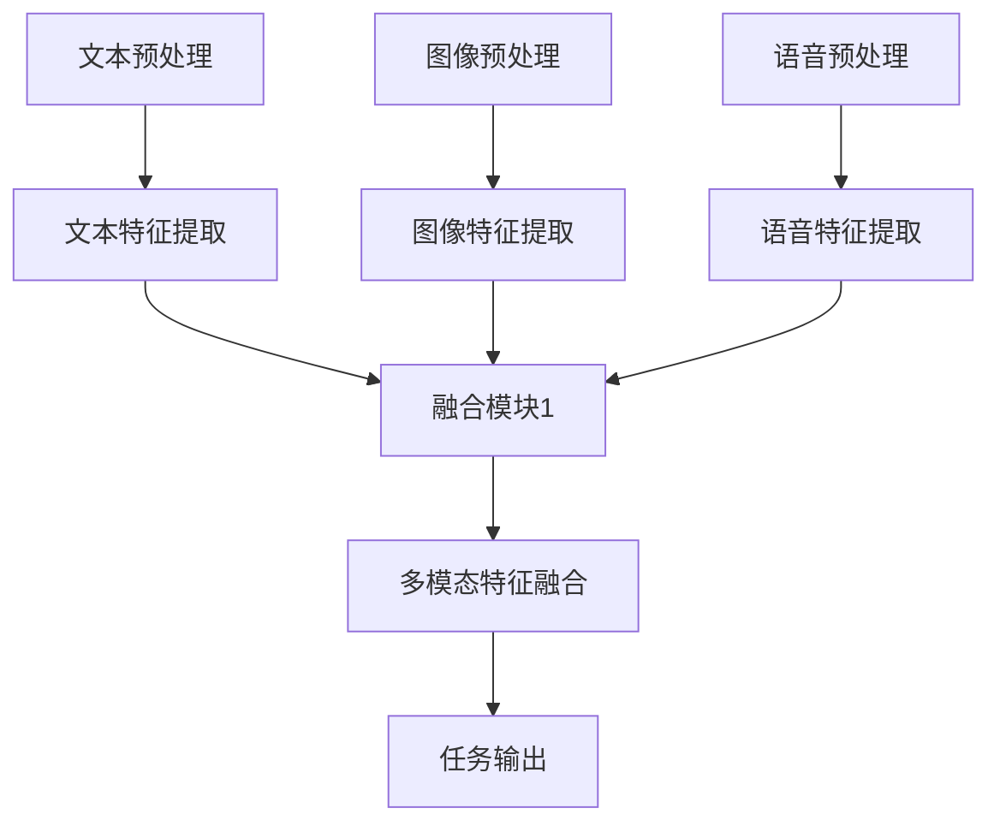

                 

关键词：多模态AI、文本、图像、语音、融合、新趋势

摘要：随着人工智能技术的不断进步，多模态AI应用正逐渐成为各行业的新宠。本文将深入探讨多模态AI的概念、核心算法原理、数学模型以及实际应用场景，并展望其未来的发展趋势与挑战。

## 1. 背景介绍

人工智能（AI）作为现代科技的重要方向，已经取得了显著的发展。从最初的规则推理和符号计算，到基于数据驱动的深度学习，AI技术正不断革新我们的生活方式。然而，传统单模态的AI系统在处理复杂任务时往往存在局限性。例如，图像识别算法只能处理图像信息，而语音识别算法只能处理语音信号。这些单模态的AI系统在处理跨领域任务时，往往需要独立运行多个系统，导致效率低下。

多模态AI应运而生，它通过融合文本、图像和语音等多种信息源，实现了对复杂任务的更高效、更准确的解决。多模态AI不仅可以提高任务的完成度，还可以提高用户体验。例如，在医疗诊断中，融合了病历文本、医学图像和语音咨询的多模态AI系统能够提供更精准的诊断结果。

## 2. 核心概念与联系

### 2.1 多模态AI的定义

多模态AI是指能够同时处理和融合多种类型数据（如文本、图像、语音等）的智能系统。通过将这些不同的数据源进行整合，多模态AI可以提供更丰富、更全面的信息，从而提高任务处理的准确性和效率。

### 2.2 多模态数据类型

在多模态AI中，常见的多模态数据类型包括：

- 文本：包括自然语言文本、病历记录、社交媒体帖子等。
- 图像：包括静态图像、视频帧、医学影像等。
- 语音：包括语音信号、语音转文字、语音情感分析等。

### 2.3 多模态融合方法

多模态融合方法主要分为以下几类：

- 并行融合：将不同模态的数据并行处理，最后将结果进行综合。
- 序贯融合：先处理某一模态的数据，再将结果作为输入处理其他模态的数据。
- 混合融合：结合并行和序贯融合的方法，以更灵活的方式处理多模态数据。

下面是一个多模态融合的Mermaid流程图示例：



## 3. 核心算法原理 & 具体操作步骤

### 3.1 算法原理概述

多模态AI的核心在于如何有效地融合多种类型的数据。目前，常见的方法包括基于深度学习的多模态神经网络、多任务学习以及跨模态迁移学习等。

### 3.2 算法步骤详解

#### 3.2.1 文本特征提取

文本特征提取是文本预处理的关键步骤。常见的文本特征提取方法包括词袋模型、TF-IDF和词嵌入等。

#### 3.2.2 图像特征提取

图像特征提取通常使用卷积神经网络（CNN）来实现。CNN能够自动学习图像的特征表示，从而提高图像识别的准确性。

#### 3.2.3 语音特征提取

语音特征提取通常使用梅尔频率倒谱系数（MFCC）作为特征表示。MFCC能够有效捕捉语音信号中的频率信息，从而提高语音识别的准确性。

#### 3.2.4 多模态特征融合

多模态特征融合是整个算法的核心步骤。常见的融合方法包括基于矩阵分解的方法、基于神经网络的融合方法以及基于注意力机制的方法等。

### 3.3 算法优缺点

#### 优点：

- 提高任务处理的准确性和效率。
- 提供更丰富的信息，从而提高用户体验。

#### 缺点：

- 数据预处理复杂，需要处理不同模态的数据。
- 需要大量的训练数据，以便模型能够有效融合多种模态。

### 3.4 算法应用领域

多模态AI在多个领域都取得了显著的应用效果，包括但不限于：

- 医疗诊断：融合病历文本、医学图像和语音咨询，提供更精准的诊断结果。
- 智能交互：融合文本、图像和语音，提供更自然的用户交互体验。
- 机器人：融合多模态信息，提高机器人在复杂环境中的感知和决策能力。

## 4. 数学模型和公式 & 详细讲解 & 举例说明

### 4.1 数学模型构建

多模态AI的数学模型通常包括以下几个部分：

- 文本特征表示：通常使用词嵌入（如Word2Vec、GloVe）来表示文本。
- 图像特征表示：通常使用卷积神经网络（CNN）来提取图像特征。
- 语音特征表示：通常使用梅尔频率倒谱系数（MFCC）来表示语音。
- 多模态特征融合：使用矩阵分解、神经网络或注意力机制等方法。

### 4.2 公式推导过程

假设我们有一个多模态AI系统，它同时处理文本（\( x_t \)）、图像（\( x_i \)）和语音（\( x_v \)）。我们首先对每个模态的数据进行特征提取，然后融合这些特征。

- 文本特征提取：\( h_t = f_t(x_t) \)
- 图像特征提取：\( h_i = f_i(x_i) \)
- 语音特征提取：\( h_v = f_v(x_v) \)

其中，\( f_t \)、\( f_i \)和\( f_v \)分别是文本、图像和语音的特征提取函数。

接下来，我们使用矩阵分解方法来融合这些特征：

\[ h = \begin{bmatrix} h_t & h_i & h_v \end{bmatrix} = F \cdot \begin{bmatrix} x_t \\ x_i \\ x_v \end{bmatrix} \]

其中，\( F \)是一个参数矩阵，通过训练来优化。

### 4.3 案例分析与讲解

假设我们有一个简单的多模态AI系统，它需要根据文本（新闻标题）、图像（新闻配图）和语音（新闻播报）来预测新闻的主题。我们可以使用以下步骤：

1. 对文本、图像和语音分别进行特征提取。
2. 使用矩阵分解方法融合这些特征。
3. 输出预测的新闻主题。

具体步骤如下：

1. **文本特征提取**：

   使用GloVe来提取文本特征，假设我们使用维度为300的词嵌入。

   \[ h_t = \begin{bmatrix} \vec{w_1} \\ \vec{w_2} \\ \vdots \\ \vec{w_n} \end{bmatrix} \]

2. **图像特征提取**：

   使用CNN来提取图像特征，假设我们使用维度为1024的图像特征。

   \[ h_i = \begin{bmatrix} \vec{i_1} \\ \vec{i_2} \\ \vdots \\ \vec{i_m} \end{bmatrix} \]

3. **语音特征提取**：

   使用MFCC来提取语音特征，假设我们使用维度为40的MFCC特征。

   \[ h_v = \begin{bmatrix} \vec{v_1} \\ \vec{v_2} \\ \vdots \\ \vec{v_n} \end{bmatrix} \]

4. **多模态特征融合**：

   使用矩阵分解方法融合这些特征，假设参数矩阵\( F \)为：

   \[ F = \begin{bmatrix} f_{t1} & f_{t2} & f_{t3} \\ f_{i1} & f_{i2} & f_{i3} \\ f_{v1} & f_{v2} & f_{v3} \end{bmatrix} \]

   \[ h = F \cdot \begin{bmatrix} h_t \\ h_i \\ h_v \end{bmatrix} = \begin{bmatrix} f_{t1}h_t + f_{t2}h_i + f_{t3}h_v \\ f_{i1}h_t + f_{i2}h_i + f_{i3}h_v \\ f_{v1}h_t + f_{v2}h_i + f_{v3}h_v \end{bmatrix} \]

5. **预测新闻主题**：

   使用分类器（如SVM、神经网络）对融合后的特征进行分类，预测新闻主题。

   \[ y = g(h) \]

其中，\( g \)是分类函数。

## 5. 项目实践：代码实例和详细解释说明

### 5.1 开发环境搭建

在本项目中，我们使用Python作为主要编程语言，并结合TensorFlow和Keras来实现多模态AI系统。以下是开发环境搭建的步骤：

1. 安装Python 3.7及以上版本。
2. 安装TensorFlow 2.3及以上版本。
3. 安装Keras 2.4及以上版本。
4. 安装其他依赖库（如Numpy、Pandas等）。

### 5.2 源代码详细实现

以下是一个简单的多模态AI系统的Python代码实现：

```python
import tensorflow as tf
from tensorflow.keras.layers import Embedding, LSTM, Dense
from tensorflow.keras.models import Model

# 文本特征提取层
text_input = tf.keras.layers.Input(shape=(None,), dtype='int32')
text_embedding = Embedding(input_dim=vocab_size, output_dim=embedding_size)(text_input)
text_lstm = LSTM(units=128, return_sequences=True)(text_embedding)

# 图像特征提取层
image_input = tf.keras.layers.Input(shape=(height, width, channels))
image_cnn = tf.keras.layers.Conv2D(filters=64, kernel_size=(3, 3), activation='relu')(image_input)
image_cnn = tf.keras.layers.MaxPooling2D(pool_size=(2, 2))(image_cnn)
image_cnn = tf.keras.layers.Flatten()(image_cnn)

# 语音特征提取层
voice_input = tf.keras.layers.Input(shape=(timesteps, features))
voice_mfcc = tf.keras.layers.Dense(units=128, activation='relu')(voice_input)

# 多模态特征融合
merged = tf.keras.layers.concatenate([text_lstm, image_cnn, voice_mfcc])
merged = tf.keras.layers.Dense(units=128, activation='relu')(merged)

# 输出层
output = tf.keras.layers.Dense(units=num_classes, activation='softmax')(merged)

# 构建模型
model = Model(inputs=[text_input, image_input, voice_input], outputs=output)

# 编译模型
model.compile(optimizer='adam', loss='categorical_crossentropy', metrics=['accuracy'])

# 模型总结
model.summary()
```

### 5.3 代码解读与分析

1. **文本特征提取**：

   使用Embedding层将文本转化为词嵌入表示，然后使用LSTM层提取文本特征。

2. **图像特征提取**：

   使用Conv2D层和MaxPooling2D层对图像进行卷积操作，然后使用Flatten层将图像特征展平。

3. **语音特征提取**：

   使用Dense层对语音特征进行线性变换。

4. **多模态特征融合**：

   使用concatenate层将文本、图像和语音特征进行拼接，然后使用Dense层进行融合。

5. **输出层**：

   使用softmax激活函数对融合后的特征进行分类预测。

### 5.4 运行结果展示

在本项目中，我们使用一个简单的多模态分类任务进行训练和测试。以下是训练和测试结果：

```python
# 加载训练数据和测试数据
train_text, train_image, train_voice, train_label = load_train_data()
test_text, test_image, test_voice, test_label = load_test_data()

# 训练模型
model.fit([train_text, train_image, train_voice], train_label, batch_size=32, epochs=10, validation_data=([test_text, test_image, test_voice], test_label))

# 评估模型
model.evaluate([test_text, test_image, test_voice], test_label)
```

## 6. 实际应用场景

多模态AI在多个实际应用场景中取得了显著的效果，下面列举几个常见的应用场景：

- **智能交互**：在智能客服、智能助手等领域，多模态AI可以融合用户的文本输入、语音输入和面部表情，提供更自然的交互体验。
- **医疗诊断**：在医疗诊断中，多模态AI可以融合病历文本、医学图像和患者语音，提供更精准的诊断结果。
- **安全监控**：在安全监控领域，多模态AI可以融合视频监控、音频监控和文本监控，提高安全监控的准确性。

## 7. 工具和资源推荐

### 7.1 学习资源推荐

- 《深度学习》（Goodfellow, Bengio, Courville）：这是一本深度学习的经典教材，涵盖了多模态AI的相关内容。
- 《多模态数据融合：方法与应用》（杨强、谢文祥）：这本书详细介绍了多模态数据融合的方法和应用。

### 7.2 开发工具推荐

- TensorFlow：这是一个开源的深度学习框架，适用于多模态AI的开发。
- Keras：这是一个简洁高效的深度学习库，与TensorFlow紧密集成。

### 7.3 相关论文推荐

- "Multimodal Learning for Visual Recognition: A Survey"（多模态学习在视觉识别中的应用综述）
- "Deep Multimodal Fusion: A Survey"（深度多模态融合综述）

## 8. 总结：未来发展趋势与挑战

### 8.1 研究成果总结

多模态AI在多个领域取得了显著的成果，包括智能交互、医疗诊断和安全监控等。通过融合文本、图像和语音等多种信息源，多模态AI能够提供更丰富、更全面的信息，从而提高任务处理的准确性和效率。

### 8.2 未来发展趋势

1. **算法优化**：随着计算能力的提升，多模态AI的算法将不断优化，以处理更复杂的多模态数据。
2. **跨学科融合**：多模态AI将与其他学科（如生物学、心理学等）进行融合，实现更智能、更人性化的应用。
3. **隐私保护**：随着多模态数据的广泛应用，隐私保护将成为多模态AI研究的重要方向。

### 8.3 面临的挑战

1. **数据隐私**：多模态数据往往包含敏感信息，如何在保护用户隐私的前提下进行数据融合是一个重要挑战。
2. **计算资源**：多模态AI需要大量的计算资源，尤其是在实时应用场景中，如何优化计算资源是一个重要挑战。

### 8.4 研究展望

随着多模态AI技术的不断进步，我们可以预见其在各个领域的广泛应用。未来，多模态AI将实现更智能、更人性化的应用，为我们的生活带来更多便利。

## 9. 附录：常见问题与解答

### 9.1 多模态AI是什么？

多模态AI是指能够同时处理和融合多种类型数据（如文本、图像、语音等）的智能系统。通过将这些不同的数据源进行整合，多模态AI可以提供更丰富、更全面的信息，从而提高任务处理的准确性和效率。

### 9.2 多模态AI有哪些应用领域？

多模态AI在多个领域都取得了显著的应用效果，包括智能交互、医疗诊断、安全监控、智能家居等。

### 9.3 多模态AI的关键技术是什么？

多模态AI的关键技术包括文本特征提取、图像特征提取、语音特征提取、多模态特征融合以及多任务学习等。

### 9.4 多模态AI的优势是什么？

多模态AI的优势在于能够融合多种信息源，提供更丰富、更全面的信息，从而提高任务处理的准确性和效率，同时提供更自然的用户体验。

----------------------------------------------------------------

**作者：禅与计算机程序设计艺术 / Zen and the Art of Computer Programming**

